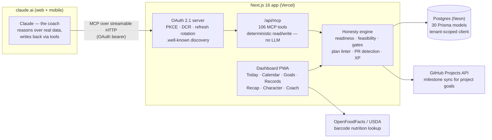
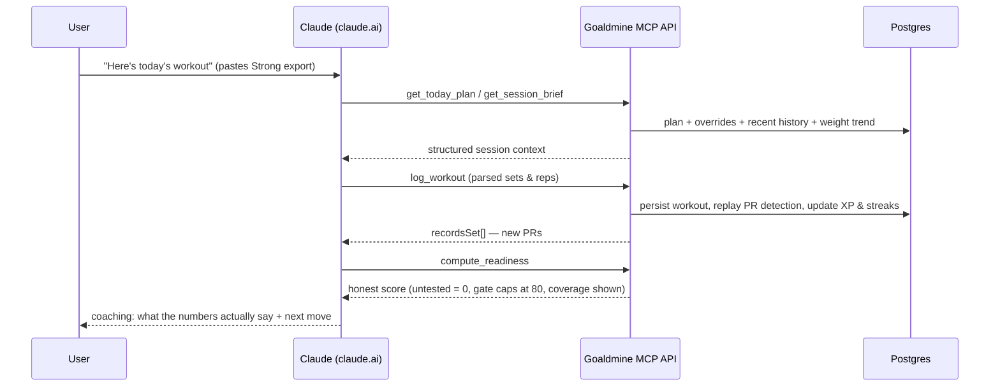

# Goaldmine ⛏️

**An AI-coached goal engine with zero LLM calls inside the app.**

Goaldmine started as a personal Mt. Elbert training planner and grew into a generic platform for pursuing *any* measurable goal — a fitness peak, a software launch, a creative project — with a coach that tells you the truth about where you actually stand.

The architectural twist: **the app contains no LLM calls, no API keys, and no per-token cost.** Claude does all of its reasoning in **claude.ai**, connected to the app as a first-class OAuth connector, reading and writing through a **106-tool MCP server** the app exposes. The app itself is a deterministic logger, dashboard, and honesty engine — you get a frontier-model coach for $0 beyond an existing Claude subscription.

> Repo/package legacy name: `workout-planner`. Product name: **Goaldmine**.

---

## At a glance

| | |
|---|---|
| **What it is** | Goal tracker + coaching dashboard + MCP server that an AI coach drives |
| **Stack** | Next.js 16 (App Router) · React 19 · TypeScript (strict) · Tailwind v4 · Prisma 7 · Postgres (Neon) |
| **AI integration** | `@modelcontextprotocol/sdk` — 106 read/write tools, streamable HTTP |
| **Auth** | Hand-built **OAuth 2.1 authorization server** (PKCE, dynamic client registration, refresh rotation) + Auth.js with Google sign-in, invite-gated multi-tenant |
| **Testing** | ~540 Vitest unit tests across 32 files |
| **Cost to run** | $0 marginal — no LLM calls in the app |

---

## Architecture



- **No LLM in the app.** Every MCP tool is a pure, validated (Zod) read or write. All reasoning lives in the claude.ai conversation.
- **Multi-tenant by construction:** a scoped Prisma client enforces `userId` filtering on every owned model, backed by isolation tests and standalone verification scripts.
- **Timezone-correct:** every date helper routes through one calendar module, because Vercel runs UTC and training days don't.

### The coaching loop



---

## Why it's different — three moats

1. **Intellectual honesty ("no sugar-coating").** Most trackers flatter you. Goaldmine refuses: an untested target counts as **0** (never a false 100%), a hard **gate** caps the headline score at 80 until it clears, coverage (`{tested, total}`) is always shown, and a **feasibility** read tells you when your target date is a fantasy ("at your logging pace you reach ~62% by Sep 30 — this is a stretch"). The math that tells you the truth is unit-tested.
2. **The AI-coach loop.** `claude.ai ⇄ /api/mcp` is something no tracker has — the coach reasons over your real data and writes back: workouts, plan revisions, day overrides, reviews, open items, nudges, even bonus XP. All reasoning lives in the conversation; the app stays LLM-free.
3. **Goal-genericity.** One schema (`GoalTarget`: metric / target / weight / direction / gating) + one `computeReadiness` + one generic metric path serve every domain. Open a fitness goal and the recap reads `WORKOUTS / VOLUME / PRs`; open a software-launch goal and the *same* engine reads `MRR / MILESTONES`, with GitHub Projects milestone sync. Kind-aware surfaces, one engine.

---

## Engineering highlights

- **A hand-built OAuth 2.1 authorization server** — so claude.ai connects as a proper OAuth connector rather than a shared secret: PKCE (S256), dynamic client registration with a redirect-host allowlist, hashed single-use auth codes, **refresh-token rotation with family-based replay detection**, RFC 8707 audience binding, and `.well-known` discovery endpoints. The whole suite is unit-tested.
- **The honesty/readiness engine** (`src/lib/readiness.ts`, `rarity-core.ts`) — pure, client-safe functions computing gated readiness, per-target feasibility tiers (common → legendary), decrease-direction metrics, and compound gates (e.g. "hike-prep" requires qualifying hikes ≥ 5 mi / 2,000 ft gain with a 15 lb pack).
- **A plan linter the coach runs on itself** (`plan-lint.ts`) — before Claude writes a plan revision, `lintTemplate()` vets it: weeks that don't tile, unanchored retests, baseline-vs-heavy-day collisions, orphaned overrides, phantom values. Findings can be acknowledged and persist on the plan.
- **Auditable plan revisions** — every plan change stores a full post-change snapshot with its trigger and reasoning; per-day overrides layer over the plan JSON with orphan-detection, and revision diffs render in the UI.
- **Deterministic Strong-app parser + round-trip formatters** — paste a Strong txt export in claude.ai, Claude parses it into structured sets, `log_workout` persists it, and the `strong` formatter reproduces the original format. Regression-tested against real exports.
- **Gamification engine** (`src/lib/game/`) — XP curves per attribute, a day-ledger that replays PRs, streaks, 16 badges with pure unlock predicates, and a character page; the coach can grant bonus XP through a tool.
- **Nutrition with barcode scanning** — zxing-wasm scanner in the browser → OpenFoodFacts/USDA lookup → a shared food catalog with per-user usage history (split for tenant isolation).
- **Shareable recap pipeline** — footage markers tag which clip is which moment on a day; a `DayRenderJob` queue manages a full render lifecycle (pending → claimed → drafted → approved → rendered); and a server-rendered (resvg) 9:16 recap card ships with auto-captions and Web Share.
- **Ops discipline unusual for a side project** — a `db-guard` script that refuses to migrate anything but a development database branch, tenant-isolation verification scripts, rate limiting (Upstash, fails open), and a `docs/project-gotchas.md` capturing hard-won traps.
- **~540 unit tests** covering the readiness math, game engine scenarios, MCP read-leak safety (reads must not leak private note types), goal presentation, plan integrity, tenant isolation, and the full OAuth suite.

---

## The MCP surface (106 tools)

Registered in `src/lib/mcp/tools.ts` (+ GitHub / project / render packs). A sampler:

| Category | Tools (excerpt) |
|----------|-----------------|
| Session context | `get_today_plan` (kind-routes fitness vs project payloads), `get_session_brief`, `recent_history`, `weekly_summary_data` |
| Honest math | `compute_readiness`, `preview_goal_feasibility`, `get_rarity`, `lint_plan` |
| Logging | `log_workout` (returns new PRs), `log_hike`, `log_baseline`, `log_nutrition`, `log_note`, `log_metric` |
| Plan control | `apply_plan_revision`, `apply_day_override`, `confirm_week`, `baseline_ops` / `workout_ops` (batched mutations) |
| Goals | `create_goal`, `update_goal_targets`, `promote_note_to_goal`, `set_goal_feasibility` |
| Project pack | `schedule_item`, `complete_item`, `link_github_project`, `sync_github_milestones`, `set_github_issue_status` |
| Media & recap | `generate_recap_card`, `log_footage`, `queue_render_job` → `complete_render_job` |
| Game | `get_game_state`, `grant_bonus_xp` |

Connect from claude.ai → custom connector → `https://<deployment>/api/mcp` (OAuth, or legacy bearer token). Smoke-test locally:

```bash
curl -s -X POST http://localhost:3000/api/mcp \
  -H "Authorization: Bearer $MCP_AUTH_TOKEN" \
  -H "Content-Type: application/json" \
  -H "Accept: application/json, text/event-stream" \
  -d '{"jsonrpc":"2.0","id":1,"method":"tools/list"}' | python3 -m json.tool | head -40
```

---

## The dashboard

Mobile-first PWA. Highlights: **Today** (session brief + celebrations), **Calendar** and per-day detail with logging forms and footage markers, **Goals** with plan view, revision diffs, and trend charts (Recharts + custom SVG viz: bullseye, reach meter, readiness breakdown), **Baselines** with retest scheduling, **Records**, **Character** (levels, attributes, badges), **Recap** (shareable card), **Coach** (proactive-coach nudges), Strong **import**, **Nutrition** with barcode scan, and invite-gated onboarding with Google sign-in.

---

## Data model

30 Prisma models. The load-bearing ones:

| Group | Models |
|-------|--------|
| Logging | `Workout → WorkoutExercise → Set`, `Measurement`, `BodyMetric`, `Baseline`, `Hike`, `MobilityCheckin`, `NutritionLog` |
| Goal engine | `Goal` (kind: fitness \| project, JSON targets/feasibility), `ScheduledItem` (GitHub-synced milestones), `LogEntry` (generic metric series) |
| Planning | `Plan` (planJson + confirmed high-water mark), `PlanDayOverride`, `PlanRevision` (snapshot + reasoning), `Program` |
| Media | `FootageMarker`, `DayRenderJob` (render lifecycle) |
| Nutrition | `FoodLibrary` (shared catalog) + `FoodUsage` (per-user) |
| Auth | `User` + Auth.js models, `Invite`, and `OAuthClient / AuthCode / AccessToken / RefreshToken` |

---

## Getting started

```bash
npm install
cp .env.example .env          # see the env table below

npx prisma generate           # regenerate the client after any schema edit
npm run db:migrate            # guarded: refuses non-development databases
npm run db:seed               # seed the program (idempotent)

npm run dev                   # http://localhost:3000
```

| Task | Command |
|------|---------|
| Dev server | `npm run dev` |
| Unit tests | `npm run test` (Vitest, ~540 tests) |
| Typecheck / lint / build | `npx tsc --noEmit` · `npm run lint` · `npm run build` |
| Which DB am I on? | `npm run db:which` |
| Migration / seed | `npm run db:migrate` · `npm run db:seed` (both db-guarded) |
| Tenant-isolation audit | `npm run db:verify-isolation` |

### Environment

| Variable | Purpose |
|----------|---------|
| `DATABASE_URL`, `DB_ENV` | Neon Postgres connection + db-guard environment tag |
| `AUTH_SECRET`, `AUTH_GOOGLE_ID`, `AUTH_GOOGLE_SECRET` | Auth.js + Google sign-in |
| `MCP_AUTH_TOKEN` | Legacy bearer auth for `/api/mcp` (OAuth is the primary path) |
| `CANONICAL_ORIGIN`, `ALLOWED_REDIRECT_HOSTS`, `MAX_OAUTH_CLIENTS` | OAuth server config |
| `OPEN_SIGNUP`, `FOUNDER_USER_ID`, `FOUNDER_GOOGLE_EMAIL` | Invite gate / founder account |
| `GITHUB_TOKEN` | GitHub tool pack for project goals (PAT: `repo` + `read:project`) |
| `UPSTASH_REDIS_REST_URL`, `UPSTASH_REDIS_REST_TOKEN` | Rate limiting (fails open if absent) |

---

## Project structure

```
src/app/                 App Router pages (Today, Calendar, Goals, Records, Recap,
                         Character, Coach, Nutrition, Baselines, Import, Onboarding…)
  api/mcp/               the MCP HTTP endpoint
  oauth/                 authorize · token · register · revoke (+ .well-known discovery)
src/lib/                 calendar · db (tenant-scoped) · readiness · rarity-core ·
                         records · plan/lint/revisions · recap · game/ · oauth/ · auth/
  mcp/                   tools.ts (registrations) · instructions · today-shapers ·
                         tools/ (github, project, render packs)
  parsers/ formatters/   Strong-app parser + round-trip export formatters
src/components/          mobile-first UI (BottomNav, day forms, charts, BarcodeScanner…)
prisma/                  schema.prisma (30 models) · migrations · seed.ts
scripts/                 db-guard · tenant-isolation verifiers · invite minting · inspectors
docs/                    PRDs, roadmap, coaching, qa, ux-research, integrations, gotchas
```

---

## Docs

- [`docs/project-gotchas.md`](docs/project-gotchas.md) — the non-obvious traps
- [`docs/roadmap/multi-domain-transformation-brief.md`](docs/roadmap/multi-domain-transformation-brief.md) — the strategic direction
- [`docs/coaching/proactive-coach-routine.md`](docs/coaching/proactive-coach-routine.md) — the Sunday routine
- [`docs/coaching/coach-operating-manual.default.md`](docs/coaching/coach-operating-manual.default.md) — the coach's reasoning-discipline instructions
- `docs/prds/` — per-feature PRDs · `docs/qa/` — QA gates

> Note: Next 16 + Prisma 7 are recent — the Prisma generator is `prisma-client` (not `-js`) and the datasource URL lives in `prisma.config.ts`, not the schema.

---

## Status

The multi-domain engine is substantially built: the honesty math (readiness + feasibility) is unit-tested; multi-user auth (OAuth 2.1 + Google sign-in + invite gate + tenant isolation) is live; the recap pipeline (recap card → proactive nudge → render-job queue) ships end to end; goal-kind-aware surfaces and the GitHub Projects integration are in. Next up: goal-interview onboarding.

Mobile-first, **$0 marginal cost beyond an existing Claude subscription**. Neon is shared with prod — every migration is semi-prod; `db-guard` enforces it, but validate the SQL diff anyway.
