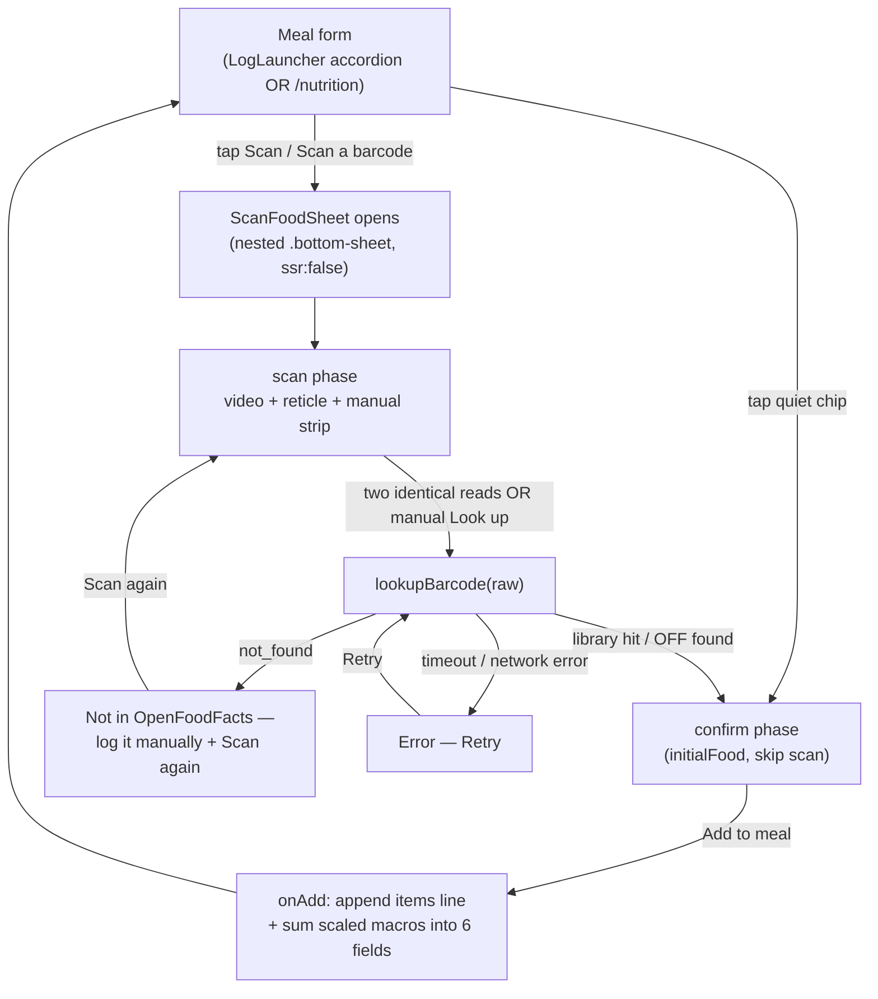
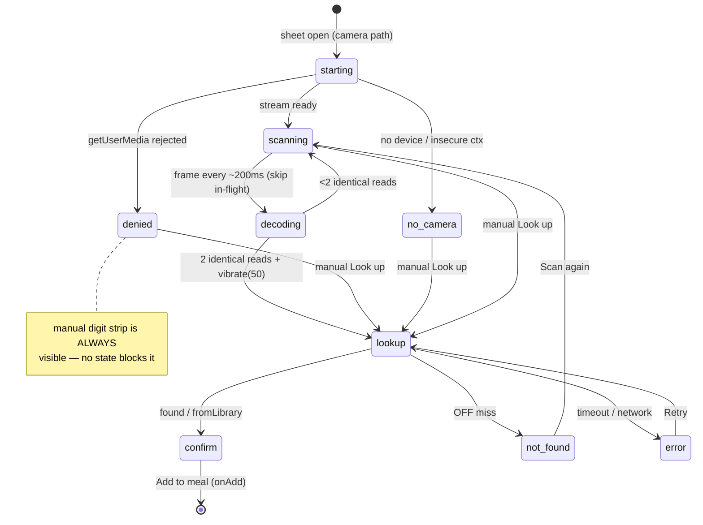
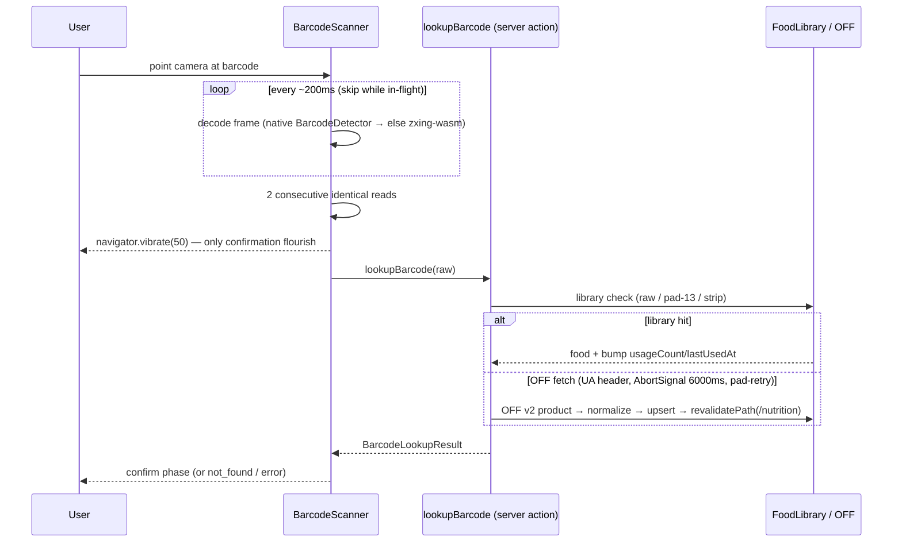

# UX Research — Barcode Scan → OpenFoodFacts Macros + Personal Food Library

**Slug:** `barcode-food-library` · **PRD:** `docs/prds/PRD-barcode-food-library.md` (§9 open questions) · **Issue:** [#66](https://github.com/jronnomo/goaldmine/issues/66)
**Scope:** the four §9 surfaces only — a *utilitarian capture flow*, not a hero feature. Restraint gate applied hard.
**Pixel artifact:** [`barcode-food-library.html`](./barcode-food-library.html) (real `globals.css` tokens, light+dark toggle).
**Ledger:** [`barcode-food-library-ledger.md`](./barcode-food-library-ledger.md).

> Product thesis (verbatim, governs everything): *The app is a fast, honest logger + dashboard for ONE user; all reasoning happens in claude.ai over MCP — the app itself makes no LLM calls and must stay cheap, server-rendered, and dead-simple to use on a phone mid-workout. ... Visual identity = the Bullseye/target "mining for goals" motif; motion is deliberately minimal CSS, spent on genuine completion moments (the once-per-day bullseye-pop), not decoration.*

---

## 1. Current-State Audit

| # | Finding | `file:line` | User impact |
|---|---------|-------------|-------------|
| A1 | Macro entry is six bare numeric fields the user types by hand on a phone | `src/components/MacroInputs.tsx:1-40` (`grid grid-cols-3`, `type="number"`, `text-base`) | The exact friction this feature removes. Six taps + recall per meal; macros usually left blank. |
| A2 | Meal form has no fast path for repeat/staple foods | `src/components/LogNutritionForm.tsx:55-68` (textarea + `<MacroInputs/>`) | Daily staples (Oikos, PB) get re-typed every time. The form has only `mealType → items → notes → macros`. |
| A3 | Form is hosted in **two** places and both must get the chips + scan | `src/components/LogLauncher.tsx:114` (accordion embed) and `src/app/nutrition/page.tsx:59` (Card embed) | Any chips-row / Scan affordance has to render identically in the Log sheet accordion *and* on `/nutrition`. |
| A4 | The chips row will live in tight vertical space inside the Log accordion | `LogLauncher.tsx:111-117` (`px-4 pb-4 pt-1`, opened inside `BottomSheet` `max-h-85vh`) | Vertical budget is scarce when the meal accordion is open inside the sheet → chips must be one compact horizontal strip, not a wrapping grid. |
| A5 | Reuse primitives already exist and are strong | `BottomSheet.tsx` (native `<dialog>`, slide 240ms), `Card.tsx` (`rounded-2xl border bg-card`), `ConfirmButton.tsx` (≥44px enforced) | Nothing new needs to be invented for the sheet, card, or confirm button. The nested ScanFoodSheet rides the existing `.bottom-sheet` CSS. |
| A6 | Icon + type conventions are fixed | hand-rolled SVG 20px `stroke-1.5` (`LogLauncher.tsx:43-70`), DM Serif = titles only (`globals.css`/`layout.tsx`), inputs `text-base` to avoid iOS zoom (`MacroInputs.tsx:33`) | Scan/torch glyphs must be hand-rolled 20px stroke-1.5 — **no icon lib, no emoji** (this is a correction to the PRD §5.1 example which showed `🧀`/`🥜`). |

**Token reality (from `src/app/globals.css`), both sides — every mockup below assumes these:**

| token | light | dark |
|-------|-------|------|
| `--background` | `#FAF3E3` cream | `#0F0B07` coal |
| `--foreground` | `#1F1408` | `#F4E9D4` |
| `--muted` | `#7A5E3A` | `#9C8866` |
| `--card` | `#FFFBF0` | `#1A130C` |
| `--border` | `#D9C8A2` | `#3A2E1F` |
| `--accent` | `#8A6212` gold | `#D4A437` gold |
| `--accent-fg` | `#FFFBF0` | `#0F0B07` |
| `--accent-soft` | `rgba(138,98,18,.14)` | `rgba(212,164,55,.12)` |
| `--target` | `#A82A1F` barn-red | `#C0392B` |
| `--warning` | `#A8511A` | `#E0915C` |

---

## 2. Chosen Direction (one paragraph)

**Quiet capture, loud nothing.** The Scan affordance is the only genuinely *new* primary action, so it is pinned (never scrolls out of reach) and carries the single accent treatment in the row; recent-food chips sit beside it as deliberately *quiet* bordered pills (name + small brand, no emoji) that scroll horizontally behind a token-fade edge. The scanner is a **framed viewfinder** inside the existing nested BottomSheet — the camera is contained in a rounded card with corner-bracket reticle, and the manual digit strip sits co-equal directly below it (never buried), so permission-denied / no-camera degrade with zero ceremony. The confirm phase mirrors the existing `MacroInputs` 3-column grid so the scaled preview reads as *"these numbers are about to fill those fields,"* with a quiet calorie emphasis and a chunky ≥44px stepper. No new animation: the nested sheet reuses the 240ms `.bottom-sheet` slide; the only feedback flourish is the PRD's `navigator.vibrate(50)` on a confirmed read. **Grafted from runners-up:** the *calorie-hero* idea from Confirm Option C (kept as a restrained emphasis, not a giant number) and the *full-bleed immersive* camera instinct from Viewfinder Option C (kept only as an optional dark-chrome flag, default = framed).

---

## 3. Phase-A Options (divergent ASCII, 390px, both themes)

Each block is one *competing direction* for a §9 surface. We narrow to one per surface. Tokens annotated; the `.html` artifact renders both themes literally.

### Q1 — Quick-pick chips row

<details open><summary><b>Option A — Pinned Scan + scrolling quiet chips (CHOSEN)</b></summary>

```
LogNutritionForm (390px)  — between mealType select and items textarea
┌──────────────────────────────────────────────┐
│ [ Lunch                                  ▾ ]  │  mealType (unchanged)
│                                                │
│ ┌────────┐ ┌──────────┐ ┌──────────┐ ┌──── ░ │  chips row  h=48px
│ │ ▣ Scan │ │ Oikos    │ │ PB       │ │ Eggs  ░│  ← ░ = token fade
│ │        │ │ Danone   │ │ Jif      │ │ ...   ░│     (more →)
│ └────────┘ └──────────┘ └──────────┘ └──── ░ │
│   ▲pinned    ◀── horizontal scroll ──────────►│
│                                                │
│ ┌────────────────────────────────────────────┐│
│ │ One item per line. Optional qty after a | … ││  items textarea
│ └────────────────────────────────────────────┘│
└──────────────────────────────────────────────┘
Scan chip : bg var(--accent-soft) · text/icon var(--accent) · 1px var(--accent) border · rounded-full · ▣ = 20px viewfinder glyph stroke-1.5
Food chip : bg transparent · 1px var(--border) · rounded-full · name=text-sm var(--foreground) medium (truncate ≤14ch) · brand=text-[11px] var(--muted) (truncate)
Row       : overflow-x-auto · -webkit-overflow-scrolling:touch · gap-2 · py-1 · snap-x optional
Fade ░    : 24px right mask, linear-gradient(to right, transparent, var(--card)) — pinned over scroll edge
LIGHT: chips border #D9C8A2 on card #FFFBF0; Scan #8A6212 on rgba(138,98,18,.14)   DARK: chips border #3A2E1F on card #1A130C; Scan #D4A437 on rgba(212,164,55,.12)
```
Why: the new action stays thumb-reachable regardless of scroll; chips stay subordinate (recent foods are convenience, not the headline). Solves Q1 **and** Q4 reachability in one structure.
</details>

<details><summary>Option B — Trailing Scan (literal PRD reading)</summary>

```
│ ┌────────┐ ┌────────┐ ┌────────┐ … ┌────────┐ │
│ │ Oikos  │ │ PB     │ │ Eggs   │ … │ ▣ Scan │ │
│ └────────┘ └────────┘ └────────┘ … └────────┘ │
```
Rejected: with ≤8 chips scrolling at 390px the Scan button is **off-screen at rest** → the primary new action is undiscoverable until you scroll to the end. Fails the "dead-simple mid-workout" thesis.
</details>

<details><summary>Option C — Scan as full-width bar above chips</summary>

```
│ [  ▣  Scan a barcode                         ] │  full-width accent-soft bar
│ ┌────────┐ ┌────────┐ ┌────────┐ ────────────► │  quiet chips below
```
Rejected for the *non-empty* case: costs a whole extra row of the scarce accordion vertical budget (A4). **Kept for the empty case** — see Q4.
</details>

### Q2 — Scanner viewfinder (nested BottomSheet)

<details open><summary><b>Option B — Framed viewfinder card, co-equal manual strip (CHOSEN)</b></summary>

```
ScanFoodSheet  (nested .bottom-sheet, max-w-md)
┌──────────────────────────────────────────────┐
│ Scan a barcode                            ✕   │  sheet header (reused)
├──────────────────────────────────────────────┤
│ ┌──────────────────────────────────────[⚡]─┐ │  video frame rounded-xl
│ │ ⌐                                       ¬ │ │  ← torch top-right (if cap.)
│ │            (live camera video)            │ │  aspect ~4:3
│ │     ╔══════════════════════════════╗      │ │  reticle = wide barcode
│ │     ║   point at the barcode       ║      │ │     corner brackets accent
│ │     ╚══════════════════════════════╝      │ │
│ │ �states: starting · scanning · denied⌐    │ │
│ │ L                                       ⌡ │ │
│ └──────────────────────────────────────────┘ │
│  Point at the barcode·····(aria-live status)  │  status text, var(--muted)
│                                                │
│ ── or enter digits ─────────────────────────  │  divider, var(--border)
│ ┌──────────────────────────┐ ┌─────────────┐ │  manual strip — ALWAYS shown
│ │ 0 1 2 3 4 5 6 7 8 9 0 1 2 │ │  Look up    │ │  inputMode=numeric · btn≥44px
│ └──────────────────────────┘ └─────────────┘ │
└──────────────────────────────────────────────┘
Video frame : 1px var(--border) · rounded-xl · object-cover · aria-hidden (decorative)
Reticle     : 2px var(--accent) corner brackets, wide landscape (barcodes are wide, not square); NO animated laser line
Torch [⚡]  : 36px round, bg rgba(0,0,0,.35), icon var(--accent-fg)/white, top-right inside frame, only when track.getCapabilities().torch
Status      : aria-live=polite below frame — starting→"Starting camera…" · scanning→"Point at the barcode" · denied→"Camera access denied — enter the digits below" · no-camera→"No camera — enter the digits below"
Manual btn  : bg var(--accent) text var(--accent-fg) rounded-lg
LIGHT: frame border #D9C8A2, reticle #8A6212 on card #FFFBF0   DARK: frame border #3A2E1F, reticle #D4A437 on card #1A130C
```
Why: keeps the camera *contained* and on-brand (card aesthetic), and makes the manual fallback a peer, not a buried escape hatch — honoring "states never block manual entry" (§3.1.5) and the honest-logger thesis.
</details>

<details><summary>Option A — Overlay-minimal (status pill floats on video, manual below)</summary>
Rejected: status overlaid on live video is hard to read against arbitrary packaging colors and fails AA unpredictably; pulls the manual strip lower/feels secondary.
</details>

<details><summary>Option C — Full-bleed immersive dark chrome</summary>
Rejected as default (cartoon-scanner vibe, fights the neutral cream/gold brand) — but its instinct (camera context is inherently dark) is preserved as an **optional** `prefers` dark-chrome flag on the frame only. See ledger row 07/decoration⚠.
</details>

### Q3 — Confirm phase (food card + stepper + scaled preview)

<details open><summary><b>Option A — MacroInputs-mirrored preview grid (CHOSEN, calorie emphasis grafted from C)</b></summary>

```
ScanFoodSheet · confirm phase
┌──────────────────────────────────────────────┐
│ Add food                                  ✕   │
├──────────────────────────────────────────────┤
│ ┌────────────────────────────────────────────┐│  food card (reuse Card)
│ │ Oikos Triple Zero Vanilla                  ││  name text-base semibold
│ │ Danone · 1 container (150 g)               ││  brand·serving var(--muted)
│ └────────────────────────────────────────────┘│
│                                                │
│ Servings        ┌────┐  ┌──────┐  ┌────┐       │  stepper ≥44px each
│                 │ −  │  │  1   │  │ +  │       │  0.5 steps · min 0.5
│                 └────┘  └──────┘  └────┘       │  − disabled at 0.5
│                                                │
│   ┌──────────────────────────────────────┐    │  scaled preview — MIRRORS
│   │  CAL      PROTEIN    CARBS            │    │  MacroInputs 3-col grid
│   │  120        15 g      9 g             │    │  cal = quiet emphasis
│   │  FAT       FIBER     SODIUM           │    │  nulls render "—"
│   │   0 g       —        65 mg            │    │
│   └──────────────────────────────────────┘    │
│                                                │
│ [          Add to meal                    ]    │  accent primary btn
└──────────────────────────────────────────────┘
Food card  : reuse Card (rounded-2xl border bg-card). name sans semibold (NOT DM Serif — titles-only rule). null fields → "—"
Stepper    : 3 cells, each ≥44×44; value centered text-lg; buttons 1px var(--border), value bg var(--accent-soft) tint; label "Servings" or "× 100 g" by basis
Preview    : grid grid-cols-3 gap-2; label text-[10px] uppercase var(--muted) (identical to MacroInputs labels); value text-base var(--foreground); CAL value text-lg semibold = the quiet hero; recompute live on stepper change
Add btn    : bg var(--accent) text var(--accent-fg) rounded-lg, full-width
LIGHT: card #FFFBF0 / border #D9C8A2 / preview tint rgba(138,98,18,.14)   DARK: card #1A130C / border #3A2E1F / tint rgba(212,164,55,.12)
```
Why: the preview uses the *same shape* the fields will be filled in (3-col, same labels), so the user trusts the merge ("these go into those six fields"). Honest-logger, zero surprise.
</details>

<details><summary>Option C — Calorie-hero (giant kcal number)</summary>
Rejected wholesale (too MFP-shouty for a neutral single-user logger), but its emphasis instinct is grafted: CAL is `text-lg semibold` inside the grid, not a billboard.
</details>

### Q4 — Scan affordance when the library is empty

<details open><summary><b>CHOSEN — collapse the row to a single labelled Scan button (Q1-A + Q1-C empty case)</b></summary>

```
│ [ Lunch                                   ▾ ]  │
│                                                │
│ [  ▣  Scan a barcode                         ] │  ← no scroll chrome, label
│                                                │     expands "Scan"→"Scan a barcode"
│ ┌────────────────────────────────────────────┐│
│ │ One item per line. …                       ││
```
When `quickPickFoods.length === 0`: render **only** the Scan affordance — but as a left-aligned/auto-width button with the fuller label "Scan a barcode" (vs the compact "Scan" chip), no `overflow-x-auto` container, no fade. Same accent-soft treatment, so it reads as the natural first action with nothing competing. Avoids an awkward empty horizontal strip.
LIGHT: #8A6212 on rgba(138,98,18,.14)   DARK: #D4A437 on rgba(212,164,55,.12)
```
</details>

---

## 4. Phase-B Technical Artifacts (chosen direction)

### 4.1 Navigation / screen flow



### 4.2 Scanner / lookup states



### 4.3 Gesture → haptic → network → state choreography



### 4.4 Animation timing (illustrative — axis not to scale; only motion is the reused sheet)

```mermaid
gantt
  title Nested ScanFoodSheet open — reuses existing .bottom-sheet motion (NO new keyframes)
  dateFormat X
  axisFormat %Lms
  section Sheet
  backdrop opacity 0→1 (160ms ease-out)        :a, 0, 160
  panel translateY 100%→0 (240ms cubic-bezier(.16,1,.3,1)) :b, 0, 240
  section Phase swap
  scan→confirm content swap (instant; optional opacity fade ⚠) :c, 240, 120
  section Haptic
  vibrate(50) on confirmed read                :crit, d, 0, 50
```



**Animation storyboard (frames):**
1. **Open** — user taps Scan → nested `<dialog>` `showModal()`; `::backdrop` fades 160ms, panel slides up 240ms (identical to Log/More sheets — reuses `.bottom-sheet-panel`, `globals.css:232`). Reduced-motion → instant.
2. **Scan → confirm** — on a confirmed read (or manual Look up resolving), the scan content is replaced by the confirm content **in place** (same sheet). Default = instant content swap; *optional* 120ms opacity fade (token-only) flagged ⚠ — verify it doesn't feel laggy mid-capture.
3. **Confirmed read** — `navigator.vibrate(50)` (PRD §3.1.5) is the *only* feedback flourish. No success animation — this is capture, not a completion moment; the Bullseye-pop is reserved for genuine day-complete celebration (profile rule).
4. **Add to meal** — sheet closes (reverse slide, native), focus returns to the form; the six macro fields now carry summed values. No celebration here either.

---

## 5. Behavioral Psychology Principles (core)

| Principle | Applied where | Rationale |
|-----------|---------------|-----------|
| **Recognition over recall** | Quiet chips of recent/frequent foods (name+brand) | Tapping a remembered staple beats recalling+typing 6 macros — the core friction-killer (US-003). |
| **Hick's Law / choice economy** | ≤8 chips, single accent (Scan) in the row | One emphasized action + a short scannable shortlist keeps the mid-workout decision near-instant. |
| **Default & path-of-least-resistance** | servings default = 1; manual flow untouched if user does nothing | Most logs are 1 serving; the no-scan manual path stays the zero-friction default (US-005). |
| **Progressive disclosure** | Scan complexity (camera, torch, states) lives behind one tap in a nested sheet | The base form stays "type and go"; power capture is opt-in. |
| **Graceful failure / locus of control** | Manual digit strip always visible; not_found→manual; error→retry | User is never blocked; failure degrades to today's flow → trust (US-004). |
| **Feedback (minimal, honest)** | `vibrate(50)` on read; live preview recompute on stepper | Confirms "it worked" without decorative reward; preview makes the merge predictable (reduces post-log correction). |
| **Consistency / mere-exposure** | Confirm preview mirrors MacroInputs 3-col grid | Reusing the known shape lowers cognitive load and builds trust that the numbers land in the right fields. |

---

## 6. Implementation Scope (from PRD §4.4 — UX deltas only)

**New components**
- `BarcodeScanner` (client) — video + reticle + torch + status; decoder native→zxing-wasm. Reticle = corner brackets only.
- `ScanFoodSheet` (client, `next/dynamic ssr:false`) — rides existing `.bottom-sheet` CSS; phases scan→lookup→confirm; manual strip persistent; food card via `Card`; stepper; preview grid.

**Modified**
- `LogNutritionForm.tsx` — insert chips/Scan row between `select[name=mealType]` (:43) and `textarea[name=items]` (:55); controlled items+macros; `onAdd` merge; clear controlled state in `useFormFeedback` onSuccess (`reset()` won't).
- `MacroInputs.tsx` — opt-in controlled mode (`values?/onChange?`); uncontrolled path preserved (EditNutritionForm untouched).
- `nutrition/page.tsx` — pass `quickPickFoods` (server fetch); LogLauncher embed lazy-fetches on accordion mount.

**Suggested testIDs / identifiers** (for the §10 390px walkthrough): `quickpick-row`, `quickpick-chip` (per chip), `scan-affordance`, `scanfood-sheet`, `scanner-video`, `scanner-status` (aria-live), `manual-barcode-input`, `manual-lookup-btn`, `torch-btn`, `confirm-food-card`, `servings-stepper-dec` / `-value` / `-inc`, `macro-preview`, `add-to-meal-btn`.

**Complexity:** chips row = Low; confirm phase = Low–Med (stepper + live recompute); scanner = Med–High (camera lifecycle, wasm, iOS) but largely PRD-specified and out of pure-UX scope.

---

## 7. Accessibility

- **Touch targets ≥44px:** chips `min-h-[44px]` (note existing rows use `min-h-[48px]`); stepper cells `≥44×44`; Look up / Add / torch ≥44px. (Invariant + PRD §5.3.)
- **Status announced:** `scanner-status` is `aria-live="polite"` for starting/scanning/denied/no-camera/not_found/error; mirrors the form's existing `aria-live` pattern (`LogNutritionForm.tsx:70`).
- **Camera decorative:** `<video aria-hidden>` with a text status alternative (so SR users get state, not a silent video).
- **Manual input labelled:** visible/`aria-label` "Barcode digits", `inputMode="numeric"`; inline validation message, no action call on invalid (`^\d{8,14}$`).
- **Reduced-motion:** no new animation — nested sheet inherits `.bottom-sheet` reduced-motion (`globals.css:258`); optional phase fade must respect it too.
- **Contrast (verify both themes — palette is contrast-tight):**
  - Scan text/icon `--accent` on `--accent-soft` over `--card`: **light** `#8A6212` gold on warm cream is the tight pair — ⚠ verify ≥3:1 (large/icon) / ≥4.5:1 (the "Scan" label text). **Dark** `#D4A437` on near-coal passes comfortably.
  - Chip brand `text-[11px]` `--muted` on `--card`: small text needs 4.5:1 — ⚠ verify `#7A5E3A` on `#FFFBF0` (light) and `#9C8866` on `#1A130C` (dark).
  - Reticle `--accent` brackets over live video are *decorative* (camera is aria-hidden), but ⚠ verify they remain visible against bright/dark packaging (a 1px contrast outline may be needed).

---

## 8. ⚠ Provisional / Verify-Visually list

Everything here is a **range or a default to confirm on a real 390px screen, both themes** — never ship as a fixed decision without a look. All also appear in the ledger.

1. **Chip max-width / truncation** — name truncate ~12–16ch, brand ~10–14ch; verify common staples ("Triple Zero Vanilla", "Danone") read, don't clip mid-word. (tuning⚠)
2. **Right-edge fade mask** — 16–32px `linear-gradient(to right, transparent, var(--card))`; verify it actually signals "more →" at 390px and doesn't look like a render glitch in dark. (decoration⚠)
3. **Reticle dimensions / aspect** — wide landscape barcode shape; bracket length 16–28px, stroke 2px; verify it frames a real EAN-13 at typical hold distance. (tuning⚠)
4. **Viewfinder aspect ratio** — ~4:3 (range 4:3–1:1); verify enough barcode fills the frame to decode while leaving the manual strip visible without scroll. (tuning⚠)
5. **Optional animated laser line** — DEFAULT OFF (static brackets). If added, justify vs static and tag verify. (decoration⚠)
6. **Optional dark-chrome video frame** — Viewfinder-C instinct, default OFF (frame themes normally). (decoration⚠)
7. **Calorie emphasis** — `text-lg semibold` (range `base`→`xl`); verify it reads as "the number that matters" without becoming a billboard. (tuning⚠)
8. **Phase scan→confirm transition** — default instant swap; optional 100–140ms token opacity fade; verify it doesn't feel laggy. (animation/decoration⚠)
9. **Stepper value tint** — `--accent-soft` behind the value cell; verify it distinguishes the value from the −/+ buttons without shouting. (tuning⚠)
10. **All three contrast pairs in §7** — gold-on-soft (light), 11px muted brand both themes, reticle-on-video. (a11y⚠)

> Locked-decision check: nothing above reopens a PRD-fixed value. One **challenge-with-evidence** is raised: PRD §5.1's chips example uses food emoji (`🧀`, `🥜`) — this run recommends **dropping emoji** (profile: hand-rolled SVG only, neutral-precise, "no cartoon"). Flagged for sign-off, not silently changed (ledger row 03).

---

## 9. Recommendation Ledger

See [`barcode-food-library-ledger.md`](./barcode-food-library-ledger.md). Stable IDs `UXR-barcode-food-library-NN`, all `proposed`. The implementing PR ticks each to `shipped`/`reworked`/`dropped` with a SHA / `file:line` / reason.
