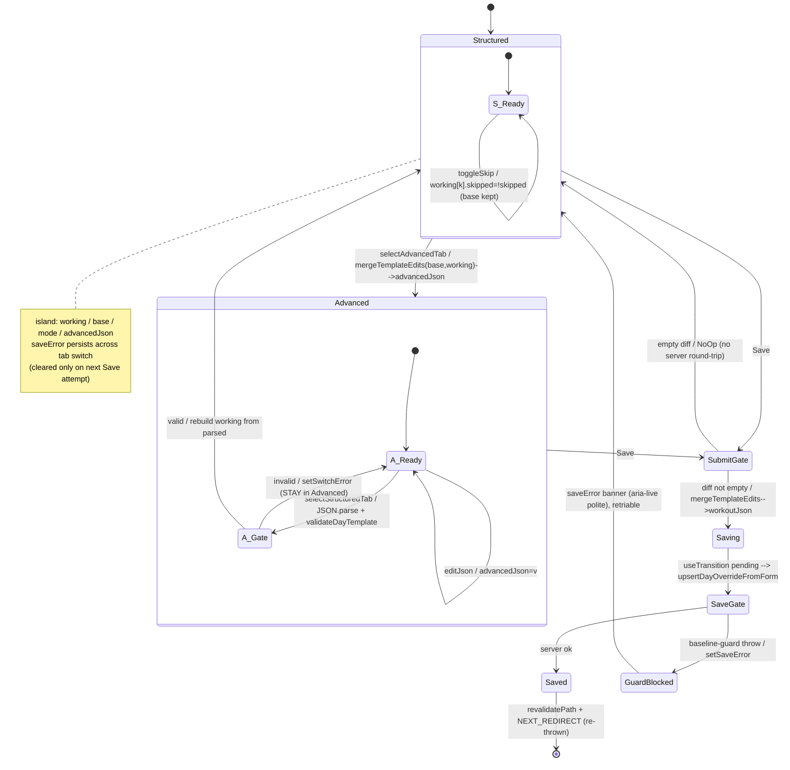

# UX Research — Structured Day Override editor v1 + Advanced JSON tab (#235)

**Surface:** `/days/[dateKey]` → "Edit this day directly" card
**Delivery:** committed file (no GitHub comment — solo-dev repo convention)
**Feeds:** architect blueprint (immediately after) · resolves PRD-235 §9 Open Questions
**Method:** 3 Explore agents (code map) → 3 specialist Plan agents (behavior / Next.js-motion / UI-brand) → 1 convergent artifact agent · GATE applied · flavor layer OFF (calm housekeeping surface).

> **Scope note:** this report answers the five PRD §9 open questions with concrete, in-house-grounded recommendations, one ASCII mockup for the chosen row anatomy, a Mermaid state machine + motion storyboard for the blueprint, and the tracked Recommendation Ledger. Every timing/opacity/geometry number is a **⚠ provisional range** to verify on a real 390px screen — see the Provisional list.

---

## 1. Current-State Audit

The day-override workout editor is today a **raw-JSON textarea** — hostile on a phone, and the only path to the common edits (tweak a weight hint, change sets/reps, skip an exercise today).

| Problem | Location | User impact |
|---|---|---|
| Workout override is a 12-row mono textarea inside a `<details>` collapse | `src/components/DayOverrideForm.tsx:33-42` (`<textarea name="workoutJson" rows={12} … text-xs font-mono>`) | To drop one weight hint you hand-edit a ~2-8KB JSON blob mid-workout; a stray comma corrupts the whole day. |
| The blob is pretty-printed default template when no override exists | `src/app/days/[dateKey]/page.tsx:406-410` (`r.override?.workoutJson ? … : shownTemplate ? JSON.stringify(shownTemplate,null,2) : ""`) | User is dropped into a wall of JSON they must not break, with no field affordances. |
| Baseline-guard covenant surfaces as a raw thrown string in a generic red slot | banner at `DayOverrideForm.tsx:76-80`; message thrown by `assertBaselineDecisionMade` (`src/lib/day-template-validation.ts:183-188`), called with `baselineInputProvided:false` hardcoded at `src/lib/day-actions.ts:45-51` | The covenant ("Audible on {date} touches the workout but didn't make a baseline decision… own the call.") reads like a bug, not coaching — and today the form can only ever *hit* the guard, never satisfy it. |
| Number/skip edits require JSON literacy | whole textarea | No recognition-over-recall; every edit is recall + syntax. |

**What already exists to build on (no new deps needed):** the closest sibling `WorkoutEditor.tsx` (label-once numeric grid, bare `inputMode` inputs, skip pill, error banner, `computeDiff` short-circuit); `TargetsBuilder.tsx` (builder↔advanced-JSON toggle with parse-on-switch-back gate + hidden-input persistence that keeps the server action untouched); `MealComposer.tsx` (dense mobile form: sticky header/footer, section-label typography, quiet ✓ save confirm — explicitly *not* Bullseye-pop); and the global **italic-placeholder source-monitoring cue** (`globals.css:101-106`) where muted-italic = "the plan suggested this" vs solid-upright = "I typed this."

---

## 2. Chosen Direction

**A single `"use client"` island: a default Structured tab of per-block cards — read-only block chrome band above a label-once numeric grid of always-inline exercise fields (`reps`/`weightHint` prominent, `durationSec` only for timed moves, `notes` behind a disclosure) — with a per-exercise reversible Skip toggle; and a deliberately de-emphasized Advanced JSON escape hatch behind a weighted segmented control.** It is the smallest possible delta from `WorkoutEditor`'s proven set grid, so it inherits AA-verified sizing, muscle memory, and the `computeDiff` empty-short-circuit for free. The base template stays frozen for skip-restore + diffing; the working copy diverges only where the user actually types; persistence stays the full-blob path through the #234-hardened `upsertDayOverrideFromForm` via a hidden input.

**Runner-up ideas grafted in:** from the dev track, the exact `EditExercise` string-keyed state shape and the `switchError`/`saveError` two-slot error model; from the behavior track, treating the **base value as the input's italic placeholder** so an untouched field *is* the "inherit default" affordance (empty = inherit, legibly). Directions we rejected: **tap-to-expand accordion rows** (adds a tap-cost + measure-cost to every edit; `.item-row-anim` is kept for its correct job — the notes disclosure and skip) and **edit-in-place value→input swap** (doubles the render tree, fights iOS focus).

**The one genuine split (Q2), resolved:** behavior + UI specialists favored an asymmetric text-link escape hatch (TargetsBuilder idiom); the dev specialist favored a segmented radiogroup (both first-class, free keyboard support). PRD §5 names the radiogroup segmented control as the primitive candidate. **Ruling: use the segmented control, but weight it asymmetrically** — Structured is the accent-filled default; Advanced renders muted/outline with a `⚠ raw` cue even when active. This satisfies both "segmented control placement" and "deliberate de-emphasis" without hiding the power feature.

---

## 3. The Five Open Questions — Resolutions (PRD §9)

### Q1 — Per-exercise row anatomy at 390px → **inline-always block-card ("Ledger Row")**
One card per **block**; the block's read-only chrome (`type · label · rounds · restSec`) is a non-bordered typographic band that can never be mistaken for an input. Each exercise = a name line (+ Skip on the right) over a **label-once** numeric grid (reuse `WorkoutEditor`'s `grid-cols-[…]` + `text-[10px] uppercase tracking-wide text-[var(--muted)]` header). Field prominence maps to real edit frequency: **`reps` + `weightHint` are the common audibles** → wide cells; `durationSec` appears only where it's the primary metric (Plank, Bike) as `m:ss` (reuse `WorkoutEditor.formatSet`); `notes` stays a `+ notes` disclosure so the resting row is 2 lines, not 4. Inline-always beats accordion/edit-in-place: no mode to discover, recognition-over-recall, fewer taps mid-workout. *(Benchmarks: Strong/Hevy compact label-once numeric grid; Fitbod read-only prescribed chrome above editable targets.)*

### Q2 — Tab affordance → **weighted radiogroup segmented control** (see ruling in §2)
`role="radiogroup"` + two `role="radio"` buttons (repo has no `role="tab"`), roving `tabIndex` + ArrowLeft/Right handler copied from `TargetsBuilder.tsx:392-405`. Structured active = `bg-[var(--accent)] text-[var(--accent-fg)]`; Advanced = muted label + `⚠ raw` sub-cue + accent-*outline* (not fill) active state, so it never reads as the happy path. Both segments `min-h-[44px]`. The real safety net is the **parse-on-switch-back gate**: Advanced→Structured runs `JSON.parse` → `validateDayTemplate` (pure/client-safe), and on failure **stays in Advanced** with a tab-local `switchError` (never silently drops edits). *(Benchmark: TargetsBuilder — the nearest in-house twin, a builder with a JSON escape hatch.)*

### Q3 — Skip-today affordance → **labeled toggle + dim-in-place + status pill** (NOT swipe, NOT strikethrough, NOT collapse)
Affordance: a right-aligned toggle on the name line, `↺ Skip` → when active `Skipped today · Undo` (reuse `WorkoutEditor`'s `bg-[var(--muted)]/15` pill). On skip the row's inputs go `opacity 0.45-0.6` + `pointer-events-none` (still visible for reference, clearly inert); the row is **never** removed and **never** tinted `--danger`, keeping it categorically distinct from the red Clear/Delete affordance. Un-skip restores exact values from the frozen base. **No confirm on skip** (it's fully reversible — confirmation friction should scale with irreversibility); reserve `ConfirmButton` for the whole-override Clear only.
- Swipe rejected: implies destructive/irreversible (mail-app muscle memory) and is undiscoverable.
- Strikethrough rejected: connotes deleted/completed, wrong for "not today," and hurts legibility of numbers you may still want to read.
- Collapse rejected: hides that a prescribed thing exists; destroys the spatial anchor so un-skip becomes a hunt.
> **⚠ Locked-decision challenge (needs sign-off):** PRD §3.1 specifies the skip toggle as *"visual strike."* This research recommends **dim-in-place + status pill instead of a literal strikethrough**, on the evidence above (strikethrough reads as deletion; dim+pill reads as reversible-inactive). PRD §9 leaves "struck-through vs collapsed" explicitly open, so this is within the research mandate — but flagging it as a challenge-with-evidence for Tech-Lead sign-off rather than a silent change. *(UXR-235-08)*

### Q4 — Number-input ergonomics → **bare `inputMode` inputs, NO steppers, `text-base` (16px), `font-mono`**
Mirror `WorkoutEditor`'s set inputs exactly: `type="text"` + `inputMode="numeric"` (sets/durationSec) / `"decimal"` (unused here) / free-text (`reps`, `weightHint`), `placeholder="—"`, per-input `aria-label`, `min-h-[44px]`. Steppers rejected: override edits are one-shot re-typings and arbitrary jumps (`durationSec` 45→180; a `+` stepper tapped 135× is a Fitts's-law catastrophe), they eat horizontal room at 390px, and they **cannot represent** `reps` values like `"12-20"`/`"max"`. `text-base` (16px) is the iOS no-zoom floor — `MealComposer`'s structured inputs already use it for exactly this reason. **`reps` round-trip is the single highest correctness risk:** store every field as a string in edit state; on merge emit `Number(x)` only when `/^\d+$/` matches, else the string verbatim — **never `parseInt`**; unit-test it. *(Benchmarks: WorkoutEditor set grid; Strong/Hevy bare numeric keypad cells.)*

### Q5 — Baseline-guard covenant error → **coach-voiced banner directly above Save, persistent across tabs, no fake resolve button**
Render the thrown message in the existing error idiom (`border-[var(--danger)]/30 bg-[var(--danger)]/10 rounded-lg px-3 py-2 text-sm text-[var(--danger)]`), owned by the **island root, below the tab body and above Save**, **outside** the `key={mode}` fade container so it survives a tab switch (the covenant is about the *payload*, identical in both tabs). `aria-live="polite"`. The guard fires at commit and is a whole-day decision — placing it at the save point (where the eye already is) matches "I pressed Save, here's why it stopped"; top-of-card would scroll away on a 3-block day, inline-per-block would falsely implicate one exercise. Because v1 **cannot** satisfy the guard in-UI, do **not** render a fake "resolve" button (a false affordance is worse than none); name the real path in muted italic. Suggested compressed coach copy for a 390px column:
> **Baseline check needed.** Today's rotation includes a baseline test (Pull-Up max). Editing the workout without deciding what happens to it could drop it silently. Keep it, skip it for today, or swap it — then save.
> *Fine-grained control lives in Advanced JSON, or ask your coach in chat.*

When the `baselineTestNames` affordance lands (out of v1 scope), this banner becomes its anchor — the `day-actions.ts` comment already reserves #235 for that. *(Benchmark: WorkoutEditor error banner.)*

---

## 4. Chosen Row Anatomy — ASCII mockup (390px)

Light shown. **Dark = identical token structure**, coal/gold: card `#1A130C` on bg `#0F0B07`, border `#3A2E1F`, foreground `#F4E9D4`, accent `#D4A437`, muted `#9C8866`. No hardcoded colors anywhere — every fill is a `var(--…)` token. Italic muted = plan-suggested placeholder (not submitted); solid upright = typed/real value.

```
390px column
┌──────────────────────────────────────────────┐
│ ┌──────────────┐ ┌───────────────────────┐    │  ← weighted segmented control (radiogroup)
│ │ ● Structured │ │  Advanced ⚠ raw       │    │    Structured = accent FILL (active/default)
│ └──────────────┘ └───────────────────────┘    │    Advanced   = muted + outline + ⚠ raw cue
├──────────────────────────────────────────────┤
│ TITLE                                          │  ← micro-label (10px uppercase muted)
│ ┌────────────────────────────────────────────┐│
│ │ Upper Body + Core                          ││  ← solid upright (typed / real)
│ └────────────────────────────────────────────┘│
│                                                │
│  STRICT PULLING · full rest · rest 150s        │  ← block chrome band (READ-ONLY typography)
│  straight                                      │    never a bordered field → not pressable
│ ┌────────────────────────────────────────────┐│
│ │ Pull-Up                          ↺ Skip    ││  ← name line + reversible skip (right)
│ │  SETS   REPS        WEIGHT                  ││  ← label-once header (once per exercise)
│ │ [ 4 ] [ max    ]  [   —    ]      + notes   ││  ← 'max' italic-muted placeholder; '—' empty
│ └────────────────────────────────────────────┘│
│                                                │
│  PUSH/PULL PAIRING · superset · 4 rounds ·     │  ← rounds/restSec = read-only chrome
│  rest 90s                                      │
│ ┌────────────────────────────────────────────┐│
│ │ Push-Up                          ↺ Skip    ││
│ │  SETS   REPS        WEIGHT                  ││
│ │ [ 4 ] [ 12-20  ]  [   —    ]      + notes   ││  ← '12-20' italic-muted (string, no coercion)
│ ├────────────────────────────────────────────┤│  ← thin divider INSIDE block (exercise sep)
│ │ Bent Over One Arm Row · Dumbbell   ↺ Skip   ││  ← equipment read-only, appended to name
│ │  SETS   REPS        WEIGHT                  ││
│ │ [ 4 ] [  10    ]  [30-50 lb]      + notes   ││  ← '10' solid; weightHint typed solid
│ └────────────────────────────────────────────┘│
│                                                │
│  CORE · superset · 4 rounds · rest 45s         │
│ ┌────────────────────────────────────────────┐│
│ │ Hanging Knee Raise               ↺ Skip    ││
│ │  SETS   REPS                                ││
│ │ [ 4 ] [  12    ]                  + notes   ││
│ ├────────────────────────────────────────────┤│
│ │ Plank                     ✓ Skipped · Undo ││  ← SKIPPED: dimmed row + muted pill (reversible)
│ │  SETS   TIME                                ││    inputs opacity 0.45–0.6 + pointer-events-none
│ │ [ 4 ] [ 1:00   ]                  + notes   ││    (timed → REPS/WEIGHT collapse to TIME m:ss)
│ └────────────────────────────────────────────┘│
│                                                │
│  CARDIO FINISHER · cardio                      │
│ ┌────────────────────────────────────────────┐│
│ │ Bike or StairMaster              ↺ Skip    ││
│ │  TIME                                       ││
│ │ [ 10:00 ]                        + notes    ││  ← 600s → mm:ss (formatSet)
│ └────────────────────────────────────────────┘│
├──────────────────────────────────────────────┤
│  ⚠ Baseline check needed. Today's rotation …   │  ← saveError banner: danger/10 tint, aria-live,
│    (appears only on a blocked save)            │    ABOVE Save, OUTSIDE the tab-fade container
│ ┌──────────────────────────┐ ┌─────────────┐  │
│ │      Save changes        │ │    Clear    │  │  ← sticky footer (MealComposer idiom);
│ └──────────────────────────┘ └─────────────┘  │    Clear = ConfirmButton (danger, two-tap)
└──────────────────────────────────────────────┘
```

---

## 5. State machine (Mermaid — renders inline on GitHub)



- `A_Gate` = the Advanced→Structured validate gate: invalid loops back into `Advanced` with tab-local `switchError`; only a valid parse crosses into `Structured`.
- `SubmitGate` = the `computeTemplateDiff` empty short-circuit *before* any server call.
- `SaveGate` = server outcome fan-out; the `saveError` banner lives **outside** `key={mode}`, so it survives a tab switch.

---

## 6. Animation storyboard (calm vocabulary only — NO bullseye-pop)

All classes exist in `globals.css:305-419` and already carry `prefers-reduced-motion: reduce → none` guards. Every timing is a **⚠ playtest range**.

**(a) Skip-toggle — dim-in-place, row never unmounts**
```
FRAME 0  Rest      row live, inputs interactive · working[k].skipped === false
FRAME 1  Tap ↺Skip row body dims (opacity/color transition ⚠150–200ms) + inputs go
                   pointer-events-none + aria-disabled · working[k].skipped = true (base kept)
FRAME 2  Pill in   "Skipped today · Undo" pill enters via .item-row-anim (0fr→1fr ⚠180–240ms)
                   (optional numeric-grid collapse reuses SAME .item-row-anim; default = dim only)
FRAME 3  Tap Undo  pill exits .item-row-anim.is-exiting (1fr→0fr ⚠160–220ms) + row un-dims
                   (⚠150–200ms) · inputs re-enable, values restored FROM base[k]
Reduced motion: instant token swap, transition:none, pill appears/vanishes untracked. End state identical.
```
**(b) Save — happy path + guard-blocked**
```
FRAME 1  Tap Save (diff non-empty) → useTransition pending → label "Saving…", disabled
HAPPY  2H  server ok → changed numerals wash .macro-flash (accent-soft→transparent ⚠220–320ms,
           re-fire via key={`flash-${saveNonce}`}) + Save .save-confirm-fade to ✓ (⚠110–160ms).
           NO bullseye-pop, NO celebration.
       3H  revalidatePath refreshes day page (NEXT_REDIRECT re-thrown if present).
GUARD  2G  server throws covenant → saveError banner fades in ABOVE Save (opacity 0→1,
           reuse stale-flag-in/ease-out ⚠140–200ms), aria-live announces. Button → "Save"
           (retriable). NO ✓, NO macro-flash.
Reduced motion: macro-flash none (numerals settle), save-confirm-fade none (hard label swap),
banner appears instantly. aria-live text unaffected.
```
Tab switch: wrap the tab body in `<div key={mode} className="tab-content-fade">` to re-fire the fade (⚠110–160ms).

---

## 7. Behavioral Psychology Principles

| Principle | Applied where | One-line rationale |
|---|---|---|
| Recognition over recall | Inline-always fields; base value shown as italic placeholder | The prescription never leaves the screen while editing — no "what did the plan say?" in working memory. |
| The placeholder *is* the affordance (source-monitoring) | Empty field renders base value muted-italic (`globals.css:101-106`) | Empty = inherit default, legibly; clearing a field visibly restores the plan value, so "does blank delete?" never arises. |
| Reversibility / undo | Skip = dim-in-place + Undo, values restored from frozen base | Object stays visible-but-muted = universal "disabled, recoverable"; no destructive-action anxiety. |
| Confirmation scales with irreversibility | No confirm on Skip; `ConfirmButton` only on whole-override Clear | Gating a cheap reversible action with a dialog is friction; gating the destructive one is proportionate. |
| Error prevention over error message | Baseline pre-empt copy on baseline days; parse-on-switch-back stays-in-Advanced | Forewarn before effort; trap the broken JSON in place rather than losing work. |
| Hick's law / progressive disclosure | De-emphasized Advanced JSON; `+ notes` disclosure | Steer ~100% of edits to the safe low-error path; power/low-frequency surfaces earn discoverability through intent. |
| Fitts's law | Bare numeric keypad, no steppers; ≥44px targets | Arbitrary numeric jumps are O(1) taps on a keypad vs O(n) on a stepper. |
| Forgiveness (error attribution) | Coach-voiced covenant banner, not "Validation failed" | Attributing the block to a coaching stance (not a software failure) preserves trust and prevents JSON-tab circumvention. |

---

## 8. Implementation Scope

**New (pure, client-safe, heavy unit tests) — `src/lib/day-template-edit.ts`** (or extend `src/lib/day-template-ops.ts` alongside `applyWorkoutJsonOps`):
- `computeTemplateDiff(base, working)` → empty-detection (drives the no-server-round-trip short-circuit).
- `mergeTemplateEdits(base, working)` → full `DayTemplate`; **drops `skipped` exercises via omission**; `reps` round-trip `/^\d+$/ ? Number : string` (no coercion); omit empty optionals; preserve `dayOfWeek`/`category`/`summary`/block chrome byte-for-byte.
- Types incl. `EditExercise = { _key, blockIdx, exIdx, name, sets, reps, weightHint, durationSec, notes, skipped }` (all value fields **strings**).

**New component — `src/components/DayWorkoutEditor.tsx`** (`"use client"` island), rendered by `DayOverrideForm.tsx` replacing the `<details>`+textarea (lines 33-42). Island state: `working[]`, frozen `base[]` (`useState(() => parse(defaults.workoutJson))`), `mode`, `advancedJson`, `saveError` (root, persists across tabs), `switchError` (tab-local, Advanced), `useTransition` `pending`. Hidden `<input type="hidden" name="workoutJson" value={mode==="advanced" ? advancedJson : serialized}>` → **server action `upsertDayOverrideFromForm` unchanged** (grep-verify no new write path — AC#4).

**Reuse verbatim:** `WorkoutEditor.tsx` grid/label-once header/input classes/skip pill/error banner/`NEXT_REDIRECT` re-throw guard; `TargetsBuilder.tsx` `openAdvanced`/`switchToBuilder`/hidden-input; `MealComposer.tsx` sticky footer + quiet ✓; `ConfirmButton.tsx` for Clear; `validateDayTemplate` (`day-template-validation.ts`) for the switch gate; motion classes in `globals.css`.

**Suggested testIDs/identifiers:** `day-workout-editor`, `dwe-tab-structured`, `dwe-tab-advanced`, `dwe-exercise-row`, `dwe-field-sets|reps|weightHint|durationSec|notes`, `dwe-skip-toggle`, `dwe-notes-disclosure`, `dwe-advanced-textarea`, `dwe-switch-error`, `dwe-save-error`, `dwe-save`.

**Complexity: Moderate** (zero new deps, zero server/schema/MCP changes → no connector reload). Single genuine correctness hazard = the `reps` string↔number round-trip → gate with `day-template-edit.test.ts` (merge byte-preservation, skip round-trip, reps type round-trip, empty-diff, foreign-exercise read-only handling).

---

## 9. Accessibility

- **Touch targets:** every input, tab segment, skip toggle, notes disclosure, and Save/Clear ≥ `min-h-[44px]` (skip toggle also `min-w-[44px]`).
- **Contrast (both themes, WCAG AA — all ⚠ verify on device):**
  - Advanced-tab muted label: `--muted #7A5E3A` on `--card #FFFBF0` (light) passes; **⚠ verify dark `#9C8866` on `#1A130C` at 12px** — bump to `--foreground` if it fails.
  - Dimmed skipped row: opacity `0.45-0.6` — **⚠ verify skipped text still clears AA against card in dark** (coal is unforgiving; may need a `0.6` floor).
  - Danger banner: `--danger` text on `--danger/10` tint — **⚠ verify at `text-sm` on cream (`#A82A1F`) and coal (`#C0392B`)**.
- **Non-color-only signals:** `⚠` glyph carries meaning by shape (Advanced cue, baseline banner); skip uses `↺`/word "Undo" + dim + pill, not color alone.
- **Labels:** every bare numeric input gets an `aria-label` (label-once header is visual only); segmented control = `role="radiogroup"`/`role="radio"` + roving tabindex + Arrow keys; `saveError` banner `aria-live="polite"`.
- **Reduced motion:** all four motion classes already guard to `none`; skip dim/undim, macro-flash, save-fade, and tab-fade snap. `-webkit-tap-highlight-color:transparent` already global.
- **Zero-row / edge states:** rest-day template (no blocks) → Structured renders title only, sanely; foreign exercise added in Advanced then viewed in Structured → renders read-only (scoped editor).

---

## 10. ⚠ Provisional / Verify-Visually list

Confirm each on a real 390px device in **both** themes before shipping (all also tracked as ledger rows):

1. Row wrapping — `reps`/`weightHint` cells min-width **3.5–4.5rem** so `30-50 lb`, `12-20`, `10 each leg` don't clip; prefer widening over shrinking type. *(UXR-235-16)*
2. Numeric inputs `text-base` (16px) — verify the sets/durationSec pair doesn't force wrap at 390px; if it does, stack. *(UXR-235-24)*
3. Block-chrome band padding **py-2..py-3**, bg `--accent-soft` **or** bare `--card`+`border-b` — verify it reads as "chrome, not pressable," especially in dark. *(UXR-235-17)*
4. Inter-block gap **12–16px** > inter-exercise divider — verify block>exercise hierarchy is legible. *(UXR-235-18)*
5. Dimmed skipped-row opacity **0.45–0.6** — verify AA in both themes. *(UXR-235-15)*
6. Advanced-tab muted contrast in dark at 12px — verify AA / bump to `--foreground`. *(UXR-235-20)*
7. Danger banner tint + text AA at `text-sm`, both themes. *(UXR-235-21)*
8. Motion timings: skip dim 150–200ms · pill `.item-row-anim` add 180–240ms / remove 160–220ms · `.macro-flash` 220–320ms · `.save-confirm-fade` 110–160ms · `.tab-content-fade` 110–160ms · banner fade-in 140–200ms — playtest for calm, not flashy. *(UXR-235-12/13/14/19)*
9. Baseline banner copy ≤ ~3 lines at 390px. *(UXR-235-09)*

**No bespoke decoration proposed** — no custom SVG/shader/particles; Bullseye deliberately excluded (housekeeping surface). The one styling judgment call (block-chrome band fill) is tagged `decoration⚠` in the ledger.

---

## 11. Recommendation Ledger

IDs are stable (`UXR-235-NN`), never renumbered. Status starts `proposed`; the implementing PR ticks each to `shipped`/`reworked`/`dropped` with a SHA / `file:line` / short reason. Every ⚠ item above appears here.

| ID | Recommendation | Type | Status | Evidence |
|---|---|---|---|---|
| UXR-235-01 | Inline-always block-card row anatomy (read-only chrome band + label-once numeric grid); reject accordion/edit-in-place | layout | proposed | |
| UXR-235-02 | Field prominence: reps/weightHint wide cells; durationSec only for timed (m:ss); notes behind `+ notes` disclosure | layout | proposed | |
| UXR-235-03 | Bare `inputMode` text inputs, no steppers, `font-mono`, `text-base` 16px, `placeholder="—"` | component | proposed | |
| UXR-235-04 | `reps` string\|number round-trip: store string, `/^\d+$/?Number:string`, no coercion; unit-tested | component | proposed | |
| UXR-235-05 | Tabs = weighted radiogroup segmented control (Structured accent-fill; Advanced muted/outline + ⚠ raw) | component | proposed | |
| UXR-235-06 | Parse-on-switch-back gate: JSON.parse+validateDayTemplate; invalid stays in Advanced w/ tab-local switchError | component | proposed | |
| UXR-235-07 | Skip = labeled toggle (`↺ Skip`/`Skipped·Undo`), not swipe; no confirm on skip; Clear keeps ConfirmButton | component | proposed | |
| UXR-235-08 | Skip presentation = dim-in-place + muted pill, NOT strikethrough/collapse — **challenges PRD §3.1 "visual strike," needs sign-off** | a11y⚠ | proposed | |
| UXR-235-09 | Baseline covenant banner above Save, aria-live, outside key={mode}; compressed coach copy; muted-italic MCP/Advanced pointer; no fake resolve button | a11y | proposed | |
| UXR-235-10 | Two error slots: saveError (root, persists across tabs) vs switchError (tab-local, Advanced) | component | proposed | |
| UXR-235-11 | Calm save confirm: `.macro-flash` changed numerals + `.save-confirm-fade`; NO bullseye-pop | animation | proposed | |
| UXR-235-12 | Skip dim opacity/color transition ~150–200ms; pill via `.item-row-anim` | tuning⚠ | proposed | |
| UXR-235-13 | Tab-content fade `.tab-content-fade` re-keyed on mode ~110–160ms | tuning⚠ | proposed | |
| UXR-235-14 | Notes disclosure via `.item-row-anim` add ~180–240ms / remove ~160–220ms | tuning⚠ | proposed | |
| UXR-235-15 | Dimmed skipped-row opacity 0.45–0.6 — verify AA both themes | tuning⚠ | proposed | |
| UXR-235-16 | Numeric cell min-width 3.5–4.5rem so weightHint/reps don't clip at 390px | tuning⚠ | proposed | |
| UXR-235-17 | Block-chrome band py-2..py-3 + fill choice (accent-soft vs card+border-b) reads as non-pressable | decoration⚠ | proposed | |
| UXR-235-18 | Inter-block gap 12–16px > inter-exercise divider for hierarchy | tuning⚠ | proposed | |
| UXR-235-19 | `.macro-flash` 220–320ms; `.save-confirm-fade` 110–160ms; banner fade 140–200ms | tuning⚠ | proposed | |
| UXR-235-20 | Advanced-tab muted contrast in dark at 12px — verify AA / bump to --foreground | a11y⚠ | proposed | |
| UXR-235-21 | Danger banner tint + text AA at text-sm, both themes | a11y⚠ | proposed | |
| UXR-235-22 | Source-monitoring: base value rendered as italic-muted placeholder = the inherit/un-edited state | component | proposed | |
| UXR-235-23 | Empty-diff short-circuit (`computeTemplateDiff`) → no server round-trip | component | proposed | |
| UXR-235-24 | `text-base` inputs to kill iOS zoom — verify sets/durationSec pair doesn't wrap at 390px | tuning⚠ | proposed | |
| UXR-235-25 | Hidden `name="workoutJson"` input carries merged blob → server action untouched (AC#4) | component | proposed | |
| UXR-235-26 | Sticky Save/Clear footer (MealComposer idiom); Save disabled while pending ("Saving…") | layout | proposed | |

---

*Team: Explore ×3 (code map) · Data/Behavior · Next.js/Motion · UI/Brand · Convergent artifacts. Flavor layer OFF — calm housekeeping surface, neutral coach voice.*
