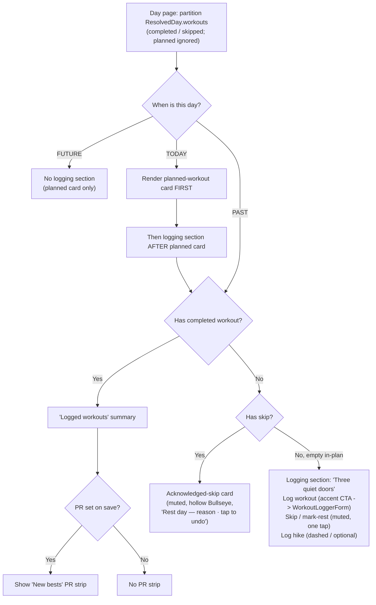
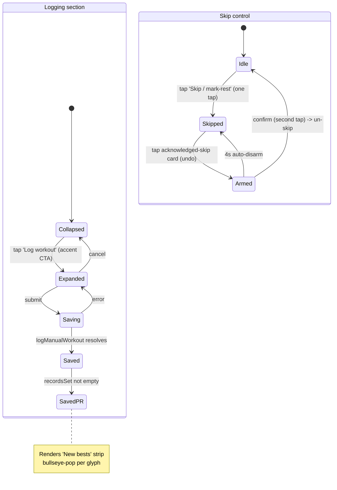
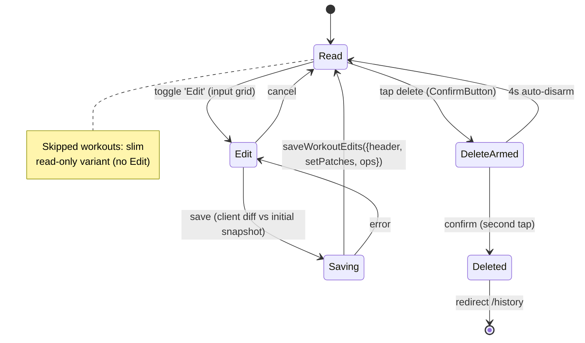

# UX Research — Day-page editing forms

**Feature:** App-side write affordances on the day page — a manual **WorkoutLoggerForm**, **SkipDayControl**, **HikeLogForm**, and a **WorkoutEditor** on `/workouts/[id]` — the app's most interaction-dense surface yet, designed at 390px for a phone mid-workout.
**Issue:** #65 · **PRD:** `docs/prds/PRD-day-page-editing.md` (REQ-65-2 / REQ-65-3 fix the **structure**; the blueprint freezes the core signatures, prefill spec, and D-decisions; this report decides the **visual / ergonomics / copy** the PRD defers with `[UXR]`).
**Design authority (structure is frozen — not reopened here):** `.feature-dev/2026-06-12-day-page-editing/agents/architecture-blueprint.md`.
**Profile:** `.claude/skills/ux-research/profiles/goaldmine.profile.md`
**Extends (does NOT reopen) the shipped grammar:** [`goal-state-controls.md`](./goal-state-controls.md) (quiet-subline, ConfirmButton-as-reversible) and [`goal-intake-entry.md`](./goal-intake-entry.md) (whisper-rung ladder, dashed-box = optional sibling path, non-guilt copy).
**Pixel mockup:** [`day-page-editing.html`](./day-page-editing.html) — both themes side-by-side at 390px, real `globals.css` tokens, all five surfaces.
**Chosen direction:** **"Three quiet doors + confirmation table"** — the resting logging section shows Log / Skip / Hike as three peer affordances at distinct loudness rungs (no hidden confession); the expanded logger is a dense per-exercise table that reads as *confirming a prescription*, not filling a blank form.
**Constraints honored:** tokens only · both themes · ≥44px taps · no new client deps · motion = the single existing `bullseye-pop` keyframe only · honors `prefers-reduced-motion` · Server-Components-first (islands are `"use client"` only where array state demands) · reuse Bullseye + ConfirmButton + the EditNutritionForm idiom.

---

## 1. Current-State Audit

| # | Surface | Today's behavior (file:line) | Problem the design must solve |
|---|---------|------------------------------|-------------------------------|
| A | Past empty day | `src/app/days/[dateKey]/page.tsx:139-149` renders a **dead-end card**: title "No workout logged", body "No completed workout for this day. Import one or log via Claude." | It *names an absence* (loss frame) and offers no in-place action — the user must leave to `/import` or claude.ai. Every write is currently coach/MCP-only. This is the nag #65 exists to replace. |
| B | Planned card | `page.tsx:151-176` shows the prescribed workout (BlockView per block, `text-xs uppercase tracking-wide text-[var(--muted)]` block labels). | The logging section must sit *after* this on today, and the logger should visually echo these block headers so it reads as "confirm what's prescribed." |
| C | Logged workouts | `page.tsx:116-137` lists completed workouts as links to `/workouts/[id]`. | A PR set on save has nowhere to surface; `recordsSet[]` is computed but never celebrated in-app. |
| D | Workout detail | `src/app/workouts/[id]/page.tsx:65-90` renders **static** exercise/set cards + ShareWorkout. No edit path. | Must become read-mode-default + edit toggle without losing ShareWorkout or the clean read view. |
| E | Set-input precedent | `MacroInputs.tsx:46-83` — the only 3-column compact-number grid in the app (`grid grid-cols-3 gap-2`, `px-2 py-1.5`, `text-[10px] uppercase` labels). | It's the right model for a set row **but** `py-1.5` ≈ 38px is below the 44px touch floor — acceptable for a one-shot macro block, not for a many-tap mid-workout grid. |
| F | Celebration plumbing | `bullseye-pop` keyframe (`globals.css:105`, 320ms `cubic-bezier(0.16,1,0.3,1)`) + the imperative `classList.add` driver `TodayCelebration.tsx:28`, gated once-per-day by `localStorage["goaldmine.celebrated."+dateKey]` (`:23`). **Defined but unwired into any rendered page.** | This is the entire motion budget. The PR strip is the first real consumer — it must reuse the keyframe **without** consuming the day-completion gate. |

**Shared primitives reused (no new iconography):** `Bullseye.tsx` (filled `var(--target)` rings for PRs; hollow muted ring for an acknowledged skip — the canonical glyph in both modes), `ConfirmButton.tsx` (two-tap, 4s auto-disarm, `aria-pressed`), the `Card` recipe (`rounded-2xl border border-[var(--border)] bg-[var(--card)] p-4 shadow-sm`), the EditNutritionForm client-island + server-action + `startTransition` idiom, the dashed-border "optional sibling path" box, and the `color-mix(in srgb, var(--target) 12%, var(--card))` banner wash already used for the day-race banner (`page.tsx:53-65`).

---

## 2. Chosen Direction — "Three quiet doors + confirmation table"

The governing principle for the app's densest surface is **confirm, don't compose**: the most-logged event is "I did roughly what was prescribed," so confirming that must be near-empty effort while deviation stays one tap away — and a past empty day must read as an *invitation to backfill*, never a reproach.

- **Resting logging section = three peer doors at distinct loudness rungs.** Log workout (accent CTA) → Skip · mark rest (flat muted text, one tap) → + Log hike (dashed ghost). Order = workout → skip → hike. A past empty day is *most honestly* served by showing Skip as a dignified peer, not hidden behind a disclosure that implies "logging is the only right answer." The three rungs (filled accent / flat muted / dashed) encode priority without three CTAs shouting. (Grafted from the runner-up "Confirmation table" direction: its progressive-disclosure resting state is held as the **fallback** if three doors test as too tall/naggy.)
- **Expanded logger = the confirmation table.** Per exercise: one label-once header row (`# · REPS · WEIGHT · SEC`) then label-less set rows in a `grid-template-columns: 1.5rem 1fr 1fr 1fr 2.75rem` grid. Concrete numeric prescriptions seed **real editable values**; fuzzy reps (`"8-12"`, `"max"`) and free-form `weightHint` (`"30-50 lb DBs"`) seed **muted-italic placeholders that never persist**. Block labels become section headers mirroring the planned-card's `BlockView` typography — the echo is what makes the form read as confirmation of a known thing. (Grafted from the "Big-tap" runner-up: its larger input sizing — set inputs bump to ~44-48px — and a **conditional-SEC** column that only renders when duration is prescribed/added.)
- **PR celebration = the "New bests" strip, the second sanctioned home for the Bullseye.** A `var(--target)`-bordered panel with the day-race wash, a filled barn-red Bullseye per record, and quiet `· was {prior}` deltas. It is the *only* animated moment, and the pop is **earned, not automatic** — it renders only when `recordsSet[]` is non-empty.

Runner-up directions and why they lost are in §3.

---

## 3. Phase-A Options (divergent, narrowed to one)

Three treatments of the two genuinely-open questions — **how the resting logging section reads on a past empty day** and **the set-row density** — were drawn at 390px (full ASCII in the mockup-source thread; summarized here).

<details><summary>Direction comparison (click)</summary>

| | Resting state | Set-row density | Nag risk (past empty day) | Vertical cost | Verdict |
|---|---|---|---|---|---|
| **A Confirmation table** | ONE accent CTA; skip/hike behind a `··` disclosure | tight `grid-cols-5` table, ~44px rows | medium — disclosure implies "log is the only answer" | low | table **grafted**; resting state held as fallback |
| **B Three quiet doors** *(chosen)* | three peer affordances, accent/muted/dashed rungs | (uses A's table) | **low — Skip is a dignified peer** | medium (~180px resting) | **wins** |
| **C Big-tap stacked sets** | (orthogonal) | per-set sub-cards, ~52px fields, 2-up | n/a | **high (~3× scroll)** | sizing **grafted**, sub-cards rejected |

- **B "Three quiet doors"** *(chosen)* — three rungs deliver priority ordering without competing CTAs and make "mark rest" a one-tap, non-guilt choice. *Cost:* taller resting state (~180px vs ~120px). *Win:* nothing hidden = nothing to discover; honest about rest.
- **A "Confirmation table"** — its **table is the shipped expanded logger** (label-once header + label-less ~44px rows; 3 inputs share ~88px each ⚠). Its disclosure-hiding resting state lost: on a past empty day, hiding Skip subtly shames. **Held as fallback** if B is too tall.
- **C "Big-tap stacked sets"** — its larger inputs (~48px) and conditional-SEC are **grafted**; its per-set sub-cards rejected for ~3× vertical blow-up on a real leg day (4×4 sets).

**Decision: B-resting + A-table + C-sized-inputs + conditional-SEC.**

</details>

---

## 4. Phase-B Technical Artifacts

### 4.1 Day-page logging-section composition



*Which cards render, driven by past/today/future × completed/skip/empty-in-plan.*

### 4.2 Logger + Skip interaction states



*Logger expand/save/PR flow and the two-tap ConfirmButton un-skip with 4s auto-disarm.*

### 4.3 WorkoutEditor states (`/workouts/[id]`)



*Read-default editor, Edit toggle, single diffed save, two-tap delete to /history.*

### 4.4 Save → recordsSet → PR-strip choreography

```mermaid
sequenceDiagram
    actor User
    participant Form as WorkoutLoggerForm (client)
    participant Action as logManualWorkout (server action)
    participant Core as createWorkoutCore
    participant DB as Database

    User->>Form: submit (title?, timeHHMM, notes?, exercises)
    Form->>Action: logManualWorkout({dateKey, ...})
    Action->>Core: create (status completed, source 'manual')
    Core->>DB: insert workout + sets
    DB-->>Core: persisted
    Core-->>Action: {id, recordsSet[]}
    Note over Action: recordsSet only if completed && exercises>0<br/>RecordSet = {name, kind, value, prior}
    Action->>Action: revalidatePath / /history /calendar<br/>/days/[dateKey] /progress /stats
    Action-->>Form: {id, recordsSet}
    Form->>Form: render 'New bests' PR strip
    loop each PR Bullseye glyph
        Form->>Form: classList.add('bullseye-pop')<br/>staggered ~70ms (320ms anim)
    end
    Note over Form: prefers-reduced-motion -> keyframe no-ops<br/>ephemeral mount gate (no localStorage;<br/>does not touch goaldmine.celebrated.<dateKey>)
```

*One save returns recordsSet; the client paints the strip and imperatively staggers the pop, no-op under reduced motion.*

### 4.5 Pixel mockup

[`day-page-editing.html`](./day-page-editing.html) — open it to judge the three load-bearing visual risks on a real 390px screen in **both** themes: (1) the **placeholder-vs-typed contrast** in the logger (muted-italic suggestion vs solid-foreground typed value — scrutinize the DARK column where muted-italic sits on the near-black card); (2) the **"New bests" heading contrast** (barn-red `var(--target)` on card is ~3.6:1 in dark — passes only as large-text AA, so it stays ≥600 weight / ~18px); (3) the **acknowledged-skip card** reading calm/informational, never alarming.

---

## 5. Animation Storyboard — the only motion

**One animated moment: the post-save "New bests" strip.** Only the filled Bullseye glyphs scale+fade; the panel, target border, and record text are painted complete at mount and never tween.

| Frame | t (ms) | What happens | Glyph 1 (delay 0) | Glyph 2 (delay 70 ⚠) | Glyph 3 (delay 140 ⚠) |
|---|---|---|---|---|---|
| F0 | −n | Save tap; server confirms completed && exercises>0 && recordsSet non-empty | — | — | — |
| F1 | 0 | Strip mounts; border/wash/text paint **static**; `classList.add('bullseye-pop')` on each glyph | scale 0.6, opacity 0 | held (delay 70) | held (delay 140) |
| F2 | ~192 | Glyph 1 hits 60% overshoot peak | **scale 1.08, opacity 1** | rising | latent |
| F3 | ~262 | Glyph 1 settles; glyph 2 peaks | scale 1.0 | **scale 1.08** | rising |
| F4 | ~332 | Glyph 3 peaks | scale 1.0 | scale 1.0 | **scale 1.08** |
| F5 | 460 | Full settle; identical to reduced-motion resting state | scale 1.0 | scale 1.0 | scale 1.0 |

Total motion window 0 → ~460ms ⚠ (stagger-dependent). Frame peaks F2/F3/F4 sit at the 60% mark of bars A/B/C below.

```mermaid
gantt
    title PR-strip bullseye-pop timing (3 PRs) — illustrative ms; reduced-motion collapses all bars to 0ms
    dateFormat x
    axisFormat %Lms
    todayMarker off

    section Glyph 1 (delay 0ms)
    bullseye-pop 320ms cubic-bezier(0.16,1,0.3,1)   :a1, 0, 320ms

    section Glyph 2 (delay 70ms)
    bullseye-pop 320ms cubic-bezier(0.16,1,0.3,1)   :a2, 70, 320ms

    section Glyph 3 (delay 140ms)
    bullseye-pop 320ms cubic-bezier(0.16,1,0.3,1)   :a3, 140, 320ms
```



**Reduced-motion frame:** `.bullseye-pop` → `animation: none` (the existing `globals.css:116` no-op), so `classList.add` is inert and all glyphs render at final state instantly. The reward is carried entirely by the **filled barn-red Bullseye + record text** — if motion never fires, nothing about the celebration's meaning is lost. That is the design contract.

**Why this is the only motion:** motion in goaldmine is *spent, not sprinkled* — reserved for genuine "you hit a target" moments. A new personal best is exactly that, so it gets the one gesture. Everything else here is plumbing and therefore **does NOT animate**: the collapsed→expanded transition and the edit-mode toggle are pure conditional renders (animating a form open is decoration that would cheapen the PR pop); add/remove set, the skip card, and the hike form are routine data entry. Spending the whole budget on the one Bullseye-per-record moment keeps the gesture legible.

---

## 6. Behavioral Psychology Principles

| Principle | How it's applied | Surface |
|-----------|------------------|---------|
| Default bias / path of least resistance | Concrete prescriptions seed real values → "did it as prescribed" = expand + save (2 taps, under the ≤4 budget); deviation costs exactly one tap per changed field | Logger |
| Source-monitoring (suggestion vs record) | Muted-italic placeholders vs solid-upright typed values make "the plan whispered this" vs "I committed this" a single glanceable, tactile distinction; placeholders never persist | Logger |
| Effort-justification, inverted | Skip completes in one tap with the reason **offered after**, never demanded before — no confession booth that pushes users toward not logging the skip at all | Skip |
| Non-guilt / opportunity framing | "Marked as a rest — no training logged today" and "Did something this day? You can still log it" describe the *log*, never the person; no "missed"/"failed"/"yet"/"never" | Skip, Day-page |
| Reversibility lowers friction | Un-skip uses ConfirmButton `variant="accent"` (recovery, not destruction) with 4s auto-disarm — reversible-by-waiting, red reserved for the genuine delete | Skip, Editor |
| Variable-reward calibration (anti-inflation) | The pop is earned (renders only when recordsSet non-empty), capped (≤3 lines, one pop sequence), and the day-completion pop always outranks it — celebration stays scarce so it keeps meaning | PR strip |
| Reserved-symbol semantics | The Bullseye does double duty in one vocabulary: filled `var(--target)` rings = a hit (PR), hollow muted ring = a target not filled today (skip) — the same honest ledger, no new glyph | PR strip, Skip |
| Invitation over dead-end | The past-empty card no longer *names the gap*; it *offers the fill*, in-place, at a loudness that says "offered, not owed" | Day-page |
| Jakob's law (consistency) | Reuses EditNutritionForm island idiom, ConfirmButton, the Card recipe, dashed-box, and the planned-card block-label typography — the new surface behaves like the app the user knows | All |

---

## 7. Implementation Scope

| File | Change | Complexity |
|------|--------|------------|
| `src/app/days/[dateKey]/page.tsx` | Replace dead-end card (`:139-149`) with the "three quiet doors" logging section (past) / section after planned card (today); render acknowledged-skip card + "New bests" strip per partition (§4.1) | Med |
| `src/components/WorkoutLoggerForm.tsx` *(new client island)* | Collapsed accent CTA → expanded confirmation table; dynamic exercise/set arrays (stable `_key`, not index); muted-italic placeholders from prefill; `+ Add set`/`+ Add exercise` dashed rows; `type="time"` field; submit via `logManualWorkout` + `startTransition`; success → "New bests" strip | High |
| `src/components/SkipDayControl.tsx` *(new client island)* | One-tap skip; post-tap optional reason (dashed box); existing → muted "Rest day — {reason}" + ConfirmButton `variant="accent"` un-skip | Low–Med |
| `src/components/HikeLogForm.tsx` *(new client island)* | `plannedHike` → accent-soft "Finalize planned hike: {route}" header + MarkerIcon + prefilled suggestions + `replacesPlannedHikeId`; else fresh accent CTA; 2-col 6-field layout | Med |
| `src/components/RecordStrip.tsx` *(new client island)* | "New bests" panel from `recordsSet[]`; filled Bullseye per record; imperative `classList.add('bullseye-pop')` staggered; ≤3 visible (+N more); ephemeral mount gate | Med |
| `src/app/workouts/[id]/page.tsx` + `WorkoutEditor.tsx` *(new island)* | Read-mode default (re-express `:65-90` static cards) + Edit toggle → input grid; client diff vs initial → one `saveWorkoutEdits`; ConfirmButton `variant="danger"` delete → `/history`; skipped = slim read-only variant; keep ShareWorkout | High |
| `src/app/globals.css` | One-line `input::placeholder { color: var(--muted); font-style: italic; }` rule (Concept 1); reuse the existing `bullseye-pop` keyframe verbatim — **add no new keyframe** | Low |
| `src/lib/calendar.ts` | **Export** additive `dateAtUserTime(dateKey, "HH:MM")` + `hhmmNowInUserTz()` (wraps the unexported `userTzWallClockToUTC:1168`) so `day-log-actions.ts` honors D3 without copying TZ logic — must land in the REQ-65-4 calendar merge **before** REQ-65-2 branches | Low (flag) |

**Suggested testIDs / identifiers:** `logging-section`, `log-workout-cta`, `skip-day-control`, `skip-reason-field`, `unskip-confirm`, `workout-set-row`, `set-remove`, `add-set`, `add-exercise`, `record-strip`, `record-strip-glyph`, `hike-finalize-header`, `workout-editor-edit-toggle`, `workout-delete-confirm`.

---

## 8. Accessibility

- **Tap targets:** every control ≥44px — accent CTA / flat-muted Skip / dashed Hike rows; set inputs bumped to ~44-48px (overriding the MacroInputs `py-1.5` ≈38px precedent for this many-tap surface ⚠); remove ✕ is a 44px column; ConfirmButton inherits `min-h-[44px]`. Set inputs carry `aria-label="Set N reps"` etc. since rows are label-less.
- **Both themes / contrast (verify — cream/gold light is contrast-tight):**
  - **"New bests" heading `var(--target)` on card:** light ≈ 6.5:1 (fine); **dark `#C0392B` on `#1A130C` ≈ 3.6:1 — below 4.5 small-text AA**, clears 3:1 only as large text. Mitigation: keep the heading ≥600 weight **and** ≥18px; the record *value* stays `var(--foreground)` (always AA). Verify the `color-mix` wash doesn't lift card luminance enough to drop the value below AA. ⚠
  - **Placeholder `var(--muted)`-italic on card:** light ≈ 6:1; dark `#9C8866` on `#1A130C` ≈ 4.6:1 — the tightest text pair in the form; passes AA but do not shrink placeholder below the base input size. ⚠
  - **Acknowledged-skip:** all muted/foreground-on-card pairings, no danger color — passes as the shipped subline pairings do.
- **No color-only signaling:** placeholder-vs-value is carried by *italic + muted weight*, not hue alone; skip state is the literal word "Rest day"; PR kind is the literal "New 1RM"/"New rep best"/"New time"; the upward delta caret pairs with the `· was {prior}` text.
- **inputMode:** reps `inputMode="numeric"`, weight `inputMode="decimal"`, durationSec `inputMode="numeric"`; the `type="time"` control owns its own keyboard.
- **Reduced motion:** the PR pop no-ops via the existing `globals.css:116` rule; nothing else animates.

---

## 9. ⚠ Provisional / Verify-Visually list

Confirm on a real 390px device in **both** themes before shipping (every item is a ledger row):

1. **Set-input height** — bump from the MacroInputs `py-1.5` (~38px) to ~44-48px for mid-workout thumbs; verify the taller rows don't blow vertical budget on a 4×4 leg day. (UXR-65-03)
2. **3 inputs at ~88px each** — with the 1.5rem index + 2.75rem remove gutters, verify reps/weight/sec fields stay tappable and "135"/"12"/"45" don't truncate. (UXR-65-02)
3. **Conditional-SEC column** — render SEC only when `durationSec` is prescribed/added; verify the `grid-cols-[1.5rem_1fr_1fr_2.75rem]` fallback reflows cleanly. (UXR-65-04)
4. **Placeholder-vs-typed contrast** — the single highest-value playtest: show a half-filled form cold and ask "which did you log?"; if anyone points at a muted-italic placeholder, the contrast/treatment isn't strong enough. Especially the DARK column. (UXR-65-05)
5. **weightHint in a numeric field** — "30-50 lb DBs" as an in-field placeholder; if it tests as confusable-with-data, escalate to a tappable "plan: 30-50 lb" chip below the field. (UXR-65-06)
6. **"New bests" heading contrast** — `var(--target)` on card dark ≈3.6:1; must stay ≥600 weight / ~18px (large-text AA). (UXR-65-17)
7. **PR-line cap** — ≤3 visible records + "+N more"; verify >3 barn-red lines doesn't become a wall. (UXR-65-18)
8. **Pop stagger** — ~70ms per glyph (range 60-100); total ~460ms for 3 PRs; verify it reads intentional, not flashy. (UXR-65-20)
9. **Three-doors resting height** — ~180px; verify it doesn't push Edit-day / Note-to-Claude cards so far down they feel buried; fallback = the `··` disclosure (Direction A). (UXR-65-01)
10. **"rest" wording** — "Marked as a rest" may feel presumptuous if the skip wasn't a rest; fallback neutral string "No session logged for this day." (UXR-65-14)
11. **Acknowledged-skip beside a completed workout** — verify the collapsed muted line reads as *attached* (shared margin, no gap), not an orphaned dead element; hollow-ring stroke at size 16 must stay visible on cream. (UXR-65-13)
12. **Hike finalize header band** — `accent-soft` over card in DARK is subtle; verify it reads as a distinct mode, else add the accent marker + a token border edge rather than strengthening the fill. (UXR-65-26)
13. **Day-completion pop precedence** — verify the PR-strip pop and the day-completion pop never co-fire on one viewport. (UXR-65-21)

**Ornament audit:** zero bespoke ornament introduced. The PR-strip wash reuses the existing day-race `color-mix(var(--target) 12%, var(--card))` banner; the pop reuses the existing `bullseye-pop` keyframe; the Bullseye (filled + hollow) is the existing canonical glyph; everything else rides typography + spacing + existing token borders. No new SVG, no shader, no particle, no second keyframe.

---

## 10. Decisions requiring sign-off (challenge-with-evidence; do NOT slip in silently)

Three recommendations touch a value/decision the PRD or blueprint fixes:

- **Export `dateAtUserTime(dateKey, "HH:MM")` + `hhmmNowInUserTz()` from `@/lib/calendar` (UXR-65-29).** The blueprint D3 fixes `startedAt` = noon (past) / now (today) via USER_TZ, and explicitly forbids copying the server-TZ-naive `parseDateKey` (blueprint ground-truth note on `day-actions.ts:86-89`). But `userTzWallClockToUTC` at `calendar.ts:1168` is **not exported**, and no "dateKey + HH:MM" helper exists. Evidence: without these additive exports, `day-log-actions.ts` cannot honor D3 without duplicating TZ logic — exactly what's forbidden. Recommend they land in the REQ-65-4 calendar merge that precedes REQ-65-2. Additive, no behavior change to existing callers.
- **Optional "Did it as prescribed" batch-resolve control (UXR-65-11).** To hit the ≤4-tap happy path on *fuzzy* prescriptions ("8-12"), a single control could resolve every placeholder into a real, **visible, editable** value at once (explicit consent — nothing silently persisted, honoring "placeholders never persist"). Evidence: concrete prescriptions already reach 2 taps; fuzzy ones otherwise force per-field typing. **Needs sign-off on what "8-12 as prescribed" resolves to** (top-of-range vs midpoint) — the spec is silent, so this is a genuine product decision, not a UX detail to assume.
- **Logger rendered INLINE in the day-page card flow, not in a BottomSheet (UXR-65-30).** The invariant prefers reusing `BottomSheet` over a new modal. Evidence: the manual logger is a long dynamic-array form that clips badly in a 390px sheet once sets are added; it is not a "quick action." Recommend inline render in the card flow (natural scroll); BottomSheet stays for the global `LogLauncher`. This does not invent a new modal — flagged so it isn't read as an invariant violation.

---

## 11. Recommendation Ledger

Stable IDs `UXR-65-NN` (assigned once, never renumbered). Status starts `proposed`; the implementing PR ticks each to `shipped` / `reworked` / `dropped` with a SHA / `file:line` / short reason. Full ledger also at [`day-page-editing-ledger.md`](./day-page-editing-ledger.md).

| ID | Recommendation | Type | Status | Evidence |
|----|----------------|------|--------|----------|
| UXR-65-01 | Resting logging section = "three quiet doors" (Log workout accent CTA / Skip·mark-rest flat muted / +Log hike dashed), order workout→skip→hike, replaces the dead-end card; fallback = `··` disclosure (Direction A) if too tall/naggy | layout | proposed | |
| UXR-65-02 | Expanded logger = per-exercise "confirmation table": label-once header row + label-less set rows in `grid-cols-[1.5rem_1fr_1fr_1fr_2.75rem]` (~88px/field) | layout | proposed | |
| UXR-65-03 | Set inputs bump to ~44-48px tall (override the MacroInputs `py-1.5`≈38px precedent for this many-tap surface) | tuning⚠ | proposed | |
| UXR-65-04 | Conditional-SEC column — render SEC only when `durationSec` prescribed/added; else `grid-cols-[1.5rem_1fr_1fr_2.75rem]` | tuning⚠ | proposed | |
| UXR-65-05 | Placeholder-vs-value: fuzzy reps ("8-12"/"max") + `weightHint` render as muted-italic placeholders (`input::placeholder{color:var(--muted);font-style:italic}`), typed = solid foreground upright; placeholders never persist | layout | proposed | |
| UXR-65-06 | weightHint free-form ("30-50 lb DBs") fallback — if in-field placeholder tests confusable, escalate to a tappable "plan: 30-50 lb" chip below the field | tuning⚠ | proposed | |
| UXR-65-07 | One helper line atop the exercise list: "Greyed numbers are the plan's suggestion — type what you actually did." | copy | proposed | |
| UXR-65-08 | Remove control = trailing 44px ghost ✕ column, muted→danger on press; enforce min 1 set/exercise (set #1 renders no ✕) | a11y | proposed | |
| UXR-65-09 | Dashed `+ Add set` / `+ Add exercise` rows (`border-dashed border-[var(--border)]`, min-h-44px, muted) at section bottom | layout | proposed | |
| UXR-65-10 | ≤4-tap happy path — concrete numeric prescriptions seed real values → expand + save = 2 taps; deviation = +1 tap/field | copy | proposed | |
| UXR-65-11 | CHALLENGE — optional "Did it as prescribed" batch-resolve (placeholders → visible editable values on consent); needs sign-off on what "8-12 as prescribed" resolves to | tuning⚠ | proposed | needs sign-off; touches "placeholders never persist" spirit |
| UXR-65-12 | Skip = one tap, reason offered **after** (dashed optional box), never a pre-tap gate | layout | proposed | |
| UXR-65-13 | Acknowledged-skip card = muted/calm, hollow Bullseye (size 16, `var(--muted)` stroke), NEVER danger-red; collapses to one muted line beside a completed workout | layout | proposed | reads-calm + attached verify |
| UXR-65-14 | Skip copy (honest-not-guilt): "Marked as a rest — no training logged today." · "Rest is part of the plan · you can undo this anytime." · reason ph "What happened? (only you and Claude see this)"; ⚠ fallback "No session logged for this day." | copy | proposed | "rest" wording verify |
| UXR-65-15 | Un-skip = ConfirmButton `variant="accent"` (recovery, not destruction), label "Undo skip" / confirm "Tap again to undo", 4s auto-disarm | a11y | proposed | |
| UXR-65-16 | PR-celebration strip "New bests" (component `RecordStrip`) — `var(--target)`-bordered panel, `color-mix(var(--target) 12%, card)` wash, filled Bullseye per record, lines "New 1RM · 135 lb — was 125" (delta in muted quiet-subline) | component | proposed | |
| UXR-65-17 | "New bests" heading ≥600 weight + ~18px (large-text AA) — `var(--target)`-on-card dark ≈3.6:1; record value stays `var(--foreground)` | decoration⚠ | proposed | contrast verify both themes |
| UXR-65-18 | Cap visible PR lines at 3 (+N more) to avoid a wall of barn-red | tuning⚠ | proposed | |
| UXR-65-19 | PR-strip pop reuses the existing `bullseye-pop` keyframe via imperative `classList.add` on mount; **add no new keyframe** | animation | proposed | |
| UXR-65-20 | Pop stagger ~70ms/glyph (range 60-100); total ~460ms for 3 PRs | tuning⚠ | proposed | |
| UXR-65-21 | Gating — ephemeral mount only, NO localStorage; must NOT touch `goaldmine.celebrated.<dateKey>`; day-completion pop takes precedence so the two never co-fire on one viewport | animation | proposed | |
| UXR-65-22 | Collapsed→expanded form + edit-mode toggle = pure conditional render, NO animation | animation | proposed | |
| UXR-65-23 | WorkoutEditor = read-mode default + Edit toggle (same island); client diff vs initial snapshot → one `saveWorkoutEdits`; skipped = slim read-only variant; keep ShareWorkout | layout | proposed | |
| UXR-65-24 | Editor delete = ConfirmButton `variant="danger"` two-tap → `/history`, placed in a footer separated from save | a11y | proposed | |
| UXR-65-25 | Dynamic-array island — stable `_key` (uuid) not array index; autofocus new set's REPS via `pendingFocusKey`; store values as strings, coerce at submit | component | proposed | |
| UXR-65-26 | Hike finalize variant — `accent-soft` header band "Finalize planned hike: {route}" + MarkerIcon (🏔️ Mt. Elbert) + prefilled muted-italic suggestions + `replacesPlannedHikeId`; fresh = plain accent CTA | layout | proposed | dark accent-soft band subtlety verify |
| UXR-65-27 | Hike 6-field layout — 2-col grid for the 4 numerics with distance + elevation-gain primacy (Strava/AllTrails), full-width route + notes | layout | proposed | |
| UXR-65-28 | Time field = `type="time"`; server computes `defaultTimeHHMM` (past=12:00 noon, today=now USER_TZ); compose `startedAt` via USER_TZ wall-clock (never `setHours`) | a11y | proposed | |
| UXR-65-29 | CHALLENGE — export additive `dateAtUserTime(dateKey,"HH:MM")` + `hhmmNowInUserTz()` from `@/lib/calendar` (wraps unexported `userTzWallClockToUTC:1168`); land in REQ-65-4 calendar merge before REQ-65-2 | component | proposed | needs sign-off; additive, unblocks D3 |
| UXR-65-30 | CHALLENGE — logger rendered INLINE in the day-page card flow, NOT a BottomSheet (long dynamic form clips in a sheet); BottomSheet stays for global LogLauncher | layout | proposed | needs sign-off; not a new modal |
| UXR-65-31 | Block labels render as section headers (`text-xs uppercase tracking-wide text-[var(--muted)]`) mirroring the planned-card `BlockView`, so the form reads as "confirm a known thing" | layout | proposed | |
| UXR-65-32 | Past-empty invitation copy — drop "No workout logged"; CTA "Log workout" + optional non-guilt subline "Did something this day? You can still log it."; demote import/Claude to a tertiary escape hatch | copy | proposed | reads-as-invitation verify |
| UXR-65-33 | No animation anywhere except the PR pop; `bullseye-pop` stays milestone-only | animation | proposed | |

*Specialists: Data & Behavior · Next.js Dev & CSS-Animation · UI Design & Brand. Phase-1 exploration mapped against the live codebase (file:line cited inline). Extends the shipped UXR-62 / UXR-62B / UXR-63 / UXR-64 grammar; does not reopen it, and does not touch the frozen blueprint structure.*
