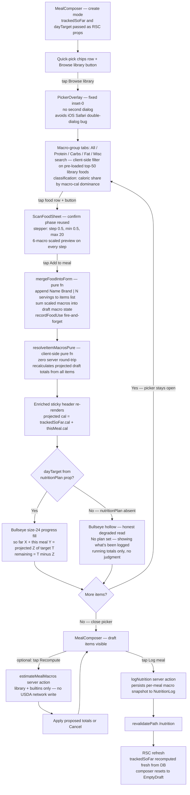
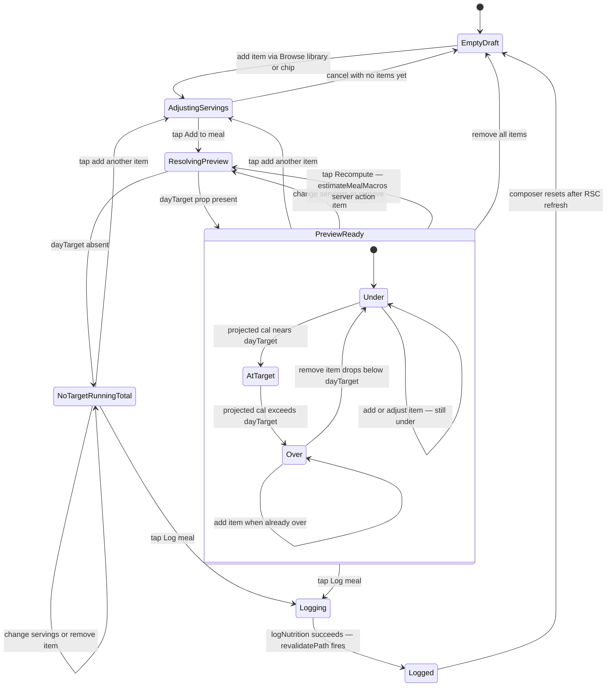
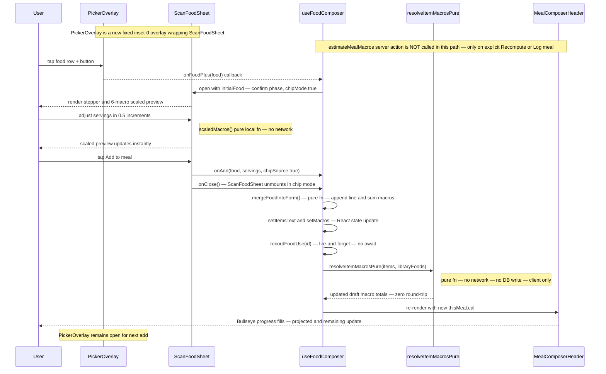

# Food Library Redesign — UX Research

> Exploratory design research (no issue number). Turns the food library from a passive
> scan-cache into a usable surface: **(1)** macro-type grouping, **(2)** click-to-add to a
> meal, **(3)** build-a-prospective-meal-vs-today with a remaining meter.
> Chosen direction: **Picker-First / composer-centric**. Pixel artifact:
> [`food-library-redesign.mockup.html`](./food-library-redesign.mockup.html) (390px, light + dark, real `globals.css` tokens).
> Prior related artifact: [`barcode-food-library.md`](./barcode-food-library.md) (the scan/cache build) — this report is the downstream "make it usable" pass.
>
> **No migration is required for any of the three goals.** Everything below reads
> already-stored fields and already-loaded data; the few code-only extractions are flagged.

---

## What the library IS for, after this redesign

> **Your personal, macro-grouped pantry of everything you've scanned or estimated — browsable to
> manage on `/nutrition`, and tappable mid-meal inside the composer to build the meal you're
> about to eat and watch it land against today's target.** It stops being a CRUD list with no verb.

---

## 1. Current-State Audit

| # | Finding | Location | User impact |
|---|---------|----------|-------------|
| **A** | **The library is "purposeless."** `FoodLibraryManager` lists top-50 foods by `usageCount`; each row is name + `brand · servingSize` + `"used 12× · Jun 9"`; the ONLY affordances are **Edit** (inline form) and **Delete** (`ConfirmButton`). There is no add-to-meal verb anywhere on it. | `src/components/FoodLibraryManager.tsx` (rows ~`:272-305`; edit form `:185-267`); rendered in `src/app/nutrition/page.tsx:134-136` | The user's exact complaint: "I can't click them to add to a meal, all I can do is edit and delete them." |
| **B** | **Rich macro data is fetched but hidden.** Each `LibraryFoodRow` carries all six per-serving macros, `basis`, `source` — but the collapsed row renders NONE of them (only in the edit form). | `FoodLibraryManager.tsx:277-284` (collapsed row); macros only in edit form | The single most useful info for "pick the high-protein one" is invisible. |
| **C** | **No macro-type grouping, no search.** 50 flat rows ordered only by usage. The sole add-to-meal path is the composer's quick-pick chips (top-8 by usage), also ungrouped and unsearchable. | `food-actions.ts` `listLibraryFoods()` `:416-427`; chips in `useFoodComposer.tsx:325-376`, `getQuickPickFoods()` `:435-441` | Finding a previously-scanned food means scrolling a flat list. |
| **D** | **No "remaining" surface, no meal preview.** `NutritionToday` computes a day **"so far"** vs planned **"target"** as two text rows — but never `target − soFar`, and has no Bullseye and no preview of a not-yet-logged meal. | `src/components/NutritionToday.tsx:141-157` (totals), `:200-222` (render) | The user can't "see how a meal stacks against what I've tracked at that point." |
| **E** | **No active-meal draft exists.** A meal-in-progress lives only as transient React state inside one `MealComposer` instance; closing the sheet or navigating away loses it. `FoodLibraryManager` has zero connection to any composer. | `MealComposer.tsx:152-201` (form state); no shared context/store | Any "add from library" must attach to an in-context composer — there's no global draft to push into. |
| **F** | **Data truth (load-bearing).** Logged meals (`NutritionLog`) store **per-MEAL** macro totals only — there is **no per-item macro breakdown and no MealItem table**. | `prisma/schema.prisma:135-156` (`NutritionLog`); `items` JSON is `{name,qty?,notes?}` | "Tracked so far today" can only be a **sum of per-meal totals**; meals logged without estimates contribute 0. Be honest, no migration assumed. |
| **G** | **Targets are often absent.** Planned macro targets come only from `PlanDayOverride.nutritionPlan` slot macros (written by Claude over MCP); on a day with no override there is **no target**. | `nutrition-plan.ts:14-70`; `resolveDay()` → `calendar.ts:895`; consumed `nutrition/page.tsx:73-92` | The build-vs-today surface **must degrade gracefully** to running totals with no judgment. |

---

## 2. Chosen Direction — "Picker-First / Composer-Centric"

The library becomes a **grouped, searchable picker opened from inside the `MealComposer`** ("Browse
library" button next to the quick-pick chips). Tapping a row's **`[+]`** opens the existing
`ScanFoodSheet` confirm-phase servings stepper, and **Add to meal** runs the existing
`mergeFoodIntoForm` — the exact chip-tap path, reused. Build-vs-today is an **enriched composer
sticky header**: a size-24 Bullseye showing *projected* fill `(trackedSoFar + thisMeal) / dayTarget`
plus a `so far + this meal = projected / target` line and a remaining read. The meal stays a
**transient, not-yet-logged draft** until "Log meal" — which IS "construct a meal you plan to eat
and see how it stacks," with zero new state machine.

**Why this over the runners-up, and what was grafted in:**

- **vs. Direction 2 (Planner Panel):** A dedicated build-a-meal tray on `/nutrition` answers goal #2 most literally but introduces a **net-new transient-tray state machine**, conflates manage + build on one row, skips `ScanFoodSheet` reuse, and adds a long scroll on a secondary surface. Rejected for cost/risk against the "dead-simple, reuse primitives" thesis. **Grafted in:** its explicit *projected-vs-target + remaining* framing and the honest no-target degradation — realized in the composer header + day strip instead of a separate panel.
- **vs. Direction 3 (In-Place Minimal):** Enriching `FoodLibraryManager` in place + a Bullseye on the day strip is the lightest touch but **under-serves goal #2** (the composer still logs immediately; there's no real "preview, don't log yet" build loop). **Grafted in:** the **size-20 Bullseye + remaining on the `NutritionToday` "Day total" strip** (remaining at a glance outside the build flow) and the **in-place macro-group tabs + macro line + dominant-macro badge on the standalone `FoodLibraryManager`** (manage mode) so the library is honest and browsable where it already lives.

**Net surfaces:** one new picker overlay (reuses overlay + ScanFoodSheet), an enriched composer
header, an enriched day-total strip, and an enriched (manage-mode) `FoodLibraryManager`.
**The biggest risk** — the picker being a second modal layer over the composer sheet — is already
solved in-repo: it must use the `fixed inset-0` non-dialog overlay pattern (as `ScanFoodSheet` does
to dodge the iOS Safari double-`<dialog>` bug), **not** a second native `<dialog>`.

---

## 3. Phase-A Options (divergent ASCII, narrowed to one)

Three competing IA directions were mocked at 390px. Summarized; the chosen one is rendered in full
fidelity in the HTML artifact.

<details><summary><b>Direction 1 — Picker-First (CHOSEN)</b> · composer header + library picker overlay</summary>

```
MealComposer sticky header (accent-soft wash over --card)
┌─────────────────────────────────────┐
│  640        cal               (◉)   │   640 = Geist Mono 28px; (◉) size-24 --target rings
│  P 48 · C 71 · F 22                 │   projected fill = (today+thisMeal)/target
│  ─────────────────────────────────  │
│  TODAY 1,840 + THIS MEAL 640        │   uppercase --muted micro labels
│  = 2,480 / 2,200    −280 over       │   "2,480" + "over" → --warning
└─────────────────────────────────────┘
[Scan][Chicken breast][Greek…]  ☰ Browse library     ← NEW entry into the picker

Library picker (fixed inset-0 overlay, NOT a 2nd dialog)
 Food library                       [✕]
 [🔍 Search foods…]
 [ All | PROTEIN▓ | Carbs | Fat | Misc ]   segmented control (TargetsBuilder pattern)
 PROTEIN · 4 FOODS
   Chicken breast · Kroger · 4 oz                [+]   ← [+] = 44px, ScanFoodSheet stepper
   Cal 190  P 38  C 0  F 3.5 · used 12× · Jun 9
 MISC · data incomplete
   Trail Mix (Homemade) · — · —                  [+]   ← honest null-macro row
   Cal 160  P —  C —  F — · mixed / data incomplete
```
NO-TARGET variant: header Bullseye hollow, no projected/over line, "No plan set — showing running total."
</details>

<details><summary>Direction 2 — Planner Panel (runner-up)</summary>

A dedicated "Build a meal" card on `/nutrition` with a live remaining Bullseye, an inline
macro-grouped food list, a transient **tray** of assembled items, and a "Log this meal" CTA that
hands off to the composer. Strongest literal answer to goal #2; rejected for the net-new tray state
machine, the three-action-row conflation (Edit/Delete + add-to-tray), and a long single-scroll
surface. Its remaining/projected framing was grafted into the chosen direction.
</details>

<details><summary>Direction 3 — In-Place Minimal (runner-up)</summary>

Enrich `FoodLibraryManager` rows in place (macro line + group tabs + `[Add to meal]` opening a
composer `BottomSheet`) and add a size-20 Bullseye to the `NutritionToday` "Day total" strip.
Lightest touch and highest reuse; rejected as the primary because it under-serves the "preview,
don't log yet" build loop. Its day-strip Bullseye and in-place row enrichment were grafted in as the
**manage-mode** layer.
</details>

---

## 4. Phase-B Technical Artifacts

Pixel artifact: **[`food-library-redesign.mockup.html`](./food-library-redesign.mockup.html)** —
the enriched composer header, the macro-grouped picker, and the day-total strip (has-target +
no-target), in light and dark with real tokens.

### 4.1 Flow — add-to-meal + build-vs-today loop



### 4.2 State — meal-builder preview → adjust → log



### 4.3 Sequence — single add is zero server round-trip



### 4.4 Animation timing (gantt — axis ILLUSTRATIVE, every ms ⚠ playtest)

```mermaid
gantt
    title Add micro-interaction — animation timing (ILLUSTRATIVE — axis in ms — all values provisional — playtest required)
    dateFormat x
    axisFormat %L ms
    section On tap Add to meal — concurrent
    item-row-anim ADD — grid-row 0fr to 1fr — 180-240ms — cubic-bezier 0.16 1 0.3 1  :a1, 0, 220
    macro-flash on header numerals — accent-soft tint — 220-320ms  :a2, 0, 270
    remaining numeral qty-bump — translateY 3px to 0 — 120-155ms  :a3, 0, 140
    tab-content fade on tab switch — opacity — 110-160ms ease-out  :a5, 0, 140
    Bullseye ring repaint — discrete ringCount change — no tween — 0ms  :milestone, bm, 0, 1
```



`bullseye-pop` (the once-per-day day-complete celebration) is **deliberately not used here** — a
routine add must not spend the celebration currency. The Bullseye meter **snaps** between discrete
25% ring brackets (no tween) — honest, no false precision.

---

## 5. Animation Storyboard

The add-one-food choreography (`Browse library` → tab → `[+]` → stepper → Add → item materializes →
header updates), all CSS-only and reduced-motion-safe. Each motion is load-bearing; nothing is
decorative.

| Bar (matches §4.4 gantt) | Element | Trigger | Duration ⚠ playtest | Easing | Reduced-motion |
|---|---|---|---|---|---|
| `overlaySlide` | Picker panel `translateY` + scrim | Browse / Done | panel 220–260ms; scrim 140–180ms | `cubic-bezier(.16,1,.3,1)` / ease-out | `transition:none`, instant |
| `tabFade` | Picker list area opacity 0→1 | macro tab tap | 110–160ms | ease-out | `animation:none`, instant |
| `stepperBump` | Servings numeral (re-keyed) | stepper ± | 120–155ms | `cubic-bezier(.16,1,.3,1)` | `animation:none`, at rest |
| `itemRowAddExpand` | Composer `<li>` grid-row 0fr→1fr | Add to meal | 180–240ms | `cubic-bezier(.16,1,.3,1)` | `transition:none`, full height |
| `macroFlash` | Header cal/P/C/F numerals (changed only) | merge into draft | 220–320ms | `cubic-bezier(.16,1,.3,1)` | `animation:none`, final value |
| `remainingBump` | Header remaining numeral | merge into draft | 120–155ms | `cubic-bezier(.16,1,.3,1)` (reuse `qty-bump`) | `animation:none`, at rest |
| `bullseyeRepaint` | Bullseye SVG rings | `setMacros` re-render | 0ms (discrete) | n/a | unaffected |

All extend existing `globals.css` keyframes (`item-row-anim`, `qty-bump`, `macro-flash`,
`stale-flag-in`, the BottomSheet/overlay slide) — no new keyframe invented. `macro-flash` currently
fires only on the recompute-Apply path; extending it to the food-add path is a small wiring change
(`MealComposer` sets `flashMacros` on changed keys after `mergeFoodIntoForm`).

---

## 6. Behavioral-Psychology Principles (core)

| Principle | Applied where | Design rule | Backfire guard (single calm user) |
|---|---|---|---|
| **Goal-gradient** | Bullseye fills center-out as `projected/target` rises | Use the filling ring to make approach motivation visual | Snaps discretely — no fake smooth "almost there" pressure |
| **Implementation intentions** | The not-yet-logged draft + projected line ("if logged → 2,480/2,200") | Show the projected delta *before* logging so the user pre-commits / adjusts | Only show preview once ≥1 resolvable item exists — empty-draft "0 cal" is Zeigarnik noise |
| **Loss-aversion framing (avoided)** | "remaining" copy | Frame as **budget** ("360 cal remaining", "open"), never debt ("you owe") | Deficit framing drives avoidance (user stops logging to avoid the red); keep it neutral |
| **Zeigarnik (passive)** | Day-total strip remaining | Surface remaining only on the nutrition surface the user navigates to | Never a nav badge / push count — visiting the screen IS the reminder |
| **Fresh-start effect** | Day-scoped totals | Always lead with today; never carry yesterday's gap forward | Already enforced by today-only `NutritionToday` totals |
| **Recognition over recall** | Macro-grouped picker + visible macros | Group + show macros so the user *recognizes* the food, not recalls a name | Misc/null shown honestly ("mixed / data incomplete"), never faked |
| **Honest defaults / affordance disclosure** | No-target degraded state; null-macro rows | State the absence plainly ("No plan set — showing what's been logged"; "—") | No invented targets or zeroed macros |

---

## 7. Implementation Scope

**No schema migration for any goal.** Reads use already-stored fields; new server values are
arithmetic on already-fetched data.

### Files to modify / create

| File | Change | Complexity |
|---|---|---|
| `src/components/FoodLibraryManager.tsx` | Manage-mode enrichment: macro line on collapsed row (data already in props), macro-group segmented tabs (`role=radiogroup`, TargetsBuilder pattern), dominant-macro badge, optional section headers | M |
| `src/components/useFoodComposer.tsx` | Accept `libraryFoods` prop; add "Browse library" control; mount `LibraryPickerOverlay` alongside `{sheet}`; `[+]` → existing `setScanFoodInitial` + `setScanOpen`; wire `onMacrosChanged` for the flash | M |
| `src/components/MealComposer.tsx` | Accept `trackedSoFar` + `dayTarget` props; enriched sticky header (projected line + remaining + size-24 Bullseye projected fill); set `flashMacros` on add | M |
| `src/components/NutritionToday.tsx` | Add size-20 Bullseye + "X remaining" to the "Day total" strip when `targetPositive`; honest no-target variant | S |
| `src/app/nutrition/page.tsx` | Compute `trackedTodayMacros` (reduce over already-fetched `logs` for today's `dateKey`) + `dayTargetMacros` (from `resolveDay().nutritionPlan`); thread both + `libraryFoods` down | S |
| **NEW** `src/components/LibraryPickerOverlay.tsx` | `fixed inset-0` non-dialog overlay (NOT a 2nd `<dialog>`): search + macro tabs + grouped rows + `[+]`; composes with `ScanFoodSheet` chip mode | M |
| **NEW** `src/lib/food-resolve-local.ts` | Pure, no-`"use server"`: `classifyFood(food)` (caloric-contribution dominance → protein/carbs/fat/misc) and `resolveItemMacrosPure(query, libraryFoods)` (sync, zero round-trip). Extract `scaleMacros` from `food-actions.ts` into here | M |
| `src/app/globals.css` | Extend `macro-flash` to the add path; add a `tab-content` fade class (reusing `stale-flag-in`); overlay slide reuse | S |

### Data shape (no migration)

- **`classifyFood`** consumes per-serving `proteinG/carbsG/fatG` (nullable): `pKcal=p*4, cKcal=c*4,
  fKcal=f*9`; classify by share of `pKcal+cKcal+fKcal`. All-null or zero-total or near-balanced → `misc`.
- **`trackedSoFar`** = reduce of `NutritionLog.{calories,proteinG,carbsG,fatG}` for today's
  `dateKey` (USER_TZ via `@/lib/calendar`); nullable fields skipped.
- **`dayTarget`** = `resolveDay(now).nutritionPlan` slot macros; may be absent → no-target path.
- **`remaining`** = `dayTarget − trackedSoFar`, server-computed, passed as prop; recomputed on the
  existing `revalidatePath("/nutrition")` after `logNutrition`.

### Suggested testIDs

`library-picker-overlay`, `library-picker-search`, `macro-tab-{all|protein|carbs|fat|misc}`,
`food-row-{id}`, `food-add-btn-{id}`, `composer-browse-library`, `composer-projected-line`,
`composer-remaining`, `composer-bullseye-meter`, `daytotal-bullseye`, `daytotal-remaining`,
`daytotal-no-target-note`.

---

## 8. Accessibility

- **Touch targets:** `[+]` add (44px), segmented tabs (`min-h-[44px]`), "Browse library" (44px),
  steppers (44px) all meet ≥44px. Decorative macro badge/dot is non-interactive.
- **Contrast — both palettes:** Dark amber-on-coal is comfortable. **Light cream/gold is
  contrast-tight:** `--muted #7A5E3A` on `--card #FFFBF0` ≈ **4.0–5.1:1** — the many `text-[10px]/[11px]`
  muted micro-labels (macro lines, usage, group headers) fall **below WCAG AA for small text** →
  bump to **12px bold** or use `--foreground`. `--warning #A8511A` on card ≈ **4.7:1** (borderline;
  keep ≥13px + weight 600). `--accent #8A6212` ≈ 5.3:1 and `--success #4E6B36` ≈ 4.3:1 pass.
- **SR labels:** every Bullseye is `role="img"` with an `aria-label` stating its meaning
  ("projected 78% of target" / "no daily target set"). Tabs use `role=tab`/`aria-selected`; add
  buttons have discernible text ("Add Chicken breast to meal"); the no-target note is real text, not
  color-only.
- **Color is never the sole signal:** over-target shows the "−280 over target" words, not just
  warning color; macro group shows a letter/label, not only a dot.
- **Reduced motion:** every animation in §5 has a `prefers-reduced-motion` no-op; the discrete
  Bullseye is already motion-free.

---

## 9. ⚠ Provisional / Verify-Visually list

Confirm every item below on a real 390px screen before shipping. Each maps to a ledger row.

1. **Dominance threshold** (`classifyFood`): top macro-cal share **≥40–55%** AND exceeds 2nd by
   **10–20pp** → otherwise `misc`. ⚠ playtest against the real library. *(UXR-lib-08)*
2. **Bullseye ring-rounding semantics:** the mockup rendered 78%→3 rings and 60%→2 rings, but the
   storyboard used `ceil(progress/0.25)` (54%→3). **Reconcile against the real `progressToRings`**
   so projected fill is consistent everywhere. ⚠ verify *(UXR-lib-10)*
3. **Animation durations** (all of §5): overlay 220–260ms / scrim 140–180ms / item-row 180–240ms /
   macro-flash 220–320ms / qty-bump 120–155ms / tab-fade 110–160ms. ⚠ playtest on device *(UXR-lib-15..19)*
4. **Dominant-macro dot vs letter badge** (6–8px dot): ship the cheaper letter badge first; dot only
   if scanning at 390px needs it. ⚠ verify visually *(UXR-lib-13)*
5. **Macro micro-bar vs typed numerals** on the row: ship typed numerals; bar is conditional and may
   be illegible at `h-1.5`. ⚠ verify visually *(UXR-lib-14)*
6. **Muted 10/11px on cream fails AA small-text** → bump to 12px bold or `--foreground`; **warning on
   card borderline**. ⚠ verify both palettes *(UXR-lib-11, UXR-lib-12)*
7. **`listLibraryFoods` `take: 50` → 200** to close the client-preview match gap (query-only, no
   migration); measure the serialized payload. ⚠ needs sign-off *(UXR-lib-22)*
8. **Picker is a 2nd modal layer** — must use the `fixed inset-0` non-dialog overlay; real-device
   iOS Safari test gate. ⚠ verify *(UXR-lib-23)*
9. **Badge background stand-ins** (`--bdg-*` in the mockup) must be derived via `color-mix`/token
   opacity in real code — no new literals. ⚠ verify *(UXR-lib-13)*

---

## Recommendation Ledger

Stable IDs; `Status` left blank for the implementing PR to fill (`shipped` / `reworked` / `dropped`
with a SHA / `file:line` / reason). Every ⚠ item above appears here.

| ID | Recommendation | Type | Status | Evidence |
|----|----------------|------|--------|----------|
| UXR-lib-01 | Macro-grouped library picker (segmented control All/Protein/Carbs/Fat/Misc + search) opened from the composer via "Browse library" | layout | shipped | `LibraryPickerOverlay.tsx` + `useFoodComposer.tsx` `composer-browse-library` (786ba95) |
| UXR-lib-02 | `LibraryPickerOverlay` reusing the `fixed inset-0` non-dialog pattern + `ScanFoodSheet` chip-mode for add | component | shipped | `LibraryPickerOverlay.tsx` `fixed inset-0 z-[50]` non-dialog (786ba95) |
| UXR-lib-03 | Click-to-add `[+]` on picker rows; reuse servings stepper + `mergeFoodIntoForm` (chip path) | layout | shipped | `onFoodPlus` → `setScanFoodInitial`+`setScanOpen` (one ScanFoodSheet, chip path) (786ba95) |
| UXR-lib-04 | Enriched `MealComposer` sticky header: `so far + this meal = projected / target` + remaining + size-24 Bullseye projected fill | component | shipped | `MealComposer.tsx` enriched header block (0a00bad); wired (7fa20f6) |
| UXR-lib-05 | size-20 Bullseye + "remaining" on `NutritionToday` "Day total" strip (grafted from Direction 3) | component | shipped | `NutritionToday.tsx` `daytotal-bullseye` + `daytotal-remaining` (0a00bad) |
| UXR-lib-06 | Enrich manage-mode `FoodLibraryManager`: macro-group tabs + per-row macro line + dominant-macro badge | layout | shipped | `FoodLibraryManager.tsx` tabs + macro line + letter badge (0a00bad) |
| UXR-lib-07 | `classifyFood()` pure helper — caloric-contribution dominance; null/balanced → misc | component | shipped | `food-resolve-local.ts` `classifyFood` (e858b2d) |
| UXR-lib-08 | Dominance threshold: top macro-cal share ≥40–55% AND exceeds 2nd by 10–20pp | tuning⚠ | shipped | `food-resolve-local.ts` `DOMINANCE_THRESHOLD=0.45`/`MARGIN_THRESHOLD=0.12`, tunable (e858b2d) — ⚠ playtest vs real library |
| UXR-lib-09 | Extract `resolveItemMacrosPure()` for zero-round-trip live preview (code-only, no migration) | component | shipped | `food-resolve-local.ts` `resolveItemMacrosPure` (e858b2d) |
| UXR-lib-10 | Reconcile Bullseye ring-rounding (mockup 78%→3 / 60%→2 vs `ceil(p/0.25)`) against `progressToRings` | tuning⚠ | reworked | Mockup was wrong; canonicalized to real `progressToRings` `ceil(p*4)` at size≥20 — always pass `progress` prop, never compute rings externally (blueprint §3 Decision 1) |
| UXR-lib-11 | Muted 10/11px micro-labels on cream `--card` fail AA small-text → 12px bold or `--foreground` | a11y | shipped | `text-xs` (12px) across new UI; projected-line 11px→12px (cf7886c) |
| UXR-lib-12 | `--warning` on `--card` ≈4.7:1 borderline → verify at rendered size + weight 600 | a11y | shipped | over-target text `text-[13px] font-semibold` (cf7886c) — ⚠ device verify |
| UXR-lib-13 | Dominant-macro dot is decoration → ship letter badge first; derive badge bg via `color-mix`, no literals | decoration⚠ | shipped | `BADGE` map `color-mix(... 15%, var(--card))`, letter not dot, no literals (786ba95/0a00bad) — ⚠ legibility playtest |
| UXR-lib-14 | Macro micro-bar on row is decoration → ship typed numerals; bar conditional | decoration⚠ | shipped | typed numerals `macroLine()` in picker + manager; no micro-bar (786ba95/0a00bad) |
| UXR-lib-15 | `item-row-anim` ADD on picker-add (180–240ms) | animation | shipped | picker `[+]` → `handleAdd` → `setItemsText` adds row → existing `item-row-anim` fires (reused, unchanged) |
| UXR-lib-16 | Extend `macro-flash` to the food-add path on changed header numerals (220–320ms) | animation | shipped | `onMacrosChanged` → `handleMacrosChanged` → `setFlashMacros` on add + estimate-add (DC-2) (7fa20f6) |
| UXR-lib-17 | `qty-bump` on the remaining numeral (120–155ms) | animation | dropped | superseded by `macro-flash` on the header numerals (UXR-lib-16); separate remaining-numeral bump not added (avoid double-anim) |
| UXR-lib-18 | Tab-content fade reusing `stale-flag-in` (110–160ms, ease-out) | animation | shipped | `.tab-content-fade` 130ms in `globals.css`; `key={tab}`/`key={activeTab}` wrappers (786ba95/0a00bad) |
| UXR-lib-19 | Picker overlay slide 220–260ms + scrim 140–180ms; reduced-motion no-op | animation | reworked | overlay uses instant null-return paint + `bg-black/45` scrim (mirrors ScanFoodSheet); no slide keyframe — simpler, reduced-motion moot |
| UXR-lib-20 | Honest no-target state ("No plan set — showing what's been logged"); remaining framed as budget, not deficit | copy | shipped | `MealComposer.tsx` no-target branch + "−N over target" words / "N cal remaining" (0a00bad) |
| UXR-lib-21 | Misc group label "mixed / data incomplete"; null macros render "—"; "partial macros" note | copy | shipped | `macroLine` "mixed · data incomplete"; manager "— · mixed / data incomplete" rows (786ba95/0a00bad) |
| UXR-lib-22 | Increase `listLibraryFoods` `take` 50→200 to close client-preview gap (query-only, no migration) — sign-off + measure payload | tuning⚠ | shipped | `food-actions.ts` `take: 200` (e858b2d); ~14KB gzip, approved (blueprint §3 Decision 2) |
| UXR-lib-23 | Picker is a 2nd modal layer — non-dialog overlay required; real-device iOS Safari test gate | a11y | shipped | non-dialog `fixed inset-0` overlay shipped (786ba95) — ⚠ **PENDING USER**: iOS Safari device verification |
| UXR-lib-24 | Surface macros + usage in collapsed `FoodLibraryManager` rows (data fetched today but hidden) | layout | shipped | `FoodLibraryManager.tsx` collapsed-row macro line + usage (0a00bad) |
| UXR-lib-25 | Update `MoreSheet` Nutrition subtitle to signal the library; adopt the one-line library purpose statement | copy | shipped | `MoreSheet.tsx` sub → "Your macro-grouped pantry, meal log, and daily targets" (0a00bad) |

---

*Generated by the UX Research Orchestrator. Research + mockup only — no `src/` changes, uncommitted, for operator review.*
