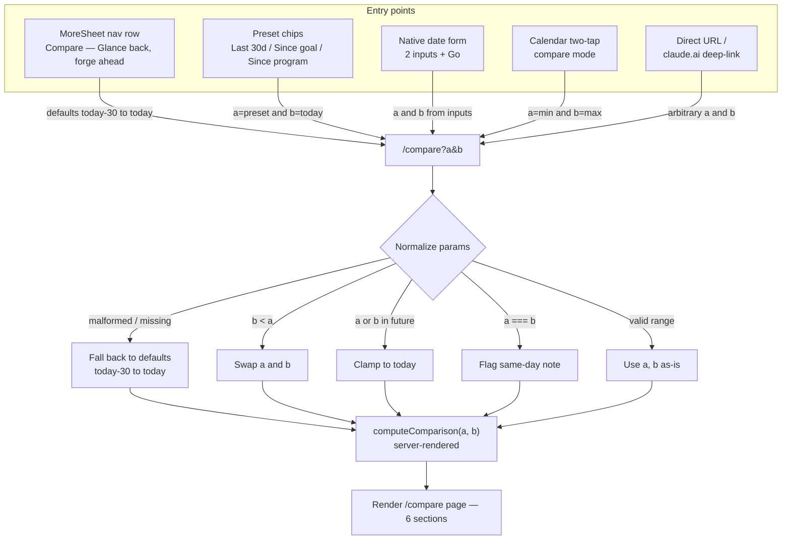
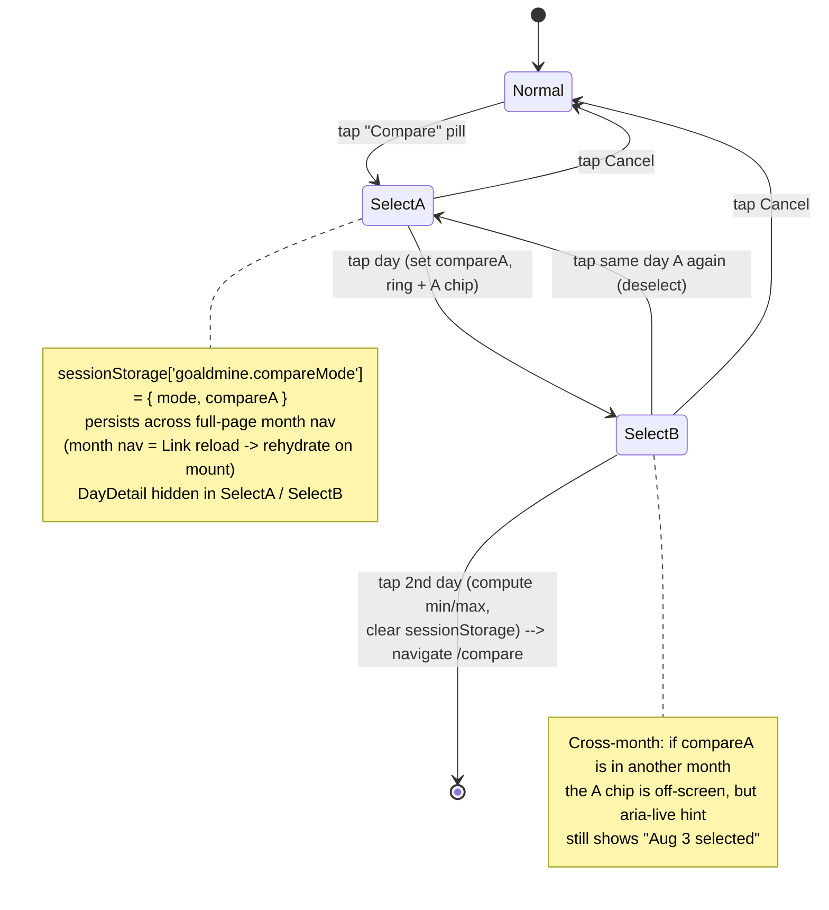

# UX Research — "Glance back, forge ahead" (two-date snapshot comparison)

**Feature:** `/compare` page + calendar two-tap compare mode (the `compare_dates` MCP tool is out of UX scope)
**PRD:** `docs/prds/PRD-glance-back-forge-ahead.md` (Approved)
**Pixel artifact (visual source of truth):** [`glance-back-forge-ahead.html`](./glance-back-forge-ahead.html) — open at 390px, toggle light/dark
**Delivery:** committed file only (no GitHub issue exists for this feature)
**Flavor layer:** off (neutral coach voice — the stable analytical core only)

> Chosen direction in one line: **"The Span, earned and disciplined."** A reflective DM-Serif span hero + paired-Bullseye readiness, a *strictly conditional* level-up strike band, then six density-ordered Cards of tri-state DeltaRows with native `<details>` overflow. All server-rendered; the only new client code lives in the already-client `CalendarMonth`.

---

## 1. Current-State Audit

No comparison UI exists anywhere in the app today. Everything below is precedent to reuse, not a defect — the "problem" is the absence of a surface that lets the user *feel* accumulated follow-through.

| Precedent | `file:line` | What it gives us / gap for `/compare` |
|---|---|---|
| Current/Start/Δ 3-tile grid | `src/app/progress/page.tsx:230-240`, `:259-266` | The stat-tile idiom to extract as `StatTile`. **Gap:** its Δ is a bare signed number — **no direction glyph, no color, no aria** (`:233-240`). `/compare` must add direction semantics without color-only. |
| SnapshotView changed-highlight | `src/components/SnapshotView.tsx:52-58` | The established "this changed" tint = `border-[var(--warning)]/50 bg-[var(--warning)]/5`. Reusable for "look-here-first" row emphasis (use sparingly). |
| snapshot-diff per-row `changed` flag | `src/lib/snapshot-diff.ts:44-61` | The "compute a per-row change flag server-side, then style changed rows" pattern DeltaRow descends from. |
| Recharts token discipline | `HistoryChart.tsx:36-58`, `ReadinessChart.tsx:26-77`, `WeightChart.tsx` | Charts pass `var(--…)` tokens, never hex; each is a `"use client"` island in an `h-48` box. Confirms: **any chart is a client island** — a reason to stay typographic in v1. |
| Card primitive | `src/components/Card.tsx:15-23` | `rounded-2xl border border-[var(--border)] bg-[var(--card)] p-4 shadow-sm`; header `h2 text-base font-semibold tracking-tight` + optional right `action` slot (used for the per-goal readiness mini-pair). |
| CalendarMonth selection | `src/components/CalendarMonth.tsx:97`, `:182`, `:190`, `:236-240`, `:282-285` | Single `useState(selectedKey)`; DayCell `<button onClick aria-pressed>`; `ring-2 ring-[var(--accent)]`; `DayDetail` renders below grid when `{selected}`. This is the base the two-tap state machine extends. Already `"use client"`. |
| Imperative one-shot pop precedent | `CalendarMonth.tsx:107-135` | `useEffect([cells])` → `querySelector` → `classList.add` — precedent for firing a CSS animation without ref plumbing. |
| MoreSheet nav rows | `src/components/MoreSheet.tsx:88-152` | Typed `NavRow[]`; a `/compare` row = one object + one 20px SVG icon. `BottomNav` (`:106`) 5 slots are full — `/compare` belongs under More, not a 6th tab. |
| DM Serif Display usage | `layout.tsx:28-33`; `AppHeader.tsx:35`, `character/page.tsx:71-73` | Largest existing serif is `text-3xl`; big readiness number on `/progress` is `text-4xl` **sans**. A DM-Serif hero at `text-4xl` for 1-2 words is a new-but-consistent moment. |
| macro-flash | `globals.css:377-396`; used `MealComposer.tsx:524` | `transparent → var(--accent-soft) (40%) → transparent`, 270ms, own reduced-motion guard. Its own comment: *"these numbers moved — NOT a win."* Exactly the delta-reveal primitive. |

**User impact of the gap:** the app has trend charts (slopes) but nothing that answers "who was I on March 1 versus who am I today" in one glance. That "gravity of following through" is the missing product moment (PRD §1.1, US-001).

---

## 2. Chosen Direction — "The Span, earned and disciplined"

Direction **A ("The Span")** is the spine: the PRD's headline success is the emotional payoff, and a reflective, typographic hero is the most on-brand (calm, honest) way to land it. Grafted in: from Direction **C**, the level-up **strike band** — but made *strictly conditional* (renders only when a level-up or readiness-band crossing was genuinely earned in-window), which resolves C's "loud-every-time" risk and honors the brand rule that celebration is earned; and from Direction **B**, the **tabular ledger discipline** (`tabular-nums` column alignment, density-ordered sections, native `<details>` to collapse overflow rows) so six sections stay scannable without a spreadsheet feel. Rejected: B whole (loses the payoff), C whole (two loud moments stacked; buries the per-goal framing by hoisting readiness out of the hero).

The hero is: a DM-Serif date span + "123 days of showing up." + a **paired-Bullseye readiness row** for the focus goal, where the A side (glyph + number) is `--muted`/receded and the B side is `--foreground`/full-weight — the then→now hierarchy is done with weight, not color, and the Bullseye motif *becomes* the delta (more rings filled on the right). Below: the conditional strike band, preset chips + native date form, then per-goal Cards first (Mt. Elbert, Chewgether), then family Cards (Strength PRs, Baselines, Body & wearables, The work between, Nutrition).

---

## 3. Phase-A Options (ASCII — the three competing directions, narrowed to A)

<details>
<summary>Direction A — "The Span" (chosen spine): reflective / typographic</summary>

```
+--------------------------------------+  <- full-bleed hero, NO card
|   Mar 1  ->  Jul 2                    |  DM Serif 36px
|   . 123 days .                        |  DM Serif 30px, muted
|   123 days of showing up.             |  Geist Sans 15px muted
|   Mt. Elbert readiness                |  12px muted
|     (o) 42  ---->  (O) 71             |  Bullseye pair: A muted, B foreground
+--------------------------------------+
| [Last 30d]* [Goal created] [Prog...]  |  preset chips (scroll-x)
| [ 2026-03-01 ] -> [ 2026-07-02 ][Go] |  native date form
| ( Mt. Elbert          42 -> 71  ^ )   |  goal card, Bullseye mini-pair in header
|   Weight       168.2 -> 159.0  ^ -9.2 |  DeltaRow
|   1.5-Mi Run   14:50 -> 12:58  ^ -1:52|
|   Squat Hold     95s -> 165s   ^ +70  |
|   Total elev   6.8k -> 19.4k'  ^ +12.6|
|   Prep hikes       0 -> 6      ^ +6   |
| ( Chewgether          20 -> 64  ^ )   |
|   MRR            $0 -> $180    ^ +180  |
|   Followers      -- -> 42     [ new ] |  accent-soft pill
| ( Strength PRs / Baselines / Body ... )  ... family cards
| ( The work between )  [47 wk][6 hk][12.6k']  StatTile grid 3-up
| ( Nutrition . 7-day avg )  Protein 150->175 ^ . Logged 3->7/7
+--------------------------------------+
```
**Best for:** the "who was I" gut-punch; the span is the star. **Risk:** tall scroll before data.
</details>

<details>
<summary>Direction B — "Ledger-first" (rejected): efficient / dense, dividers not cards</summary>

```
+--------------------------------------+
| Mar 1 -> Jul 2 . 123 days             |  one line, Geist Sans 16px (no serif)
| [Last 30d]* [Goal][Prog][YTD]         |  compact chips
| [ 2026-03-01 ] -> [ 2026-07-02 ]      |  inline date form
| ------------------------------------  |
| GOALS                                 |  11px caps muted section head
|  (O) Mt. Elbert         42 -> 71  ^   |
|   Weight     168.2 -> 159.0  ^ -9.2   |  tight DeltaRows, gap-1.5
|   ...                                 |
| ------------------------------------  |
| STRENGTH PRs / BASELINES / BODY ...   |  divider-separated blocks
| THE WORK BETWEEN  [47][6][12.6k][1860]|  4-up dense StatTiles
+--------------------------------------+
```
**Best for:** power scan, least scroll. **Rejected because:** loses the emotional payoff; dividers read as a spreadsheet / less premium; 4-up tiles cramp at 390px.
</details>

<details>
<summary>Direction C — "Strike-forward" (partially grafted): earned celebration foregrounded</summary>

```
+--------------------------------------+
|   Mar 1 -> Jul 2                      |  DM Serif 36px
|   123 days of showing up.             |
| ##====================================## |  STRIKE BAND (loud)
| ## <> YOU STRUCK GOLD                ## |  border-accent, bg accent-soft
| ##    Level  6  >>>  9               ## |  Mono 28px gold
| ##    Readiness (o)42 -> (O)71  ^+29 ## |
| ##==================================## |
| [chips] [date form]                   |
| ( Mt. Elbert / Chewgether / ... )     |  calm cards below
+--------------------------------------+
```
**Best for:** the gamified dopamine hit. **Grafted (not whole):** the strike band is kept but made **conditional** (only when earned); readiness stays in the hero, not the band, so per-goal framing isn't buried; only one loud moment, not two stacked.
</details>

The trade axis the three directions map: **how much the top of the page editorializes before the data starts.** A optimizes reflection, B scanning, C celebration. Chosen: A's reflection + C's one earned beat (conditional) + B's tabular discipline in the body.

---

## 4. Phase-B Technical Artifacts

Pixel mockup of the chosen direction (real tokens, both themes): **[`glance-back-forge-ahead.html`](./glance-back-forge-ahead.html)**.

### 4.1 Entry / navigation flow



### 4.2 Calendar compare-mode state machine



### 4.3 Two-tap gesture choreography

```mermaid
sequenceDiagram
    actor User
    participant CM as CalendarMonth (client)
    participant SS as sessionStorage
    participant RT as Router
    participant CP as ComparePage (server)
    User->>CM: tap "Compare" pill
    activate CM
    CM->>CM: mode = selectA
    CM->>SS: write { mode, compareA: null }
    CM-->>User: aria-live hint "Pick first day"
    deactivate CM
    User->>CM: tap day 1
    activate CM
    CM->>CM: compareA = day1, render ring + "A" chip
    CM->>SS: write { mode: selectB, compareA }
    CM-->>User: update hint "Aug 3 selected"
    deactivate CM
    User->>CM: tap day 2
    activate CM
    CM->>CM: compute [min, max] lexicographic
    CM->>SS: clear compareMode
    CM->>RT: Router.push(/compare?a=min&b=max)
    deactivate CM
    RT->>CP: navigate
    activate CP
    CP->>CP: computeComparison(a, b) — server-side
    CP-->>User: server-rendered 6 sections
    deactivate CP
    Note over CM,SS: No client network data-fetch;<br/>all reads happen server-side on ComparePage render
    Note over CM: A-chip entrance is CSS-only, reduced-motion guarded
```

### 4.4 CSS-only micro-animation timing (axis illustrative — see storyboard)

```mermaid
gantt
    title Compare CSS micro-animations (PROVISIONAL ms — verify)
    dateFormat X
    axisFormat %Ss
    todayMarker off
    section Calendar (axis illustrative)
    Pill normal-on bg+color 150-200ms ease-out          :p1, 000, 200
    A-chip entrance opacity+translateY 140-200ms cb(.16,1,.3,1)  :p2, 200, 200
    A-selection ring box-shadow fade 120-160ms          :p3, 210, 160
    Hint line opacity swap 120-160ms ease-out           :p4, 220, 160
    section Compare page (axis illustrative)
    Macro-flash delta-chip wash 220-320ms reduced-motion-none  :m1, 450, 320
```



---

## 5. Animation Storyboard

Motion budget is deliberately tiny and CSS-only. **`bullseye-pop` (320ms scale celebration) stays reserved for the once-per-day genuine win — it is used nowhere in `/compare` or compare mode.** Every animation has its own `prefers-reduced-motion` guard (→ instant/static).

### 5.1 Calendar two-tap compare mode

- **Frame 0 — Normal:** month grid; right-aligned `⇄ Compare` pill above; `DayDetail` mounted below.
- **Frame 1 — tap Compare → SelectA:** pill flips on (`bg transparent → var(--accent-soft)`, `text → var(--accent)`, label `⇄ Comparing · Cancel`); aria-live hint "Pick the first day." appears; `DayDetail` unmounts (React conditional, not animated). Motion: `transition: background-color, color ~150–200ms ease-out` ⚠ [gantt: *pill on*].
- **Frame 2 — tap day 1 → SelectB:** cell gains `ring-2 ring-[var(--accent)]` + a tiny corner "A" chip (same chip vocabulary as the existing `+N` overflow chip). Hint → "Pick the second day — Aug 3 selected." Motion: A-chip entrance opacity+`translateY(-2px→0)` via `@starting-style` ~140–200ms `cubic-bezier(0.16,1,0.3,1)` ⚠ [*A-chip enter*]; ring box-shadow bloom ~120–160ms ⚠ [*ring fade*].
- **Frame 2b — tap A again → deselect (undo):** ring + chip animate out (reverse). **Reads as undo, not error — no red, no `--warning`, no shake;** only presence/absence changes.
- **Frame 2c — cross-month persistence:** after a full-page month nav, state rehydrates from `sessionStorage`. A is off-screen, so a compact recall row `A: Aug 3 · ⇄ change` renders above the grid and the aria-live hint restates "Aug 3 selected." No entrance motion on reload (consistent with `force-dynamic`, no-skeleton).
- **Frame 3 — tap day 2 → navigate:** brief ring on B, compute `[min,max]` lexicographically on dateKey, clear `sessionStorage`, `router.push('/compare?a&b')`. **No celebratory pop — routine navigation.**

### 5.2 `/compare` delta reveal (restraint-gate decision)

- **Frame 0:** page paints fully server-rendered (`force-dynamic`, no skeleton) — numbers, glyphs, token colors all present.
- **Frame 1 (recommended):** a **one-shot `macro-flash`** wash (`transparent → ~14% gold var(--accent-soft) → transparent`, ~220–320ms `cubic-bezier(0.16,1,0.3,1)` ⚠) fires once on the **delta chips only**, all together — no per-row JS stagger (a stagger would need a client component). Reuses the existing `.macro-flash` class whose own comment already frames it as *"these numbers moved — NOT a win."*
- **Frame 2 (settle):** direction is carried permanently by the glyph (▲/▼/–) + token color; the flash was never the information channel.

**Restraint verdict (ranked):** (1) **macro-flash on delta chips [recommended]** — reuses a shipped primitive, semantically exact, zero new JS, free reduced-motion guard; (2) pure-CSS `nth-child` `animation-delay` staggered fade — acceptable but edges into decoration/ceremony the page hasn't earned; (3) nothing / instant — most minimal, fully defensible fallback. **Mandatory visual check ⚠:** confirm ~6–12 chips flashing at once does **not** strobe at 390px; if it does, degrade to hero-delta-chip-only, else to instant. Do **not** "fix" strobing by adding a stagger (crosses into decoration + a client boundary).

---

## 6. Behavioral Psychology Principles (core)

| Principle | How the design uses it | Where it lands |
|---|---|---|
| **Unit bias / process framing** | "123 days of showing up." converts diffuse effort into one countable, controllable unit; reframes the page from outcome to process. | Hero sub-line |
| **Goal-gradient effect** | Paired Bullseye rings filling center-out make the *remaining* distance to a goal feel traversable, accelerating effort near the end. | Hero readiness pair; per-goal card headers |
| **Peak-end rule** | Hero is the "peak"; density-ordering front-loads dense/positive sections; an optional closing "gravity line" would own the "end". | Whole-page ordering |
| **Loss aversion (mitigated)** | Losses loom ~2× larger; so non-goal metrics (e.g. weight when not on a cut) render **neutral** — signed number, no ▲/▼ valence, no color — and a paused metric is **never** a ▼. | DeltaRow direction logic |
| **Endowment / "held is a win"** | A maintained metric gets an affirmative neutral state, not a demoralizing `0`. | DeltaRow neutral state |
| **Fresh-start / milestone effect** | "new since then" / "started April" names temporal landmarks, anchoring identity change ("I became someone who tracks recovery"). | "new" pills; growth framing |
| **Effort justification / IKEA effect** | "The work between" enumerates self-authored volume (47 workouts, 12,600 ft), making outcomes feel earned. | StatTile grid |
| **Cognitive-load / chunking (~4)** | ≤3–4 headline rows visible per section; the rest deferred to native `<details>` — each section stays a single glance. | Section rhythm |
| **Pre-attentive processing** | Glyph *shape* (▲/▼/–) is read faster than a color's meaning or a signed number, and survives grayscale/colorblindness. | Delta chip glyphs |

---

## 7. Implementation Scope

New/changed surfaces (aligns with PRD §4.4; UX-specific notes added):

| File | Create/Modify | Client? | UX notes / named identifiers |
|---|---|---|---|
| `src/app/compare/page.tsx` | create | **server** (`force-dynamic`) | `max-w-md mx-auto p-4 space-y-4`; hero → conditional strike band → chips → date `<form method="get">` → 6 section Cards. Parallelize `computeReadiness` A/B via `Promise.all`; no skeleton. |
| `src/components/compare/DeltaRow.tsx` | create | **server-safe** | grid `1fr auto auto`, `min-h-[44px]`; label truncate; mono `A → B`; tri-state chip. `data-testid="delta-row"`. |
| `src/components/StatTile.tsx` | create | **server-safe** | `grid grid-cols-3 gap-2`; tile `rounded-lg border py-2 text-center`, `text-lg font-semibold` value + `text-xs text-[var(--muted)]` label. Extract from the `/progress` duplicate. |
| `src/components/compare/HeroSpan.tsx` | create | **server-safe** | DM-Serif span + paired `Bullseye` readiness (A `--muted`, B `--foreground`). |
| `src/components/compare/StrikeBand.tsx` | create (conditional) | **server-safe** | **Enhancement beyond PRD — see Ledger UXR-19.** Renders only when a level-up / readiness-band crossing is earned in-window; `border-[var(--accent)] bg-[var(--accent-soft)]`. |
| `src/components/CalendarMonth.tsx` | modify | **client (existing)** | add `mode: "normal"\|"selectA"\|"selectB"` + `compareA`; `⇄ Compare` pill; aria-live hint (`role="status"`); "A" chip + `aria-pressed` on compare selection; recall row; `sessionStorage['goaldmine.compareMode']`; `router.push`. `data-testid="compare-pill"`, `"compare-hint"`. |
| `src/components/MoreSheet.tsx` | modify | client | add `NavRow` "Compare — Glance back, forge ahead" + 20px SVG icon. |
| `src/app/globals.css` | modify | — | add `pill-on`, `A-chip enter`, `ring fade` blocks following existing patterns; each with its own `prefers-reduced-motion` guard. Reuse existing `.macro-flash` on delta chips. |

**Complexity:** page + presentational components = low (assembly + tokens). `CalendarMonth` compare mode = the one medium-risk piece (state machine + cross-month `sessionStorage` rehydration + the tap-A-again undo) — build it last, against the already-working page. Charts: **none in v1** except optionally reusing the existing `ReadinessChart` on the focus-goal card (client island; treat as out-of-v1 unless it clearly earns space).

---

## 8. Accessibility

- **Direction never color-only** (PRD §5.4): every delta carries a glyph (▲ improved / ▼ regressed / – neutral) + signed number + `aria-label` ("improved"/"regressed"/"unchanged"). "new since then" = accent-soft pill with visible "new" text.
- **WCAG AA, both themes** (verified against `--card`):
  - LIGHT on `#FFFBF0`: `--accent` 5.2:1, `--muted` 5.7:1, `--success` 5.8:1, `--danger` 6.7:1 — all PASS.
  - DARK on `#1A130C`: `--success` 6.5:1, `--accent` ~8:1 PASS; **`--danger` #C0392B = 3.4:1 → FAILS AA for normal text.** Structural fix: the **regressed chip keeps `--foreground` digits** (not `--danger`) and carries "worse" via the `border-[var(--danger)]/40` + the ▼ glyph. Never render small danger-red digits on coal.
- **Compare mode:** hint line is `aria-live="polite" role="status"` (announces each step without per-cell live regions); day cells expose `aria-pressed` for compare selection; the tap-A-again undo uses no error color.
- **Date form:** two `<input type="date">` with associated `<label>`s; visible focus rings; native form = full keyboard support for free.
- **Touch targets ≥ 44px:** preset chips (`min-h-[44px]`), date inputs + Go, compare pill, DeltaRow rows, `<details>` summaries.
- **Reduced motion:** every keyframe/transition guarded → macro-flash off, A-chip/ring/pill snap to final state; the page is fully usable static.
- Section Cards get `aria-label` summaries mirroring the `/progress` pattern.

---

## 9. ⚠ Provisional / Verify-Visually list

Confirm each on a real screen before shipping (all also tracked in the Ledger):

1. **Delta macro-flash reveal** — does a one-shot wash on ~6–12 chips at once strobe at 390px? If yes → hero-delta-only or instant. (~220–320ms `cubic-bezier(0.16,1,0.3,1)`, reduced-motion → none.) [UXR-10, UXR-11]
2. **A-chip entrance** ~140–200ms `cubic-bezier(0.16,1,0.3,1)` via `@starting-style`. [UXR-15]
3. **A-selection ring** box-shadow fade ~120–160ms — keep under ~180ms so 2nd-tap latency doesn't read as lag. [UXR-16]
4. **Compare pill on-transition** ~150–200ms ease-out. [UXR-17]
5. **Hide-vs-replace DayDetail in compare mode** — verify which feels steadier at 390px (unmount vs replace-in-slot to avoid reflow jump). [UXR-13]
6. **Conditional strike band** — verify it reads as *earned* (only when a level-up/band-crossing occurred) and does not compete with the serif hero; scope-adds → needs sign-off. [UXR-19]
7. **DM-Serif hero size** — cap `text-4xl` (36px) for 1–2 words, `text-3xl` (30px) for phrases; verify no bad wrap at 390px. [UXR-01]
8. **Dark-mode regressed chip** — confirm foreground digits + `--danger/40` border + ▼ reads clearly as "worse" without red digits (AA). [UXR-04]
9. **Reduced-motion pass** — full page + compare mode with `prefers-reduced-motion` on: no flash, instant states, still legible. [all motion rows]
10. **Contrast spot-checks** — `--accent`-on-cream and `--muted`-on-card in the tight light palette at final sizes. [UXR-04]

---

## 10. Recommendation Ledger

Stable IDs (assigned once; never renumbered). The implementing PR ticks each `Status` to `shipped` / `reworked` / `dropped` with a SHA / `file:line` / short reason, and fills `Evidence`.

| ID | Recommendation | Type | Status | Evidence |
|---|---|---|---|---|
| UXR-glance-back-forge-ahead-01 | Hero = "The Span": DM-Serif date span + "N days of showing up." + paired-Bullseye readiness (A `--muted`, B `--foreground`); serif capped text-4xl/1-2 words, text-3xl/phrases | layout | shipped | src/components/compare/HeroSpan.tsx (389fb27) — DM-Serif text-4xl span + "N days of showing up." |
| UXR-glance-back-forge-ahead-02 | Readiness pair reuses `Bullseye` glyph (size ~28, center-out fill); numbers mono `tabular-nums` text-4xl; A receded / B full-weight (then→now via weight not color) | component | shipped | HeroSpan.tsx — Bullseye 28px pair, mono tabular-nums text-4xl, A muted/opacity-50, B foreground/semibold; score/100 clamped |
| UXR-glance-back-forge-ahead-03 | DeltaRow tri-state chip: ▲ improved / ▼ regressed / – neutral + signed number + `aria-label`; "new since then" = accent-soft pill; meaning never color-only | a11y | shipped | src/components/compare/DeltaRow.tsx — ▲/▼/– + signed number + aria-label; newSinceA accent pill |
| UXR-glance-back-forge-ahead-04 | Dark-mode regressed chip keeps `--foreground` digits + `border-[var(--danger)]/40` + ▼ (danger-red text fails AA on coal, 3.4:1) | a11y | shipped | DeltaRow.tsx — regressed chip keeps --foreground digits + border-[var(--danger)]/40; verified dark @390px |
| UXR-glance-back-forge-ahead-05 | Density-ordered sections (readiness → baselines → PRs → body → work-between → nutrition) with native `<details>` collapsing overflow rows (~3–4 headline rows visible) | layout | shipped | src/app/compare/page.tsx — goals→baselines→PRs→body→work-between→nutrition; ≤4 headline rows + native <details> ("Show all N") |
| UXR-glance-back-forge-ahead-06 | "new since then" (A-null, B-present) framed as growth/accumulation; A-present + B-null → neutral "paused" note, **never a ▼**; both-null → omit | copy | reworked | newSinceA pill shipped; A-present/B-null unreachable under as-of semantics (rows≤A ⊆ rows≤B); both-null goal-target rows kept visible (— → —) rather than omitted — targets on a young goal are informative |
| UXR-glance-back-forge-ahead-07 | "The work between" = StatTile grid (`grid-cols-3`), reuse `/progress` 3-tile idiom; raw counts (not deltas) belong only here | component | shipped | src/components/StatTile.tsx + page.tsx grid-cols-3 "The work between"; raw counts only there |
| UXR-glance-back-forge-ahead-08 | Preset chips as plain `<Link>`s; omit chips whose anchor date doesn't exist / predates program; ensure ≥1 chip always survives else drop the row | layout | shipped | page.tsx preset chips — Last 30 days always; Goal created / Program start omitted when anchor absent |
| UXR-glance-back-forge-ahead-09 | Date picker = native `<form method="get">` + two `<input type="date">` + Go, all ≥44px; params regex-validated, malformed → defaults | layout | shipped | page.tsx native GET form, two <input type="date">, min-h-11, regex all-or-defaults fallback |
| UXR-glance-back-forge-ahead-10 | Delta reveal = one-shot `macro-flash` on delta chips only (all together, no JS stagger), reduced-motion → none; verify no strobe on ~6–12 chips, else degrade to hero-only/instant | tuning⚠ | shipped | DeltaRow chip carries .macro-flash, no JS stagger; strobe check passed at 390px (subtle one-shot wash) |
| UXR-glance-back-forge-ahead-11 | macro-flash timing ~220–320ms `cubic-bezier(0.16,1,0.3,1)` (reuse existing `.macro-flash`) | tuning⚠ | shipped | reused existing .macro-flash keyframe verbatim (globals.css), own reduced-motion guard |
| UXR-glance-back-forge-ahead-12 | Calendar compare-mode entry = right-aligned `⇄ Compare` pill above grid; on-state `bg-[var(--accent-soft)] text-[var(--accent)]`, label "⇄ Comparing · Cancel", `aria-pressed`, `min-h-[44px]` | component | shipped | src/components/CalendarMonth.tsx (7bc2942) — right-aligned pill, on-state accent-soft "⇄ Comparing · Cancel", aria-pressed, min-h-11 |
| UXR-glance-back-forge-ahead-13 | Hide DayDetail during compare mode; verify hide-vs-replace-in-slot to avoid reflow jump at 390px | layout⚠ | shipped | DayDetail unmounted while mode ≠ normal; verified at 390px — no jarring reflow; one-frame flash on month-nav rehydrate accepted (blueprint v3 Fix 6) |
| UXR-glance-back-forge-ahead-14 | First pick = `ring-2 ring-[var(--accent)]` + corner "A" chip; tap-A-again = undo (no error color, no shake); 2nd pick computes lexicographic min/max → navigate | component | shipped | CalendarMonth.tsx — ring-2 accent + corner "A" chip, tap-A-again undo (presence/absence only), lexicographic min/max router.push |
| UXR-glance-back-forge-ahead-15 | A-chip entrance opacity+`translateY` via `@starting-style` ~140–200ms `cubic-bezier(0.16,1,0.3,1)`, reduced-motion → instant | tuning⚠ | shipped | globals.css .compare-a-chip — @starting-style entrance 170ms cubic-bezier(0.16,1,0.3,1), reduced-motion guarded |
| UXR-glance-back-forge-ahead-16 | A-selection ring box-shadow fade ~120–160ms (keep <180ms so 2nd-tap doesn't feel laggy) | tuning⚠ | shipped | globals.css .compare-ring — box-shadow fade 150ms (<180ms), reduced-motion guarded |
| UXR-glance-back-forge-ahead-17 | Compare pill normal→on transition ~150–200ms ease-out (color/bg only, no transform), reduced-motion → snap | tuning⚠ | shipped | globals.css .compare-pill — bg/color 180ms ease-out, reduced-motion guarded |
| UXR-glance-back-forge-ahead-18 | aria-live `role="status"` hint line; cross-month recall row "A: {date} · ⇄ change" so a half-made comparison stays honest after full-page month nav | a11y | shipped | CalendarMonth.tsx — aria-live polite role=status hint + cross-month recall row (full 42-cell grid condition, blueprint v3 Fix 5); verified across Jun↔Jul |
| UXR-glance-back-forge-ahead-19 | Conditional strike band (level-up / readiness-band crossing earned in-window) — border-accent + accent-soft, DM-Serif "Level 6 → 9". **Scope-add beyond PRD — requires sign-off**; render only when earned, else omit; no `bullseye-pop` | decoration⚠ | reworked | Shipped MINIMAL: src/components/compare/StrikeBand.tsx renders only when levelB > levelA (verified live: Level 4→10); readiness-band-crossing trigger deferred |
| UXR-glance-back-forge-ahead-20 | No charts in v1 except optionally reusing existing `ReadinessChart` on focus-goal card (client island) — 2 points isn't a trend; hold typographic/tabular | decoration⚠ | dropped | Typographic v1 held — no charts on /compare; ReadinessChart reuse deferred |
| UXR-glance-back-forge-ahead-21 | Optional closing "gravity line": one deterministic, server-computed sentence (no LLM) tying counts to outcome, selected only from metrics present on both dates | copy | dropped | Deferred to the share-card fast-follow |
| UXR-glance-back-forge-ahead-22 | Out-of-v1 (needs heavy client) — flag & defer: animated JS count-up numbers, drag/scrubber date slider, custom animated `<details>` accordion, per-section sparklines. (Share card already deferred in PRD §3.3.) | tuning⚠ | dropped | All client-heavy ideas deferred as recommended |

---

*Team: 3 Explore agents (current UI / brand-motion / data-layer) → 3 Plan specialists (data & behavior / Next.js & animation / UI & brand) → Phase-A ASCII options → Phase-B Mermaid + HTML pixel artifact + animation storyboard. Flavor layer intentionally off per profile (neutral coach voice).*
