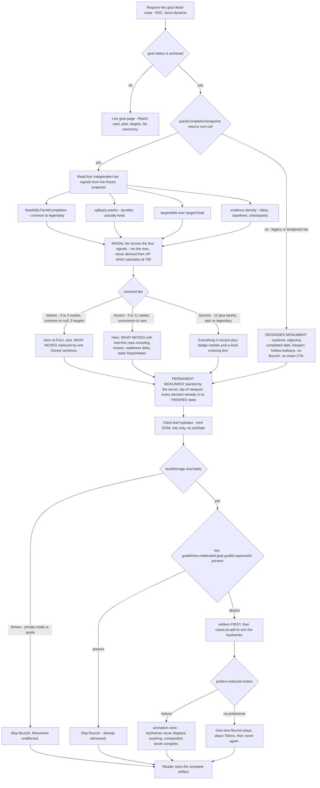
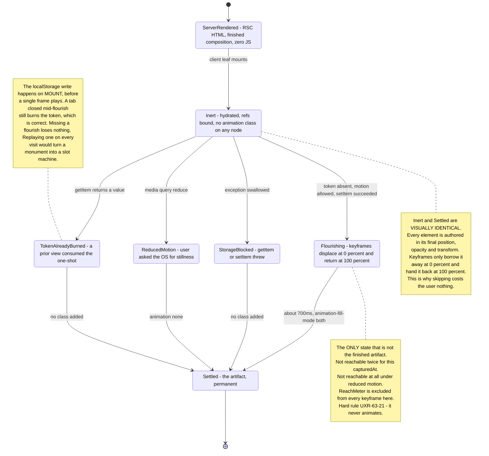
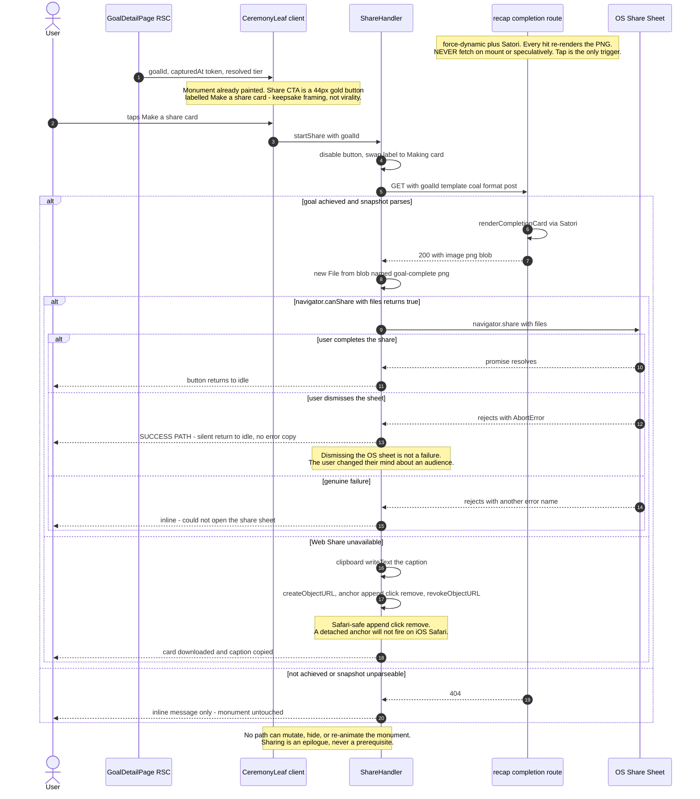

# UX Research — Goal-Completion Celebration Upgrade ("The Assay")

**Feature:** Make achieving a goal feel monumental and produce genuine pride.
**Surface:** `/goals/[id]`, `status === "achieved"`.
**Deliverable:** research-first — a `/feature-dev` PRD follows and **must read this document before drafting**.
**Mockup:** [`goal-celebration-upgrade.html`](./goal-celebration-upgrade.html) · **Phase-A options:** [`goal-celebration-upgrade-phase-a.md`](./goal-celebration-upgrade-phase-a.md) · **Ledger:** [`goal-celebration-upgrade-ledger.md`](./goal-celebration-upgrade-ledger.md)

Reference case throughout: the founder's **Mt. Elbert** completion — 98 days, readiness 8 → 89, 7/9 targets met, +700 XP, 2 badges, 18 hikes, 20 baseline arcs.

> **Two corrections to the app profile**, verified in source and applied throughout this report:
> `--target` is **`#9A480F`** (light) / **`#D97A3D`** (dark) — burnt ochre/rust, **not** red. The reds `#A82A1F` / `#C0392B` are `--danger`. The Bullseye must never read as an error state.

---

## 1. Current-State Audit

### 1.1 The headline finding — this is *categorical*, not a tuning problem

`.goal-completed-ring` does not have its own keyframe. It consumes **`level-up-burst`** — literally the same keyframe as the routine level-up (`globals.css:145-148`, consumed at `:155` and `:178`).

| | Level-up | Goal completion |
|---|---|---|
| Keyframe | `level-up-burst` | **`level-up-burst`** (identical) |
| Easing | `cubic-bezier(0.16,1,0.3,1)` | identical |
| Stroke | `2px solid var(--accent)` | identical |
| Scale | `0.8 → 2.2` | identical |
| Envelope | 64px | identical |
| Rings | 2 | 3 |
| Duration | 560ms + 120 stagger = 680ms | 640ms + 280 stagger = 920ms |

**The entire delta between "you leveled up" and "you summited a mountain after 98 days" is one extra ring and 240ms.** The source comment says so out loud (`globals.css:169-172`): *"reuses level-up-burst's keyframe/easing family so the two celebrations feel like the same visual language."*

That decision was correct for visual coherence and wrong for magnitude signalling, and the two goals are genuinely in tension. **Weber's law is the wrong lens** — a 2→3 ring change is well above the discrimination threshold *if the stimuli are side by side*, and they never are (weeks apart). The operative task is **absolute identification**, where **categorical perception** compresses within-category differences: the user does not encode "a bigger burst," they encode *the burst* — the same token they saw after a routine level-up.

**Consequence, and it governs the entire design: no amount of parameter tuning escapes the category.** 1,800ms and five rings would still be "the burst, but longer," and would additionally read as sluggish. A distinct category of event requires a distinct **form**.

### 1.2 It probably fires off-screen — and burns its one-shot token doing so

`GoalCompletedCelebration` is mounted as the **last child** of the Completed card (`goals/[id]/page.tsx:346-351`) — *after* the 2×2 stat grid, both `ReachMeter`s, and the "Completion card →" link. At 390px that node sits roughly 520–640px below the card's top edge, i.e. below the fold in most sessions.

The `useEffect` (`GoalCompletedCelebration.tsx:59-72`) writes the localStorage token **unconditionally, in the same tick it adds the animation classes**, with no `IntersectionObserver`. So the one-shot burns whether or not anyone saw it.

**The most likely subjective experience of the current celebration is no celebration at all.** This reframes the brief: the under-celebration is partly a *placement* bug wearing an *animation* bug's clothes.

### 1.3 Everything else the audit found

| # | Finding | Location | User impact |
|---|---|---|---|
| a | **Fully `aria-hidden="true"`** on the whole wrapper, including the 🏆 | `GoalCompletedCelebration.tsx:76` | A screen-reader user completing a 98-day goal gets a silent DOM node. It is the only one of the three celebrations with no accessible name. |
| b | **Reduced motion = `display: none`** on all three rings | `globals.css:190-194` | Leaves a bare 32px emoji with **zero** compensating composition — a direct violation of the invariant. This is the one place the codebase breaks its own stated rule (`globals.css:338`: *"Every block has a reduced-motion fallback that jumps straight to the final state"*). |
| c | **Two 🏆 emoji render in the same card** — `text-3xl` in the header (`:284`) and `fontSize:32` in the celebration (`:90`) | `page.tsx:284`, `:346-351` | The ceremony's focal glyph is a duplicate of a static decoration a few inches above it, weakening its claim to being a distinct event. |
| d | **The ceremony abandons the brand's own glyph** for a vendor emoji | — | The app owns a Bullseye and a treasure chest; the one licensed celebration moment uses neither. |
| e | **"Reopen" is the very next card** after the trophy | `page.tsx:365-377` | Peak-*end* rule: the end of a 98-day achievement is currently "do you want to un-achieve this?" |
| f | **"Completion card →" is a bare `text-sm` link**, ~20px tall | `page.tsx:342-344` | Fails the ≥44px touch-target invariant today, and navigates the SPA to a raw PNG with no chrome, no preview, and no way to reach the `parchment` template or `story`/`square` formats. |
| g | **`badgesUnlocked` and `levelBefore`/`levelAfter` are computed, returned over MCP, narrated by the coach — and thrown away by the web UI** | `tools.ts:5261-5292`; `page.tsx` never imports `computeGameState` | The two most monumental facts a completion produces are invisible on the goal's own page. |
| h | **The share card is more informative than the app.** `xpBasis.weeks` renders on the PNG but not the page | `completion-card.tsx:202` vs `page.tsx:297-323` | The exported image tells a better story than the product. |
| i | **`snapshot.readiness === null` leaves a ragged 3-cell grid** in a 2-column layout | `page.tsx:298` | Zero-target goals get a visible hole, unhandled. |
| j | **Degraded path mounts no celebration at all** | `page.tsx:354-362` | A legacy achievement gets zero acknowledgement — an achieved goal rendered as an error message. |
| k | **Recharts' default 1500ms mount animation is silently ON and un-reduced-motion-guarded** across every chart | `isAnimationActive` never set anywhere in the repo | A live a11y bug on `/progress` and the Story card, independent of this feature. |

### 1.4 Two data-model corrections that expand the design space

Phase-1 exploration concluded these were unavailable. They are not.

- **`levelBefore` IS recoverable server-side, permanently.** `GameState.events` is a full frozen history (`types.ts:41`) and `compare.ts:417-422` already ships the prefix-sum precedent (`xpAsOf`). Since the completion's own event is uniquely identifiable (`engine.ts:751-758`, `ruleId: "goal.achieved"`), `levelAfter = levelFromXp(Σ events ≤ completedDateKey)` and `levelBefore = levelFromXp(that − thisEvent.xp)`. This is stable forever, not a localStorage diff.
- **Badges unlocked by *this* completion are recoverable**: `badges.filter(b => b.dateKey === snapshot.completedDateKey)`.

**One `computeGameState()` call buys the level diff, the badge set, and the XP position together** — one engine pass for the entire systemic-consequence layer, not one per beat.

### 1.5 Magnitude must not scale off XP

`goalAchievedXp = 150 + min(weeks,12)*25 + min(targetsMet,5)*50` (`rules.ts:128-150`). **Range 150–700. Elbert's +700 is the literal ceiling** — the formula saturates at ~3 months + 5 targets and cannot express anything larger.

The real magnitude system already exists and is already frozen on the snapshot: **Reach** (`rarity-core.ts`, 5 tiers, `feasibilityTierAtCompletion`).

**But Reach cannot be a loudness dial either.** A prior audit (`epic61-coherence-audit.md:79`) binds Epic/Legendary to `var(--warning)` as deliberately *"alarming-not-prizey… never gold, never the reserved rust-red."* So ceremony chrome stays `--accent`/`--accent-soft` at every tier. **Higher tiers buy more evidence and more beats — never more colour, never more volume.**

### 1.6 The floor case is severe, and it is the real test

For a modest 2-week zero-target goal the *only* guaranteed-non-null fields are `objective`, `completedDateKey`, `daysElapsed`, `targetsMet`/`targetsTotal` (as `0/0`), `xpAwardedAtCompletion` (≥150), `kind`, `backdated` — plus the derived badges and level crossing. `readiness` is `null`, `readinessSeries` is absent, `targets` is `[]`, both Reach tiers are `null`, `timeline` is `null`, and all arcs are empty. **Five of the six Story cards render nothing.**

Note the inversion that saves this case: a *first* completion almost always unlocks **two** badges (`goal-first` "First Summit" + `goal-fit-finisher`/`goal-ship-it`) and very likely crosses L1→L2. **The poorest-in-data completion is the richest-in-firsts.**

### 1.7 Measured colour constraints (new, and binding)

| Pair | Dark | Light | Consequence |
|---|---|---|---|
| `--accent` vs `--target` | **1.35:1** | **1.16:1** | **Gold and rust are luminance twins. They cannot touch.** Every adjacency needs a 10–18px gap of background. This retroactively explains why the current burst works at all — the rings expand *away* through background. |
| `--target-fg` inside `--target` | **3.09:1** | 6.14:1 | Graphic-only in coal. **Never place text inside the rust rings in dark.** |
| `--accent` on `--accent-soft` | 6.61:1 | **4.14:1** | **Fails AA in light** at 12px bold. Accent eyebrows must sit on plain `--background`/`--card`. *This is a live defect in `compare/StrikeBand.tsx:24` and should be filed separately.* |

Passing pairs used here: `--accent` on bg 8.56 / 4.95 · `--success` on bg 6.88 / 5.46 · `--muted` on bg 5.72 / 5.44 · `--foreground` on bg 16.29 / 16.35.

---

## 2. Chosen Direction — "The Assay"

**Pride is an artifact, not an event.**

The achieved page renders proud from the top of the viewport, **permanently**. There is no modal, no takeover, no auto-opening dialog. A one-shot flourish plays on first view — and **if it is missed, nothing is lost**, because the flourish never carried information.

This is the inversion. Today, motion *is* the celebration, so a missed animation means a missed celebration and a burnt token. In The Assay, layout carries the pride and motion is garnish. That single move fixes §1.2 by construction, makes the reduced-motion frame byte-identical to the settled frame, and gives the lowest a11y risk of the three candidates.

It escapes the category (§1.1) not by making a bigger burst but by **ceasing to be a burst**: a 224px rust Bullseye nested in a closed gold annulus, a 36px serif objective, and a full accounting of what moved is not a larger member of the "ring burst" class — it is a different kind of object.

**Why not the takeover** (Phase-A Direction 1, and the option PRD US-007 already sanctions): it has the highest emotional ceiling and it is also the exact form factor of every streak-celebration modal on earth, which is the anti-benchmark. It risks being *a bigger token, still a token*. Decisive practical objection: it keeps the pride trapped behind a one-shot that can be missed, and a full-screen interrupt for a 14-day errand would read precisely as overclaiming. The takeover is not lost — its **ring-break survives as a 380ms flourish** layered on a monument that is always there.

**Grafted from the runners-up:**
- **From D1 (Summit Sheet):** the ring-break past the screen edge; the "static IS final" authoring discipline; ≥44px peer CTAs; the `sr-only` one-sentence summary.
- **From D3 (Vein Strike):** the entire cheap spine — delete the duplicate emoji, promote the CTA to 44px, demote Reopen below the Story section, move the celebration above the fold. **Ship this spine regardless of whether the rest lands.**
- **From the brand direction:** the hero as rust nested inside a gold annulus, closing the Bullseye ↔ sweep-arc seam by *nesting* rather than morphing.
- **From the behavioural direction:** tier-scaled beat count, the "render the misses" rule, and the permanence line.

### 2.1 The permanent composition

1. **Eyebrow** `GOAL COMPLETE` — `text-xs font-bold tracking-[0.09em]`, `var(--accent)`, on plain `--background` (never on `--accent-soft`, §1.7).
2. **Hero** — filled `<Bullseye>` at **200–240px ⚠**, rust, inside a **closed gold annulus** (`1.5–2px ⚠ solid var(--accent)`) with a **10–18px ⚠ gap of plain background** between them. Mandatory, not decorative (§1.7).
3. **Objective** — DM Serif Display 400, `text-4xl` (36px — the app's existing max in `compare/HeroSpan.tsx`, **no new precedent required**), `text-balance`, 3-line clamp, steps down above ~48 chars.
4. **Subline** — `Completed Aug 9, 2026 · 98 days`, `text-[13px] var(--muted)`; appends ` · backdated` when `snapshot.backdated`.
5. **Mono fact line** — `98 DAYS · 7/9 TARGETS · +700 XP`, `tabular-nums`.
6. Hairline → **`WHAT MOVED`** → target rows ported from the Satori card's `TargetRow` (`completion-card.tsx:99-147`): met-first, `✓` in `--success` / `·` in `--muted`, label, `start → final units` right-aligned, capped at 6 with `+N more`.
7. **Readiness** `8 → 89` + the honest caption `Weighted progress across your targets`.
8. **`ReachMeter`** — static. **Never animates** (`ReachMeter.tsx:12`, UXR-63-21).
9. **Badge medals** (52px) + level-crossing line when `levelBefore < levelAfter`.
10. **`Frozen at completion. This never recomputes.`**
11. **CTAs** — `Make a share card` (44px gold) + `Back to goals` (44px outline).

### 2.2 The three rules that make it work

**Rule A — "static IS final."** Every element is authored in its **finished** visual state; keyframes displace it at `0%` and return it at `100%`, with `animation-fill-mode: both`. Therefore `animation: none` — from reduced motion *or* a skip *or* a burnt token — lands the complete composition with no compensating rules and no second code path. The reduced-motion path is not the degraded path; **it is the fast path.**

**Rule B — render the misses.** Elbert is 7 of 9. The two unmet targets belong *in* the ceremony, staggered at the same tempo and in the same style as the hits. A ceremony that structurally cannot say something unflattering is saccharine by construction, and "honest" is doing real work in the product thesis. **Corollary discovered during mockup:** the 6-row cap must **reserve its last slot for the first unmet target** — naive met-first ordering with 7/9 met hides every miss behind `+3 more`.

**Rule C — scale by beat count, never loudness.** Ceremony weight = how much there is honestly to say. Tier is the **modal** value across `feasibilityTierAtCompletion`, `xpBasis.weeks`, `targetsMet`, and evidence density — *not* the max, and never XP (§1.5).

| Tier | Range ⚠ | What changes |
|---|---|---|
| **Marker** | ~0–3 weeks, common/null, 0 targets | `WHAT MOVED` collapses to one honest sentence. **The hero does not shrink.** |
| **Ascent** | ~4–11 weeks, uncommon–rare | Full evidence block, fewer rows. |
| **Summit** | ~12+ weeks, epic–legendary | Everything, plus badge medals and the level crossing. |

The shortening is **emergent, not special-cased**: `rows.slice(0,CAP).map((row,n) => style={{animationDelay: BASE + n*STEP}})`. One row means `n` only ever equals 0, so the chain simply ends earlier. There is no `if (tier === 'marker')` anywhere in the CSS.

**Why the hero never shrinks:** the hero asserts "a goal was completed," which is exactly as true for an 11-day errand as for a 98-day mountain. Shrinking it would encode a value judgement the app has no business making. The *evidence* below scales; the *claim* above does not.

### 2.3 Deliberate divergences from the brief

- **No overlay**, though PRD US-007 sanctions one. Argued in §2 above.
- **No sound, no haptics.** `navigator.vibrate` is unsupported on iOS Safari including installed PWAs, and the primary user is on iOS. Audio would fire on navigation, where autoplay activation is inconsistent — an intermittent ceremony reads as a bug. The app has zero sound today and that consistency is an asset. *Straight recommendation: ship neither, revisit only if WebKit ships the Vibration API, and then as a whole-app decision.*
- **Sharing is an epilogue, not the climax.** Making the terminal gesture "now show people" retroactively reframes 98 days of autonomous pursuit as instrumentally social (over-justification effect) — a values inversion for a private, single-tenant, honest logger. The CTA is framed as **keepsake** (`Make a share card`), never broadcast, and dismissal is never gated on it. The 14px link is promoted to 44px regardless.

---

## 3. Phase-A Options (divergent, narrowed to one)

Three competing directions were drawn at 390px in both palettes. Full ASCII set: **[`goal-celebration-upgrade-phase-a.md`](./goal-celebration-upgrade-phase-a.md)**.

- **D1 — "The Summit Sheet"** · full-screen portaled `<dialog>` on the existing BottomSheet shell, opening automatically on first view. Staged beats, `Skip` opaque from frame 0, dismisses onto the permanent card.
- **D2 — "The Assay"** · in-page editorial monument, no overlay. **← CHOSEN**
- **D3 — "Vein Strike"** · in-card escalation. The restrained/cheap option: move the celebration to the top of the card, delete the duplicate emoji, swap in a 72px Bullseye, demote Reopen, promote the CTA.

| | **D1 Summit Sheet** | **D2 The Assay** | **D3 Vein Strike** |
|---|---|---|---|
| **Category-distinctness** | Strongest — new surface, new glyph, focus moves. Risk: a *bigger token, still a token*. | Strong, differently — escapes by removing the event category. Risk: escaping into "the page I already saw." | Weakest — same card, same page. Plausibly still encoded as "the burst, but browner." |
| **Floor-case dignity** | Good if centred. ⚠ A takeover for a 14-day goal may read as overclaiming — the one place it could feel Duolingo-ish. | **Best** — the honest sentence occupies the structural slot the evidence block occupies for Elbert. | Adequate but thin. Two numerals + one badge is very close to a level-up card. |
| **a11y risk** | **Highest** — the only direction that can *trap* a user. All solvable, but must be QA'd with VoiceOver on device. | **Lowest** — no overlay, no focus management, ordinary document flow. | Low. |
| **Build cost** | Highest | Medium — biggest lift is porting `TargetRow`, whose sort/cap/format logic already exists and is tested. | **Lowest** — roughly half a day. |
| **Thesis fit** | Weakest — ~1440ms of choreography with focus management is not "deliberately minimal." | **Best** — ~700ms, no overlay, "dead-simple on a phone" is literally the mechanism. | Good on minimalism, weak on honesty — surfaces no new truth. |
| **Saccharine risk** | **Highest** — the form users pattern-match to streak modals. | **Lowest** — an assay report is the least Duolingo object imaginable. Inverse risk: may feel *informative* rather than proud. | Low-medium. Its risk is being *forgettable*. |

**The actual trade:** D1 says pride is an **event**; D2 says pride is an **artifact**; D3 says pride is an **adjustment**. D2 is the only one whose reduced-motion, token-burned, storage-blocked, and second-visit states are all the same experience.

---

## 4. Phase-B Technical Artifacts

### 4.1 First-view resolution and tier routing



Every branch converges on the same terminal node. **The monument is server-painted and unconditional; the only thing any gate can remove is the flourish.** The degraded path deliberately drops the share CTA because `/recap/completion` 404s on an unparseable snapshot — offering it would be a promise the server cannot keep. ⚠ Tier thresholds are provisional and should be re-fit against the real distribution of completed goals before hardening.

### 4.2 Ceremony element states



### 4.3 Animation timing — first-view flourish

```mermaid
gantt
    title First-view flourish - axis illustrative, EVERY value provisional pending playtest
    dateFormat x
    axisFormat %Lms
    todayMarker off

    section Hero
    B0 eyebrow - opacity - ease-out :b0, 0, 180
    B3.1 rim disc - scale only - opacity held at 1 :b31, 0, 300
    B3.2 cream disc - bullseye-pop - cubic-bezier :b32, 40, 340
    B3.3 rust disc - bullseye-pop - cubic-bezier :b33, 80, 380
    B3.4 centre dot - bullseye-pop - cubic-bezier :b34, 120, 420
    B4 annulus closes - scale plus opacity - cubic-bezier :b4, 170, 470
    B1 ring departs past screen edge - cubic-bezier :b1, 170, 690

    section Facts
    B5 objective - opacity plus translateY - cubic-bezier :b5, 210, 500
    B6 subline - opacity only - ease-out :b6, 270, 470
    B7 mono fact line - opacity only - ease-out :b7, 310, 510
    B8 hairline and WHAT MOVED - opacity only - ease-out :b8, 340, 540

    section WHAT MOVED stagger - 40ms offset per row
    B2.1 row one met - cubic-bezier :b21, 360, 580
    B2.2 row two met - cubic-bezier :b22, 400, 620
    B2.3 row three unmet - same tempo and style :b23, 440, 660
    B2.4 row four - cubic-bezier :b24, 480, 700

    section Static by design
    M1 ReachMeter never animates - UXR-63-21 :milestone, m1, 0, 0
    Z0 tail below fold - authored final - no rules :milestone, m2, 0, 0
    Composition settled :milestone, m3, 700, 0
```



Two easings only, and the split is principled: anything moving in space uses `cubic-bezier(0.16,1,0.3,1)`; anything changing only opacity uses `ease-out`. `B7` is opacity-only deliberately — a sub-pixel `translateY` on `tabular-nums` digits produces visible glyph shimmer at non-integer DPR.

**`M1` and `Z0` are zero-length milestones on purpose** — so a reader can see the omission was decided, not forgotten.

⚠ Every value is provisional. `B1` and `B2.4` land within ~15ms of each other by design: the ring exits upward as the last row settles downward, releasing the eye down the page.

### 4.4 The share / keepsake closing beat



Two decisions to carry out of this: **`AbortError` resolves into the success branch**, and the PNG fetch is **strictly tap-triggered** — the route is `force-dynamic` and runs Satori per request, so prefetching on mount would burn a full image render on every view of an achieved goal, most of which will never be shared. Reuse the existing handler at `RecapClient.tsx:186-243` verbatim. ⚠ `template=coal` / `format=post` defaults are provisional; a keepsake may want `square`.

### 4.5 Pixel mockup

**[`goal-celebration-upgrade.html`](./goal-celebration-upgrade.html)** — self-contained, real tokens, both palettes. Frames: Summit settled · Marker floor case · flourish filmstrip (with a live replay button) · reduced-motion still vs. what ships today · before/after with the angular-size argument. Includes the measured contrast table and on-canvas dimensioning of the rust↔gold gap.

> ⚠ Type is substituted (Georgia for DM Serif Display, `system-ui` for Geist) — the objective will set narrower in production.

---

## 5. Animation Storyboard

Bar IDs match the §4.3 gantt. Time-ordered: `B0` → `B3.1` → `B3.2` → `B1`+`B4` → `B3.3` → `B5` → `B3.4` → `B6` → `B7` → `B8` → `B2.1…B2.4`.

### 5.1 Frames

**F0 · t = 0ms — first paint.** Nothing is moving yet; every animated bar is held at its `0%` keyframe by `fill-mode: both`. The user sees a small rust disc where the target will be, and an already-complete page beneath it. **Not an empty screen.**

> **The outer rim never fades.** `bullseye-pop` ramps opacity `0 → 1`, but applying that to the rim would leave a genuinely blank hero at t=0 — and worse, `--target-fg` `#FFFBF0` against `--background` `#FAF3E3` is *invisible*, so a cream disc arriving before the rust field would show nothing. `B3.1` therefore runs a **scale-only** variant with opacity held at 1. The hero silhouette exists in every single frame.

**F1 · ~60ms — the target assembles from the rim.** Discs seat **outer → in**, so the target builds inward and lands on the centre dot. Via `transform-box: fill-box` + `transform: scale()` on the existing component's `<circle>` elements — **`Bullseye.tsx` needs no modification.**

**F2 · ~160ms — the annulus closes and its echo departs.** `B4` (annulus) and `B1` (flying ring) are **two separate DOM nodes born at the same delay**. One settles inward and is permanent; one expands and dies. *This is the single most important structural decision in the storyboard* — deleting `B1` entirely leaves a complete, correct hero. It also collapses the causal story into one gesture: **arrive and release.**

**F3 · ~260ms — the objective arrives.** `B3.4` (centre dot) and `B5` (objective) are coupled. **This pairing is the emotional peak, not the ring** — the ring is already fading; the eye is on the centre of the target and the name of the thing. *If playtesting forces a cut, cut the ring and keep this pairing.*

**F4 · ~380ms — the facts stack.** Subline, mono fact line, `WHAT MOVED` label, in reading order, opacity-only.

**F5 · ~500ms — the rows stagger, misses included.** `·` in `--muted` beside `✓` in `--success`, both riding the same ~40ms ⚠ beat. **If the misses were faded slower, or last, or dimmer-on-arrival, the page would be arguing they are an embarrassment.** They are not — 7/9 is the truth and the artifact states it at full confidence.

**F6 · ~620ms — the ring clears.** Designed to be *unmemorable*. If a playtester can describe this moment, the ring's opacity ramp is dying too late.

**F7 · t = 700ms — settled. THE PERMANENT STATE.** Identical to the reduced-motion frame, identical to every repeat visit.

### 5.2 The fold rule (a correctness fix, not an optimisation)

Only the first **3–5 ⚠** target rows get an animation class at all. Vertical budget at 390×844: nav 44 + eyebrow 28 + hero ~284 + objective ~144 + subline 26 + fact 34 + hairline/label 32 ≈ **592px before the first row**.

Under `fill-mode: both`, a delayed element sits at its `0%` state — invisible and displaced — until its delay elapses. **A user who lands and immediately flicks down at t≈150ms would scroll into a column of blank rows.** So the flourish's reach ends at the fold; below it, static IS final and final is all there is. The same rule keeps `Z0-tail` (readiness, ReachMeter, badges, level line, permanence line, CTAs) entirely rule-free.

⚠ On a 375×667 iPhone SE the running total exceeds the fold and **zero rows animate**. Nothing breaks — there is simply less to see. Emergent, again.

### 5.3 Tier variants

| | Animated bars | Last content beat ⚠ | Wall-clock to quiet ⚠ |
|---|---|---|---|
| **Summit** (Elbert) | `B0` `B3×4` `B4` `B1` `B5` `B6` `B7` `B8` `B2×4` = 14 | ~700ms | ~690ms |
| **Ascent** | 13 | ~660ms | ~690ms |
| **Marker** (floor) | 11 | ~580ms | ~690ms |

**`B1` is pinned at ~690ms for all three tiers.** The ring is the invariant signature of "a goal was completed here" — the same gesture on an 11-day goal as on a 98-day one, or the motion itself becomes a ranking. ⚠ At Marker the ring is the last thing on screen by ~110ms; playtest whether that reads as a graceful tail or a stray. If stray, pull the opacity zero-crossing to ~65% **for all tiers**, never at Marker only.

### 5.4 Reduced-motion still

**Byte-identical to F7.** Not similar — identical. The entire implementation:

```css
@media (prefers-reduced-motion: reduce) {
  .assay-eyebrow, .assay-disc, .assay-disc-rim, .assay-annulus,
  .assay-objective, .assay-subline, .assay-fact,
  .assay-whatmoved, .assay-row { animation: none; }
}
```

One rule, working only because of Rule A. **The one designed exception:** `B1-ring`'s final keyframe state is `opacity: 0`, so its *base* state must be authored deliberately (`opacity: 0`, `position: absolute`, `aria-hidden`) — it occupies no layout and announces nothing at rest. The gold in the permanent composition is carried by `.assay-annulus`, a separate always-opaque node.

**Contrast with what ships today** (`globals.css:190-194`): `display: none` on the rings leaves a `fontSize: 32` 🏆 in a bare 64×64 box with zero compensating composition. The current celebration is 100% motion, so removing the motion removes 100% of the celebration.

### 5.5 Repeat visit

Visit #2 and six months later: **exactly F7**. Everything persists; only the classes are never added. **The flourish's absence is undetectable, because the flourish never carried information.**

**`Replay` affordance — recommended.** Right-aligned on the permanence line, `text-[12px]` `var(--muted)`, 44×44 hit area via padding + negative margin. On tap: `scrollIntoView` → wait 280–360ms ⚠ for settle → `classList.remove` → `void el.offsetWidth` (forced reflow; without it the browser coalesces remove/add and nothing restarts) → `classList.add`. **Does not write localStorage** — replay is a view operation, not an event. Under `prefers-reduced-motion` it scrolls only.

Its strongest justification is operational: verifying this feature today requires hand-clearing a key whose name embeds a goal id *and* an ISO timestamp. Nobody types that from memory, so every QA pass is either skipped or done in a private window. Add `?replay=1` as a demo/QA bypass that also does not write the key.

### 5.6 Degraded / no-snapshot frame

Today this path renders one muted line and mounts **no celebration at all** — an achieved goal rendered as an error message (`page.tsx:354-362`).

**It should get a hero.** The claim *"this goal was completed"* is backed by `goal.status` and `goal.completedAt` — first-class columns, as trustworthy as anything in the app. `parseCompletionSnapshot` returning `null` means the **evidence** is missing, not the **fact**. Withholding the hero punishes the user for a schema migration they did not cause.

**But a different hero from the same parts: the hollow Bullseye.** `Bullseye.tsx:61-72` already renders a single `r=14` `var(--muted)` stroke ring when `ringCount <= 0` — *the outline of a target with nothing in it.* Inside the same gold annulus, at the same geometry. The frame is intact; the record inside is gone. Zero new assets.

- **The gold annulus stays gold** — it represents the completion, which is true. The rust interior represents the evidence, which is absent.
- **No flourish, ever — a hard constraint.** The one-shot key requires `capturedAt`, which by definition does not exist here. The only fallback is `goal.completedAt`, which is exactly the value QA M-1 rejected (`GoalCompletedCelebration.tsx:11-30`): backdating resolves it to USER_TZ midnight, so complete → reopen → re-complete on the same day yields a byte-identical key. There is no correct token, so there is no flourish.
- **No fabricated zeros** — no `0/0 TARGETS`, no `+0 XP`, no empty ReachMeter. Rendering a fabricated zero converts "we don't know" into "the answer is nothing."
- **Suppress the permanence line** — `Frozen at completion` would be a lie on this path. ⚠ The objective must come from live `goal.objective` and may have been edited since completion.
- **No share CTA** — `/recap/completion` 404s without a snapshot.

### 5.7 Reserve the ceremony

The repo enforces one celebration per surface per event: `character/page.tsx:65` (*"Only the portrait medallion fires the celebration"*), `StrikeBand.tsx:6` (*"Celebration is earned, never ambient"*), `BetweenGoalsToday.tsx:11-14` (*"Deliberately NOT the celebratory GoalCompletedCelebration ceremony"*).

**Gets the Assay:** `/goals/[id]` with `status === "achieved"` **and** a valid snapshot **and** first view for this `capturedAt`. That is the entire list.

**Does not:** Today's QuestCard (keeps `bullseye-pop`, 320ms, once per `dateKey`) · `BetweenGoalsToday` · `/character` level-up · `/goals` list rows · the share card · week-confirm · `StrikeBand` · **Reopen (nothing, ever — reopening is an undo and gets no motion at all)**.

**Reopen → re-complete correctly re-fires**, because `computeCompletionSnapshot` stamps a fresh `capturedAt`. The event genuinely recurred; do not add suppression logic.

**The Today-page invariant is untouched, by three independent guarantees:**
1. **Disjoint keys** — Today writes `goaldmine.celebrated.<dateKey>`; the Assay writes `goaldmine.celebrated.goal.<goalId>.<capturedAt>`. No prefix collision.
2. **Disjoint classes** — every Assay class is `assay-*`. **Reuse the `@keyframes bullseye-pop` rule, never the `.bullseye-pop` class.** Sharing the class name would mean a future tweak to Today's pop silently retimes the goal ceremony.
3. **Disjoint routes** — a user cannot see both in one paint.

---

## 6. Behavioural Psychology Principles

| Principle | How it is used here | Predicted effect | Risk if mishandled |
|---|---|---|---|
| **Categorical perception** | The core diagnosis. Escape the "ring burst" category by changing *form* (a permanent monument), not parameters. | The completion registers as a different **kind** of event, not a louder one. | Tuning duration/ring-count instead → still encoded as "the burst." |
| **Peak–end rule** | Peak deliberately placed at F3 (centre dot lands + objective rises). End is the permanence line, **not** a share button and **not** the Reopen card. | Higher remembered utility than an instantaneous burst. | Leaving "Reopen" as the terminal affordance ends a 98-day achievement on "want to undo this?" |
| **Effort justification / IKEA effect** | `WHAT MOVED` + `98 DAYS · 18 hikes · 15 checkpoints` make invested effort salient. | *"I forgot how much that took"* — deeper than "I did well." | Showing only outcomes hides the effort that creates the valuation. |
| **Unit-asking / enumeration** | Itemised evidence rather than a holistic summary. | Itemisation produces higher aggregate estimates than "98 days" alone. | A single hero number under-counts the work. |
| **Narrative transportation** | `8 → 89` presented as a traversal with the arc, not a bare pair. | Brief re-immersion in the 98 days. | Requires sequence; a static grid cannot produce it. |
| **Zeigarnik closure** | The artifact is terminal. No "start your next goal" CTA, no coach hand-off as the last beat. | The loop discharges. | A closing prompt reopens a loop exactly when the design's job is to close one. |
| **Endowment / loss-aversion framing** | `Frozen at completion. This never recomputes.` converts an implementation detail (R9) into an emotional asset. | A settling, proprietary feeling — *"that's mine now."* | Only truthful because R9 genuinely binds. Never state it on the degraded path. |
| **SDT — competence & autonomy** | **Informational** feedback (facts) rather than **controlling** feedback (praise). No exclamation marks, no praise adjectives. | Supports intrinsic motivation. | Controlling praise ("Amazing work!") actively undermines it — the Duolingo register. |
| **Identity-based motivation** | Badge names in the existing register — First Summit, Five Peaks, Ten Banners. | An identity claim ("I finish things") outlasts a performance report. | Puns or mascots collapse identity into entertainment. |
| **Over-justification effect** | *Why sharing is not the climax.* An extrinsic social frame on an intrinsically motivated 98-day pursuit reduces subsequent intrinsic motivation. | Keepsake framing preserves the intrinsic frame. | "Share your win!" as the terminal gesture inverts the product's values. |
| **Fixed, legible reward schedule** | Ceremony weight is fully data-derived and predictable — **explicitly not variable-ratio.** | The app's assessment of your work reads as honest. | Variable/random intensity teaches the user the assessment is arbitrary — a direct attack on "honest logger." |
| **Goal-gradient — deliberately NOT used** | Listed to rule it out: it describes acceleration on *approach*, and the goal is already complete. | — | It is the principle most likely to be misused to justify a "start your next goal" CTA. Don't. |

---

## 7. Implementation Scope

### 7.1 Ship-regardless spine (independent of the rest — do this first)

| Change | Location | Why |
|---|---|---|
| Move the celebration above the fold | `page.tsx:346-351` | §1.2 — the token burns unseen today |
| Delete the duplicate 🏆 | `page.tsx:284` and `:90` | §1.3c |
| Promote `Completion card →` to a 44px button | `page.tsx:342-344` | Live invariant violation |
| Demote the Reopen card below the Story section | `page.tsx:365-377` | Peak–end |
| Guard Recharts' 1500ms default with `usePrefersReducedMotion` | `ReadinessChart.tsx` | Live a11y bug on `/progress` *and* the Story card |

### 7.2 Files

**Modify**
- `src/app/goals/[id]/page.tsx` — achieved branch: hoist the monument above the card grid; add one `computeGameState()` call for the level diff + badge set (§1.4); pass ~11 plain scalars to the client leaf.
- `src/app/globals.css` — all new ceremony CSS: 2 new keyframes (`assay-rise`, `assay-disc-rim`), `.assay-*` classes, the delay ladder as custom properties, the reduced-motion block. **Nothing animates outside this file.**
- `src/components/GoalCompletedCelebration.tsx` — keep `celebrationStorageKey` / `shouldCelebrate` **exported byte-identical** (`GoalCompletedCelebration.test.ts` depends on them).
- `src/components/ReadinessChart.tsx` — reduced-motion guard.
- `src/components/Bullseye.tsx` — **no code change.** Optionally document the `--target`/`--accent` separation rule (§1.7) in its header so no future surface reinvents the mistake.

**Create**
- `src/components/goal-assay/GoalAssayHero.tsx` — server component: Bullseye + annulus + eyebrow.
- `src/components/goal-assay/AssayTargetRows.tsx` — server component; port `TargetRow` logic from `completion-card.tsx:99-147` (met-first sort, cap, `start → final units`), **plus the reserve-a-slot-for-the-first-miss rule** (Rule B corollary).
- `src/components/goal-assay/AssayFlourish.tsx` — the single `"use client"` leaf. Imperative pattern only: render inert → `useEffect` → localStorage → `ref.classList.add`. **No `setState`** (the project's ESLint bans `set-state-in-effect`).
- `src/lib/goal-assay-core.ts` — pure, unit-tested: `ceremonyTier(snapshot, story)`, `heroStatPrecedence(...)`, and the honesty guards (§8.4). Keep Prisma-free and client-safe.

**testIDs:** `goal-assay-hero` · `goal-assay-annulus` · `goal-assay-objective` · `goal-assay-fact-line` · `goal-assay-what-moved` · `goal-assay-row-{n}` · `goal-assay-reach` · `goal-assay-badges` · `goal-assay-permanence` · `goal-assay-share` · `goal-assay-replay` · `goal-assay-flourish-ring`.

### 7.3 Technical decisions already settled by research

- **Sequencing = `@keyframes` + `animation-delay` + `animation-fill-mode: both`. NOT `@starting-style`** — Safari shipped it in **17.5**, and a multi-beat chain built on it **snaps entirely to its end state on iOS 16–17.4**. `@starting-style` stays reserved for the single `::backdrop` transition it already serves.
- **`fill-mode: both` is non-negotiable on every ceremony element.** Without it an element sits at its finished state during the delay and then jumps *backwards* to `0%`. This is the most likely way this design gets built wrong.
- **Pure CSS chain over a JS step machine** — decided by the skip mechanism alone (one class vs. cancelling N timers *and* forcing each element to its final state), plus StrictMode immunity and zero hydration surface.
- **`will-change: transform, opacity` on the flying ring only**, added with the class and **removed on `animationend`**. A permanently pinned compositor layer on a page the user reads for minutes is worse than no promotion. Blanket `will-change` would promote ~15 layers and can cost subpixel text antialiasing on several Android compositors — that is the concrete harm.
- **`overflow-x: clip` (not `hidden`) on the goal-detail page root** — a `scale(2.3)` absolutely-positioned ring creates document overflow and an iOS rubber-band. `clip` does not create a scroll container and does not break sticky ancestors. Consequence: the ring clips at the content column (~358px) rather than the true screen edge; invisible in motion, accept it.
- **Rejected: CSS-only XP count-up** via `@property` + `counter()`. Three independent grounds — the Safari behaviour is a Chromium-documented trick I would not ship on assertion; generated content is **not selectable, not copyable, and not reliably announced by iOS VoiceOver**; and a real count-up needs rAF mutating `textContent`, which violates the CSS-only invariant. **Instead animate *emphasis*, not value:** render `+700 XP` as real text from frame 0 and reuse `macro-flash` (which already *means* "this number moved") paired with `bullseye-pop`.
- **Rejected: Recharts inside the ceremony.** `ResponsiveContainer` measures 0×0 inside a not-yet-open dialog; `animationEasing` cannot take `cubic-bezier`; and `react-smooth` drives a full React render + style recalc + SVG repaint per frame (5–15ms/frame class on a mid-range phone). The readiness arc stays on the page, where it already is.
- **Rejected: Bullseye → sweep-arc morph.** Not achievable as a true morph (four filled discs vs. one stroked arc are not path-compatible); everything achievable is a crossfade in disguise; and it would be the only paint-per-frame element in an otherwise all-compositor ceremony. **The seam is closed by *nesting* instead** — rust inside a gold annulus, of which the share card's gold arc reads as a crop.

### 7.4 Two geometry corrections found during mockup (use these numbers)

1. **The rim disc cannot use the 1.08 overshoot.** Radii are 15/11/7/3 in a `viewBox="0 0 32 32"`. Inner discs are safe (11×1.08=11.88 < 15 ✓, 7×1.08=7.56 < 11 ✓, 3×1.08=3.24 < 7 ✓) but **15×1.08 = 16.2 exceeds the viewBox half-width of 16 and is clipped** — at 240px that shaves ~1.5px off the rim for the middle ~60% of the animation. **Cap the rim at 1.04–1.06 ⚠.** Do *not* use `overflow: visible` on the `<svg>`; that lets the rim eat into the mandatory rust↔gold gap.
2. **The annulus ratio conflicts with the gap constraint; the gap wins.** The Bullseye's outer disc is `r=15/16` of its box, so at a 224px hero the *visible* rust radius is **105px, not 112**. A ring at "1.18× the glyph" (r=132) opens a **27px** gap — outside the safe range. **Draw the ring at r≈119–121** (≈242px box): a **14px** gap, 1.13× the visible rust radius.

### 7.5 Known risk — the SSR pre-hydration rewind

Classes are added in `useEffect`, after hydration, but the server-rendered HTML *is* the settled composition (Rule A). So the honest sequence is: settled page paints → hydration → elements jump backward to their `0%` states → flourish. A brief rewind.

Mitigations, in order: **(1)** keep every `0%` displacement small (≤12px here) and ensure the rim never fades, so the rewind reads as a settle rather than a jump — **this is the default recommendation**; **(2)** a pre-paint inline script stamping `data-assay="pending"` on `:root`, with precedent in the existing `data-theme` FOUC guard — costs a render-blocking script, take it only if (1) visibly fails on a mid-tier Android; **(3)** `useLayoutEffect` — **does not help**, it runs before the post-hydration paint, not the SSR paint.

### 7.6 Complexity

**Medium.** No schema change, no migration, no new dependency, no new query (`getGoalStory` is already awaited on the page — do not add to its ~23 sequential queries). The genuinely new technique is multi-beat CSS sequencing, which the app has never done beyond a 2-step stagger. The spine (§7.1) is roughly half a day and is independently valuable.

---

## 8. Accessibility

### 8.1 The current state is the baseline to beat

The shipped celebration is `aria-hidden="true"` on its entire wrapper (`GoalCompletedCelebration.tsx:76`) and `display:none` under reduced motion. **A screen-reader user gets nothing; a reduced-motion user gets a bare emoji.** Both are fixed structurally rather than patched.

### 8.2 Announcement design

The monument is **content, not decoration**, so it needs no live region — and a live region would be actively wrong here.

- **`aria-live="polite"` is the wrong tool.** A live region announces *mutations*; this content is present at mount, so there is nothing to announce.
- **`role="status"` inherits the same problem.**
- **Correct design:** the composition is ordinary document content in reading order. The objective is the page's `<h1>`/`<h2>`; the fact line, evidence rows, readiness, Reach, badges, and permanence line are all real text in DOM order. A screen reader simply reads the artifact.
- Every animated glyph (`Bullseye`, annulus, flying ring) is `aria-hidden="true"`. **The text is not.**
- The flying ring is `position:absolute`, `aria-hidden`, `pointer-events:none`, and `opacity:0` at rest — it occupies no layout and announces nothing.

### 8.3 Specifics

- **Touch targets ≥44px**: `Make a share card` and `Back to goals` are 44px-tall. `Replay` gets a 44×44 hit area via padding + negative margin (the invariant is about the *target*, not the *ink*). The existing 20px `Completion card →` link is replaced.
- **Reduced motion**: one `animation: none` block; the result is byte-identical to the settled state. **Screenshot-diff reduced-motion against F7 — the diff must be empty. That diff is the regression test for Rule A.**
- **Recharts**: ship the `usePrefersReducedMotion` hook (`useSyncExternalStore`, lint-clean) and set `isAnimationActive={!reduce}` on `ReadinessChart` — a live bug on two shipped surfaces today.
- **Charts keep** the existing `role="img"` + computed `aria-label` idiom (`ReadinessChart.tsx:44-45`).
- **Focus**: nothing auto-focuses, nothing traps, nothing is modal. This is the direction's main a11y advantage over the takeover.
- **`-webkit-tap-highlight-color: transparent` is global** (`globals.css:93`), so both CTAs and Replay need explicit `:active` states or taps feel dead.
- **Badge dates** must use the existing pure string-split formatter — **never `new Date(dateKey)`** (TZ-safe, `BadgeWall.tsx:19-33`).

### 8.4 Contrast — both palettes

| Element | Dark | Light | Status |
|---|---|---|---|
| Eyebrow `--accent` on `--background` | 8.56 | 4.95 | ✓ AA |
| Objective `--foreground` on `--background` | 16.29 | 16.35 | ✓ AAA |
| `--muted` labels on `--background` | 5.72 | 5.44 | ✓ AA |
| `✓` `--success` on `--background` | 6.88 | 5.46 | ✓ AA |
| Hero rust on `--background` | 6.35 | 5.74 | ✓ (graphic ≥3.0) |
| Gold annulus on `--background` | 8.56 | 4.95 | ✓ (graphic) |
| CTA `--accent-fg` on `--accent` | 8.56 | 5.29 | ✓ AA |
| **`--accent` on `--accent-soft`** | 6.61 | **4.14** | ✗ **AA fail in light — do not use.** Live defect in `StrikeBand.tsx:24`; file separately. |
| **`--target-fg` inside `--target`** | **3.09** | 6.14 | Graphic-only in coal — **no text inside the rust rings.** |
| Reach `--warning` on `--background` | 7.82 | 4.92 | ✓ AA, but keep the tier word ≥12px (UXR-63-22) |

### 8.5 Honest-copy guards (pure predicates, unit-tested)

Readiness is the one number here that can lie if framed carelessly.

- **Ceiling guard** — if `readiness.score === readiness.ceiling && ceiling < 100`, the score is a **cap**, not a measurement (`openGateCount > 0`). It must not be used as the hero number.
- **Coverage guard** — if `coverage.tested < coverage.total`, the score never appears without its denominator. "89" and "89, across 3 of 9 tested" are different claims.
- **Framing** — the on-screen noun is *"weighted progress across your targets."* Untested targets count as **0 at full weight**, so `readinessSeries[0].score === 8` means "almost nothing measured yet," **not** "you were 8% fit." Never write copy implying fitness.
- **`readinessSeries === null` is ambiguous** — it means zero-target **or** legacy pre-freeze. Never assume "legacy." ⚠ The existing string *"reopen and re-complete to record it"* is misleading for a zero-target goal, where there is nothing to record.

---

## 9. ⚠ Provisional / Verify-Visually List

Every item below is a tuning choice or an ornament, not a system constant. **Confirm each on a real 390px device, in both themes, light first — light is the failing case for the two contrast-critical values.**

| # | Item | Range ⚠ | The question to answer |
|---|---|---|---|
| 1 | **Rust ↔ gold gap** | **10–18px** (mockup drew 14px) | **The single most important number.** At 1.16:1 in cream the two materials are the same value. If 10px merges, grow the **gap**, not the stroke. |
| 2 | Hero size | 200–240px | Reads at arm's length? Below ~180px the annulus/gap/rust nesting collapses. Does 224px + a 268px hero row crowd the objective on a 667px-tall viewport? |
| 3 | Annulus radius | r≈119–121 at a 224px hero (§7.4) | Derived from the *visible* rust radius (105px), not the box. |
| 4 | Annulus stroke | 1.5–2px | **Marginal in light.** `--accent` `#8A6212` at 1.5px on cream may read as a scuff. Consider 2–2.5px in light only. |
| 5 | Rim start scale | 0.55–0.70 | >0.80 the motion vanishes; <0.50 it reads as a loading spinner. |
| 6 | **Rim overshoot** | **1.04–1.06** | **1.08 clips against the viewBox — verified, do not use** (§7.4). |
| 7 | Inner disc overshoot | 1.06–1.10 | 1.08 verified safe against painter's order. |
| 8 | Disc stagger | 32–48ms | >60ms and the target reads as four separate events. |
| 9 | Ring terminal scale | 2.0–2.6 | Must clear 390px; requires `overflow-x: clip`. |
| 10 | Ring opacity zero-crossing | 70–82% | Should be *un*noticeable. Too late → the ring muddies the objective at ~450ms. |
| 11 | Objective `translateY` | 6–12px | Watch the 3rd line of a clamped serif landing soft. **Never animate `height` or the clamp.** |
| 12 | Row `translateY` / stagger | 6–10px / 32–48ms | >55ms exceeds the 700ms budget at 4 rows. |
| 13 | Animated-row cap (fold rule) | 3–5 rows | Recompute on 375×667 and 430×932. |
| 14 | Total flourish budget | 620–780ms | Current app ceiling is 920ms, so ~700ms stays inside house limits. |
| 15 | Tier thresholds | 0–3 / 4–11 / 12+ weeks | Re-fit against the real distribution of completed goals before hardening. |
| 16 | Evidence density as a 4th tier signal | 0–2 / 3–19 / 20+ | Does modal-not-max produce sane tiers on 3–5 real completions? |
| 17 | Replay scroll-settle | 280–360ms | Prefer `scrollend` where supported, timeout as fallback. |
| 18 | Share card defaults | `coal`/`post` | A keepsake may want `square`. Playtest question, not engineering. |
| **decoration⚠** | | | |
| 19 | **The gold annulus** (permanent) | — | Justified vs. the cheaper alternative (Bullseye + type, zero ornament): without it gold appears nowhere in the hero and half the material thesis is missing. Implementation is a `border-radius:9999px` div — no SVG. **Verify visually.** |
| 20 | **The flying ring** (transient) | — | Justified as the *only* pure garnish, and structurally deletable (§5.1 F2). If playtest says cut, cut this and keep F3's pairing. **Verify visually.** |
| 21 | Confetti / particles / sparkles / gradients / glows | — | **Rejected outright.** No precedent anywhere in the codebase, requires JS or heavy keyframes, and a glow would blur the mandatory rust↔gold separation. Recorded so it is not re-proposed. |

---

## 10. Decisions Requiring Sign-Off (challenge-with-evidence — do NOT slip in silently)

### 10.1 Retire the 🏆 as the ceremony **hero glyph** — challenges PRD-goal-completion-ceremony §5.3

**Scope is deliberately narrow: one glyph, in one place** — the ceremony hero. **Not** the `/goals` list row, the calendar terminal marker (hardcoded per architecture R8), the recap highlight icon, the complete-button label, or the share-card header. At 16–20px an emoji is a cheap, legible, universally-understood affordance doing real work. **The argument is scale-specific: an emoji is a fine icon and a poor monument.**

Evidence:
1. **It structurally cannot obey the tokens-only invariant.** An emoji is a platform bitmap — it cannot read `var(--accent)`, cannot flip between cream and coal, and cannot be contrast-checked in either. It is the one element on the surface exempt from the project's most-repeated rule, by physics rather than by decision.
2. **The Bullseye's reservation only pays out if the reserved moment arrives.** `MarkerIcon.tsx:11` and `ReachMeter.tsx:10` both carve the Bullseye out of ordinary surfaces on the explicit grounds that it must stay reserved. Goal completion is that moment; spending it on a vendor emoji means the reservation never cashes out.
3. **It is redundant** — a trophy inside a card titled "Completed" beside the word "Completed" carries no information. And it currently renders **twice** in the same card (§1.3c).
4. **It does not scale.** At 32px it is fine; at 224px it is a low-resolution vendor bitmap on many platforms.
5. The codebase already has an anti-emoji direction (`goaldmine-rebrand.md:676` — *"No emoji"*; `PRD-241-chart-emoji-alert-a11y.md`).

**If sign-off is denied:** fall back to Phase-A **D2 without a hero glyph** — type-led, which is fully compliant with §5.3 as written and still materially better than today, because it moves the ceremony above the fold and brings the evidence rows in-app.

### 10.2 Decline the sanctioned overlay — diverges from PRD US-007 ("Should Have")

US-007 sanctions a first-view celebration overlay. **This research recommends not building one**, for the reasons in §2 and §3. This is a deliberate divergence from an approved-but-unbuilt story, not an oversight. If the founder wants the higher emotional ceiling and accepts the a11y and saccharine risk, Phase-A D1 is fully specified in the companion file and can be built on the same monument.

### 10.3 Add one `computeGameState()` call to the goal detail page

Currently the page never calls it. This is a deliberate, small architectural addition (a full-history engine pass) that buys the level diff **and** the badge set **and** the XP position in one call (§1.4). ⚠ Confirm the latency cost on a real goal page before committing — `getGoalStory` already runs ~23 sequential queries there.

### 10.4 Name the feature "The Assay"

Register check against the existing vocabulary (*First Summit · Five Peaks · Ten Banners · Body of Proof · Shipped · Reach · struck gold in this span*): terse, concrete, RPG-adjacent, zero puns. An **assay** is the gold-rush test that determines what ore is actually worth — which is literally what `GoalCompletionSnapshot` is: a frozen, versioned, immutable record of measured values. It extends the mining metaphor *systemically* rather than as a pun layer, and it names the right thing — the permanent artifact, not the animation.

Runners-up: **Dead Center** (Bullseye-native, but "dead" carries an unwanted valence and it describes only the glyph); **The Claim** (mining-native, but "claim" reads as *assertion-not-yet-proven*, inverting the meaning); **Banner Raised** (collides with the `goal-tenth` badge).

Proposed: component prefix `GoalAssay*`, section title `The Assay`, eyebrow stays `GOAL COMPLETE` — the section title is the poetry, the eyebrow is the fact.

### 10.5 Separately-filed defects found during this research (not part of this feature)

- **`compare/StrikeBand.tsx:24`** — `--accent` on `--accent-soft` at 12px bold is **4.14:1, failing AA in light**.
- **`ReadinessChart.tsx` / all Recharts surfaces** — the default 1500ms mount animation is on and unguarded for reduced motion (`/progress` and the Story card ship this today).
- **`page.tsx:493`** — passes `data-testid` to `<Card>`, whose prop type does not accept it.
- **`StoryReadinessCard`** — the *"reopen and re-complete to record it"* string is misleading for zero-target goals, where there is nothing to record.

---

## 11. Recommendation Ledger

Stable IDs `UXR-GCU-NN` — assigned once, **never renumbered**. Status starts `proposed`. **The implementing PR ticks each row** to `shipped` / `reworked` / `dropped` with a SHA, `file:line`, or a one-line reason in Evidence. Rows tagged `tuning⚠` / `decoration⚠` / `a11y` are the ones a future audit cares about most — confirm them on a real 390px device in both themes.

Full ledger also at [`goal-celebration-upgrade-ledger.md`](./goal-celebration-upgrade-ledger.md).

| ID | Recommendation | Type | Status | Evidence |
|----|----------------|------|--------|----------|
| UXR-GCU-01 | Direction = **The Assay**: pride is a permanent in-page artifact; the flourish is removable garnish | layout | proposed | |
| UXR-GCU-02 | Move the ceremony above the fold; it currently mounts as the last child of the Completed card and burns its token unseen | layout | proposed | `page.tsx:346-351` |
| UXR-GCU-03 | Delete both 🏆 from the achieved card (header + celebration) | layout | proposed | `page.tsx:284`, `:90` |
| UXR-GCU-04 | Promote `Completion card →` to a 44px button labelled `Make a share card` | a11y | proposed | live ≥44px invariant violation |
| UXR-GCU-05 | Demote the Reopen card below the Story section (peak–end) | layout | proposed | `page.tsx:365-377` |
| UXR-GCU-06 | Hero = filled `<Bullseye>` at 200–240px, rust, unmodified component | component | proposed | |
| UXR-GCU-07 | Hero nested inside a closed gold annulus — closes the Bullseye↔sweep-arc seam by nesting, not morphing | decoration⚠ | proposed | verify visually |
| UXR-GCU-08 | **Mandatory 10–18px background gap between rust and gold** (measured 1.35:1 dark / 1.16:1 light) | tuning⚠ | proposed | **verify in cream first — the failing case** |
| UXR-GCU-09 | Annulus drawn at r≈119–121 for a 224px hero, derived from the 105px *visible* rust radius | tuning⚠ | proposed | |
| UXR-GCU-10 | Objective in DM Serif Display 400 at `text-4xl` — reuses the existing app max, no new precedent | layout | proposed | |
| UXR-GCU-11 | Eyebrow `GOAL COMPLETE` on plain `--background`, never on `--accent-soft` | a11y | proposed | 4.14:1 fails AA in light |
| UXR-GCU-12 | Port `TargetRow` in-app as `WHAT MOVED` (met-first, `✓`/`·`, `start → final units`, cap 6 + `+N more`) | component | proposed | `completion-card.tsx:99-147` |
| UXR-GCU-13 | **Rule B — render the misses**, staggered at the same tempo and style as the hits | copy | proposed | anti-saccharine guarantee |
| UXR-GCU-14 | The 6-row cap **reserves its last slot for the first unmet target** — else met-first hides every miss behind `+N more` | component | proposed | |
| UXR-GCU-15 | **Rule A — "static IS final"**: author finished states; keyframes displace at 0% and return at 100% with `fill-mode: both` | animation | proposed | |
| UXR-GCU-16 | Reduced motion = one `animation: none` block, byte-identical to settled; screenshot-diff must be empty | a11y | proposed | replaces the `display:none` bug |
| UXR-GCU-17 | **Rule C — scale by beat count, never loudness**; tier = modal of Reach + weeks + targetsMet + evidence density | layout | proposed | |
| UXR-GCU-18 | **Never scale ceremony weight off XP** — `goalAchievedXp` saturates at 700 | layout | proposed | `rules.ts:128-150` |
| UXR-GCU-19 | Reach tier must not become a loudness/colour dial — Epic/Legendary `--warning` is "alarming-not-prizey" | decoration⚠ | proposed | `epic61-coherence-audit.md:79` |
| UXR-GCU-20 | **The hero never shrinks by tier** — the claim is constant, only the evidence scales | layout | proposed | |
| UXR-GCU-21 | Tier thresholds 0–3 / 4–11 / 12+ weeks; evidence density 0–2 / 3–19 / 20+ | tuning⚠ | proposed | re-fit against real completions |
| UXR-GCU-22 | Flourish ≈700ms total; ring pinned at ~690ms across all tiers so motion never becomes a ranking | tuning⚠ | proposed | |
| UXR-GCU-23 | Annulus and flying ring are **two separate DOM nodes** born at the same delay — makes the flourish deletable | animation | proposed | |
| UXR-GCU-24 | Discs seat outer→in via `transform-box: fill-box` + `scale()`; `Bullseye.tsx` unmodified | animation | proposed | |
| UXR-GCU-25 | **Rim overshoot capped at 1.04–1.06** — 1.08 clips the viewBox (15×1.08 = 16.2 > 16) | tuning⚠ | proposed | verified geometrically |
| UXR-GCU-26 | Sequencing via `@keyframes` + `animation-delay` + `fill-mode: both`, **never `@starting-style`** (Safari 17.5+) | animation | proposed | would snap to end state on iOS 16–17.4 |
| UXR-GCU-27 | **Fold rule** — cap animated rows at 3–5; nothing below the fold carries a class | tuning⚠ | proposed | correctness, not optimisation |
| UXR-GCU-28 | `overflow-x: clip` (not `hidden`) on the page root for the expanding ring | animation | proposed | |
| UXR-GCU-29 | `will-change` on the flying ring only, added with the class and removed on `animationend` | animation | proposed | |
| UXR-GCU-30 | One-shot gate unchanged: `celebrationStorageKey`/`shouldCelebrate` exported byte-identical; write on mount, before play | component | proposed | `GoalCompletedCelebration.test.ts` must pass unchanged |
| UXR-GCU-31 | `Replay` affordance (44×44 hit area) — does **not** write localStorage; scrolls only under reduced motion. Plus `?replay=1` QA bypass | a11y | proposed | |
| UXR-GCU-32 | Degraded/no-snapshot path gets a **hollow** Bullseye inside the same gold annulus, no flourish, no fabricated zeros, permanence line suppressed | component | proposed | `Bullseye.tsx:61-72` |
| UXR-GCU-33 | Surface `badgesUnlocked` + `levelBefore→levelAfter` on the page via one `computeGameState()` call | component | proposed | prefix-sum precedent `compare.ts:417-422` |
| UXR-GCU-34 | Permanence line `Frozen at completion. This never recomputes.` — suppressed on the degraded path | copy | proposed | truthful only because R9 binds |
| UXR-GCU-35 | Honest readiness copy: *"weighted progress across your targets"* + ceiling and coverage guards | copy | proposed | untested targets count 0 at full weight |
| UXR-GCU-36 | Share is a **keepsake epilogue**, never the climax and never gated; reuse `RecapClient` handler incl. `AbortError`-is-success | copy | proposed | over-justification effect |
| UXR-GCU-37 | Share PNG fetched **only on tap** — never speculatively (route is `force-dynamic` + Satori per hit) | component | proposed | |
| UXR-GCU-38 | **Ship no sound and no haptics.** `navigator.vibrate` unsupported on iOS Safari incl. PWAs; audio unreliable on navigation | decoration⚠ | proposed | revisit only if WebKit ships Vibration, as a whole-app decision |
| UXR-GCU-39 | Reuse the `@keyframes bullseye-pop` **rule**, never the `.bullseye-pop` **class** — keeps Today decoupled | animation | proposed | |
| UXR-GCU-40 | Today QuestCard single-completion-moment invariant untouched (disjoint keys, classes, routes) | layout | proposed | |
| UXR-GCU-41 | Reject CSS-only XP count-up (`@property` + `counter()`); animate emphasis via `macro-flash` + `bullseye-pop` on real text | animation | proposed | generated content unselectable + unreliable in VoiceOver |
| UXR-GCU-42 | Reject Recharts inside the ceremony; the readiness arc stays on the page | animation | proposed | 0×0 measure, no `cubic-bezier`, paint-per-frame |
| UXR-GCU-43 | Reject confetti / particles / sparkles / glows / gradients outright | decoration⚠ | proposed | no precedent; a glow blurs the mandatory gap |
| UXR-GCU-44 | Mitigate the SSR pre-hydration rewind by keeping all `0%` displacements ≤12px and never fading the rim | tuning⚠ | proposed | escalate to a pre-paint attribute only if it visibly fails |
| UXR-GCU-45 | **CHALLENGE** — retire 🏆 as the ceremony hero glyph only (challenges PRD §5.3); **needs sign-off** | component | proposed | §10.1; fallback = type-led hero |
| UXR-GCU-46 | **CHALLENGE** — decline the sanctioned first-view overlay (diverges from PRD US-007); **needs sign-off** | layout | proposed | §10.2; D1 fully specified if overruled |
| UXR-GCU-47 | Name the feature **"The Assay"**; components `GoalAssay*` | copy | proposed | §10.4 |
| UXR-GCU-48 | **BUG (separate)** — `StrikeBand.tsx:24` accent-on-accent-soft is 4.14:1, fails AA in light | a11y | proposed | file independently |
| UXR-GCU-49 | **BUG (separate)** — Recharts 1500ms default animation unguarded for reduced motion on `/progress` + Story card | a11y | proposed | ship `usePrefersReducedMotion` regardless |
| UXR-GCU-50 | **BUG (separate)** — `page.tsx:493` passes `data-testid` to `<Card>`, which does not accept it | component | proposed | |
| UXR-GCU-51 | **BUG (separate)** — `StoryReadinessCard`'s "reopen and re-complete to record it" is misleading for zero-target goals | copy | proposed | |
| UXR-GCU-52 | Extract `ceremonyTier` / `heroStatPrecedence` / honesty guards into a pure, unit-tested, Prisma-free `goal-assay-core.ts` | component | proposed | |
