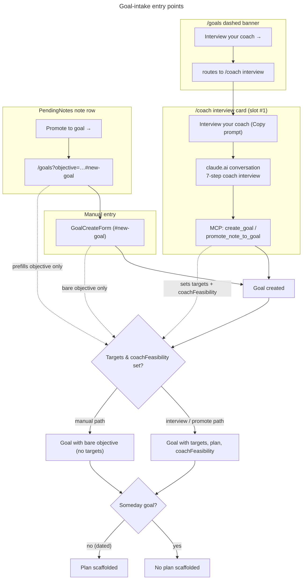
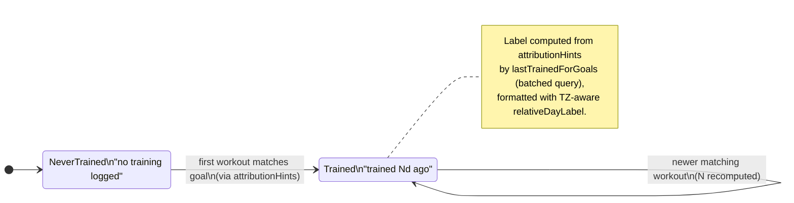

# UX Research — Goal-intake Interview Entry Points

**Feature:** Multi-goal Phase 3 — visual treatment for the four entry points into the guided goal-intake interview.
**Issue:** jronnomo/workout-planner #64 (Epic #61, final phase) · **PRD:** `docs/prds/PRD-goal-intake-interview.md` (REQ-64-3 / REQ-64-4 fix the UI **structure**; this report decides the **visual / copy / placement** treatment the PRD defers with `[UXR]`).
**Profile:** `.claude/skills/ux-research/profiles/goaldmine.profile.md`
**Extends (does NOT reopen):** the shipped grammar from [`multigoal-phase1-awareness.md`](./multigoal-phase1-awareness.md) (four-rung loudness ladder), [`goal-state-controls.md`](./goal-state-controls.md) (quiet-subline, `
` glossary, chip recipes) and [`rarity-tiers.md`](./rarity-tiers.md) (Reach meter in the subline).
**Pixel mockup:** [`goal-intake-entry.html`](./goal-intake-entry.html) — both themes, all four surfaces, real `globals.css` tokens.
**Chosen direction:** **"Whisper-rung entry points"** — every new entry point lands at the quietest loudness rung that still does its job (dashed banner, muted subline, grouped note actions), reserving prominence for the form and the coach.
**Constraints honored:** tokens only · both themes · ≥44px taps · no new routes · **no animation** · Server-Components-first (the /goals banner is server-rendered with **no dismissal state** — by design) · reuse the dashed-box, muted-subline, `
`, and chip recipes.

---

## 1. Current-State Audit

| # | Surface | Today's behavior (file:line) | Problem the entry point must solve |
|---|---------|------------------------------|-------------------------------------|
| 1 | /goals create | `src/app/goals/page.tsx:76-78` (SERVER) wraps `<Card title="New goal"><GoalCreateForm/></Card>`. `GoalCreateForm.tsx` is a client component; the page is not. | A goal can be created as a bare objective with zero expectation-setting. There is no affordance pointing the user to the richer coach-led path **before** they commit. The banner must live in the server page (no client dismissal state). |
| 2 | PendingNotes row | `src/components/PendingNotes.tsx:62-77` (CLIENT), rendered at `goals/[id]/page.tsx:371`. Two bare inline-text actions in `flex items-center justify-between gap-2` — "Apply revision from this note →" (`--accent`) + "Mark resolved" (`--muted`). | A third action ("Promote to goal →") must join without the row turning to soup, and the current actions are **bare inline text with no 44px tap box**. |
| 3 | /goals row + detail | `goals/page.tsx:140-166` muted subline already carries ReachMeter · date · "· Plan paused". Detail subline `goals/[id]/page.tsx:187-202`. **No relative-date helper exists** in `@/lib/calendar`. | Woven skill work is invisible to the goal it serves; the user can't tell at a glance whether a goal is being trained. The signal must read as **info, not guilt** for an untrained goal. |
| 4 | /coach PROMPTS | `coach/page.tsx` — 11 cards `{title, when, prompt}` rendered as `<Card title action={<CopyPromptButton/>}>` + `When:` line + `<pre>`. | The interview is the highest-intent, lowest-frequency, goal-genesis action, but has no card and no obvious slot; it is also the destination of the Surface-1 banner. |

Shared primitives reused (no new iconography): the **dashed-border box** (`rounded-lg border border-dashed border-[var(--border)] p-3` — already the "Or import from a previous goal" pattern in `GoalCreateForm.tsx:105`), the **muted subline** (`text-xs text-[var(--muted)] flex items-center gap-1.5 flex-wrap`), the **accent-soft Copy pill**, the warning-banner recipe (for the stackWarning nudge sentence only), and the `Card` container.

---

## 2. Chosen Direction — "Whisper-rung entry points"

The feature adds four ways *into* goal creation. The risk in a "fast, honest logger" is that four new nudges become four new naggers. So the governing principle is: **each entry point lands at the quietest loudness rung that still does its job**, and prominence stays reserved for the form itself and the coach conversation where the real reasoning happens.

- **Surface 1 — dashed-border banner, not accent-soft.** The dashed box is the app's existing grammar for *"there is an optional, lower-effort path you may want before the main form"* — literally the import-from-a-previous-goal box that sits inside the same form. Reusing it makes the interview read as a **sibling alternate path** to manual entry, not an alarm. Accent-soft (the "note" rung) would be louder than a non-dismissible, every-visit, positive recommendation deserves and would nag; a bare one-liner under-sells a genuine onboarding step. Dashed sits correctly between: visible structure, whisper loudness, with the gold "→" as the single saturated affordance.
- **Surface 2 — 2-row action split.** Three actions become two semantic groups: the two **constructive** "→" links (Apply revision, Promote to goal) share row 1 in `--accent`; the single **terminal** dismiss (Mark resolved) sits alone, right-aligned, in `--muted` on row 2. Grouping (not raw left-to-right order) encodes priority, keeps the note card to two action rows, and lets every tap reach 44px.
- **Surface 3 — joins the existing muted subline.** Per the shipped quiet-subline grammar, "trained Nd ago" / "no training logged" appends to the one muted subline (`· date · status · trained 3d ago`) rather than spawning a new line or chip — the right rail is exhausted at 390px and this is whisper-priority metadata. The untrained copy is **"no training logged"** — a factual statement about the *log*, never a "never"/"yet" guilt verb.
- **Surface 4 — interview card at slot #1.** The interview is the chronological genesis of a goal (interview → create → daily check-in → weekly review) and the destination of the Surface-1 banner, so it belongs first; a new user clicking through shouldn't scan past ten daily-cadence cards. The habituated daily user loses nothing — check-in is muscle memory, not scanned.

Runner-up directions and why they lost are in §3.

---

## 3. Phase-A Options (divergent, narrowed to one)

Two genuinely-open questions were drawn at ≤390px; surfaces 3 and 4 were settled by the shipped grammar and needed only copy/placement decisions.

Surface 1 — banner prominence (3 options)

| | Loudness rung | Nag risk (every visit, non-dismissible) | AA in light | Verdict |
|---|---|---|---|---|
| **A accent-soft panel** | note (`--accent-soft`) | high — reads as a live CTA every load | accent-on-accent-soft is **contrast-tight** ⚠ | rejected: nags |
| **B dashed box** *(chosen)* | whisper (`--border` dashed) | low — sibling optional-path grammar | passes (muted/accent on card already shipped) | **wins** |
| **C bare one-liner** | whisper | low | passes | rejected: under-sells, reads as a footnote |

Option A wins attention but nags on every visit and hits the contrast-tight `--accent`-on-`--accent-soft` pairing in the cream light theme; C is too quiet to signal a recommended onboarding step. **B** reuses the existing dashed import-path grammar 30px below it, lands at the right rung, and passes AA with already-shipped token pairings.

Surface 2 — 3-action note row (335px content, 3 options)

| | Layout | Priority encoding | Note-card height cost | Verdict |
|---|---|---|---|---|
| **A single wrap row** | all 3 on one line | left-to-right only; muted dismiss wraps under accents, reads equal | low | rejected: soups at 335px |
| **B 2-row split** *(chosen)* | constructive accents row / terminal muted row | **grouping** (forward vs done) | low (2 rows) | **wins** |
| **C vertical stack** | all 3 stacked, primary full-width | crystal, no copy change | high (3 rows every note) | held as fallback |

**B** keeps the card compact, encodes priority by meaning rather than raw order, and hits 44px on all three. Its one cost is shortening the existing label "Apply revision from this note →" → **"Apply revision →"** so two accent links share a 335px row (see §10 sign-off). If that copy change is rejected, fall back to **C** (no copy change, taller rows).

---

## 4. Phase-B Technical Artifacts

### 4.1 Goal-intake entry points (which path populates what)

### 4.2 Last-trained indicator state (a goal row)

### 4.3 Pixel mockup

[`goal-intake-entry.html`](./goal-intake-entry.html) — self-contained, real `globals.css` tokens, both themes side by side, all four surfaces. Open it to judge the three load-bearing risks before building: (1) the dashed banner's gold "→" reading as the single affordance against muted text in **light**; (2) the two accent links fitting **one** 335px row in Surface 2; (3) "no training logged" reading as info, not a nag.

---

## 5. Animation Storyboard

**None — by design**, consistent with UXR-62 / UXR-62B / UXR-63. Every entry point is static: dashed border, muted text, grouped links, a `<pre>` block. The signature `bullseye-pop` keyframe stays **reserved for the once-per-day completion moment** — animating an entry-point nudge would cheapen it and read as an error flash. (Tracked as UXR-64-14.)

---

## 6. Behavioral Psychology Principles

| Principle | How it's applied | Surface |
|-----------|------------------|---------|
| Banner-blindness / positive-nudge restraint | The recommendation renders at the whisper rung (dashed box), never the louder accent-soft "note"; non-dismissible but quiet, so it informs without nagging on every visit | 1 |
| Loss-aversion avoidance (non-guilt framing) | "no training logged" describes the *log*, not the user — no "never"/"yet" expectation verb that would shame an untrained goal | 3 |
| Hick's Law (choice reduction) | Three actions resolve into two semantic groups (constructive / terminal), so the eye makes two decisions, not three | 2 |
| Recognition over recall | The interview card is slotted #1 — the banner's destination is the first thing seen, and the card title mirrors the banner verb verbatim | 1, 4 |
| Von Restorff (isolation) | In the dashed banner the gold "→" is the only saturated pixel, making the single affordance unambiguous | 1 |
| Consistency / chunking (one dialect) | Reuse the shipped `Nd ago` vocabulary and the `·`-joined muted subline rather than a new chip or date format | 3 |
| Goal-gradient / chronological priming | Placing the interview first frames the goal lifecycle order (interview → create → check-in → review) | 4 |

---

## 7. Implementation Scope

| File | Change | Complexity |
|------|--------|------------|
| `src/app/goals/page.tsx` | Dashed interview banner (server-rendered) above the `New goal` Card; ensure `id="new-goal"` anchor; append "trained Nd ago" / "no training logged" to the row subline (`:140-166`) when the goal has `attributionHints` | Low–Med |
| `src/components/PendingNotes.tsx` | 2-row action split: row 1 = "Apply revision →" + "Promote to goal →" (both `--accent`, `min-h-[44px]`), row 2 = "Mark resolved" right-aligned (`--muted`, `min-h-[44px]`); Promote link → `/goals?objective=<body slice 200>#new-goal` | Low |
| `src/app/goals/[id]/page.tsx` | Append the trained line to the detail subline (`:187-202`); add the interview nudge sentence to the existing stackWarning banner (`:157-180`) | Low |
| `src/app/coach/page.tsx` | Insert the interview prompt card at PROMPTS index 0 (title "Interview your coach", when "Starting a new goal", verbatim 7-step body); add `id="interview"` on the rendered card for deep-link | Low |
| `src/lib/calendar.ts` | New TZ-aware `relativeDayLabel(date)` → "today" / "{N}d ago" (bucketed on `startOfDay` in USER_TZ; never raw `now - then` ms) | Low |
| `src/lib/goal-attribution.ts` *(new, per PRD REQ-64-1)* | `lastTrainedForGoals` (batched query) feeds the trained label; UI only consumes its result | n/a (backend) |

**Suggested testIDs / identifiers:** `interview-banner`, `interview-banner-link`, `note-action-apply`, `note-action-promote`, `note-action-resolve`, `goal-row-trained`, `goal-detail-trained`, `coach-interview-card` (`id="interview"`).

---

## 8. Accessibility

- **Tap targets:** all three PendingNotes actions become `inline-flex items-center min-h-[44px]` (they were bare inline text); the banner link and the Copy pill are `min-h-[44px]`.
- **Both themes / contrast (verify — cream/gold light is contrast-tight):**
  - Banner heading `--foreground` and subline `--muted` on `--card`, with the link in `--accent` on `--card` — all already-shipped pairings that pass AA. The dashed `--border` is decorative (not a text contrast dependency).
  - Surface 2 accent links `--accent` on `--card`, dismiss `--muted` on `--card` — both shipped, pass AA.
  - "trained Nd ago" / "no training logged" in `--muted` on `--card` ≈ same pairing as the shipped Someday/Plan-paused subline (light ≈ 5.8:1, dark ≈ 5.5:1) — passes; do **not** further dim.
  - **Avoid accent-soft for the banner** (rejected Option A): `--accent` text on `--accent-soft` is the contrast-tight case in light — flagged so it isn't reintroduced.
- **No color-only signaling:** every action carries a text label + "→"; the trained state is carried by the literal words "trained"/"no training logged"; the banner pairs the gold "→" with the "Interview your coach →" label.
- **Server-rendered:** the banner is a server component with no client state — there is no dismiss toggle to make keyboard-/SR-accessible (intentional; nothing to wire).
- **Reduced motion:** N/A — nothing animates.

---

## 9. ⚠ Provisional / Verify-Visually list

Confirm on a real 390px device in **both** themes before shipping (every item is a ledger row):

1. **Banner padding / rhythm** — `p-3` + `space-y-1` (matching the sibling import box); verify vertical rhythm against the `New goal` Card below. (UXR-64-15)
2. **Surface 2 one-row fit** — "Apply revision →" + "Promote to goal →" at `text-xs` ≈ 215px+gap; verify both fit one row without wrap at exactly 335px / on-device 390px. If they wrap → fall back to the vertical stack (UXR-64-06 fallback). (UXR-64-16)
3. **44px on inline links** — confirm the 44px tap boxes don't open visible vertical gaps between the two action rows; tighten `leading`/`-my` if needed. (UXR-64-18)
4. **Relative-date buckets** — "today" / "{N}d ago"; whether to switch to weeks at a threshold (e.g. `≥14d → "{N}w ago"`) and whether `1d ago` should read "yesterday" (recommend keeping `1d ago` for one dialect — confirm). (UXR-64-10)
5. **"no training logged" reads as info, not nag** — the central copy bet of Surface 3; verify on-device it doesn't read as an error/scold. (UXR-64-09)
6. **Banner gold "→" affordance** — verify in **light** it reads as the single clickable element against the muted text without becoming a loud CTA. (UXR-64-01)

**Ornament audit:** zero custom ornament added — no new glyph, no Bullseye borrow (reserved for focus), no motion. Everything rides typography (`text-xs`/`text-sm`, `font-medium`) + spacing + existing token borders. The dashed border is reused, not invented — cheaper than any new panel style.

---

## 10. Decisions requiring sign-off (challenge-with-evidence; do NOT slip in silently)

Two recommendations touch a value the PRD already fixes:

- **Shorten the shipped copy "Apply revision from this note →" → "Apply revision →" (UXR-64-06).** Evidence: (a) "from this note" is redundant — the link lives *inside* that note's card; (b) the full label cannot share a 335px row with "Promote to goal →" without wrapping, which forces the inferior single-wrap layout. If the team wants the long label preserved, fall back to the vertical-stack layout (taller note rows). Flagged, not assumed.
- **Deep-link anchor `/coach#interview` + `id="interview"` (UXR-64-13).** The PRD fixes the banner destination as `/coach` and the 7-step prompt body as verbatim. An anchor is **not** a new route and does not touch the prompt body, but it *does* refine the fixed destination string. Evidence: without it, "Interview your coach →" dumps the user at the top of a 12-card list and relies solely on the card being slotted #1. Recommend adopting the anchor **and** the slot-#1 placement together for robustness. Honored as fixed (unchanged): the verbatim 7-step body, the `#new-goal` anchor, and the `?objective=<body slice 200>` promote link.

---

## 11. Recommendation Ledger

Stable IDs `UXR-64-NN` (assigned once, never renumbered). Status starts `proposed`; the implementing PR ticks each to `shipped` / `reworked` / `dropped` with a SHA / `file:line` / short reason. The full ledger also lives at [`goal-intake-entry-ledger.md`](./goal-intake-entry-ledger.md).

| ID | Recommendation | Type | Status | Evidence |
|----|----------------|------|--------|----------|
| UXR-64-01 | S1 interview banner = **dashed-border box** (whisper rung, reuses import-path grammar); NOT accent-soft, NOT one-liner; server-rendered, non-dismissible | layout | proposed | |
| UXR-64-02 | S1 banner copy: heading "Interview your coach first (recommended)" · sub "A 7-step chat shapes your targets and a plan before you commit the goal." · link "Interview your coach →" | copy | proposed | |
| UXR-64-03 | stackWarning banner gains the interview nudge sentence: "Interview your coach to re-scope this goal's targets before the stack piles up." | copy | proposed | |
| UXR-64-04 | S2 PendingNotes = **2-row action split** (constructive accents row / terminal muted row); priority Apply → Promote → Resolve | layout | proposed | |
| UXR-64-05 | S2 all three actions become `inline-flex items-center min-h-[44px]` (were bare inline text) | a11y | proposed | |
| UXR-64-06 | CHALLENGE — shorten shipped copy "Apply revision from this note →" → "Apply revision →" so two links share a 335px row; fallback = vertical stack | copy | proposed | needs sign-off; edits shipped copy |
| UXR-64-07 | S3 last-trained joins the **existing muted subline** (quiet-subline grammar), not a new line/chip | layout | proposed | |
| UXR-64-08 | S3 relative-date format "trained today" / "trained {N}d ago"; add TZ-aware `relativeDayLabel` to `@/lib/calendar` (bucket on `startOfDay` USER_TZ) | copy | proposed | |
| UXR-64-09 | S3 untrained copy = "no training logged" (factual log-state, non-guilt; no "never"/"yet") | copy | proposed | reads-as-info verify |
| UXR-64-10 | S3 weeks threshold for relative date (e.g. `≥14d → "{N}w ago"`) and `1d ago` vs "yesterday" | tuning⚠ | proposed | |
| UXR-64-11 | S4 interview prompt card slotted at **position #1** (above "Daily check-in") | layout | proposed | |
| UXR-64-12 | S4 card title "Interview your coach" + when "Starting a new goal" (established tone) | copy | proposed | |
| UXR-64-13 | CHALLENGE — deep-link anchor `/coach#interview` + `id="interview"` on the card (refines PRD's fixed `/coach`) | layout | proposed | needs sign-off; not a new route |
| UXR-64-14 | No animation anywhere; `bullseye-pop` stays completion-only | animation | proposed | |
| UXR-64-15 | S1 banner padding `p-3` + `space-y-1`; verify vertical rhythm vs the New-goal Card | tuning⚠ | proposed | |
| UXR-64-16 | S2 two accent links fit one 335px row without wrap; verify on-device | tuning⚠ | proposed | |
| UXR-64-17 | Do NOT use accent-soft for the S1 banner — `--accent`-on-`--accent-soft` is contrast-tight in light (rejected Option A) | a11y | proposed | |
| UXR-64-18 | S2 `min-h-[44px]` on inline links must not open visible vertical gaps between action rows | tuning⚠ | proposed | |

*Specialists: UI Design & Brand · Behavioral · Pixel/Diagram. Phase-1 exploration mapped against the live codebase (file:line cited inline). Extends the shipped UXR-62 / UXR-62B / UXR-63 grammar; does not reopen it.*
