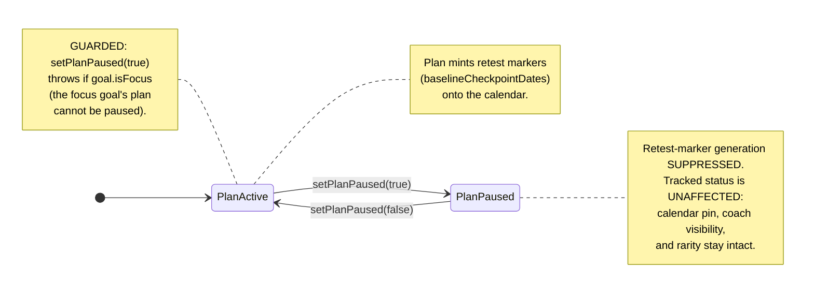
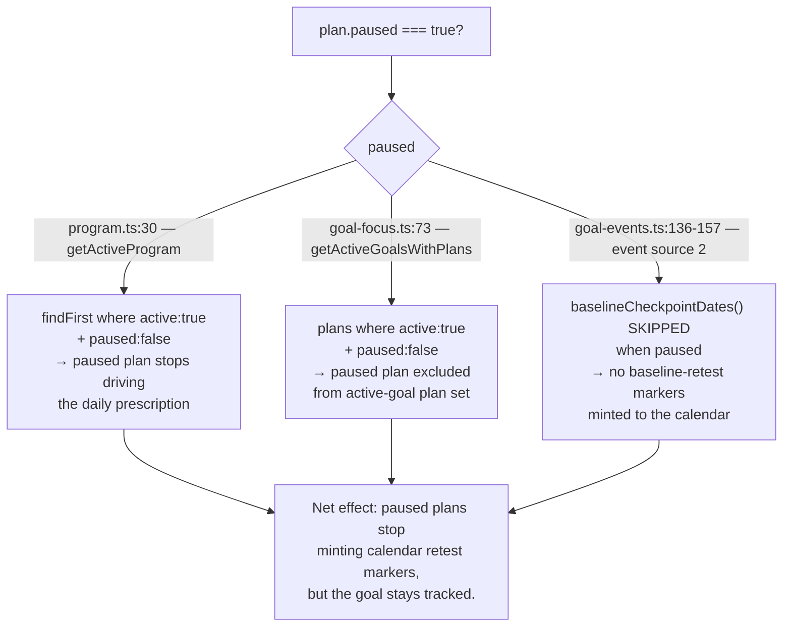

# UX Research — Goal-State Controls & Explanations

**Feature:** Goal-state legibility + a new **Pause/Resume a goal's PLAN** capability (independent of the goal's tracked status).
**Follow-on to:** jronnomo/workout-planner #62 (multigoal Phase 1). This report **extends the shipped UXR-62 grammar** (claim-ring figure/ground, four-rung loudness ladder, Focus badge, Track/Untrack pill, Someday chip) — it does not reopen it.
**Profile:** `.claude/skills/ux-research/profiles/goaldmine.profile.md`
**Prior report (context, not redone):** [`multigoal-phase1-awareness.md`](./multigoal-phase1-awareness.md)
**Pixel mockup:** [`goal-state-controls.html`](./goal-state-controls.html) — both themes, the Goals list (open glossary + 3 rows) and the detail Plan card in active + paused states, real `globals.css` tokens.
**Chosen direction:** **A — "Quiet subline"** (the list stays a fast scannable index; paused demotes into the existing muted metadata line; the loud teaching surface lives on the detail page).
**Constraints honored:** tokens only · both themes · ≥44px targets · no new routes · **no animation** · Server-Components-first (**zero new `"use client"`**) · reuse Bullseye + the already-shipped `
` and chip recipes.

---

## 1. Current-State Audit

| # | Surface | Today's behavior (file:line) | Problem |
|---|---------|------------------------------|---------|
| A | Goal model | `Goal.active` = tracked, `Goal.isFocus` = focus, `Goal.targetDate` null = someday (`prisma/schema.prisma:172-176`). `Plan.active` = "latest plan", **not** a pause state (`:248`). | There is **no way to silence a goal's auto-scaffolded plan** without untracking the whole goal. New Backflip + Handstand goals each spray ~24 retest markers / 30 days across the calendar (`baselineCheckpointDates`, `src/lib/records.ts:192-215`, emitted via `src/lib/goal-events.ts:136-157`). |
| B | Six goal states | Focus badge, Track/Untrack pill, Someday chip all shipped (`src/app/goals/page.tsx:94-161`). | **Nothing explains what the states DO.** The user asked for "hover descriptions" — but this is a 390px touch PWA with no hover. There is zero tooltip/popover infrastructure in the codebase. |
| C | Goals list row | `flex items-start gap-3 py-3`; right rail (`:121`) already stacks 3 items: days/Someday chip → Track/Untrack pill (44px) → Manage link. | The right rail is **nearly exhausted at 390px**. A new "plan paused" control or chip there = row soup and a second place to mutate the same state. |
| D | Goal detail | Plan card action header at `src/app/goals/[id]/page.tsx:159-166` carries two text links: "Full plan →" and "Revise". | No home for a Pause/Resume control, even though this is the natural, uncrowded place for it. |

Shared primitives reused (no new iconography): `Bullseye.tsx` (filled = focus, hollow = tracked — the shipped claim-ring metaphor), the shipped chip recipes (`goals/page.tsx:94-161`), and the **already-shipped** native `
/
` disclosure pattern (`src/components/DayOverrideForm.tsx:33`, `src/components/SnapshotView.tsx:26/65/75`).

---

## 2. Chosen Direction — "Quiet subline" (Direction A)

The feature rides on one principle: **pausing a plan is a calm, recommended action, not an error** — so it must read quiet everywhere it appears, and the only place it earns a real, weighted control is the detail page where the consequence can be stated in full.

- **The Pause/Resume control lives on the detail Plan-card header** (`goals/[id]/page.tsx:159-166`) as a server-action `<form>` button beside "Full plan →" / "Revise". It needs **no `"use client"`** — same pattern as the existing Track/Untrack toggle. **Pause renders muted** (calm/low-friction, because pausing is the recommended state for non-focus skill goals); **Resume renders as an accent CTA** (the more consequential action — it restarts retest-marker spray). An always-on one-line consequence sits beneath it, swapping with state.
- **The list row carries no new control and no new chip.** Instead, "paused" demotes into the **existing muted metadata subline** (`goals/page.tsx:100-103`) — `Sep 12 · Plan paused` — reusing the same slot where date/status already live. Zero new right-rail real estate, zero new tokens, and because paused is the *common* recommended state, a per-row chip would be noise that stops differentiating. (Grafted from Direction C's good instinct of in-context teaching — but confined to the detail page so the list stays a fast index, not a manual.)
- **Six states are explained once** via a collapsed native **`
` "What do these states mean?"** glossary at the top of the Goals card. Zero JS, server-rendered, reuses an established pattern, keyboard/SR-accessible for free, no animation. This is the touch-native answer to "hover descriptions": one learn-once reference instead of six discoverable popovers. Desktop hover is a free progressive enhancement via `title=` on the glyphs/chips.

The runner-up directions and why they lost are in §3.

---

## 3. Phase-A Options (divergent, narrowed to one)

Three treatments of the one genuinely open question — **how "Plan paused" surfaces on the list row, and how the glossary is presented** — were drawn at 390px.

Direction comparison (click)

| | List-row paused treatment | Right-rail crowding | List scannability | Banner-blindness risk |
|---|---|---|---|---|
| **A Quiet subline** *(chosen)* | plain muted text in existing subline (`· Plan paused`) | **none** (rail untouched) | **preserved** | medium — *the accepted tradeoff* |
| **B Paused chip** | neutral chip in right rail | **high** (4th rail item / steals truncate budget) | reduced | low |
| **C Inline glossary** | every row teaches its own state in 2-3 muted lines | none | **severe bloat** (~2× scroll) | low |

- **A "Quiet subline"** — paused is plain `var(--muted)` text appended to the metadata line; glossary is one collapsed `
`. *Win:* honors the "fast, honest logger" thesis, zero rail pressure, zero new dark-mode surface. *Weakness:* the muted word is skimmable — but that's the **correct** tradeoff (pausing is deliberately calm; the loud confirmation belongs on the detail page where the toggle + consequence line live).
- **B "Paused chip"** — a Someday-recipe neutral chip. *Win:* distinct shape, low skim risk. *Loss:* the right rail is already 3-deep at 390px; a 4th item forces a second line or eats the objective's truncate budget, and a pill near the rail reads as a second tappable control when it's just metadata. **Rejected: crowding.**
- **C "Inline glossary"** — each row's subline teaches its own state with an always-on consequence clause. *Win:* no glossary to discover. *Loss:* every row balloons to 3-4 lines, ~2× scroll, the list stops being a fast index, and variable row heights scatter tap targets. **Rejected: list bloat.**

**Decision: Direction A**, grafting C's in-context teaching as the detail-page consequence line only.

---

## 4. Phase-B Technical Artifacts

### 4.1 Plan state machine (with the focus guard)

### 4.2 Where "paused" is checked in the data layer

Implementer note: the `paused` field/filters do not yet exist. The three exact insertion points are the `findFirst({ where: { active: true } })` at `program.ts:30`, the `plans: { where: { active: true } }` include at `goal-focus.ts:73`, and the `baselineCheckpointDates(template, plan.startedOn)` loop at `goal-events.ts:136-157`. **Grep `where: { active: true }` on `Plan` and every `plans: { where:` include before shipping** — the one real risk is a paused plan leaking into a surface you forgot to filter. The focus guard belongs in the `setPlanPaused` mutation, not the read layer.

### 4.3 Pixel mockup

[`goal-state-controls.html`](./goal-state-controls.html) — open it to judge the two load-bearing visual risks on a real 390px screen in both themes: (1) Row 3's `Plan paused` subline sits in plain `var(--muted)` with no color accent (skimmability), and (2) the deliberate detail-card asymmetry — quiet text **Pause** when active vs. the `accent-soft` **Resume** CTA when paused.

---

## 5. Animation Storyboard

**None — by design**, consistent with UXR-62. Every state and transition is carried by token color, the muted-vs-accent toggle contrast, and the native `
` toggle. The signature `bullseye-pop` keyframe stays **reserved for the once-per-day completion moment** — using motion for a state toggle would cheapen it and read as an error flash. (Tracked as UXR-62B-09.)

---

## 6. Behavioral Psychology Principles

| Principle | How it's applied | Question |
|-----------|------------------|----------|
| Recognition over recall | The closed 6-state vocabulary is taught once in the glossary, then folded away — the user recognizes a state rather than recalling its rules | Q2 |
| Progressive disclosure + Hick's law | The list shows only the state; the *explanation* is one tap away (glossary) and the weighty *decision* is one screen deeper (detail page) | Q2, Q1 |
| Banner-blindness avoidance | The glossary is opt-in (collapsed), not a persistent banner; "Plan paused" is plain text, not a repeated chip that the eye learns to skip | Q2, Q4 |
| Von Restorff / signal economy | Paused is the *common* recommended state → it must read quiet; the one urgency-colored element in the rail (days chip) keeps its salience precisely because paused didn't steal a chip | Q4 |
| State-the-consequence-before-the-tap | The detail-page consequence line appears *at* the control, pre-action — replacing a post-action confirm modal for a cheaply-reversible toggle | Q3 |
| Reversibility lowers friction | Pause↔Resume and Track↔Untrack are one-tap and non-destructive, so no blocking confirm is warranted (a needless dialog trains the user to swat dialogs, eroding the one confirm that should exist) | Q3 |
| Reserved-symbol semantics | The filled Bullseye stays focus-only; "hollow" is not overloaded a third time for paused (it already means tracked-not-focus on the calendar and untracked via opacity on the row) — paused is text, not a glyph | Q4 |
| Jakob's law (consistency) | Reuses the shipped `
`, chip recipes, and server-action `<form>` toggle pattern — paused behaves like every other state control already on the page | Q1, Q2 |

---

## 7. Implementation Scope

| File | Change | Complexity |
|------|--------|------------|
| `prisma/schema.prisma` (~`:240`) | Add `paused Boolean @default(false)` to `Plan`; `prisma migrate dev`. Default-false = zero backfill risk. | **Med** (only backend touch) |
| `src/lib/goal-actions.ts` | New `setPlanPaused(planId, paused)` server action — `"use server"`, prisma update, **guard `if (paused && goal.isFocus) throw`** (mirror the untrack guard at `:180-184`), `revalidatePath(["/","/calendar","/goals",\`/goals/${goalId}\`,"/stats"])` | Low |
| `src/lib/goal-focus.ts:73` | `getActiveGoalsWithPlans` → add `paused: false` to the `plans` `where` | Low |
| `src/lib/program.ts:30` | `getActiveProgram` → add `paused: false` (belt-and-suspenders with the focus guard so a paused focus plan can never drive prescription) | Low |
| `src/lib/goal-events.ts:136-157` | Skip `baselineCheckpointDates()` when `plan.paused` — the core fix for the marker spray | Low |
| `src/app/goals/[id]/page.tsx:159-166` | Add Pause/Resume `<form>` button to the Plan-card header + the always-on consequence line; select `activePlan.paused` into the page query | Low |
| `src/app/goals/page.tsx:100-103` | Append `· Plan paused` to the metadata subline; the collapsed `
` glossary block at the top of the card. Select the active plan's `paused` into the goals query (`:26-33`). | Low |

**Suggested testIDs:** `plan-pause-toggle`, `goal-row-paused-indicator`, `goal-states-glossary`, `goal-states-glossary-summary`. Add an action-level unit test asserting `setPlanPaused(focusPlanId, true)` throws.

**Data-layer risk:** the three read-filter sites + the event-generation site are easy to write but easy to *miss one*. Enumerate every `Plan` consumer before shipping; a leaked paused plan is the only correctness hazard.

---

## 8. Accessibility

- **Tap targets:** detail Pause/Resume button `min-h-[44px]` (range 44-48px ⚠ — verify it doesn't blow out the card-header height); glossary `
` `min-h-[44px]`; existing Track/Manage unchanged.
- **Both themes / contrast (verify before shipping — cream/gold light is contrast-tight):**
  - `Plan paused` subline + glossary defs are `var(--muted)` on `var(--card)`: light ≈ 5.8:1, dark ≈ 5.5:1 — both pass AA (same pairing as the shipped Someday chip).
  - **Resume CTA:** `var(--accent)` text on the `accent-soft` wash — verify ≥4.5:1 in **both** themes (dark gold `#D4A437` on the faint wash is the tighter case); bump to `font-medium` or render on `--card` if borderline. ⚠
  - Pause (muted text) on `--card` — passes as above.
- **No color-only signaling:** the paused state is carried by the literal word "paused" (text), the glossary pairs each state's glyph with its name + definition, and the toggle label itself reads "Pause"/"Resume".
- **Server-rendered disclosure:** native `
` gives keyboard + screen-reader support with no ARIA wiring and no JS.
- **Reduced motion:** N/A — nothing animates.

---

## 9. ⚠ Provisional / Verify-Visually list

Confirm on a real 390px device in **both** themes before shipping:

1. **`Plan paused` subline skimmability** — plain `var(--muted)` text, no accent. The deliberate risk of Direction A: does it read, or get skipped? If skipped and that matters, the fallback is the Someday-recipe neutral chip (NOT a colored one). (UXR-62B-01)
2. **Detail Pause/Resume 44px target** — `min-h-[44px]`, range 44-48px; verify it doesn't unbalance the card header next to the two text links. (UXR-62B-04)
3. **Resume CTA contrast** — `var(--accent)` on `accent-soft`, both themes; verify AA ≥4.5:1 or bump weight. (UXR-62B-05)
4. **Glossary row sizing** — glyph swatch column ~24-28px, row height ~28-36px; verify the size-20 Bullseye + chip samples seat cleanly. (UXR-62B-07)
5. **Glossary glyph samples** — the mockup hand-draws SVG state samples; the real glossary should **reuse the actual `Bullseye` component + live chip markup** so the legend teaches the exact on-screen encoding (don't ship bespoke SVGs). (UXR-62B-07)

---

## 10. Decisions resolved (no sign-off needed)

- **No blocking confirm modal** for Pause or Untrack. Both are one-tap, non-destructive, and reversible; the consequence is stated *before* the tap (detail consequence line) rather than after (modal). This matches the existing confirm-free toggle pattern on /goals. (If a Pause confirmation is ever wanted, use a non-blocking inline line, never a `<dialog>`.)
- **Optional copy** near the detail Pause control for non-focus tracked goals: *"Recommended for skill goals — let your coach weave the work into the focus plan."* — include if the detail card has room; not required.

---

## 11. Recommendation Ledger

Stable IDs `UXR-62B-NN` (continue the UXR-62 series; never renumbered). Status starts `proposed`; the implementing PR ticks each to `shipped`/`reworked`/`dropped` with a SHA / `file:line` / reason. Full ledger also at [`goal-state-controls-ledger.md`](./goal-state-controls-ledger.md).

| ID | Recommendation | Type | Status | Evidence |
|----|----------------|------|--------|----------|
| UXR-62B-01 | List-row "Plan paused" = plain `var(--muted)` text in the existing subline (Direction A); no rail chip. Fallback = Someday-recipe neutral chip if skimmability fails | tuning⚠ | proposed | |
| UXR-62B-02 | New `Plan.paused Boolean @default(false)`; filter `paused:false` at program.ts:30 + goal-focus.ts:73; skip baseline gen at goal-events.ts:136-157 | component | proposed | |
| UXR-62B-03 | `setPlanPaused(planId, paused)` server action with focus-goal guard (throws if `paused && goal.isFocus`), mirrors untrack guard goal-actions.ts:180-184 | component | proposed | |
| UXR-62B-04 | Detail Plan-card Pause/Resume toggle (server-action `<form>`, `min-h-[44px]`); Pause = muted, Resume = accent-soft CTA | a11y | proposed | |
| UXR-62B-05 | Resume CTA `var(--accent)` on `accent-soft` — verify AA both themes | tuning⚠ | proposed | |
| UXR-62B-06 | Always-on consequence line under the detail toggle (swaps active/paused copy); no blocking confirm for Pause or Untrack | copy | proposed | |
| UXR-62B-07 | Native `
` "What do these states mean?" glossary (6 states), reusing the shipped `
` pattern + real Bullseye/chip samples; zero `"use client"` | layout | proposed | |
| UXR-62B-08 | Final consequence strings for all 6 states + Pause/Untrack (see §0 copy / glossary) | copy | proposed | |
| UXR-62B-09 | No animation anywhere; `bullseye-pop` stays completion-only | animation | proposed | |
| UXR-62B-10 | Desktop-only `title=` hover hints on glyphs/chips as a free progressive enhancement (touch is primary) | copy | proposed | |

### Consequence copy (final strings — UXR-62B-08)

| State | String (≤~90 chars) |
|-------|---------------------|
| Focus | Drives your daily Today plan. Only one goal holds focus at a time. |
| Tracked | Shows on the calendar and to your coach, and counts toward rarity. |
| Untracked | Parked. Hidden from the calendar, coach, and rarity until you track it again. |
| Someday | No target date — no countdown and no deadline pressure. Add one anytime. |
| Plan active | Its 12-week plan posts retest days to the calendar on its own schedule. |
| Plan paused | Silences this plan's retest days. Goal stays tracked — date, coach, rarity intact. |

*Specialists: Data/Behavior · Next.js Dev & CSS · UI Design & Brand. Phase-1 exploration mapped against the live codebase (file:line cited inline). Extends the shipped UXR-62 grammar; does not reopen it.*
