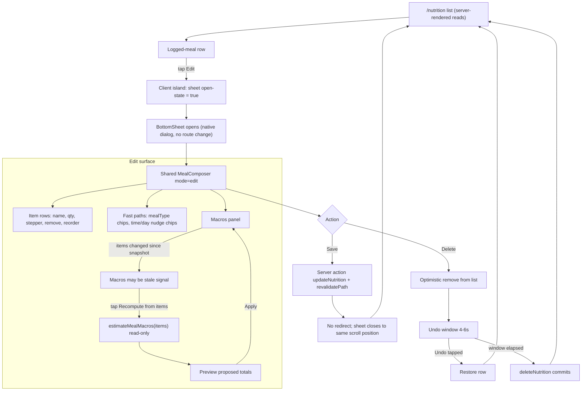
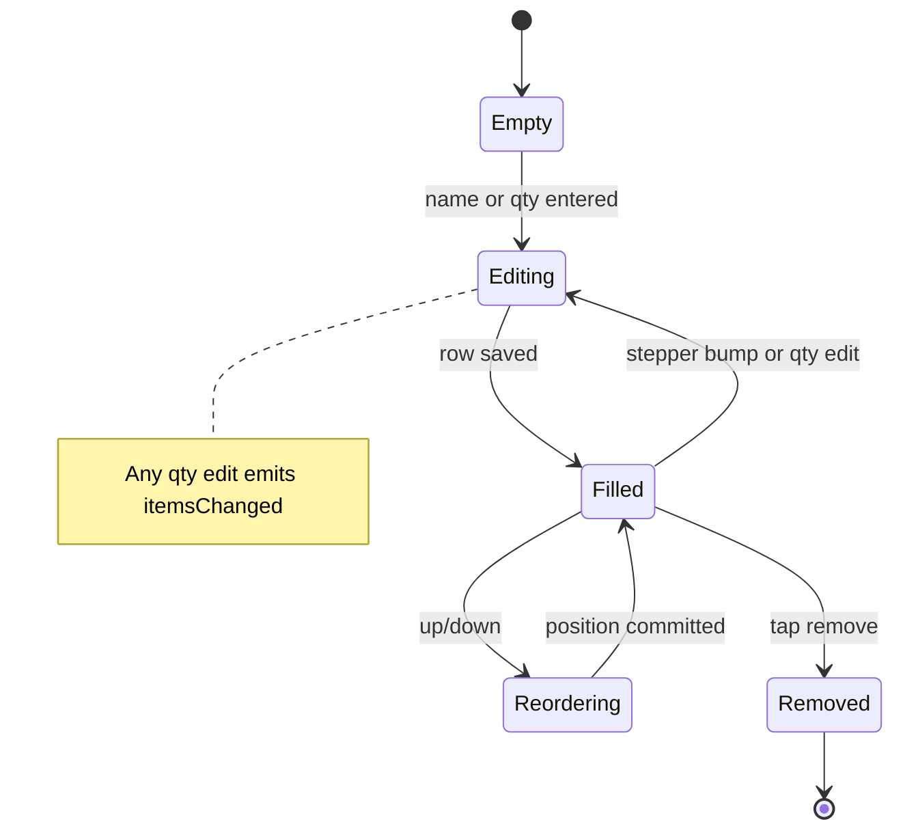
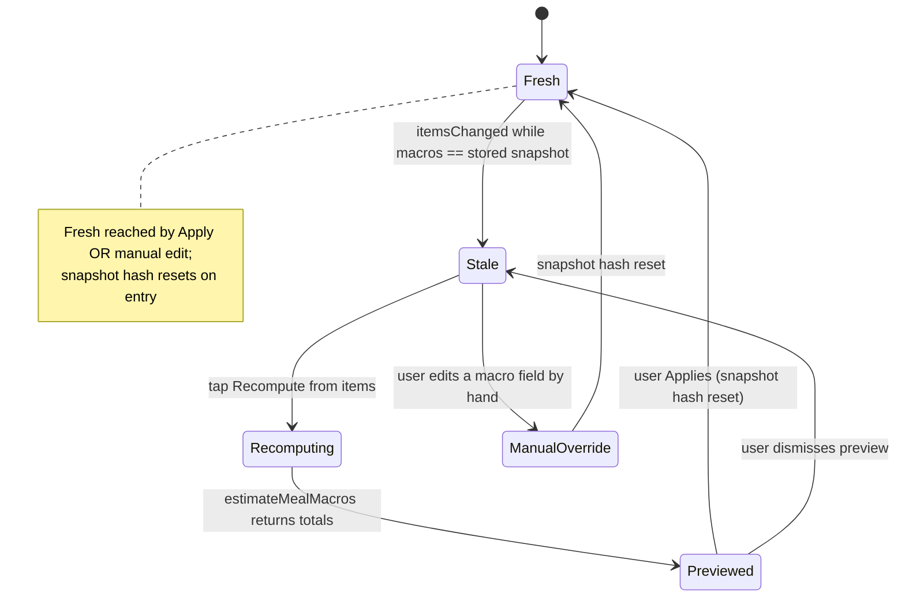

# UX Research — Editing an Already-Logged Meal

> Exploratory UX research (no issue/PRD yet). Canonical artifact for this feature.
> Companion pixel mockup: [`meal-edit-flow.mockup.html`](./meal-edit-flow.mockup.html) (light + dark, 390px, real tokens).
> Status: **uncommitted draft for operator review.** Profile: `goaldmine` · flavor layer: off (neutral coach voice, analytical core only).

---

## 1. Current-State Audit

How an already-logged meal is edited today, with `file:line` and user impact.

| # | Finding | Where | User impact |
|---|---------|-------|-------------|
| A1 | **Macros silently drift from items (correctness/honesty bug).** Macros are only computed by the chip/scan/estimate composer, and only for newly-added items. Hand-editing the items textarea (or bumping a qty) never recomputes macros. `updateNutrition` persists whatever macros the client last sent — no server-side recompute. | `useFoodComposer.tsx` (merge only on add; no items→macros sync, ~L104); `workout-actions.ts` `updateNutrition` ~L224 (writes `parseMacros(form)` as-is, no recompute) | Edit "8 oz → 6 oz" and the meal still reports the 8 oz macros. The dashboard "so far" totals and any coaching read over MCP are quietly wrong. **Violates the product thesis: "the UI surfaces and edits that state but never invents detail" — here it silently *keeps stale* detail.** This is the headline problem. |
| A2 | **Items are an unstructured pipe-textarea.** To change one item's qty the user re-types a whole line in `name \| qty \| notes` syntax. No per-item edit / remove / reorder — even though items are already structured JSON and the coach has surgical item ops. | `EditNutritionForm.tsx` items `<textarea>` (~L99–108); server `parseItemsTextarea` `workout-actions.ts:168`; structured shape `schema.prisma` NutritionLog.items (~L135); coach ops `nutrition-log-ops.ts:51` (`addItem`/`updateItem`/`removeItem`) | High edit friction and a syntax the user must remember. The richest capability (item-level edits) exists in the data + MCP tools but is hidden from the UI. |
| A3 | **Full-page navigation away-and-back for tiny changes.** Edit is a `<Link>` to `/nutrition/[id]/edit`; Save and Delete both `redirect("/nutrition")`. No inline/sheet edit; **no undo after the redirect+delete.** | Row Edit link `nutrition/page.tsx` (~L88); `updateNutrition`/`deleteNutrition` redirect `workout-actions.ts` ~L244/247 | A one-tap qty fix costs a navigation round-trip and loses list scroll position. A mis-tapped Delete is unrecoverable. |
| A4 | **`datetime-local` is clunky for "right meal, wrong time/day."** And the seed value is built with raw `getFullYear/getMonth/getDate/getHours` — **an invariant violation** (all date/time must route through `@/lib/calendar`, USER_TZ-aware). | `nutrition/[id]/edit/page.tsx` `localDatetime()` ~L35 | The common correction ("that was yesterday's dinner", "logged an hour late") is a fiddly spinner; the raw-Date seed can drift from USER_TZ. |
| A5 | **Edit and create diverge despite identical data shape.** `EditNutritionForm` (action+startTransition, redirect, notes `<textarea>`, has Delete) vs `LogNutritionForm` (onSubmit+`useFormFeedback`, stays mounted, transient "✓ Meal logged", notes `<input>`, no Delete). Same `useFoodComposer` + `MacroInputs` core, two shells. | `EditNutritionForm.tsx` vs `LogNutritionForm.tsx` | A fix in one form rots in the other (the notes field already diverged). Two mental models for one task. |

---

## 2. Chosen Direction

**Direction A — "Edit-in-place BottomSheet", built on a single shared `MealComposer`.** Tapping a logged-meal row's Edit opens the existing `BottomSheet` (native `<dialog>`) over `/nutrition` — no route change. The sheet hosts the full structured editor; **Save is a server action + `revalidatePath` with the redirect removed**, so the sheet closes back to the list at the same scroll position; **Delete is optimistic with a 4–6s Undo window** before `deleteNutrition` commits.

Why A over the runners-up: it is the **only** direction that satisfies the "reuse BottomSheet rather than a new modal" invariant *and* removes the redirect/no-undo footgun *and* preserves list context (A3). **Direction B (inline accordion expand)** was rejected — a 6-field macro area + item rows inline makes the list row 420–520px tall at 390px, pushing sibling meals off-screen and breaking the BottomSheet invariant. **Direction C (restructured full-page)** is the cheap fallback if the sticky-band-in-dialog playtest fails, but it keeps the navigation round-trip and the redirect-after-save.

Grafted in from the runners-up and the specialist tracks:
- From the data/behavior track: an **honest, never-silent macro model** — a "macros may be stale" signal (in-session dirty hash) + an explicit **Recompute from items** that previews before applying, fixing A1 without inventing detail.
- From the dev track: the **shared `MealComposer(mode: create | edit)`** spine that ends the create/edit divergence (A5), and the **structured rows with a raw-paste escape hatch** so fast free-text entry survives (A2).
- From the UI track: **sticky macro summary header** (keyboard-proof, survives the soft keyboard better than a footer strip), the **warning-as-flag-not-numeral-tint** honesty rule, and the **qualified Bullseye meter** (shown only when a planned slot target exists; hollow when macros are stale).
- Fast paths beating `datetime-local` (A4): **qty steppers, mealType chips, and "Yesterday / −2h / Now" nudge chips** routed through `@/lib/calendar` — and fixing the `localDatetime` invariant violation in the same change.

---

## 2a. Brand fit (gold-rush-for-goals, gamified)

Goaldmine's identity is **a gold rush for goals with an RPG/gamified spin** — carried by visuals and progression systems (Bullseye, levels, badges, rarity, earned celebration), not pun-heavy prose. That theme belongs at **strike moments** (a goal hit, a level/badge, a streak, day-complete). **Editing a logged meal is panning, not striking** — routine housekeeping. Gamifying a qty fix would cheapen the real payoff and break the minimal-motion budget, so the brand lens leaves the chosen direction intact and *reinforces* three ledger rows:

- **UXR-meal-edit-18** — Save stays a quiet `Saving…→✓`, never the `bullseye-pop`.
- **UXR-meal-edit-27** — cut the `bullseye-pop` on macro Apply (the tint-flash carries it).
- **UXR-meal-edit-26** — the macro-vs-target **Bullseye meter** is the *one* on-brand touch that earns its place here: "are you closing the vein?" is a legitimate goal-strike read, kept honest (hollow when there's no planned target or the macros are stale).

Net: the gold-rush/game theme shows up in this flow only as the honest Bullseye meter; everything else stays calm utility, exactly as the thesis prescribes.

## 3. Phase-A Options (ASCII, narrowed to one)

<details>
<summary><strong>Shared atom — structured per-item row (empty → filled)</strong></summary>

```
EMPTY (just added, no qty yet)
┌────────────────────────────────────────────┐
│ Frozen mixed vegetables            ↑        │   name --muted until typed
│ [  −  ]  ____ qty ____  [  ＋  ]   ↓    ✕   │   qty placeholder --muted
└────────────────────────────────────────────┘

FILLED
┌────────────────────────────────────────────┐
│ 97% beef                           ↑        │
│ [  −  ]   8 oz        [  ＋  ]      ↓    ✕   │   "8 oz" = Geist Mono, --foreground
└────────────────────────────────────────────┘
```
Row min-height 64px (two lines). `[−] [＋] ✕ ↑ ↓` each a 44×44px tap target (glyph ~28–36px ⚠ playtest). Stepper bumps the numeric prefix of qty, leaving the unit string intact (`8 oz → 9 oz`); free-form qty with no leading number (`"a handful"`) disables the stepper for that row (honest, no guessing). Editing qty emits `itemsChanged` → macros go stale.
</details>

<details>
<summary><strong>Direction A — Edit-in-place BottomSheet (CHOSEN)</strong></summary>

```
  ░░░ /nutrition (list dimmed behind backdrop) ░░░
  ░ ┌──────────────────────────────────────────┐ ░
  ░ │ LUNCH                              Edit ›  │ ░
  ░ │ 97% beef (8 oz), Kroger hamburger buns…   │ ░
  ░ └──────────────────────────────────────────┘ ░
╔════════════════════════════════════════════════╗ ← dialog, 1rem top radius
║ Edit · Lunch                              ( ✕ ) ║   header px-4, border-b
╟────────────────────────────────────────────────╢
║▓ STICKY macro summary (keyboard-proof, top) ▓▓▓║ position:sticky; top:0
║▓  612   cal      ◎◎◎  82% · on target       ▓▓▓║ "612" mono 28px; ◎ Bullseye .82
║▓  P 48 · C 31 · F 29                         ▓▓║ mono 13px, numerals --foreground
║▓  ⚠ Macros may be stale — items changed      ▓▓║ flag --warning (icon+text only)
║▓     ⟳ Recompute from items                  ▓▓║ accent-soft button
╟────────────────────────────────────────────────╢
║ ITEMS                                          ║ 11px uppercase --muted
║ 97% beef                              ↑        ║
║ [ − ]  8 oz        [ ＋ ]            ↓     ✕    ║  ← structured rows
║ Kroger hamburger buns                 ↑        ║
║ [ − ]  1           [ ＋ ]            ↓     ✕    ║
║ Cheddar cheese                        ↑        ║
║ [ − ]  2 slices    [ ＋ ]            ↓     ✕    ║
║ ┌ Add item — e.g. "medium banana"  [ Enter ] ┐ ║  ← useFoodComposer.controls
║ ( Scan ) ( Eggs ) ( Cheddar ) ( 97% beef ) →   ║  quick-pick chips, 44px
║ Meal (Pre)(Bkfst)[Lunch](Snack)(Post)(Dinner) ║  mealType chips, selected=accent-soft
║ When ( Yesterday )( −2h )( Now )  Today 1:24PM ║  nudge chips via @/lib/calendar
║ Notes ┌────────────────────────────────────┐  ║
║       │ post-lift, hit protein target      │  ║
║       └────────────────────────────────────┘  ║
║ Delete meal  (tap again to confirm)            ║  ConfirmButton, --danger
╟────────────────────────────────────────────────╢
║ [               Save               ]           ║ ← STICKY footer, --accent fill
╚════════════════════════════════════════════════╝   position:sticky; bottom:0
```
Save = server action + `revalidatePath('/nutrition')`, **no redirect** → set `open=false`, sheet closes to exact scroll. `max-h 80–88vh ⚠ playtest`; body scrolls between the two sticky bands so the keyboard can't bury the macro readout or Save.
</details>

<details>
<summary><strong>Runner-up B — Inline row expand (rejected)</strong> · <strong>Runner-up C — Restructured full-page (fallback)</strong></summary>

**B (rejected):** accordion-expands the row in the list — no sheet, no portal — but even with macros collapsed to a one-line strip the expanded region is ~420–520px tall at 390px, pushing siblings off-screen, and there's no keyboard-proof sticky header (the macro strip scrolls away). Breaks the "reuse BottomSheet" invariant.

**C (fallback):** keep `/nutrition/[id]/edit` as a full page, port in the structured rows + macro strip + chips. Smallest code change and pure server-render, but keeps the navigation round-trip and the redirect-after-save (no undo). Hold as the fallback if the sticky-band-in-dialog playtest fails.

| Criterion | A · in-place sheet | B · inline expand | C · full-page |
|---|---|---|---|
| Speed-to-correct | Fast, no nav | Fast taps, tall scroll | Slowest (nav + redirect) |
| Context preservation | Best | Siblings pushed off-screen | Scroll pos lost |
| Fits thesis / reuses BottomSheet | Strong | Diverges (no sheet) | OK (extra nav) |
| No-undo risk | Low (no redirect) | Low | High (redirect-after-save) |
| Implementation cost | Med | Med-High | Low |
</details>

---

## 4. Phase-B Technical Artifacts

### 4.1 Edit-surface entry/exit (flowchart)



### 4.2 Per-item row lifecycle (stateDiagram)



### 4.3 Macro staleness machine (stateDiagram) — never silent



### 4.4 Recompute choreography (sequenceDiagram)

```mermaid
sequenceDiagram
    actor User
    participant MC as MealComposer (client island)
    participant EST as estimateMealMacros (server action)
    participant FL as FoodLibrary (db)

    User->>MC: tap "Recompute from items"
    MC->>EST: items[] (name + parsed qty)
    loop each item
        EST->>FL: name-match lookup (read-only)
        alt match found
            FL-->>EST: per-unit macros
            EST->>EST: scale per-unit x qty, add to totals
        else no match
            FL-->>EST: no entry
            EST->>EST: mark "no estimate" (not zeroed)
        end
    end
    EST-->>MC: {perItem matched/unmatched, totals}
    MC-->>User: preview totals + unmatched items disclosed
    User->>MC: tap Apply
    MC->>MC: MacroInputs onChange writes totals; staleness -> Fresh
    Note over MC,EST: No DB write here; persist happens later via updateNutrition on Save
```

### 4.5 Pixel mockup

Self-contained, light + dark side-by-side at 390px using the real `globals.css` token values, rendering the chosen sheet (structured rows + sticky macro strip in its **stale** state + fast-path chips): **[`meal-edit-flow.mockup.html`](./meal-edit-flow.mockup.html)**. Open in any browser offline.

---

## 5. Animation Storyboard

All durations are **provisional ranges — ⚠ playtest/visually verify**. Two easings only: `cubic-bezier(0.16,1,0.3,1)` for anything that translates/expands (the existing sheet family) and `ease-out` for opacity-only fades. Every item has a `prefers-reduced-motion` fallback that jumps to the final state.

| # | Transition | Tween (provisional) | Reduced-motion |
|---|-----------|---------------------|----------------|
| F1 | Sheet OPEN | backdrop opacity 0→1 **160ms ease-out**; panel translateY(100%→0) **240ms cbz(.16,1,.3,1)** via `@starting-style` | instant final state, focus-trap preserved |
| F2 | Sheet CLOSE on Save | reverse of F1; Save button `Saving…`→`✓` crossfade **120–200ms ⚠**. List already revalidated → edited row shows new total. **No bullseye-pop.** | instant close; keep `Saving…`→`✓` status text |
| F3 | Row ADD | wrapper `grid-template-rows 0fr→1fr` + opacity 0→1 **180–240ms ⚠** | row appears instantly |
| F4 | Row REMOVE | `1fr→0fr` + opacity→0 **160–220ms ⚠**, splice on `transitionend` (guard `propertyName`) | removed instantly |
| F5 | Stepper BUMP + go STALE | qty numeral translateY 2–4px tick **≤160ms ⚠** (interruptible for repeat taps); stale flag opacity 0→1 **140–200ms ⚠** | no tick; flag appears instantly |
| F6 | RECOMPUTE → preview → APPLY | preview fade-in **140–200ms ⚠**; on Apply, changed numerals one-shot bg-tint flash 0→peak→0 **220–320ms ⚠**; stale flag fades out | numbers change in place, no flash |
| F7 | DELETE → optimistic + UNDO | row collapse (F4); undo bar slide-up **160–220ms ⚠**, persists **4–6s ⚠** (logic, not motion); Undo → row re-expands (F3 reverse) | undo bar instant; window timing unchanged |

### Timing budget (gantt — axis is ILLUSTRATIVE, not a real schedule)

```mermaid
gantt
    title Edit BottomSheet motion budget (axis ILLUSTRATIVE, durations PROVISIONAL - playtest)
    dateFormat SSS
    axisFormat %Lms

    section Open (F1)
    F1 backdrop scrim opacity 0to1 160ms ease-out        :a1, 000, 160ms
    F1 panel slide translateY 100to0 240ms cbz(.16,1,.3,1) :a2, 000, 240ms

    section Edit interactions (F3 F4 F5)
    F3 row add grid 0frto1fr+op 180-240ms cbz(.16,1,.3,1)   :b1, 000, 240ms
    F4 row remove grid 1frto0fr+op 160-220ms cbz(.16,1,.3,1) :b2, 250, 220ms
    F5 stepper numeral tick translateY 2-4px to=160ms       :b3, 490, 160ms
    F5 macro strip STALE flag opacity 0to1 140-200ms ease-out :b4, 490, 200ms

    section Recompute (F6)
    F6 preview totals fade opacity 0to1 140-200ms ease-out  :c1, 000, 200ms
    F6 applied numeral tint flash 0-peak-0 220-320ms cbz(.16,1,.3,1) :c2, 210, 320ms
    F6 stale flag fade out opacity 1to0 140-200ms ease-out  :c3, 210, 200ms
    F6 bullseye-pop (RESERVED - recommend CUT) verify       :crit, c4, 210, 320ms

    section Save and Delete (F2 F7)
    F2 panel slide down translateY 0to100% 240ms cbz(.16,1,.3,1) :d1, 000, 240ms
    F2 backdrop fade out opacity 1to0 160ms ease-out        :d2, 000, 160ms
    F2 Save button pending-to-done 120-200ms               :d3, 000, 200ms
    F7 undo bar slide up translateY 100to0 160-220ms cbz(.16,1,.3,1) :d4, 250, 220ms
    F7 undo window persist 4-6s (LOGIC not motion)         :milestone, d5, 470, 600ms
```



**Reserve `bullseye-pop` (320ms) for genuine completion only.** An edit-save is housekeeping, not a win. The one candidate "earned" moment — Applying a macro recompute — is **recommended against** a pop; the tint-flash already says "these numbers moved." Tagged as a decoration row to cut in the ledger.

---

## 6. Behavioral Psychology Principles

| Principle | Applied where | Rationale |
|-----------|---------------|-----------|
| **Hick's Law** | A curated handful of fast paths (qty ±, 6 mealType chips, 3 time nudges) instead of a wall of controls / a datetime spinner | Fewer high-value choices = faster decisions for the 90% correction (wrong qty / wrong slot / logged late). |
| **Recognition over recall** | Structured rows + mealType chips + quick-pick food chips replace the `name \| qty \| notes` pipe grammar | The user reads labeled, discrete controls instead of recalling a text syntax. |
| **Cognitive load / chunking** | Each item is its own row; macros chunked into a single summary strip | Discrete chunks lower working-memory cost vs parsing a multiline textarea. |
| **Visibility of system status + Postel/forgiveness** | "Macros may be stale" signal + explicit, preview-before-apply Recompute; unmatched items disclosed, never zeroed | System is liberal in *detecting* the mistake, conservative in *acting* — it asks, never assumes (the honesty mechanic for A1). |
| **Zeigarnik / closure** | Stale flag and a dirty/Save-enabled state keep the open task visible until resolved | Mild unresolved-task tension nudges correction without nagging. |
| **Peak-end rule** | Save/Delete is the remembered *end* — kept calm and reversible (quiet confirm + Undo), not a loud celebration | A correction should end in reassurance, not fanfare; reserves real celebration for genuine goal moments. |
| **Doherty threshold / Fitts's Law** | BottomSheet keeps the correction in-context (no nav round-trip); ≥44px thumb-reachable targets | Keeps the edit under the flow boundary for one-handed, mid-workout use. |

---

## 7. Implementation Scope

No-migration is achievable for everything below. The only schema *implication* (per-item macros) is explicitly **not** required — see §9.

**Create / extract**
| Item | What | Complexity |
|------|------|-----------|
| `MealComposer.tsx` (shared) | One client component, `mode: "create" \| "edit"` discriminated props. Hosts structured rows + macro strip + fast paths + `useFoodComposer`. Mode switches only: action+post-success (create stays mounted via `useFormFeedback`; edit calls `onSaved?.()`), Delete presence, and seeding macros from `defaults`. testIDs: `meal-composer`, `meal-composer-save`. | Involved |
| `lib/items-text.ts` | Lift `parseItemsTextarea` + add `serializeItems(rows)` as a pure, server-safe module imported by client and server (zero parser drift). | Trivial |
| Structured rows UI (inside composer) | name + qty + `−/＋` stepper (numeric-prefix bump) + remove + up/down reorder. Serializes rows → hidden `<textarea name="items">` so the server action is unchanged. testIDs: `item-row`, `item-qty-dec`, `item-qty-inc`, `item-remove`, `item-move-up`, `item-move-down`, `items-raw-toggle`. | Involved |
| `estimateMealMacros(items)` server action | Read-only. Name/barcode-match each item in `FoodLibrary` → per-unit macros × parsed qty → summed totals + per-item matched/unmatched. No DB write. Reuse `mergeFoodIntoForm` scaling math (factor into a pure helper). testIDs (UI): `macro-stale-flag`, `macro-recompute`, `macro-recompute-apply`, `macro-recompute-cancel`. | Moderate |
| Fast-path chips | mealType chips (replace `<select>`), time/day nudges (`Yesterday`/`−2h`/`Now`). All time math via `@/lib/calendar`. testIDs: `mealtype-chip`, `when-nudge`. | Moderate |
| `NutritionList.tsx` client island | Wraps the server-rendered day groups; owns `openId` + optimistic delete/undo state. Renders one `BottomSheet` for the open meal. testIDs: `nutrition-list`, `meal-edit-open`, `undo-bar`, `undo-restore`. | Moderate |

**Modify**
| Item | What | Complexity |
|------|------|-----------|
| `workout-actions.ts` | De-redirect `updateNutrition` and `deleteNutrition` (keep `revalidatePath`, drop `redirect`) so the sheet can close in place; have `deleteNutrition` return the deleted row (or client retains snapshot) for Undo → `restoreNutrition` (re-create). | Moderate |
| `nutrition/page.tsx` + `NutritionToday.tsx` | Row Edit opens the sheet via the island instead of linking out. Reads stay server-side. | Moderate |
| `nutrition/[id]/edit/page.tsx` | Keep as deep-link/fallback (Direction C). **Fix `localDatetime()`** to use `@/lib/calendar` (invariant violation A4). | Trivial |
| `LogNutritionForm.tsx` / `EditNutritionForm.tsx` | Collapse into `MealComposer` (unify notes on a single `<textarea>`); keep `{controls inside form, ScanFoodSheet sibling outside}` invariant exactly. | Involved |
| `@/lib/calendar` | Add a DST-safe wall-clock-preserving shift helper (`addMinutes` / `shiftPreservingWallClock`) — `addDays` drops time-of-day, so "Yesterday" must keep the clock; `−2h` composes via `userTzWallClockToUTC`. | Moderate |
| `globals.css` | Row add/remove (`grid-template-rows`) + undo-bar + tint-flash transitions, all gated by `prefers-reduced-motion`. | Trivial |

---

## 8. Accessibility

- **Touch targets:** steppers 44×44, item rows ≥64px, chips ≥44px tap area via padding (visual chip may read ~38px — **⚠ verify the padded hit area**), close button 36px (matches existing BottomSheet).
- **Contrast (both palettes):** the cream/gold **light** palette is contrast-tight — `--muted #7A5E3A`, `--accent #8A6212`, `--warning #A8511A` on `--card #FFFBF0` sit near the AA floor (~4.5–4.9:1). Rule applied throughout: when these colors carry small text, use **`font-medium` and ≥14px**, otherwise demote the color to a border/dot/icon role and keep the text `--foreground`. Dark equivalents clear ≥5:1. **The stale flag colors only the icon+text (medium weight); the macro numerals stay `--foreground`** — honesty *and* contrast.
- **Screen-reader labels:** per-item remove = "Remove {food name}"; steppers = "Decrease/Increase {food name} quantity"; reorder = "Move {food name} up/down"; the Bullseye carries the precise number in `aria-label` ("Meal macros at 82 percent of target") even though the rings quantize to quarters; stale flag in an `aria-live="polite"` region; recompute preview announces matched/unmatched counts.
- **Reduced-motion:** every transition in §5 has an instant fallback; focus-trap, `Saving…→✓` status text, and the 4–6s undo window are preserved (logic/affordance, not motion).
- **Focus management:** reuse `BottomSheet`'s native `<dialog>` focus-trap + Esc→onClose; return focus to the originating row's Edit on close.

---

## 9. ⚠ Provisional / Verify-Visually List

Everything tagged during the gate, collected so nothing ships unverified. All also appear in the ledger (§10).

- **Tuning (playtest the value):** sheet `max-h` **80–88vh**; stepper visual **28–36px** inside the 44px target; row add **180–240ms**, row remove **160–220ms**, stepper tick **≤160ms**, stale-flag fade **140–200ms**, recompute preview **140–200ms**, Apply tint-flash **220–320ms**, Save pending→done **120–200ms**, undo-bar slide **160–220ms**, undo window **4–6s**; chip padded hit-area ≥44px.
- **Decoration (verify or cut):** Bullseye-as-meal-vs-target **meter** — keep only when a planned slot target exists, render hollow when no target or macros stale (⚠ verify it doesn't read as false-precise quarter-steps); **`bullseye-pop` on macro Apply — recommend CUT** (unearned for routine reconciliation; tint-flash suffices); the `accent-soft` wash on the sticky macro band (⚠ confirm it reads as "pinned" without muddying contrast).
- **Behavior to verify on device:** sticky header **and** sticky footer inside a `max-h` `<dialog>` with the iOS soft keyboard open (the classic sticky-in-dialog failure) — if it fails, fall back to Direction C.
- **Correctness to confirm:** `estimateMealMacros` name-match quality (unmatched items disclosed, never zeroed); `localDatetime` replaced with a USER_TZ-aware formatter; the new calendar wall-clock-shift helper is DST-safe.

---

## 10. Recommendation Ledger

Stable IDs — assigned once, never renumbered. `Status` left **blank**; the implementing PR ticks each to shipped / reworked / dropped with a SHA or `file:line` and a short reason.

> Status ticked by the implementing PRs. SHAs: `82e27de` (foundation), `87a99d8` (shared MealComposer), `a04e9c9` (BottomSheet island + de-redirect + optimistic delete), `b9c88fa` (motion + sticky + a11y polish + deferred-delete + composer-add staleness). The `b9c88fa` ledger tick itself is left UNCOMMITTED for operator review.

| ID | Recommendation | Type | Status | Evidence |
|----|----------------|------|--------|----------|
| UXR-meal-edit-01 | Edit-in-place BottomSheet as the primary edit surface (Direction A); reuse `BottomSheet`, no route change | layout | shipped | `a04e9c9` — `NutritionList.tsx` (one `BottomSheet` hosts the open meal, `openId` island), `BottomSheet.tsx` |
| UXR-meal-edit-02 | Single shared `MealComposer(mode: create\|edit)`; retire the divergent Log/Edit forms (fixes A5) | component | shipped | `87a99d8` — `MealComposer.tsx` (`MealComposerProps` discriminated `create\|edit`) |
| UXR-meal-edit-03 | Structured per-item rows (name + qty + remove); retire the pipe textarea as the primary editor (fixes A2) | component | shipped | `87a99d8` — `MealComposer.tsx` `item-row` list |
| UXR-meal-edit-04 | Raw-paste / "edit as text" escape hatch; shared `parseItemsTextarea`+`serializeItems` in `lib/items-text.ts` | component | shipped | `82e27de` — `lib/items-text.ts`; `MealComposer.tsx` `rawMode`/`items-raw-toggle` |
| UXR-meal-edit-05 | Up/down reorder buttons (no drag-and-drop library) | component | shipped | `87a99d8` — `MealComposer.tsx` `moveItem` / `item-move-up`/`down` |
| UXR-meal-edit-06 | Qty `−/＋` steppers bumping the numeric prefix; disabled on non-numeric qty | component | shipped | `87a99d8` — `MealComposer.tsx` `bumpQty`/`updateItemQty`, `hasNumericPrefix` gate |
| UXR-meal-edit-07 | "Macros may be stale" honesty signal via in-session dirty hash (fixes A1, never silent) | a11y | shipped | `87a99d8` + `b9c88fa` — `MealComposer.tsx` `snapshotHash`/`stale`; composer-merge path now resets snapshot so composer adds don't false-trip stale |
| UXR-meal-edit-08 | `estimateMealMacros(items)` read-only server action + Recompute-from-items preview→Apply; unmatched disclosed, never zeroed | component | shipped | `82e27de`/`87a99d8` — `food-actions.ts` `estimateMealMacros`; `MealComposer.tsx` `handleRecompute`/`applyRecompute` |
| UXR-meal-edit-09 | mealType chips replacing the `<select>` | layout | shipped | `87a99d8` — `MealComposer.tsx` `mealtype-chip` |
| UXR-meal-edit-10 | Time/day nudge chips (`Yesterday`/`−2h`/`Now`) routed through `@/lib/calendar` (fixes A4) | component | shipped | `82e27de` — `lib/calendar.ts` `shiftWallClock`; `MealComposer.tsx` `when-nudge` |
| UXR-meal-edit-11 | Fix `localDatetime()` invariant violation (raw `getHours/getDate` → `@/lib/calendar`) | a11y | shipped | `82e27de` — `workout-actions.ts` `parseUserTzDate`/`userTzWallClockToUTC`; `toDatetimeLocalValue` |
| UXR-meal-edit-12 | De-redirect `updateNutrition`/`deleteNutrition`; close sheet in place (fixes A3) | component | shipped | `a04e9c9` — `workout-actions.ts` (redirect removed, `revalidatePath` kept) |
| UXR-meal-edit-13 | Optimistic delete + 4–6s Undo window (fixes A3 no-undo) | animation | shipped (reworked → **true non-destructive**) | `b9c88fa` — `MealComposer.tsx` Delete calls `onDeleted(snapshot)` w/ no server mutation; `NutritionList.tsx` defers `deleteNutrition` behind the window (`commitDelete`, flush-on-new, double-commit guard), Undo just un-hides; `EditNutritionForm.tsx` commits immediately (no undo bar). `restoreNutrition` now UI-unused |
| UXR-meal-edit-14 | Sticky macro summary header (keyboard-proof) | layout | shipped (⚠ device verify, see 29) | `b9c88fa` — `MealComposer.tsx` band `sticky top-0`; `BottomSheet.tsx` content `flex-1 min-h-0` makes it the real sticky ancestor |
| UXR-meal-edit-15 | Macro strip fresh/stale/recomputed states; warning colors the FLAG only, numerals stay `--foreground` | a11y | shipped | `87a99d8` + `b9c88fa` — `MealComposer.tsx` `macro-stale-flag` (warning on icon+text only; numerals `--foreground`) |
| UXR-meal-edit-16 | Unify notes on a single `<textarea>` across both modes | component | shipped | `87a99d8` — `MealComposer.tsx` single `name="notes"` textarea |
| UXR-meal-edit-17 | Per-item SR labels (remove/qty/reorder) + Bullseye precise `aria-label` + `aria-live` stale region | a11y | shipped | `b9c88fa` — `MealComposer.tsx` recompute preview `aria-live` + sr-only matched/unmatched counts; stale flag `aria-live`; Bullseye precise-% / "No macro target set"; per-item labels verified |
| UXR-meal-edit-18 | Save = quiet confirm (`Saving…`→`✓`), NOT `bullseye-pop` | animation | shipped | `b9c88fa` — `MealComposer.tsx` `Saving…`→`✓ Saved` opacity crossfade (`save-confirm-fade`, ~150ms) |
| UXR-meal-edit-19 | Row add/remove via `grid-template-rows 0fr↔1fr` + opacity, sheet easing, reduced-motion fallback | tuning⚠ | shipped (provisional value, ⚠ playtest) | `b9c88fa` — `globals.css` `.item-row-anim` add 220ms / remove 190ms; `MealComposer.tsx` splices on `transitionend` (propertyName guard); reduced-motion splices instantly |
| UXR-meal-edit-20 | Stepper-bump numeral tick (≤160ms, interruptible) | tuning⚠ | shipped (provisional value, ⚠ playtest) | `b9c88fa` — `globals.css` `.qty-bump` 140ms; `MealComposer.tsx` re-keyed `bumpState` so rapid taps replay |
| UXR-meal-edit-21 | Apply tint-flash on changed numerals (220–320ms) | tuning⚠ | shipped (provisional value, ⚠ playtest) | `b9c88fa` — `globals.css` `.macro-flash` 270ms `var(--accent-soft)`; `MealComposer.tsx` `flashNumeral` on changed macros only |
| UXR-meal-edit-22 | Sheet `max-h` 80–88vh | tuning⚠ | shipped (provisional value, ⚠ playtest) | pre-existing `globals.css` `.bottom-sheet-panel` `max-height: 85vh` |
| UXR-meal-edit-23 | Stepper visual 28–36px inside 44px target; chip padded hit-area ≥44px | tuning⚠ | shipped (provisional value, ⚠ playtest) | `87a99d8` — `MealComposer.tsx` steppers `h-11 w-11` (44px) glyph `text-xl`; chips `min-h-[38px]`/`[44px]` |
| UXR-meal-edit-24 | Undo window 4–6s | tuning⚠ | shipped (provisional value, ⚠ playtest) | `a04e9c9`/`b9c88fa` — `NutritionList.tsx` `UNDO_WINDOW_MS = 5000` |
| UXR-meal-edit-25 | Stale-flag / recompute-preview fade timings (140–200ms) | tuning⚠ | shipped (provisional value, ⚠ playtest) | `b9c88fa` — `globals.css` `.stale-flag-in` 170ms ease-out |
| UXR-meal-edit-26 | Bullseye meal-vs-target meter — only when planned target exists; hollow when stale/no target | decoration⚠ | shipped (hollow until host passes `plannedTarget`; ⚠ verify) | `87a99d8`/`b9c88fa` — `MealComposer.tsx` `showMeter = plannedTarget != null && !stale && cal != null` |
| UXR-meal-edit-27 | `bullseye-pop` on macro Apply — **recommend CUT** (tint-flash suffices; reserve pop for genuine completion) | decoration⚠ | **dropped (intentionally cut)** | `b9c88fa` — Apply confirm uses `.macro-flash` only; no `bullseye-pop` on the Apply path |
| UXR-meal-edit-28 | `accent-soft` wash on sticky macro band — verify it reads as pinned without muddying contrast | decoration⚠ | shipped (⚠ verify visually) | `b9c88fa` — `MealComposer.tsx` band `linear-gradient(var(--accent-soft),var(--accent-soft)), var(--card)` (token-based, no hex) |
| UXR-meal-edit-29 | Verify sticky header+footer in `<dialog>` with iOS keyboard; else fall back to Direction C (full-page) | layout | **proposed — verify on device** | sticky implemented in `b9c88fa` (band `top:0`, footer `bottom:0`, `BottomSheet` `flex-1 min-h-0`); iOS Safari soft-keyboard gate NOT yet verified — full-page `/nutrition/[id]/edit` fallback retained |

> **Note on schema:** per-item macros are **not** stored (`NutritionLog.items` = `Array<{name, qty?, notes?}>`; macros are per-meal columns only). Item-level macro auto-sum is therefore done by name-matching `FoodLibrary` into the existing per-meal columns on explicit user action — **no migration**. Storing per-item macros would need a soft schema/type change and is explicitly out of scope; flagged here for sign-off if ever revisited.
