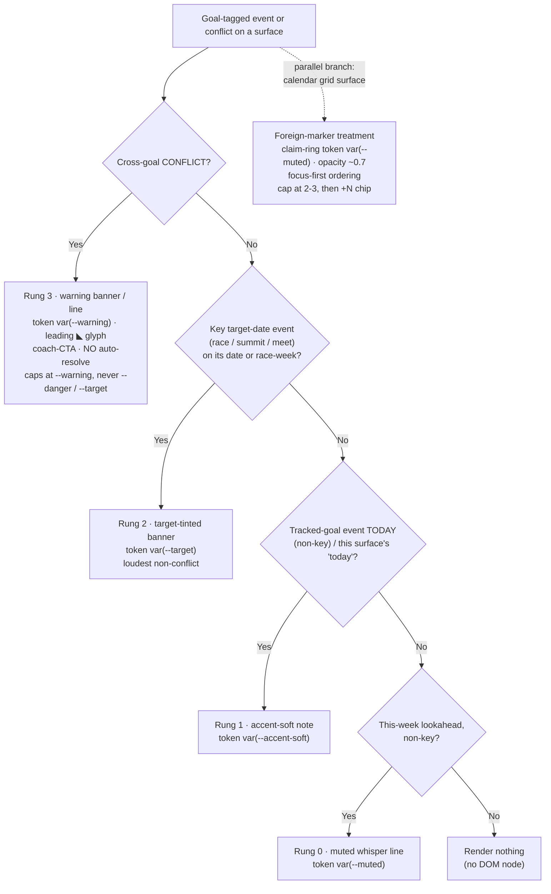
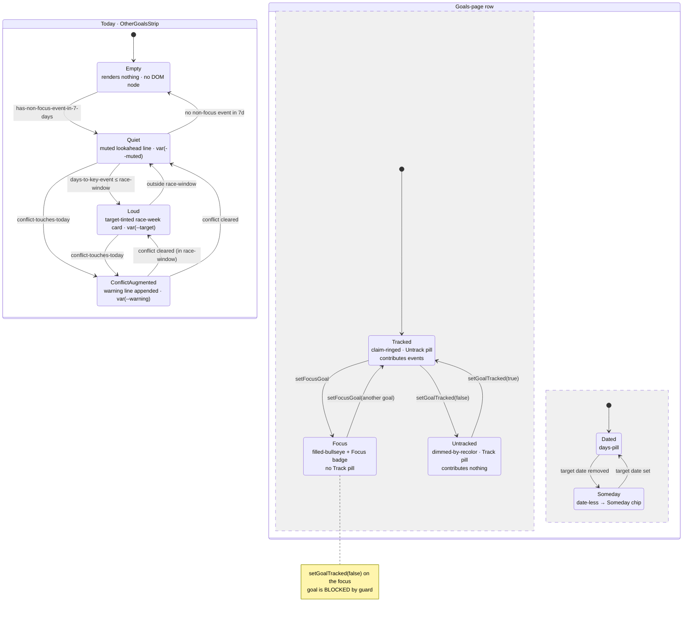

# UX Research — Multi-goal Phase 1: Cross-goal Awareness

**Feature:** Multi-goal awareness (focus vs tracked goals; goal-tagged events + cross-goal conflicts)
**Issue:** jronnomo/workout-planner #62 (Epic #61) · **PRD:** `docs/prds/PRD-multigoal-phase1-awareness.md` (this report refines §5, the baseline UI contract; structure there is fixed, visual treatment is decided here)
**Profile:** `.claude/skills/ux-research/profiles/goaldmine.profile.md`
**Scope:** REQ-106 — the four visual/interactive questions (Calendar markers · Today strip · Day banners · Goals page). No new routes, tokens-only, both themes, ≥44px targets.
**Pixel mockup:** [`multigoal-phase1-awareness.html`](./multigoal-phase1-awareness.html) (both themes, all four surfaces, real tokens)
**Chosen direction:** Claim-ring (figure/ground), reinforced

---

## 1. Current-State Audit

| # | Surface | Today's behavior (file:line) | Problem for the user |
|---|---------|------------------------------|----------------------|
| A | Calendar markers | `CalendarMonth.tsx` DayCell renders every marker via `MarkerIcon size={13}` in a `flex-wrap gap-0.5` row (`:251-255`); **no cap** — markers map unbounded | When non-focus events join, a race-week cell can overflow past the ~3–4 glyphs that fit in 47.7px×60px and collide with the date number + the 11px conflict wedge (`:262-268`). No way to tell a *foreign* goal's glyph from a *focus* one — both render identically at 13px. |
| B | Legend | `calendar/page.tsx:82-90` — flat `grid-cols-2` list of the focus goal's legend only | No "Other goals" affordance, so the user can't build the focus-vs-tracked mental model the feature depends on. |
| C | Today | `page.tsx` order: CharacterHeader (`:125-127`) → dominant hero workout card (`:130-178`) → baseline → nutrition. No slot for secondary-goal events. | A 5k race day during race week is **invisible** on the daily home — the exact failure the PRD calls out (race planned over by the focus prescription). |
| D | Day page | `days/[dateKey]/page.tsx` header (`:47-59`) with a single inline `🏔️ Goal target — {objective}` accent line (`:52-53`); prescription is a `<Card>` below (`:100-125`) | A non-focus race date shows a generic focus prescription with **zero** mention of the race; no banner, no conflict surface. |
| E | Goals | `goals/page.tsx` rows: Bullseye + objective + an "Active" outline badge that only renders for the focused goal (`:84-88`); days-remaining pill (`:111-129`) | With the new model *every* tracked goal is `active: true`, so the "Active" badge stops meaning "the one that drives my plan." No Track/Untrack control; the days-pill computes nonsense for a date-less goal. |

Shared primitives the research reuses (no new iconography): `Bullseye.tsx` (canonical progress glyph), `MarkerIcon.tsx` (legend→glyph; `trained`→Bullseye, else emoji, `hike-planned`→`opacity-40`), the conflict corner wedge, `Card.tsx`, and the established tinted-surface recipes (`SnapshotView.tsx:55` warning container; the `accent-soft` pill; the outline badge).

---

## 2. Chosen Direction — "Claim-ring (figure/ground), reinforced"

The whole feature rides on **one metaphor extended honestly**: in the Bullseye system a *hollow ring* already means "not the active fill." A foreign goal is one you have **claimed but are not actively mining** — so a tracked goal's marker is its own legend glyph wrapped in a thin **`var(--muted)` hollow claim-ring**, while the focus goal's markers stay un-ringed and full-strength (the figure). The Bullseye glyph stays **reserved for focus training only** — it never appears for a foreign goal, which is the cheapest, most honest cross-goal signal in the app. Loudness across all three surfaces follows a single **four-rung ladder** (whisper `--muted` → note `--accent-soft` → key-event `--target` → conflict `--warning`), with conflicts deliberately capped at `--warning` (friction, not failure — never `--danger`/`--target`). Grafts from the runner-up directions: from **Opacity-demote**, foreign markers also carry a slight `opacity~0.7` as a *redundant* second channel so distinction survives even if the ring softens; from **Tag-dot**, a leading `--muted` dot is the **named fallback** if the 1px ring fails the real-screen test at 13px. This direction won over the lighter Opacity-only approach because the user's real context is mid-workout and on-trail in bright sun, where an opacity delta alone is perceptually fragile — the *shape* channel (ring) is what holds up, and it doubles as the colorblind-safe redundancy the conflict wedge already established.

### 2.1 Answers to the four questions

**Q1 — Calendar markers / overflow / legend.**
- *Distinguish foreign from focus:* foreign glyph wrapped in `outline: 1–1.5px solid var(--muted); outline-offset: 0.5–1.5px; border-radius: 9999px` ⚠ + `opacity 0.55–0.70` ⚠. Use `outline` (not `border`) so it does not consume box space and reflow the tight `gap-0.5` row. Focus markers un-ringed, full-opacity. Bullseye reserved for focus.
- *Cap / overflow:* server-computed, **focus-first ordering**, show the first **2–3** markers ⚠ then collapse the remainder into one `+N` chip (`text-[9–10px] var(--muted)` on `bg-[var(--accent-soft)]`, rounded-full). Deterministic from the stable server-ordered array — no JS, no hydration flicker. The full uncapped list lives one tap deeper in the existing DayDetail panel (progressive disclosure).
- *Legend "Other goals":* keep the focus legend grid as-is; append a `border-t border-[var(--border)]` divider + an `OTHER GOALS` header (`text-[10px] uppercase tracking-wide text-[var(--muted)]`) + one row per non-focus active goal: its **own** `goal-date` legend glyph (claim-ringed, identical to the cell so the legend teaches the encoding) + label + objective in `var(--muted)`. The two-group split *is* the focus-vs-tracked lesson.

**Q2 — Today "Also today / this week" strip** (server component between CharacterHeader and the hero, **renders nothing when empty**):
- *Empty → no DOM node.* This is the single most important anti-banner-blindness move; never render a "nothing this week" placeholder.
- *Ordinary lookahead (non-key, this week):* Rung 0 whisper — one muted line, claim-ringed glyph, no heavy chrome: *"Sub-25 5k · next: Race day in 5 wks ›"*.
- *Event today (non-key):* Rung 1 — `bg-[var(--accent-soft)]` note.
- *Race week / key event:* Rung 2 — `bg-[var(--accent-soft)]` + `border-left: 2px solid var(--target)` ⚠, eyebrow in `var(--target)`, sub-line in `var(--muted)`. Loud *within itself* but still **positionally below** the hero (DOM order keeps the focus prescription primary on ordinary days). Loud/quiet is a server branch on days-to-event via `@/lib/calendar` (race-window `≤ 7d` ⚠).
- *Conflict touching today:* append a `var(--warning)` line.
- *No entrance animation* — the content is pre-existing DB state being surfaced, not an "arrival"; motion stays reserved for the once/day bullseye-pop completion.

**Q3 — Day page banners** (above the header/prescription; "loud but not auto-resolving" = visually assertive, behaviorally inert):
- *Race-day banner:* target-tinted — `border-[var(--target)]` (weight 1–1.5px ⚠) + a faint `var(--target)` wash (alpha `≈8–16%` ⚠), **body copy in `var(--foreground)`** (not `--target`) for AA. Reserved for the literal goal date. Copy: *"🥇 Race day — Run a sub-25 5k."* (A louder *filled* `--target`/`--target-fg` variant is recorded as a sign-off challenge — see §10.)
- *Cross-goal conflict banner:* warning-tinted, reusing the proven `SnapshotView` recipe — `border-left: 3px solid var(--warning)` + faint warning wash ⚠ + a **leading ◣/⚠ glyph in `var(--warning)`** (colorblind redundancy) + the conflict's `label` verbatim + a coach CTA (*"Ask your coach to sort the week →"*, in `var(--accent)`). **No resolve/dismiss button** — resolution is conversational in claude.ai; the banner's job is to start that conversation (open loop), not finish it. Persistent until the underlying data changes.
- *Secondary event types:* muted inline header line matching the existing `🏔️ Goal target` idiom (`var(--accent)` glyph/label + `var(--muted)` trailing text) — sits below the prescription in the visual stack.

**Q4 — Goals page:**
- *Focus badge (replaces "Active"):* a small **filled Bullseye `size=14`** (component minimum for the center ring ⚠) + `Focus` text in the existing accent-outline pill. Filled = singular: exactly one solid Bullseye on the page answers "which goal drives today" pre-attentively, and ties the page to the brand glyph.
- *Track / Untrack pill:* a server-action `<form>` button (`setGoalTracked`), `min-h-[44px]` tap area. Tracked = `bg-[var(--accent-soft)] text-[var(--accent)] border border-[var(--accent)]`; the untracked control reads `Track` in a `var(--border)`/`var(--muted)` outline. **Hidden on the focus row** (untracking focus is server-guarded — hide, don't disable).
- *Someday chip:* date-less goals replace the days-remaining pill with a neutral `Someday` chip (`rounded-full border border-[var(--border)] text-[var(--muted)]`) — no urgency color, because there's no deadline to be urgent about.
- *Dim untracked rows by RECOLOR, not opacity:* drop the objective from `var(--foreground)` to `var(--muted)`, keep full row opacity (a row-level `opacity` would push `--muted` on cream below AA 4.5:1). The Bullseye *glyph* may use `opacity 0.5–0.6` ⚠ (non-text, AA-safe).

---

## 3. Phase-A Options (divergent, narrowed to one)

Three competing directions were drawn at 390px across all four surfaces; they diverged only on the highest-risk decision — distinguishing a foreign marker inside a 13px row.

Direction comparison (click)

| | Glyph fidelity @13px | Row-width cost | Colorblind redundancy | Build / tuning risk |
|---|---|---|---|---|
| **1 Claim-ring** *(chosen)* | ring can crush glyph | low (outline is inset) | **strong** (shape) | **high** (the ring pixel @13px) |
| **2 Tag-dot** *(named fallback)* | full | ~5px/glyph stolen from a 47.7px row | medium (added mark) | medium |
| **3 Opacity-demote** *(graft: redundant channel)* | full | none | **weak** (single fragile channel) | **low** |

- **Direction 1 "Claim-ring"** — `var(--muted)` hollow ring around foreign glyphs. *Strength:* one metaphor (filled=focus / hollow=tracked) carries every surface; best colorblind story. *Risk:* a 1px ring around a 13px emoji is the single highest-risk pixel in the feature.
- **Direction 2 "Tag-dot"** — a 3–4px `--muted` dot prefixing foreign glyphs. *Strength:* full glyph fidelity, survives down-rezzing. *Risk:* reads as a smudge; steals ~5px from a tight row.
- **Direction 3 "Opacity-demote"** — foreign glyphs at `~0.6` opacity, distinction carried by legend + DayDetail labels. *Strength:* lightest lift, reuses the existing `hike-planned` `opacity-40` pattern. *Risk:* weakest redundancy; near-invisible in bright sun on a trail.

**Decision:** Direction 1, reinforced with Direction 3's opacity as a redundant channel and Direction 2 held as the playtest fallback. The honest test is a single A/B screenshot of the day-12 cell (`◎(🥇)` vs `◎ ·🥇` vs `◎ + dimmed 🥇`) on a real ~390px device in both themes.

---

## 4. Phase-B Technical Artifacts

### 4.1 Loudness-ladder routing (which treatment does an event get?)

### 4.2 State machines (Today strip + Goals row)

### 4.3 Pixel mockup

[`multigoal-phase1-awareness.html`](./multigoal-phase1-awareness.html) — self-contained, real `globals.css` tokens, both themes side-by-side, all four surfaces. Open it to judge the two load-bearing visual risks before building: the **claim-ring at 13px** and the **low-alpha target/warning washes on cream**.

---

## 5. Animation Storyboard

**None — by design.** This feature is entirely static. Distinction, loudness, and state are carried by token color, border weight, typography, spacing, and the claim-ring's shape — not motion. The signature `bullseye-pop` keyframe stays **reserved for the genuine once-per-day completion moment**; using it for event arrival would both cheapen that moment and read as an error state. If any easing is ever wanted on the Today strip it would be a `≤120ms` opacity-only fade gated behind `prefers-reduced-motion` — but the recommendation is **zero motion**. (Recorded as ledger row UXR-62-13 so the no-motion decision is tracked, not forgotten.)

---

## 6. Behavioral Psychology Principles

| Principle | How it's applied | Question |
|-----------|------------------|----------|
| Figure / ground + Von Restorff isolation | Focus markers are the vivid figure; tracked goals quieted (ring + opacity) into the ground — salience comes from *consistent* difference, not competing brightness | Q1 |
| Reserved-symbol semantics | The Bullseye means "focus training" and *only* that; never borrowed by foreign goals — a free, honest cross-goal signal | Q1 |
| Progressive disclosure + Hick's law | Grid stays a glanceable 2–3-marker decision; the uncapped list defers to the DayDetail tap | Q1 |
| Banner blindness avoidance | Empty strip renders nothing; a low base-rate + steep loudness curve keeps the rare loud state attention-worthy (cf. Apple Fitness award nudges vs Strava's always-on rail) | Q2 |
| Jakob's law (consistency) | One four-rung loudness grammar reused on calendar, Today, and day page — same loudness always means the same urgency | Q2, Q3 |
| Zeigarnik effect / action-priming | The race banner shows the race *next to* the still-prescribed focus workout — an open loop that primes the user to ask the coach to reconcile | Q3 |
| Signal-detection / cry-wolf restraint | Conflicts cap at `--warning` (friction, not failure); thresholds tuned conservatively so the warning channel stays trustworthy | Q3 |
| Recognition over recall + categorical distinctiveness | Filled badge = the one live goal; outline = tracked; chip = no date — three states each readable in one fixation | Q4 |

---

## 7. Implementation Scope

| File | Change | Complexity |
|------|--------|------------|
| `src/components/MarkerIcon.tsx` | Add a `foreign`/claim-ring variant (outline + opacity); keep Bullseye focus-only | Low |
| `src/components/CalendarMonth.tsx` | DayCell: focus-first marker ordering, 2–3 cap + `+N` chip, claim-ring on foreign markers, DayDetail event rows; conflict wedge already covers cross-goal via `cell.conflict` | Medium |
| `src/app/calendar/page.tsx` | Legend "Other goals" section (divider + header + foreign rows) | Low |
| `src/app/page.tsx` + new `src/components/OtherGoalsStrip.tsx` | Server-component strip between CharacterHeader (`:127`) and hero (`:130`); renders `null` when empty; quiet/loud/conflict rungs | Medium |
| `src/app/days/[dateKey]/page.tsx` | Race-day banner + cross-goal conflict banner above header (`~after :46`); muted secondary-event header lines | Low–Medium |
| `src/app/goals/page.tsx` | Filled-Bullseye "Focus" badge (replaces "Active" `:84-88`), Track/Untrack pill, Someday chip, dim-by-recolor untracked rows | Medium |
| `src/lib/goal-actions.ts` | `setGoalTracked` server action (mirror `setActiveGoal` + `revalidatePath`) | Low |

**Suggested testIDs / identifiers** (for the §10.3 browser smoke + future Maestro): `other-goals-strip`, `other-goals-strip-loud`, `cal-foreign-marker`, `cal-marker-overflow`, `legend-other-goals`, `day-race-banner`, `day-conflict-banner`, `goal-focus-badge`, `goal-track-toggle`, `goal-someday-chip`.

Architecture note from exploration: `LegendKind` is a *closed* enum. Cheapest path for foreign markers is a parallel `cell.otherGoalEvents[]` / `cell.foreignMarkers[]` array (per the PRD's `ResolvedDay`/cell additions) rather than overloading `LegendKind` — keeps the focus legend semantics clean.

---

## 8. Accessibility

- **Tap targets:** Track/Untrack pill `min-h-[44px]`; calendar cells already `min-h-[3.75rem]` (60px); strip rows `≥44px` if linked.
- **Both themes / contrast (verify before shipping — cream/gold light is contrast-tight):**
  - Conflict banner body copy in `var(--foreground)`, **not** `var(--warning)` — `--warning #A8511A` on a warning wash over cream is borderline (~4.4:1). Keep `--warning` to the border + the ◣ glyph.
  - Race banner body in `var(--foreground)`; `--target` barn-red on cream is strong (~5.5:1) if used for text.
  - Legend objective in `var(--muted)` on `--card` ≈ 4.7:1 — just clears AA; do **not** additionally dim.
  - Tracked-pill `--accent` text over the `accent-soft` wash lowers effective contrast — verify ≥4.5:1 or render the label on `--card`, or bump to `font-medium`.
  - Untracked rows dimmed by **recolor** (full opacity) so all text stays ≥ AA; only the Bullseye *glyph* uses opacity.
- **No color-only signaling:** every marker/banner pairs icon + label; the claim-ring adds a *shape* channel; conflicts carry the ◣ wedge/glyph.
- **aria-labels:** day cells append event + conflict labels ("…, Race day — sub-25 5k, conflict: race 1 day after long effort") per PRD §5.4.
- **Reduced motion:** N/A — nothing animates. `bullseye-pop` untouched.

---

## 9. ⚠ Provisional / Verify-Visually list

Every tagged number/ornament collected — confirm on a real 390px device in **both** themes before shipping:

1. **Claim-ring** — `outline 1–1.5px solid var(--muted)`, `outline-offset 0.5–1.5px`, `border-radius 9999px`. *Highest-risk pixel.* If it turns to mud at 13px → fall back to the **tag-dot** (3–4px `--muted` dot). (UXR-62-01)
2. **Foreign-marker opacity** — `0.55–0.70` (redundant channel; tune against the existing `hike-planned` 0.40). (UXR-62-02)
3. **Marker overflow cap** — 2 vs 3 visible before `+N`; verify against a worst-case race-week cell. (UXR-62-03)
4. **`+N` chip** — `text 9–10px`, `var(--muted)` on `var(--accent-soft)`; verify AA of small text on the faint wash. (UXR-62-04)
5. **Today loud strip** — `border-left 2px var(--target)` + `accent-soft` bg; verify the target rail reads on cream without out-shouting the hero. (UXR-62-06)
6. **Race-day banner tint** — border `1–1.5px var(--target)`, wash alpha `≈8–16%`; verify the low-alpha red is perceptible on `#FAF3E3`. (UXR-62-08)
7. **Conflict banner tint** — `border-left 3px var(--warning)` + warning wash; body copy in `--foreground` for AA. (UXR-62-09)
8. **Race-window / lookahead thresholds** — race-window `≤7d`, lookahead horizon `7–14d` (product + playtest call). (UXR-62-07)
9. **Focus-badge Bullseye** — `size=14` (component minimum for the red center ring). (UXR-62-11)
10. **Untracked-row dimming** — Bullseye glyph `opacity 0.5–0.6`; never row-level opacity. (UXR-62-12)
11. **No motion** — confirm nothing animates; `bullseye-pop` stays completion-only. (UXR-62-13)

---

## 10. Decisions requiring sign-off (do not slip in silently)

Two items would change a value the PRD §5 already fixed; flagged as challenge-with-evidence, **not** adopted unilaterally:

- **Today strip placement.** PRD §5.1 fixes the strip *between* CharacterHeader and the hero. The Brand specialist argued for *below* the hero (so the hero is never visually preceded on ordinary days). This report **honors the PRD** (between) and relies on the empty/quiet states + DOM-order subordination to protect the hero. *If* playtest shows the quiet strip still distracts above the hero, revisit placement with the screenshot as evidence. (UXR-62-05)
- **Race-banner loudness.** PRD §5.1 baseline is a *target-tinted border*. The Brand specialist proposed a louder **filled** `var(--target)` / `var(--target-fg)` banner reserved for the literal race date (ties to the filled-Bullseye "hit the center" peak metaphor). This report ships the tinted-border baseline; the filled variant is offered for sign-off only. (UXR-62-10)

---

## 11. Recommendation Ledger

IDs are stable (`UXR-62-NN`) and never renumbered. Status starts `proposed`; the implementing PR ticks each to `shipped`/`reworked`/`dropped` with a SHA / `file:line` / short reason. The full ledger also lives at [`multigoal-phase1-awareness-ledger.md`](./multigoal-phase1-awareness-ledger.md).

| ID | Recommendation | Type | Status | Evidence |
|----|----------------|------|--------|----------|
| UXR-62-01 | Foreign marker = claim-ring (`outline ~1px var(--muted)` + radius); fallback = tag-dot | tuning⚠ | proposed | |
| UXR-62-02 | Foreign marker redundant `opacity ~0.55–0.70` channel | tuning⚠ | proposed | |
| UXR-62-03 | Marker overflow: focus-first order, cap 2–3, then `+N` chip | layout | proposed | |
| UXR-62-04 | `+N` chip recipe (`9–10px var(--muted)` on `accent-soft`) | tuning⚠ | proposed | |
| UXR-62-05 | OtherGoalsStrip placement between CharacterHeader & hero (PRD-fixed; sign-off if revisited) | layout | proposed | PRD §5.1 |
| UXR-62-06 | Today strip loud state: `accent-soft` bg + `2px var(--target)` rail | tuning⚠ | proposed | |
| UXR-62-07 | Strip race-window `≤7d` / lookahead horizon `7–14d` | tuning⚠ | proposed | |
| UXR-62-08 | Day race-day banner: target-tinted border + low-alpha wash, body in `--foreground` | tuning⚠ | proposed | |
| UXR-62-09 | Day cross-goal conflict banner: `3px var(--warning)` rail + ◣ glyph + coach CTA, no resolve/dismiss | decoration⚠ | proposed | |
| UXR-62-10 | Filled `var(--target)` race banner variant (louder than PRD baseline) | tuning⚠ | proposed | needs sign-off; PRD §5.1 baseline = tinted border |
| UXR-62-11 | Goals "Focus" badge = filled Bullseye `size=14` + label (replaces "Active") | component | proposed | |
| UXR-62-12 | Goals Track/Untrack pill (`min-h-44px`, server action); untracked dim-by-recolor | a11y | proposed | |
| UXR-62-13 | No animation anywhere; `bullseye-pop` stays completion-only | animation | proposed | |
| UXR-62-14 | Legend "Other goals" section (divider + header + claim-ringed foreign rows) | layout | proposed | |
| UXR-62-15 | "Someday" chip for date-less goals (neutral `--border`/`--muted`, replaces days-pill) | component | proposed | |
| UXR-62-16 | Muted inline secondary-event header lines on day page (match `🏔️ Goal target` idiom) | copy | proposed | |

*Specialists: Data/Behavior · Next.js Dev & CSS-Animation · UI Design & Brand. Phase-1 exploration mapped against the live codebase (file:line cited inline).*
