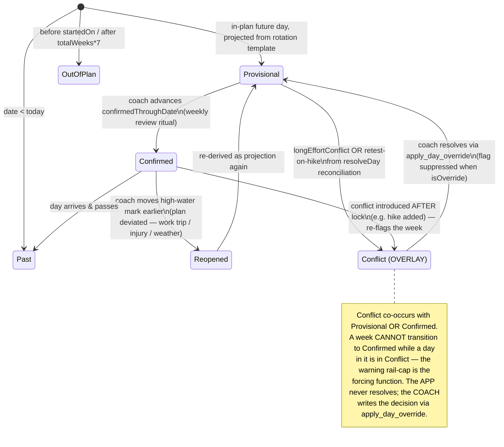

# UX Research — Plan-Confidence States on the Goaldmine Calendar

**Slug:** `plan-confidence-calendar`
**Feature:** Make provisional (template-projected) future days visually distinct from confirmed (reviewed) days, with a conflict overlay, on the month calendar.
**Companion design doc:** `docs/design/long-effort-reconciliation.md` (the backend correctness fix that emits the conflict flags). Read its §2 / §10 — *the app surfaces, the coach resolves.*
**Deliverable target:** committed file (no issue number supplied). Ledger: `docs/ux-research/plan-confidence-calendar-ledger.md`. Pixel artifact: `docs/ux-research/plan-confidence-calendar.html`.

> **Product thesis (load-bearing, verbatim):** The app is a fast, honest logger + dashboard for ONE user; all reasoning happens in claude.ai over MCP — the app makes no LLM calls and must stay cheap, server-rendered, dead-simple on a phone mid-workout. Single source of truth is the DB the MCP tools read/write; the UI surfaces state and edits it but never invents prescription detail. Visual identity = the Bullseye/target "mining for goals" motif; motion is deliberately minimal CSS, spent on genuine completion moments, not decoration.

> **Governing principle for THIS feature:** the plan is a dynamic, conversational experience between user and coach. The calendar **shows confidence; it never resolves anything.** No cell, no rail, no animation may auto-decide a training adjustment. Confidence is a *quiet secondary signal* layered onto cells whose hero remains the training content.

---

## 1. Current-State Audit

Everything below is the real render path. The calendar is a flat 42-cell grid; **every in-plan day is drawn with identical visual confidence** — week 1 (reviewed) is byte-identical to week 12 (pure modulo-7 projection). That sameness is the dishonesty this feature corrects.

| # | Finding | Location | User impact |
|---|---------|----------|-------------|
| 1 | `CalendarDayCell` carries no confidence dimension — only `isPast/isToday/isFuture/isInPlan` and content counts. Projection vs commitment is unrepresentable. | `src/lib/calendar.ts:9-25` | Week 12's guess looks as authoritative as this week's reviewed plan. |
| 2 | `buildCell` derives `rotationDay`/`weekIndex` from `(daysDelta % 7)` and a static `weeklySplit.find(...)` — a pure projection for all future weeks, with no signal that it's a projection. | `src/lib/calendar.ts:142-154` | The "phantom Saturday long-effort" (design doc §1) renders at full confidence. |
| 3 | The grid is a single `grid grid-cols-7 gap-1` of 42 buttons — **no week-row grouping, no left gutter.** A per-week rail has nowhere to live today. | `src/components/CalendarMonth.tsx:82-93` | A per-week confidence encoding requires restructuring the grid into week rows. |
| 4 | Cell tone logic only knows `inMonth`, `isQuietPast`, `isCompleted`, `selected/today` — three states, all hue/ring based (`ring-[var(--accent)]`, gold glow). | `src/components/CalendarMonth.tsx:119-141` | Adding confidence by *more color* would collide with the existing gold accent system and fail colorblind-safety. |
| 5 | No `Plan.confirmedThroughDate` / confirmation record exists. The weekly ritual already exists as `log_review` → a `Note{type:"review", targetDate:weekOf}`. | `prisma/schema.prisma:234-255`; `src/lib/mcp/tools.ts:1981-2009` | "Confirmed" has a natural ritual hook but **no stored high-water mark** to drive the visual. |
| 6 | The reconciliation flags the visual must reflect (`longEffortConflict`, retest-on-hike) are **not yet on the cell** — the design doc adds them to `ResolvedDay`/`buildCell` but `buildCell` currently stops at `baselinesDue`. | `calendar.ts:172-188`; design doc §5, §11 step 3 | The conflict overlay depends on the companion backend work landing first (sequencing dependency). |
| 7 | The Bullseye motif (`progress=0..1`, rings fill center-out) and the `bullseye-pop` keyframe (320ms) already exist and are *under-used* — `bullseye-pop` is defined but not wired into any rendered page. | `src/components/Bullseye.tsx`; `globals.css:105-119` | A "week solidifying" moment is exactly the genuine-completion motion the thesis reserves motion for — the primitive is already built. |

**Audit takeaway:** the data model needs one new derived dimension (confidence) + one stored high-water mark; the component needs to regroup into week rows; and the encoding must use **non-hue channels** because the gold accent system already owns color.

---

## 2. Chosen Direction (one paragraph)

**Per-week confidence rail in the left gutter, capped with a small Bullseye, plus a quiet per-cell provisional treatment; conflict is a separate overlay channel that blocks the week from locking.** The review/confirm ritual is *weekly*, so the primary signal is weekly: each Mon–Sun row gets a slim left-margin rail whose cap is the canonical Bullseye — **filled = confirmed/locked, hollow = provisional, warning-ring = needs review (conflict).** This is the honest, low-noise home for confidence and it reuses the brand's core glyph for a genuine "this week is locked" moment rather than decoration. Per *day*, provisional future cells get a **second, non-color cue stack** (reduced opacity + a dashed top hairline) so confidence survives colorblindness and the contrast-tight cream palette; confirmed cells are simply solid and normal. The **conflict overlay** is a corner dog-ear wedge in `var(--warning)` on the specific colliding day — it layers cleanly on *either* provisional or confirmed cells because it occupies a different channel (corner geometry) from the cell fill — and it forces the week's rail-cap into the warning state, making "a week cannot go confirmed while it has an unresolved conflict" a *visual* forcing function. Grafted from the runner-up options: the **per-cell opacity + dashed-border** secondary cue is borrowed from Option A (per-day), giving redundancy at the day level; the **texture-as-non-color-channel** idea from Option C is kept in spirit (dashed strokes) but its full diagonal hatch is rejected as too noisy at ~48px cells.

---

## 3. Phase-A Options (divergent ASCII, ≤390px phone column)

Three *competing directions* for encoding the 3 base states + conflict overlay. Legend for the sketches:
`██` solid/confirmed fill · `░░` faded/provisional · `◉` filled Bullseye cap · `○` hollow Bullseye cap · `⊘` warning cap · `▟!` conflict corner-wedge · `◎` baseline · `🥾` hike.

### Option A — Per-DAY fill only (no rail)
Every future cell carries its own confidence: confirmed = solid, provisional = faded + dashed top edge. Conflict = corner wedge.

```
 Mon  Tue  Wed  Thu  Fri  Sat  Sun     LIGHT (cream/gold)
┌────┬────┬────┬────┬────┬────┬────┐
│ 9  │ 10 │ 11 │ 12 │ 13 │ 14 │ 15 │   confirmed week = solid cells
│◉ • │    │ ◎  │    │    │    │    │   (• = trained target glyph)
├╌╌╌╌┼╌╌╌╌┼╌╌╌╌┼╌╌╌╌┼╌╌╌╌┼▟!──┼╌╌╌╌┤
│░16 │░17 │░18 │░19 │░20 │░21 │░22 │   provisional week = faded + dashed
│ ░  │ ░  │ ░  │ ░  │ ░  │░⛰ ░│░🥾░│   tops; Sat 21 carries the conflict wedge
└╌╌╌╌┴╌╌╌╌┴╌╌╌╌┴╌╌╌╌┴╌╌╌╌┴╌╌╌╌┴╌╌╌╌┘
```
**DARK:** identical geometry; faded = `opacity .6` over `var(--card)` coal, dashed top in `var(--muted)`; wedge in `var(--warning)` warm-amber. **Verdict:** honest but *noisy* — 35 future cells each shouting their state; the weekly ritual is invisible; "which week needs my review" requires scanning every cell. Good day-level redundancy, bad primary signal.

### Option B — Per-WEEK rail + Bullseye cap (+ quiet per-cell cue)  ★ CHOSEN
A slim confidence rail in the left gutter per week row; cap = Bullseye. Cells keep a *gentle* version of A's cue as redundancy.

```
      Mon  Tue  Wed  Thu  Fri  Sat  Sun     LIGHT (cream/gold)
 ◉  ┌────┬────┬────┬────┬────┬────┬────┐
 █  │ 9  │ 10 │ 11 │ 12 │ 13 │ 14 │ 15 │  CONFIRMED: solid gold spine,
 █  │◉ • │    │ ◎  │    │    │    │    │  filled Bullseye cap, solid cells
 █  └────┴────┴────┴────┴────┴────┴────┘
 ⊘  ┌────┬────┬────┬────┬────┬────┬────┐
 ╎  │░16 │░17 │░18 │░19 │░20 │▟!21│░22 │  CONFLICT: warning cap, warm-dashed
 ╎  │ ░  │ ░  │ ░  │ ░  │ ░  │░⛰  │░🥾 │  spine — week CANNOT lock; Sat wedge
 ╎  └────┴────┴────┴────┴────┴────┴────┘
 ○  ┌────┬────┬────┬────┬────┬────┬────┐
 ┊  │░23 │░24 │░25 │░26 │░27 │░28 │░29 │  PROVISIONAL: hollow cap, dashed
 ┊  │ ░  │ ░  │ ░  │ ░  │ ░  │ ░  │ ░  │  hairline spine, faded cells
 ┊  └────┴────┴────┴────┴────┴────┴────┘
```
**DARK:** spine `var(--accent)` gold solid (confirmed) vs `var(--muted)` dashed (provisional) vs `var(--warning)` dashed (conflict); caps are the real Bullseye SVG (filled `var(--target)` red rings / hollow `var(--muted)` ring). **Verdict:** the weekly ritual is legible at a glance (one cap per week answers "is this week locked?"), per-cell noise drops to a single faint opacity step, and the Bullseye earns its place. **This is the recommendation.**

### Option C — Texture/hatch fill for provisional (no rail)
Provisional cells filled with a diagonal hatch; confirmed solid; a heavier week-separator line between confirmed and provisional weeks.

```
 Mon  Tue  Wed  Thu  Fri  Sat  Sun
┌────┬────┬────┬────┬────┬────┬────┐
│ 9  │ 10 │ 11 │ 12 │ 13 │ 14 │ 15 │  confirmed: clean
├════╪════╪════╪════╪════╪════╪════┤  ← heavy "confidence frontier" rule
│╱16 │╱17 │╱18 │╱19 │╱20 │╱21▟│╱22 │  provisional: ╱╱ hatch fill
│╱╱╱ │╱╱╱ │╱╱╱ │╱╱╱ │╱╱╱ │╱⛰╲!│╱🥾 │  conflict wedge fights the hatch
└────┴────┴────┴────┴────┴────┴────┘
```
**Verdict:** the "confidence frontier" rule is a strong single idea, but full hatch at ~48px on the cream palette muddies the date number and *collides* with the conflict wedge (texture-on-texture). Rejected as primary; the frontier-rule concept survives as a subtle idea (the rail's top edge already implies it).

---

## 4. Phase-B — Technical Diagrams (chosen direction)

### 4.1 Confidence state machine (incl. conflict overlay + provisional→confirmed→reopened)



### 4.2 provisional→confirmed flip — animation timing (CSS-only)

Illustrative axis; every duration is **⚠ playtest** (see §9). One bar per tween.

```mermaid
gantt
    title provisional→confirmed flip (week locks) — illustrative ms, NOT decided
    dateFormat SSS
    axisFormat %L
    section Rail spine
    dashed muted -> solid gold (border/bg)        :a1, 000, 280ms
    section Week cap (Bullseye)
    hollow ring -> filled rings (bullseye-pop)     :a2, 040, 320ms
    section Day cells in the row
    opacity .62 -> 1.0 + drop dashed top           :a3, 060, 300ms
    section Reduced-motion
    instant swap, no tween (prefers-reduced-motion):a4, 000, 1ms
```



The cap reuses the existing `@keyframes bullseye-pop` (`globals.css:105`, 320ms `cubic-bezier(0.16,1,0.3,1)`); the spine + cells use plain `transition` on `opacity`/`border`/`background`. Honor `prefers-reduced-motion` exactly as the existing `.bullseye-pop` block does (`globals.css:115-119`) — instant state swap, no pop.

### 4.3 Pixel artifact

Self-contained HTML using the real `globals.css` tokens, both themes, all four week states (past-confirmed, confirmed, conflict, provisional): **`docs/ux-research/plan-confidence-calendar.html`** — open in a browser; it mirrors the chosen direction at ~360px column width.

---

## 5. Animation Storyboard (the week "solidifies")

Cross-referenced to the §4.2 gantt. Trigger: the calendar re-renders after the coach advances `confirmedThroughDate` past this week (server action + `revalidatePath`). Because the app is server-rendered, the flip is "newly-confirmed week mounts in confirmed state" — apply the one-shot pop only when a week crosses the frontier (gate via a localStorage key per `weekIndex`, mirroring `TodayCelebration`'s once-per-day guard at `TodayCelebration.tsx:22-33`).

```
Frame 0 (0ms)     ○  dashed muted spine, hollow cap, cells @ ~.62 opacity, dashed tops
                  ┊  [ 23 ][ 24 ][ 25 ][ 26 ][ 27 ][ 28 ][ 29 ]   ← "needs review"

Frame 1 (~40ms)   spine begins border/bg transition toward gold; cap starts bullseye-pop
                     (scale 0.6→1.08, opacity 0→1)

Frame 2 (~180ms)  ◉  cap overshoots to 1.08 scale, rings filling center-out;
                  ▓  spine ~70% gold; cells ramping opacity, dashed tops fading

Frame 3 (~320ms)  ◉  cap settles to 1.0 filled target; spine solid gold;
                  █  cells solid @ 1.0, dashed tops gone  → "locked"
                  █  [ 23 ][ 24 ][ 25 ][ 26 ][ 27 ][ 28 ][ 29 ]

Reduced-motion    Frame 0 → Frame 3 instantly, no intermediate frames.
```

This is the *only* new motion. No conflict animation, no provisional "shimmer," no per-cell entrance — the thesis spends motion on genuine completion moments only. The week-lock is exactly that moment.

---

## 6. Behavioral-Psychology Principles (core)

| Principle | How it applies here | Design expression | Restraint guard |
|-----------|--------------------|--------------------|-----------------|
| **Zeigarnik effect** (open loops nag) | Unreviewed/provisional weeks are "open loops"; the hollow cap + dashed rail keep them gently unresolved so the weekly review ritual gets done. | Hollow Bullseye cap = an unfinished target asking to be filled. | Quiet, not a red badge — it must not feel like overdue debt. |
| **Goal-gradient effect** (effort rises near the goal) | The 🏔️ goal date is the terminus; confirmed weeks accreting toward it visualize closing distance. | Solid gold spines stack downward toward the goal date pin. | No progress %/streak counter — that's dashboard noise; the rails *are* the gradient. |
| **Endowed progress / commitment** | A *confirmed* week feels owned; filling the cap is a small commitment device tied to the review conversation. | The bullseye-pop "solidify" rewards the act of locking a week. | One pop per week-crossing only; gated like `TodayCelebration`. |
| **Recognition over recall** | The user shouldn't have to *remember* which weeks are real vs guessed. | One cap per week answers it pre-attentively. | Encoding is glanceable, not a thing to study. |
| **Honest-signal / trust calibration** | Showing a guess as fact erodes trust in the whole plan. | Provisional treatment makes the system's *uncertainty* legible. | Never overstate confidence; a week with a conflict literally cannot show "locked." |
| **Forcing function** (constraint prevents error) | A week with an unresolved conflict must not be lockable. | Warning rail-cap; confirm is blocked upstream until the conflict clears. | The block lives in the confirm action, not just the pixels — visual + logic agree. |

---

## 7. Implementation Scope

**Sequencing dependency:** the conflict overlay needs the companion backend (`longEffortConflict`, retest-on-hike) from `docs/design/long-effort-reconciliation.md` to land first (its §11 steps 2–3). The confidence (confirmed/provisional) layer is independent and can ship first.

### 7.1 Data model — recommended encoding: **high-water mark on `Plan`**
Recommend a single nullable column over per-day flags or a per-week join table.

- **Add** `Plan.confirmedThroughDate DateTime?` (`prisma/schema.prisma:234`). Null = nothing confirmed yet. A migration via `npx prisma migrate dev`.
- **Why high-water mark, not per-day / per-week table:** the review ritual is *sequential and weekly* — you confirm week-by-week as you reach them, so confirmation is monotonic and contiguous. A single date captures it with near-zero write cost (fits the thesis: cheap, DB is source of truth). Per-day flags = 84 rows of noise to manage; a per-week table = a join for a value that's always "everything up to date X." **Reopen** is just moving the mark earlier — naturally handled, no tombstones. *If* non-contiguous confirmation ever becomes real (it won't, given the ritual), a `WeekConfirmation` table is the clean v2; note that and move on.
- **How it's set (conversational, never auto):** extend `log_review` (`tools.ts:1981`) with an optional `confirmThroughWeekEnd` that advances `Plan.confirmedThroughDate` — the review *is* the confirm act, near-free. Add explicit `confirm_week(weekIndex)` / `reopen_week(weekIndex)` MCP actions for the coach to move the mark directly. All follow the existing "propose before applying" rule — the coach proposes, the user approves, the app writes. **The app never advances the mark on its own.**
- **Guard:** `confirm_week` / the `log_review` advance must **refuse** to cross a week that still has an unresolved conflict (server-side check using the reconciliation flags) — the forcing function lives in the action, not only the pixels.

### 7.2 New `CalendarDayCell` fields (`src/lib/calendar.ts:9-25`, derived in `buildCell:117`)
```ts
// derived in buildCell from Plan.confirmedThroughDate + reconciliation flags
confidence: "past" | "confirmed" | "provisional" | null;  // null when !isInPlan
//   past        := isInPlan && isPast
//   confirmed   := isInPlan && !isPast && date <= plan.confirmedThroughDate
//   provisional := isInPlan && isFuture && (no mark or date > confirmedThroughDate)
conflict: { kind: "long-effort" | "retest-on-hike"; withDates: string[] } | null;
//   from longEffortConflict / retest-on-hike (companion backend). null when isOverride
//   (coach already resolved → nothing to nag), per design doc §4.
```
`getCalendarMonth` (`calendar.ts:27`) adds `program?.confirmedThroughDate` to what it threads into `buildCell` (one extra field on the already-fetched program snapshot — **no new query**). The rail's per-week state is *reduced* in the component from the row's 7 cells (all confirmed → confirmed cap; any conflict → warning cap; else hollow), so no per-week field is needed on the cell.

### 7.3 Component changes (`src/components/CalendarMonth.tsx`)
- **Restructure** the flat `grid grid-cols-7` (`:82`) into **6 `WeekRow` components**, each `grid-cols-[16px_repeat(7,1fr)]`: col 1 = `<WeekRail>`, cols 2–8 = the existing `DayCell`s. The 42 cells already arrive as full Mon–Sun weeks (padded in `getCalendarMonth:33-35`), so chunk by 7.
- **`<WeekRail>`** (new): renders the spine (CSS background-gradient: solid gold / dashed muted / dashed warning) + a `<Bullseye>` cap (`filled` / hollow / a new warning variant). Reuse `Bullseye` (`src/components/Bullseye.tsx`) — the warning cap can be a `Bullseye` wrapper tinted via a `var(--warning)` stroke, OR a minimal new prop; prefer the wrapper to avoid touching the canonical component. **⚠ verify visually.**
- **`DayCell`** (`:100-159`): extend `toneClass`/add `confidenceClass` — provisional → `opacity-[.62] border-t border-dashed border-[var(--muted)]`; confirmed → unchanged solid; conflict → a corner wedge pseudo-element in `var(--warning)`. Keep the existing today/selected ring and gold glow untouched (different channel). **All opacity values ⚠ playtest.**
- **Touch target:** cells stay `min-h-[3.75rem]` (60px ≥ 44px). The 16px rail is **decorative/non-interactive** (or, if tapped, opens the same `DayDetail`/week summary — do not add a new modal; reuse patterns).

### 7.4 testIDs (no `data-testid` convention exists yet — establish one)
| Element | `data-testid` |
|---------|---------------|
| Week row wrapper | `week-row-{weekIndex}` |
| Week confidence rail | `week-rail-{weekIndex}` |
| Week cap (state in `data-confidence`) | `week-cap-{weekIndex}` |
| Day cell (state in `data-confidence`, conflict in `data-conflict`) | `day-cell-{dateKey}` |
| Conflict wedge | `day-conflict-{dateKey}` |

Expose state as data-attributes (`data-confidence="provisional|confirmed|past"`, `data-conflict="long-effort"`) so tests assert semantics, not styling.

### Complexity
- Data model + MCP actions: **M** (one column, one migration, extend `log_review`, add `confirm_week`/`reopen_week`, the conflict guard).
- `buildCell` derivation: **S** (pure, no new query).
- Component restructure to week rows + rail/cap + cell cues: **M** (the grid refactor is the bulk).
- Animation: **S** (reuse `bullseye-pop` + CSS transitions).
- **Hard dependency:** conflict overlay blocked on the companion reconciliation backend.

---

## 8. Accessibility

- **Not hue-alone (colorblind-safe):** every confidence distinction carries a **redundant non-color channel** — fill solid vs hollow (cap *shape*), spine solid vs *dashed* (line *style*), cell *opacity* step, cell dashed *top border*. A user who can't separate gold from muted still reads filled-vs-hollow caps and solid-vs-dashed spines. Conflict adds a *geometric* corner wedge, not just amber. ✅ invariant satisfied.
- **Contrast, both palettes (⚠ verify before ship — cream is tight):**
  - Light: cap rings `var(--target)` `#A82A1F` on `var(--card)` `#FFFBF0` ≈ 5.8:1 ✅; provisional cell text is `var(--foreground)` at `opacity .62` over `var(--card)` — **this is the risk**: 62% opacity on `#1F1408` over cream ≈ borderline for the date number. **⚠ verify the date number stays ≥ 4.5:1; if not, raise the floor opacity or dim the *background*, not the text.**
  - Dark: `var(--target)` `#C0392B` on `var(--card)` `#1A130C` ≈ 4.9:1 ✅; warning `#E0915C` rail on coal ≈ 7:1 ✅.
- **Reduced motion:** the flip degrades to an instant state swap; reuse the existing `@media (prefers-reduced-motion: reduce)` pattern (`globals.css:115`, `:191`). No pop, no opacity tween.
- **Touch targets:** day cells remain ≥ 60px (`min-h-[3.75rem]`); rail is non-interactive or routes to existing detail. ✅ ≥ 44px.
- **Labels:** extend the existing `aria-label` on `DayCell` (`CalendarMonth.tsx:148`) to append confidence + conflict, e.g. `"2026-06-21 — Long Endurance · provisional · conflict: planned hike this week"`. The rail cap is decorative (`aria-hidden`) since the day's label already carries the semantics — avoid double-announcing.

---

## 9. ⚠ Provisional / Verify-Visually List

Every tuning number is a **range to playtest at 390px**, not a decision. Pull-through to the ledger.

| Tag | Item | Provisional range | What to confirm |
|-----|------|-------------------|-----------------|
| ⚠ tuning | Provisional cell opacity | **0.55–0.70** | Date number still reads + provisional clearly recedes from confirmed. Bias *less* faded if the number drops below AA. |
| ⚠ tuning | Flip: spine dashed→solid transition | **220–320 ms** ease | Feels like "solidifying," not sluggish. |
| ⚠ tuning | Flip: cap reuse `bullseye-pop` | **320 ms** (existing) `cubic-bezier(0.16,1,0.3,1)` | Already shipped value; confirm it reads at 16px cap scale. |
| ⚠ tuning | Flip: cell opacity ramp | **240–320 ms**, start offset ~60ms | Staggered-but-cohesive with the cap. |
| ⚠ tuning | Rail spine width | **2–3 px** | Present but quiet; doesn't steal the gutter. |
| ⚠ tuning | Provisional spine dash | dash **3–5px** / gap **4–9px** | Reads as "dashed/tentative" at small size, not as a solid line. |
| ⚠ decoration | Conflict corner-wedge size | **11–14 px** triangle | Visible at a glance without covering the date number; verify it doesn't fight the today/selected ring. |
| ⚠ decoration | Warning rail-cap variant (Bullseye wrapper vs new prop) | n/a | Verify the warning cap is distinguishable from both filled and hollow at 16px; confirm wrapper approach doesn't muddy the canonical `Bullseye`. |
| ⚠ tuning | Cap size in the 16px rail gutter | **14–16 px** | Bullseye needs ≥14px to render its red center ring (`MarkerIcon.tsx:20-21`). |

---

## 10. Recommendation Ledger

Full ledger with stable IDs and `proposed` status: **`docs/ux-research/plan-confidence-calendar-ledger.md`.**
**Implementer:** tick each row to `shipped` / `reworked` / `dropped` with a SHA or `file:line` + one-line reason when the feature lands. The `tuning⚠` / `decoration⚠` rows are the ones future audits care about most — none may ship un-verified.
