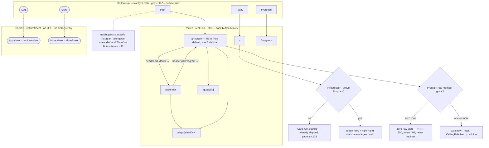
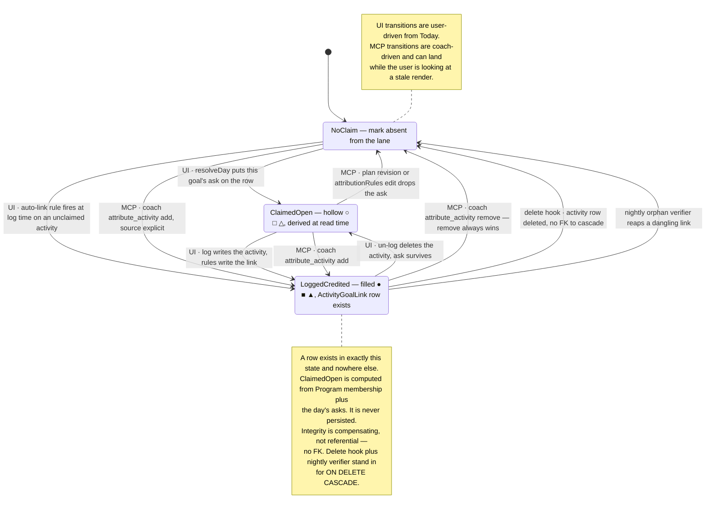
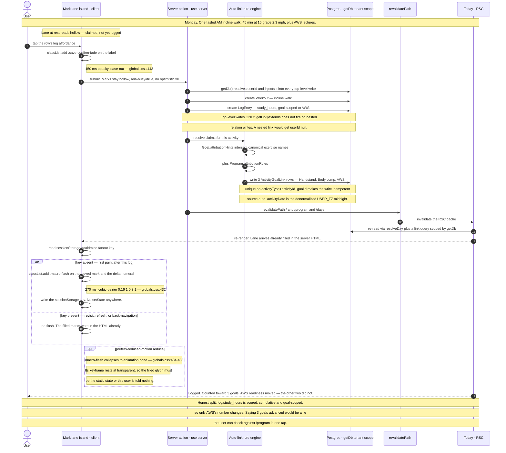

# UX Research — The Program Views

**Feature:** the five surfaces of the Program-model redesign (Sprint 6 / M4b) — Unified Today, `/program`, cross-goal calendar, `/progress` per-metric, SavedMeal quick-pick
**Date:** 2026-08-09 · **Profile:** `goaldmine` · **Board:** Goaldmine Roadmap (#8), Sprint 19
**Ground truth:** `docs/program-redesign/02-rfc-program-model.md` §4–5 · `examples/goaldmine-integration-blockers.md` §3 (binding) · `examples/phase2a-goals-import-spec.md` (the real payload) · `docs/roadmap/program-redesign-plan.md` §4.5
**Pixel mockup:** [`program-views.html`](./program-views.html) — self-contained, real tokens, light/dark toggle, four panels
**Ledger:** [`program-views-ledger.md`](./program-views-ledger.md) — `UXR-PV-NN`, stable, the implementing PR ticks it

> Every mockup renders the **real** Phase 2A content: Program "Lighter and Upside Down" (Aug 10 – Dec 31 2026, Blocks 0–3), the three member goals, Monday Aug 24's incline walk that serves all three, the Aug 14–15 Mirror Lake window, and the two real saved meals. No placeholders anywhere.

---

## 0 · Three findings that reframed the brief

These came out of the exploration and specialist passes and are load-bearing for every decision below. Two of them invalidate the obvious design.

### F1 — The palette is iso-luminant. Hue can never be the identity channel.

Measured WCAG contrast **between chromatic tokens** (not against a surface):

| pair | light | dark |
|---|---:|---:|
| `--target` ↔ `--accent` | **1.16** | **1.35** |
| `--target` ↔ `--success` | **1.05** | **1.08** |
| `--accent` ↔ `--success` | **1.10** | **1.24** |
| `--accent` ↔ `--warning` | **1.01** | 1.09 |
| `--success` ↔ `--muted` (light) | **1.00** | 1.20 |

`globals.css:657` already notes gold/rust are "luminance twins" — but it *understates* it. Every token was independently tuned to land 4.9–6.5:1 against **both** cream and coal, which mathematically forces them all into one luminance band. Light-mode `--success` vs `--muted` is **1.00:1** — byte-identical in grayscale.

**Consequence:** goal identity must be carried by **shape and position**. Hue is a recognition accelerator layered on top. This kills the "just add a fourth colour slot" conversation permanently and upgrades the house redundant-channel rule (`MarkerIcon.tsx:10-11`, `CalendarMonth.tsx:520-524`) from guideline to hard requirement.

Good news, same computation: every ramp token passes AA as **text** on both surfaces (light on `--card`: target 6.14, success 5.84, accent 5.29, muted 5.82; dark: accent 8.02, success 6.45, target 5.95, muted 5.36).

### F2 — `Bullseye progress={0.80}` renders as completely full.

`Bullseye.tsx:136-143`:
```ts
const max = size < 10 ? 1 : size < 14 ? 2 : size < 20 ? 3 : 4;
return Math.max(1, Math.ceil(p * max));
```
At size ≥20, `ceil(0.80 × 4) = 4` — all four rings. Worse: `filled === true` also yields 4 rings, so `progress={0.8}` and `filled` produce **byte-identical SVG**. A readiness of 80 held down by two open gates would render on the canonical glyph as **"done"** — the exact opposite of the truth.

**Consequence:** the headline readiness numeral must not sit on a Bullseye. `Bullseye.tsx` must not be modified (`WeekRail.tsx:12` says so verbatim); the sanctioned variant path is a **sibling inline element** (precedent `BullseyeWarning`, `WeekRail.tsx:22-34`). The Bullseye stays canonical for binary per-gate rows (size 14, `filled`) and the once-per-day completion moment.

### F3 — Emoji legend glyphs cannot be tinted, and `◆` is already taken.

`MarkerIcon.tsx:43-52` applies only `fontSize` to the fallthrough branch. Legend glyphs are emoji (🥾 ⛏️ 🏔️ 🎯 🤸 ⚖️ 📚 …) — **COLR/CBDT multicolor glyphs, on which `color:` is a complete no-op.** A per-goal hue applied to the glyph silently does nothing.

Separately: the obvious `● ■ ◆` plotting triad **collides**. `MarkerIcon.tsx:30-42` hardcodes `◆` as the *scheduled-item* marker in `var(--accent)`, deliberately ignoring `entry.icon`. Handing `◆` to a goal double-books it on the calendar, where `◆` already means "a ScheduledItem exists here."

**Consequence:** the triad is **`● ■ ▲`** (with hollow `○ □ △`). Migration is three `update_goal_legend` MCP calls — **zero schema change**.

> Note this is a *live-DOM* concern, not the Satori tofu problem. Recap cards are Satori and already solved theirs via `recap-icons.ts` (id → inline SVG). These five views are live DOM and inherit neither the risk nor the solution.

---

## 1 · Current-state audit

Every row below is a real problem with a real user cost, anchored to code.

| # | Problem | `file:line` | User impact |
|---|---|---|---|
| A1 | **`/progress` computes the entire gate story and throws it away.** It renders only the scalar `openGateCount` as "N gates left"; `rawScore`, `ceiling`, and `gates[]` (each with `label`/`progress`/`cleared`/`subConditions`) are discarded. | `progress/page.tsx:172-179` vs `readiness.ts:60-94` | A score pinned at 80 reads as a mysterious plateau. The blockers doc names this explicitly: *"That distinction has cost real interpretation time."* |
| A2 | **No Bullseye anywhere on `/progress`.** The readiness score is bare type, although the canonical glyph supports `progress={0..1}`. | `progress/page.tsx:160-164` | The brand's own progress metaphor is absent from the progress screen. (And per F2, adding it naively would *lie*.) |
| A3 | **Plan-less goals are invisible on Today.** A goal with `activePlanId: null` contributes no daily presence; project goals are permanently invisible outside the `ProjectTodayView` fork. | `page.tsx:147-149`, blockers B6 | Two of the three Phase 2A goals are plan-less by design. Post-import they would be ghosts. |
| A4 | **Four independent rotation implementations, and they disagree.** `resolveDay` does credit-window `baselinesDue` matching with `loggedOnDate`; `buildCell` returns an unlogged-only count; the game engine has no credit window at all; `getTodayContext` is a fourth copy. | `calendar.ts:972-983` · `calendar.ts:457-474` · `game/engine.ts:167-169` · `program.ts:111-125` | A cross-goal calendar mixing these shows conflicting badge counts on the same day — the June deferral-flag bug class, tripled. |
| A5 | **`scheduledItemCount` is always 0** unless the focus goal is `kind:"project"`. | `calendar.ts:232-242` | DEXA scans and weigh-ins simply will not appear on a fitness-focus month. |
| A6 | **No per-goal colour, and no `Program.legend`.** `LegendEntry` is `{icon, label, kind}` — no colour field. `Goal.legend` is `Json?`; `Program` has no legend column. | `legend.ts:48-63`, `schema.prisma:278` | Per-goal identity has to be *derived*, not stored. See §2. |
| A7 | **No first-class deload/observance concept.** Sep 25–27, Nov 26–29, and Aug 14–15 would be represented **identically** — `PlanDayOverride` rows distinguished only by free-text `notes`. `DayTemplate.category` has no `"deload"`/`"off"` member. | `schema.prisma:394-419`, `program-template.ts:27-34` | The app cannot tell a training artifact from spreading a friend's ashes. Rendering either from `isOverride + notes` string-matching is the exact failure the run-amendment warns against. |
| A8 | **`bodyFatPct` is not scored.** `resolveMetricValue` has branches for `weightLb`, `baseline:`, `hike:*`, `workout:count`, `log:`, `exercise:` — then falls through to `return null`. | `goal-targets.ts:149` | The cut's **0.45-weight** target is a silent zero. Logging the Sep 3 DEXA will not move the number, and nothing on screen says so. |
| A9 | **No sparkline primitive.** All three Recharts wrappers hardcode `h-48`; there is no height/compact prop and no axis-suppressed mode. | `ReadinessChart.tsx:51`, `WeightChart.tsx:31`, `HistoryChart.tsx:41` | `/program` needs three small trends and has no way to draw one. |
| A10 | **Readiness series is unbounded and expensive.** `computeReadiness` loops targets *sequentially*; `computeReadinessSeriesSampled` defaults `maxPoints: 104`, `batchSize: 8`. ~10–18 queries **per point**. `/progress` still calls the *unsampled* variant. | `readiness.ts:164`, `:284-331`, `progress/page.tsx:46` | Three member goals on a server-rendered `/program` is ~1,000–1,900 queries **per goal**. Unshippable as-is. |
| A11 | **BottomNav has exactly 5 cells and no free slot** for `/program`. | `BottomNav.tsx:109` (`grid-cols-5`) | The spine of the new model would be unreachable from the nav. |
| A12 | **Today drops a large payload it already has**: `plannedHikeToday` (route/distance/gain/pack), `confidence`, `resolvedPlan`, `notesAboutDate[]`, `nutritionText`, `mobilityText`, `isGoalDate`, `rotationDay`, `override`, `longEffortConflict`, `orphanedOverride`; plus `phase.goal`/`.emphasis`/`.nutrition` and `template.totalWeeks` (Today says "Week 4" with no "of 20"). | `calendar.ts:709-822` vs `page.tsx:313-477` | On a hike day the hero says only "Hike day" while route, distance, gain and pack weight sit in memory. |
| A13 | **Duplicate queries on Today.** `loggedNutrition` is re-queried although `resolveDay` already returned it; `goalForFeas` re-reads a goal `getFocusGoal()` returned. | `page.tsx:168-171`, `:190-195` | Wasted round-trips, and two sources that can disagree. |
| A14 | **`plannedTarget` is never passed in create mode** — the composer's projected-vs-target hero is always hollow when creating a meal. | `MealComposer.tsx:334-337` (`TODO(next slice)`) | The one number that would make logging useful mid-cut is missing exactly when it matters. |
| A15 | **No `SavedMeal` model, no shared `EmptyState`.** Repeat meals live as standing-rule notes and get hand-logged every time; three empty-state idioms coexist, two already byte-identical. | grep: 0 hits · `page.tsx:128-141` ≡ `calendar/page.tsx:79-90` | Protein Brookie and the Chipotle bowl are retyped daily. |

---

## 2 · Chosen direction — **Marked Lane**

Three whole-surface directions were drawn in Phase A (§3) and one was chosen by grafting.

**Marked Lane** takes **Direction A's economy of form** (a fixed-width mark lane, one-line rows, a flat gate bar, zero client JS on `/program`), **Direction B's completeness rule** (every item carries *every* claim it serves — no rotation-owner suppression), and **Direction C's taught-once legend** (a single legend strip buys glyph literacy for ~20px, instead of ~22px of word-chips repeated on every row). Identity is a **monochrome geometric mark** — `●` Handstand / `■` Body comp / `▲` AWS, hollow when claimed, filled when logged — assigned by a *derived* slot rather than a schema column, because F1 proved hue can't carry identity and F3 proved the emoji glyphs can't be tinted anyway. Gates get a flat `CeilingRule` bar with a stile at 80 and a hatch above it, because F2 proved the Bullseye renders 80% as "done."

**Why not A alone:** its core economy move — suppressing the rotation-owner's mark and claiming it once in a header — is a direct hit against binding language in the blockers doc §3.2: *"Every item badged with the goal(s) it serves — that badge is the visible payoff of B5 and the fastest way to spot a broken attribution."* If the walk shows `■ ▲` but not `●`, a broken Handstand link is invisible on the one surface built to expose it. **Why not B alone:** word chips cost ~66px rows against A's 44px (5 rows = 110px on a phone), and B's `GateArc` would be a *third* progress grammar next to the Bullseye and `ReachMeter`. **Why not C alone:** its 96px claims column doesn't survive a 43px calendar cell, forcing two grammars — the user learns a system that then doesn't apply on the surface they use most.

**The rules, all binding:**

| # | Rule |
|---|---|
| R1 | Identity = a monochrome mark per member goal from a **derived** slot (`src/lib/goal-identity.ts`), never a schema column. `●`+`--target` / `■`+`--success` / `▲`+`--accent` / `+N`+`--muted`. |
| R2 | **Every item carries every claim it serves.** No suppression. |
| R3 | Claims render in a fixed-width right-hand **mark lane** (3 slots + `+N`), inside the row's ≥44px hit area. |
| R4 | A one-line **legend strip** teaches the marks once per surface. |
| R5 | Mark state reuses the Bullseye's own semantic: absent → hollow (claimed) → filled (logged **and** the `ActivityGoalLink` row exists). **The fan-out receipt IS the marks filling in place.** |
| R6 | Gates use a flat `CeilingRule` bar — same grammar as the shipped `h-1.5 rounded-full` `XpBar`/`ReadinessBreakdown`. Never an arc, never a ring, never the Bullseye. |
| R7 | Three gate copy states off `readiness.ts`, and `rawScore` is **shown**. |
| R8 | Calendar: `flex-nowrap` marker row, `MARKER_CAP` re-semanticised to *3 goals per cell*; deload/travel = a conditional second grid row with a span bar; **the observance window gets no band, no wash, no marker — one `—`.** |
| R9 | Plan tab's `href` moves to `/program` with sub-route matching. Label stays "Plan". |
| R10 | **Zero new keyframes.** Fan-out = `.save-confirm-fade` → staggered `.macro-flash` → `.item-row-anim`. Never `bullseye-pop`. |
| R11 | Sparklines are a pure server-rendered SVG **seam-line**, not Recharts. Recharts remains the only *charting* lib. |
| R12 | SavedMeal chips are the first block inside `controls`; tapping opens a `BottomSheet`, never adds directly. |

**Grafted from the runners-up:** the honest *counted vs moved* receipt (data specialist), the `measuredScore` caption for the untested-at-full-weight cliff (data specialist), the proportional block band and the "keep Spider-Man off screen" call (brand specialist), the `preserveAspectRatio="none"` + no-terminal-circle seam-line and the two-line nav change (platform specialist), and Direction C's positional slot stability.

---

## 3 · Phase-A options (the three that were compared)

<details>
<summary><b>Expand — three competing directions at 390px, and why the graft won</b></summary>

All three were drawn on Unified Today (Mon Aug 24), `/program`, and the Aug 10–16 calendar week.

**Direction A — "Ambient Claim" (minimum ink).** The rotation-owning goal is claimed once in a header (`Running on Handstand's rotation · also in play: Body comp · AWS`) and never chipped per row; rows carry only the *surprising* attributions as bare marks in a fixed lane. 44px one-line rows. Needed a 2px `border-l` rail on rotation rows to stop the header over-claiming (the weigh-in is not Handstand's). Flat `CeilingRule`; observance = suppressed marker row + one hairline.

```
│  TODAY, IN ORDER                                        │
│▌ AM   Fasted incline walk 45′ + AWS lectures    ■ ▲   › │  44px, 2px accent rail
│▌ LIFT Overhead press · incline DB · TRX               › │
│▌ PM   Skill block A — Balance · Wrist Prep first      › │
│  DUE  Weigh-in + waist tape                     ■     › │
│  FUEL 1,500–1,600 cal · protein floor 150 g     ■  1/3 › │
```

**Direction B — "Marked Chips" (maximum legibility).** Every item carries mark+word chips for every goal, including the rotation owner. Self-teaching, best for a brand-new user. ~66px rows at 3 goals, ~88px at 5. Introduced a `GateArc` — a third progress glyph family — and six unmeasured chip-fg-on-15%-wash contrast pairs.

```
│  Fasted incline walk 45′ @15%, 2.3 mph              [ ] │
│  + AWS lectures                                         │
│  ▒●Handstand▒  ▒■Body comp▒  ▒▲AWS▒                     │   ~66px row
```

**Direction C — "Claims Column" (position is identity).** A Strong/Hevy ledger with three fixed slots at a constant x, so you can read *down* a column. Sidesteps F1 completely — a grayscale screenshot loses nothing. But 3 × 24px slots + gaps = 96px, leaving a 186px title lane (forced two-line titles), it collapses past 3 goals, and **the column does not fit a 43px calendar cell** — forcing two grammars.

```
│                                          ●    ■    ▲    │
│  AM    Fasted incline walk 45′           ○    ○    ○    │
│  LIFT  Overhead press · incline          ○    ·    ·    │
│  FUEL  1,500–1,600 cal · P 150 g         ·    ●    ·    │
│        today's claims                    0/3  1/2  0/1  │
```

| | **A — Ambient Claim** | **B — Marked Chips** | **C — Claims Column** |
|---|---|---|---|
| ink cost | Lowest | Highest | Middle (15 slots always drawn) |
| glyph-literacy burden | Highest — header scrolls away | Lowest — self-teaching | Low after ~2 sessions |
| worst-case row height | **44px** | ~66px at 3, ~88px at 5 | ~56px (title forced to 2 lines) |
| survives 5 goals? | Partly | Yes, ugly | **No** — grid is the design |
| new-user legibility | Weakest | **Strongest** | Middle |
| implementation cost | **Lowest** | Highest | High |
| biggest risk | The ambient claim **over-claims** | Badge soup; wash may fail AA | **Two grammars** — column dies in the calendar cell |

**The graft.** A's 44px row + flat bar + zero-client-JS `/program`; B's every-item-every-claim rule (binding per blockers §3.2); C's taught-once legend, which converts B's per-row word cost into a one-time 20px cost. The result is A's geometry carrying B's information.

</details>

---

## 4 · Phase-B technical

### 4.1 Screen & navigation flow

`/program` becomes the Plan tab's default; `/calendar` and `/days` keep lighting Plan. Node shape is load-bearing: rectangles push a history entry, stadiums do not — which is precisely why Log and More cannot absorb `/program`.



- Reversal is deleting `startsWith("/program")` from `BottomNav.tsx:42` and restoring `/calendar` at `:39`. Genuinely two lines. `MORE_ROUTES` (`:79`) needs no change.
- `/program` needs its own `loading.tsx` to match the five routes that have one, or the Suspense shell in §4.4 has no route-level fallback.
- The zero-row state is the **invited-user default**, not an error path — a new tenant has no Program until the coach creates one over MCP. Copy points at the coach, not at a CTA the user can't complete.

### 4.2 The claim mark

Only one of the three states has a durable row behind it — which is why the remove path is the fragile one.



- **⚑ Explicit remove is not durable as specced.** `ActivityGoalLink.source` is `"auto" | "explicit"` with no tombstone value, and `@@unique([activityType, activityId, goalId])` makes the rule engine's write an upsert. Delete the row, re-run rules over that activity — during a backfill, say — and the link returns. Fix before Sprint 5: add a `removed` source the engine treats as a tombstone, **or** guarantee the rule engine runs exactly once per activity at log time and the backfill is a distinct, remove-aware path. *(Ledger `UXR-PV-89`.)*
- Explicit-wins-over-auto is an **update** on the existing unique row, not an insert. Modelling it as an insert yields a unique-constraint error, not a second link.
- `ClaimedOpen → NoClaim` never touches the database. Keep the lane a pure function of RSC props or it will disagree with the server after a coach edit.
- Only the three **UI** transitions may fire the fan-out flash. An MCP-driven flip arrives on a normal revalidation and must land silently — flashing marks for something the user didn't do reads as a glitch.

**The gate states are deliberately a table, not a diagram** — a pure function of two scalars, no history, no unreachable combination:

| `openGateCount` | `rawScore` vs `ceiling` | State | Eyebrow | Body |
|---|---|---|---|---|
| `> 0` | `rawScore > ceiling` | **HELD** | `HELD AT 80` | `Your work adds up to 91 — the ceiling holds it at 80 until both gates clear.` |
| `> 0` | `rawScore <= ceiling` | **OPEN, NOT BINDING** | none | `2 gates to clear before this can pass 80.` |
| `=== 0` | n/a (`ceiling` is 100) | **CLEAR** | none | `All gates cleared.` in `var(--success)` |

Framing line, once per card: `Gates are mastery checks — the score waits for them, it doesn't lose points.`
The middle state is the whole trick: **the rule is taught while it is still free.** When the cap finally bites it isn't a mysterious plateau — the user watched the fill march toward a line they already understood.

### 4.3 Logging the Monday walk, end to end



- **⚑ The three link writes must be three top-level `db.activityGoalLink.create` calls, not a nested create off the Workout.** `db.ts:371-376` states the `$extends` scoping does not fire on nested relation writes — nested links would carry `userId: null` and become cross-tenant-readable. This is a B11 violation waiting to happen and the single highest-risk line in the flow. *(Ledger `UXR-PV-106`.)*
- **No optimistic fill.** The marks stay hollow until the RSC payload lands, so the filled state is always server truth. The fill *is* the receipt for a DB write; filling early makes it a forgery on failure, and the rollback would be indistinguishable from a deliberate un-log.
- `sessionStorage`, not `localStorage`, and deliberately different from `goaldmine.celebrated.<dateKey>` — the celebration key is once-per-day-forever; the fan-out key must clear with the tab. Same `try/catch` wrapper; private browsing throws.
- Range queries over links filter on `activityDate`, never `createdAt`.

### 4.4 Fan-out flash timing

Axis is **illustrative** — Mermaid's gantt has no sub-second axis, so this uses one unix millisecond per axis unit and the **bar labels are the record**. `t=0` is the **RSC paint**, not the tap; the server round trip is variable and pinning tweens to the tap would make every number a lie.

```mermaid
gantt
    title Fan-out flash — axis is ILLUSTRATIVE, 1 axis unit = 1 ms
    dateFormat x
    axisFormat %L
    todayMarker off

    section Tap — client
    save-confirm-fade 150 ms ease-out (globals.css L443)                        :done, a1, 0, 150

    section Server round trip — NOT a tween
    action + rules + revalidatePath + re-render (placeholder, unbounded)       :crit, a2, 150, 270

    section Wave — t=0 is the RSC paint
    mark-fill dot Handstand 150 ms save-confirm-fade                           :active, b1, 270, 420
    mark-fill square Body comp 150 ms, stagger +60 ms (playtest 50-70)         :active, b2, 330, 480
    mark-fill triangle AWS 150 ms, stagger +60 ms (playtest 50-70)             :active, b3, 390, 540
    item-row-anim receipt 220 ms cb(0.16,1,0.3,1) starting-style               :c1, 390, 610
    macro-flash AWS mark 270 ms cb(0.16,1,0.3,1) (globals.css L432)             :crit, d1, 570, 840
    macro-flash delta 12 to 13 270 ms, same delay                              :crit, d2, 570, 840
```



**Filling = counted. Flashing = moved.** Two channels, two meanings, both already shipped. This is the correction the motion pass insisted on: `.macro-flash`'s documented meaning is *"these numbers moved"* (`globals.css:416-418`), and only AWS moved. Three identical flashes would say "3 goals advanced" in motion while the copy underneath says the opposite — **and motion wins at a glance.** So the three marks *fill* with `.save-confirm-fade`; only the AWS mark and the `12 → 13` numeral *flash*.

- Total wave **≈570ms ⚠[520–620]**. Budget defence: `globals.css:800-801` puts the assay monument at ⚠620–780ms and names 920ms as the house ceiling. **A routine log must finish below the ceremony floor** or it competes with a goal completion.
- Stagger step **60ms ⚠[50–70], hard ceiling 85ms** — derived, not guessed: `total = 2·step + 450 ≤ 620 ⟹ step ≤ 85`. 60ms is already a shipped value (`globals.css:921`).
- Reduced motion collapses all bars. `.macro-flash`'s keyframe both starts and ends at `transparent`, so a reduce user who gets only the resting state sees **nothing**. The filled glyph must therefore be the element's static painted state and the receipt text must carry the moved/counted distinction. See §8.

---

## 5 · Animation storyboard

Frame times are relative to the **RSC paint** (`t=0`), matching the gantt in §4.4. Every class is shipped; **zero new keyframes across the whole wave.**

### F0 · rest — `t = tap − ∞`

```
┌──────────────────────────────────────────────┐
│ ● Handstand   ■ Body comp   ▲ AWS      +N ⋯  │ ← legend strip (taught once)
├──────────────────────────────────────────────┤
│  Incline walk · 45' @ 15% · 2.3 mph          │
│  fasted AM · AWS lectures        ○ □ △  [Log]│
│                                  └──┬──┘     │
│                            fixed-width lane  │
└──────────────────────────────────────────────┘
```
Static. Reduce: identical.

**Load-bearing geometry.** Each slot is a `relative` box holding **two** absolutely-positioned `inset-0` spans — hollow and filled — **both permanently in the DOM**, opacity-toggled. A verbatim structural clone of `MealComposer.tsx:1279-1290`. You cannot CSS-transition `○` → `●`; they are different glyphs, so crossfading two co-located layers is the only transition-only route. The lane must be **fixed-width** — a reflowing lane would pair every fill with a layout jump. Keys must be stable (`key={goalId}`) so RSC reconciliation mutates `className` rather than remounting; a remount kills the transition and everyone gets a snap.

### F1 · tap / pending — `t = tap + 0…16ms`

```
│  fasted AM · AWS lectures    ○ □ △ [Logging…]│
│                              ▲▲▲▲▲    ▲      │
│                        UNCHANGED   label     │
   aria-busy="true"   ·   button disabled
```
`.save-confirm-fade` — `transition: opacity 150ms ease-out` (`globals.css:442-443`) on the affordance's two stacked label layers only. Reduce: `transition: none` → the label swaps instantly. **No information lost — the word *is* the information.**

**The pending flag comes from `useFormFeedback`, not `useFormStatus`.** `use-form-feedback.ts:9-13` explicitly forbids `<form action={…}>` with the hook; `useFormStatus` *requires* one. They are mutually exclusive. Use the house hook.

### F2 · server round trip — `t = tap + 300…1200ms ⚠`

Frozen. Zero motion, for everyone.

**It never needs a skeleton**, for three reasons: (1) the content is present and correct except for three glyphs — replacing a correct row with a grey block is a regression; (2) the fill depends on the mark-lane DOM surviving the re-render, so unmounting into a skeleton *guarantees* the snap it was meant to cover; (3) `useFormFeedback` wraps the action in `startTransition`, so React deliberately keeps the old UI mounted. The escalation, if you want one, is **copy**: past ⚠[800–1200ms] swap `"Logging…"` → `"Still logging…"` through the same 150ms fade.

### F3 · RSC re-render — `t = 0`

Commit frame. className flips `opacity-0`↔`opacity-100` on six layer spans; transitions begin next frame. Reduce: **F3 and F6 are the same frame** — all three marks filled at commit, correct and complete, only the theatre skipped.

**⚠ The single highest-risk implementation detail.** The *fill* state arrives from the server (`claimed: true`); the *flash* nonce is set on the client. Land them in different commits and you get a flash on a hollow mark. Use `MealComposer`'s nonce idiom (`:300-306`, `:588-600`) — re-key the flashed span with a nonce, clear on `onAnimationEnd` — and add the guard that makes the ordering self-correcting: **render the nonce'd `.macro-flash` span only when `claimed === true`.** The race becomes unobservable rather than merely unlikely.

### F4 · the staggered fill — `t = 0 → 270ms`

```
t=0                        t=60                       t=120
│  … ● □ △  [Log]   │   │  … ● ■ △  [Log]   │   │  … ● ■ ▲  [Log]   │
│  Handstand        │   │  Body comp        │   │  AWS              │
│  counted          │   │  counted          │   │  counted (+moved) │
     ends 150               ends 210                ends 270
```
`.save-confirm-fade` ×3 (`globals.css:442-443`), stagger via inline `style={{ transitionDelay }}` — the sanctioned hook (`globals.css:940-942`: *"an inline longhand always wins its own slot over a class-provided shorthand"*). `ease-out`, not the bezier, per the opacity-only rule at `globals.css:337-339`.

Reduce: `transition: none` makes the delay **inert** — no stall, no half-state.

**Direction: left-to-right in slot order.** Rejected: by link-write order (DB insert order is an implementation detail; motion that varies without meaning is noise) and by moved-first (it fights the lane's fixed slot order, which is the learnability contract — and the moved goal is already singled out by the flash regardless of where it sits).

| claims | behaviour |
|---|---|
| 1 | No stagger. Fill 150ms; flash at +180 if moved → 450ms total. |
| 2 | Steps 0 / 60. |
| 3 | Steps 0 / 60 / 120 — the master timeline, 570ms. |
| 4+ (`+N` visible) | Only the 3 visible slots fill and stagger; overflow claims have no glyph to crossfade. **Never promote a newly-claimed goal into a visible slot** — reordering the lane mid-animation destroys the learnability contract. |
| 4+, moved goal in overflow | The `+N` chip carries the flash — the only channel available to say "something you can't see moved" — and the receipt names the goal. |

### F5 · the receipt line — `t = 120 → 340ms`

```
│  fasted AM · AWS lectures       ● ■ ▲  [Log] │
│ ┌──────────────────────────────────────────┐ │
│ │ ▲ AWS · 45 min study · readiness 12 → 13 │ │  ← moved
│ │ ● Handstand · counted, Zone-2 base       │ │  ← counted
│ │ ■ Body comp · counted, the cut           │ │  ← counted
│ └──────────────────────────────────────────┘ │
```
`.item-row-anim` — `grid-template-rows` 0fr→1fr + opacity, **220ms** `cubic-bezier(0.16,1,0.3,1)`, `@starting-style` (`globals.css:347-364`), inline `transitionDelay: 120ms`. Needs the `.item-row-inner` `overflow: hidden` child. Reduce: `transition: none` → renders open at its authored resting state. **Rule A working exactly as designed.**

Three decisions live in this frame:
- **No stagger on the three copy lines.** The receipt is one statement; staggering text inside an expanding container makes it slide *and* fade simultaneously.
- **Moved-line first.** The lane fills left-to-right and finishes on `▲`; the eye drops to the first receipt line, which is also `▲`. The motion points at the line it explains. (The receipt's order `▲ ● ■` deliberately differs from the lane's `● ■ ▲` — the lane's order is a fixed contract, the receipt's is by significance.)
- **The receipt must NOT auto-collapse.** `useFormFeedback` clears `saved` after 1500ms. If the receipt were driven by `saved`, the only durable record of counted-vs-moved would evaporate — and `.macro-flash` rests at transparent, so the flash leaves nothing either. **Drive it from server state** (the link rows + the `LogEntry` delta). It then survives a hard reload and is present for reduced-motion users with zero extra work.

### F5b · the flash — `t = 300 → 570ms`

```
│  fasted AM · AWS lectures       ● ■ ▓▲▓ [Log]│
│ │ ▲ AWS · 45 min study · rdy ▓12 → 13▓     │ │
      ▓ = background-color: var(--accent-soft)
```
`.macro-flash` — 270ms `cubic-bezier(0.16,1,0.3,1)`, `transparent → var(--accent-soft) → transparent` at 40% (`globals.css:419-432`). **Two elements, one event**: the `▲` mark slot *and* the `12 → 13` numeral, identical `animationDelay`. Flashing the mark alone leaves the reduce user nothing; flashing the numeral alone leaves the lane — the hero — with no "moved" signal. Both, on one delay, is still one perceptual event, and it teaches the mark↔line binding in a single beat. Precedent for the numeral: `compare/DeltaRow.tsx:35,41` already reuses `.macro-flash` verbatim on delta chips. Offset ⚠[20–60ms] after the last fill, default 30ms.

### F6 · settled — `t = 570ms →`

All backgrounds transparent. **Byte-identical to the reduced-motion composition** — that identity is the whole test, and it is the assay's own standard (`globals.css:957-962`, *"Settled = final"*). It passes because every durable fact is server-rendered and every animation is decoration on top.

### Remove / undo

**Un-log (destructive — the Workout row goes).** All three marks empty **simultaneously**, no stagger: a staggered un-fill reads as a countdown or a failure cascade, and the house already encodes "remove is quicker than add" in `.item-row-anim`'s own asymmetry (220 add / 190 exit). `.is-exiting` 190ms on the receipt. **No `.macro-flash` on remove, ever** — a flash says "look, this moved," but the user caused it and is already looking, and an `--accent-soft` reward wash on a deletion is tonally inverted. **Yes, the shipped `.undo-bar` belongs here** — reuse `NutritionList.tsx:41` `UNDO_WINDOW_MS = 5000 ⚠[4–6s]` and its optimistic-hide + deferred-commit mechanism verbatim. Two things to verify: the undo bar is `fixed inset-x-0 bottom-0 z-50` and **collides with BottomNav's anchor** — re-check at 390px on Today; and under `transition: none`, `transitionend` **never fires**, so any collapse path that splices on it needs the instant path `MealComposer.tsx:200-207` exists for. That has already bitten this codebase once.

**`attribute_activity` remove (non-destructive).** Mark fades filled→hollow 150ms; the single receipt line exits at 190ms. **No undo bar** — the activity survives, only a claim was dropped, and it is reversible by re-tapping. The `.undo-bar` is screen-blocking and nav-colliding; spending it on a one-mark toggle devalues it for the case that needs it.

### The rest of the wave

- **SavedMeal pick → N items appear.** `.bottom-sheet-panel` 240ms + `::backdrop` 160ms + `.qty-bump` 140ms + N × `.item-row-anim` 220ms. **Accept simultaneity; no per-index stagger.** The rows mount *behind the closing sheet* — by the time anything is visible a 6-row cascade is over. And every house stagger is on opacity/transform; `.item-row-anim` animates `grid-template-rows`, so staggering six of them makes the Save button crawl downward in six discrete steps. There is **zero house precedent for a staggered reflow.** If playtest disagrees, the cheap fix is a **two-value inline longhand** — `transitionDelay: "0ms, ${i*50}ms"` — mapping positionally onto the class's `grid-template-rows, opacity` order: geometry settles as one, text cascades. ⚠ verify the positional mapping first.
- **`/program` Suspense wave-in.** Skeleton → `.stale-flag-in` 170ms ⚠[140–200]. **No cross-card stagger** — one `<Suspense>` per goal card, each fading in when its own query resolves. Data-driven arrival beats choreographed arrival. ⚠ `animate-pulse` is **not** among the 16 reduced-motion guards, so all six `loading.tsx` skeletons pulse infinitely under reduce. Three-line fix: `@media (prefers-reduced-motion: reduce) { .animate-pulse { animation: none; } }` — unlayered, so it beats `@layer utilities` regardless of specificity.
- **Calendar span bar — static, no motion, explicitly.** A band is a *fact*, not an event; motion answers "what just changed?" The shipped precedent is one line long: `ReachMeter.tsx:12` `// UXR-63-21: no animation`. And the calendar's motion budget is already allocated to interaction (`.compare-pill`, `.compare-a-chip`, `.compare-ring` all fire on user picks) — animating data would dissolve the distinction the surface teaches.
- **The observance day — zero motion of any kind.** Every animation we own is an event marker; each exists to say *something happened here worth noticing*. That is the right grammar for a logged workout and the wrong grammar for a day set aside to spread a friend's ashes. Nothing about that day is a thing the software should notice, and every motion primitive we own would make the app a participant in it. The em dash is the entire design: it says *this day is accounted for*, then says nothing else. A fade-in would be the app clearing its throat; even a skeleton shimmer is the app performing effort on a day when its correct posture is stillness. It only reads as deliberate if it is **total** — one 130ms fade anywhere on that screen turns "we left this alone" into "we forgot one."
  **Suppress:** `.bullseye-pop`, `.week-confirm-pop`, `.level-up-ring`, `.goal-completed-ring`, `.macro-flash`, all stagger delays, `.item-row-anim` (render open), `animate-pulse`, and the `.undo-bar` slide (keep the bar, drop the slide). **Gate class *emission* in JSX, never override in CSS** — `globals.css:930-946` already documents why the override route is worse (a wildcard either silences unrelated descendants or misses a class added later). If the user logs anyway, the marks still **fill** — statically. The fill is a fact and facts are owed; the flash is a compliment and compliments are not.

### Where `bullseye-pop` fires now

```
required = prescribed rotation blocks + scheduledItemsToday due today
         + outstanding baselinesDue − plan-marked-optional items
done === required  ⟹  the day is done
```

**Links do not count toward `required`.** One activity claiming three goals is **one** done item, not three — otherwise the fan-out inflates completion, the exact overclaim this redesign exists to eliminate. Marks are a *breadth* signal; `required` is a *depth* signal. Never add them.

Rejected definitions: *the rotation session is logged* (ignores the walk, the study block, and the weigh-in — the entire point); *every goal touched* (the cut's only daily ask is nutrition, so it would never fire or fire trivially); *the protein floor is hit* (nutrition-specific, and `macro-flash` already covers it — two celebrations is zero celebrations).

**The bug to design around.** On a 5-item day, `4/5 = 0.8 → ceil(3.2) = 4` rings — and at size 28 `filled` also yields 4 rings, so **4-of-5 and done are byte-identical SVG**. Fix at the caller, never in `Bullseye.tsx`:

```
progress = required === 0 ? 0
         : done === required ? 1
         : Math.min(done / required, 0.74)   // ⚠ verify visually
```
`ceil(0.74 × 4) = 3`, so the pre-complete ceiling is 3 rings and **4 rings now means done, and only done.** The geometry is encouraging: at 3 rings `needsOuterShell` fires and the outer red disc becomes a `--muted` hairline, so 3-vs-4 is *solid red disc* versus *thin outline around a red donut*. Honest limitation for the ledger: a 4-step meter cannot resolve fifths — 3-of-5 and 4-of-5 both read as 3 rings. The clamp doesn't make the meter accurate; it makes it **honest at the one boundary that fires a celebration.**

**`required === 0`.** `done === required` is `0 === 0` → true → the pop would fire on an empty day. Guard it — and critically, **the guard must run *before* the localStorage write** (`TodayCelebration.tsx:32-35`), or a false-positive completion at 06:00 **permanently consumes that day's one pop** and a real 19:00 completion is silent forever. This guard is needed independently of the observance day: every genuine rest day with nothing scheduled hits `required === 0`.

---

## 6 · Behavioral-psychology principles

| Principle | Where it lands | Why it works here | Cost |
|---|---|---|---|
| **Recognition over recall** | The legend strip + fixed slot order | Three marks in a stable x-order become a learned mapping in ~2 sessions. A 22px word chip repeated per row is recall-avoidance paid every render; a 20px strip is paid once. | ~20px, once per surface |
| **Position constancy beats sorting** | Fixed slot ladder (`day-rhythm.ts`); completed rows stay in place and shrink | A list that re-sorts under your thumb as you log forces a full re-read on every glance. Position constancy is the actual driver of 3-second scanning mid-workout. | Zero — it's a sort key |
| **Redundant encoding (Gestalt + accessibility)** | Shape (primary) + hue (secondary) + label (tertiary) | F1 proved hue is unavailable as a discriminator. Shape carries it; hue accelerates recognition; the label rescues a brand-new user. Also the free colourblind-safe answer. | Zero |
| **Honest feedback / credibility** | *Counted* vs *moved* in both copy and motion | Claiming "3 goals advanced" would be checkable and false in one tap to `/program`. Once the receipt is caught lying, every future receipt is discounted. Filling = counted, flashing = moved makes the distinction pre-attentive. | Zero |
| **Goal-gradient + visible ceiling** | The `CeilingRule` stile drawn in **all three** states | People accelerate toward a visible finish. A cap that appears only once it binds reads as a punishment; a cap that was always drawn reads as a rule. Teaching it while it's free is what converts a plateau into a target. | 2px |
| **Loss-aversion framing, deliberately declined** | `Gates are mastery checks — the score waits for them, it doesn't lose points.` | A gate is *not yet*, not *denied*. The alternative framings (padlock, `--danger`, "blocked") convert mastery-before-done into failure and predict avoidance of the exact tests the goal needs. | One sentence |
| **Denominator honesty** | `measuredScore` caption; `bodyFatPct` "logged but not scored yet" | `untested = 0 at full weight` means a brand-new handstand goal reads ~0 with nothing wrong, and the cut reads 28 when 52 is the measured truth. An unexplained 0 is indistinguishable from failure and predicts abandonment in week 1. | Zero queries — derived from `breakdown[]` |
| **The canary as a reason to log** | Pull-up max: *"losing weight while pull-ups hold = losing fat, not muscle"* | A maintenance target that never moves has no intrinsic reward loop. Naming the *inference* gives the unchanging number a job, which is what makes it worth re-testing. | Zero |
| **Rate over total** | `19 of 120 h · at your last-14-day pace, ~Aug 2027` | A cumulative total is a number-for-a-number. A rate against a stated intent is a decision. | 1 groupBy |
| **Permissive nudging** | `11 straight days at the floor. A high day is allowed — your call, not the plan's.` | A scolding nudge on day 11 of a deficit produces exactly one behavior, and it isn't eating. Permission preserves the owner-stated model that high days are unplanned. | 1 groupBy |
| **Peak–end + scarcity of celebration** | Exactly one `bullseye-pop` per day, gated on `done === required` | Celebration is a depleting currency. Firing it on the first of three logs burns the day's budget before the day is done and lies about state. | Zero |
| **Respectful absence** | The observance day renders *less* | In an app where every meaningful state carries a hue, the **absence** of hue is itself legible — and it is the only quieter register this palette has left. Motion, colour, and eyebrow are all "the system is talking"; on this day the system should not be talking. | Negative — it removes DOM |

---

## 7 · Implementation scope

### 7.0 New shared primitives (defined first — every surface references them)

| Primitive | File | Boundary | Signature (abridged) | Don't-extract cost |
|---|---|---|---|---|
| `goal-identity.ts` | `src/lib/` | pure, no db | `assignGoalIdentities(members) → GoalIdentity[]` · `{goalId, slot, shape, glyphFilled, glyphHollow, hue, label}` · `MONOCHROME_SAFE = /^[■-◿★]$/` | identity logic re-derived in 9 places |
| `GoalMark` | `src/components/` | **SERVER** | `{identity, state: "claimed"\|"logged", size?=14, "data-testid"?, "data-fanout"?}` | 9 duplicated shape/hue/state switches |
| `MarkLane` | `src/components/` | **SERVER** | `{claims, cap?=3, size?=14, overflowStyle?: "chip"\|"bare", itemId}` → `null` when empty | cap/overflow/right-align logic duplicated Today + calendar |
| `MarkLegendStrip` | `src/components/` | **SERVER** | `{identities}` → `null` at ≤1 | 3 sites |
| `CeilingRule` | `src/components/` | **SERVER** | `{score, rawScore, ceiling, ariaLabel}` · `role="progressbar"`, `aria-valuenow={score}` | 2–4 copies each re-deriving the stile math |
| `SeamLine` | `src/components/` | **SERVER** | `{points, width?=96, height?=20, stroke?, ariaLabel}` → `null` at 0 points | 2 component sites, ~13 instances |
| `TimelineRow` | `src/components/today/` | **SERVER** | see §7.1 | *altitude* extraction — makes the no-repeat invariant unit-testable without mocking `cookies()`/`auth()`/8 Prisma calls |
| `ProgramBlockBand` | `src/components/program/` | **SERVER** | `{blocks, todayKey}` | 2 sites |
| `WindowSpanBar` | `src/components/calendar/` | **SERVER** | `{segments, weekIndex}` + pure `splitWindowIntoSegments()` | 1 site, extracted so the `gridColumn` math is testable outside a `"use client"` tree |
| `EmptyState` | `src/components/` | **SERVER** | `{title, body, action?, icon?}` | **6 sites**, two already byte-identical (`page.tsx:128-141` ≡ `calendar/page.tsx:79-90`) |
| `readiness-copy.ts` | `src/lib/` | pure, **0 queries** | `gateCopyState()` · `measuredScore()` · `untestedTargets()` | `readiness.ts` is *consumed, not modified* |
| `day-rhythm.ts` | `src/lib/` | pure | `RhythmSlot` · `orderTimeline()` | **there is no time-of-day field anywhere** — a timeline needs a code-side rhythm |

**Where the short label comes from.** There is no `Goal.shortLabel` column, and `objective` cannot be auto-truncated ("Pass the AWS Solutions Architect Associate exam" has no separator and truncates to garbage). Resolution: `label = findLegendEntry(legend,"goal-date")?.label`, falling back to `objective.split(/[—–,:(]/)[0].trim().slice(0,18)` ⚠[14–22] + `…`. **This is what the three `update_goal_legend` calls actually buy** — not a colour (there is no colour field), but the monochrome-safe glyph *and* the short label. Zero schema change.

```
Handstand  → { icon:"●", label:"Handstand",  kind:"goal-date" }
Body comp  → { icon:"■", label:"Body comp",  kind:"goal-date" }
AWS        → { icon:"▲", label:"AWS",        kind:"goal-date" }
```

**Rhythm slots** are a property of the row's *source*, not a string parse (`ScheduledItem.type` is a free string, convention only): `plannedHikeToday`→`fasted-am` · `baselinesDue[]`→`am` · `activeWorkout` blocks→`training` · `nutritionPlan` slots→their own `MEAL_SLOTS` order · `mobilityText`→`evening` · `scheduledItemsToday[]`→`payload?.rhythm` if valid, else `anytime`. `payload` is already `Json?` — **zero schema change** for the coach escape hatch; document it in `schedule_item`'s tool description (three-places rule).

**⚠ Identity-stability hazard:** a new **fitness** member goal sorts ahead of an existing **project** member goal, pushing AWS from `▲` (slot 2) into the `+N` bucket — AWS silently loses its mark. Adding a project goal is safe (sorts last). Surface this in whatever tool attaches goals to a Program. Sort key is `isFocus DESC, (kind==='project') ASC, createdAt ASC, id ASC` — the final `id` tiebreak is not optional: without a total order, two goals seeded in the same second swap `●` and `■` between renders.

### 7.1 Unified Today — hierarchy

```
app/page.tsx                                    SERVER  force-dynamic
└─ <div className="max-w-md mx-auto p-4 space-y-4">
   ├─ CharacterHeader          REUSE game/CharacterHeader.tsx      SERVER
   ├─ ProgramEyebrow           NEW  today/ProgramEyebrow.tsx       SERVER
   │    testid: today-program-eyebrow   ── replaces the getTodayContext-derived
   │    "Week n · Phase i" line (page.tsx:334-339), which dies with getTodayContext
   ├─ <section aria-label="Today's workout">    (hero shell unchanged)
   │   └─ QuestCard             REUSE                              SERVER
   │       └─ TodayCelebration  REUSE                              ⬛ CLIENT
   │            why: localStorage once-per-day gate + imperative bullseye-pop.
   │            UNCHANGED. Stays the ONLY consumer of bullseye-pop.
   ├─ Card title="Today" data-testid="today-timeline"              SERVER
   │   ├─ MarkLegendStrip       NEW                                SERVER
   │   ├─ <ol className="divide-y divide-[var(--border)]">
   │   │   └─ TimelineRow[]     NEW                                SERVER
   │   │       testid: timeline-row-{itemId}
   │   │       props: { itemId, title, detail?, href, type, status,
   │   │                urgencyDays?, claims[], receipt? }
   │   │       ├─ <Link href>  ················ target A  ≥44px, flex-1, min-w-0
   │   │       │    └─ status glyph (aria-hidden) · title (truncate) · TypeBadge
   │   │       ├─ UrgencyChip   LIFTED                             SERVER
   │   │       ├─ MarkLaneButton NEW                               ⬛ CLIENT ← only per-row client node
   │   │       │    why: owns `open` for a BottomSheet. Nothing else.
   │   │       │    ⚑ MarkLane + the sheet's claim list are passed as RSC
   │   │       │      children slots and NEVER enter the client bundle.
   │   │       │    ├─ MarkLane  NEW (as prop)                     SERVER
   │   │       │    │    └─ GoalMark[]  data-fanout="{itemId}:{goalId}"
   │   │       │    └─ BottomSheet  REUSE                          ⬛ CLIENT
   │   │       └─ <p> receipt  (server, conditional)
   │   ├─ EmptyState            NEW                                SERVER
   │   ├─ <p aria-live="polite" role="status" className="text-xs min-h-[1rem]" />
   │   │    always mounted, empty — a live region only announces into an
   │   │    element that already existed
   │   └─ FanoutFlourish        NEW  ⬛ CLIENT, renders null (zero DOM)
   ├─ FeasibilityReadout · BaselineBlockCard · CompletedWorkoutCard[]
   ├─ BlockCard[] · Card "Nutrition" → NutritionToday · Card "Recent workouts"
   └─ OtherGoalsStrip           REUSE — ⚑ see §7.6 E7
```

**Client surface: exactly 3 node types.** `TodayCelebration` (pre-existing), `MarkLaneButton` (~4–6 instances, ~40 lines), `FanoutFlourish` (renders `null`). No new client component holds any data.

**Why per-row sheets and not one hoisted sheet:** server-rendered `<button>`s can't take `onClick`, and server children can't consume client context. `BottomNav.tsx:180-199` already mounts 2 `<dialog>`s unconditionally on every page, so ~6 more tiny ones is within the shipped budget. Revisit only past ~12 rows/day.

**Data flow.** Net new queries for Today: **exactly 1** — `db.activityGoalLink.findMany({ where: { activityDate: {gte: todayStart, lte: todayEnd} } })`, auto-scoped (`ActivityGoalLink` ∈ `SCOPED_MODELS`). Everything else derives from data already in flight. `assignGoalIdentities()` is pure — 0 queries.

**Queries to kill/narrow while the file is open:** delete the duplicate `db.nutritionLog.findMany` at `page.tsx:168-171` (pass `resolved.loggedNutrition`); narrow the workout re-query at `:180-186` to `where: { id: { in: resolved.workouts.filter(w => w.status === "completed").map(w => w.id) } }` so it cannot disagree with `resolved`; batch the per-goal `goalForFeas` read at `:190-195` into one `findMany`.

**⚠ Do not wrap any of this in `unstable_cache`.** `cookies()` throws inside it, and the ALS `_userScope` propagates on a cache **MISS** but not a **HIT** — a naive wrapper looks correct in dev and then serves user A's readiness to user B. `db:verify-isolation` would **not** catch it, because the leak is in the app cache, not the query.

### 7.2 `/program` — hierarchy (zero client components)

```
app/program/page.tsx                            SERVER  force-dynamic
├─ header  h1 "Phase 2A — Lighter and Upside Down"
│          p  "Aug 10 – Dec 31 2026 · day 15 of 144 · 129 remaining"
│          <Link href="/calendar"> "Month →"        testid: program-to-calendar
├─ Card data-testid="program-window-card"
│   └─ ProgramBlockBand      NEW      testid: program-block-band / program-block-{i}
├─ MarkLegendStrip           NEW
├─ MemberGoalCard[]          NEW  program/MemberGoalCard.tsx        SERVER
│   testid: member-goal-card-{goalId}
│   ├─ GoalMark(20) + objective (truncate) + targetDateLabel
│   ├─ <p className="text-4xl font-semibold tabular-nums">{score}<span>/100</span></p>
│   │      ⚑ NEVER a Bullseye — see F2
│   ├─ CeilingRule           NEW      testid: ceiling-rule-{goalId}
│   ├─ GateCopy              NEW      testid: gate-copy-{goalId}
│   ├─ MeasuredCaption       NEW      testid: measured-caption-{goalId}
│   ├─ SeamLine              NEW      testid: seam-line-{goalId}   ⚑ see budget below
│   │      + adjacent tabular-nums current value (no terminal circle)
│   └─ CollapsibleCard "Targets" → ReadinessBreakdown   REUSE
└─ EmptyState                NEW   testid: program-empty / program-no-members
```

Per-gate rows render **below** the copy as `Bullseye size={14} filled={g.cleared}` — the Bullseye stays canonical here because at size 14 with `filled` it is binary and `progressToRings` never runs.

**⚠ The one real perf blocker in the wave.** `computeReadinessSeriesSampled` costs ~10–18 queries per point, and `computeReadiness` loops targets *sequentially*. Even at `maxPoints: 12`, three member goals ≈ **360–650 queries per render** — on the landing tab of the Plan slot. Three options, needing a call:

1. **Ship `/program` v1 without sparklines.** The numeral + `CeilingRule` + gate copy + measured caption already carry the state. *Contradicts the story's AC.* **Recommended.**
2. **Wrap the sparkline row in the app's first `<Suspense>`.** Server streaming — does **not** violate "no client fetching." The page component must **not `await`** the readiness work; it passes async RSC components into boundaries, or the shell never flushes. Risk: zero Suspense precedent repo-wide, and `force-dynamic` + streaming interacts with the ALS `_userScope` in `getDb()` in ways nobody has exercised. **Needs a tenant-isolation smoke test before merge.**
3. `maxPoints: 8` ⚠[6–12] and accept ~240 queries. Honest but still slow.

Mitigations that apply regardless: clamp the series domain to `max(goalCreatedAt, program.startedOn)` — the handstand goal predates Phase 2A and its pre-Program arc is noise, and a 20-week window is structurally ≤21 weekly cursors before sampling; drop per-goal `batchSize` from 8 to ⚠[3–4] so aggregate concurrency (3 goals × 8 = 24) stops thrashing a ~10-connection pool; and when a goal blows the ⚠[≤250]-query route ceiling, **degrade the sparkline to a text delta** (`+12 since Week 1`) — one extra `computeReadiness` at the window start, still answers the question.

**Achieved goals are free.** A completed goal's arc reads `Goal.completionSnapshot` — zero queries. "Live arcs alongside frozen arcs" is a perf *gift*, not a cost.

Everything else is cheap: `getActiveProgramMembership()` (1), member `findMany` (1), `computeReadiness` × 3 (~12–30). `/program` needs no `route-access.ts` change — `isPublicPath` is deny-by-default.

### 7.3 Cross-goal calendar — deltas only

```
app/calendar/page.tsx                           SERVER (shell unchanged)
├─ header + <Link href="/program"> "Program →"   testid: calendar-to-program
├─ Card !px-2
│   └─ CalendarMonth          REUSE (MODIFIED)  ⬛ CLIENT (pre-existing: compare-mode
│        state machine + useRouter + sessionStorage + the week-confirm useEffect)
│        NEW props: identities[] · windows[] · observances[]
│        ├─ week row  grid-cols-[16px_repeat(7,1fr)] gap-0.5 ⚠
│        │    ├─ WeekRail      REUSE (unchanged)
│        │    └─ DayCell[]     REUSE (MODIFIED)
│        │         └─ marker row  flex-nowrap ⚠  ← was flex-wrap (:473)
│        │              ├─ GoalMark[]  testid: cal-goal-mark-{goalId}-{dateKey}
│        │              ├─ ✕ skipped glyph (unchanged)
│        │              ├─ +N chip  overflowStyle="bare"
│        │              └─ OBSERVANCE OVERRIDE: entire marker row replaced by
│        │                 <span className="text-[var(--muted)]">—</span>
│        │                 testid: day-observance-{dateKey}
│        └─ WindowSpanBar row  NEW (conditional second grid row per week)
│             testid: window-span-{windowId}-{segIdx}
├─ Card "Legend"   REUSE (MODIFIED) — goal rows via GoalMark
└─ Card "This month"  REUSE (unchanged)
```

Goal-keying the markers is **pure re-derivation of data already in the cell** — 0 new queries. `windows` + `observances` need a source: **1** extra range `findMany` if they are `ScheduledItem` rows, or 0 if they ride `Plan.planJson`.

**⚑ `flex-nowrap` does not fit at 390px.** Arithmetic: `390 − 32 (page p-4) = 358 → −16 (Card !px-2) = 342 → −16 (rail) − 28 (7×gap-1) = 298 ÷ 7 = 42.6px cell → −8 (p-1) = 34.6px` of marker-row width. Three 13px glyphs + two 2px gaps = **43px**. It overflows *today*; `flex-wrap` is what hides it. Worse, `MarkerIcon.tsx:25` forces `Math.max(size,14)` for `trained`, so a completed day has a hard 14px floor: Bullseye 14 + two 10px marks + gaps = **38px**, still over even after `gap-1`→`gap-0.5` (which buys 14px → 36.6px). Three resolutions:

| | approach | fits 36.6px? | cost |
|---|---|---|---|
| **A · recommended** | Under "3 goals per cell," the rotation-owning goal contributes its **`GoalMark`**, not the `trained` Bullseye. Completion is already signalled by the shipped gold halo (`shadow-[0_0_11px_-3px_var(--accent)]`). | ✅ 3×10 + 2×2 = 34 | **⚑ narrows the "Bullseye stays EXCLUSIVE to focus training" invariant** (`MarkerIcon.tsx:12`) — needs sign-off. Bullseye keeps its WeekRail cap and its Today/`/program` per-gate roles. |
| B · safe fallback | Keep the Bullseye; cap cells at **2 goals + bare `+N`**, keep 3 on the Today lane. | ✅ | Cell and lane disagree on cap |
| C | Lower `MarkerIcon`'s floor 14 → 12 ⚠ | marginal | Must verify the size-14 band's `r=5` red centre survives |

Note `+N` must be the **bare 9px text** form in the cell (~11px), not the pill (~15px) — the pill does not fit.

**Windows.** Positioned by **inline style** `gridColumn: \`${2 + dowStart} / span ${len}\`` — Tailwind v4's JIT cannot see runtime class strings, and column 1 is the rail, hence `2 +`. A boundary-crossing window becomes two segments for free, cued by `rounded-l-full` / `rounded-r-full`; the flat edge reads as "continues." **The bar is not tappable** — ~5px tall ⚠[4–6], a 44px target would be 9× its own height, it would be *redundant* (every day it covers is already a ≥60px cell whose detail panel names the window), and it would inject an unlabelled Tab stop between week rows. So `aria-hidden`, `pointer-events-none`, and the window name goes into each covered cell's `aria-label` and `DayDetail`.

All three real windows (Aug 14–15 Fri–Sat, Sep 25–27 Fri–Sun, Nov 26–29 Thu–Sun) sit inside one Monday-start week, so the two-segment path needs a **synthetic fixture** in the `splitWindowIntoSegments` unit test.

**⚑ Cross-component coupling on the observance day:** the Aug 14–15 cells must resolve to `confidence: "confirmed"` or be excluded from `inPlan`, or `deriveRailState` will read `provisional` and dash the entire week's spine for two intentionally-empty days.

**The discriminator this all requires does not exist.** Recommended shape — additive, no migration, since `planJson` already holds phases/weeklySplit/nutrition/baselineWeek:

```ts
windows: Array<{
  start: string; end: string;
  kind: "deload" | "travel" | "observance" | "break";
  label: string;                 // the user's own words
  suppressesExpectation: boolean;
}>
```
Two deliberate naming calls: **`"observance"`, not `"sacred"`** — it generalises (a funeral, a religious holiday, a birth, a surgery recovery), it is neutral-precise, and "sacred" in a DB enum is the app presuming to name someone's grief. And **`suppressesExpectation` is a behavioural flag, not a label** — if the distinction is only a colour, some future streak or adherence computation will happily count Aug 14–15 as two missed days and the visual restraint becomes a lie told over honest data. The game engine's streak logic and every "days since" readout must honour it. *Alternatives rejected: a new `LegendKind` (closed enum, documented ripple cost, and per-goal ≠ program-level) and a `PlanWindow` model (right long-term, too much for a v1 visual).*

### 7.4 `/progress` per-metric

```
app/progress/page.tsx                           SERVER  force-dynamic
├─ header + share-recap link       REUSE (unchanged)
├─ ProgramReadinessSection  NEW   testid: program-readiness-section
│   ├─ MarkLegendStrip      NEW
│   └─ MemberGoalProgressCard[]  NEW   testid: member-goal-progress-{goalId}
│       ├─ GoalMark(20) + objective + score numeral
│       ├─ CeilingRule · GateCopy · MeasuredCaption   ← SHARED with /program
│       ├─ ReadinessChart   REUSE                     ⬛ CLIENT
│       │     ⚑ /progress is the ONLY place Recharts belongs — the deep
│       │       surface with axes + tooltip. null/<2 points →
│       │       readinessSeriesHint(targetsTotal), never an empty chart.
│       └─ MetricRow[]      NEW   testid: metric-row-{goalId}-{metricKey}
│            ├─ label · "155 → 149.2 / 143 lb" · "w.40"  (tabular-nums)
│            ├─ SeamLine    NEW
│            ├─ ProgramWindowBar  NEW  caption "since Aug 10 · not scored"
│            └─ <Link> only for log: metrics (see below)
├─ non-member readinessByGoal cards   REUSE (unchanged loop)
└─ MilestoneBurnDown · Weight · BodyMetricsSection · RecordsSummary · Totals  REUSE
```

**The shared-metric problem, solved.** `baseline:Pull-Up Max Reps` is 25→25 for the handstand (maintenance) and 25→25 for the cut (lean-mass canary). Naively that is one flat series and two coincident reference lines — a rendering bug, not information. And it is worse than flat: `progressFor` returns **1 at ≥25 and 0 at ≤24** (`readiness.ts:120`, `:125`) — a **cliff**, not a gradient, meaning *opposite things* to the two goals.

The presentation: **one series** in `--foreground` (the line belongs to neither goal — tinting it either goal's hue would be a lie); **one** `ReferenceLine y={25}` in `--muted` `strokeDasharray="4 4"` labelled `Floor 25` (the exact idiom at `ReadinessChart.tsx:88-97`); a shaded below-floor band ⚠[6–10%]; and **two goal-chipped meanings below** in a `divide-y` list carrying the same mark grammar as Today:

```
SHARED BY 2 GOALS
● Handstand    Maintenance — hold 25 while you specialize. Worth 10 of 100.
               25 reps = full credit, 24 = zero. Pass/fail by design.
■ Body comp    Lean-mass canary — a drop here means the cut is too deep. Worth 15 of 100.
               Weight is down 4.0 lb since Aug 10 and this hasn't moved.
```

`SHARED BY 2 GOALS` + per-row marks is **the same grammar as a Today timeline row.** One artifact, many claims — the Monday case and the shared-metric case are the same idea, so they get the same shape. That reuse is the real payload. Stakes come from `target.weight × 100` (0 queries); the cut's claim is *computed* from the `measurements` array `/progress` already fetches, never asserted. **A cliff metric gets a status readout** (`HOLDING 25` in `--success`, `BELOW FLOOR · 23` in `--warning`), never a progress bar.

**Overlaying two metrics.** Default to **small multiples** — two stacked panels ⚠[96–120px] sharing one x-axis. No shared scale is claimed, so no correlation is invented; this is the right default at 390px. When the user *explicitly* overlays, plot **progress-space, not value-space**: `progressFor()` already normalises every metric to 0..1 toward its target — the app's own honest math — so both land on one 0–100% axis with no invention. In progress-space the cliff becomes a feature: the canary pins at 100 and would drop to the floor the instant a rep is lost, so the chart reads literally as *"one line climbing, one line that must not fall."* Axis caption: `% toward each goal's target.` If a dual `<YAxis>` is used instead, note it costs **80px of a 390px chart** — make it opt-in behind the overlay toggle and shrink `left` to 32.

Because F1 forbids hue as the series discriminator: **subject = 2px solid, context = 1px dashed**, both **direct end-labelled** (mandatory at ≤4 series), with dot shapes drawn from the `● ■ ▲` triad so the chart ties back to the same identity system. Ranges (1,500–1,600 cal; the 150–155 g protein floor) use `<ReferenceArea y1 y2 fill="var(--accent-soft)"/>` — already in Recharts 3.8.

**Live vs frozen arcs.** Both normalise to `GoalStory.readinessSeries: {dateKey, score}[]`, so they plot together with **zero conversion**. Encode by **fill, not hue**: live = `--accent` 2px + the existing `readinessFill` gradient; frozen = `--muted` 1px, **stroke only, no fill**, no ceiling stile (a completed goal's gates are moot), `FROZEN · <date>` eyebrow, terminating in a filled `Bullseye` — the brand glyph doing semantic work ("this one was hit"). **Never dashed** — dashed means *provisional* in this app, and frozen is the most certain data we have.

**Data.** `snapshot.breakdown[]` already carries `{target, current, start, progress}`, so `MetricRow`'s headline numbers cost **0 queries**. The one addition is the Program-window start value — `resolveMetricValue(metric, goalId, program.startedOn)`, **1 query per target**, ~10 total (`bodyFatPct` costs 0; it falls through without touching the DB). ⚑ **This must not touch the score** — the window value is a *caption* explicitly labelled `not scored`, and it lives in the component, never in `readiness.ts`. Separately: **migrate `/progress` from the unsampled `computeReadinessSeries` to the sampled variant** (`maxPoints: 26` ⚠[20–52]) — a strictly-better drop-in that bounds an already-unbounded shipped cost, same return type, no call-site change beyond the options object.

Only `log:` metrics get an `href` — `/goals/[id]/metric/[key]` hard-`notFound()`s on non-project goals and non-`log:` keys. Fitness metrics render with `href: null` and **no link affordance at all**, never a dead link.

### 7.5 SavedMeal quick-pick

```
MealComposer.tsx                                ⬛ CLIENT (pre-existing)
└─ useFoodComposer({ …, savedMeals })           ← +1 param, API shape UNCHANGED
   ├─ controls  (inside <form>)
   │   ├─ SavedMealRow      NEW  ← FIRST BLOCK, above the food quick-pick row
   │   │    testid: saved-meal-row
   │   │    ├─ <p className="text-[11px] font-semibold uppercase …">Saved meals</p>
   │   │    └─ <div role="group" aria-label="Saved meals"
   │   │             className="flex gap-2 overflow-x-auto py-1 [-webkit-overflow-scrolling:touch]">
   │   │         └─ SavedMealChip[]  type="button"  min-h-[44px] flex-shrink-0
   │   │              "Protein Brookie" / "310 · 31P"   (mono second line)
   │   │         + right-edge fade mask  (verbatim useFoodComposer.tsx:459-468)
   │   │    ── renders NOTHING at zero rows (mirrors the quickPick empty branch)
   │   └─ existing chips row + estimate field + result strip   UNCHANGED
   └─ sheet  (outside <form>) — now a fragment of two
       ├─ ScanFoodSheet     REUSE (unchanged)
       └─ SavedMealSheet    NEW    testid: saved-meal-sheet
            └─ BottomSheet  REUSE  title={meal.name}
                ├─ scaled item preview (live)
                ├─ servings stepper — EXISTING h-11 w-11 −/+  (MealComposer.tsx:989-1018)
                │    numeral re-keyed for the shipped .qty-bump (140ms)
                ├─ macro preview "335 cal · 35.5 P"  (tabular-nums)
                └─ <button> "Add to meal"  min-h-[44px] w-full
```

**Inside `controls`, not at the `MealComposer` call site.** `controls` already owns `addItem`, the picker overlay, `ScanFoodSheet`, and the estimate flow — a SavedMeal expansion is `addItem`-several, same owner — and it is injected identically into every host, create and edit. Putting it outside would create a second source of truth for `items`.

**Never adds directly on chip tap.** The Chipotle bowl logs in fractions; a one-tap add at `defaultServings` would be wrong more often than right. Mirror the shipped food-chip behaviour exactly (`useFoodComposer.tsx:440-443` → sheet). The `BottomSheet` is also the *only* mechanically correct choice: it is portaled to `document.body`, which is why it works from inside the Log sheet without iOS's nested-dialog dismissal bug.

**The chip's second line carries calories and protein**, in `font-mono text-[11px]` where the food chip spends it on `brand`. Two reasons: those are the two numbers that decide the tap against a 150 g floor; and sans-brand vs mono-numerals is a strong typographic channel at 11px that resolves the real ambiguity — tapping a *food* chip adds one item, tapping a *meal* chip adds several. Costs nothing, adds no colour, adds no component.

**Expansion, client-side:**
```
scale = servings / meal.defaultServings
structured item (amount != null) → addItem({...item, amount: item.amount * scale})
numeric-prefix qty              → addItem({...item, qty: scaleQtyPrefix(item.qty, scale)})
freehand qty                    → addItem({...item, qty: `${scale}× ${item.qty ?? ""}`.trim()})
                                  + raise the stale flag (.stale-flag-in) so the shipped
                                    "⟳ Recompute from items" path appears
```
**Must go through `addItem()`, never `setItemsText`** — the INVARIANT at `useFoodComposer.tsx:181-184` is explicit: reconstructing a text line strips `amount`/`unit`/`source` from *all* existing items, not just the new one.

**⚑ No `savedMealId` + `servings` form field on the web path.** `itemsJson` (`MealComposer.tsx:851-857`) is documented as *the authoritative structured channel*, and the sibling `<textarea name="items">` fallback is derived from the same array. A parallel field creates two sources of truth and desyncs the raw-text fallback. `log_nutrition(savedMealId, servings)` is the **coach's** MCP channel — it scales server-side; the web composer scales client-side and submits already-scaled items. Both converge on the same `NutritionLog`. **Write this into the story explicitly**, or a dev will helpfully add the field.

**Ordering:** follow the shipped `getQuickPickFoods` precedent (`isFavorite desc, usageCount desc, lastUsedAt desc`), cap ⚠[6–12] matching the existing `limit = 8`. One behavioural amendment worth playtesting: when the day's protein-so-far is below the floor and it is late ⚠[15:00–18:00], sort by protein-per-chip descending — late in a floor day the question stops being "what do I usually eat" and becomes "what closes the gap."

**Zero rows:** the whole block renders `null` — no empty chip skeleton, no "no saved meals" label. The place to teach "you can save a meal" is a **"Save this meal"** action in the composer footer *after* a successful log.

### 7.6 Deletions, migrations, and their blast radius

| # | Change | Blast radius | Reversal |
|---|---|---|---|
| E1 | Delete `ProjectTodayView.tsx` | 2 refs (`page.tsx:21`, `:148`). **Lift `TypeBadge`/`typeBadgeClass`/`UrgencyChip`/`MILESTONE_WARNING_DAYS` first** (`:338-379`, all local + un-exported). Loses 6 testids. Removes 2 of the 3 stale "Card does not accept data-testid" comments and their wrapper divs. | own PR, after parity check; `git revert` |
| E2 | Delete `getTodayContext` (`program.ts:82-121`) | 1 caller (`page.tsx:154`); every field is a strict subset of `ResolvedDay`. Grep `TodayContext` for MCP consumers before removing the type. | pure function; restore from git |
| E3 | `BottomNav.tsx:39,42` — two lines | Label stays "Plan"; 5 cells unchanged; `/calendar` and `/days` keep lighting Plan. No test asserts this href. | two-line revert |
| E4 | `CalendarMonth.tsx:473` `flex-wrap` → `flex-nowrap` | ⚑ **Do not ship alone** — must land with the §7.3 size/cap decision or cells clip at 390px. | one-word revert |
| E5 | `MARKER_CAP` semantic: 3 markers → 3 **goals** | Rewrites the priority comment (`:78-84`); changes what `+N` counts; `DayDetail`'s marker list (`:589-600`) must follow or the panel disagrees with the cell. | constant + `markersFor` revert, together |
| E6 | Three `update_goal_legend` calls (**data, zero schema**) | All three payloads pass `LegendEntrySchema` (`icon` max 8, `label` max 40). Optional `hue?` on `MarkerIcon`, applied **only** when `isMonochromeSafe(entry.icon)` so emoji legends degrade rather than fail invisibly. | re-run with the prior payloads — **capture them first** |
| E7 | ⚑ **Not in the brief — proposing.** `OtherGoalsStrip`'s "Also today" block (`:69-94`) becomes redundant with the mark lane under R2, and its `isFocusGoal` filter (`:26`) stops meaning anything under membership. Keep the component, suppress the today block, keep the 7-day lookahead + conflict rows. | one filter change | component already returns `null` when empty |
| E8 | Fix `MealComposer.tsx:334-337` `TODO(next slice)` | `plannedTarget` **is** already plumbed (`:89,117,216`); only create-mode leaves it undefined, so `showMeter` is always false there. Thread `resolved.nutritionPlan?.slots[mealType]?.macros?.calories`. Unblocks the Bullseye meter on the composer. | delete the prop pass |

**Not needed** (contrary to the roadmap's story text): adding `SavedMeal`/`ActivityGoalLink`/`Program`/`WriteReceipt` to `SCOPED_MODELS` — they landed with the M2 schema commit. Verify with `db:verify-owned` + `db:verify-isolation`; don't re-add.

### 7.7 Complexity

| Surface | Rating | Gate |
|---|---|---|
| Nav change (E3) | **Trivial** — 2 lines | none — **ship first**, it unblocks discovery of everything else |
| `SeamLine`, `CeilingRule`, `EmptyState`, `goal-identity.ts`, `readiness-copy.ts`, `day-rhythm.ts` | **Trivial–Moderate** | none — buildable today; the two Recharts `isAnimationActive` fixes and the `animate-pulse` guard ride along |
| Today row anatomy + mark lane (chips off `Goal.attributionHints`) | **Moderate** | none — de-risks the layout before the join table |
| Calendar band + windows (render) | **Moderate** | window *data* needs the `windows[]` discriminator |
| Today chips off `ActivityGoalLink` + `/program` data | **Hard** | Sprint 3 schema + Sprint 4 seam + Sprint 5 `ResolvedDay` keys |
| SavedMeal UI | **Needs-a-schema-change** | the M2 `SavedMeal` story |

### 7.8 Test surface

**New testids.** Today: `today-program-eyebrow`, `today-timeline`, `mark-legend-strip`, `timeline-row-{itemId}`, `timeline-title-{itemId}`, `mark-lane-{itemId}`, `mark-{goalId}-{itemId}`, `attribution-sheet-{itemId}`, `fanout-receipt-{itemId}`, `timeline-live-region`, `timeline-empty`. `/program`: `program-page`, `program-to-calendar`, `program-window-card`, `program-block-band`, `program-block-{i}`, `member-goal-card-{goalId}`, `ceiling-rule-{goalId}`, `gate-copy-{goalId}`, `measured-caption-{goalId}`, `seam-line-{goalId}`, `program-empty`, `program-no-members`. Calendar: `calendar-to-program`, `cal-goal-mark-{goalId}-{dateKey}`, `window-span-{windowId}-{segIdx}`, `day-observance-{dateKey}`. `/progress`: `program-readiness-section`, `member-goal-progress-{goalId}`, `metric-row-{goalId}-{metricKey}`, `seam-line-{goalId}-{metricKey}`, `program-window-bar-{goalId}-{metricKey}`, `metric-link-{goalId}-{metricKey}`. SavedMeal: `saved-meal-row`, `saved-meal-chip-{id}`, `saved-meal-sheet`, `saved-meal-servings-dec`, `saved-meal-servings-inc`, `saved-meal-add`.

**Existing tests that break.** `calendar.test.ts` — 19 `resolveDay` refs; the 3 whole-object `toEqual`s must become `toMatchObject` to survive the added `program` + `scheduledItemsToday` keys. `MealComposer.test.ts` — the SavedMeal row is prepended to `controls`; assert by testid, not position. `goal-events.test.ts` — deprecate `isFocusGoal` in place (keep it populated) rather than removing it; it is in the MCP payload surface. **`leaky-reads.test.ts` needs a new `describe` per new MCP read tool** — that is the file's entire purpose.

**New tests** (house idiom: vitest `environment: "node"`, no jsdom, no JSX — `createElement` + `renderToStaticMarkup`, assert on the HTML string):
1. `goal-identity.test.ts` — the Phase 2A fixture produces `[●/target, ■/success, ▲/accent]`; a 4th fitness goal pushes AWS to slot 3; `createdAt` ties broken by `id`; `isMonochromeSafe` accepts `●■▲○□△◎★`, rejects `🥾⛏️🏔️🎯`.
2. `TimelineRow.test.ts` — **the no-repeat invariant**: one workout linked to 2 member goals renders exactly **one** `timeline-row-*` carrying **two** `mark-*` testids. This is the named acceptance criterion.
3. `readiness-copy.test.ts` — the three `GateCopyState` transitions at the `rawScore`/`ceiling` boundary; `measuredScore` for the body-comp fixture returns `testedWeight: 0.55`.
4. `WindowSpanBar.test.ts` — `splitWindowIntoSegments` within-week (1 segment) and a **synthetic** Monday-boundary crosser (2 segments, `capRight:false`/`capLeft:false`); `gridColumn` exactness for `dowStart:4, len:2` → `"6 / span 2"`.
5. `SeamLine.test.ts` — 0 points → `null`; 1 point → flat rule; `min === max` → all y at 50; **no `<circle>` in the output** (a direct R11 regression guard).
6. `CeilingRule.test.ts` — `ceiling === 100` emits no stile and no hatch; `rawScore > ceiling` emits both; `aria-valuenow === score` (capped), never `rawScore`.
7. `day-rhythm.test.ts` — the founder's Monday orders `[walk+AWS, upper pressing, PM skill, weigh-in, nutrition]`; `payload.rhythm` overrides; an unknown value falls back to `anytime` rather than throwing.

**Non-test gates.** `db:verify-owned` + `db:verify-isolation` stay green. This wave adds **no new owned model**, so no verifier change — but if anything grows a `userId` FK during implementation it must join `SCOPED_MODELS` in the same commit or it is a silent hole neither verifier catches.

---

## 8 · Accessibility

### Touch targets
Every interactive element ≥44px. **Timeline row = two non-nested targets**: a `<Link>` containing a `<button>` is invalid HTML and breaks both keyboard order and the VoiceOver rotor. Target A is the title `<Link>` (`flex-1 min-w-0 min-h-[44px]`, the house idiom used at 169 sites); Target B is the mark-lane `<button>` (`min-h-[44px] shrink-0 px-2`, ~86px at 390px). Two Tab stops per row: title, then lane. `UrgencyChip` sits between them as static text.

**The marks are not individually tappable, and that is deliberate.** At `text-xs px-2 py-0.5` a chip is ~22px; three of them each needing 44px would consume 132px of a 326px row and leave the title ~2 characters. The **whole lane is one target**, and it opens the attribution sheet — which is exactly the debugging surface blockers §3.2 asks for. The `+N` chip renders *inside* that same button, so overflow needs zero new interaction and zero new target.

The calendar span bar is `aria-hidden` + `pointer-events-none` (~5px; see §7.3). `SeamLine` and `ProgramWindowBar` are non-interactive.

### Screen readers
- **The marks are never the accessible name.** Each `GoalMark` is `aria-hidden`; the enclosing lane button carries a words-only label computed server-side: `"Counts toward 3 goals: Handstand logged, Body comp claimed, AWS claimed. Open attribution."` Precedent: `AssayTargetRows.tsx:104-107`.
- **Per-mark distinction in the sheet.** The sheet body lists every claim with the full `objective`, the state word, and — for `logged` — *"link written · source: auto."* Screen-reader users are a **strictly different population** from reduced-motion users and would otherwise be unserved by either the flash or the fill.
- **The fan-out announcement needs an always-mounted live region.** A live region only announces content inserted into an element that *already existed*. So `<p aria-live="polite" role="status" className="text-xs min-h-[1rem]">` is mounted empty in the timeline card at all times; after revalidation the server drops `"Logged. Counts toward Handstand and Body comp. AWS readiness 12 to 13."` into it. `min-h-[1rem]` prevents layout shift.
- **Calendar `aria-label` must name the goals in words**, not just event labels: `"2026-08-24 — Upper Power · confirmed · Handstand, Body comp, AWS"`. On an observance day: `"2026-08-14 — observance · nothing scheduled"`.
- **Charts** keep the shipped two-layer idiom — outer `<div role="img" aria-label>` wrapping an `aria-hidden` inner div — with an explicit `"…chart, no data"` branch. `CeilingRule` is `role="progressbar"` + `aria-valuenow={score}` (the **capped** value, never `rawScore`) + `aria-valuemax={100}` + a label naming the ceiling.
- **Chips rows: the keyboard path is Tab.** Every chip is a `<button>` and the browser scrolls the focused element into view. No roving tabindex, no arrow handler, and **no `tabIndex={0}` on the scroll container** (that rule is for containers with *no* focusable children; adding it here injects a dead stop). The container gets `role="group"` + `aria-label`.

### Contrast, both themes
Every ramp token clears AA as text on both surfaces — light on `--card`: `--target` 6.14, `--success` 5.84, `--accent` 5.29, `--muted` 5.82; dark: `--accent` 8.02, `--success` 6.45, `--target` 5.95, `--muted` 5.36. **And every chromatic pair is 1.00–1.35:1 in grayscale**, which is why the silhouettes do 100% of the identity work and hue is pure reinforcement. A grayscale screenshot of any of these surfaces must lose nothing — that is the acceptance test.

Two specific cautions: **`--warning` as body text is a 4.6–4.7:1 AA edge at small sizes** on cream — put `--warning` on the glyph/bar and keep copy in `--foreground` (the shipped `StackReachCard` rule). And **do not differentiate the observance window by reduced opacity** — `--muted` at 45% over `--card` lands ≈2.2:1 and fails the 3:1 non-text-graphic threshold; differentiate by *pattern* or by *absence*, both of which this design already does.

### Reduced motion — the composition table

| class | animates | reduce fallback | information preserved? |
|---|---|---|---|
| `.save-confirm-fade` (affordance label) | opacity, 2 stacked layers | `transition: none` | **Yes** — the word "Logging…" *is* the information |
| `.save-confirm-fade` (mark fills) | opacity, hollow↔filled layers | `transition: none` | **Yes** — filled glyph is the authored resting state; snaps at commit |
| inline `transitionDelay` (stagger) | — | inert — nothing left to delay | **Yes** — no stall, no half-state |
| `.item-row-anim` (receipt) | `grid-template-rows` + opacity | `transition: none` → renders open | **Yes** — Rule A as designed |
| **`.macro-flash` (moved mark + delta)** | `background-color` | `animation: none` → **rests at `transparent`** | **NO — fixed by three static channels, below** |
| `.item-row-anim.is-exiting` | grid-rows 1fr→0fr | `transition: none` | **Yes** — but see the `transitionend` footgun |
| `.undo-bar` | translateY | `animation: none` → appears at final position | **Yes** — the 5s window is logic, not motion |
| `.bottom-sheet-panel` / `::backdrop` / `.qty-bump` | transform / opacity | `transition:none` / `animation:none` | **Yes** |
| `.stale-flag-in` (Suspense card) | opacity 0→1 | `animation: none` → opacity 1 | **Yes** |
| `.bullseye-pop` (completion) | scale + opacity | `animation: none` | **Yes** — the fill state is an SVG prop, not the animation |
| `animate-pulse` (6× `loading.tsx`) | opacity, **infinite** | **UNGUARDED** | **NO until the 3-line fix**; Yes after (static block + `sr-only "Loading…"`) |
| `.level-up-ring` / `.goal-completed-ring` | scale burst | **`display:none` — no compensating composition** | **NO — known live bug**, out of scope, named so it isn't rediscovered |
| Recharts mount, `WeightChart` / `HistoryChart` | 1500ms line draw | **UNGUARDED** | **NO** — ride-along fix: `isAnimationActive={!reduce}` per `ReadinessChart.tsx:103` |

**The one loss inside this wave, and its three static channels.** `.macro-flash` is the sole motion channel distinguishing *moved* from *counted*, and its resting background is `transparent` — so by construction a reduced-motion user would never learn which goal advanced. Compensated by: (1) **the receipt line's first sentence**, rendered from **server state** (the `ActivityGoalLink` rows + the `LogEntry` delta), never from `useFormFeedback.saved` (which self-clears at 1500ms) — persistent, reload-safe, present for everyone; this is the primary fix and the reason F5 is sequenced *before* F5b; (2) **per-mark `aria-label`** distinguishing `"AWS — logged, readiness 12 to 13"` from `"Handstand — logged, counted"`; (3) **the word "counted"** carrying the negative case explicitly rather than by absence. With these, the animated and non-animated compositions are **informationally identical at rest** — only the theatre differs.

**The reduce footgun that has already bitten this codebase once:** `transition: none` means **`transitionend` never fires.** Any collapse path that splices a row on `onTransitionEnd` will hang forever for reduce users without an instant path. `MealComposer.tsx:200-207` exists solely because of this.

### Zero-row / new-user states

| Surface | Copy |
|---|---|
| **Today** | **Nothing scheduled today.** Rest is part of the program — log anything and it lands here. *(No CTA. A rest day is not a problem to fix.)* |
| **`/program`** (no Program) | **No program yet.** Your coach builds programs in Claude — connect one to see it here. *(inline accent link → `/settings`; plus a `Month view →` escape hatch so the Plan tab is never a dead end)* |
| **`/program`** (zero members) | The window card only — name, dates, `Week 0 of 20`. |
| **`/program`** (member, 0 targets) | **No measurable targets** — and **no number at all**. Never a 0. |
| **Calendar** | **Nothing on the calendar yet.** Days fill in as you log them — one mark per goal. *(deliberately teaches the marker semantic)* |
| **`/progress`** | **No metrics to chart yet.** Log a weight, a baseline, or a study hour and the line starts here. |
| **SavedMeal chips** | *No empty state.* The row is absent; the shipped full-label "Scan a barcode" button stands alone — verbatim the current behaviour, and consistent with `OtherGoalsStrip` returning `null`. |
| **Readiness, `coverage.tested === 0`** | Suppress the number entirely: **"Not measured yet"** · `0 of 6 targets have a reading. Log your first handstand hold and this starts moving.` **A 0 that means "unmeasured" must never render as a 0.** |
| **`readinessSeries === null`** | Ambiguous (zero-target goal vs legacy pre-freeze) → render `readinessSeriesHint(targetsTotal)`, **never an empty chart frame**. |
| **1 data point** | `One reading so far. A trend needs two.` — never a one-point line. |

---

## 9 · ⚠ Provisional / verify-visually list

Everything tagged during the pass, in one place. **Confirm on a real 390px device in both themes.** Values quoted from `globals.css` or existing components are **facts** and are not listed here.

### tuning⚠ — playtest the number
| Value | Range | Where | What to check |
|---|---|---|---|
| Fan-out stagger step | **60ms** ⚠[50–70], hard ceiling **85ms** | per-mark inline `transitionDelay` | Ceiling is *derived*: `2·step + 450 ≤ 620`. Above it the wave crosses the assay monument's floor and a routine log competes with a goal completion. |
| Total fan-out wave | **≈570ms** ⚠[520–620] | §4.4 gantt | Must stay under the 620ms ceremony floor. |
| Flash offset after last fill | **30ms** ⚠[20–60] | `.macro-flash` delay | Long enough to read as a separate clause, short enough to hold the total. |
| Bullseye completion clamp | **0.74** ⚠ verify visually | `TodayCelebration` caller | `ceil(0.74×4)=3`. At 28px in both themes, 3 rings must read "almost," not "done." |
| `maxPoints` on `/program` | ⚠[10–14] (or 8 ⚠[6–12] if sparklines ship) | `computeReadinessSeriesSampled` | Trade-off is pixels-resolved vs queries. |
| `maxPoints` on `/progress` | **26** ⚠[20–52] | migrating off the unsampled variant | Bounds an already-unbounded shipped cost. |
| `batchSize` | 8 → ⚠[3–4] | per-goal fan-out | 3 goals × 8 = 24 concurrent into a ~10-connection pool. Fewer is the same or faster. |
| `/program` route query ceiling | ⚠[≤250] | first paint | Over budget → drop the sparkline for a text delta. |
| Calendar cell `gap-1` → `gap-0.5` | ⚠ | `CalendarMonth.tsx:311` | Buys 14px; still may not be enough — see `UXR-PV-88`. |
| Span-bar height | ⚠[4–6px] | `WindowSpanBar` | At 4px it may read as a rendering artifact. |
| Below-floor shading | ⚠[6–10%] | shared-metric chart | Must survive both themes. |
| Small-multiple panel height | ⚠[96–120px] | `/progress` overlay | Two panels + axis at 390px. |
| `SeamLine` box | ⚠[80–120] × [16–24] px | `/program` cards | Legibility of a 10–14 point series at that size. |
| `GoalMark` size | **14** ⚠[12–16] (Today lane) | `GoalMark` | The calendar cell needs ~10px; verify the silhouettes stay separable. |
| Short-label truncation | **18** ⚠[14–22] chars | `goal-identity.ts` fallback | Only used when a goal has no `goal-date` legend label. |
| SavedMeal chip cap | ⚠[6–12] | `getSavedMeals` | Matches the shipped `limit = 8`. |
| Servings step | ⚠[0.25–0.5], floor 0.25 | `SavedMealSheet` | "Three-quarters of the bowl" is the honest granularity. |
| Protein-first chip re-sort | ⚠[15:00–18:00] | `SavedMealRow` ordering | Only if the day's protein is below the floor. |
| Floor-day nudge threshold | **10+** consecutive (owner-stated) ⚠ | nutrition observation | Copy must stay permissive, never scolding. |
| `UNDO_WINDOW_MS` | **5000** ⚠[4–6s] | inherited from `NutritionList.tsx:41` | — |
| SavedMeal N-item stagger | simultaneity, fallback ⚠[40–70ms] | `.item-row-anim` | Prefer the two-value inline longhand over a full stagger. |
| `.stale-flag-in` for Suspense cards | **170ms** ⚠[140–200] | `/program` wave-in | A full card reads better than `.tab-content-fade`'s 130ms. |
| Server round-trip escalation copy | ⚠[800–1200ms] | `"Logging…"` → `"Still logging…"` | Copy escalation, never a skeleton. |

### decoration⚠ — justify or cut before shipping
| Item | Cheaper option it beat | Why it earns its pixels | Verify |
|---|---|---|---|
| **`CeilingRule`** stile + hatch | Typography alone ("capped at 80") | Only the rule makes a flat line at 80 legible as a *cap* rather than a plateau — the exact failure the blockers doc names. Same `h-1.5 rounded-full` grammar as the shipped `XpBar`, so it is not a new glyph family. | The hatch at 45° over 6px may alias into a smear; in dark, `--border #3A2E1F` on `--card #1A130C` may fall below the visible threshold. ⚠ |
| **`SeamLine`** sparkline | A stat tile + text delta | A trend the numeral can't carry — *but* the text delta is the sanctioned degradation, and shipping v1 without it is the recommendation. | Non-uniform scale: `vector-effect="non-scaling-stroke"` is **mandatory**, and there must be **no `<circle>`** (it becomes an ellipse). |
| **`WindowSpanBar`** | A per-cell `color-mix` wash | A wash can't express start/end/continue and can't distinguish two windows in one week; it also fights the completed-day glow. The bar handles the week-boundary split for free. | ⚠[4–6px] height; the `rounded-l/r-full` continuation cue at a boundary. |
| **`ProgramBlockBand`** proportional segments | Equal-width stepper | Equal segments would lie about Block 3 (25 d) being as long as Block 1 (56 d). Reuses `XpBar` + `ReachMeter` idioms. | Segment legibility at 14/56/49/25-day proportions in a 326px card. |
| **Geometric mark triad `● ■ ▲`** | Keeping emoji | F3: `color:` is a no-op on COLR emoji, so hue reinforcement is silently impossible; three emoji import three foreign palettes into a 13-token app. Migration is 3 MCP calls, zero schema. | Silhouette separability at 10px in a calendar cell, grayscale. |
| **Below-floor shading** on the shared-metric chart | The reference line alone | The chart's question is "have you ever gone under," and the band makes that answerable in under a second. | ⚠[6–10%] in both themes. |
| **Rejected outright** | | | |
| `GateArc` (Direction B) | — | A *third* progress grammar next to Bullseye and `ReachMeter`. | — |
| `ReadinessLadder` (Direction C) | — | Same objection, plus it needs a client island per slot. | — |
| A 45° hatch on a 6px bar | — | Aliases into a smear; ⚠ only viable at 6–8px bar height, and the flat track + stile is sufficient. | — |
| A 4th chromatic identity slot | — | F1: `--accent` ↔ `--warning` is **1.01:1** in light. | — |
| Conic-gradient / dash-offset rings | — | None exist in live DOM; the recap card's arc is Satori-only. | — |

### Six items needing explicit sign-off before implementation
1. **`UXR-PV-88` — the calendar cell doesn't fit.** `flex-nowrap` overflows at 390px *today*; `flex-wrap` is hiding it. Resolution A (the rotation goal contributes its `GoalMark` rather than the `trained` Bullseye) **narrows the "Bullseye stays EXCLUSIVE to focus training" invariant** and needs a call.
2. **`UXR-PV-89` — `ActivityGoalLink` has no remove tombstone.** "Remove always wins" is not durable: `source` is `"auto"|"explicit"` only, and the unique key makes the rule write an upsert, so a backfill resurrects removed links.
3. **`UXR-PV-90` — `/program` v1 may ship without sparklines**, contradicting the story's AC. The alternative is the app's first `<Suspense>` plus a tenant-isolation smoke test.
4. **`UXR-PV-91` — `OtherGoalsStrip`'s today block becomes redundant** with the mark lane, and its `isFocusGoal` filter stops meaning anything under membership.
5. **`UXR-PV-92` — `CeilingRule` as divs, not inline SVG.** The cited precedents (`XpBar`, `ReadinessBreakdown`) are divs; divs give a crisp 2px stile with no viewBox scaling artifact.
6. **`UXR-PV-93` — slot re-flow on archive.** A goal's mark changing because an unrelated goal was archived breaks the learned mapping. Recommending we accept it (rare, user-initiated) rather than pay for a persisted slot column.

Plus three data facts the copy must not paper over: **`bodyFatPct` is not scored** (say "logged but not scored yet," not "DEXA is scheduled Sep 3"); a **gating target with `start === target` can never clear** and must render as a data-config error, not a stuck 0%; and **the windows discriminator does not exist** — until it does, **no surface renders a "Deload" chip.**

---

## 10 · Recommendation Ledger

**Canonical tick-list:** [`program-views-ledger.md`](./program-views-ledger.md) — **that file is the one the implementing PR edits.** The table below is a mirror captured at publication so the report reads standalone; if the two ever disagree, the ledger file wins.

**106 rows.** 87 feature recommendations (`01–87`) · 6 sign-off items (`88–93`) · 13 pre-existing defects (`94–106`).
By type: component 43 · layout 17 · copy 16 · a11y 12 · animation 10 · `decoration⚠` 4 · `tuning⚠` 4.

Stable IDs `UXR-PV-NN`, assigned once and **never renumbered**. Status starts `proposed`; the implementing PR ticks each row to `shipped` / `reworked` / `dropped` with a SHA, `file:line`, or a one-line reason in Evidence. Every `⚠` item from §9 appears here as a `tuning⚠` or `decoration⚠` row, and the six `⚑` sign-off items are `UXR-PV-88 … 93`.

| ID | Recommendation | Type | Status | Evidence |
|----|----------------|------|--------|----------|
| UXR-PV-01 | Direction = **Marked Lane** — a graft of A's economy, B's every-item-every-claim rule, and C's taught-once legend | layout | proposed | |
| UXR-PV-02 | Per-goal identity = monochrome geometric marks `● ■ ▲` (hollow `○ □ △`), never hue | component | proposed | |
| UXR-PV-03 | `▲` and **not** `◆` — `◆` is already the hardcoded scheduled-item marker (`MarkerIcon.tsx:30-42`) and would collide on the calendar | component | proposed | |
| UXR-PV-04 | Slot assignment is **derived** (`src/lib/goal-identity.ts`), never a schema column; sort `isFocus DESC, (kind==='project') ASC, createdAt ASC, id ASC` — the `id` tiebreak is not optional | component | proposed | |
| UXR-PV-05 | Hue is decoration only; the palette is iso-luminant (1.00–1.35:1 between every chromatic pair). Acceptance test: a grayscale screenshot loses nothing | a11y | proposed | |
| UXR-PV-06 | Three `update_goal_legend` calls migrate glyph **and** short label — zero schema change, and there is no `Goal.shortLabel` column to add | copy | proposed | |
| UXR-PV-07 | `MarkerIcon` gains optional `hue?`, applied **only** when `isMonochromeSafe(icon)` — emoji legends are COLR glyphs where `color:` is a silent no-op and must degrade, not fail invisibly | component | proposed | |
| UXR-PV-08 | Document the identity-stability hazard: a new **fitness** member goal pushes AWS out of slot 2 into `+N`; adding a project goal is safe | component | proposed | |
| UXR-PV-09 | One timeline; **every item carries every claim it serves** — no rotation-owner suppression (binding, blockers §3.2) | layout | proposed | |
| UXR-PV-10 | Mark lane is fixed-width, right-aligned, 3 slots + `+N`, inside the row's 44px target | layout | proposed | |
| UXR-PV-11 | Marks are **not** individually tappable; the whole lane is one 44px button opening the attribution sheet | a11y | proposed | |
| UXR-PV-12 | `MarkLegendStrip` teaches the marks once (~20px/surface) instead of word chips per row (~22px × N) | layout | proposed | |
| UXR-PV-13 | Mark state reuses the Bullseye's hollow/filled semantic; **the fan-out receipt IS the marks filling in place** — no separate checkbox, no separate receipt component | component | proposed | |
| UXR-PV-14 | Timeline row = two **non-nested** targets (title `<Link>` + lane `<button>`); a Link containing a button is invalid HTML and breaks keyboard + VoiceOver | a11y | proposed | |
| UXR-PV-15 | Fixed slot-ladder ordering via `src/lib/day-rhythm.ts`; completed rows stay in place and shrink — **never re-sort on completion** | layout | proposed | |
| UXR-PV-16 | `ScheduledItem.payload.rhythm` is the coach's ordering escape hatch — `payload` is already `Json?`, zero schema change; document it in `schedule_item` (three-places rule) | component | proposed | |
| UXR-PV-17 | Honest receipt distinguishes **counted** from **moved**; only AWS's readiness changes from the Monday walk | copy | proposed | |
| UXR-PV-18 | Receipt is driven by **server state**, never `useFormFeedback.saved` (self-clears at 1500ms, taking the only durable record with it) | component | proposed | |
| UXR-PV-19 | Always-mounted empty `aria-live="polite"` region in the timeline card — a live region only announces into an element that already existed | a11y | proposed | |
| UXR-PV-20 | **No optimistic mark fill** — the fill is the receipt for a DB write; filling early makes it a forgery on failure | component | proposed | |
| UXR-PV-21 | Gates use a flat `CeilingRule` bar (track + fill + 2px stile at ceiling + hatch above), same grammar as the shipped `h-1.5 rounded-full` bar | decoration⚠ | proposed | |
| UXR-PV-22 | The headline readiness numeral must **not** sit on a `Bullseye` — `progress={0.80}` renders 4/4 rings, byte-identical to `filled` (`Bullseye.tsx:136-143`) | component | proposed | |
| UXR-PV-23 | **Show `rawScore`.** Three gate copy states: HELD / OPEN-NOT-BINDING / CLEAR | copy | proposed | |
| UXR-PV-24 | Framing line once per card: `Gates are mastery checks — the score waits for them, it doesn't lose points.` No padlock, no `--danger`, no "blocked" | copy | proposed | |
| UXR-PV-25 | `measuredScore` caption for the untested-at-full-weight cliff — derived from `breakdown[]`, zero queries. `coverage.tested === 0` suppresses the number entirely ("Not measured yet") | copy | proposed | |
| UXR-PV-26 | `bodyFatPct` copy must say **"logged but not scored yet — the engine can't read this metric; it counts as 0 at weight .45"**, not "DEXA is scheduled Sep 3" | copy | proposed | |
| UXR-PV-27 | Maintenance targets (`start === target`) are **binary, not stuck**: `25 reps = full credit, 24 = zero. Pass/fail by design.` | copy | proposed | |
| UXR-PV-28 | A **gating** target with `start === target` can never clear — render it as a data-config error, not a stuck 0% | copy | proposed | |
| UXR-PV-29 | `ProgramBlockBand` — proportional segments by day count (14/56/49/25), current block filling as a mini progress bar, 2px `--target` goal-date tick | decoration⚠ | proposed | |
| UXR-PV-30 | Keep the "Spider-Man" archetype **off screen** — trademarked, per-user-meaningless, and "Lighter and Upside Down" already carries it | copy | proposed | |
| UXR-PV-31 | Never render "Block 1 of 4" — the numbering is zero-based; render `BLOCK 1` and let the band carry which-of-four | copy | proposed | |
| UXR-PV-32 | Per-gate rows use `Bullseye size={14} filled={cleared}` — binary, so `progressToRings` never runs and the glyph keeps its true meaning | component | proposed | |
| UXR-PV-33 | Calendar cell marker row `flex-wrap` → `flex-nowrap` (must land with `UXR-PV-88`) | layout | proposed | |
| UXR-PV-34 | `MARKER_CAP` semantic changes from "3 markers" to "**3 goals per cell**"; `DayDetail`'s list must follow or the panel disagrees with the cell | component | proposed | |
| UXR-PV-35 | Deload/travel windows = a **conditional** second grid row per week holding a span bar, positioned by inline `gridColumn` (Tailwind v4 JIT cannot see runtime class strings) | layout | proposed | |
| UXR-PV-36 | Boundary-crossing windows split into two segments cued by `rounded-l-full` / `rounded-r-full`; the flat edge reads as "continues" | layout | proposed | |
| UXR-PV-37 | The span bar is **not tappable** — `aria-hidden`, `pointer-events-none`; the window name goes into each covered cell's `aria-label` and `DayDetail` | a11y | proposed | |
| UXR-PV-38 | **Observance window (Aug 14–15): no band, no wash, no `✕`, no conflict wedge, no dashed-provisional top, no `--warning` rail cap.** One `—` in `--muted`. Label only in the tap sheet | layout | proposed | |
| UXR-PV-39 | The observance day gets **zero motion of any kind** — gate class *emission* in JSX, never a CSS override | animation | proposed | |
| UXR-PV-40 | Observance cells must resolve `confidence` (or be excluded from `inPlan`) or `deriveRailState` dashes the whole week's spine | component | proposed | |
| UXR-PV-41 | **A discriminator is required and does not exist**: `Plan.planJson.windows[]` with `{start, end, kind, label, suppressesExpectation}`. Until it ships, **no surface renders a "Deload" chip** | component | proposed | |
| UXR-PV-42 | The enum value is **`observance`**, not `sacred` — it generalises, it is neutral-precise, and "sacred" in a DB enum is the app presuming to name someone's grief | copy | proposed | |
| UXR-PV-43 | `suppressesExpectation` is a **behavioural** flag honoured by streak/adherence/"days since", not just a colour — otherwise the visual restraint is a lie told over honest data | component | proposed | |
| UXR-PV-44 | Shared metric = ONE series in `--foreground`, ONE `ReferenceLine` at the shared value, and two goal-chipped meanings below under a `SHARED BY 2 GOALS` eyebrow (same grammar as a Today row) | layout | proposed | |
| UXR-PV-45 | Cliff metrics get a status readout (`HOLDING 25` / `BELOW FLOOR · 23`), **never a progress bar** | component | proposed | |
| UXR-PV-46 | Two-metric overlay defaults to **small multiples**; progress-space normalisation only on explicit overlay; a dual `<YAxis>` costs 80px of 390px and must be opt-in | layout | proposed | |
| UXR-PV-47 | Frozen (R9) arcs: `--muted`, **stroke-only, no fill**, no ceiling stile, `FROZEN · <date>` eyebrow, terminal filled `Bullseye`. **Never dashed** — dashed means *provisional* here | component | proposed | |
| UXR-PV-48 | `readinessSeries === null` is ambiguous → render `readinessSeriesHint(targetsTotal)`, never an empty chart frame. One point → "A trend needs two." | copy | proposed | |
| UXR-PV-49 | Sparklines are a pure server-rendered SVG **seam-line**, not Recharts — a sparkline has no axes/tooltip/interaction; the house already hand-rolls `Bullseye`, `ReachMeter`, `XpBar` | decoration⚠ | proposed | |
| UXR-PV-50 | `SeamLine`: `preserveAspectRatio="none"` + `vector-effect="non-scaling-stroke"` mandatory; **no terminal `<circle>`** (non-uniform scale → ellipse); current value adjacent as `tabular-nums` | component | proposed | |
| UXR-PV-51 | Clamp the series domain to `max(goalCreatedAt, program.startedOn)` — the handstand goal predates Phase 2A and its pre-Program arc is noise | component | proposed | |
| UXR-PV-52 | `maxPoints` per surface (`/program` ⚠[10–14], `/progress` 26 ⚠[20–52]); per-goal `batchSize` 8 → ⚠[3–4] so 3×8=24 concurrent stops thrashing a ~10-connection pool | tuning⚠ | proposed | |
| UXR-PV-53 | `/program` route query ceiling ⚠[≤250]; over budget → degrade the sparkline to a text delta (`+12 since Week 1`) | tuning⚠ | proposed | |
| UXR-PV-54 | If Suspense is used, the page component must **not `await`** readiness work — pass async RSC components into boundaries or the shell never flushes | component | proposed | |
| UXR-PV-55 | **`unstable_cache` is unsafe here** — `cookies()` throws inside it, and the ALS `_userScope` propagates on a MISS but not a HIT; `db:verify-isolation` would not catch the leak | component | proposed | |
| UXR-PV-56 | Plan tab `href` `/calendar` → `/program`; `match` gains `startsWith("/program")`. Label stays "Plan". Two lines, one-line reversal | layout | proposed | |
| UXR-PV-57 | `/program` renders a zero-row state at HTTP 200 — **never 404, never redirect** — plus a `Month view →` escape hatch so the Plan tab is never a dead end on day one | copy | proposed | |
| UXR-PV-58 | Reciprocal header pills (`Month →` on `/program`, `Program →` on `/calendar`) using the shipped pill idiom | layout | proposed | |
| UXR-PV-59 | SavedMeal row is the **first block inside `controls`**, above the food quick-pick row — `controls` already owns `addItem` and is injected into every host | layout | proposed | |
| UXR-PV-60 | Chip second line = `310 · 31P` in `font-mono text-[11px]` — calories and protein are the two numbers that decide the tap against a 150 g floor, and sans-brand vs mono-numerals distinguishes "adds several" from "adds one" | copy | proposed | |
| UXR-PV-61 | Chip tap opens a `BottomSheet`; **never adds directly** — the Chipotle bowl logs in fractions | component | proposed | |
| UXR-PV-62 | Servings stepper reuses the shipped `h-11 w-11` `−`/`+` and the `.qty-bump` re-key; step ⚠[0.25–0.5], floor 0.25 | component | proposed | |
| UXR-PV-63 | Expansion goes through `addItem()`, **never `setItemsText`** — reconstructing a text line strips `amount`/`unit`/`source` from *all* existing items | component | proposed | |
| UXR-PV-64 | **No `savedMealId` + `servings` form field on the web path** — `itemsJson` is the single source of truth; a parallel field desyncs the raw-text fallback. `log_nutrition(savedMealId, servings)` is the coach's channel. Write this into the story or a dev will helpfully add it | component | proposed | |
| UXR-PV-65 | SavedMeal row renders `null` at zero rows — no empty labelled row. Teach "save a meal" in the composer footer *after* a successful log | layout | proposed | |
| UXR-PV-66 | **Zero new keyframes across the entire wave** | animation | proposed | |
| UXR-PV-67 | Fan-out = `.save-confirm-fade` (fills) → `.macro-flash` (moved only) → `.item-row-anim` (receipt) | animation | proposed | |
| UXR-PV-68 | Stagger 60ms ⚠[50–70], hard ceiling 85ms (derived); total wave ≈570ms ⚠[520–620], under the 620ms ceremony floor; flash offset 30ms ⚠[20–60] | tuning⚠ | proposed | |
| UXR-PV-69 | **Never `bullseye-pop`** for the fan-out — it is localStorage-gated once-per-day and the codebase has twice documented not reusing it | animation | proposed | |
| UXR-PV-70 | Imperative `classList.add` + removal on `animationend`, keyed in **sessionStorage** (not localStorage), no `setState` — avoids hydration mismatch and the `set-state-in-effect` lint rule | component | proposed | |
| UXR-PV-71 | **Filling = counted, flashing = moved.** Three identical flashes would say "3 goals advanced" in motion while the copy says otherwise — and motion wins at a glance | animation | proposed | |
| UXR-PV-72 | Reduced motion: claimed marks must be **statically filled** (`.macro-flash` rests at `transparent`), plus the server-rendered receipt line and per-mark `aria-label` as the two other static channels | a11y | proposed | |
| UXR-PV-73 | Un-log: no stagger, no flash; `.is-exiting` 190ms + the shipped `.undo-bar` with `UNDO_WINDOW_MS = 5000` ⚠[4–6s] and its optimistic-hide/deferred-commit mechanism | animation | proposed | |
| UXR-PV-74 | `attribute_activity` remove: **no undo bar** — non-destructive, sticky by design, re-tappable; spending the bar here devalues it for the destructive case | animation | proposed | |
| UXR-PV-75 | SavedMeal N-item expand: **accept simultaneity**, no per-index stagger (rows mount behind the closing sheet; there is zero house precedent for a staggered *reflow*). Fallback is a two-value inline `transitionDelay`, ⚠ verify the positional mapping | animation | proposed | |
| UXR-PV-76 | **`transitionend` never fires under `transition: none`** — any collapse path that splices on it needs the instant path `MealComposer.tsx:200-207` exists for. This has bitten once already | a11y | proposed | |
| UXR-PV-77 | Calendar span bar and block band are **static, no motion** — a band is a fact, not an event (`ReachMeter.tsx:12` precedent) | animation | proposed | |
| UXR-PV-78 | `bullseye-pop` fires on `done === required` where required = rotation blocks + due scheduled items + outstanding baselines − optional. **Links never count toward `required`** | animation | proposed | |
| UXR-PV-79 | Caller-side clamp `progress = done===required ? 1 : Math.min(done/required, 0.74)` ⚠ verify visually — never modify `Bullseye.tsx`. Known limitation: a 4-step meter can't resolve fifths | tuning⚠ | proposed | |
| UXR-PV-80 | The `required === 0` guard must run **before** the localStorage write, or a false-positive at 06:00 permanently consumes the day's one pop | component | proposed | |
| UXR-PV-81 | Extract a shared `EmptyState` — 6 sites, two already byte-identical (`page.tsx:128-141` ≡ `calendar/page.tsx:79-90`) | component | proposed | |
| UXR-PV-82 | Extract `GoalMark` · `MarkLane` · `MarkLegendStrip` · `CeilingRule` · `SeamLine` · `TimelineRow` · `ProgramBlockBand` · `WindowSpanBar` | component | proposed | |
| UXR-PV-83 | Extract pure `readiness-copy.ts` (gate state, measured score) and `day-rhythm.ts` — both zero-query; `readiness.ts` is **consumed, not modified** | component | proposed | |
| UXR-PV-84 | Lift `TypeBadge` / `typeBadgeClass` / `UrgencyChip` / `MILESTONE_WARNING_DAYS` out of `ProjectTodayView` **before** deleting it | component | proposed | |
| UXR-PV-85 | Kill the duplicate `db.nutritionLog.findMany` on Today — `resolveDay` already returned it | component | proposed | |
| UXR-PV-86 | Narrow Today's workout re-query to `resolved.workouts` ids so it cannot disagree with `resolved` about what happened today | component | proposed | |
| UXR-PV-87 | Batch the per-goal `goalForFeas` reads into one `findMany` over member ids | component | proposed | |
| UXR-PV-88 | **⚑ SIGN-OFF — the calendar cell doesn't fit.** `flex-nowrap` overflows at 390px today (34.6px available, 38–43px needed). Recommended fix A: the rotation goal contributes its `GoalMark`, not the `trained` Bullseye — **this narrows the "Bullseye stays EXCLUSIVE to focus training" invariant** | layout | proposed | |
| UXR-PV-89 | **⚑ SIGN-OFF — `ActivityGoalLink` has no remove tombstone.** `source` is `"auto"\|"explicit"` only and the unique key makes the rule write an upsert, so a backfill resurrects removed links. Add a `removed` source, or make the rule engine strictly once-per-activity with a remove-aware backfill path | component | proposed | |
| UXR-PV-90 | **⚑ SIGN-OFF — `/program` v1 may ship without sparklines** (contradicts the story AC). Alternative: the app's first `<Suspense>` + a tenant-isolation smoke test, since `force-dynamic` + streaming × the ALS `_userScope` is unexercised | component | proposed | |
| UXR-PV-91 | **⚑ SIGN-OFF — suppress `OtherGoalsStrip`'s "Also today" block**; it duplicates the mark lane, and its `isFocusGoal` filter stops meaning anything under membership. Keep the 7-day lookahead and conflict rows | component | proposed | |
| UXR-PV-92 | **⚑ SIGN-OFF — `CeilingRule` as divs, not inline SVG.** The cited precedents are divs; divs give a crisp 2px stile with no viewBox scaling artifact and a CSS `repeating-linear-gradient` hatch | decoration⚠ | proposed | |
| UXR-PV-93 | **⚑ SIGN-OFF — accept slot re-flow on archive** (rare, user-initiated) rather than paying for a persisted slot column | component | proposed | |
| UXR-PV-94 | **Pre-existing bug** — `WeightChart` and `HistoryChart` ignore `prefers-reduced-motion` and play Recharts' 1500ms mount animation. One-line fix each, copying `ReadinessChart.tsx:103` | a11y | proposed | |
| UXR-PV-95 | **Pre-existing bug** — `animate-pulse` is not among the 16 reduced-motion guards; all six `loading.tsx` skeletons pulse infinitely under reduce. Three-line unlayered fix | a11y | proposed | |
| UXR-PV-96 | **Pre-existing bug** — `.level-up-ring` / `.goal-completed-ring` use `display:none` under reduce, leaving no compensating composition (the assay system already documents this as the model of what not to do) | a11y | proposed | |
| UXR-PV-97 | **Pre-existing gap** — no global `:focus-visible`; BottomNav `<Link>` tabs and calendar day cells have no focus ring. BottomNav also relies on `py-3` arithmetic with no explicit `min-h-[44px]` | a11y | proposed | |
| UXR-PV-98 | **Pre-existing** — three stale "Card does not accept `data-testid`" comments produced three unnecessary wrapper divs; `Card` does accept it | component | proposed | |
| UXR-PV-99 | **Pre-existing** — `MealComposer` create mode never receives `plannedTarget`, so the projected-vs-target hero is always hollow exactly when it matters | component | proposed | |
| UXR-PV-100 | **Pre-existing** — `resolveLegend`'s invalid-parse branch ignores `kind`, so a project goal with a corrupt legend silently gets the hike legend | component | proposed | |
| UXR-PV-101 | **Pre-existing** — the `schema.prisma` legend-kind comment is stale (missing `baseline`, `scheduled-item`) | copy | proposed | |
| UXR-PV-102 | **Pre-existing** — the `globals.css:121-124` bullseye-pop comment is stale; it claims the React driver is unwired, but `TodayCelebration` ships | copy | proposed | |
| UXR-PV-103 | **Pre-existing** — `SummitSheet.tsx:203,231` uses Tailwind's default `font-serif`, not `--font-display` | layout | proposed | |
| UXR-PV-104 | **Pre-existing** — four independent rotation implementations disagree on `baselinesDue` semantics (credit-window vs unlogged-count vs no-window). A cross-goal calendar mixing them shows conflicting badge counts | component | proposed | |
| UXR-PV-105 | **Pre-existing** — `scheduledItemCount` is always 0 unless the focus goal is `kind:"project"`, so DEXA scans and weigh-ins cannot appear on a fitness-focus month | component | proposed | |
| UXR-PV-106 | **Pre-existing hazard** — `getDb()`'s `$extends` scoping does **not** fire on nested relation writes. The three `ActivityGoalLink` rows must be **top-level creates**, or they carry `userId: null` and become cross-tenant-readable — a leak `db:verify-isolation` would not catch | a11y | proposed | |

---

*Produced by the `/ux-research` pipeline: 3 codebase-exploration agents → 3 specialist research agents (data/behaviour, Next.js platform + CSS motion, UI design + brand) → 1 divergent-options agent (3 ASCII directions at 390px) → 4 convergent artifact agents (Mermaid, HTML pixel mockup, motion storyboard, component architecture). Flavor layer disabled per the `goaldmine` profile — neutral coach voice, stable analytical core only.*
