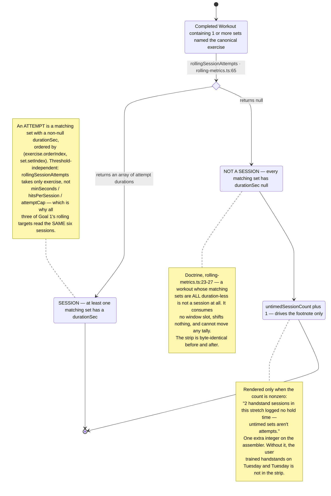
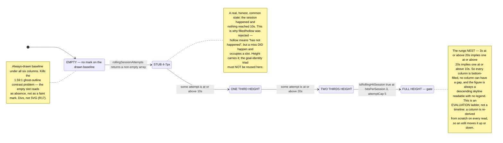

# `/progress` — complete overhaul

**Feature:** Rebuild `/progress` around four pillars — baseline improvements, Program progress, gamification, PR highlights.
**Slug:** `progress-overhaul` · **Date:** 2026-08-10 · **Profile:** `goaldmine` · **Scope:** research-first, no issue number.
**Ground truth:** `docs/ux-research/program-views.md` + ledger (binding) · `docs/ux-research/today-page-ia.md` + ledger (binding) · `src/app/globals.css` (tokens) · `src/lib/phase2a-spec.ts` (fixtures) · `src/lib/rolling-metrics.ts` (the novel metric).
**Pixel mockup:** [`progress-overhaul.html`](./progress-overhaul.html) — self-contained, real tokens, light/dark **and grayscale** toggles, 6 panels.
**Ledger:** [`progress-overhaul-ledger.md`](./progress-overhaul-ledger.md) — `UXR-PROG-NN`, stable, the implementing PR ticks it.

> Owner, 2026-08-10, verbatim: *"complete overhaul revamp… better visuals of baseline improvements, program (containing multiple goals) progress, increased gamification, PR highlights."*
>
> Every number in Panel 1 of the mockup is the **real** state of the database on Program day 1 — derived by running `src/lib/phase2a-spec.ts`'s fixtures through `progressFor` (`readiness.ts:101-130`), not sketched. Panel 2 is a projection and is marked as such on the frame, in the title, and in a banner. Nothing else in this report invents data.

---

## §0 · The reframe — read this first

**The one question the first 737px must answer: "Is the work landing?"**

Not *"how close am I"* — that is `/program`'s job. Not *"what happened this week"* — `/recap`. Not *"what have I accumulated"* — `/character`. Not *"what do I do now"* — Today. `/progress` is the only surface that can answer **is what I have been logging actually moving the measurements that matter**, and that question decomposes into exactly three parts, which are the whole page:

1. **Repeatability** — is the skill reliable yet? (the `rolling:*` family)
2. **Measured tests** — did the readings move, and which way? (baselines)
3. **Effort allocation** — where did my logged work actually go? (the one admissible game number)

Two corollaries fall straight out and they shape everything below.

**`/progress` carries essentially zero write affordances.** The shipped governing rule is *"read frequency drives vertical order; write frequency drives tap-count and thumb-zone placement — never trade one for the other"* (`today-page-ia.md:26`). On this page there is no write frequency to trade against, which collapses the IA problem to a single axis.

**`/progress` is where the app's honesty doctrine gets taught.** It is the only surface with the comprehension budget — roughly 15 seconds at a table, versus Today's ~2 seconds mid-workout — to spend a line of prose on *why* a number is what it is. Every framing line in this report (`Gates are mastery checks…`, `Retests are readings, not verdicts.`, `Effort, not outcome.`) exists because this page can afford it and no other page can.

### Three findings that reframed the brief

**F-A · The rolling tracker outranks the readiness score.** This is the surprising IA call and it is defensible on frequency. Readiness changes at session frequency but only through **43% of Goal 1's weight** (the three `rolling:*` targets, `w0.08 + 0.15 + 0.20`); the other 57% moves **twice** in twenty weeks, at retest weeks 10 and 19. And readiness is a *lagging composite*. The Seam Strip is simultaneously the **leading indicator** and the **highest-frequency element on the page**. Putting the composite first would be putting the slowest number in the fastest slot.

**F-B · All three of Goal 1's rolling targets read the *exact same six sessions*, and their thresholds strictly nest.** Verified against the engine rather than assumed: `rollingSessionAttempts(exercises, exercise)` (`rolling-metrics.ts:65-84`) takes **only** `exercise` — not `minSeconds`, not `hitsPerSession`, not `attemptCap`. Session membership is threshold-independent, and all three targets carry `exercise: "Freestanding Handstand Hold"` and `window: 6` (`phase2a-spec.ts:177, :190, :205`). Further, `3× ≥20s in ≤5 attempts` ⟹ `∃ attempt ≥20s` ⟹ `∃ attempt ≥10s`. **Consequence: this is not three rows. It is one strip of six sessions read against three depths** — every column is bottom-filled, no column can have a gap, and the figure is always a descending skyline readable with no legend. The "three near-identical rows" risk the brief worried about does not exist.

**F-C · 🔴 `/progress` currently renders every tenant's PRs to every user.** `src/lib/records.ts:5` imports the **raw `prisma` singleton**. `getExerciseSummaries()` (`records.ts:454-456`) and `getExerciseHistory()` (`records.ts:507-514`) call `prisma.workoutExercise.findMany({ include: { sets: true, workout: {...} } })` **with no `where` clause at all**, and `WorkoutExercise` is explicitly in the non-scoped list (`db.ts:32-34`). `src/lib/mcp/tools.ts:4759` still carries the comment `"single-user, acceptable for v1"` — that assumption died on `feature/phase1-auth`. This is a **launch blocker**, `/progress` is the surface it ships on (`RecordsSummary.tsx:24`), and it is independent of every design decision in this document. **Fix it first, on its own branch, before any of this.**

---

## §1 · Current-state audit

`src/app/progress/page.tsx` — 310 lines, server, `force-dynamic`. DOM order today: `h1 Progress` (no context) → a 64px **Share weekly recap** pill → `ProgramReadinessSection` → a legacy per-goal readiness loop → `MilestoneBurnDown` + MRR → Weight card → `BodyMetricsSection` → `RecordsSummary` → `Totals`.

| # | Problem | `file:line` | User impact |
|---|---|---|---|
| **A1** 🔴 | `getExerciseSummaries()` / `getExerciseHistory()` run on the **raw unscoped `prisma` singleton with no `where` clause** | `records.ts:5, :454-456, :507-514`; consumed at `RecordsSummary.tsx:24` and `baselines/page.tsx:13` | **Cross-tenant leak.** Every user's "Exercise PRs" card lists every other tenant's PRs. Also a full lifetime table scan with `include:{sets}`. |
| **A2** | `take: 180` with `orderBy: { date: "asc" }` returns the **oldest** 180 measurements | `page.tsx:32`, `:52` | A daily logger crosses 180 rows in ~6 months; from then on "Current" shows a half-year-old weight forever and Δ is silently wrong. The single most dishonest thing on a page whose promise is *honest logger*. |
| **A3** | The gate-legibility precedent is not applied here: a readiness pinned at 80 reads as a mysterious plateau | `page.tsx:200-216`; `ProgramReadinessSection.tsx:85-103`; `MemberGoalArc` at `progress-program.ts:40-61` doesn't even carry `rawScore`/`ceiling`/`gates` | `/program` renders `CeilingRule` + three-state gate copy (`MemberGoalCard.tsx:114-129`); `/progress` renders a bare `text-4xl 80/100` and the fragment `· 2 gates left`. The exact failure `readiness-copy.ts:9-10` says "has cost real interpretation time" is live on the most-visited analytics surface. |
| **A4** | Scroll is **⚠~4,000–5,000px** (≈6 screenfuls) with no anchors, no collapse, nothing deferred | 192px × N `ReadinessChart` + 160px × M `MetricWindowChart` + 192px `WeightChart` + 192px × K `HistoryChart` | Mid-page facts are unreachable. `<details>` is used on `/program` and `/compare` but nowhere here. |
| **A5** | `BodyMetricsSection` is unbounded and ungated — one full Card + 192px chart per distinct `BodyMetric.key` | `page.tsx:296`; `BodyMetricsSection.tsx:38-84` | A watch-syncing user adds ~1,250px of charts no goal references, wedged between Weight and Records. |
| **A6** | The bottom half is a truncated duplicate of `/baselines` — identical `StatusPill` row and Exercise-PR list, and **both surfaces independently issue the same two expensive queries** | `RecordsSummary.tsx:49-56, :118-164` vs `baselines/page.tsx:35-42, :91-129` | The user reads the same three rows twice inside one nav tab and learns neither is authoritative. |
| **A7** | Capped baseline values render as ordinary plateaus in **every** chart | `CappedMarker.tsx:5` (concedes it); flag dropped at `baselines/test/[testName]/page.tsx:48-52`; `/progress` shows none at all | A user who has maxed the 65 lb dumbbell sees a flat line and reads *"I've stalled"* — the opposite of the truth the flag encodes. |
| **A8** | Two different date formats for the same fact, ~24px apart, on the frozen card | `ProgramReadinessSection.tsx:142` (raw dateKey) vs `:166` (`fmtDateKey`) | Reads like a bug; undermines the completion moment the frozen card exists to deliver. |
| **A9** | Target dates use `new Date(iso).toLocaleDateString()` instead of the USER_TZ formatter defined 60 lines above | `page.tsx:205`; `ProgramReadinessSection.tsx:91`; `RecordsSummary.tsx:94, :145` | Off-by-one deadlines for every user west of UTC. |
| **A10** 🔴 | **`toLocaleDateString(undefined, …)` is called inside client components** | `ReadinessChart.tsx:42-45`; `WeightChart.tsx:18-21` | SSR resolves the locale/TZ against the **server** (UTC on Vercel), hydration against the **browser** → a text-content **hydration mismatch**. The repo retired its hydration exemption after #253, so this is now a real regression. `HistoryChart.tsx:28` already has the escape hatch; nobody uses it. |
| **A11** | Frozen arcs are the faintest marks on the page — 1px `--muted`, no fill, inside a full 192px frame with grid and both axes | `ReadinessChart.tsx:115-118` | The one genuine completion moment the product has renders quieter than the axis labels around it, and still costs a full-size chart. |
| **A12** | Both shared-metric target lines are visually identical and unattributed; the goal name reaches only the `aria-label` | `MetricWindowChart.tsx:102-115`; label passed at `ProgramReadinessSection.tsx:251-255` | On the two-goal case the section was built for, a sighted user sees two identical dashed rules with bare numbers. |
| **A13** | Achieved members silently vanish from the "Program window" metrics | `progress-program.ts:369` (`continue`), `:404` | A card captioned *"Program window · Feb 1 → Aug 9"* omits a goal that was in that program for most of the window. |
| **A14** | Information hierarchy is inverted: an **export CTA** is the first thing below the title, and section eyebrows (11px) are **smaller than the card titles they group** | `page.tsx:133-148`; `EYEBROW_CLASS` at `ProgramReadinessSection.tsx:48-49` vs `Card.tsx:23` | There is no visual spine — the page is a flat run of same-weight cards with a share button on top. The pill eats **13% of the fold**. |
| **A15** | Legacy (zero-Program) tenants pay the **unsampled, fully serial** `computeReadinessSeries` | `page.tsx:75` vs `readiness.ts:239-258`; the sampled sibling is used only by the Program path | ~156 serialized round-trips for a 3-year goal, × N goals. **The cheapest tenant gets the slowest page.** |
| **A16** | Serialization is **three levels deep**, not one | `computeReadiness` is itself a serial `for` over targets (`readiness.ts:172-183`) → the goal loop (`progress-program.ts:339`) → a third serial loop over metric rows (`:422-428`) | Goal 1's 9 targets = 9 serialized round-trips *per cursor*, × 26 cursors, × 3 goals. |
| **A17** | The `rolling:*` resolver runs **2 unbounded queries per rolling target per `computeReadiness` call** | `goal-targets.ts:168-197` — `workout.findMany` with **no `take`** | 6 unbounded scans per cursor for Goal 1, × 26 cursors, and they return only an aggregate integer. |
| **A18** | `getRotationOwnerGoal()` costs 4 queries in program mode and **runs twice per render**; `getActiveProgramMembership()` re-runs `program.findFirst` a third time | `page.tsx:28` and again at `records.ts:370`; `program.ts:98, :158` | ~9 program-resolution queries where 4 suffice (`UXR-TIA-45`). |
| **A19** | `getBaselineSummaries()` is an **N+1** — a `groupBy` then two `findFirst` per test | `records.ts:180, :186-189` | 19 queries for 9 tests. **This is the accessor for Pillar 1** and must be refactored before that pillar can ship. |
| **A20** | Recharts' 1500ms mount animation is **unguarded** on `WeightChart` and `HistoryChart` | `WeightChart.tsx:60-67`; `HistoryChart.tsx:73-80` (`ReadinessChart.tsx:119` and `MetricWindowChart.tsx:124` are guarded) | A reduced-motion user gets still readiness arcs beside animating weight and body-metric lines. `UXR-PV-94`. |
| **A21** | `loading.tsx`'s `animate-pulse` is unguarded and **infinite** under reduced motion | `progress/loading.tsx:7, :11, :21, :35, :49` | `UXR-PV-95`. Same defect is live in **7 other `loading.tsx` files**. |
| **A22** | Duplicate DOM id `readinessFill` once more than one readiness card renders | `ReadinessChart.tsx:71` | Invalid HTML today; a silent wrong-fill bug the instant any per-goal tint lands — a near-certain requirement of this overhaul. |
| **A23** | `loading.tsx` is ⚠[890–925px] in a **different order** than the page it precedes (recap pill at skeleton position 2, redesign position 17) and ⚠[1,030–1,260px] shorter | `progress/loading.tsx` | Arrival is a large reflow **plus a reorder**. |
| **A24** | A Program tenant with no rotation owner loses the Weight card with **no copy** | `progress-program.ts:148-155`; `goal-focus.ts:188` | A scheduling-only Program that tracks body weight in a member goal shows weight nowhere, and never says why. |
| **A25** | Helper-less metrics still cost a whole ~140px Card whose chart slot is a sentence apologising for itself | `progress-program.ts:289` returns `null` for `hike:*`, `workout:count`, `exercise:*`, `rolling:*`; rendered at `ProgramReadinessSection.tsx:268-270` | A hiking goal generates several cards of apology. |
| **A26** | `Totals` is fitness-only, lifetime-scoped, unanchored to any goal, and costs 3 `count()` queries for every tenant including project-only ones | `page.tsx:43-45, :301-307` | A project user scrolls ~5,000px to reach `Workouts 0 · Baselines 0 · Hikes 0`. |
| **A27** | `ReadinessBreakdown` supports `showGating`; `/program` passes it, `/progress` never does | `page.tsx:231`; `ProgramReadinessSection.tsx:113` vs `MemberGoalCard.tsx:204` | On the surface where the user reads the score, the breakdown gives no clue which row is holding it down. One boolean. |
| **A28** | Zero-row invited user's most concrete content is **`0 / 0 / 0`** | `page.tsx:301-307` | Contrast `/program`'s deliberate empty state (`program/page.tsx:106-131`). The first render is when a new user decides whether the tool is for them, and it opens with a judgment on someone who has done nothing wrong. |
| **A29** | **★ On day one the page ships a bare `0/100`** | `MemberGoalCard.tsx` suppresses only at `coverage.tested === 0` | Goal 1 has **two** tested targets on 2026-08-10 whose progress is legitimately 0 (`Freestanding Handstand Hold` current 10 == start 10 → `(10−10)/(20−10)` = 0; `Pull-Up Max Reps` `start === target` → `readiness.ts:125` returns 0). The suppression branch does not fire. The owner's first day looks like failure. |
| **A30** | Two readiness grammars coexist on one page | `ProgramReadinessSection`'s `LiveMemberCard` (`:53-125`) + the legacy inline loop (`page.tsx:169-242`); `/program`'s `MemberGoalCard` is a third | `LiveMemberCard` is a strictly *worse* `MemberGoalCard` — no `CeilingRule`, no `gateCopyState`, no `showGating` — and it prefixes all three titles with `Readiness:`. |

---

## §2 · Chosen direction — **"Frequency Stack, Ruled"**

**Take Direction C — the Frequency Stack** — a flat manifest ordered strictly by read frequency, almost everything a Tier-2 compact strip, exactly **one** Tier-1 Card in the 737px fold, and readiness trends drawn with the server-SVG `SeamLine` rather than Recharts so the page mounts **one** chart instead of four. C wins on the three things that decide this page. It is the **shortest** (⚠[1,650–1,800px] projected, before grafts, against A's ⚠[2,300–2,500px] and today's ⚠[4,000–5,000px]). It is the only direction that puts **all three member goals plus the whole Seam Strip above the fold on both dates**. And it is the only direction whose **zero-Program tenant loses nothing structural** — the stack simply gets shorter, with nothing orphaned and no section label pointing at emptiness. C's one real flaw is *prose homelessness*: a Tier-2 strip has no header to hang a framing line off, and §0 says this page is where the doctrine gets taught. Three grafts fix exactly that.

**Grafted from the runners-up:**

- **G1 — exactly TWO section rules, from A.** `ZoneDivider`-style hairlines carrying `REPEATABILITY` (before the Seam Strip) and `EFFORT` (before the Effort card), ⚠[20–28px] each. Gives the framing lines an attachment point, gives the anchor chips something to point at, and re-establishes the Tier-2/Tier-3 separation `UXR-TIA-60` threatens. **Two, not three** — a two-rule page that loses one rule still has a rule, so it does not inherit A's section-collapse failure on a zero-Program tenant.
- **G2 — promote Baselines from a Tier-3 lid at rank 9 to an OPEN Tier-1 Card, from A.** C shipping the literal Pillar-1 deliverable *closed* would read as the brief being ignored. Weight-desc sort plus the `BELOW FLOOR` pin make the card self-explaining without a banned data-dependent `defaultOpen`. Still below the fold, so the one-Tier-1-in-fold rule holds.
- **G3 — any second Recharts mount must have a per-goal owner, from B.** It lives inside the ● goal's context, never in a homeless tail card. B's one genuine advantage.

**Universal grafts adopted:** C's `t=` two-frame maintenance sequence (it teaches `HOLDING → BELOW FLOOR` in one glance; no other direction shows the transition) · A's `NEXT READINGS · S1 today · S2 Aug 12 · S3 Aug 13` strip (turns a dead day-1 baseline card into a live one for ⚠[64–80px], using `ScheduledCheckpoint` data nothing reads today) · C's zero-Program `▲cap` three-channel treatment.

**Not grafted, and why:** B's Program-name hero (the h1 stays `Progress`, so B spends 20px duplicating what already headlines `/program`) · A's three-section vocabulary (`log:study_hours` is neither a repetition nor a measurement — a project-only Program breaks A's section names) · B's goal-nested baselines (splits the six tests across three lids and duplicates the shared Pull-Up row).

### The binding rules — R1…R22

| # | Rule |
|---|---|
| **R1** | **The Seam Strip reads oldest-left, newest-right.** ⚑ SIGN-OFF — this contradicts the owner's "newest-first" sketch. Every other time axis on this page runs forward (`ReadinessChart`, `MetricWindowChart`, `WeightChart`, `SeamLine`); a backwards strip 100px from a forwards line chart produces a **directional misread** — improvement read as decline. Secondary: the about-to-roll-off session belongs in the "past" position, not the "latest" one, and left-shift-drop-off-the-left is the universal scrolling-window convention. |
| **R2** | **The Seam Strip is ONE 6-column time axis; the three nested thresholds are encoded as COLUMN HEIGHT** (a descending skyline), not as three rows of filled/hollow cells. Height resolves three problems at once: filled/hollow **collides** with the Marked Lane semantic (hollow `○` means *hasn't happened*, but a rolling miss **did** happen and occupies a slot); a hollow "no session" cell measures **1.59:1** against `--card`, below the 3:1 non-text threshold; and three separate 44px-circle strips cost ⚠[440–480px] where one strip block costs ⚠[78–110px]. |
| **R3** | **The threshold ("4 of 6") is TEXT ONLY. No geometric marker on the time axis.** ⚑ SIGN-OFF — contradicts the owner's "with the 4-of-6 bar marked." The x-axis is **time**; the threshold is a **count on a different axis**. A rule after slot 4 asserts *"the 4 most recent must be hits,"* which is **not** what `computeRollingHits` computes (`rolling-metrics.ts:142-153` counts hits *anywhere* in the trailing window). Same class of error as A12. |
| **R4** | **4-of-6 is a gradient in the math and a cliff in the meaning, so the primitive is a TALLY** — `3 of 6 · needs 4`. `progressFor` gives partial credit (`3/4 = 0.75 × w0.15`), so a status word alone would render 3 and 1 identically. A bar renders the gradient, loses the cliff, and would look identical to the eight other `h-1.5` bars on the page. The tally carries both in 14 characters with zero geometry. |
| **R5** | **Show the slot about to roll out — as an EXPLANATION, never a COUNTDOWN.** The value drops whether or not you show it; hiding it only prevents understanding, and an unexplained drop reads as *"the app took a point away."* **Structural gift: the roll-off is not time-based** — the oldest column leaves when the *next qualifying session* is logged, not on a date. **The anxiety framing is structurally unavailable.** Render a 1px `--muted` under-glyph bracket, `aria-hidden`, plus one calm sentence of real text; omit entirely while the window is not full. |
| **R6** | **No delta on the rolling tally. Never `(was 4)`.** Past states of a rolling window are not commensurable — the window itself moved. `was 4` invites *"get back to 4,"* a slot-machine goal, for zero information gain. |
| **R7** | **Exactly one game signal moves: attribute XP deltas scoped to the Program window ("Effort this Program"). Everything else stays on `/character`. And it is GATED** — it ships only in the same PR as the perf work. Confirmed by reading `engine.ts:988-1090`: the engine is **monolithic**; level, XP, streak, attributes and badges are all projections of one in-memory ledger built from a 10-query all-time fan-out. There is no cheaper subset. |
| **R8** | **R-GAME: no monotone number may share a viewport with a number that can regress, unless the monotone number is scoped to the same bounded window as the honest one.** **R-SPLIT: `/character` shows game STATE (levels, totals, badges, streaks — monotone, lifetime); `/progress` shows game DELTAS scoped to the Program window (bounded, resettable, can be zero). No number appears on both surfaces.** Checkable: is it a *total*? `/character`. Is it a *change over the Program window*? `/progress`. |
| **R9** | **The fold is 737px.** `UXR-TIA-53` **closed**: 844 (iPhone 12/13/14) − 49 (`AppHeader` `h-12` + border, `AppHeader.tsx:31-32`) − 58 (`BottomNav`, the conservative of the two measurements). **Risk asymmetry decides it** — taking 742 and being wrong clips an element; taking 737 and being wrong costs 5px of slack. ⚠ Still arithmetic, not measured. |
| **R10** | **Tier-1 Card cap in the fold is 1 on this page** — refines `UXR-TIA-58` (2–3) rather than contradicting it. `TIA-58` was measured on Today where a Tier-1 Card is ~180px; here a Tier-1 Card is **chart-bearing**, ~398px. Two is 796px against a 737px fold. |
| **R11** | **Every Tier-2 strip carries a `tabular-nums` `--foreground` numeral** — the cheap structural mitigation for `UXR-TIA-60`. Tier 2 has a numeral and no chevron; Tier 3 is `text-sm text-[var(--muted)]`, has a `▼`, and has a right-rail digest. **Carve-out (R25):** this applies *when a numeral exists*. A strip in a documented zero-state renders **no** number and satisfies the separation via the absence of a `▼` and the absence of a digest rail. Never invent a `0` to satisfy a layout rule. |
| **R12** | **No sticky in-page index. A non-sticky anchor-chip row under the hero that scrolls away**, `<a href="#…">` only, `scroll-margin-top: ⚠[60–70px]` on each target. `UXR-TIA-44`'s reason (thumb-zone competition with writes) does not transfer — this page has no writes — **but a different one does:** `AppHeader` is already `sticky top-0` at 49px, and a second sticky bar is 97px of permanent chrome out of 737px = 13%. ⚠ **Amended by the render: the chips must be 44px, not the ⚠[32–40px] first proposed** — the touch-target invariant wins. |
| **R13** | **Video-verified milestones read from `FootageMarker` with `highlight: true`. NEVER a notes regex. No new column.** A regex makes a UI badge depend on prose written by an LLM in claude.ai — the thesis says the UI *"surfaces that state… but never invents."* A new column is a migration for exactly one row. `FootageMarker` already has the shape (`kind:"video"`, `label`, `exerciseName`, `capturedAt`, `highlight`), `log_footage` can create rows with **zero schema change**, and nothing reads it today — so surfacing it pays down dead code. The card renders `null` when no row exists, so it cannot ship broken. |
| **R14** | **Capped applies to Baselines ONLY.** `Baseline.capped` exists (`schema.prisma:159`); there is **no capped flag on `Set`, `WorkoutExercise`, or exercise PRs.** A "65 lb DB ceiling" annotation on a PR has nowhere to come from. Do not infer a cap from a plateau. |
| **R15** | **The records feed is MIXED-KIND** (PRs + baseline results + hikes) over ⚠[14–21] days, default 21 — the only context in which the `recap-icons` vocabulary does real work. 7 days would duplicate `/recap`; 30 aligns with nothing; three weeks ≈ one training block. **Refined by R26.** |
| **R16** | **The Seam Strip is an `<ol>` with one `<li>` per slot plus an `sr-only` span** — a deliberate deviation from the house `role="img"` idiom, and the ledger says so. `progressbar` is wrong twice: `aria-valuenow=3 max=6` discards which sessions hit and when, **and** `progressbar` semantically implies *monotonic advance* — this metric's defining property is that it can go down. `role="img"` exists because Recharts emits hundreds of unlabelable SVG nodes; six divs have no such constraint. **The count and target must be real DOM text**, not an `aria-label` — findable, translatable, and structurally incapable of drifting out of sync with the pixels. ⚠ `aria-label` on `<li>` is not reliably announced across AT; use the `sr-only` span. |
| **R17** | **Divs, not SVG. No new primitive.** `CeilingRule` is divs by explicit sign-off (`UXR-PV-92`); `ReachMeter` renders 5 discrete segments as `<span>`s. `SeamLine` is SVG **only because** it draws an arbitrary polyline into a non-uniformly stretched box. Six fixed marks have no arbitrary path. **Do NOT use the `● ■ ▲` triad here** — it is the *goal-identity* vocabulary and these slots are *sessions within one goal's target*; reusing it collides with goal identity on a page rendering three goals. |
| **R18** | **Zero new keyframes. One new CSS line** (`motion-safe:scroll-smooth`). Three of the six adopted motion items are **defect repairs**. The one candidate strike moment — a rolling tracker crossing its target — is **rejected on meaning**, not budget: the value can un-cross tomorrow (§5 F5). |
| **R19** | **The page stays named `Progress`.** It is the `BottomNav` tab label; an h1 disagreeing with the tab you tapped is a wayfinding failure. The brand rule is explicit — the theme lives in visuals, never prose (`flavor_layer: false`). The codebase already proves the pattern: the sparkline is named `SeamLine`, a mining word, and renders zero user-facing text. Considered and rejected: `The Seam`, `Assay`, `The Vein`. **One rename that does earn it:** `RecordsSummary.tsx:66` renders `All baselines →` pointing at a page whose h1 is `Records` → change to **`All records →`**. |
| **R20** | **`UXR-TIA-74` is mooted** — the medallion does not move to `/progress`. The underlying ruling, for the record: **display serif is for numerals ≥20px that mark a moment.** |
| **R21** | **Recharts is capped at 2 mounts, both always-open, never inside a lid.** ⚠ Hazard: `ResponsiveContainer` inside a closed `<details>` measures **0×0**. In practice the chosen manifest lands on **one** (Body composition) — and **zero on day 1**. |
| **R22** | **`<Suspense>` and `"use cache"` are both locked out.** `UXR-PV-90` + `UXR-TIA-77` for Suspense. `"use cache"` carries the **identical `UXR-PV-55` hazard** as `unstable_cache`: the cache key derives from arguments while `_userScope` lives in `AsyncLocalStorage` (`db.ts:308`) and is **not** part of the key — a HIT would serve user A's readiness to user B, and `db:verify-isolation` would not catch it because the leak is in the app cache, not the query. **Consequence: bounding every scan is mandatory, not a nicety** — there is no streaming escape hatch, so one unbounded `findMany` sets the whole page's TTFB. |

### Rules the mockups added — R23…R27

| # | Rule |
|---|---|
| **R23** | **★ Add a fourth readiness zero-state branch: `coverage.tested > 0 && rawScore === 0`.** This is audit A29 and it fires on the owner's **first day**. Render the numeral — it *is* real — plus `2 of 9 targets have a reading; neither has moved off its start yet.` ~6 lines, zero queries. |
| **R24** | **The strip and the baseline will disagree, on purpose, for nine weeks — and explaining that is the most valuable thing this page can do.** By ~Sep 20 the Seam Strip legitimately shows three `≥20s` sessions while `baseline:Freestanding Handstand Hold` still reads 12 sec, because baselines are protocol-gated to retest weeks 10 and 19. One line on the Seam Strip card: **`Baselines re-test in weeks 10 and 19 — the strip moves in between.`** This is what lets G2 place baselines at rank 11 without the adjacency the insight would otherwise need. |
| **R25** | The R11 numeral carve-out (folded into R11 above). |
| **R26** | **Refines R15: render the glyph column only when `distinctKinds > 1`.** For this tenant the feed is **single-kind until Oct 12** (no hikes; no baseline results between S3 on Aug 13 and retest week 10), so `RecapGlyph` would do no work for nine weeks — the exact *"three trophies read as clip-art"* failure R15 exists to avoid. **And glyphs run at 24px minimum:** verified against the real path data at `recap-card.tsx:158-244`, `mountain` and `star` are single filled paths and safe at any size, `trophy` (7 elements, two 1.6px strokes) and `medal` (2.2px stroke) are usable at ≥20px, and **`ruler` is unusable below 24px** (4 hairlines at 1.4px plus a rotate transform). |
| **R27** | **The most interesting row in the database is invisible, and the fix is a launch-checklist item, not code.** The 2026-08-09 video-verified 10s freestanding hold reaches the page only as `10 sec` in a baseline row. The milestone card returns `null` because **zero `FootageMarker` rows exist.** One `log_footage` call with `highlight: true` is the whole fix — zero schema change. |

### The section manifest — literal source order, no runtime sort, stable string keys

| # | `key` | Tier | Renders when | Digest (lids) | ⚠ px |
|---|---|---|---|---|---|
| 1 | `hero` | 0 (light) | always | — | ⚠[60–72] — `h1 Progress` + `Program →` pill + one context line |
| 2 | `jump` | 4 | ≥5 sections present | — | **44** (⚠ amended from [32–40] by the touch-target invariant) |
| 3 | `program-band` | 2 | active Program | — | ⚠[68–84] |
| 4 | `rule-repeatability` | — | mirrors key 5 | — | ⚠[20–28] |
| 5 | `repeatability` ★ | **1** | primary goal has ≥1 `rolling:*` target | — | **⚠[380–440]** (⚠ **revised up** from [190–260] — see §9) |
| 6 | `goal-strips` ×N | 2 | ≥1 renderable goal | — | ⚠[68–92] each |
| 7 | `next-readings` | 2 | ≥1 upcoming/due `ScheduledCheckpoint` | — | ⚠[64–80] |
| 8 | `records` | 2 | always (the zero-state is honest) | — | ⚠[76–120] |
| 9 | `rule-effort` | — | mirrors key 10 | — | ⚠[20–28] |
| 10 | `effort` | **1** (gated) | Program **and** `computeGameState` is paid | — | ⚠[120–150] |
| 11 | `baselines` (G2) | **1** | `getBaselineSummaries().length > 0` | — | **⚠[280–320]** (⚠ **revised up** from [220–280]) |
| 12 | `body-composition` (G3) | **1** | primary goal has a `weightLb`/`bodyFatPct` target | — | ⚠[300–340] · **the page's only Recharts** · degrades to a Tier-2 strip at zero readings |
| 13 | `metrics` | 3 lid | `programData.metrics.length > 0` | `5 of 14 measured` | 56 closed |
| 14 | `body-metrics` | 3 lid | `bodyMetric` rows > 0 | `4 tracked · latest Aug 8` | 56 closed · ⚠ **must degrade to `SeamLine`, not `HistoryChart`** (R21: 0×0 inside a closed `<details>`) |
| 15 | `burn-down` / `mrr` | 1 | primary goal `kind === "project"` | — | ⚠[160–240] |
| 16 | `milestone` | 1 (conditional) | ≥1 `FootageMarker` with `highlight: true` | — | ⚠[130–165] |
| 17 | `recap-cta` | 4 | manifest is non-empty | — | ⚠[44–64] — **moved from position 2 to last** (fixes A14) |
| 18 | `empty` | 1 | manifest otherwise empty | — | ⚠[180–220] |

**Deleted:** the `Totals` card (A26 — and its three `count()` queries) and the top-of-page 64px Share-recap pill (A14).
**No `ZoneDivider` zone system and no ACT zone** — this page has zero write affordances, so importing Today's zone model would render a divider with nothing above it. The two G1 rules are *section labels*, not zone boundaries.
**Lid digests state the MEASURED count, not the row count** — `5 of 14 measured`, never `14 metrics`. Same honesty rule as *"a 0 that means unmeasured must never render as a 0."*

**Projected scroll — ⚠ arithmetic, not measured (`UXR-TIA-65` convention):** zero-row ⚠[380–450px] · zero-Program legacy ⚠[1,150–1,400px] · 3-member Program **⚠[2,100–2,400px]** (revised up from [1,950–2,150] by the two card-height corrections). Down from today's ⚠[4,000–5,000px] — **a ~50% reduction, not the ~60% first claimed.** Say the real number.

**Fold check at 737px, day 1, with the `jump` row included** (the first arithmetic omitted it — `UXR-PROG-03`): hero 70 → chips 44 → band 78 → rule 24 → Seam Strip (day-1 variant, no bracket, no footnote) ⚠[150–180] → ● strip 88 → ■ strip 88 → ▲ strip 88, with 16px gaps ⇒ the ▲ strip ends at ⚠[726–756px]. **The third goal strip is ~70–100% visible; on the pessimistic end it is clipped by ⚠[19–29px].** A partially visible strip is a legitimate scroll affordance, but it is not "all three clear the fold" — the honest claim is *"the Seam Strip and two of three goal strips clear the fold; the third is the scroll cue."*

---

## §3 · Phase-A options considered

<details>
<summary><b>Expand — three competing information architectures at 390px, and why the graft won</b></summary>

Three genuinely competing IAs were drawn, each twice (honest day-1 truth + a labelled projection) plus a zero-Program panel. **A · Question-Led** organises the page into three named sections answering the three questions of §0, with goals as a detail inside sections. **B · Program-Container** makes the Program a Tier-0 hero and nests everything under member goals, mirroring `/program`'s mental model. **C · Frequency Stack** has no sections at all — a flat, ruthlessly read-frequency-ordered stack of mostly Tier-2 strips.

| | **A · Question-Led** | **B · Program-Container** | **C · Frequency Stack** |
|---|---|---|---|
| **Optimizes for** | One reading path for "is the work landing?" Sections *are* the reframe made visible; the doctrine has three named places to live. | Per-goal synthesis. "How is AWS doing?" is answerable without reassembling marks. | Scroll economy + the legacy tenant. Minimum chrome. |
| **Projected scroll, 3-member Program** ⚠ arithmetic | ⚠[2,300–2,500px] — the tallest. Sections resist lids (a section that closes becomes B). | ⚠[1,950–2,150px] — nesting gives 6 natural lid boundaries. | **⚠[1,650–1,800px]** — shortest by ~30% vs A. |
| **Above the 737px fold** | hero roster (3 readiness numerals) + Seam Strip + 1 Tier-2. Fold lands on the Baselines header. | hero + band + chips + all of ● goal 1 + the ■ header. **Goals 2 & 3 essentially below.** Projected: card 1 alone is 644px → the fold falls *inside* it. | Program strip + Seam Strip + **all three** readiness strips. |
| **Zero-Program tenant** | **Degrades worst.** Repeatability empties (no `rolling:*`), Effort nulls → three sections collapse to one. A lone section rule is decoration. | **Degrades to today's page.** The Program hero *is* B's thesis; without it there is no container, no chips, no grouping. | **Degrades best.** Two strips drop out and the stack shortens. Nothing orphaned. |
| **Tier-1 count (fold / total)** | 1 / 5 | 1 / 5 — but the ● card is **644px**, 87% of the fold | **1 / 4** |
| **Recharts mounts** | 2 (a tail "Program readiness arc" belonging to no section) | 2 — B is the only direction where the arc has a legitimate owner | **1** (Body composition only). **Day 1: 0 in all three.** |
| **Where the honesty prose lives** | **Best.** Three section rules give the framing lines a natural home. | Good per-goal, bad cross-goal. | **Worst.** A Tier-2 strip has no header to hang a framing line off. |
| **Fate of the Pillar-1 payload** | Own section, always open. | Per-goal lid ×3 — six tests split across three lids; the shared Pull-Up appears twice. | One Tier-3 lid at rank 9. **The literal Pillar-1 deliverable ships closed.** |
| **★ Biggest thing it gets wrong** | **Readiness fits no section.** It is a per-goal composite orthogonal to Repeatability/Measurements/Effort, so A exiles it to the hero and strands the readiness chart in a homeless tail card. And the section names are **fitness-shaped** — a project-only Program breaks A's vocabulary. | **It re-answers `/program`'s question.** §0 says *not* "how close am I" — B's every card leads with a `/100`. It also inverts F-A: the lagging composite sits **above** the leading indicator inside the same card, and it makes the `MemberGoalCard` ≈ `MemberGoalProgressCard` duplication structural rather than accidental. | **It has no teaching surface.** A stack of 9 strips is a readout, not an argument. Secondary: with no sections, `UXR-TIA-60` is load-bearing rather than mitigated. |

**Why C won, and what it had to borrow.** C's biggest failure — no teaching surface — is the *cheapest of the three to fix*, because prose needs a rule and a rule costs 24px. A's failure (readiness fits no section) and B's failure (it answers the wrong question) are both structural and cannot be bought off. So the graft is C plus the minimum of A that restores prose: **two** rules, and Baselines promoted out of its lid. G1+G2+G3 cost ~310px and C is still the shortest direction by a wide margin.

---

### The chosen direction, drawn — Direction C with the grafts applied

### C-1 · DAY-1 TRUTH

```
│════════════════════ 390px ═══════════════════════════│   cum px
│  Progress                            [ Program → ]   │      46
│  Phase 2A · Block 0 · day 1 of 144                   │      66
│                                                      │
│ ┌┈┈┈┈┈┈┈┈┈┈┈┈┈┈┈┈┈┈┈┈┈┈┈┈┈┈┈┈┈┈┈┈┈┈┈┈┈┈┈┈┈┈┈┈┈┈┐   │      82
│ ┊ BLOCK 0                                       ┊   │  [1] read freq: daily, by one
│ ┊ █████ ▒▒▒▒▒▒▒▒▒▒▒▒▒▒▒▒▒ ▒▒▒▒▒▒▒▒▒▒▒▒▒ ▒▒▒▒▒  ┊   │
│ ┊ Recovery + Baselines + DEXA Prep · week 1    1 ┊   │  R-11 numeral: the day number
│ └┈┈┈┈┈┈┈┈┈┈┈┈┈┈┈┈┈┈┈┈┈┈┈┈┈┈┈┈┈┈┈┈┈┈┈┈┈┈┈┈┈┈┈┈┈┈┘   │     160
│                                                      │
│ ┌────────────────────────────────────────────────┐   │     176
│ │ Handstand repeatability                        │   │  [2] ★ the ONLY Tier-1 in the fold
│ │ Six most recent timed handstand sessions.      │   │      — and it OUTRANKS readiness
│ │                                                │   │      (§9(a): leading vs lagging)
│ │  ═════ ═════ ═════ ═════ ═════ ═════           │   │
│ │  ★ No timed handstand session logged yet.      │   │
│ │  ≥10s hold                    — of 6 · needs 4 │   │
│ │  ≥20s hold                    — of 6 · needs 4 │   │
│ │ ⌈GATE⌉ 3× ≥20s in one session — of 6 · needs 1 │   │
│ │ Gates are mastery checks — the score waits for │   │
│ │ them, it doesn't lose points.                  │   │
│ └────────────────────────────────────────────────┘   │     426
│                                                      │
│ ┌┈┈┈┈┈┈┈┈┈┈┈┈┈┈┈┈┈┈┈┈┈┈┈┈┈┈┈┈┈┈┈┈┈┈┈┈┈┈┈┈┈┈┈┈┈┈┐   │     442
│ ┊ ●  Handstand — Phase 2A                      0┊   │  [3] Tier-2 readiness strip
│ ┊ ░░░░░░░░░░░░░░░░░░░░░│░░░░░░░░░░░░░░░  /100  ┊   │      CeilingRule inline
│ ┊ 2 gates to clear before this can pass 80.     ┊   │      trend = SeamLine (0 pts→null
│ ┊ 2 of 9 targets have a reading; neither moved. ┊   │      → text hint, never an empty
│ └┈┈┈┈┈┈┈┈┈┈┈┈┈┈┈┈┈┈┈┈┈┈┈┈┈┈┈┈┈┈┈┈┈┈┈┈┈┈┈┈┈┈┈┈┈┈┘   │     526      frame)
│ ┌┈┈┈┈┈┈┈┈┈┈┈┈┈┈┈┈┈┈┈┈┈┈┈┈┈┈┈┈┈┈┈┈┈┈┈┈┈┈┈┈┈┈┈┈┈┈┐   │
│ ┊ ■  Reach 10% body fat                        0┊   │  [4]
│ ┊ ░░░░░░░░░░░░░░░░░░░░░░░░░░░░░░░░░░░░░  /100  ┊   │      no stile — ceiling is 100
│ ┊ 1 of 3 targets has a reading.                 ┊   │
│ └┈┈┈┈┈┈┈┈┈┈┈┈┈┈┈┈┈┈┈┈┈┈┈┈┈┈┈┈┈┈┈┈┈┈┈┈┈┈┈┈┈┈┈┈┈┈┘   │     618
│ ┌┈┈┈┈┈┈┈┈┈┈┈┈┈┈┈┈┈┈┈┈┈┈┈┈┈┈┈┈┈┈┈┈┈┈┈┈┈┈┈┈┈┈┈┈┈┈┐   │
│ ┊ ▲  Pass the AWS SAA exam                      ┊   │  [5]
│ ┊ Not measured yet — 0 of 3 targets have a      ┊   │      no numeral (shipped branch)
│ ┊ reading. Log the first one and this moves.    ┊   │
│ └┈┈┈┈┈┈┈┈┈┈┈┈┈┈┈┈┈┈┈┈┈┈┈┈┈┈┈┈┈┈┈┈┈┈┈┈┈┈┈┈┈┈┈┈┈┈┘   │     710
│ ─ ─ ─ ─ ─ FOLD (737px, arithmetic not measured) ─ ─ ─│  ← 737  ★ all three goals + the
│                                                      │           strip fit above it
│ ┌┈ NEXT READINGS ┈ S1 today · S2 Aug12 · S3 Aug13 3┈┐│  [6]
│ ┌┈ RECENT RECORDS ┈ none in the last 21 days      0┈┐│  [7] ⚠ R-11 numeral vs "a 0 that
│ ┌ Effort this Program ─ EmptyState ───────────────┐  │  [8]     means unmeasured" — here
│ ┌┈ BODY COMPOSITION ┈ no reading yet             ┈┐  │  [9]     0 IS the true count ✓
│ ┌ Baseline tests ▼  2 of 9 tested · 1 below floor ┐  │  [10] Tier-3 lid, ranks 8th
                                            ≈ 1,180px
```

### C-2 · PROJECTED — mid Block 1, ~Sep 20 *(illustrative; not real data)*

```
│════ 390px ═══ ⚠ PROJECTED STATE — NOT REAL DATA ═════│   cum px
│  Progress                            [ Program → ]   │      46
│  Phase 2A · Block 1 · day 42 of 144                  │      66
│ ┌┈ BLOCK 1 ┈ █████ █████████████████ ▒▒▒▒▒ ▒▒▒▒ ┈┐  │      82
│ ┊ Skill Acquisition + Moderate Deficit · week 6 42┊  │     160
│ └┈┈┈┈┈┈┈┈┈┈┈┈┈┈┈┈┈┈┈┈┈┈┈┈┈┈┈┈┈┈┈┈┈┈┈┈┈┈┈┈┈┈┈┈┈┈┘   │
│ ┌────────────────────────────────────────────────┐   │     176
│ │ Handstand repeatability                        │   │
│ │                       ████  ████  ████         │   │
│ │  ████        ████     ████  ████  ████         │   │
│ │  ████  ▁▁▁▁  ████     ████  ████  ████         │   │
│ │  ═════ ═════ ═════ ═════ ═════ ═════           │   │
│ │  Aug26 Sep 1 Sep 5 Sep 9 Sep14 Sep18           │   │
│ │  └──┬──┘ Aug 26 is the oldest in the window.   │   │
│ │       It leaves when the next timed session    │   │
│ │       is logged.                               │   │
│ │  ≥10s        ★ 5 of 6 · HOLDING                │   │
│ │  ≥20s          3 of 6 · needs 4                │   │
│ │ ⌈GATE⌉ 3× ≥20s 0 of 6 · needs 1                │   │
│ │ 2 handstand sessions in this stretch logged no │   │
│ │ hold time — untimed sets aren't attempts.      │   │
│ └────────────────────────────────────────────────┘   │     456
│ ┌┈ ●  Handstand — Phase 2A               ▂▃▄▅  22┈┐  │  SeamLine 96×20 server SVG,
│ ┊  ██████░░░░░░░░░░░░░░│░░░░░░░░░░░  /100        ┊  │  stroke --muted 1.5px, NO Recharts
│ ┊  2 gates to clear before this can pass 80.     ┊  │     548
│ └┈┈┈┈┈┈┈┈┈┈┈┈┈┈┈┈┈┈┈┈┈┈┈┈┈┈┈┈┈┈┈┈┈┈┈┈┈┈┈┈┈┈┈┈┈┈┘   │
│ ┌┈ ■  Reach 10% body fat                 ▅▄▃▂  16┈┐  │
│ ┊  ████░░░░░░░░░░░░░░░░░░░░░░░░░░░░░  /100       ┊  │
│ ┊  Measured 29 · 16 counting body fat as 0.      ┊  │     648
│ └┈┈┈┈┈┈┈┈┈┈┈┈┈┈┈┈┈┈┈┈┈┈┈┈┈┈┈┈┈┈┈┈┈┈┈┈┈┈┈┈┈┈┈┈┈┈┘   │
│ ┌┈ ▲  Pass the AWS SAA exam              ▂▃▄▄  22┈┐  │
│ ┊  ██████░░░░░░░░░░░░░│░░░░░░░░░░░  /100         ┊  │
│ ┊  Measured 29 · 22. Practice exam #1 is Oct 18. ┊  │     740
│ ─ ─ ─ ─ ─ FOLD (737px) ─ ─ ─ 3px into strip [5] ─ ─ ─│  ← 737
│ └┈┈┈┈┈┈┈┈┈┈┈┈┈┈┈┈┈┈┈┈┈┈┈┈┈┈┈┈┈┈┈┈┈┈┈┈┈┈┈┈┈┈┈┈┈┈┘   │
│ ┌┈ RECENT RECORDS · 21 DAYS ┈┈┈┈┈┈┈┈┈┈┈┈┈┈┈┈┈┈┈┈┐   │  [6] ⚠ glyph column DROPPED —
│ ┊  Wall handstand push-up       1 → 2 reps Sep 9 ┊   │      all 3 rows are the same
│ ┊  L-sit (parallettes)        30 → 38 sec Sep 12 ┊   │      kind, so recap-icons would
│ ┊  Freestanding handstand    18 → 22 sec Sep 18 3┊   │      be pure decoration. See §F-4
│ ┊  ⌈NEW⌉                                         ┊   │
│ └┈┈┈┈┈┈┈┈┈┈┈┈┈┈┈┈┈┈┈┈┈┈┈┈┈┈┈┈┈┈┈┈┈┈┈┈┈┈┈┈┈┈┈┈┈┈┘   │
│ ┌ Effort this Program ───────────────────────────┐   │  [7] Tier-1 #2, BELOW the fold
│ │ Strength     ████████████████████   1,240 XP   │   │      → R-10 satisfied
│ │ Mobility     ██████████████           880 XP   │   │
│ │ Conditioning ███████                  420 XP   │   │
│ │ Endurance    █████                    310 XP   │   │
│ │ Effort, not outcome.                           │   │
│ └────────────────────────────────────────────────┘   │
│ ┌ Body composition ──────────────────────────────┐   │  [8] the ONLY Recharts on the page
│ │ 150.2 lb Sep 19 · ▁▂▃▃▄▄▅▅▆▆▇ (h-48)           │   │
│ │ Body fat 16.4% Sep 3 DEXA · logged but not     │   │
│ │ scored yet — it counts as 0 at weight 45.      │   │
│ └────────────────────────────────────────────────┘   │
│ ┌ Baseline tests ▼  9 of 9 · Pull-up below floor ┐   │  [9] Tier-3 lid — ★ C hides the
│ └────────────────────────────────────────────────┘   │      literal Pillar-1 payload
│ ┌ First video-verified freestanding hold ─ 10 s ─┐   │  [10] conditional; null today
                              projected total ≈ 1,720px  ⚠ arithmetic
```

**Inside C's baseline lid (opened) — the maintenance case shown as a `t=` sequence:**

```
   t = Aug 13 (S3 re-log)              t = Sep 14 (deficit week)
 ┌┈┈┈┈┈┈┈┈┈┈┈┈┈┈┈┈┈┈┈┈┈┈┈┈┐        ┌┈┈┈┈┈┈┈┈┈┈┈┈┈┈┈┈┈┈┈┈┈┈┈┈┐
 ┊ HOLDING 25             ┊        ┊ BELOW FLOOR · 23       ┊  eyebrow --success → --warning
 ┊ Pull-up max            ┊        ┊ Pull-up max            ┊  copy stays --foreground (the
 ┊ 25 reps · Aug 13       ┊        ┊ 23 reps · Sep 14 ·     ┊  4.6:1 AA edge rule)
 ┊ floor 25               ┊        ┊ 25 reps on Aug 13      ┊
 ┊ SHARED BY 2 GOALS ● ■  ┊        ┊ ┃ tested at the end of ┊  Baseline.notes rendered ONLY
 ┊                        ┊        ┊ ┃ a deficit week, 3rd  ┊  on a negative delta
 └┈┈┈┈┈┈┈┈┈┈┈┈┈┈┈┈┈┈┈┈┈┈┈┈┘        ┊ ┃ in the order        ┊  NO bar, ever — cliff metric
                                    └┈┈┈┈┈┈┈┈┈┈┈┈┈┈┈┈┈┈┈┈┈┈┈┈┘  NO arrow, NO red, NO ↓
```

### C-3 · ZERO-PROGRAM DEGRADATION — C's best panel

```
│  Progress                                            │
│  Deadlift 405 lb · target Mar 1, 2027                │
│  ✗ block strip [1] → not rendered (no Program)       │  the stack just gets SHORTER
│  ✗ Seam Strip [2] → not rendered (no rolling:*)      │  — nothing structural is lost,
│                                                      │    nothing is orphaned, no rule
│ ┌┈ ●  Deadlift 405 lb                    ▂▃▄▅  41┈┐  │    label points at emptiness
│ ┊  ███████████░░░░░░░░░░░░░░░░░░░░░░░  /100      ┊  │
│ ┊  All gates cleared.                            ┊  │  gateCopyState "clear", --success
│ └┈┈┈┈┈┈┈┈┈┈┈┈┈┈┈┈┈┈┈┈┈┈┈┈┈┈┈┈┈┈┈┈┈┈┈┈┈┈┈┈┈┈┈┈┈┈┘   │
│ ┌┈ RECENT RECORDS · 21 DAYS ┈┈┈┈┈┈┈┈┈┈┈┈┈┈┈┈┈┈┈┈┐   │
│ ┊  🏆 Deadlift        365 → 375 lb  Aug 2      2 ┊   │  ★ HERE the mixed-kind glyph
│ ┊  🏔 Mission Peak    2,517 ft · 6.4 mi  Jul 30  ┊   │    column earns its keep — kinds
│ └┈┈┈┈┈┈┈┈┈┈┈┈┈┈┈┈┈┈┈┈┈┈┈┈┈┈┈┈┈┈┈┈┈┈┈┈┈┈┈┈┈┈┈┈┈┈┘   │    actually interleave
│  ✗ Effort card → null (R-7: no Program window)       │
│ ┌ Baseline tests ▼  6 of 8 tested · 1 capped     ┐   │
│ │  Goblet squat 5RM     65 lb ▲cap    Jul 28     │   │  ▲cap, three channels:
│ │  ▁▁▂▂▃▃▄▄▄▄▄▄▄▄  ──────────── cap 65 lb        │   │  (1) CappedMarker text
│ │  Flat on a drawn ceiling reads pinned, not     │   │  (2) SeamLine rule?: number
│ │  stalled. Never inside a MarkLane.             │   │  (3) Recharts ReferenceLine y=cap
│ └────────────────────────────────────────────────┘   │      + flat-topped 6×2px dot
│                                                      │      (fixes audit P6 at last)
│  ZERO-ROW INVITED USER (all three directions same):  │
│ ┌ Nothing measured yet ──────────────────────────┐   │  EmptyState — fixes P17.
│ │  Ask your coach in Claude to add a goal with   │   │  Totals 0/0/0 DELETED (P19).
│ │  targets. This page fills in as you log.       │   │  Never an alarmed tone.
│ └────────────────────────────────────────────────┘   │
```


</details>

---

## §4 · Phase-B technical artifacts

Four diagram families, each answering an open question. Every node label uses real identifiers.

### 4.1 The render manifest and its conditional branches

```mermaid
flowchart TD
  REQ["GET /progress — export const dynamic = force-dynamic"]
  RES["getRotationOwnerGoal · goal-focus.ts:162<br/>getProgressProgramData · progress-program.ts:297"]
  SH{"tenant shape"}
  REQ --> RES
  RES --> SH
  SH -->|"no active Goal rows"| TZ["Z · ZERO-ROW invited user"]
  SH -->|"active Goals · programData is null"| TL["L · LEGACY zero-Program"]
  SH -->|"getActiveProgramMembership resolves"| TP["P · ACTIVE PROGRAM"]

  TZ --> K1
  TL --> K1
  TP --> K1

  subgraph FOLD["ABOVE THE 737px FOLD (R9) — measured for the P shape on day 1"]
    K1["1 hero — always — h1 Progress plus Program pill [ZLP]"]
    K2{{"2 jump — 5 or more sections — non-sticky anchor chips, 44px (R12) [-LP]"}}
    K3{{"3 program-band — active Program — ProgramBlockBand [--P]"}}
    K4{{"4 rule-repeatability — mirrors key 5 — G1 hairline [-LP]"}}
    K5{{"5 repeatability — primary goal has 1 or more rolling targets — the SEAM STRIP, Tier 1 [-LP]"}}
    K6{{"6 goal-strips xN — 1 or more renderable goals — CeilingRule plus gateCopyState per strip [-LP]"}}
  end

  subgraph BELOW["BELOW THE FOLD"]
    K7(["7 next-readings — SELF-NULLS when no upcoming or due ScheduledCheckpoint [-LP]"])
    K8["8 records — always, the zero-state is honest — mixed-kind feed (R15, R26) [ZLP]"]
    K9{{"9 rule-effort — mirrors key 10 — G1 hairline [--P]"}}
    K10{{"10 effort — Program AND computeGameState is paid — gated by sign-off, plus 10 queries [--P]"}}
    K11{{"11 baselines — getBaselineSummaries is non-empty — OverflowList, weight-desc sort (G2) [-LP]"}}
    K12{{"12 body-composition — primary goal has a weightLb or bodyFatPct target — the ONLY Recharts (G3) [-LP]"}}
    K13(["13 metrics lid — SELF-NULLS when programData.metrics is empty — digest 5 of 14 measured [--P]"])
    K14(["14 body-metrics lid — SELF-NULLS when no BodyMetric rows — must degrade to SeamLine, not HistoryChart [-LP]"])
    K15{{"15 burn-down and mrr — primary goal kind is project — HistoryChart [-LP]"}}
    K16(["16 milestone — SELF-NULLS when no FootageMarker has highlight true (R13, R27) [-LP]"])
    K17{{"17 recap-cta — manifest is non-empty — moved from position 2 to last, fixes A14 [-LP]"}}
    K18{{"18 empty — keys 3 to 16 all absent — EmptyState, UXR-PV-81 [Z--]"}}
  end

  K1 --> K2 --> K3 --> K4 --> K5 --> K6 --> K7 --> K8 --> K9
  K9 --> K10 --> K11 --> K12 --> K13 --> K14 --> K15 --> K16 --> K17 --> K18
```



**Node-shape legend:** `rectangle` = always renders · `stadium` = the component self-nulls from its own data (no heading, no divider, no gap emitted) · `hexagon` = `page.tsx` wraps it in a condition, because the predicate also drives another key, the `jump` count, or a query the page must decide whether to issue. **Tenant mask** `[ZLP]` = ZERO-ROW / LEGACY / PROGRAM; `-` means the key does not render for that shape.

**Question it answers:** *which emptiness is the page's problem and which is the component's?* A hexagon costs a branch in `page.tsx` (and sometimes a query); a stadium costs nothing and cannot ship broken. Drawing it also caught two things the manifest table hides: **key 17 originally read "always"**, which would have put the export CTA *above* the coach pointer for the zero-row invited user — reproducing A14's inversion in miniature (fixed above by giving it a non-empty predicate); and **the fold arithmetic omitted key 2** (`UXR-PROG-03`, corrected in §2).

### 4.2 The three tenant shapes, traced end to end

```mermaid
flowchart TD
  subgraph SZ["Z · ZERO-ROW invited — projected 380-450px"]
    z1["1 hero"]
    z8["8 records — zero-state, no numeral (R11 carve-out)"]
    z18["18 empty"]
    zx["OMITTED — 2 jump (only 3 sections) · 3 to 7 · 9 to 17"]
    z1 --> z8 --> z18
    z18 -.-> zx
  end

  subgraph SL["L · LEGACY zero-Program — projected 1150-1400px"]
    l1["1 hero"]
    l2["2 jump"]
    l4["4 rule REPEATABILITY"]
    l5["5 repeatability — Seam Strip"]
    l6["6 goal-strips x1"]
    l7["7 next-readings"]
    l8["8 records"]
    l11["11 baselines"]
    l12["12 body-composition"]
    l14["14 body-metrics lid"]
    l17["17 recap-cta"]
    lx["OMITTED — 3 program-band · 9 and 10 effort (R-SPLIT) · 13 metrics · 16 milestone · 18 empty"]
    l1 --> l2 --> l4 --> l5 --> l6 --> l7 --> l8 --> l11 --> l12 --> l14 --> l17
    l17 -.-> lx
  end

  subgraph SP["P · ACTIVE PROGRAM, 3 members — projected 2100-2400px"]
    p1["1 hero"]
    p2["2 jump"]
    p3["3 program-band"]
    p4["4 rule REPEATABILITY"]
    p5["5 repeatability — Seam Strip"]
    p6["6 goal-strips x3 — dot, square, triangle"]
    p7["7 next-readings — S1 today, S2 Aug 12, S3 Aug 13"]
    p8["8 records"]
    p9["9 rule EFFORT"]
    p10["10 effort"]
    p11["11 baselines"]
    p12["12 body-composition"]
    p13["13 metrics lid"]
    p17["17 recap-cta"]
    px["OMITTED — 14 body-metrics (no rows) · 15 burn-down (primary is fitness) · 16 milestone (R27) · 18 empty"]
    p1 --> p2 --> p3 --> p4 --> p5 --> p6 --> p7 --> p8 --> p9 --> p10 --> p11 --> p12 --> p13 --> p17
    p17 -.-> px
  end
```



**Question it answers:** *does the zero-Program tenant lose anything structural?* — the direction's central claim. The L column is the P column with contiguous keys removed and **no orphaned label, no divider pointing at nothing, and no re-ordering**: `rule-effort` (9) leaves with `effort` (10) precisely because G1 shipped *two* rules rather than three. It also shows that on day 1 the P column's key 16 is absent purely because nobody has run `log_footage` — R27's launch-checklist item is the difference between the page's most interesting row being visible and being invisible, and it is not code.

### 4.3 The Seam Strip — the ingest gate



**Question it answers:** *why isn't Tuesday in my strip?* — the support-ticket-shaped hole. The strip is the only surface where a user can notice a session missing, and the gate that removes it is a pure-function branch three files away from the pixels. The footnote is not decorative copy; it is the **only** rendering of an otherwise silent data path.

### 4.4 The Seam Strip — the window and the tally

```mermaid
stateDiagram-v2
    direction TB

    state "NeverAttempted — rollingWindowSlots value is null" as NA
    state "WindowFilling — slots.length is under window 6" as WFILL
    state fill6 <<choice>>
    state "Below — N of 6 · needs 4" as TBELOW
    state "Holding — N of 6 · HOLDING" as THOLD
    state "GateOpen — 0 of 6 · needs 1" as GOPEN
    state "GateClear — 1 of 6 · GATE CLEAR" as GCLEAR

    [*] --> NA
    NA --> WFILL : the first SESSION arrives, even a stub session
    WFILL --> WFILL : SESSION 2 through 5
    WFILL --> fill6 : the 6th SESSION fills the window
    fill6 --> TBELOW : threshold tier · hits under 4
    fill6 --> THOLD : threshold tier · hits at or above 4
    fill6 --> GOPEN : gate tier · hits equal 0
    fill6 --> GCLEAR : gate tier · hits at or above 1

    TBELOW --> THOLD : ROLL-OUT — an entering hit lifts the tally
    THOLD --> TBELOW : ROLL-OUT — a DEPARTING hit drops the tally by 1
    GOPEN --> GCLEAR : ROLL-OUT — a triple20 session enters · ceiling lifts to 100
    GCLEAR --> GOPEN : ROLL-OUT — the last triple20 leaves · ceiling returns to 80
    TBELOW --> TBELOW : ROLL-OUT — tally unchanged
    THOLD --> THOLD : ROLL-OUT — tally unchanged

    note right of NA
      computeRollingHits returns null at zero sessions
      (rolling-metrics.ts:146). All three tiers read "— of 6",
      NEVER "0 of 6". Every "needs N" label still renders on
      day 1 — the CeilingRule trick of teaching the rule while
      it is still free. A stub session is what legitimately
      turns a dash into a zero.
    end note

    note right of WFILL
      UXR-TIA-49. Copy is "N of {slots.length} so far", never
      "N of 6". Two distinct causes, identical copy:
      (a) genuinely sparse — fewer than 6 sessions exist;
      (b) rows.length equals ROLLING_SCAN_TAKE 200 so the window
          is PROVABLY incomplete — a bug, not a fact.
      Only (b) is fixed by raising the bound. You cannot use
      take equal to window: an untimed workout is not a session,
      so the required row depth is unknown.
    end note

    note left of THOLD
      ROLL-OUT is the whole design. computeRollingHits slices
      at rolling-metrics.ts:149; the extractor breaks at :175.
      The oldest column leaves when THE NEXT SESSION IS LOGGED —
      never on a date, never on a timer. R5: because there is no
      clock, the anxiety framing is structurally unavailable.
      R6: never render "was 4".
    end note

    note left of GCLEAR
      Gate tier is target 1, a pure cliff, so it takes the shipped
      cliff vocabulary — GATE CLEAR in success, needs 1 in muted.
      No padlock, no danger token, never "blocked". Distinguished
      from the threshold tiers by the GATE border chip and by
      position, not by hue. GCLEAR to GOPEN also re-opens the
      readiness ceiling at 80 via gateCopyState.
    end note
```



**Question it answers:** *what does the tally say before the window is full, and what exactly is the event that makes the number go down?* — the two questions that decide whether the strip reads as a mirror or as the app taking a point away. Three things become checkable at review: `— of 6` and `N of {slots.length} so far` are **different states**, not one empty state; every downward edge carries the same trigger (a new session) and none carries a date; and the gate tier is wired to `gateCopyState`, which is the A3 fix arriving for free.

### 4.5 The Seam Strip — the per-column tier ladder



**Question it answers:** *can column height carry three thresholds without a key?* R2 asserts yes and this is the proof obligation. Because each rung's predicate strictly implies the one below it, height is a **total order**, not a categorical encoding — which is exactly what lets it survive the iso-luminant constraint and the grayscale acceptance test with no hue at all. It also pins the one thing the strip provably cannot show — the `attemptCap: 5` qualifying span — which is why the `BottomSheet` drill-in exists rather than being optional polish.

### 4.6 The server render round-trip under the As-Of Snapshot Table

```mermaid
sequenceDiagram
    autonumber
    participant B as Browser
    participant P as app/progress/page.tsx (RSC)
    participant A as getCurrentUserId plus getDb
    participant T as buildAsOfTable · progress-asof.ts (NEW)
    participant E as PURE eval · computeReadiness plus rollingWindowSlots
    participant N as Neon Postgres

    B->>P: GET /progress
    Note over P: force-dynamic is not optional — cookies() via getCurrentUserId<br/>marks it dynamic regardless. The export is documentation plus a build-time guard.

    P->>A: getCurrentUserId() · current-user.ts:25 (React.cache)
    A->>N: auth() with session strategy database [1 query · DEPTH 1]
    N-->>A: Session plus User row
    A-->>P: ScopedClient from _userScope ALS · db.ts:308 [0 queries]
    Note over A,N: DEPTH 1 IS A HARD FLOOR. No other query can be issued until userId<br/>resolves, because getDb() needs it. This is the irreducible term in TTFB.

    P->>N: cache() getRotationOwnerGoal plus getActiveProgram [4 queries · DEPTH 2]
    N-->>P: rotation owner, Program, Plan, membership
    Note over P,N: Was 8 to 9 — getRotationOwnerGoal ran twice (page.tsx:28 and records.ts:370)<br/>and getActiveProgramMembership re-ran program.findFirst a third time. UXR-TIA-45.

    P->>T: buildAsOfTable(goals, until = now)
    par ONE Promise.all — bounded scans only [5 queries · DEPTH 3]
        T->>N: baseline.findMany where testName in list, order date desc plus id desc
    and
        T->>N: measurement.findMany take 400
    and
        T->>N: logEntry.findMany where key in list
    and
        T->>N: SCOPED workout.findMany take 200, rarity.ts:397-408 select plus id and startedAt
    and
        T->>N: hike.findMany date-bounded
    end
    Note over T,N: The 6th family — goal rows — costs ZERO, already in hand.<br/>Byte-identity regression tests: add the id tiebreak on BOTH sides of every<br/>orderBy date desc; compare with endOfDay(cursor), never a raw less-than;<br/>a cumulative log prefix-sum must reproduce NULL at zero rows, not 0.
    N-->>T: rows
    T-->>P: AsOfTable — baselineAt, measurementAt, logAt, rollingAt, rollingSlotsAt, workoutCountAt

    loop 26 cursors x 3 goals = 78 evaluations
        P->>E: computeReadiness(targets, cursor, goalId) with PER-CURSOR overrides
        E-->>P: ReadinessSnapshot — score, rawScore, ceiling, gates, coverage, breakdown
    end
    Note over P,E: [0 QUERIES]. Was 264 for Goal 1 alone — computeReadiness is itself a<br/>serial for-loop over targets (readiness.ts:172), nested inside the goal loop<br/>(progress-program.ts:339), with a third serial loop over metric rows at :422.

    Note over T,E: HAZARD B — THE PER-CURSOR OVERRIDE TRAP.<br/>The override Map must be REBUILT for every cursor from the same in-hand scan.<br/>A single now-valued rolling override applied at all 26 cursors flattens the<br/>readiness arc into a lie THAT LOOKS PLAUSIBLE. No existing test asserts arc shape.

    P->>E: rollingWindowSlots(sameWorkoutScan, params) [0 queries]
    E-->>P: slots plus value plus window — the Seam Strip's entire payload
    Note over P,E: Goal 1 rolling was 6 unbounded findMany x 26 cursors. Now 0 —<br/>and 0 buys strictly MORE information than the 6 did.

    par page tail Promise.all [4 queries · DEPTH 4]
        P->>N: RecordsSummary, rewritten scoped-parent plus select
    and
        P->>N: getBaselineSummaries, one findMany plus one in-memory pass
    and
        P->>N: BodyMetricsSection, bounded take 400 plus date gte windowStart
    end
    Note over P,N: getBaselineSummaries was an N+1 — 19 queries for 9 tests. It is the<br/>accessor for Pillar 1 and must be refactored BEFORE that pillar ships.<br/>RecordsSummary was also CROSS-TENANT — Stage 0, own branch, launch blocker.

    Note over P,N: HAZARD A — NO STREAMING ESCAPE HATCH (R22).<br/>Suspense is locked out. "use cache" is locked out because the cache key derives<br/>from arguments while _userScope lives in AsyncLocalStorage and is NOT part of<br/>the key — a HIT serves user A's readiness to user B, and db:verify-isolation<br/>would not catch it because the leak is in the app cache, not the query.<br/>CONSEQUENCE: bounding every scan is MANDATORY, not a nicety.

    P-->>B: ONE HTML flush — no Suspense boundary, no partial render
    Note over B,N: QUERY BUDGET — issued (serial depth in parens)<br/>zero-row: 12 (7) to 6 (3) · legacy 3-year goal: 956 (944) to 12 (4)<br/>3-member Program week 20: 445 (180) to 14 (5)<br/>TTFB 2.0-8.0s to 130-360ms — arithmetic from a 6-20ms Neon round-trip, NOT measured.<br/>The dominant term is round-trip COUNT, not query cost: all 445 are trivial and indexed.
```

**Question it answers:** *where does this page's TTFB actually come from, and what will break when someone tries to optimize it later?* The answer is **serial depth, not query count**, and this is the only artifact that shows depth as a physical property. That reframing is what justifies spending the overhaul's budget on `buildAsOfTable` instead of on indexes. The two hazard notes are the real payload: Hazard A explains why *"just wrap it in Suspense"* and *"just add `use cache`"* — the two things any competent Next 16 reviewer will suggest — are **tenant-safety** rejections rather than taste rejections; Hazard B names the one refactor bug that produces a page which looks completely correct.

### 4.7 The complete motion inventory

Included, and it earns its place for a reason prose cannot carry: R18's *"zero new keyframes"* is a statement about **authored** motion, and it silently coexists with **1500ms of inherited Recharts animation that overhangs the house 920ms budget by 580ms and currently runs under `prefers-reduced-motion: reduce`**.

```mermaid
gantt
    title ILLUSTRATIVE — offsets are placeholders; bar durations and easings are real (UXR-TIA-67)
    dateFormat x
    axisFormat %S.%L
    todayMarker off

    section TODAY no-preference
    WeightChart Recharts mount 1500ms ease UNGUARDED       :crit, t1, 0, 1500
    HistoryChart Recharts mount 1500ms ease UNGUARDED      :crit, t2, 0, 1500
    ReadinessChart mount 1500ms ease GUARDED               :active, t3, 0, 1500
    MetricWindowChart mount 1500ms ease GUARDED            :active, t4, 0, 1500
    House motion budget ceiling 920ms                      :milestone, t5, 920, 921

    section TODAY reduce
    WeightChart STILL RUNS 1500ms UXR-PV-94                :crit, r1, 0, 1500
    HistoryChart STILL RUNS 1500ms UXR-PV-94               :crit, r2, 0, 1500
    loading.tsx animate-pulse 2000ms INFINITE UXR-PV-95    :crit, r3, 0, 2000
    ReadinessChart and MetricWindowChart snap to final     :milestone, r4, 0, 1

    section AFTER no-preference
    CollapsibleCard chevron 150ms cubic-bezier 0.4 0 0.2 1 :done, a1, 0, 150
    scroll-smooth anchor jump UA-DETERMINED not authored   :a2, 0, 400
    WeightChart mount 1500ms ease NOW GUARDED              :active, a3, 0, 1500
    New keyframes authored by this overhaul                :milestone, a4, 0, 1
    REJECTED bullseye-pop 320ms on a tally crossing 4 of 6 :crit, a5, 1600, 1920

    section AFTER reduce
    Chevron snaps — motion-safe drops the tween            :milestone, b1, 0, 1
    scroll-smooth suppressed — motion-safe                 :milestone, b2, 0, 1
    WeightChart isAnimationActive false                    :milestone, b3, 0, 1
    Total authored motion on the page                      :milestone, b4, 0, 1
```



**Bar provenance, all verified:** Recharts `<Line>` defaults to `animationDuration={1500}` `animationEasing="ease"`; `ReadinessChart.tsx:119` and `MetricWindowChart.tsx:124` pass `isAnimationActive={!reduce}`, `WeightChart.tsx` and `HistoryChart.tsx` do not (A20) · `loading.tsx:7,11,21,35,49` use Tailwind `animate-pulse` = `2s cubic-bezier(0.4,0,0.6,1) infinite`, unguarded (A21) · `CollapsibleCard.tsx:60` inherits Tailwind v4's untouched 150ms `cubic-bezier(0.4,0,0.2,1)` · `bullseye-pop` is 320ms `cubic-bezier(0.16,1,0.3,1)` at `globals.css:132`, claimed by TodayCelebration and rejected here **on meaning**.

**Question it answers:** *is R18's "zero new keyframes" actually true of what a user experiences?* — no, and the gap is entirely inherited. Three consequences: **(1)** the `TODAY reduce` lane is the compliance bug — two 1500ms chart mounts and an infinite pulse survive an OS-level motion preference, all three one-line repairs. **(2)** The chevron bar exposes a **third easing in the codebase** — `globals.css:337` declares "two easings only", but `motion-safe:transition-transform` silently ships Tailwind's `cubic-bezier(0.4,0,0.2,1)` on every `CollapsibleCard`; either the doctrine gains a third sanctioned easing or the lid needs an explicit override. **(3)** `scroll-smooth` is the only bar with no authored duration — a UA implementation detail that scales with scroll distance, so on a ⚠[2,100–2,400px] page the longest chip hop is the slowest visible motion **and the app cannot tune it.** Device-check before the chip row ships.

---

## §5 · State-change storyboard

**This is not a motion storyboard, because there is no motion.** Every frame below is a separate server render with zero surviving DOM. The page therefore **cannot use motion to explain a change** — it must **pre-explain the mechanism continuously**, on every render including the ones where nothing has happened yet. The roll-off bracket (R5) and `gateCopyState`'s middle branch (`readiness-copy.ts:62-67`) are not decorations on the design; they are **the entire change-communication channel**, and if either is dropped the page becomes unreadable at exactly the moment it matters.

Every date, tier, and tally is derived by running the real params (`phase2a-spec.ts:177, :190, :205`) through `isRollingHitSession` (`rolling-metrics.ts:98-126`) and `computeRollingHits` (`:142-153`). Standing facts: session membership is threshold-independent, tiers nest so every column is bottom-filled, and Goal 1 has **two** gates (`rolling:hs_triple20_of6` and `baseline:Wall Handstand Push-Up` 0→5) with `ceiling = openGateCount > 0 ? 80 : 100` (`readiness.ts:222`).

### F0 · rest — window full, bracket visible

```
│════ 390px ═══ ⚠ PROJECTED — ILLUSTRATIVE, NOT REAL ══│
│ ┌────────────────────────────────────────────────┐   │
│ │ Handstand repeatability                        │   │
│ │                      ████  ████  ████          │   │  ← 2/3 · ≥20s tier
│ │  ████        ████  ████  ████  ████            │   │  ← 1/3 · ≥10s tier
│ │  ████  ▁▁▁▁  ████  ████  ████  ████            │   │  ← stub row (bottom-filled)
│ │  ═════ ═════ ═════ ═════ ═════ ═════           │   │  always-drawn baseline
│ │  Aug26 Sep 1 Sep 5 Sep 9 Sep14 Sep18           │   │  text-[10px] tabular-nums ⚠
│ │  └──┬──┘                                       │   │  1px --muted, aria-hidden
│ │  Aug 26 is the oldest in the window. It leaves │   │  ★ THE PRE-EXPLANATION
│ │  when the next timed session is logged.        │   │
│ │  ≥10s hold           ★ 5 of 6 · HOLDING        │   │  HOLDING in --success
│ │  ≥20s hold             3 of 6 · needs 4        │   │  needs N in --muted
│ │ ⌈GATE⌉ 3× ≥20s ≤5      0 of 6 · needs 1        │   │  chip = border, not hue
│ │  2 handstand sessions in this stretch logged   │   │  conditional: count > 0
│ │  no hold time — untimed sets aren't attempts.  │   │
│ │  Baselines re-test in weeks 10 and 19 — the    │   │  R24 footer
│ │  strip moves in between.                       │   │
│ └────────────────────────────────────────────────┘   │
```

**Deliberately NOT here:** no `4-of-6` marker on the time axis (R3) · no bar for the tally (R4) · no `(was 4)` (R6) · no `● ■ ▲` in the slots (R17) · no countdown — the bracket is a **mechanism statement**, not a timer.
**`Reduce:` no motion in either mode.**

### F1 · a `≥20s` hit lands · Aug 26 (a `≥10s` hit) rolls out

```
   t = before (F0)                        t = after (Sep 22 logged)
│ ┌──────────────────────────┐         │ ┌──────────────────────────┐
│ │            ███ ███ ███   │         │ │      ███ ███ ███ ███     │
│ │  ███   ███ ███ ███ ███   │         │ │  ███ ███ ███ ███ ███     │
│ │  ███ ▁▁▁ ███ ███ ███ ███ │         │ │▁▁▁ ███ ███ ███ ███ ███   │
│ │  ═══ ═══ ═══ ═══ ═══ ═══ │         │ │ ═══ ═══ ═══ ═══ ═══ ═══  │
│ │  A26 S 1 S 5 S 9 S14 S18 │         │ │ S 1 S 5 S 9 S14 S18 S22  │
│ │  └─┬─┘                   │         │ │ └─┬─┘                    │
│ │  ≥10s   5 of 6 HOLDING   │         │ │ ≥10s   5 of 6 HOLDING    │ ← 5 → 5  ★
│ │  ≥20s   3 of 6 needs 4   │         │ │ ≥20s   4 of 6 HOLDING    │ ← 3 → 4  ★
│ │ ⌈GATE⌉  0 of 6 needs 1   │         │ │⌈GATE⌉  0 of 6 needs 1    │ ← 0 → 0
│ └──────────────────────────┘         │ └──────────────────────────┘
                                          ▲▲▲▲▲▲▲▲▲▲▲▲▲▲▲▲▲▲▲▲▲▲▲
                              one session in, one out, three different answers
```

**Changed:** `≥20s` **3 → 4 of 6**, crossing its target → `needs 4` becomes `HOLDING`. The bracket moves to Sep 1. `rawScore` moves ⚠[+3–4].
**Deliberately did NOT change:** `≥10s` stayed **5 of 6** — it lost Aug 26 and gained Sep 22 in the same render, and **there is no channel that says so**. The strip shows the swap; the tally does not. That is correct: R6 forbids `(was 5)`, and `5 → 5` with no delta annotation is the truthful rendering of *"you held steady."*
**Deliberately absent: no flourish on the `≥20s` crossing.** F5 is the receipt.

### F2 · a qualifying **miss** — ⚠ the drop is delayed by one session

The naive expectation — *log a miss, the number drops* — **is wrong**, and the reason is worth a frame. After F1 the oldest slot is Sep 1, itself a stub. A miss rolling out and a miss rolling in cancel exactly.

```
   t = +1 miss (Sep 26 stub)              t = +2 misses (Sep 29 stub)
│ ┌──────────────────────────┐         │ ┌──────────────────────────┐
│ │      ███ ███ ███ ███     │         │ │  ███ ███ ███ ███         │
│ │  ███ ███ ███ ███ ███     │         │ │  ███ ███ ███ ███         │
│ │  ███ ███ ███ ███ ███ ▁▁▁ │         │ │  ███ ███ ███ ███ ▁▁▁ ▁▁▁ │
│ │  ═══ ═══ ═══ ═══ ═══ ═══ │         │ │  ═══ ═══ ═══ ═══ ═══ ═══ │
│ │  S 5 S 9 S14 S18 S22 S26 │         │ │  S 9 S14 S18 S22 S26 S29 │
│ │  └─┬─┘                   │         │ │  └─┬─┘                   │
│ │  ≥10s   5 of 6 HOLDING   │         │ │  ≥10s   4 of 6 HOLDING   │ ← 5 → 4 ★ DOWN
│ │  ≥20s   4 of 6 HOLDING   │         │ │  ≥20s   4 of 6 HOLDING   │ ← holds
│ │ ⌈GATE⌉  0 of 6 needs 1   │         │ │ ⌈GATE⌉  0 of 6 needs 1   │
│ └──────────────────────────┘         │ └──────────────────────────┘
   ▲ NOTHING MOVED.                       ▲ the drop lands one session late
   Sep 1 (stub) out, Sep 26 (stub) in.     Sep 5 (a ≥10s hit) rolled out.
```

`≥10s hold · 4 of 6 · HOLDING` — it went **down and kept its status**, because 4 is exactly the target. **R4 vindicated in one row:** a status word alone would render `5 of 6` and `4 of 6` identically; a bar would render the drop and lose the cliff.

The copy does not say *"you lost one."* It does not apologise. It does not color the change. The only new information is a column that was `████` now `▁▁▁▁` and a numeral one lower — and the bracket, in the *previous* render, already said *"Sep 5 is the oldest in the window. It leaves when the next timed session is logged."* **The explanation shipped before the event.**

⚠ **Finding:** *a rolling window's first regression is silent and its second is abrupt.* On a naive reading the user logs two bad sessions and the number drops once, on the second, which feels arbitrary. It needs no new copy — the bracket names the specific date leaving, so a user who read it once can predict every drop — but it means **the bracket caption may never be truncated, deferred, or made hover-only.** That is a hard requirement, not a nicety (`UXR-PROG-07`).

### F3 · ⚠ the invisible session

The user logs a workout with handstand sets and **no `durationSec` on any of them**. Per `rolling-metrics.ts:24-27` this is **not a session**: no attempt, no `attemptCap` slot, no window slot.

```
│ ┌────────────────────────────────────────────────┐   │
│ │  ████  ████  ████  ████                        │   │   ✗ ✗ ✗  NOTHING
│ │  ████  ████  ████  ████                        │   │   ✗ ✗ ✗  CHANGED
│ │  ████  ████  ████  ████  ▁▁▁▁  ▁▁▁▁            │   │   ✗ ✗ ✗  AT ALL
│ │  ═════ ═════ ═════ ═════ ═════ ═════           │   │
│ │  Sep 9 Sep14 Sep18 Sep22 Sep26 Sep29           │   │  ← Oct 1 is NOT here
│ │  ≥10s hold             4 of 6 · HOLDING        │   │  unchanged
│ │  ≥20s hold             4 of 6 · HOLDING        │   │  unchanged
│ │ ⌈GATE⌉ 3× ≥20s ≤5      0 of 6 · needs 1        │   │  unchanged
│ │  3 handstand sessions in this stretch logged   │   │  ★ 2 → 3. THE ONLY
│ │  no hold time — untimed sets aren't attempts.  │   │    PIXEL THAT MOVED
│ └────────────────────────────────────────────────┘   │
```

**One numeral, in a conditional footnote, is the entire difference between this frame and F2's.** ⚑ **SIGN-OFF:** `untimedSessionCount`'s range is currently unspecified. If it is *the window's own date span* (Sep 9 → Sep 29) the Oct 1 workout is **outside it and the footnote does not increment** — F3 becomes a frame in which literally nothing changes and the hole stays open. **The range must run from the oldest slot's `startedAt` through `asOf`, inclusive.** Spec it on the assembler's return, not in the renderer. Also **pluralize** (`1 handstand session…`).

### F4 · the gate clears — and the ceiling does **not** lift

Oct 3: a session with `3× ≥20s within ≤5 consecutive attempts` (`rolling-metrics.ts:117-125`). Sep 9 (a `≥20s` hit) rolls out in the same render.

```
│ │  ≥10s hold             4 of 6 · HOLDING        │   │  ← 4 → 4  did NOT move
│ │  ≥20s hold             4 of 6 · HOLDING        │   │  ← 4 → 4  did NOT move
│ │ ⌈GATE⌉ 3× ≥20s ≤5    ★ 1 of 6 · GATE CLEAR     │   │  ← 0 → 1, --success
│ ┌┈ ●  Handstand — Phase 2A            ▂▃▄▅   ⚠46 ┈┐   │
│ ┊  ████████████░░░░░░░░│▨▨▨▨▨▨▨▨▨  /100          ┊   │  ★ STILE STILL THERE
│ ┊  1 gate to clear before this can pass 80.      ┊   │  ← was "2 gates…"
```

**Three things deliberately did not change, and that is the frame's point.** (1) Both threshold tiers stayed at 4 of 6 — clearing the gate rolled Sep 9 out simultaneously. *A slot machine makes everything go up at once; this made one thing go up and two stand still, on the same tap.* (2) **The ceiling stayed at 80** — `readiness.ts:222` is `openGateCount > 0 ? 80 : 100`, and one of two gates is not zero gates, so `CeilingRule.tsx:36`'s `capped` is still true and the stile and hatch render exactly as before. (3) `gateCopyState` stays in the `"open"` branch; only the count word changes.

**And the two gates are structurally incapable of clearing together for this Program:** gate 2 is `baseline:Wall Handstand Push-Up`, and baselines are protocol-gated to S1–S3 (Aug 10/12/13) and retest weeks **10** and **19**. Oct 3 is week 8. R24's insight applies to the gates too, and this is where it costs the user something concrete.

### F4′ · the second gate clears (Oct 14, retest week 10) — ceiling 80 → 100

```
   t = F4 (Oct 3)                          t = F4′ (Oct 14 retest, 5 reps)
│ ┊ █████████░░░░│▨▨▨▨▨▨  ┊             │ ┊ ██████████░░░░░░░░░░  ┊  ← stile GONE
│ ┊ 1 gate to clear       ┊             │ ┊ All gates cleared.     ┊  ← --success
│ ┊ before this can       ┊             │ ┊                        ┊
│ ┊ pass 80.              ┊             │ ┊                        ┊
```

⚠ **The uncomfortable finding, and it governs F5:** at week 10 `rawScore` is ⚠[46–56], well under 80. `score = Math.min(rawScore, ceiling)` → **the headline numeral is identical at ceiling 80 and ceiling 100.** The ceiling lift is carried by exactly two channels — the stile/hatch disappearing, and one sentence changing. There is no third. This is precisely what `gateCopyState`'s middle state was built for, and it is the strongest argument in the whole pipeline that **A3 (apply `CeilingRule` + `gateCopyState` here) is not optional polish.**

⚠ **`HELD AT 80` is unreachable on this tenant for the entire Phase 2A window.** The `"held"` branch (`readiness-copy.ts:53-60`) fires only at `rawScore > ceiling`, which needs ~all nine targets near complete. **It cannot be QA'd by using the app** — it needs a fixture, or the eyebrow ships unexercised (`UXR-PROG-08`).

### F5 · ⚠ THE UN-CROSSING — the frame that justifies R18

Six qualifying sessions after Oct 3 (Oct 7, 10, 14, 17, 21, 24), none a triple20. On the sixth, Oct 3 rolls out.

```
│ │                                                │   │  ← the 3/3 row is EMPTY
│ │  ████        ████  ████        ████            │   │    again. no column
│ │  ████  ████  ████  ████  ████  ████            │   │    reaches the top.
│ │  ████  ████  ████  ████  ████  ████            │   │
│ │  ═════ ═════ ═════ ═════ ═════ ═════           │   │
│ │  Oct 7 Oct10 Oct14 Oct17 Oct21 Oct24           │   │
│ │  ≥10s hold           ★ 6 of 6 · HOLDING        │   │  ← 4 → 6. BEST EVER.
│ │  ≥20s hold             4 of 6 · HOLDING        │   │  ← holding
│ │ ⌈GATE⌉ 3× ≥20s ≤5      0 of 6 · needs 1        │   │  ← 1 → 0. GATE DARK.
│ ┊  ████████████░░░░░░░░│▨▨▨▨▨▨▨▨▨  /100          ┊   │  ← STILE IS BACK
│ ┊  1 gate to clear before this can pass 80.      ┊   │  ← "All gates cleared." GONE
   ✗✗✗ IF A "TARGET CROSSED" FLOURISH HAD FIRED ON Oct 3, ✗✗✗
   ✗✗✗ THIS IS THE FRAME WHERE IT BECAME A LIE YOU SHIPPED ✗✗✗
```

**The score did not move.** `rawScore` ⚠[46–56] is under 80 in both states, so `Math.min` returns the same integer. The gate un-crossed and the headline number did not budge. And the user is **more consistent than at any point in the storyboard** — `≥10s` at 6 of 6 — *and the gate went dark anyway.*

**This is not a bug. The spec says so in prose.** `phase2a-spec.ts:207`, verbatim: *"framed as 'in ≥1 of last 6' rather than 'ever achieved' **so it lights up on first success and goes dark if the capacity disappears**."* And `rolling-metrics.ts:138-140`: *"Regression is inherent… That is the point — this is a consistency measure, not a trophy case."*

> **The argument, plainly.** Had `/progress` fired a flourish on Oct 3's `GATE CLEAR`, the app would have staged a ceremony for a fact it was going to retract twenty-one days later. **There is no honest way to un-fire it.** A "reverse pop" is a punishment; silence after a celebration is worse than silence throughout, because the user learns the celebration was cheap. **The only self-consistent motion budget for a window-inherent metric is zero** — which is what R18 concluded, on doctrine, not on budget. `UXR-TIA-48`'s guardrail is the whole reason: *a number that can go down is a mirror; a number that only goes up is a slot machine.* A flourish on Oct 3 converts the mirror into the slot machine for exactly the 21 days it takes the mirror to prove it.

**The corollary nobody had written down:** the same argument **forbids a flourish on the `≥20s` crossing in F1 and on any future `HOLDING`**, because all three tiers are window-inherent. **The Seam Strip card is permanently ineligible for ceremony** — not "we decided not to," but "the data type makes it unsound" (`UXR-PROG-06`).

⚠ **Sharp edge:** the ceiling drop is **invisible to a screen-reader user who is only read the numeral.** `aria-valuenow` is unchanged (46 → 46). The only accessible signal is the `gateCopyState` body sentence — which is real DOM text, exactly as R16 requires the tally to be. **Do not move that sentence into an `aria-label`.**

### What the storyboard proved, and what it did not

| Claim | Verdict |
|---|---|
| A roll-out that costs a hit reads honestly with no motion | **PROVED** — F1/F2 |
| A tally going DOWN reads without blame | **PROVED** — F2 `t=+2` |
| The invisible session is closed | **PROVED, conditional** — only if `untimedSessionCount`'s range runs to `asOf` ⚑ |
| The gate crossing needs no ceremony | **PROVED** — F4/F5. It un-crosses; ceremony would have been a retraction. |
| The ceiling change is legible | **PARTIALLY** — two channels only; the numeral is inert, and for SR users it is carried **entirely by copy** |
| The Seam Strip card fits its budget | **FALSE** — ⚠[380–440px] measured in the render vs ⚠[190–260] estimated. Manifest corrected. ⚑ |
| All three goal strips clear the 737 fold | **FALSE with the `jump` row present** — the third is clipped ⚠[19–29px]. Corrected in §2. ⚑ |

### Motion budget ledger

| # | Item | Verdict | Reason |
|---|---|---|---|
| 1 | `CollapsibleCard` chevron `motion-safe:transition-transform` | **ADOPT** | Already shipped (`:60`); the only tween a snapping `<details>` gets. |
| 2 | Recap-link `transition-opacity` | **ADOPT** | Already shipped; `ease-out` on opacity is the sanctioned second easing. |
| 3 | `motion-safe:scroll-smooth` for the jump chips | **ADOPT** ⚠⚑ | The one new line — a browser primitive. **But it is GLOBAL:** `scroll-behavior` is honored on `<html>`, so the only insertion point is `layout.tsx:78` and the blast radius is **every route**. Approve or scope it. |
| 4 | `isAnimationActive={!reduce}` on `WeightChart` | **ADOPT — DEFECT REPAIR** | A20 / `UXR-PV-94`. On this manifest it is the page's **only** Recharts. |
| 5 | `isAnimationActive={!reduce}` on `HistoryChart` | **ADOPT — DEFECT REPAIR** | Same; live here twice today (`page.tsx:254`, `BodyMetricsSection.tsx:76`). |
| 6 | `animate-pulse` → `motion-safe:animate-pulse` in `loading.tsx` | **ADOPT — DEFECT REPAIR** | A21 / `UXR-PV-95`; five occurrences, currently infinite under reduce. |
| 7 | A "target crossed" flourish on a rolling tracker | **REJECT** | F5 is the receipt. |
| 8 | `bullseye-pop` anywhere on `/progress` | **REJECT** | Claimed by TodayCelebration, once/day, localStorage-gated (`UXR-PV-69`). |
| 9 | `LevelUpCelebration` on `/progress` | **REJECT** | Needs the declined engine, **and** `.level-up-ring` is `display:none` under reduce with no compensating composition (`UXR-PV-96`). |
| 10 | Transition on `CeilingRule` / `ProgramBlockBand` / `ReachMeter` | **REJECT** | *"A band is a fact, not an event."* Verified: zero `transition`/`animate-` in all three. |
| 11 | Animating the server-rendered slot fills | **REJECT** | No "from" state on the client — dead code that ships bytes. F0→F5 confirms no DOM survives a frame boundary. |
| 12 | `<details>` height animation on any lid | **REJECT** | All 17+ `<details>` in the repo snap. |
| 13 | Crossfade `loading.tsx` → content | **REJECT** | With a shape-accurate skeleton there is nothing to hide. |
| 14 | `@starting-style` on any section | **REJECT** | Fires on **every** load, not just the first. |
| 15 | Staggered entrance on the 6 slots | **REJECT** | Would imply the slots *arrive* in that order — they are six equal facts, not a sequence. |
| 16 | Confetti / sparkles / glows / gradients / sound / haptics | **REJECT** | `UXR-GCU-43` / `UXR-GCU-38`. |
| **17** | **Ceremony on ANY Seam Strip crossing, ever** | **REJECT — as a TYPE rule** | All three tiers are window-inherent; no crossing can be guaranteed permanent. Generalizes row 7 so it is not re-derived per tier. |
| **18** | `aria-live` on the tally when it changes | **REJECT** | State changes arrive by document replacement, not mutation — a live region would either never fire or fire on every load. |
| **19** | `HistoryChart` inside the `body-metrics` Tier-3 lid | **RESTRUCTURE** | R21: `ResponsiveContainer` inside a closed `<details>` measures **0×0**. The lid must degrade to `SeamLine` + a text delta. |
| **20** | `ReadinessBreakdown` fill `transition-all` (`:34`) | **INHERIT ⚠** | Unguarded and `-all`, so it also tweens `background-color` on a **theme toggle** — a real 150ms color slide under reduce. Narrow to `transition-[width]` + `motion-safe:` while the file is open. |
| **21** | `BottomSheet` slide for the Seam Strip drill-in | **ADOPT (inherited, already guarded)** | `globals.css:294-295` + the reduce guard at `:307-312`. Rule A rescues it. |
| **22** | `scroll-margin-top: ⚠[60–70px]` on anchor targets | **ADOPT (not motion)** | Required by R12 or the 49px sticky header eats every heading. ⚠ the existing `scroll-mt-4` precedent at `goals/[id]/plan/page.tsx` is 16px — too small against a 49px header; same latent bug there. |

**Net new keyframes: zero. Net new CSS: one line. Three of the six ADOPTs are defect repairs.**

**The exact diffs.** `WeightChart.tsx` and `HistoryChart.tsx` are both already `"use client"`, so the hook is legal:

```diff
+import { usePrefersReducedMotion } from "@/lib/use-prefers-reduced-motion";
 …
+  const reduce = usePrefersReducedMotion();
 …
   <Line type="monotone" dataKey="weight" stroke="var(--accent)"
-    strokeWidth={2} dot={{ r: 3 }} activeDot={{ r: 5 }} />
+    strokeWidth={2} dot={{ r: 3 }} activeDot={{ r: 5 }}
+    isAnimationActive={!reduce} />
```

`usePrefersReducedMotion` uses `useSyncExternalStore` with `getServerSnapshot() → false`, so server and first client render agree — **no hydration mismatch**, which matters now the exemption is retired. `loading.tsx` is `animate-pulse` → `motion-safe:animate-pulse` at `:7, :11, :21, :35, :49`; precedent `LogLauncher.tsx:120`. ⚠ **The same defect is live in 7 other `loading.tsx` files** — fix `/progress` here, ledger the rest as one follow-up, because a per-page fix guarantees drift.

### The `loading.tsx` skeleton

Today's skeleton is ⚠[890–925px] in a **different order** than the page it precedes and ⚠[1,030–1,260px] shorter, so arrival is a large reflow **plus a reorder**. Crossfade is rejected, so the swap is a hard cut and **only above-fold geometry matters.**

⚠ **The fold asymmetry inverts for a skeleton.** R9 picked 737px because clipping is worse than slack; for a skeleton, too-short shows a bald patch on a tall phone while too-long costs nothing. So the skeleton is specced to the **tallest plausible fold** — iPhone 15 Pro Max, 932 − 49 − 58 = **825px** — then stopped.

| # | manifest key | block | px | cum |
|---|---|---|---|---|
| — | container `p-4` top | — | 16 | 16 |
| 1 | `hero` | `h-7 w-28` ‖ `h-6 w-20`; sub `h-3 w-48 mt-2` | 48 | 64 |
| 2 | `jump` | `h-11 w-full rounded-xl` | 44 | 124 |
| 3 | `program-band` | `h-[78px] w-full rounded-xl border` | 78 | 218 |
| 4 | `rule-repeatability` | `h-3 w-28 rounded` | 12 | 246 |
| 5 | `repeatability` ★ | `h-[170px] w-full rounded-2xl border` (day-1 variant) | 170 | 432 |
| 6–8 | `goal-strips` ×3 | `h-[88px]` each, **three literal constants, not a `.map()`** | 264 | 744 |
| — | *737px fold falls 7px into block 8* | | | |
| 9 | `next-readings` | `h-[72px]` | 72 | 832 |
| — | *825px fold falls into block 9 — **STOP*** | | | ≈848 |

Every block `motion-safe:animate-pulse` + `aria-hidden="true"`; keep the single `<span className="sr-only">Loading…</span>`. **Render nothing below ~850px** — skeletonizing ⚠[2,100–2,400px] only guarantees the reflow is visible. **Do not reuse `Card`** (its padding could change independently). Heights are literal arbitrary values (`h-[170px]`, not `h-44`) with an inline comment naming the manifest key, precisely so a Tailwind scale edit cannot move them.

⚠ **Ship one cheap test with it:** assert `loading.tsx`'s rendered `scrollHeight` is within ⚠[±40px] of `page.tsx`'s at 390px against the seeded 3-member fixture. Without it, "bound to the manifest" is a comment, and comments lose to refactors.
⚠ **Device-check:** `--border` as a skeleton fill on `--card` in **dark** (`#3A2E1F` on `#1A130C`) is a ⚠[1.4–1.7:1] separation — the same weak spot `.dwe-raw-cue` exists to patch. If the blocks read as invisible in dark, the fix is `bg-[var(--muted)]/25`, **never** an opacity bump on `--border`.

### Reduced-motion composition

Two mechanisms are in play and the repo conflates them. **Rule A — "static IS final"** (`globals.css:531-540`) makes the class's resting state equal the keyframe's 100% with `fill-mode: both`, so killing the animation *lands* the element — a **landing**. **`motion-safe:`** is `@media (prefers-reduced-motion: no-preference)` — the animation is never applied — a **gate**. Rule A rescues a keyframe whose end state is the intended visual; it cannot rescue one whose end state is invisible, and it cannot rescue anything that isn't CSS.

| Item | Property | Fallback | Rule A rescues? |
|---|---|---|---|
| `CollapsibleCard` chevron | `transform: rotate(180deg)` | `motion-safe:` gate | ✅ — the rotated state is a class, not a keyframe end |
| `WeightChart` / `HistoryChart` mount | Recharts JS path draw, 1500ms | **NONE** → the `isAnimationActive` prop | ❌ **not CSS** — Rule A is structurally inapplicable |
| `ReadinessChart` / `MetricWindowChart` | same | ✅ already guarded | ❌ n/a — prop, not Rule A |
| `loading.tsx` ×5 | `opacity`, **infinite** | **NONE** → `motion-safe:` gate | ⚠ *would* — pulse's 0%/100% is `opacity:1`, so the landing is fine; **the gate is missing** |
| `.bottom-sheet-panel` / `::backdrop` | `translateY` / `opacity` | ✅ `transition: none` | ✅ resting state is the open state |
| `motion-safe:scroll-smooth` (NEW) | `scroll-behavior` | ✅ `auto` — instant jump | ✅ trivially |
| `ReadinessBreakdown` fill | `transition-all` → width **and background-color** | **NONE** ⚠ | ✅ for width; ❌ for the theme-toggle color slide |
| `CeilingRule` · `ProgramBlockBand` · `ReachMeter` · `AttributeBar` · `SeamLine` | **none** — verified | n/a | n/a |
| Seam Strip slots, tallies, bracket (NEW) | **none by design** | n/a | n/a — F0–F5 confirm every change is a document replacement |

⚠ **`UXR-PV-96` — the one item Rule A CANNOT rescue.** `level-up-burst`'s 100% state is `scale(2.2) opacity: 0` — **invisible** (`globals.css:145-148`). Rule A says the resting state must equal the keyframe's 100%; applied here the resting state would be *nothing*. So `display:none` (`:163-167`, `:190-194`) is not a worse choice than the alternative, it is the *same* choice, and **the compensating state must be a different static mark.** The shipped precedent is `.assay-rosette-ring` (`:616-625`, `:984-989`) — under reduce, swap the flying rings for three static hairline circles at the launch radii, because *"reduced motion is a different, dignified artifact, not an absence."* **Scope: `/progress` inherits this only if the game engine is overruled onto it.** R7 confines gamification here to the Effort card — four `--muted` bars, one `role="img"`, no medallion, no `XpBar` — so with `LevelUpCelebration` declined, `UXR-PV-96` stays on `/character`'s branch. It is recorded in this ledger anyway, marked **Pre-existing bug**, so that a future *"let's put the level medallion on Progress"* proposal arrives already knowing it would import a broken reduced-motion path.

---

## §6 · Behavioral psychology principles

| Principle | Where it lands | Mechanism | Evidence-prediction |
|---|---|---|---|
| **Attribution theory** (Weiner) — stable/unstable × internal/external | The roll-off bracket (R5) and its caption | An unexplained drop invites a *stable-internal* attribution ("I'm getting worse"), the learned-helplessness combination. Naming the mechanism forces an **unstable-external** attribution for the mechanical part ("the window moved") while leaving the controllable part internal ("the next session is mine"). | The user does not ask "why did this go down?" in the coach thread. If they do, the bracket copy failed. |
| **Loss aversion** (Kahneman & Tversky) — the hazard, not the tool | Everything the Seam Strip deliberately does **not** do | A drop is felt ~2× a gain of the same size. Four structural levers blunt it: no color change on regression ever; zero motion; the cause is pre-explained; and the copy never says "lost." **R6's ban on `(was 4)` is the load-bearing one** — a visible former high is a reference point manufactured for free. | Retest and session cadence do not dip after the first regression. |
| **Reference-point framing** (prospect theory) | The negative baseline delta: `18 sec · Oct 14 retest · 20 sec on Aug 10` | A value's meaning is set entirely by the comparison beside it. The same number reads as data next to a dated prior and as failure next to a red `↓`. **The absence of a color is the message.** | The owner keeps taking retests when tired. This is the failure mode that would destroy the whole measurement program, and it is the highest-stakes copy decision in the report. |
| **Plateau misattribution** | The three capped channels — `▲cap`, the `SeamLine` cap rule, the Recharts `ReferenceLine` + flat-topped dots | A flat line with no drawn ceiling gets attributed to *stalled effort* (internal, stable). Drawing the ceiling forces the correct external attribution: the equipment ran out, not the user. | "Am I stalling on goblet squats?" stops being asked. |
| **Teaching the rule while it is still free** (`CeilingRule`'s own doctrine) | Day 1: six empty slots, `— of 6`, **and all three `needs N` labels already rendered** | A cap that appears only once it binds reads as a punishment; a cap always drawn reads as a rule. Same for a threshold. On day 1 the user learns the ladder, learns 4 is the bar, and learns the number moves down — **before any of it can cost them anything.** This is the single strongest argument for the design. | When `≥20s` first drops, it is legible without a support question. |
| **Mastery experiences must be specific** (Bandura) | `24 → 26 reps` as the PR row, not "New PR! 🎉" | Self-efficacy is built by *specific* attainments; a generic celebration does not encode as mastery. `recordsSetInWorkout` already returns the `{value, prior}` pair and it has **never been rendered anywhere** — rendering it *is* the feature. | PR rows get read rather than scrolled past. |
| **Motivational crowding-out via reward substitution** (Deci & Ryan) + **surrogation** (Choi/Hecht/Tayler) | **R8 / R-GAME** — the reason only one game number moves | When a monotone number shares a viewport with a regressible one, the monotone one becomes the affective escape hatch; over weeks the user reads the XP bar instead of the readiness score, and then optimizes the proxy. This is **worse than no gamification**, because it actively degrades the honest number's salience. | Readiness, not XP, is what the owner quotes in the coach thread. |
| **Bounded windows are mirrors; unbounded totals are slot machines** | The Effort card is a **Program-window delta**, never a lifetime total | A delta can be small, can be zero, and resets next Program — so it cannot become a ratchet. This is the *only* property that lets a game number sit beside `readiness`. | The Effort card reads as information, not reward. |
| **Effort ≠ outcome, stated in the UI** | `Effort this Program` + `Effort, not outcome.` | Attribute XP is participation-weighted: you earn STR for *doing* strength work, not for *getting stronger*. The label must never be `Strength +340`. Effort is a legitimate and *distinct* thing to show next to outcome — as long as it never impersonates it. | Nobody reads the Effort card as progress. |
| **Goal-gradient + the untested cliff** | `UXR-PV-25`'s caption: `Measured score 52 · 28 counting untested targets as 0.` | Untested targets carry full weight at zero progress, so a well-executed program can read *worse* than a lazy one with fewer targets. Showing both numbers converts an apparently punitive score into a legible accounting rule. | The owner stops mentally discounting the readiness score. |
| **Self-efficacy formation on first exposure** (Bandura) + **fluency attribution** | The zero-row `EmptyState`, and R23's day-1 branch | The first render is when a new user decides whether the tool is for them, and `0 / 0 / 0` is a *judgment* on someone who has done nothing wrong. Separately, a number the user cannot explain gets attributed to the tool being broken rather than the data being incomplete — which is exactly what a bare day-1 `0/100` would produce. | The owner's screenshot on 2026-08-10 does not show a `0/100` with no explanation. |
| **Encoding specificity / context-dependent memory** | The `BLOCK 0 · day 1 of 144` band at position 3 | A number without its frame is not retrievable as progress. Today the page's only context is the word "Progress"; the reader reconstructs "where am I in this thing" from scratch on every visit. The band supplies it in ~22px. | Recall of "which block am I in" without opening `/program`. |
| **Peak–end rule** | Moving the recap CTA from position 2 to position 17 | The first item sets the frame for the whole scroll. Opening on an export button frames the page as *something to share* rather than *something to read*. | — |

---

## §7 · Implementation scope

### Stage 0 — launch blocker, own branch, ships before anything else
**A1 · the cross-tenant read.** Rewrite `getExerciseSummaries()` and `getExerciseHistory()` (`records.ts:454-456`, `:507-514`) against `getDb()` and the scoped `Workout` parent — the `scoped-parent + select` pattern already documented at `goal-targets.ts:170-172`. Both `/progress` (`RecordsSummary.tsx:24`) and `/baselines` (`page.tsx:13`) consume them. Add a `db.scoped.test.ts` case and re-run `npm run db:verify-isolation`. **Independent of every design decision in this document.**

### Stage 1 — free, hours, pure defect repair
`WeightChart` + `HistoryChart` reduced-motion guards (A20) · `loading.tsx` `motion-safe:` (A21) · `useId()` for `readinessFill` (A22) · the `take:180` fix (A2) · **server-side tick-label formatting** to kill the hydration hazard (A10) and the USER_TZ off-by-one (A9) and the two-date-formats bug (A8) · delete four stale `data-testid` wrapper divs (`MilestoneBurnDown.tsx:54`, `ProjectTodayView.tsx:267`, `:324`, `ProjectPlanView.tsx:94` — `Card` and `CollapsibleCard` both accept it) · a global `:focus-visible` (⚑ SIGN-OFF, app-wide) · `All records →` (R19).

```ts
// A2 — two queries, because one cannot be both bounded and honest
const [recent, firstEver] = await Promise.all([
  db.measurement.findMany({ where: { weightLb: { not: null } },
    orderBy: [{ date: "desc" }, { id: "desc" }], take: 180,
    select: { date: true, weightLb: true } }),            // .reverse() for chart order
  db.measurement.findFirst({ where: { weightLb: { not: null } },
    orderBy: [{ date: "asc" }, { id: "asc" }],
    select: { date: true, weightLb: true } }),            // the TRUE start
]);
```
```tsx
// A22 — useId() is tree-position-derived, identical on server and client, so hydration-clean.
// ⚠ React 19 changed the format from :r0: to «r0» — guillemets are legal in an SVG fill="url(#…)"
// attribute but illegal in a CSS/querySelector selector, so SANITIZE, never use the raw value.
const gradientId = `readinessFill-${useId().replace(/[^a-zA-Z0-9_-]/g, "")}`;
```

### Stage 2 — the substance: the As-Of Snapshot Table ⚑ SIGN-OFF
**Nothing else on this list moves the number.** Stop querying per cursor: replace *"what was the value on week 3?"* (once per metric per cursor) with **one bounded scan per metric family**, then evaluate all 26 cursors as pure in-memory arithmetic. This generalizes `rarity.ts:392-420`'s already-shipped shared-scan pattern from `rolling:*` to every metric family.

```ts
// src/lib/readiness.ts — ADDITIVE. Every existing call site stays byte-identical.
// Precedent: computeGoalFeasibility already carries exactly this option (rarity.ts:225-230,
// consumed at :286-288). Second use of an existing doctrine, not new doctrine — which is what
// makes it acceptable against UXR-PV-83 ("readiness.ts is consumed, not modified").
export async function computeReadiness(
  targets: GoalTarget[], asOf: Date = new Date(), goalId: string,
  opts?: { currentOverrides?: Map<string, number | null>;
           startOverrides?: Map<string, number | null> },
): Promise<ReadinessSnapshot>
```
```ts
// src/lib/progress-asof.ts — NEW, server
export type AsOfTable = {
  baselineAt(testName: string, cutoff: Date): number | null;
  measurementAt(field: "weightLb" | "bodyFatPct", cutoff: Date): number | null;
  logAt(goalId: string, key: string, cutoff: Date, cumulative: boolean): number | null;
  rollingAt(params: RollingParams, cutoff: Date): number | null;
  rollingSlotsAt(params: RollingParams, cutoff: Date): RollingSlot[];
  workoutCountAt(cutoff: Date): number;
};
export async function buildAsOfTable(input: {
  goals: { id: string; targets: GoalTarget[] }[]; until: Date;
}): Promise<AsOfTable>;   // ONE Promise.all of ≤6 bounded scans
```

⚠ **Three byte-identity requirements, each a regression test:**
1. Prisma's `orderBy: { date: "desc" }` has **undefined tie order** when two rows share a date. **Add the `id` tiebreak to BOTH sides.** Without it, a tenant with two baselines on one day sees a value change. This is the one place the refactor is not provably identical — call it out in the PR body.
2. `resolveMetricValue` buckets on `endOfDay(asOf)` (`goal-targets.ts:49`). The in-memory comparison must use `endOfDay(cursor)` from `@/lib/calendar`, **never a raw `<=`** on the cursor.
3. Cumulative `log:*` returns raw `_sum.value` — **`null` at zero rows, not `0`** (`goal-targets.ts:133-142`). A prefix-sum must reproduce the `null`, or an unstarted project goal mis-tiers as legendary.

⚠ **And the correctness trap that produces a plausible-looking lie:** the override map must be **rebuilt per cursor** from the same in-memory scan. A single `now`-valued rolling override applied at all 26 cursors flattens the readiness arc — and no existing test asserts arc shape.

**Side effect worth naming:** `exercise:*` currently routes through `getExerciseHistory` (`goal-targets.ts:203, :285`) → the unscoped scan. Folding it into the scoped workout scan makes it **tenant-correct** and removes 26 lifetime table scans per `exercise:*` target.

Also in Stage 2: `cache()` on `getActiveProgram` + `getRotationOwnerGoal` (A18, `UXR-TIA-45`) · migrate the legacy path off `computeReadinessSeries` to the sampled sibling (A15) · the `getBaselineSummaries` N+1 → one `findMany` + one in-memory pass (A19, **required before Pillar 1 ships**) · bound `BodyMetricsSection` (A5).

### Stage 3 — one readiness grammar, then the Seam Strip

```ts
// src/lib/progress-program.ts — extend MemberGoalArc (:40). QUERY COST: ZERO.
// rawScore/ceiling/gates are already computed inside the snapshot (readiness.ts:219-236)
// and thrown away at progress-program.ts:405-416.
export type MemberGoalArc = {
  …existing…
  rawScore: number | null;       // A3
  ceiling: number | null;        // A3
  gates: ReadinessGate[];        // A3 — feeds gateCopyState
  measuredScore: number | null;  // UXR-PV-25 — Σ(w·p) over TESTED targets only
};
```
Then one `GoalReadinessCard({ model, trend })` where `trend` is `<ReadinessChart>` here and `<SeamLine>` on `/program`. The legacy loop maps `ReadinessSnapshot → MemberGoalArc` and renders through the same component; `nonMemberGoals()` keeps deciding *which* goals, not *how* they look. **This single change closes A3, A8, A14, A27 and A30 at once.**

```ts
// src/lib/rolling-metrics.ts — ADDITIVE, stays PURE + client-safe (no Prisma)
export type RollingWorkoutSlotSource = RollingWorkoutLike & { id: string; startedAt: Date };
export type RollingSlot = {
  id: string;               // Workout.id — React key + optional /workouts/[id] href
  startedAt: Date;
  attempts: number[];       // non-null durationSec, (orderIndex, setIndex) order
  qualifyingCount: number;
  hit: boolean;
};
/** slots newest-first, length ≤ window. slots.length < window is the UXR-TIA-49 signal. */
export function rollingWindowSlots(
  workoutsNewestFirst: ReadonlyArray<RollingWorkoutSlotSource>, params: RollingParams,
): { slots: RollingSlot[]; value: number | null; window: number };

/** The nested-tier skyline. GUARD: merge tracks only when canonicalized `exercise`
 *  AND `window` match; otherwise render separate strips. */
export function rollingMatrix(
  workouts: ReadonlyArray<RollingWorkoutSlotSource>, exercise: string,
  window: number, tracks: RollingParams[],
): { sessions: RollingSlot[]; rows: { params: RollingParams; hits: number | null }[];
     untimedSessionCount: number };   // range: oldest slot's startedAt → asOf, inclusive (UXR-PROG-02)
```
**Ship the equivalence test:** `rollingWindowSlots(w,p).value === computeRollingValueFromWorkouts(w,p)` over the existing fixtures. **That equivalence is the whole safety argument.**

Two required edits to `goal-targets.ts:175-189`: add `id: true, startedAt: true` to the select, and add `take: ROLLING_SCAN_TAKE = 200 ⚠[120–400]` (**there is no bound today**). ⚠ You **cannot** use `take: window` — an untimed workout is not a session, so the required row depth is unknown. If `rows.length === take && slots.length < window`, the window is provably incomplete → render `N of {slots.length} so far`. A date bound is semantically better but **changes values for sparse loggers → a doctrine change requiring its own sign-off**; ship the `take` now and file it.

### Stage 4 — the manifest
The 18-key literal-order manifest · `OverflowList` (`UXR-TIA-59`, unbuilt) · the two G1 rules · the anchor chips · Baselines · the records feed · consume the shared `EmptyState` (`UXR-PV-81` — `/progress` is one of the six owed sites).

```tsx
// src/components/OverflowList.tsx — SERVER. Extracts the compare/page.tsx:45-66 idiom.
export function OverflowList<T>({ items, headline = 4, keyOf, renderItem, noun }: {
  items: readonly T[]; headline?: number;
  keyOf: (t: T) => string; renderItem: (t: T) => ReactNode; noun: string;
}) // <details><summary className="flex min-h-11 …">Show all {items.length} {noun}</summary>
```
Threshold **4 ⚠[3–5]**. Applies to baseline rows, metric claim rows, PR rows, and rolling attempt lists. Replaces `RecordsSummary`'s two hand-rolled variants (`:107-114`, `:156-163`), which link to another page rather than expanding in place. The `<summary>` needs `min-h-11` and a focus ring.

### Gated, not staged
- **The Effort card** — ships only in the same PR as Stage 2. The removals dwarf the addition: rolling batch `−(2×3×26)+1` · drop `getExerciseSummaries()` `−1 catastrophic` · A15 `≈−130 round-trips` · `cache()` `−10..16` · `computeGameState()` **`+10`**.
- **The milestone card** — ships only once a `FootageMarker` row exists (R27). One `log_footage` call, zero schema change, **launch checklist not code task**.

### Named testIDs
`progress-hero` · `progress-jump-chips` · `program-band` · `section-rule-repeatability` · `section-rule-effort` · `seam-strip-{goalId}` · `seam-slot-{goalId}-{workoutId}` · `seam-tally-{goalId}-{metricKey}` · `seam-rolloff-{goalId}` · `seam-untimed-note-{goalId}` · `goal-strip-{goalId}` · `ceiling-rule-{goalId}` (+ the shipped `-stile` / `-hatch` children) · `gate-copy-{goalId}` · `measured-score-{goalId}` · `next-readings` · `records-feed` · `record-row-{kind}-{id}` · `effort-card` · `effort-row-{attributeId}` · `baseline-card` · `baseline-row-{testName}` · `baseline-capped-{testName}` · `baseline-notes-{testName}` · `overflow-list-{noun}` · `milestone-card` · `progress-empty-state`.

### Explicit non-goals
Moving level / XP / streak / badges / attribute *levels* / Reach onto this page (R7, R8) · a notes regex for video verification (R13) · a capped flag on exercise PRs (R14) · renaming the page (R19) · `<Suspense>` or `"use cache"` (R22) · any new keyframe (R18) · modifying `Bullseye.tsx` · a 4th chromatic identity slot · sound or haptics.

---

## §8 · Accessibility

**Touch targets.** ≥44px throughout. ⚠ **The anchor chips are 44px, not the ⚠[32–40px] originally proposed** — the touch-target invariant wins over the height estimate, and R12's range is amended accordingly. `OverflowList`'s `<summary>` gets `min-h-11`. The Seam Strip slots are ⚠[44–52px] wide, which gives free headroom if they ever become tappable. **Never a `<button>` inside a `<Link>`** (`UXR-PV-14`) — if a slot must be tappable the whole `<li>` becomes the `<Link>`, which is why the assembler returns `id`.

**The Seam Strip's a11y is a deliberate deviation and the ledger says so (R16).** It is an `<ol>` with one `<li>` per slot, each carrying an `aria-hidden` visual div plus an `sr-only` span (`Aug 8 — hit, 3 attempts`), with the container `aria-labelledby` the eyebrow. **The count and target are real DOM text** — findable, translatable, and structurally incapable of drifting out of sync with the pixels the way an `aria-label` does. ⚠ `aria-label` on an `<li>` is not reliably announced across AT; use the span.

**Contrast, both themes.** Every ramp token passes AA as text on `--card` (light: target 6.14, success 5.84, accent 5.29, muted 5.82; dark: accent 8.02, success 6.45, target 5.95, muted 5.36). Three specific risks carried forward:
- ⚠ The **date micro-label** at `text-[10px]` on `--muted` in dark on coal is the app's known weak spot — `.dwe-raw-cue` (`globals.css:113-119`) exists precisely because 12px `--muted` on `--card` in dark "risks undershooting." **If it fails, bump to `text-[11px]` / `--foreground` before shrinking the column.**
- ⚠ The **always-drawn baseline** exists to solve a real contrast failure: a hollow "no session" outline in `--border` measures **1.59:1** against `--card`, below the 3:1 non-text-graphic threshold. Absence on a drawn rule has no such problem.
- ⚠ **Skeleton blocks in dark:** `--border` on `--card` is ⚠[1.4–1.7:1]. Fix with `bg-[var(--muted)]/25`, **never** an opacity bump on `--border` (`UXR-TIA-23`: `opacity-60` dimming was removed as a 2.6:1 AA failure).

**No opacity as an information channel, anywhere.** `--muted` at 45% over `--card` ≈ 2.2:1. Differentiate by pattern, shape, position, or absence.

**Grayscale is the acceptance test** (`UXR-PV-05`): *a grayscale screenshot must lose nothing.* The pixel mockup ships a **grayscale toggle** for exactly this. Every distinction in the design is height, position, fill-vs-outline, or a word — `--success` appears only on the two words `HOLDING` and `GATE CLEAR`, and `--danger` appears nowhere.

**`aria-valuenow` on `CeilingRule` is the CAPPED score, never `rawScore`** (`CeilingRule.tsx:15-16`) — the component's whole point.

**Reduced motion.** Covered in §5. Three defect repairs; zero new keyframes; the one new CSS line is `motion-safe:`-gated.

**⚠ The SR gap this design has and cannot fully close:** when the ceiling drops from 100 back to 80 (§5 F5), `aria-valuenow` is **unchanged** because `rawScore < 80` in both states. The only accessible signal is the `gateCopyState` body sentence. **Do not move that sentence into an `aria-label`**, and do not let it be truncated.

**Zero-row and zero-Program states are first-class.** The zero-row invited user gets one `EmptyState` with a coach pointer and **no zeros and no export button** — you cannot export nothing. The zero-Program tenant's stack simply gets shorter; nothing is orphaned and no rule label points at emptiness. Both are drawn in the mockup (Panels 4 and 3).

**`aria-live`: none.** State changes here arrive by document replacement, not mutation — a live region would either never fire or fire on every page load.

---

## §9 · ⚠ Provisional / verify-visually

Everything below is **unverified**. Confirm on a real 390px device, in **both themes**, and with the grayscale toggle in [`progress-overhaul.html`](./progress-overhaul.html). Every row here has a ledger entry.

### Measurement conflicts resolved in this pass

| Conflict | Resolution | Basis |
|---|---|---|
| Fold 742 vs 737 (`UXR-TIA-53`, open since Today's pass) | **737 — CLOSED** | 844 − 49 `AppHeader` − 58 `BottomNav` (the conservative measurement). **Risk asymmetry:** 742-and-wrong clips an element; 737-and-wrong costs 5px of slack. Design against the smaller box. |
| Tier-1 cap in the fold 2–3 (`UXR-TIA-58`) | **1 on this page — REFINED, not contradicted** | `TIA-58` was measured on Today where a Tier-1 Card is ~180px; here it is chart-bearing at ~398px. Two is 796px against 737. |
| Tier 2 ≈ Tier 3 at 390px (`UXR-TIA-60`) | **Mitigated structurally by R11** | Four separating channels here, not one. Cheap and lintable by eye. |
| Anchor chip height ⚠[32–40px] | **44px — AMENDED** | The touch-target invariant outranks a height estimate. |
| Seam Strip card ⚠[190–260px] | **⚠[380–440px] — REVISED UP** | **Disproven by the render.** The three mandated framing lines cost ~54px the estimate never carried; the bracket caption, tally rows and untimed footnote cost the rest. |
| Baselines card ⚠[220–280px] | **⚠[280–320px] — REVISED UP** | Same cause. |
| Whole-page scroll ⚠[1,650–1,800px] | **⚠[2,100–2,400px] — REVISED UP** | Consequence of the two above. Still a ~50% reduction from today's ⚠[4,000–5,000px]. **Say the real number, not the flattering one.** |
| "All three goal strips clear the fold" | **FALSE — the third is clipped ⚠[19–29px]** | The original arithmetic omitted manifest key 2 (`jump`). The honest claim is *"the Seam Strip and two of three goal strips clear the fold; the third is the scroll cue."* |

### `tuning⚠` — every number in this report that is a guess

| Item | Proposed | Range | How to verify |
|---|---|---|---|
| Fold | 737px | 737 / 742 | Resolved; still arithmetic, not measured |
| Seam Strip column width | 46px | ⚠[44–52] | 390px screenshot, both themes. 6×46 + 5×8 = 316px in a 326px interior |
| Seam Strip column gap | 8px | ⚠[6–10] | ditto |
| Full column height | 34px | ⚠[28–40] | 2/3 = 23px and 1/3 = 11px derive from it |
| Stub height | 5px | ⚠[4–7] | must be unmistakably *not* an empty slot |
| Always-drawn baseline | 2px | ⚠[2–3] | a rendering commitment, not from any spec |
| Roll-off stem | 2×10px | ⚠[2×8–12] | |
| Strip block | ~82px | ⚠[78–110] | |
| **Seam Strip card total** | ~430px | **⚠[380–440]** | over the original estimate — manifest corrected |
| Date micro-label | 10px | ⚠ device-check | **most urgent check on the page**; fallback `text-[11px]` / `--foreground` |
| Hero | ~70px | ⚠[60–72] | |
| Anchor chips | **44px** | fixed by invariant | |
| Section rule | 24px | ⚠[20–28] | |
| Program band strip | ~78px | ⚠[68–84] | ⚠ plus an open question: minimum fill width at day 1 (1/14 of Block 0) |
| Goal strip | ~88px | ⚠[68–92] | |
| Next readings | ~70px | ⚠[64–80] | |
| Records strip | ~110px | ⚠[76–120] | |
| Effort card | ~148px | ⚠[120–150] | |
| **Baselines card** | ~300px | **⚠[280–320]** | over the original estimate — manifest corrected |
| Body composition | ~320px | ⚠[300–340] | |
| Tier-3 lid closed | 56px | ⚠[56–60] | |
| Zero-row empty state | ~200px | ⚠[180–220] | |
| `scroll-margin-top` | 64px | ⚠[60–70] | must clear the 49px sticky header; the existing `scroll-mt-4` precedent is 16px and too small |
| Baseline rows shown | 4 | ⚠[3–5] | `UXR-TIA-59` |
| Records rows shown | 3 | ⚠[3–5] | |
| Records window | 21 days | ⚠[14–21] | must not duplicate `/recap`'s 7 |
| PR relative-improvement floor | 3% | ⚠[2–5] | **needs real data.** Epley is continuous: `135×8 → 135×9` moves est-1RM 171.0 → 175.5 |
| PR prior-session floor | 4 sessions | ⚠[3–5] | a near-new movement PRs every session for its first 5–8 — that is learning, not records |
| `Baseline.notes` clamp | 2 lines | ⚠[1–2] | |
| Milestone numeral | 30px | ⚠[28–32] | |
| Capped Recharts dot | 6×2px | ⚠ | flat-topped bar instead of `r=3`; keep `activeDot={{r:5}}` |
| `ROLLING_SCAN_TAKE` | 200 | ⚠[120–400] | assert in a dev-only `console.warn` when `rows.length === take` |
| Measurement scan `take` | 400 | ⚠[180–600] | |
| `BodyMetricsSection` `take` | 400 | ⚠[200–800] | |
| Series `maxPoints` | 26 | ⚠[20–52] | `UXR-PV-52`, still unverified from the previous wave |
| `loading.tsx` parity tolerance | ±40px | ⚠[±30–60] | |
| `RecapGlyph` size | **24px** | hard floor, not a range | `ruler` is unusable below it |
| TTFB after | ⚠[130–360ms] | arithmetic | from N × a 6–20ms Neon round-trip; **not measured** |
| Query counts | see §4.6 | arithmetic | counted from source, not profiled |

### `decoration⚠` — each justified against a cheaper option

| Ornament | Cheaper option considered | Verdict |
|---|---|---|
| **Seam Strip column-height skyline** | six filled/hollow dots (the owner's sketch) | **KEPT.** The cheaper option is not merely less pretty, it is *wrong*: hollow means "hasn't happened" in the shipped Marked Lane vocabulary, but a rolling miss **did** happen and occupies a slot; and a hollow no-session cell measures 1.59:1. Height is a total order because the tiers nest, so it needs no legend and survives grayscale. ⚠ verify visually. |
| **Always-drawn baseline under all six slots** | nothing under the columns | **KEPT.** It is what makes an empty slot read as *absence* rather than as a faint mark, and it is the fix for the 1.59:1 problem rather than a decoration on top of it. ⚠ verify at 2px in dark. |
| **Roll-off pointer bracket** (1px `--muted`, `aria-hidden`) | the caption sentence alone | **KEPT, narrowly.** The caption names a date; the bracket says *which column*. Without it the user must count. One 1px rule, reused across all three tiers. ⚠ verify it does not read as an axis tick. |
| **`▲cap` three-channel capped treatment** | the shipped `▲cap` text alone | **KEPT.** Channel 1 (text) is shipped and unchanged. Channel 2 is a **6-line additive `rule?: number` prop on `SeamLine`** — a horizontal line survives non-uniform scale where a terminal circle would become an ellipse. Channel 3 is the shipped `ReferenceLine` idiom plus a flat-topped dot. A flat series sitting *on* a drawn ceiling reads as **pinned**, not stalled. ⚠ verify the dash array under `non-scaling-stroke` + `preserveAspectRatio="none"`. |
| **Display-serif milestone numeral** at ⚠[28–32px] | `text-3xl` sans | **KEPT.** It is the *sanctioned* ceremony use (R20), a serif among sans is a **shape** difference so it survives grayscale, and it is the only rarity channel available given the iso-luminant palette. **Cap at one per page.** |
| **Mixed-kind glyph column** | no glyphs at all | **KEPT, CONDITIONALLY (R26).** Renders only when `distinctKinds > 1`. For this tenant that means **no glyphs until Oct 12** — which is correct, because a trophy on every row of a single-kind list is the "clip-art" failure. |
| A rail / bar on the gating strip | the `GATE` chip + threshold + copy + position + column heights | **REJECTED** — five free channels already distinguish it. Held in reserve. |
| An above/below-line marker for maintenance | the shipped `HOLDING 25` / `BELOW FLOOR · 24` readout + `SeamLine` | **REJECTED** |
| Per-row PR icons on a single-kind list | one conditional trophy at the card header | **REJECTED** — three trophies stacked read as clip-art |
| A 4-segment stacked band for the Effort card | four labelled rows | **REJECTED** — four adjacent segments need four distinguishable identities, and a 4th chromatic slot is permanently rejected at 1.01:1 |
| A positional threshold marker on the time axis | a text tally | **REJECTED (R3)** — a category error, and it is the owner's sketch |

### Open decision with no range

**The Seam Strip's fill token.** Neither the specialist output nor the chosen-direction record names it. The ASCII key assumes `--accent`; R2 argues the strip *"is not a progress grammar,"* which points at `--foreground`. **Rendered `--accent` in Panels 1–4 with a labelled A/B against `--foreground` in Panel 5 §E of the mockup. Pick one before implementation.**

### ⚑ Items needing explicit sign-off

1. **The Seam Strip reads oldest-left, newest-right (R1)** — contradicts the owner's "newest-first." Four reasons; one word overrules.
2. **The threshold is text, with no marker on the strip (R3)** — contradicts the owner's "with the 4-of-6 bar marked."
3. **The additive `opts` parameter on `computeReadiness`** — `UXR-PV-83` says `readiness.ts` is *consumed, not modified*. This is the second use of a doctrine already shipped on `computeGoalFeasibility`, but it is still a modification.
4. **Gamification ships only in the same PR as Stage 2.** If Stage 2 slips, the Effort card slips.
5. **`motion-safe:scroll-smooth` is a GLOBAL line** at `layout.tsx:78` — blast radius is every route. Today only `goals/[id]/plan` has other in-page anchors; arguably an improvement, but it is a change outside this brief.
6. **A global `:focus-visible` rule** changes focus appearance app-wide (and makes ~20 hand-rolled utility strings deletable — **do not** do that sweep in this PR).
7. **`untimedSessionCount`'s range** must run from the oldest slot's `startedAt` through `asOf`, inclusive. If it is the window's own span instead, the footnote never increments and the invisible-session hole stays open.
8. **The Seam Strip is a record glyph, not a third progress grammar.** Spec it in the ledger as `ReachMeter`'s discrete-segment idiom rotated vertical, so `GateArc`/`ReadinessLadder`'s rejection is not re-litigated against it.
9. **`<RecapGlyph>`** introduces filled 24-viewBox glyphs into a stroke-1.5 20-viewBox house — justified because the vocabulary's value is being the *same mark* on the shared recap card and in the app.
10. **`sr-only` may say "Block 0 of 4"** even though `UXR-PV-31` bans "Block N of M" in visible copy — a screen-reader user cannot see the band that carries which-of-four.
11. **The date bound on the rolling scan** (`gte: subDays(cutoff, 365)`) is semantically better than a row `take`, but it **changes values for sparse loggers** — a doctrine change, not a perf fix. Ship the `take`; file the bound.

### Locked decisions NOT reopened

`Bullseye.tsx` is not modified · no Bullseye under a headline readiness numeral (F2: `ceil(0.80×4) = 4` is byte-identical to `filled`) · no 4th chromatic identity slot (1.01:1) · frozen arcs stay muted stroke-only and **never dashed** · `CeilingRule` stays divs, not SVG · a cliff metric never gets a progress bar · the shared series is never tinted either goal's hue · no confetti, particles, glows, gradients, sound or haptics · no `bullseye-pop` on this page · no `<Suspense>` and no `"use cache"` · **sparklines are never cut for perf** (`UXR-PV-90` rejected exactly that) · hue is never an identity channel.

---

## §10 · Recommendation ledger

The full ledger lives at [`progress-overhaul-ledger.md`](./progress-overhaul-ledger.md) — **106 rows**, IDs `UXR-PROG-01 … UXR-PROG-106`, all `proposed` — 36 component, 17 copy, 17 layout, 14 a11y, 12 `tuning⚠`, 7 `decoration⚠`, 3 animation. Nine are **⚑ SIGN-OFF** (plus four decisions/rulings), and nine are pre-existing defects to file independently. Every `⚠` item in §9 has a row. **If this report and the ledger file ever disagree, the ledger file wins.**

The implementing PR must tick each row to `shipped` / `reworked` / `dropped` with a SHA, a `file:line`, or a one-line reason in Evidence.

---

*Produced by the profile-driven `/ux-research` pipeline: 4 exploration agents, 3 specialist research agents, 1 divergent-options agent, 3 convergent-artifact agents. Every claim carries a `file:line`. The full recommendation ledger lives at [`progress-overhaul-ledger.md`](./progress-overhaul-ledger.md) — the implementing PR must tick each row.*
