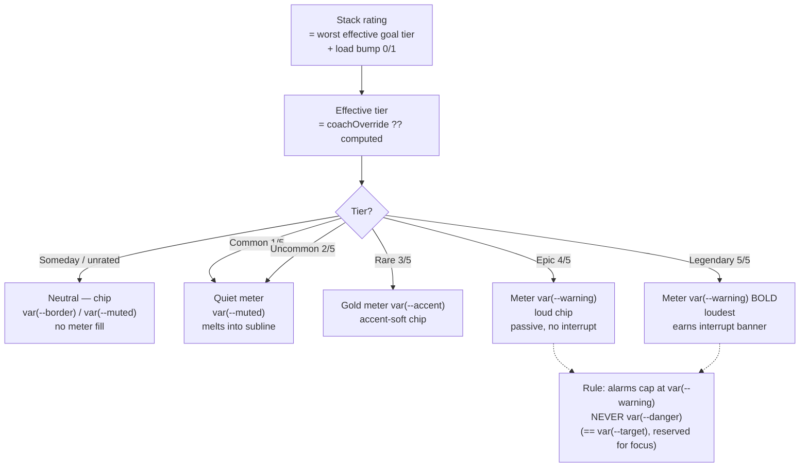
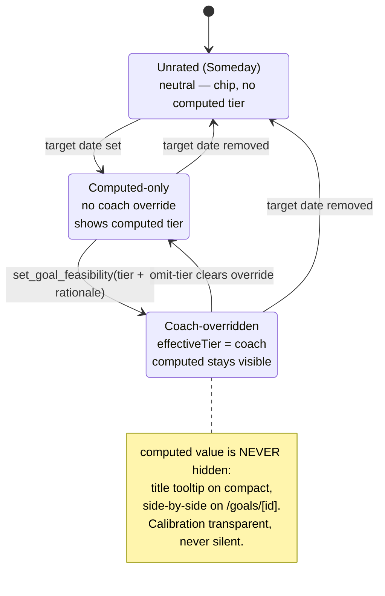
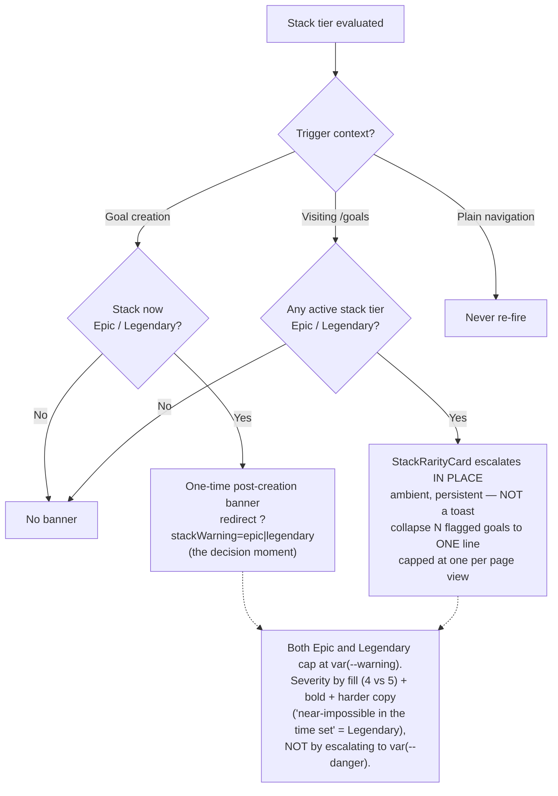

# UX Research — Rarity / Feasibility Tiers ("Reach")

**Feature:** Multi-goal Phase 2 — a feasibility tier on every dated active goal + a stack-level rating + coach calibration.
**Issue:** jronnomo/workout-planner #63 (Epic #61) · **PRD:** `docs/prds/PRD-rarity-feasibility-engine.md` (§3.1.8 fixes the UI *structure*; this report decides the *visual treatment* and refines REQ-63-4).
**Profile:** `.claude/skills/ux-research/profiles/goaldmine.profile.md`
**Extends (does NOT reopen):** the shipped grammar from [`multigoal-phase1-awareness.md`](./multigoal-phase1-awareness.md) (four-rung loudness ladder, claim-ring, conflicts capped at `--warning`) and [`goal-state-controls.md`](./goal-state-controls.md) (quiet-subline, `
` glossary, chip recipes).
**Pixel mockup:** [`rarity-tiers.html`](./rarity-tiers.html) — both themes, all seven surfaces, real `globals.css` tokens.
**Chosen direction:** **"The Reach meter"** — a discrete 5-segment gauge that ramps the loudness ladder (quiet at easy, warning-orange at near-impossible), paired with the kept tier word.
**Constraints honored:** tokens only · both themes · ≥44px taps · no new routes · **no animation** · Server-Components-friendly (`RarityChip` is presentational, imports pure rarity-core only, zero new `"use client"`).

> **Status note:** none of the rarity engine, `Goal.coachFeasibility`, `RarityChip`, or the MCP tools exist yet (Phase-1 exploration confirmed zero matches for `rarity`/`feasibility`). This report designs the presentational layer against the PRD's *planned* data shapes (`GoalFeasibility`, `StackRarity`, `effectiveTier = coach ?? computed`). The chips render values the engine will supply; they invent nothing.

---

## 1. Current-State Audit

| # | Surface | Today's behavior (file:line) | Problem the tier feature must solve |
|---|---------|------------------------------|-------------------------------------|
| A | /goals row | `src/app/goals/page.tsx:129` row is `flex items-start gap-3 py-3`; left rail = Bullseye `size20` + objective + Focus badge (`:103-113`) + muted subline (`:115-124`); **right rail (`:133-190`) is already 3-deep** — days/Someday chip → Set-focus pill → Track pill, `gap-1.5`. | No room in the right rail for a per-goal tier without "row soup." A fourth pill wraps or steals the objective's truncate budget. |
| B | /goals top | Minimal `<h1>` header (`:59-64`); list begins `:78`. No stack-summary element. | The PRD's stack rating needs a home that is always-present and learnable but doesn't out-shout "New goal." |
| C | /character portrait | `src/app/character/page.tsx:49-86` — 64px `LevelMedallion` (carries its own gold level chip bottom-right, `LevelMedallion.tsx:16-59`) + "Lv N Adventurer" line (DM-Serif "Lv N" + muted role) + XP bar. | A stack-difficulty chip must sit in the hero identity area *without* reading as a second rank/medal next to Level, and *without* being mistaken for the XP bar (where more fill = good). |
| D | /goals/[id] | `src/app/goals/[id]/page.tsx` cards stack: Edit → References → Readiness (big score/100 + breakdown) → Plan (`:177`). `?param` search-param pattern exists (`revise/page.tsx:17`). | No feasibility section, no `?stackWarning` banner slot. A clean gap exists between Readiness and Plan. |
| E | Glossary | `
` "What do these states mean?" with 6 rows (`:196-284`), each a real component sample + `<strong>Name</strong> — def`. | The closed vocabulary now needs a 7th row teaching the inversion (higher = harder, not a prize). |

Shared primitives reused (no new iconography): the base pill `text-xs rounded-full border px-2 py-0.5`; the small-label recipe `text-[10px] uppercase tracking-wide text-[var(--muted)]`; the warning-banner recipe (`border border-[var(--warning)] border-l-[3px]` + `color-mix(in srgb, var(--warning) 8%, var(--card))` wash + `◣` glyph, body in `--foreground`, from `days/[dateKey]/page.tsx:73-75`); the `
` glossary; the `ReadinessBreakdown` per-target table grammar.

---

## 2. Chosen Direction — "The Reach meter"

The feature inherits a **pre-loaded, wrong mental model**: every user who has touched a game or Strava reads *rarer = better, Legendary = flex*. That reflex fires (System 1) before any copy is read. So the design job is not "explain the tiers" — it is **out-shouting an existing instinct**. Three moves do that, and they are correct even when unread:

1. **Rename the on-screen axis to "Reach."** The engine and the claude.ai coach keep the word *rarity* (their shared MCP vocabulary; the Track pill already says "counts toward rarity"), but the UI noun is "Reach: Rare." "Reach" is coach-native, single-syllable mid-workout, and crucially *time-bound* — it implies "for the date you set," which is the whole point (a Legendary goal isn't impossible, it's impossible *by then*). "Feasibility" was rejected as the on-chip noun because it scales backwards ("Legendary feasibility" parses as *very feasible*); it survives only in explanatory prose.

2. **Keep the tier words Common / Uncommon / Rare / Epic / Legendary**, and redefine the loaded ones *inline* wherever they go loud ("Legendary reach — near-impossible in the time set"). Relabeling to plain phrases ("Very hard") was considered and rejected: it would fork the vocabulary between what the coach says over MCP and what the screen shows — the one thing this app refuses to do. Familiarity becomes an asset once the visual inverts the word's valence.

3. **Encode tiers as a discrete 5-segment "Reach meter" that ramps the shipped loudness ladder.** Fill *count* = tier ordinal (Common 1/5 … Legendary 5/5); empty segments are `--border`. The filled hue uses **only three hues** so it never becomes a gaming rainbow: Common + Uncommon = `--muted` (they nearly vanish — easy goals *should not shout*), Rare = `--accent` gold ("pay attention"), Epic + Legendary = `--warning` (the alarm ceiling), with the **Legendary word bold** as a redundant second monotonic channel. The meter only "lights up" as a goal gets daunting; the reward for a feasible goal is the *absence* of loudness. It is **prize-proof by construction**: louder = more alarming, never a special/shiny hue, never gold-at-top, and never the reserved rust-red. This is the AllTrails move (ordinal-first difficulty, color-second) and the deliberate inverse of Apple Fitness rings (where filling = celebration).

**Why a meter and not a colored word-chip (the runner-up):** five warm tokens on cream read as muddy swatch-soup, and a "LEGENDARY" pill is ~80px — it breaks the dense row and forces clarity-eroding abbreviations. **Grafts kept from the word-chip direction:** the tier *word* still rides alongside the meter on every roomy surface (it is the unambiguous value), and font-weight escalation (Legendary bold) is borrowed as the second channel that survives the one real legibility risk — Epic and Legendary share `--warning` and differ only by 4-vs-5 fill. The **headroom/depletion gauge** (Common 5/5 → Legendary 1/5) was the most semantically elegant and intrinsically prize-proof, but it *inverts* the app's established louder=more-important grammar, so a lonely 1-segment Legendary would read as quiet/minor exactly when it must alarm. Rejected for the record.

### 2.1 Answers to the five research questions

**Q1 — Encoding.** Reach meter (above). Tiers map onto the loudness ladder; Common/Uncommon ride the `--muted` whisper rung, Rare the `--accent` note rung, Epic + Legendary the `--warning` alarm rung. The ladder does **not** grow a fifth rung — five tiers fold onto the existing four rungs with the top two sharing `--warning` (differentiated by fill + weight). The Bullseye is **kept out of the chip**: it is reserved-for-focus, already encodes 0–1 progress, and maxes at 4 rings at size 20 (`Bullseye.tsx`) — overloading it for a 5-step difficulty scale collides with three shipped meanings and breaks at chip size. The "smaller bullseye = harder to hit" idea is lovely as *rationale* but must not become the *glyph* (allowed only as a non-interactive motif illustration inside the /goals/[id] Reach card).

**Q2 — Placement (no soup).**
- *Per-goal:* the **bare meter glyph** (no text) sits at the **start of the left-rail muted subline** — `[meter] · {date} · {status}` — adding zero width to the exhausted right rail. The tier *word* is exposed via `title=` (desktop hover, the shipped pattern at `goals/page.tsx:120`) and the glossary. Common/Uncommon melt into the subline; Epic/Legendary's orange fill warms the line just enough to earn a glance.
- *Stack rating:* a dedicated **`StackRarityCard` directly above the goals list** (below "New goal," so creating stays primary). Always present (learnable location), state-driven in loudness: quiet for Common–Rare; escalates to the warning-banner treatment for Epic/Legendary with a plain, computed-honest reason line ("3 dated goals running at once" / "4 conflicts in the next 28 days") mirroring the `loadBump` triggers.
- */character:* a **third line below the XP bar** — `Reach: Rare [meter]` — subordinate to "Lv N Adventurer," never inline with it (Level is earned-positive; Reach is a caution — different axes). Shows the **stack** tier only, always with the word to disambiguate from the adjacent XP bar. ⚠ verify it doesn't squeeze the XP bar at 390px; fall back to its own full-width line if tight.

**Q3 — Coach-override display.** Everywhere shows the **effective** tier (`coach ?? computed`). An override is *signaled, never silent*: on compact surfaces a small gold `--accent` "coach dot" prefixes the chip + a `title="Coach-set · computed: Rare"`; on roomy surfaces a `text-[9px] uppercase tracking-wide text-[var(--accent)]` "coach" tag. On **/goals/[id]** both render side-by-side in a Reach card (Computed *and* Coach, each with its meter), with the mandatory rationale in quotes + "Assessed {assessedAt}" + a per-target breakdown table. The computed value is **never replaced, only annotated** — this is "calibration transparent, never silent" made literal, and it keeps the coach auditable on the day the coach is wrong. The gold marker reads as "a human calibrated this"; it deliberately does **not** reuse the filled Bullseye (reserved for focus).

**Q4 — Warning banners & severity.** Both Epic and Legendary **cap at `--warning`; neither earns `--danger`** — justified four ways: (1) the cried-wolf rule already caps planning alarms at `--warning`; (2) `--danger` *is byte-identical to* `--target` in both themes (#A82A1F / #C0392B), so a danger-red Legendary would wear the exact rust-red of the focus Bullseye — unacceptable; (3) honest register — danger-red implies *broken/destructive*, but a Legendary goal is *ambitious and won't fit the timeline* (caution, not error); (4) consistency — conflicts, the app's current top planning signal, sit at `--warning`. Severity between Epic and Legendary is carried by **fill (4 vs 5) + bold + harder copy**, not a redder hue. Exact strings in §0 below; the Legendary string carries the mandated phrase "near-impossible in the time set." Banner *economy* (signal-detection): the post-creation banner is the one-time interrupt at the decision moment; on /goals the StackRarityCard escalates **ambiently** and collapses N flagged goals into **one** summary line, **never re-firing** on navigation.

**Q5 — Glossary.** One `<li>` added to the existing `
`, real Rare chip sample + (74 chars): **"Reach — How big an ask a goal is by its date. Higher tiers are harder to hit in time."** Teaching the inversion in the learn-once glossary is the permanent backstop; the primary fix is the word "Reach" + the loudness map being correct even unread.

### 0. Final copy strings

| Slot | String |
|------|--------|
| Glossary (≤90c) | **Reach** — How big an ask a goal is by its date. Higher tiers are harder to hit in time. |
| Epic, post-creation (goal) | **Epic reach.** Hitting this by {date} is a hard ask off your current pace. Talk it over with your coach, or give the deadline more room. |
| Epic, stack (/goals) | **Epic reach.** Your tracked goals add up to a hard ask right now. Consider spacing out deadlines, or pausing one with your coach. |
| Legendary, post-creation (goal) | **Legendary reach.** As set, this is near-impossible in the time set. Bring it to your coach to extend the timeline, or pause it until your slate clears. |
| Legendary, stack (/goals) | **Legendary reach.** Your current slate is near-impossible in the time set. Talk to your coach about extending a deadline or pausing a goal. |
| Someday | `—` chip, `aria-label="Feasibility not yet rated"` |

---

## 3. Phase-A Options (divergent, narrowed to one)

Three directions were drawn at 390px across the four surfaces; they diverged only on the highest-risk decision — *how to encode 5 inverted tiers without re-importing the trophy instinct.*

Direction comparison (click)

| | Prize-proof | Fits shipped louder=worse ladder | Dense-row fit | Build | Main flaw |
|---|---|---|---|---|---|
| **A Reach meter** *(chosen)* | **yes** (loud = alarm) | **yes** | clean (bare glyph in subline) | Low–Med | Common≈Uncommon faint; Epic vs Legendary = 4-vs-5 fill ⚠ |
| **B Word-chip** *(graft: word + weight)* | weak (word implies "good") | n/a | overflows (~80px) / abbrev | **Trivial** | muddy warm swatches; LEG/EPIC hurts clarity |
| **C Headroom gauge** *(rejected)* | yes (empty = bad) | **no — fights it** | clean but mis-signals | Low–Med | hard goal reads *quietest*; structural, not tunable |

- **A "Reach meter"** — 5-segment fill, 3-hue ramp, loud at the top. *Win:* the only option both prize-proof AND consistent with "louder = more important." *Risk:* the Epic/Legendary `--warning`-share distinguishability at chip size — mitigated by the bold word.
- **B "Word-chip"** — colored uppercase pill of the tier word, weight escalating. *Win:* cheapest, zero ambiguity about *which* tier. *Loss:* five warm tokens muddy on cream; the LEGENDARY pill breaks the dense row. **Held as the named fallback** if the meter turns to mud at subline size; its word + weight escalation is grafted into A regardless.
- **C "Headroom gauge"** — depletion (Common 5/5 → Legendary 1/5). *Win:* semantically elegant, intrinsically prize-proof. *Loss:* inverts the app's loudness grammar so the alarm state reads quiet. **Rejected: structural conflict.**

**Decision: Direction A**, grafting B's word + weight escalation as the second channel. The honest test is a single screenshot of the §1 legend (all five meters stacked) on a real ~390px device, both themes: can you rank-order tiers and separate Epic from Legendary at a glance?

---

## 4. Phase-B Technical Artifacts

### 4.1 Tier → on-screen treatment routing

### 4.2 RarityChip display states

### 4.3 Banner economy (cried-wolf-safe firing)

### 4.4 Pixel mockup

[`rarity-tiers.html`](./rarity-tiers.html) — self-contained, real `globals.css` tokens, both themes side-by-side, all seven surfaces. Open it to judge the two load-bearing risks before building: (1) the **5-segment meter at subline scale** — does Common (1/5 muted) read as distinct from Uncommon (2/5 muted), and is Epic (4/5) separable from Legendary (5/5) at a glance? (2) **`--warning` on cream** at the ~4.6:1 AA edge for the banner/chip text.

---

## 5. Animation Storyboard

**None — by design**, consistent with UXR-62 and UXR-62B. Tier, severity, override, and stack state are carried entirely by token color, fill count, weight, and the warning-banner recipe — no motion. The signature `bullseye-pop` / `level-up-burst` keyframes stay **reserved for genuine completion/level moments**; animating a difficulty signal would both cheapen those and read as an error flash. (Tracked as UXR-63-21.)

---

## 6. Behavioral Psychology Principles

| Principle | How it's applied | Q |
|-----------|------------------|---|
| Framing / lexical priming | "Rarity" primes acquisition; renaming the axis to **"Reach"** pre-loads the correct (difficulty/time-bound) valence before any reasoning fires | Q1 |
| Stimulus-response compatibility | More concern ⇒ more loudness: the meter ramps *monotonically* onto the shipped ladder, so "higher = worse" is felt, not just labeled | Q1 |
| Von Restorff isolation | Common/Uncommon are near-silent by design, so an Epic/Legendary goal is the one loud thing on an otherwise calm list — salience by contrast, not by competing decoration | Q1, Q2 |
| Reserved-symbol semantics | The filled Bullseye = focus only; the meter is a separate glyph and the coach marker is a plain gold dot — no symbol carries two meanings | Q1, Q3 |
| Anchoring + external attribution | The "why this tier" data story leads with the *rate ratio* ("2.1× your pace, leaves no slack for a missed week") — physics the user reconstructs, not a verdict to dismiss | Q3 |
| Source credibility + consistency | Computed (machine) + Coach (named, with mandatory rationale) reads as expertise overriding a blunt instrument, not the app contradicting itself; hidden disagreement would kill trust quietly | Q3 |
| Signal-detection / cry-wolf | One-time post-creation interrupt; ambient stack card collapses N→1 and never re-fires; both tiers cap at `--warning` so the danger channel stays reserved and trusted | Q4 |
| Recognition over recall + progressive disclosure | The closed Reach vocabulary is taught once in the `
` glossary, then folds away; the rate-gap detail is one tap deeper, never shoved at a mid-workout user | Q5, Q2 |

---

## 7. Implementation Scope

| File | Change | Complexity |
|------|--------|------------|
| `src/components/RarityChip.tsx` *(new)* | Presentational chip: tier → `{label, meterFill, className}` lookup; bare-meter and labeled variants; `title=` for computed-on-override; imports pure `rarity-core` only, **no DB, no new `"use client"`** | Low |
| `src/components/StackRarityCard.tsx` *(new)* | Stack meter + reason line; escalates to warning-banner recipe for Epic/Legendary; collapses N flagged goals to one line | Med |
| `src/app/goals/page.tsx` | Bare meter at start of subline (`:115-124`); mount `StackRarityCard` above the list (`~:78`); 7th `
` glossary row (`:196-284`); select `coachFeasibilityTier` + computed-effective into the page | Med |
| `src/app/goals/[id]/page.tsx` | "Reach" card between Readiness and Plan (`~:173-176`); Computed+Coach side-by-side + rationale + assessedAt + per-target table; `?stackWarning=epic|legendary` banner at top | Med |
| `src/app/character/page.tsx` | Third line `Reach: {stackTier} [meter]` under the XP bar (`:77-82`), subordinate to "Lv N Adventurer" | Low |
| `src/app/globals.css` | (Optional fast-follow) add `--warning-soft` mirroring `--accent-soft` (rgba of `--warning` at ~14%/12%) — a wash of an existing token, not a new hue. Launch can ship without it. | Low |

**Suggested testIDs / identifiers:** `rarity-chip`, `rarity-meter`, `stack-rarity-card`, `stack-rarity-card-escalated`, `goal-reach-card`, `goal-reach-computed`, `goal-reach-coach`, `goal-reach-pertarget`, `reach-glossary-row`, `stack-warning-banner`.

**Data note:** the chip is purely presentational and receives `effectiveTier` (+ optional `computed` for the override marker) from the engine's `StackRarity.perGoal[]` / `GoalFeasibility`. Per the PRD, /goals and /character each run **one** `computeStackRarity` per request (no cache); the chips add no queries.

---

## 8. Accessibility

- **Tap targets:** the StackRarityCard and Reach card are presentational (not tappable) — no 44px requirement; any pill they sit beside keeps `min-h-[44px]`. The meter is decorative + carries an `aria-label` ("Reach: Epic, 4 of 5").
- **Both themes / contrast (verify — cream/gold light is contrast-tight):**
  - Tier **text/word** carries AA, never the meter fill: `--accent` ~5.1:1, `--target` ~5.6:1, `--muted` ~5.4:1 on `--card` all pass; **`--warning #A8511A` on cream ≈ 4.6:1 — right at the AA line ⚠**, keep tier/banner text ≥12px and never put `--warning-fg` text on a solid `--warning` fill (no such token exists; ~3.6:1 fails).
  - Meter **fills** are graphical (AA 3:1, not 4.5:1) and are reinforced by the always-present word on roomy surfaces, so color is never the sole channel.
  - Washes (`color-mix(... var(--warning) 8–9% ..., var(--card))`) are decorative-only; AA never depends on the mix %. Light cream washes are subtle — expect to playtest a *higher* % in light than dark for equal perception, same token.
- **No color-only signaling:** meter fill *count* (ordinal) + the tier word + the glossary pairing each carry the tier independently; the coach override pairs a gold dot with a `title=`/tag, never color alone.
- **Reduced motion:** N/A — nothing animates.

---

## 9. ⚠ Provisional / Verify-Visually list

Confirm on a real 390px device in **both** themes before shipping (every item is a ledger row):

1. **Meter segment geometry** — ~3px × 9px, gap ~1.5px, radius 1px (range 2.5–3.5 × 8–10). (UXR-63-05)
2. **Epic vs Legendary distinguishability** — both `--warning`, separated only by 4-vs-5 fill + bold word. *The single highest-risk pixel.* If indistinguishable at subline scale → escalate Legendary's weight further, or fall back to the word-chip (UXR-63-23). (UXR-63-04)
3. **Common vs Uncommon** — 1-vs-2 faint `--muted` segments; verify they're separable yet still "quiet." (UXR-63-04)
4. **Bare meter in the /goals subline** — does it read at 12px without crowding `{date} · {status}`? (UXR-63-07)
5. **Warning wash %** — `color-mix(... var(--warning) 8–9% ..., var(--card))`; cream may need higher than coal. (UXR-63-14)
6. **`--warning` text on cream ~4.6:1** — AA edge; keep ≥12px, no solid-warning-fill text. (UXR-63-22)
7. **/character third line** — verify the Reach line doesn't squeeze the XP bar at 390px; fall back to its own line if tight. (UXR-63-09)
8. **Optional `--warning-soft` token** — ship without (border + bar carry it) or add as a wash of an existing token. (UXR-63-14)

---

## 10. Decisions requiring sign-off (challenge-with-evidence; do NOT slip in silently)

Two recommendations would change a value already fixed upstream:

- **Suppress the Epic post-creation *interrupt* entirely (Epic passive).** PRD §1.3 / §3.1.8 fix "Epic/Legendary stack ⇒ warning banner on /goals **and** at creation." The Data specialist argues (signal-detection) that Epic is often a *legitimate chosen stretch* and interrupting on every Epic is the cried-wolf generator; Epic would stay loud *in place* (chip + escalated StackRarityCard) but not interrupt, reserving the post-creation interrupt for Legendary. **This report honors the PRD** (both tiers banner at creation) and applies the milder cried-wolf restraint instead (one-time, collapse N→1, never re-fire). Adopt the Epic-passive change only with sign-off. (UXR-63-17)
- **Overrule the architecture-blueprint's placeholder tier-color map.** `.feature-dev/2026-06-10-rarity-feasibility-engine/agents/architecture-blueprint.md` (~line 87) tentatively maps `uncommon=--success`, `epic=--target`, `legendary=--danger`. This report **replaces** it with the 3-hue ramp (Common/Uncommon `--muted`, Rare `--accent`, Epic/Legendary `--warning`): `--success` (olive=good/safe) on a hard-ish tier re-imports the trophy valence, and `--danger`/`--target` on Legendary collides with the reserved focus red and breaks the cried-wolf cap. Confirm the override. (UXR-63-18)

---

## 11. Recommendation Ledger

Stable IDs `UXR-63-NN` (never renumbered). Status starts `proposed`; the implementing PR ticks each to `shipped`/`reworked`/`dropped` with a SHA / `file:line` / reason. Full ledger also at [`rarity-tiers-ledger.md`](./rarity-tiers-ledger.md).

| ID | Recommendation | Type | Status | Evidence |
|----|----------------|------|--------|----------|
| UXR-63-01 | On-screen axis noun = **"Reach"** (engine/MCP keep "rarity") | copy | proposed | |
| UXR-63-02 | Keep tier words Common/Uncommon/Rare/Epic/Legendary; redefine loaded words inline wherever loud | copy | proposed | |
| UXR-63-03 | `RarityChip` glyph = discrete 5-segment Reach meter, fill count = ordinal; empty = `--border` | component | proposed | |
| UXR-63-04 | 3-hue ramp (Common/Uncommon `--muted`, Rare `--accent`, Epic/Legendary `--warning`) + Legendary word bold | tuning⚠ | proposed | Epic vs Legendary distinguishability |
| UXR-63-05 | Segment geometry ~3px×9px, gap ~1.5px, radius 1px | tuning⚠ | proposed | |
| UXR-63-06 | Do NOT overload Bullseye for tiers (reserved-for-focus + 4-ring ceiling); meter is a separate glyph | component | proposed | |
| UXR-63-07 | Per-goal marker = bare meter at START of the left-rail subline; right rail untouched | layout | proposed | |
| UXR-63-08 | `StackRarityCard` above the list; quiet for Common–Rare, escalates to warning-banner for Epic/Legendary + plain reason line | component | proposed | |
| UXR-63-09 | /character third line `Reach: {stackTier} [meter]` under XP bar, subordinate to "Lv N Adventurer", word always present | layout | proposed | verify XP-bar squeeze @390px |
| UXR-63-10 | /goals/[id] Reach card between Readiness & Plan; Computed+Coach side-by-side + rationale + assessedAt + per-target table | component | proposed | |
| UXR-63-11 | Coach-override compact: effective tier + gold `--accent` coach dot/tag; computed via `title=`; full side-by-side on detail | component | proposed | |
| UXR-63-12 | "Why this tier" rate-gap data story on /goals/[id] (required vs plausible weekly rate; "2.1× your pace · leaves no slack"), behind `
` | copy | proposed | |
| UXR-63-13 | Banners cap at `--warning`, NEVER `--danger` (== `--target`, reserved focus red); recipe = border + `border-l-[3px]` + `--foreground` body + `◣` | decoration⚠ | proposed | |
| UXR-63-14 | Warning wash `color-mix(in srgb, var(--warning) 8–9%, var(--card))`; optional `--warning-soft` token fast-follow | tuning⚠ | proposed | |
| UXR-63-15 | Epic + Legendary banner copy strings (exact, §0); Legendary carries "near-impossible in the time set" | copy | proposed | |
| UXR-63-16 | Banner economy: one-time post-creation interrupt; ambient StackRarityCard collapses N flagged goals to ONE line, never re-fires | layout | proposed | |
| UXR-63-17 | CHALLENGE — suppress Epic post-creation *interrupt* (Epic passive); needs sign-off | layout | proposed | PRD §1.3/§3.1.8 fixes Epic+Legendary banner at creation |
| UXR-63-18 | CHALLENGE — overrule blueprint placeholder color map (uncommon=`--success`, epic=`--target`, legendary=`--danger`) with the 3-hue ramp; needs sign-off | component | proposed | architecture-blueprint.md ~:87 |
| UXR-63-19 | Someday/unrated = neutral `—` chip (`--border`/`--muted`), `aria-label="Feasibility not yet rated"` | component | proposed | |
| UXR-63-20 | Glossary one-row addition (≤90c): "Reach — How big an ask a goal is by its date. Higher tiers are harder to hit in time." + real Rare chip sample | copy | proposed | |
| UXR-63-21 | No animation anywhere; `bullseye-pop`/`level-up-burst` stay celebration-only | animation | proposed | |
| UXR-63-22 | AA edge — `--warning` text on cream ~4.6:1; keep tier/banner text ≥12px; washes decorative-only (AA carried by text/border tokens) | a11y | proposed | |
| UXR-63-23 | Fallback — word-chip (LEG/EPIC abbrev) only if the meter+word strains a surface; full word preferred | tuning⚠ | proposed | named fallback to UXR-63-04 |

*Specialists: Data/Behavior · Next.js Dev & CSS · UI Design & Brand. Phase-1 exploration mapped against the live codebase (file:line cited inline). Extends the shipped UXR-62 / UXR-62B grammar; does not reopen it.*
