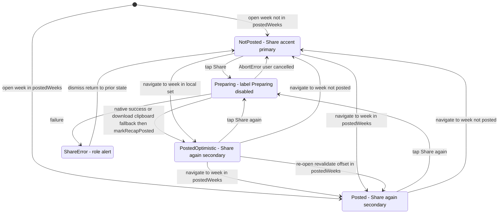
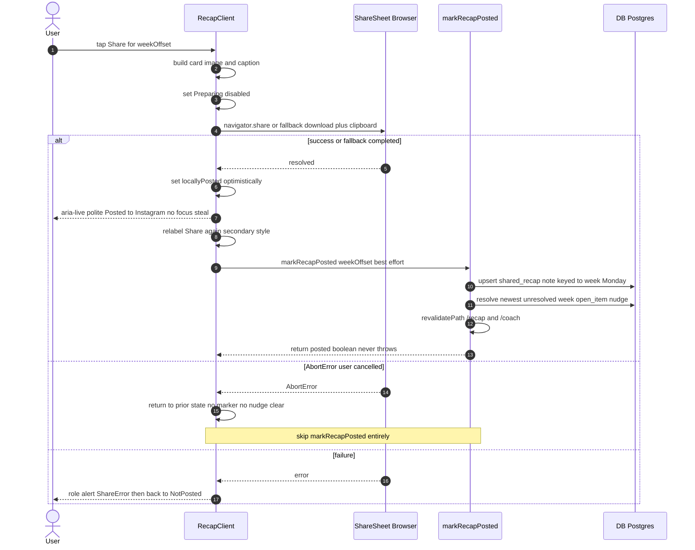

# UX Research — "Posted ✓" post-state on /recap

**Feature:** Issue [#95](https://github.com/jronnomo/workout-planner/issues/95) (Story 3.4-d · Epic #87 content flywheel)
**PRD:** `docs/prds/PRD-recap-post-state-tracking.md` (this report refines §5 UI/UX)
**Profile:** goaldmine (`.claude/skills/ux-research/profiles/goaldmine.profile.md`) · flavor layer OFF (neutral coach voice)
**Scope:** Small. Restraint over volume. Tokens-only, CSS-motion-only, ≥44px, both light + dark.
**Pixel mockup:** [`recap-post-state-tracking.html`](./recap-post-state-tracking.html) — light/dark × not-posted/posted, real `globals.css` tokens.
**Ledger:** [`recap-post-state-tracking-ledger.md`](./recap-post-state-tracking-ledger.md) — tick each `UXR-95-*` row in the implementing PR.

---

## 1. Current-State Audit

`/recap` (`src/components/RecapClient.tsx`) is a mobile card-preview screen at 390px inside a `max-w-md` column. Sharing is **fire-and-forget** — there is no terminal/"done" state:

- **No loop closure** — `RecapClient.handleShare` (`src/components/RecapClient.tsx:100`) completes a native `navigator.share` or a download/clipboard fallback and resets `sharing` to `false`. Re-opening `/recap` reads identically whether or not a week went out. *User impact:* can't tell at a glance which weeks are posted; risk of double-posting or forgetting.
- **The nag persists** — the proactive-coach Sunday routine writes a `[week:YYYY-Www]` `open_item` nudge surfaced on `/coach` (`src/components/CoachNudges.tsx:41`); today only a manual dismiss clears it. *User impact:* gets nagged about a thing already done.
- **Pre-existing token violation** — the Share button hardcodes `text-white` (`src/components/RecapClient.tsx:269`), against the no-color-literal invariant. Fix it while touching the button (ledger **UXR-95-15**).

The codebase already carries every primitive this feature needs, so the recommendation is **reuse, not invention**:
- inline check glyph `text-[var(--success)] … aria-hidden ✓` (`NutritionToday.tsx:191`);
- the gold-standard reserved-height polite announcer `<p className="text-xs min-h-[1rem]" aria-live="polite">…✓ saved</p>` (`LogNoteForm.tsx:83`);
- hollow `--success` status pill (`RecordsSummary.tsx:199`); selected/secondary button styles (`ShareWorkout.tsx:53`, template toggle in `RecapClient.tsx:211`).

---

## 2. Chosen Direction

**An inline `aria-live="polite"` status line — `✓ Posted to Instagram` — rendered directly above the Share button (Direction a), with the Share button demoting from primary-accent to a secondary border style and relabeling "Share" → "Share again" once the week is posted.**

This is the only placement that simultaneously (i) reuses the codebase's gold-standard a11y primitive verbatim, (ii) announces politely without stealing focus, (iii) reads as **calm routine status rather than celebration** — honoring the brand rule that earned strike-moments (the once-per-day bullseye-pop, target-red) get celebration and *routine housekeeping stays quiet*. Posting a card is housekeeping. The signal sits exactly in the user's post-tap gaze path and survives re-open because the server reads `shared_recap` notes into `postedWeeks: number[]` (per PRD §4.4).

**Grafted from runners-up:** the demote-to-secondary idea is borrowed from Direction (b)'s instinct that "the main job is done" — but applied to button *weight/label* rather than collapsing status into the control (which muddies the announcement). The per-week selector **chip (Direction c)** is the strongest idea for "which past weeks did I post," and is kept as an explicitly **deferred optional** (ledger **UXR-95-14**) — not at launch, because the single user almost always shares the current week and the selector row is tight beside two 44px arrows. The corner-badge overlay (Direction d) is **dropped** as decoration (**UXR-95-13**).

---

## 3. Phase-A Options (divergent, narrowed to one)

<details><summary>Four ASCII directions at 390px (compared → chose a)</summary>

### (a) Inline aria-live status line above Share — CHOSEN
```
 ┌────┐   Jun 9 – Jun 15   ┌────┐
 └────┘                    └────┘
 [ Coal ● ]      [ Parchment ]
   Featured Highlight ▼ Longest run yet

 ✓ Posted to Instagram          ← aria-live polite; ✓ + text [--success], aria-hidden ✓
                                  reserved min-h → zero layout shift
 ┌──────────────────────────────┐
 │          Share again         │  ← SECONDARY now ([--border]/[--muted])
 └──────────────────────────────┘
 [ Download Card ]  [Story 1][2][3]
```
Light: sage `--success #4E6B36` on cream `--card #FFFBF0`. Dark: `--success #7FA45C` on `--card #1A130C`. Calm, never competes with gold accent.

### (b) Share button transforms to "✓ Posted · Share again"
```
 ┌──────────────────────────────┐
 │   ✓ Posted  ·  Share again    │  border [--success]/40; "✓ Posted" [--success]; "· Share again" [--muted]
 └──────────────────────────────┘
```
Rejected as primary: collapsing status + action into one node complicates the announcement (control-rename vs status) and the re-share affordance.

### (c) Hollow chip on the week-selector row — DEFERRED OPTIONAL
```
 ┌────┐ Jun 9 – Jun 15  ┌──────────┐ ┌────┐
 │ ◀  │                 │ ✓ Posted │ │ ▶  │   chip: rounded-full px-2 py-0.5 border [--success]/40 text [--success]
 └────┘                 └──────────┘ └────┘
```
Best for per-week status across navigation; couples "posted" to week identity. Held back: cramped at 390px next to the arrows. Add later if multi-week legibility is wanted.

### (d) Corner check-badge on the card preview — DROPPED
```
┌──────────────────────────┐
│ recap preview  ┌────────┐ │  badge [--success] on [--card]/90 plate
│                │✓ Posted│ │
└────────────────└────────┘─┘
```
Decoration over the card art; AA-fragile over arbitrary pixels. Benchmarks (Apple Fitness, Strava) keep shared-state off the artwork.

</details>

---

## 4. Phase-B Technical (chosen direction)

### Per-week Share/Posted state machine


### Share → optimistic → server choreography


**Pixel artifact:** [`recap-post-state-tracking.html`](./recap-post-state-tracking.html) renders all four theme/state panels with the real tokens.

---

## 5. Animation / Transition Storyboard

Deliberately minimal — this is routine, not a strike moment (no Bullseye, no pop).

| Frame | Trigger | Treatment |
|-------|---------|-----------|
| 0 | Not posted | Status line present but empty (reserved height); Share = accent "Share". |
| 1 | Share tapped | Share disabled, label "Preparing…" (existing behavior, unchanged). |
| 2 | Share completes (native success OR fallback download) | Status text appears `✓ Posted to Instagram`; **CSS opacity fade-in 120–200ms ease-out ⚠**; Share restyles to secondary + "Share again". No layout shift (height was reserved). `prefers-reduced-motion` → no fade, instant. |
| 3 | Navigate ◀/▶ | State re-derived from `postedWeeks ∪ locallyPosted` for the new offset; posted weeks show the line + secondary button, others revert to accent + empty line. |
| 4 | Re-open page | Server `postedWeeks` seeds the line; persists. |

---

## 6. Behavioral-Psychology Principles (core)

| Principle | How it applies here | Design implication |
|---|---|---|
| **Zeigarnik effect** (open loops nag) | An un-marked shared week stays mentally "open" | A durable, persistent (not toast) mark that survives re-open closes the loop — persist from the DB note, not session-only |
| **Completion / goal-gradient** | Share is the last step; users want a clear terminus | Put the signal at the end of the flow (above/at the Share CTA), in the existing gaze path |
| **Von Restorff / salience budget** | Celebration loses meaning if everything celebrates | Reserve red/Bullseye/animation for earned goal-hits; routine "posted" uses calm sage `--success`, no pop |
| **Recognition over recall** | "Which weeks did I post?" shouldn't require memory | Sticky per-week state (and optional chip) lets navigation show status rather than make the user remember |
| **Feedback immediacy** | OS share sheets are slow; waiting feels broken | Optimistic update the instant the share resolves, then reconcile with the server write |

---

## 7. Implementation Scope

| File | Change |
|------|--------|
| `src/app/recap/page.tsx` | Server: query `shared_recap` notes for the 13-week window, map each `targetDate` → offset (via `dateKey` equality), pass `postedWeeks: number[]` to `<RecapClient>`. **CRIT-2: plain numbers only, no Date objects.** |
| `src/components/RecapClient.tsx` | Add `postedWeeks?: number[]` prop (default `[]`); local `locallyPosted` Set seeded from it; `isPosted = postedWeeks.includes(offset) || locallyPosted.has(offset)`. Render the reserved-height `aria-live="polite"` status line above Share; toggle Share primary↔secondary + label. Call `markRecapPosted(currentWeek.offset)` on native-success AND fallback branches, NOT on `AbortError`. Fix `text-white` → `text-[var(--accent-fg)]` (line 269). |
| `src/lib/recap-actions.ts` (new) | `"use server"` `markRecapPosted(weekOffset)` per PRD §4.3 (idempotent upsert + nudge clear + revalidate; never throws). |
| `src/lib/mcp/tools.ts` (`NoteTypeShape`, ~:96) | Add `"shared_recap"` to the enum (additive). |
| `prisma/schema.prisma` | Comment-only: list `shared_recap` on `Note.type`. No migration. |

No new routes, no new components, no `BottomNav` change, no new dependencies. The status line and pill reuse existing patterns — no bespoke component.

**Suggested identifiers for tests:** the status line is the only new DOM — target it by its text (`Posted to Instagram`) / `aria-live` role in browser smoke per PRD §10.3.

---

## 8. Accessibility

- **Text carries state.** Status content is the literal `Posted to Instagram`; the `✓` is `<span aria-hidden>✓</span>` so SR users hear "Posted to Instagram," not "check mark" (ledger **UXR-95-02**).
- **One persistent polite live region**, mounted empty at render with reserved height (`min-h-[1rem]`), directly above Share — copy `LogNoteForm.tsx:83` exactly. Mounting empty (not conditional insertion) makes the optimistic text-mutation reliably announce (**UXR-95-03**).
- **`aria-live="polite"` only** — do not also stack `role="status"` (it implies polite). Never call `.focus()`; focus stays on the Share button the user tapped (**UXR-95-04**). The existing error path keeps `role="alert"` (assertive) — two correct registers.
- **Focus ring preserved** through the accent→secondary transition; demoted button must not read as disabled (no `opacity-50`) (**UXR-95-06**).
- **Contrast (verify before ship):** sage `--success` on `--card` — light `#4E6B36`/`#FFFBF0`, dark `#7FA45C`/`#1A130C`. The cream/gold light palette is contrast-tight (**UXR-95-16**).

---

## 9. ⚠ Provisional / Verify-Visually list

Confirm each on a real 390px screen, in BOTH light and dark, before shipping:

- **UXR-95-08 ⚠** — relative-time "posted Sun" weekday tail: ship bare `Posted ✓` first; add the conditional weekday only on a real need; calendar-day vs 24h cutoff unvalidated.
- **UXR-95-09 ⚠** — status fade-in 120–200ms ease-out (CSS only; reduced-motion → none).
- **UXR-95-10 ⚠** — if any tint used: border `--success`/0.30–0.50, fill `--success`/0.08–0.14; verify AA.
- **UXR-95-11 ⚠** — reserved height `min-h-[1rem]`…`[1.25rem]` (allow for a wrapped weekday tail).
- **UXR-95-12 (decoration⚠)** — confirm Bullseye/target-red stays OUT of this surface.
- **UXR-95-13 (decoration⚠)** — corner-badge overlay stays dropped.
- **UXR-95-15** — verify the `text-white` → `text-[var(--accent-fg)]` fix lands on the Share button.

---

## 10. Recommendation Ledger

The canonical ledger lives in [`recap-post-state-tracking-ledger.md`](./recap-post-state-tracking-ledger.md). Stable `UXR-95-*` IDs, all `proposed`. **The implementing PR must tick each row to `shipped` / `reworked` / `dropped` with a SHA / `file:line` / short reason.** Every ⚠ row is a tuning/decoration item to confirm on a real screen first.
