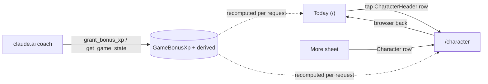
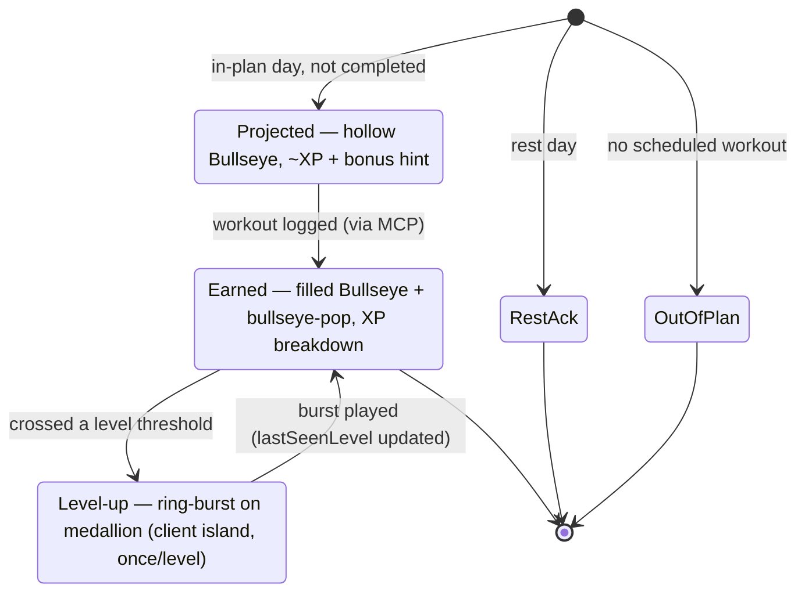

# UX Research: RPG Character Stats — Gamified Engagement Layer

**Author**: Claude (UX Research Orchestrator)
**Date**: 2026-06-09
**Source PRD**: `docs/prds/PRD-rpg-character-stats.md`
**Slug**: `rpg-character-stats`
**Audience**: Tech Lead (lifts recommendations into the PRD §9 resolutions), developer agents (implement)
**Deliverable**: committed-file per profile (`docs/ux-research/<slug>.md`); pixel artifact + ledger alongside. Nothing git-committed by this run.

This document resolves PRD §9 Open Questions 1–5 (plus the §5.1 `/character` composition, "Q6"). Every section ends with a **Recommendation** the Tech Lead can lift verbatim. ASCII mockups are drawn at the 390 px phone column (~58 chars). Both light and dark are stated for every surface; the companion pixel artifact `rpg-character-stats.html` renders both themes with the real `globals.css` tokens. The Recommendation Ledger lives at `docs/ux-research/rpg-character-stats-ledger.md`.

> **Method note.** This run executed the orchestration phases (explore → specialist synthesis → diverge in ASCII → converge in Mermaid/HTML → restraint gate → compile) directly rather than via parallel sub-agents (none available in this environment). Findings are grounded in opened `file:line` references, not assumptions.

---

## 0. Product thesis (the grounding line — verbatim from the profile)

> The app is a fast, honest **logger + dashboard** for ONE user; all reasoning happens in claude.ai over MCP — the app itself makes no LLM calls and must stay cheap, server-rendered, and dead-simple to use on a phone mid-workout. The single source of truth is the database the MCP tools read/write; the UI surfaces that state and edits it, but never invents prescription detail. Visual identity = the Bullseye/target "mining for goals" motif; motion is deliberately minimal CSS, spent on genuine completion moments (the once-per-day bullseye-pop), not decoration.

Every recommendation below is measured against that thesis: the gamification layer must **read at a glance, cost nothing extra at runtime beyond one query batch, stay server-rendered (one client island), and reuse the Bullseye rather than invent new glyphs.** Where it can't, that is called out explicitly.

---

## 1. Current-State Audit

| # | Observation | `file:line` | User impact |
|---|-------------|-------------|-------------|
| A1 | Today hero is a single `<section>` (rounded-2xl card) with week/phase eyeline, title, date+summary, and a completion indicator. There is **no room reserved above the hero** — a header will be the new first child of `max-w-md mx-auto p-4 space-y-4`. | `src/app/page.tsx:120-180` | The CharacterHeader must slot *above* the hero without pushing the workout title below the fold at 390 px. |
| A2 | The completion indicator is already a `Bullseye filled={completed}` wrapped in `TodayCelebration`, which fires `.bullseye-pop` once/day via `localStorage['goaldmine.celebrated.<dateKey>']`. | `src/app/page.tsx:153-169`, `src/components/TodayCelebration.tsx:21-44` | There is **already a completion Bullseye in the hero.** A QuestCard that also shows completion would duplicate it — see §3 (fold them). |
| A3 | The Bullseye is a single canonical SVG (viewBox 0 0 32 32) with a true `progress=0..1` mode that fills rings **center-out** in quartiles at size ≥20 (4 ring steps). All ring fills are `var(--target)`/`var(--target-fg)`. | `src/components/Bullseye.tsx:55-142` | **Yes — the Bullseye progress mode can BE the level medallion** (Q1). Caveat: only 4 discrete steps at medallion size, so it is a *coarse* glance cue, not a precise gauge. |
| A4 | The only signature keyframe is `bullseye-pop` (320 ms, `cubic-bezier(0.16,1,0.3,1)`, scale 0.6→1.08→1.0), guarded by `prefers-reduced-motion`. BottomSheet uses the same easing family. | `src/app/globals.css:105-119`, `:218` | The level-up burst (Q3) must extend *this* curve family to feel native, not introduce a new motion idiom. |
| A5 | Full token palette flips three ways (media query, `data-theme`, pre-hydration script); names are fixed. Light is a contrast-tight cream/gold; dark is coal/gold. | `src/app/globals.css:3-87` | Every badge/medal/bar must theme-flip; the cream/gold light side is the AA risk surface (gold `#8A6212` accent, muted `#7A5E3A`). |
| A6 | No icon library. Glyphs are hand-rolled inline SVG: MoreSheet line icons are **20 px, stroke 1.5, `currentColor`**; MarkerIcon maps legend glyphs (Bullseye for "trained", emoji for goal-specific legends). | `src/components/MoreSheet.tsx:17-60`, `src/components/MarkerIcon.tsx:19-32` | The streak flame, badge glyphs, and the new MoreSheet "Character" row icon must all be hand-rolled SVG in that house style — no icon-lib import, and emoji are off-brand for the "sophisticated, non-cartoon" tone. |
| A7 | Cards are a shared primitive (`rounded-2xl border bg-[var(--card)] p-4 shadow-sm`, optional title/action header). | `src/components/Card.tsx:14-24` | `/character` sections and the BadgeWall should reuse `<Card>`, not invent a container. |
| A8 | The Logo proves the in-house "4-ring bullseye + gold disc + DM Serif" vocabulary already extends to composite marks. | `src/components/Logo.tsx:31-99` | Typographic gold "medal" badges (§6) are a natural, already-blessed extension of the brand, not a new style. |

**Audit takeaway:** the brand already owns three of the four primitives the feature needs — the Bullseye (medallion + progress + quest-completion), the gold disc + DM Serif (badges), and the `bullseye-pop` curve (celebration). The only genuinely new glyph required is the **streak flame**, and the only new motion is the **level-up ring-burst** (which extends the existing curve). This is the restraint posture the thesis demands.

---

## 2. Chosen Direction (one paragraph)

**"The Bullseye is the character."** Make the level medallion a real Bullseye in `progress` mode (overall XP into level) with a small gold level chip; let the four attribute micro-bars carry texture beneath it; pin a single hand-rolled flame for the streak; and fold the existing hero completion-Bullseye into a **QuestCard ribbon** so there is exactly one completion moment (hollow Bullseye + projected XP → `bullseye-pop` fill + earned XP). On `/character`, the same medallion blows up to portrait size, attribute cards carry the precise XP numbers (kept *out* of the header), and the 16 badges render as **bullseye-framed gold medals** whose locked state reuses the brand's own hollow-ring "not done yet" semantics. The level-up celebration is a CSS-only gold ring-burst sharing `bullseye-pop`'s easing. Grafted from the runners-up: the *space-saving* idea (medallion alone could carry overall progress) survives as the rationale for keeping the header to two tight rows and pushing all precise numbers to `/character`; the *single-dense-row* idea is rejected for the header but reused as the attribute-card treatment on `/character`. Training stays the star: the header is ~72 px, the quest is a ribbon *inside* the existing hero, and nothing below the hero changes.

---

## 3. Q1 — CharacterHeader visual treatment (~72 px on Today)

**Brief:** level medallion, overall XP bar, 4 attribute micro-bars with levels, streak flame — at 390 px, energizing without burying training. Can the Bullseye progress mode BE the medallion?

### Divergent options (Phase A — ASCII, both themes)

**Option A — "Medallion + linear bars, two rows" (closest to the PRD §5.1 sketch)**
```
┌──────────────────────────────────────────────────┐  72px
│  ╭───╮                                             │
│  │◎ ⁷│  LV 7   ▓▓▓▓▓▓▓▒▒▒  320/450      ◭ 12     │  ← row 1: medallion(ring=overall) · chip · linear bar · streak
│  ╰───╯                                             │
│  STR·9 ▓▓▓▓▒  END·7 ▓▓▒  MOB·5 ▓▒  CON·11 ▓▓▓▒   │  ← row 2: four attribute micro-bars + levels
└──────────────────────────────────────────────────┘
  ◎ = Bullseye in progress mode (fills center-out, quartiles)
  ⁷ = gold level chip overlapping the medallion's lower-right
  ◭ = hand-rolled flame glyph + day count
```
- Whole row is one tap target → `/character` (≥44 px; the row is 72 px).
- **Light:** card `#FFFBF0`, medallion rings `--target` red on `--target-fg`, chip `--accent` gold disc + `--accent-fg` text, bar fill `--accent`, track `--accent-soft`, flame `--warning`. **Dark:** card `#1A130C`, rings `#C0392B`/white, chip `#D4A437` gold + coal text, bar `#D4A437`, flame `#E0915C`.
- *Note the redundancy:* the medallion ring AND the linear bar both show overall progress. Justified — the ring is a coarse quartile glance, the bar is the precise `320/450`. Flagged as a tuning decision (could drop the linear bar; see ledger row 14).

**Option B — "Medallion carries overall; micro-bars carry the rest" (space-saving)**
```
┌──────────────────────────────────────────────────┐  64px
│  ╭───╮  LV 7 · 320/450 XP                  ◭ 12   │
│  │◎ ⁷│  STR·9 ▓▓▓▓▒  END·7 ▓▓▒  MOB·5 ▓▒  CON·11▓▓▓▒│
│  ╰───╯                                             │
└──────────────────────────────────────────────────┘
  No separate overall linear bar — the medallion RING is the only overall-progress channel;
  overall XP shown as small text. Gives the 4 attribute bars more height/legibility.
```
- Saves a full bar's vertical space; the medallion ring does real work (not decoration). Risk: PRD §5.1 explicitly sketches an overall *linear* bar; dropping it is a (small) departure that needs sign-off.

**Option C — "Single dense ring row" (most game-y, rejected for header)**
```
┌──────────────────────────────────────────────────┐  56px
│ ◎⁷  STR◔9  END◔7  MOB◔5  CON◔11           ◭ 12   │
│      (four 18px Bullseye progress rings inline)    │
└──────────────────────────────────────────────────┘
```
- Four tiny Bullseyes at ~18 px render only 3 ring steps and muddy on retina (per the component's own band note, `Bullseye.tsx:57-58`). Attribute levels crowd. **Rejected for the header** — but the "attribute-as-Bullseye" idea is grafted onto the `/character` attribute cards (§8), where size is not constrained.

### Recommendation — **Option A**, with these resolutions

1. **The medallion IS a Bullseye in `progress` mode** — `progress = overallXpIntoLevel / overallXpToNext`, size **36–40 px ⚠**. This answers Q1 directly: yes. The ring fill gives a glanceable quartile read of progress to the next level; it reuses the canonical glyph (invariant honored — no new progress indicator invented).
2. **Level number = a chip, not centered text.** A small rounded chip (`--accent` fill, `--accent-fg` DM Serif numeral) overlapping the medallion's lower-right. Centering a 1–2 digit number over the red/white rings is unreadable at 36 px; the chip keeps the rings clean and reads instantly (notification-badge pattern). Chip ⌀ **18–22 px ⚠**.
3. **Keep the precise overall linear bar** (the ring is coarse). `XpBar` with `role="progressbar"`, fill `--accent`, track `--accent-soft`, `320/450` in tabular nums.
4. **Two tight rows ≈ 72 px.** Row 1 = medallion · LV chip-echo · overall bar · streak. Row 2 = four `AttributeBar` micro-bars, each `LABEL·level ▓▓▓▒`. Micro-bar height **4–6 px ⚠**.
5. **Streak flame = hand-rolled single-path SVG** (see §3.1), color `--warning` (reads as fire, distinct from the red Bullseye and gold accent), with the day count in tabular nums. Active = filled `--warning`; broken/0 = hollow `--muted` outline (non-colour state channel).

### 3.1 Streak flame iconography (sub-resolution of Q1)

- **Reject emoji 🔥** — full-colour, cartoonish, does not theme-flip, clashes with the sophisticated gold/cream/coal palette (and the §0 tone steer).
- **Reject "reuse the Bullseye"** — the streak is conceptually distinct from goal-progress; a distinct glyph aids recognition. But because a flame is *bespoke ornamentation*, the GATE requires justification vs a cheaper option: a flame is the universally-legible streak signifier (Duolingo/Snapchat/Apple), and a single-path SVG is cheap (one `<path>`, no shader/particles). **Approved as ⚠ decoration — verify visually.**
- **Cheaper fallback if the flame reads poorly at 16 px:** a typographic chip `12d` in `--warning`. Documented in the ledger.
- House style: match MoreSheet icons — ~**16–20 px, single colour via `currentColor`**, no gradient. Active state filled, broken state stroked-only.

```
Streak flame (hand-rolled, ~16-20px, currentColor):
  filled (active):           stroked (broken / 0):
      /\                          /\
     /  \                        /  \
    | ◭  |   fill currentColor  |    |   stroke 1.5, fill none
     \__/    (=var(--warning))   \__/
```

---

## 4. Q5 — Attribute bars: numbers or bars-only at header size?

(Resolved here because it directly shapes the §3 header.)

At the header, four bars share ~358 px → ~85 px each. Squeezing `STR 9 ▂▂▂ 120/180` per bar produces four cramped, unreadable clusters and four competing numbers — high cognitive load on a surface whose job is *glance*.

**Recommendation:** **Header shows attribute LABEL + LEVEL + a short progress bar only. No XP numbers at header size.** The level is the "brag number" (RPG identity) and earns its pixels; the exact `intoLevel/toNext` is detail you *seek out*, so it lives on `/character` attribute cards (§8). Rationale: recognition-over-recall and cognitive-load reduction — the header answers "how am I doing?" in one sweep; `/character` answers "what exactly do I need to level STR?" This is the resolution for PRD §9 Q5.

---

## 5. Q2 — QuestCard placement & pre/post states

**Brief:** frame today's workout as a quest inside the existing hero. Pre: projected XP "~70 XP" + bonus hints. Post: earned XP breakdown. Right-aligned strip vs full-width row?

### Options
- **Right-aligned strip** — a narrow vertical strip beside the title. *Rejected:* collides with the existing `+ Import` pill (`page.tsx:132-137`), and at 390 px is far too narrow for the post-training breakdown (multiple event lines).
- **Full-width ribbon inside the hero** — a band below the date line, styled `--accent-soft` with a left accent rule. Room for both the one-line pre-state and the multi-line post breakdown; reads as *part of the workout*, not a separate gamification block.

### Recommendation — **full-width quest ribbon inside the hero**, and **fold the existing completion Bullseye into it**

```
PRE-TRAINING (in-plan, not completed):
┌──────────────────────────────────────────────────┐
│ Week 6 · Phase 2 · Strength + Capacity   + Import │
│ Upper Power                                        │
│ Monday, Jun 9 · 5×3 bench focus                    │
│ ┃ ◯  Today's quest · projected ~70 XP             │  ← ribbon: accent-soft bg, left accent rule
│ ┃    Bonus in play: PR chance +40                  │     hollow Bullseye = not done
│ … existing baselines / blocks / nutrition below …  │
└──────────────────────────────────────────────────┘

POST-TRAINING (workout logged):
┌──────────────────────────────────────────────────┐
│ ┃ ◉  Quest complete · +83 XP                       │  ← filled Bullseye + bullseye-pop (the ONE completion moment)
│ ┃    Workout +25 · Volume +8 · PR +40 · Adherence +10│
└──────────────────────────────────────────────────┘
  ◯ hollow Bullseye / ◉ filled Bullseye — NOT a sword emoji
```

- **Use the Bullseye (hollow → filled), not the ⚔/✓ emoji** in the PRD §5.1 sketch. This keeps the quest on-brand and ties quest-completion to the existing `bullseye-pop`. (Resolves the icon under the no-icon-lib constraint; flagged as a copy/icon divergence from the sketch — see ledger.)
- **Fold `TodayCelebration`'s hero Bullseye into the QuestCard** so there is exactly one completion Bullseye, not two. The quest ribbon's hollow→filled toggle *is* the completion indicator; the `bullseye-pop` fires on it. ⚠ **This modifies existing hero behaviour** (`page.tsx:153-169`) and PRD §3.1.7 says content below the header is "unchanged." Raised as a **challenge-with-evidence requesting sign-off** (ledger row 08), not slipped in. Evidence: shipping both means two completion Bullseyes ~120 px apart — visually confusing and a maintenance hazard.
- Projected XP is the focal number (DM Serif, `--foreground`); the bonus hint is muted sub-text (`--muted`). Post breakdown reuses the condensed `XpEventList` row style.
- Data: QuestCard consumes the `resolveDay(now)` result the page already fetches (PRD §4.6) — no extra query, thesis-aligned.

---

## 6. Q4 — BadgeWall on /character (grid + iconography, no icon lib)

### Iconography options
- **A — Bullseye-ring variants only:** 16 badges can't be distinguished by ≤4 ring steps. *Rejected* (too samey).
- **B — Typographic gold "medal":** each badge = a circular disc with a 1–2 char monogram/numeral in DM Serif (e.g. `1st`, `PR`, `7`, `30`, `10k`). On-brand (gold + DM Serif, already proven by the Logo, A8), cheap, 16 trivially distinct, theme-flips. **Strongest under the constraint.**
- **C — 16 bespoke geometric SVG glyphs:** more "iconic" but 16× the build cost and consistency risk.
- **D — Hybrid:** typographic system + a *few* geometric glyphs where they clearly win.

### Recommendation — **B as the system, framed by the Bullseye ring, with optional hybrid glyphs (D) for the mountain/streak families**

Every badge is a circular medal **inside a Bullseye-style ring frame** — so each badge literally reads as "a target you hit." This maps badges onto the brand's existing **hollow → filled "not done / done" semantics**:

- **Unlocked:** filled gold disc (`--accent`) + DM Serif monogram (`--accent-fg`) inside a solid ring; name below (`--foreground`, text-xs).
- **Locked:** **hollow** Bullseye ring (`--muted` stroke) + greyed monogram (`--muted`, reduced opacity) + **hint text** below ("Log a PR", "Reach a 30-day streak"). Lock conveyed by **three channels** — desaturation + hollow frame + text — never colour alone (a11y, PRD §5.4).

Optional polish (⚠ decoration, justify per glyph): a small hand-rolled **mountain triangle** for the elevation trio (Trail Rat / Vert Collector / High Pointer / Elbert Ready) and the **flame** for the streak trio (One Week Strong / Fortnight Forge / Iron Month), reusing §3.1's flame. Everything else stays typographic.

```
BadgeWall — 4-col grid at 390px (≈80px cells), catalog order, "7 / 16 unlocked"
┌──────────────────────────────────────────────────┐
│  Badges                              7 / 16        │
│  ╭──╮   ╭──╮   ╭──╮   ╭──╮                         │
│  │◉ │   │◉ │   │◉ │   │◯ │   ◉ unlocked: gold disc  │
│  │1st   │PR    │×10   │△ │      + DM Serif mark      │
│  ╰──╯   ╰──╯   ╰──╯   ╰──╯   ◯ locked: hollow ring   │
│  First  On    PR     Trail      + greyed + hint      │
│  Blood  Record Machine Rat                          │
│  ╭──╮   ╭──╮   ╭──╮   ╭──╮                          │
│  │◯ │   │◯ │   │◯ │   │◉ │                          │
│  │△ │   │30 │   │7d │   │✓ │                         │
│  ╰──╯   ╰──╯   ╰──╯   ╰──╯                          │
│  Elbert Iron   1 Wk   Self-                         │
│  Ready  Month  Strong Examined                      │
│  (locked: "Single hike ≥4,000 ft")                  │
└──────────────────────────────────────────────────┘
```
- **Grid: 4 columns** for the "trophy wall" density (Strava/achievement-grid read). ⚠ verify at 390 px that 2-line names/hints don't clip; **fall back to 3-col** if they do (ledger row 18).
- Medal ⌀ **48–56 px ⚠**. If badges are tappable (e.g. to expand the hint), cell ≥44 px; recommend them **non-interactive** (hint shown inline) to keep it simple — then medal size is free.
- **Light** AA risk: gold `--accent-fg` (#FFFBF0) on gold `--accent` (#8A6212) for the monogram — verify ≥4.5:1. **Dark:** coal `--accent-fg` on `#D4A437` — verify.

---

## 7. Q3 — Level-up celebration art direction (CSS-only gold ring-burst)

**Brief:** CSS-only, token colours (`--accent` gold / `--target` red), once-per-level, reduced-motion safe; spec the keyframes; harmonize with `bullseye-pop`.

### Recommendation — **a gold double-ring burst behind the medallion, sharing `bullseye-pop`'s easing**

The medallion runs the **existing `bullseye-pop`** (reuse, A4) so the level number scales-pops; *behind* it, one or two gold rings expand and fade. No particles, no shader — two pseudo-element rings (restraint: justified vs a particle field, which the thesis forbids).

```css
/* --- Level-up ring-burst (CSS-only, tokens only, reduced-motion safe) --- */
@keyframes level-up-burst {
  0%   { transform: scale(0.8); opacity: 0.65; }
  100% { transform: scale(2.2); opacity: 0; }       /* scale end ⚠ 2.0–2.4 */
}
.level-up-ring {
  position: absolute; inset: 0; border-radius: 9999px;
  border: 2px solid var(--accent);                  /* gold; ⚠ width 2–3px */
  animation: level-up-burst 560ms cubic-bezier(0.16, 1, 0.3, 1) both; /* ⚠ 480–640ms */
  pointer-events: none;
}
.level-up-ring.delayed { animation-delay: 120ms; }  /* ⚠ second ring 0–160ms */
@media (prefers-reduced-motion: reduce) {
  .level-up-ring { display: none; }                 /* new level number simply appears */
}
```

- **Colour:** the *burst rings* are gold (`--accent`); the **red (`--target`) comes free from the medallion's own Bullseye rings** popping inside. Two expanding colours would read busy — so gold ring-burst + the medallion's built-in red. (Uses both required tokens without competing animations.)
- **Once per level:** client island only, `localStorage['goaldmine.lastSeenLevel']`, imperative `classList.add` (no setState), silent on first install — exactly the `TodayCelebration` pattern (`TodayCelebration.tsx:21-33`), per PRD §3.1.9.
- **Layering vs `TodayCelebration`:** if a workout both completes the day *and* levels up, the daily `bullseye-pop` fires on the **QuestCard Bullseye** (hero) while the **ring-burst fires on the medallion** (header) — different elements, no collision. Same easing family makes them feel like one vocabulary. Document this relationship (ledger row 09).
- All tunings (duration, scale, ring count, width) are **⚠ playtest** ranges — see §11.

---

## 8. Q6 — /character page composition & hierarchy

**Recommendation — order by: identity → daily hook → what-to-train → long-arc chase → audit → disclosure.** All sections reuse `<Card>`; page is a server component, `force-dynamic`.

```
/character  (max-w-md, space-y-4)
┌──────────────────────────────────────────────────┐
│ 1. PORTRAIT  ╭────╮  LV 7                          │  big Bullseye medallion (progress ring),
│              │ ◎⁷ │  Adventurer · 320 / 450 XP     │  level, overall bar + precise numbers
│              ╰────╯  ▓▓▓▓▓▓▓▒▒▒                     │
├──────────────────────────────────────────────────┤
│ 2. STREAK   ◭ 12 day streak · longest 18 · today ✓ │  flame + current/longest/today + next milestone
│             Next: Iron Month in 18 days            │
├──────────────────────────────────────────────────┤
│ 3. ATTRIBUTES (4 cards, or 2×2)                    │  EACH: small Bullseye + label + level
│   ◎ STR  Lv 9   ▓▓▓▓▒  120 / 180                   │       + bar + PRECISE xp numbers (Q5)
│      Feeds: completed lifts, volume, PRs            │       + "Feeds this:" line
│   ◎ END  Lv 7   ▓▓▒    60 / 140                     │
│      Feeds: cardio minutes, hikes, run PRs          │
│   … MOB, CON …                                      │
├──────────────────────────────────────────────────┤
│ 4. BADGES  7 / 16            (the §6 wall)          │
├──────────────────────────────────────────────────┤
│ 5. XP LOG (last 30; coach bonuses marked ✦)        │  fold the coach-bonus log in here, ✦ + accent-soft
│   Jun 9  PR · Bench  +40   STR                      │
│   Jun 9  ✦ Coach: pushed on 4h sleep  +25  END     │
├──────────────────────────────────────────────────┤
│ 6. "XP is derived from your full history and may    │  retroactivity footnote, --muted text-xs
│     shift when the plan or rules change."           │
└──────────────────────────────────────────────────┘
```

- **Attributes above badges:** attributes are the core RPG identity and tie to *today's* training (actionable); badges are the trophy case you scroll to. Each attribute card may lead with its own small **Bullseye progress glyph** (grafted from rejected Option C) for consistency with the medallion.
- **Fold the coach-bonus log into the XP log** (one list, ✦-marked, `--accent-soft` tint) rather than a separate section — reduces redundancy; PRD lists them separately but the data is the same stream.
- **Empty/early states** (PRD §5.1): no program → page hidden by `goalKind` check; no history → Level 1, 0 XP, all badges locked, streak 0 — renders clean.
- **MoreSheet "Character" row** (PRD §3.2.1): hand-rolled 20 px / stroke-1.5 line icon in the MoreSheet house style (A6). Recommend a simple **shield-with-chevron** or **bust silhouette** (RPG character-sheet signifier). ⚠ decoration — verify it sits beside Goals/Coach/Nutrition icons consistently (ledger row 17).

---

## 9. Convergent technical artifacts (Phase B)

### 9.1 Navigation flow


### 9.2 QuestCard / completion / level-up states


### 9.3 Level-up celebration timing (illustrative axis; real ms in labels)

```mermaid
gantt
  title Level-up timeline — one bar per tween (axis illustrative)
  dateFormat X
  axisFormat %L
  section Medallion
  bullseye-pop scale 0.6 to 1.08 to 1.0 (320ms, cb .16,1,.3,1)   :0, 320
  section Ring burst
  ring 1 scale 0.8 to 2.2 + fade (560ms cb .16,1,.3,1)           :0, 560
  ring 2 delayed (start 120ms, 560ms)                            :120, 680
```


### 9.4 Pixel artifact
`docs/ux-research/rpg-character-stats.html` — self-contained, mirrors the real `globals.css` light + dark token blocks verbatim, and renders the recommended **CharacterHeader**, **QuestCard (pre + post)**, a **BadgeWall** slice, and the **level-up medallion** side-by-side in **both themes** at the 390 px column. ⚠ The agent pipeline cannot render pixels — open it in a browser to do the AA + 390 px visual pass before shipping.

---

## 10. Animation storyboard

| Frame | Element | Motion | Timing | Reduced-motion |
|-------|---------|--------|--------|----------------|
| 1 | QuestCard Bullseye | hollow (idle) | — | same |
| 2 | (workout logged, page reload) Bullseye | hollow → filled + `bullseye-pop` | 320 ms, cb(.16,1,.3,1) | instant fill, no pop |
| 3 | Medallion (only if level crossed) | `bullseye-pop` scale | 320 ms | instant |
| 4 | Medallion ring-burst (gold) | scale 0.8→2.2, opacity .65→0 | 560 ms ⚠ | hidden |
| 5 | Medallion ring-burst #2 (gold, delayed) | scale + fade | start +120 ms ⚠ | hidden |
| 6 | New level number | settles in chip | end-state | appears instantly |

Cross-ref: frames 3–6 are the `gantt` (§9.3). Frame 2 reuses the existing daily completion moment — the only "commit/celebration" beat the thesis sanctions, now shared between the daily fill (QuestCard) and the rarer level-up (medallion).

---

## 11. Behavioral Psychology Principles (core)

| Principle | Mechanism | Where applied |
|-----------|-----------|---------------|
| Goal-gradient effect | Proximity to a goal accelerates effort | XP bars + medallion ring show *how close* to the next level (§3, §8) |
| Endowed progress | Starting above zero boosts persistence | Day-one retroactive XP — never a cold start (PRD §1.3, footnote §8.6) |
| Variable / anticipated reward | Possible upside drives engagement | QuestCard "Bonus in play: PR chance +40" pre-state (§5) |
| Loss aversion (streaks) | Fear of breaking a run > joy of extending | StreakFlame + "Iron Month in 18 days" (§3.1, §8.2) |
| Peak-end rule | A vivid peak defines the memory of the session | Level-up ring-burst marks the peak (§7) |
| Zeigarnik / collection drive | Open loops nag; visible gaps pull completion | 16-badge wall with **locked slots visible + hints** (§6) |
| Identity / self-signaling | "I am the kind of person who…" | "You are the character"; attributes as identity, not score (§2, §8) |
| Recognition over recall | Glanceable state beats remembered state | Header reads in one sweep; precise numbers deferred to `/character` (§4) |

---

## 12. Implementation Scope

**New components** (`src/components/game/`, all server except where noted):
| Component | Type | Notes / suggested `data-testid` |
|-----------|------|------|
| `CharacterHeader` | server | whole-row link → `/character`; `data-testid="character-header"` |
| `LevelMedallion` | server | wraps `Bullseye progress={…}` + level chip; `data-testid="level-medallion"` |
| `XpBar` | server | `role="progressbar"`; `data-testid="xp-bar-overall"` |
| `AttributeBar` | server | label+level+bar (no numbers at header; numbers on `/character`); `data-testid="attr-bar-<id>"` |
| `StreakFlame` | server | hand-rolled SVG, `--warning`, text alt; `data-testid="streak-flame"` |
| `QuestCard` | server | ribbon in hero; consumes existing `resolveDay`; `data-testid="quest-card"` |
| `BadgeWall` | server | 4-col grid; `data-testid="badge-wall"`, each `data-testid="badge-<id>"` + `data-locked` |
| `XpEventList` | server | last 30; coach bonus ✦; `data-testid="xp-event-list"` |
| `LevelUpCelebration` | **client (only island)** | `localStorage['goaldmine.lastSeenLevel']`, imperative class add; `data-testid="level-up-celebration"` |

**Modified:** `src/app/page.tsx` (insert `CharacterHeader` as first child; QuestCard ribbon in hero — *and* the §5 fold of `TodayCelebration`, **pending sign-off**); `src/app/globals.css` (`@keyframes level-up-burst` + `.level-up-ring` + reduced-motion guard); `src/components/MoreSheet.tsx` (Character `navRow` + icon); **new** `src/app/character/page.tsx`.

**Complexity:** Header + QuestCard = **M** (layout + fold decision). BadgeWall = **M** (16 medals, hybrid glyphs optional). LevelUpCelebration = **S** (mirrors `TodayCelebration`). `/character` page = **M** (six sections, all `<Card>`). Engine is out of UX scope (PRD §4).

---

## 13. Accessibility

- Bars: `role="progressbar"` + `aria-valuenow/min/max` + label (PRD §5.4). Medallion ring is decorative (`aria-hidden`) since the adjacent bar carries the value.
- Streak flame: `aria-hidden` glyph + visible/SR text "12 day streak" (text alternative).
- Badges: locked state conveyed by **text + hollow frame + desaturation**, never colour alone; each badge has an accessible name + (locked) hint.
- Celebration: `prefers-reduced-motion` → no burst, no pop; new level number appears instantly (§7).
- **Contrast (AA, both themes) — verify before shipping** (the cream/gold light side is contrast-tight, A5):
  - `--accent-fg` monogram on `--accent` disc (badges, chip) — both themes.
  - `--muted` hint/number on `--card` — light side especially.
  - `--warning` flame on `--background` / `--card` — both themes.
  - `--accent` bar fill on `--accent-soft` track — ensure the fill/track delta is perceivable.
- Touch: header row = one ≥44 px target (it's 72 px); badges non-interactive (recommended) or ≥44 px if tappable.

---

## 14. ⚠ Provisional / Verify-Visually list (confirm at 390 px in a browser)

| Tag | Item | Proposed range / choice |
|-----|------|------|
| tuning⚠ | Medallion diameter | 36–40 px |
| tuning⚠ | Level chip diameter | 18–22 px |
| tuning⚠ | Attribute micro-bar height (header) | 4–6 px |
| tuning⚠ | Level-up burst duration | 480–640 ms (start 560) |
| tuning⚠ | Burst ring end-scale | 2.0–2.4 (start 2.2) |
| tuning⚠ | Burst ring border width | 2–3 px |
| tuning⚠ | Second ring delay | 0–160 ms (start 120) |
| tuning⚠ | BadgeWall columns | 4-col (fall back to 3 if labels clip) |
| tuning⚠ | Badge medal diameter | 48–56 px |
| decoration⚠ | Streak flame SVG (vs `12d` text fallback) | hand-rolled single path, `--warning` |
| decoration⚠ | Optional badge geometric glyphs (mountain/flame families) | hybrid; justify per glyph |
| decoration⚠ | MoreSheet "Character" row icon | shield/bust, 20 px / stroke 1.5 |
| a11y⚠ | AA contrast — accent-fg on accent, muted on card, warning on bg/card | both themes |
| layout⚠ | **Fold `TodayCelebration` into QuestCard** (modifies existing hero) | requires Tech-Lead sign-off |
| copy⚠ | Bullseye (hollow→filled) instead of ⚔/✓ emoji in QuestCard | diverges from PRD §5.1 sketch |
| tuning⚠ | Keep header overall linear bar *and* medallion ring (redundant-but-justified) | keep both; could drop bar |

---

## 15. Recommendation Ledger

Full ledger with stable IDs at **`docs/ux-research/rpg-character-stats-ledger.md`** (also reproduced below). Status starts `proposed`; the implementing PR ticks each to `shipped`/`reworked`/`dropped` with a SHA / `file:line` / reason. Every ⚠ row above is tracked there.
