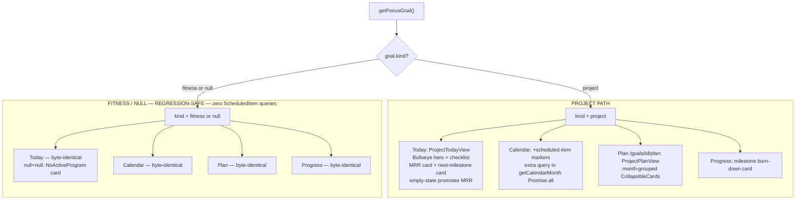
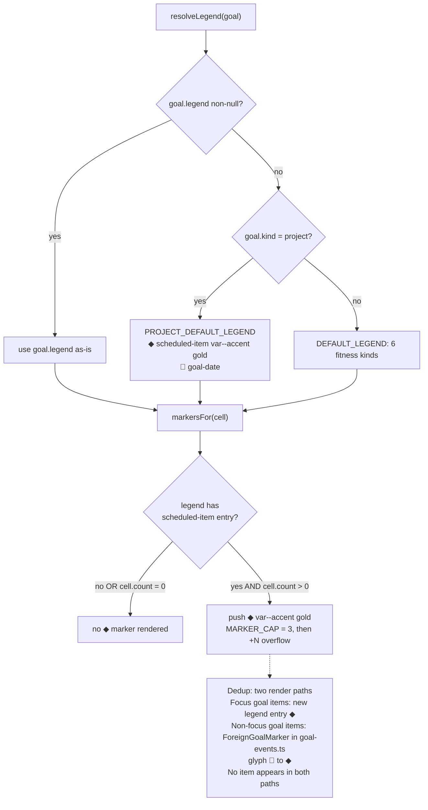
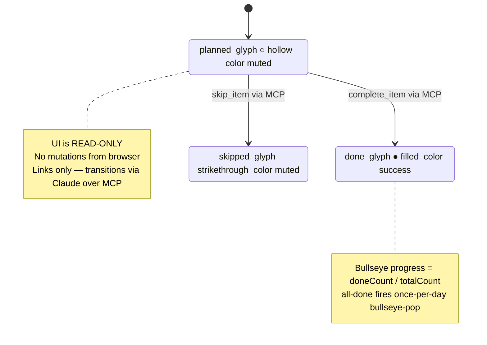

# UX Research — Sprint 4: Goal-Type-Aware Project UI

**Feature:** Roadmap issues #35–#40, #58 · **PRD:** `docs/prds/PRD-sprint-4-project-ui.md`
**Profile:** goaldmine (active) · **Surfaces:** Project Today · Calendar scheduled-item marker · Project Plan timeline · Milestone burn-down
**Pixel artifact:** `docs/ux-research/sprint-4-project-ui.mockup.html` (open in a browser — light + dark, 390px)
**Status:** research complete; §5 of the PRD to be finalized from this; Recommendation Ledger `Status` column ticked by the implementing PR.

> Read-only feature: every surface is a server component; the UI never mutates ScheduledItems — mutations happen conversationally via Claude over MCP (plan-is-conversational). Links only.

---

## 1. Current-State Audit

| # | Location | Problem | User impact |
|---|----------|---------|-------------|
| A | `src/app/page.tsx` (Today) | Renders the fitness body unconditionally; no focus-goal `kind` branch. | The W7 landmine: with chewgether in focus, Today silently shows the fitness QuestCard/blocks. Switching focus does nothing visible — "what do I do today" is unanswerable for the project vertical. |
| B | `src/lib/calendar.ts` `getCalendarMonth()` (~:108) | Focus-goal `select` is `{id,targetDate,objective,legend}` — no `kind`; no ScheduledItem query in the `Promise.all`. | The focus project goal's scheduled items are invisible on the month grid. Launch deadlines never appear. |
| C | `src/lib/legend.ts` | `LegendKindSchema` is a closed 6-kind enum; `DEFAULT_LEGEND` is hike-flavored. A project goal's `legend` is typically null. | With a null legend, `markersFor()` silently suppresses any project markers — markers would never render even after query plumbing lands (PRD §3.2.1). |
| D | `src/components/CalendarMonth.tsx` `markersFor()` + `src/components/MarkerIcon.tsx` | No `scheduled-item` push branch; no icon render branch for it. | No glyph exists for project work items; adding one is a closed-enum, multi-file change. |
| E | `src/lib/goal-events.ts` (~:184) | Foreign (non-focus) scheduled-item events hardcode `icon: "📅"`. | The calendar marker vocabulary is inconsistent and the emoji is visually heavy at 13px. |
| F | `src/app/goals/[id]/plan/page.tsx` | Only the fitness weekly-rotation view (7 `DayCard`s, phases, baselines). | A project goal has no timeline shape — no shared "scheduled vs upcoming" view with the coach. |
| G | `src/app/progress/page.tsx` | Readiness + weight cards; `goal.kind` is fetched but unused. | No "am I tracking toward $1k MRR" answer without opening a coaching chat. |

**Path note for implementers:** Today lives at `src/app/page.tsx` (route `/`), per PRD §4.4 and the profile screen inventory — not a `(app)/today/` route group. Disregard any route-group paths in upstream scratch notes.

---

## 2. Chosen Direction — "QuestCard Hero" (with grafts)

The PRD's load-bearing requirement is that Project Today answer "what do I do today" with **the same immediacy the fitness QuestCard does**. The chosen direction delivers that by reusing the brand's signature hero: a `<section>` accent-soft ribbon with a 2px left accent rail, anchored by a **live Bullseye** rendered at `progress = doneCount / todayTotal` (hollow at 0, filling center-out via the existing `Bullseye` SVG), with today's ScheduledItems checklist **inside** the ribbon. Below it stack two plain Cards — MRR (big number pair + thin accent bar, no chart) and next-milestone (single compact line + urgency chip). Completing the last item of the day fires the once-per-day `bullseye-pop` — a genuine, on-thesis completion moment that creates visual parity between the fitness and project verticals (and reinforces the §1.3 regression-symmetry goal from the user's side).

**Grafted from the runner-up ("Calm Stack," Direction B):** the explicit "Today's work" framing and a "`N done · M remaining`" tally for fast scannability; B's single-line restraint on the next-milestone card (no stat grid there — it answers "what's next + how urgent" in one line); and B's empty-state promotion of the MRR card to the top slot when nothing is scheduled today. Direction B was not chosen as the base because its calm card-stack makes immediacy merely positional and lets the Bullseye motif go dormant on the primary daily surface — exactly the immediacy the PRD asks us to preserve.

The other three surfaces had strong cross-specialist agreement and carry low divergence: ◆ calendar marker, month-grouped collapsible timeline, and a Bullseye-free burn-down card (details below).

---

## 3. Phase-A Options (ASCII, divergent)

<details>
<summary><strong>Direction A — "QuestCard Hero" (CHOSEN)</strong> — ribbon anchor + live Bullseye + checklist inside</summary>

```
╔──────────────────────────────────────────────────╮  section: rounded-2xl border --border
║ chewgether                    [23d to launch]    │  bg --accent-soft; border-l 2px --accent
║ $1,000 MRR · Fri Jun 12                          │  eyeline text-xs --muted; chip --accent
║  ◉   2 of 5 done today                          │  Bullseye 28px progress=0.4 (rings fill)
║  ●   Set up Stripe billing        [task]    →   │  ● done --success / ○ planned
║  ●   Draft landing page copy      [task]    →   │  [badge] text-xs chip; → link --accent
║  ○   Write onboarding email       [task]    →   │
║  ○   Ship v1.0 to beta users      [launch]  →   │  5/5 done → bullseye-pop (once/day/goal)
║  ○   Close first 3 paying cust.   [ms]      →   │
╚──────────────────────────────────────────────────╯

╭ MRR Progress                         chewgether ─╮  $450 text-4xl · /$1,000 --muted
│  $450  / $1,000 target                           │  bar h-1.5 --accent 45% on --border track
│  ━━━━━━━━━━━━━━━━━━━━━─────────────  45%         │  NO sparkline (restraint)
╰──────────────────────────────────────────────────╯

╭ Next milestone ──────────────────────────────────╮  single line + urgency chip
│ Ship v1.0 to beta users              [! 13d]     │  ≤14d → --warning · overdue → --danger
│ Jun 25, 2026                                     │
╰──────────────────────────────────────────────────╯
Empty state: ribbon Bullseye hollow + "Nothing scheduled today —
open Claude to plan tomorrow or log MRR." MRR card promotes to slot 2.
```
</details>

<details>
<summary>Direction B — "Calm Stack" (runner-up)</summary>

```
╭ Today's work          Fri Jun 12 · 2/5 ──────────╮  checklist as first/tallest Card
│  ●  Set up Stripe billing        [task]    →     │  no ribbon, no Bullseye on Today
│  ○  Ship v1.0 to beta users      [launch]  →     │  hierarchy via order + whitespace
│  2 done · 3 remaining                            │  (calmer; brand motif dormant here)
╰──────────────────────────────────────────────────╯
[ MRR Card ]  [ Next-milestone Card ]   (same as A)
```
Grafted into the chosen design: the "Today's work" label + "N done · M remaining" tally,
the compact one-line milestone card, and empty-state MRR promotion.
</details>

<details>
<summary>Settled companion surfaces (identical under both directions)</summary>

```
CALENDAR ROW (13px markers, MARKER_CAP 3, +N overflow)
 9    10     11      12    13   14   15
 ◆    ◆ ●   ◆ ● ◎    🏔    ◎              ◆
              +1
 ◆ = scheduled-item (--accent gold)   ● = trained (--target red Bullseye)
 ◎ = baseline (ring-with-dot)         🏔 = goal-date

PLAN TIMELINE
  3 / 7 milestones complete           (top, big-number)
  ▼ June 2026 · 3/7 done
    ●  [ms]     Ship v1.0 to beta users        Jun 25
    ○  [task]   Write onboarding email         Jun 20
  ▶ July 2026 · 0/4 done   (CollapsibleCard, closed)

BURN-DOWN (Progress)
  3 / 7 milestones complete
  [ 7 total ] [ 3 done ] [ 4 remaining ]
  ━━━━━━━━━─────────────  (thin accent scope bar; NO Bullseye)
  Next: Close first 3 paying customers · Jun 30 · 18d
```
</details>

---

## 4. Phase-B Technical Artifacts

### 4.1 Focus-goal kind branch across the four surfaces
Answers which surfaces get new project components and which must stay byte-identical (regression-safe).



### 4.2 Calendar legend resolution + scheduled-item marker (PROJECT_DEFAULT_LEGEND fallback)
Documents PRD §3.2.1 and the focus-vs-foreign dedup.



### 4.3 ScheduledItem status → glyph mapping (transitions are MCP-only)
Answers which glyph/token each status maps to and confirms the UI never mutates state.



### 4.4 Pixel artifact
`docs/ux-research/sprint-4-project-ui.mockup.html` — self-contained, real `globals.css` tokens, light + dark side by side at 390px. Renders Project Today (hero + MRR + milestone), the calendar marker row, and the burn-down card. Use it to verify ◆ vs ◎ vs 🏔 legibility at 13px and the type-badge contrast on cream before shipping.

---

## 5. Animation Storyboard

Exactly **one** motion moment; no new keyframe (reuses `bullseye-pop`, `globals.css` ~:112). No gantt is included because there is precisely one tween. All timings are ⚠ provisional ranges — playtest/visually verify.

| Frame | ~Elapsed | State | User perceives |
|-------|----------|-------|----------------|
| 0 | t=0 (ref) | Hero Bullseye partial fill (N-1/N rings); checklist has one hollow ○ | Work underway; partial target |
| 1 | off-app → next render | Last item flipped done via MCP; server passes `progress=1`; SSR paints filled Bullseye before effect | Page greets them with filled glyph + "complete" copy |
| 2 | 0–~10ms | keyframe 0%: `scale(0.6) opacity:0` (⚠ may nudge entry to 0.7–0.75 at 28px) | Glyph momentarily compressed/faded |
| 3 | ~160–220ms | keyframe 60%: `scale(1.08) opacity:1` | Satisfying "punch" overshoot |
| 4 | ~280–320ms | keyframe 100%: `scale(1.0)` filled, rest; localStorage gate set | One-shot punctuation; no loop |

**Off-tap subtlety (⚠ design judgment for sign-off):** because items are completed via Claude/MCP, the pop lands on the user's *next* visit to Today that day, not on a tap. The fitness path already has this exact property (MCP-logged workouts) and it is accepted — but confirm it still feels earned for project goals. If not, suppress the pop and show only the filled state (functionally identical to the reduced-motion path).

**Reduced motion:** `@media (prefers-reduced-motion: reduce)` already sets `.bullseye-pop { animation: none }` — the Bullseye renders filled instantly, no tween.

**Do NOT animate** (restraint — these are reference/browse surfaces, not completion moments): the MRR bar fill, the ◆ calendar marker, the timeline rows, the burn-down bar. At most the existing default CSS `width` transition (≤200ms ⚠) on progress bars; no entrance/stagger animation.

---

## 6. Behavioral Psychology Principles (core)

| Principle | Where it's applied | Why it works here |
|-----------|--------------------|-------------------|
| **Zeigarnik effect** (open loops pull return) | Checklist is the hero anchor, first thing rendered | An unresolved checklist creates the tension that brings the user back; burying it under metrics adds a context-switch before the user knows what to do |
| **Goal-gradient** (effort rises near the finish) | Next-milestone "days remaining" chip + burn-down "remaining" stat | Deadline proximity and a shrinking remainder concentrate effort; urgency lives on Today (action surface), reflection on Progress |
| **Progress-to-target salience** | MRR "$450 / $1,000" big-number pair, always in view | A concrete target with current position is more motivating than a point-in-time balance (banking-app idiom) |
| **Endowed progress / completion** | `bullseye-pop` when all today's items are done | A rare, gated celebration reinforces the completion habit without becoming decorative noise |
| **Cognitive-load reduction** | Single calendar glyph (◆) = "presence of work," type detail deferred one tap | A scannable dot/diamond resolves in <200ms mid-task; four type-glyphs would force legend-reading |
| **Honest density** (absence is signal) | Timeline shows month structure; empty months are suppressed rather than faked | The UI never invents prescription detail; copy stays neutral ("Nothing scheduled"), never diagnostic |

---

## 7. Implementation Scope

| File | Change | Complexity |
|------|--------|-----------|
| `src/app/page.tsx` | Parallel `getFocusGoal()` fetch + `kind` branch; fitness JSX untouched/byte-identical; pass `focusGoalId` into the root `Promise.all` so project queries stay parallel (no waterfall) | Moderate |
| `src/components/ProjectTodayView.tsx` (NEW, server) | One `Promise.all`: today's items (`startOfDay..endOfDay`), latest `mrr` LogEntry, next planned `milestone`, upcoming-7d items. Hero ribbon + checklist (`min-h-[44px]` link rows) + MRR card + milestone card + empty state | Moderate |
| `src/lib/legend.ts` | Extend `LegendKindSchema` with `'scheduled-item'` (enum extended, not replaced) + `.describe()`; add `PROJECT_DEFAULT_LEGEND`; `resolveLegend` fallback when `kind==='project'` && legend null | Moderate |
| `src/components/MarkerIcon.tsx` | New branch: `scheduled-item` → `<span style={{fontSize:size,color:'var(--accent)'}}>◆</span>` | Trivial |
| `src/components/CalendarMonth.tsx` | `markersFor()` pushes `scheduled-item` when `cell.scheduledItemCount > 0` (after baseline, before goal-date); MARKER_CAP unchanged | Trivial |
| `src/lib/calendar.ts` | `CalendarDayCell` gains `scheduledItemCount: number` (0 default); add gated `ScheduledItem` query (`goal?.kind==='project'`, `status IN planned,done`) to the existing `Promise.all`; bucket by `dateKey()`; goal `select` gains `kind` | Moderate |
| `src/lib/goal-events.ts` (~:184) | Foreign `scheduled-item` event icon `"📅"` → `"◆"` (consistency with focus-goal glyph) | Trivial |
| `src/app/goals/[id]/plan/page.tsx` + `src/components/ProjectPlanView.tsx` (NEW, server) | Branch on `goal.kind`; items ordered date asc, grouped by `yyyy-mm` (server-side, no lib); `CollapsibleCard` per month (current month `defaultOpen`); per-month `X/Y done` header; top `X of Y milestones complete`; suppress empty months; fitness path unchanged | Trivial–Moderate |
| `src/app/progress/page.tsx` (+ optional `MilestoneBurnDown.tsx`) | Card gated on focus `kind==='project'` && milestone count > 0: `groupBy status` (one round-trip) → total/done/remaining 3-stat grid + thin accent scope bar + next-milestone line; zero queries for fitness | Trivial |

**Suggested identifiers / testIDs:** `project-today-view`, `project-today-checklist`, `project-today-item-<id>`, `mrr-progress-card`, `next-milestone-card`, `project-today-empty`, `cal-marker-scheduled-item`, `project-plan-view`, `plan-month-<yyyy-mm>`, `milestone-burndown-card`, `burndown-stat-total|done|remaining`.

**Status glyph spec (timeline + checklist):** planned `○` `text-[var(--muted)]`; done `●` `text-[var(--success)]`; skipped → `line-through text-[var(--muted)]` on the title (no extra glyph — avoids colliding with the existing `✕` skipped-workout mark). Type badges reuse the chip idiom: `task` neutral border/muted, `milestone` `--accent`/40, `launch-step` `--warning`/40, `review` neutral.

**No client components, no waterfalls, no new routes** — confirmed across all four surfaces. `TodayCelebration` (already `"use client"`) is the only client island; reuse it with a project-scoped key `goaldmine.project-celebrated.<goalId>.<dateKey>`.

---

## 8. Accessibility

- **Both themes** verified in the pixel artifact; all colors are `var(--…)` tokens (no literals). The mockup's Bullseye center uses `var(--target-fg)` — implementation must do the same, never a raw `#fff`.
- **Status icons** (`○`/`●`, ◆ marker) get `aria-label`/`title`; **type badges are text chips** (word + color, never color-only) so they survive color-blindness and grayscale.
- **Touch targets** ≥44px: checklist and timeline rows use `min-h-[44px]` link rows; CollapsibleCard summary is already `min-h-[44px]`.
- **Reduced motion:** the single `bullseye-pop` is already guarded; all other surfaces are static.
- **Contrast (⚠ verify before shipping):** (1) `--warning` text (#A8511A) on `--card` (#FFFBF0) for the `launch-step` badge at ~11–12px — confirm ≥4.5:1, bump size or `font-medium` if short; (2) `--target` red on `--card` in dark (#C0392B on #1A130C) for any text under 14px; (3) ◆ gold (#8A6212) on cream (#FFFBF0) ≈ 4.6:1 — passes the 3:1 graphical-object threshold, fine as an informational glyph.

---

## 9. ⚠ Provisional / Verify-Visually List

Confirm each on a real 390px screen before shipping (each maps to a `⚠` ledger row):

1. **◆ marker at 13px, both themes** (UXR-s4-04) — reads distinctly from ◎ (baseline ring-with-dot) and 🏔 (goal-date); gold-on-cream and gold-on-coal legible.
2. **Next-milestone urgency threshold = ≤14 days → warning** (UXR-s4-13) — playtest whether 14d is the right "getting close" cutoff for project milestones.
3. **bullseye-pop timing** (UXR-s4-15) — ~320ms total; entry `scale(0.6)` may need nudging to 0.7–0.75 at the 28px hero size to avoid a harsh snap.
4. **Bullseye ring discretization at low item counts** (UXR-s4-16) — `progress=done/total` fills discrete rings; at 1–2 items today the fill is coarse. Verify it still reads honestly (consider a minimum-of-2-rings or a numeric "N of M" lean if it misleads).
5. **Off-tap celebration timing** (UXR-s4-14) — the pop lands on the next Today visit, not at completion. Confirm it feels earned for project goals (parity with the accepted fitness behavior) or suppress.
6. **Contrast spots** (UXR-s4-18) — warning-on-cream small badge, target-red-on-coal small text.
7. **Bullseye center token** (UXR-s4-21) — implementation uses `var(--target-fg)`, never `#fff` (the mockup is corrected; guard the real component).

---

## Recommendation Ledger

IDs are stable (`UXR-s4-NN`) and never renumbered. `Status` starts blank; the implementing PR ticks each to shipped / reworked / dropped with a SHA or `file:line` + short reason. `⚠` rows (tuning/decoration/a11y) are the ones future audits care about most.

| ID | Recommendation | Type | Status | Evidence |
|----|----------------|------|--------|----------|
| UXR-s4-01 | Project Today = "QuestCard Hero": accent-soft ribbon + left accent rail, live Bullseye `progress=done/total`, checklist inside the ribbon as the visual anchor | layout | | |
| UXR-s4-02 | Empty state copy directs to Claude ("Nothing scheduled today — open Claude to plan tomorrow or log MRR"); promote MRR card to top slot when checklist empty; never "no data" | copy | | |
| UXR-s4-03 | MRR card = big number pair "$450 / $1,000" + thin `--accent` bar on `--border` track; NO sparkline/chart (restraint; scroll budget) | component | | |
| UXR-s4-04 | Calendar scheduled-item marker glyph = ◆ (U+25C6) in `var(--accent)` | decoration⚠ | | |
| UXR-s4-05 | `goal-events.ts` foreign scheduled-item icon 📅 → ◆ for cross-path consistency | component | | |
| UXR-s4-06 | `PROJECT_DEFAULT_LEGEND = [{◆ scheduled-item},{🎯 goal-date}]`; `resolveLegend` falls back when `kind==='project'` && legend null (PRD §3.2.1) | component | | |
| UXR-s4-07 | `markersFor()` pushes scheduled-item when `count>0` (after baseline, before goal-date); MARKER_CAP=3 unchanged; focus vs foreign dedup confirmed | layout | | |
| UXR-s4-08 | Project Plan timeline = `CollapsibleCard` per month (current `defaultOpen`), per-month "X/Y done" header, top-of-page "X of Y milestones complete" | layout | | |
| UXR-s4-09 | Status glyphs: planned ○ `--muted` / done ● `--success` / skipped strikethrough `--muted` (typography, not Bullseye-SVG; avoids ✕ collision) | component | | |
| UXR-s4-10 | Type badges: task neutral / milestone `--accent`/40 / launch-step `--warning`/40 / review neutral — text chips, not color-only | component | | |
| UXR-s4-11 | Suppress empty months in the timeline (honest density; no faked "(empty)" rows) | layout | | |
| UXR-s4-12 | Burn-down card = "X of Y" framing + 3-stat grid (total/done/remaining) + thin `--accent` scope bar + next-milestone line; Bullseye deliberately NOT used (reserved for completion moments) | layout | | |
| UXR-s4-13 | Next-milestone urgency chip thresholds: neutral / `--warning` ≤14d / `--danger` overdue | tuning⚠ | | |
| UXR-s4-14 | Fire once-per-day `bullseye-pop` when all of today's project items are done; project-scoped localStorage key; reduced-motion → filled, no pop. Off-tap timing flagged for sign-off | animation | | |
| UXR-s4-15 | Reuse `bullseye-pop` keyframe (~320ms range); entry `scale(0.6)` may nudge to 0.7–0.75 at 28px | tuning⚠ | | |
| UXR-s4-16 | Bullseye ring discretization at 1–2 items reads coarse — verify it stays honest at low counts | tuning⚠ | | |
| UXR-s4-17 | Do-not-animate list (MRR bar, ◆ marker, timeline rows, burn-down bar); at most ≤200ms width transition, no entrance/stagger | animation | | |
| UXR-s4-18 | Verify contrast: warning-on-cream small badge, target-red-on-coal <14px, ◆ gold-on-cream | a11y⚠ | | |
| UXR-s4-19 | Status icons get aria-label/title; badges are word+color text chips | a11y | | |
| UXR-s4-20 | `ProjectTodayView` does one `Promise.all` (items today, latest mrr, next milestone, upcoming-7d); pass `focusGoalId` from the root parallel fetch — no waterfall, no client fetch | component | | |
| UXR-s4-21 | Bullseye center fill uses `var(--target-fg)`, never raw `#fff` | tuning⚠ | | |
