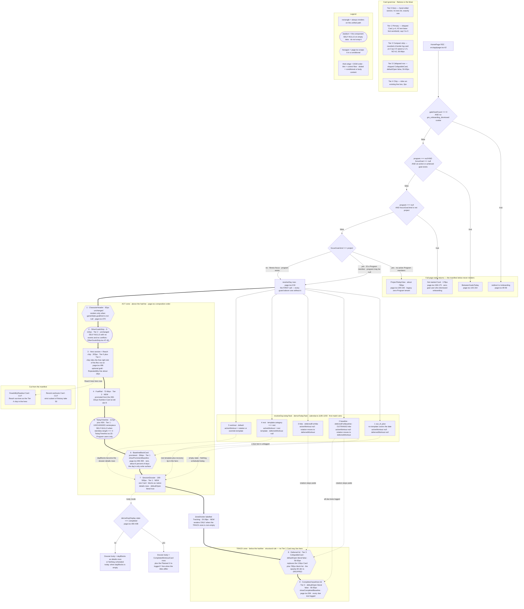
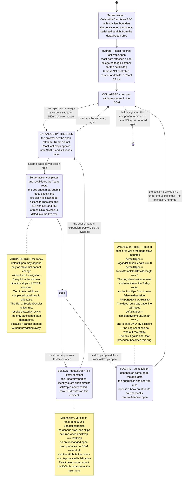
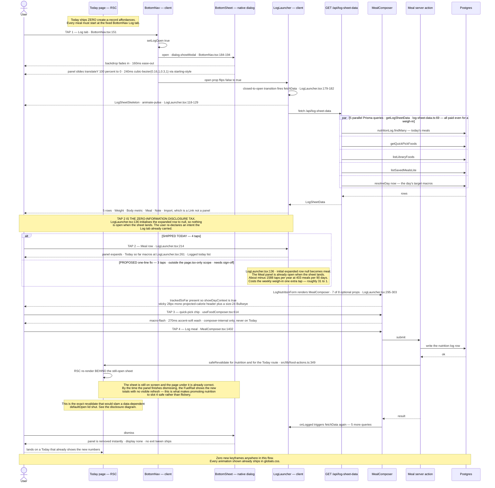

# Today-page Information-Architecture Consolidation

**Slug:** `today-page-ia` · **Date:** 2026-08-10 · **Scope:** `src/app/page.tsx` composition ONLY
**Ledger:** [`today-page-ia-ledger.md`](./today-page-ia-ledger.md) · **Pixel mockup:** [`today-page-ia.html`](./today-page-ia.html)
**Profile:** `.claude/skills/ux-research/profiles/goaldmine.profile.md` · flavor layer: off (neutral analytical core only)

> **Owner's words (2026-08-10):** *"all the logging is bloating the interface... consolidate and/or better organize it for what is used most at the top. I don't view Reach very much and it's at the very top. I log nutrition all the time, and it's at the bottom."*

---

## 0. The reframe — read this before anything else

The owner diagnosed the symptom precisely and the cause inversely.

Every interactive element in Today's body was audited. **Today contains exactly two write controls:**

- `LogBaselineInlineForm` inside `BaselineBlockCard` (`src/components/BaselineBlockCard.tsx:64`) — reachable on **9 of 140 days (6.4%)**
- `MealEditButton` inside `NutritionToday` (`src/components/NutritionToday.tsx:213`) — **edits an existing meal only; it cannot create one**

The inline meal composer was already switched off: `src/app/page.tsx:630` passes `showLogForm={false}`, with the comment at `:621` reading *"suppress inline log form — Log sheet owns it."* Workouts arrive via claude.ai/MCP or Strong import. Meals, weight and notes arrive through the Log sheet in the bottom nav.

**So what is bloating Today is not logging UI. It is logged-data readout.** That forbids the obvious fix (hoist a composer to the top) and points at a better one (hoist the *number*).

### The governing rule this pass adopts

> **Read frequency drives vertical order. Write frequency drives tap-count and thumb-zone placement. Never trade one for the other.**

Nutrition wins on both axes but collects in different currencies. Its *scalar* moves into the glance zone; its *composer* stays in the thumb zone — a fixed bottom-edge tab, already the ergonomic optimum — and gets its disclosure tax removed.

| Path | Today | Cost |
|---|---|---|
| Today → **log** a meal | 4 taps (Log · Meal row · quick-pick · Save) | already near-optimal, bottom-edge Fitts target |
| Today → **read** remaining calories | ~2 screen-scrolls + visual search of a 3-slot list | **~9 screen-scrolls/day, ~3,300/yr** |

**The nutrition grievance is a scroll grievance, not a tap grievance.** Everything below follows from that sentence.

---

## 1. Current-state audit

`src/app/page.tsx` is 714 lines, `export const dynamic = "force-dynamic"` at `:40`. Container is `max-w-md mx-auto p-4 space-y-4` at `:468` — content column **358px**, Card interior **326px**, uniform **16px** gap between every top-level child.

### 1.1 Measured render order

| # | Surface | `file:line` | Condition | S/C | Height @390px | Kind |
|---|---|---|---|---|---|---|
| 1 | `CharacterHeader` | `:470-472` | `gameState.goalKind !== null` | S | **92** (118 if attrs wrap) | link → `/character` |
| 2 | `OtherGoalsStrip` | `:480-485` | self-nulls at `OtherGoalsStrip.tsx:47-49` | S | **0 / 42–110** (typ. 68) | info |
| 3 | hero `<section>` | `:488-543` | always | S | **205** | info + the day's one completion moment |
| 3a | eyeline `Week N · Phase i · name` | `:496-504` | always | S | 16 | info |
| 3b | `<h1 text-2xl>` workout title | `:509-518` | always | S | 32 (64 if wraps) | info |
| 3c | dayLabel + summary | `:521-525` | always | S | 40 | info |
| 3d | `QuestCard` (hosts `TodayCelebration`) | `:529-534` | always | S | 46 pre / ~92 post | the bullseye-pop |
| 3e | rest-day recovery tip | `:537-542` | `isRestDay && restCopy` (null for non-fitness) | S | 57 | info |
| 4 | **`TodayTimeline`** (Marked Lane) | `:550` | self-nulls at `TodayTimeline.tsx:33` — Program users only | S | **117 + 45N** (N=5 → 342) | rows link → `/days/{key}` |
| 5 | **`FeasibilityReadout`** ("Reach") | `:555-561` | `feasibility` truthy | S | **198** (2 targets) / **248** (3); 90–110 unrated | info |
| 6 | `BaselineBlockCard` prominent | `:565-567` | `showProminentBaseline` `:392-393` | S | **94 + 92/test** → 3 = **394** | **write surface** |
| 7a | naked `<p>` `Planned X → logged Y` | `:575-579` | completed && titles differ | S | 16 | info, not in a Card |
| 7b | `CompletedWorkoutCard` × n | `:580-582` | completed | S | **98 + ~88/exercise** → 5ex = **586** | tallest surface in the app |
| 7c | naked `<p>` "Nothing scheduled today." | `:586-587` | `!completed && dayBlocks.length === 0` | S | 20 | **prints a lie on baseline days** |
| 7d | `BlockCard` × n (local, unexported, `:661-677`) | `:589-591` | not completed, blocks exist | S | **94 + 44/exercise** | info only, no logging affordance |
| 7e | deferred banner Card | `:598-604` | `deferredTemplate && deferredBlocks.length` | S | **134** | info |
| 7f | dimmed `opacity-60` deferred stack | `:605-609` | same | S | **~250/block** → 3 = **782** | info |
| 8 | `BaselineBlockCard` demoted | `:617-619` | all due tests logged `:394` | S | 94 + 64/test | info |
| 9 | `Card "Nutrition"` + `NutritionToday` | `:622-631` | **always** | S | 3 slots **283** / 4 slots **331** / empty 90 | read-only slot list |
| 10 | `Card "Recent workouts"` | `:634-656` | `length > 0` | S | **146** | links → `/workouts/{id}` |

Four client islands on the whole path — `TodayCelebration`, `LogBaselineInlineForm`, `LevelUpCelebration`, `MealEditButton`. Zero client fetching. Invariants currently hold.

### 1.2 Viewport arithmetic

`AppHeader` is `sticky top-0 z-30`, inner `h-12` + 1px border = **49px** (`AppHeader.tsx:31-32`). `BottomNav` is `fixed bottom-0 z-40`, `py-3` (24) + Bullseye 6 + `gap-0.5` (2) + `text-sm` line-box (20) + border (1) = **53px** (`BottomNav.tsx:112,122`). `<main className="flex-1 pb-20">` (`layout.tsx:111`) = 80px clearance.

**⚠ Measurement conflict, unresolved:** two independent passes measured the nav at 53px and 58px, giving a fold at **742px** or **737px**. The pixel mockup draws it at 742 and flags it. Resolve on device before quoting either number — it changes which timeline row is clipped. *(Ledger `UXR-TIA-53`.)*

### 1.3 Day shapes and scroll depth (measured)

| Day shape | Total | Screens |
|---|---|---|
| Normal training, 1 block | ~1,770 | 2.4 |
| Normal training, 3 blocks | ~2,300 | 3.1 |
| Completed-workout day (5 ex) | ~2,090–2,600 | 2.8–3.5 |
| **Baseline / S-day** | **~2,810** | **3.8 — the worst shape** |
| Rest day | ~1,375 | 1.9 |
| Project-kind focus, no Program | ~780 (early return `:190-193`) | 1.1 |
| Zero-row new user | `redirect("/onboarding")` `:49-56`; if dismissed, a 178px "Get started" Card | 0.2 |

### 1.4 The five defects this pass fixes

1. **The frequency inversion.** Reach sits at vertical position 5 with a read frequency of roughly **one glance per month**; the nutrition scalar — read ~4.5×/day — does not exist as a surface at all. To learn "how many calories do I have left" the owner scrolls to the Day-total strip (`NutritionToday.tsx:255-310`) at px ~1,530–1,650, **screen 3**, about 4.5 times a day.

2. **Zero progressive disclosure.** Not one `<details>`, `<summary>`, `aria-expanded`, or `CollapsibleCard` appears in `page.tsx` or any of its 11 children — while **11 other files** use the native-`<details>` house pattern and `src/app/days/[dateKey]/page.tsx:287` already collapses the exact same prescription content with `defaultOpen={completedWorkouts.length === 0}`.

3. **The baseline-day lie.** On an S-day `activeWorkout` is null by construction, so `dayBlocks` is empty and `page.tsx:587` prints **"Nothing scheduled today."** — sandwiched between a 394px baseline card that *is* the day's schedule and 916px of deferred prescription. The page contradicts itself twice in one viewport.

4. **An honesty bug on the most-used surface.** `Bullseye.tsx:136-143` computes rings as `ceil(progress × 4)`; at `size ≥ 20` that means **any progress above 0.75 renders byte-identical to `filled`**. The shipped nutrition day-total strip uses `size={20}`. At 1,840/2,600 (70.8%) it shows 3 of 4 rings — one 200-cal snack puts it at 78% and it is **indistinguishable from done**. `CeilingRule.tsx:11-12` already ruled on this class: *"Never an arc, never a ring, never the Bullseye (R6; F2 proved Bullseye progress={0.8} renders as 'done')."*

5. **An AA failure.** The deferred stack's `opacity-60` on `--muted` text (`#7A5E3A` at 60% over `#FFFBF0` ≈ `#B29B7C`) computes to roughly **2.6:1** — a fail, on content the owner can open. *(⚠ verify the exact ratio.)*

### 1.5 Duplication and dead weight

| Item | Evidence |
|---|---|
| **Reach is a byte-for-byte duplicate** | `page.tsx:556-560` vs `src/app/goals/[id]/page.tsx:604` — same component, same three props. A compact `ReachMeter` chip also ships on `/goals:203`, `/goals/[id]`, `/character`. Today is the third-plus render. |
| **Recent workouts is a strict subset of `/history`** | `history/page.tsx:11-16` takes 50; Today's card links there itself (`:638`). Worse: **today's completed workout renders twice** — as `CompletedWorkoutCard` at `:580` and again as a row at `:645`. |
| **Recent workouts over-fetches** | `:213-218` uses `include: {exercises: {include: {sets: true}}}` but consumes only `title`, `startedAt`, `exercises.length` (`:647-650`). Every set row for 3 workouts, fetched and discarded. |
| **Never-rendered reads** | `resolved.mobilityText`, `.notes`, `.notesAboutDate`, `.longEffortConflict`, `.orphanedOverride`, `.confidence`, `.resolvedPlan`, `display.primaryWorkoutId` — all fetched, none surfaced. |
| **Wasted quick-picks** | `quickPickFoods` (8 rows, `:228`) reaches only `MealEditButton`'s sheet; fully wasted for a user with 0 meals logged today. |
| **~45–60 Prisma queries per render** | `computeGameState()` alone runs 10 parallel **all-time, unbounded** queries (`engine.ts:1054-1070`); `resolveDay` ≈18–20; `getActiveProgram()` is **not** `cache()`-wrapped (`program.ts:98`) and is invoked ≥5× per render ≈ 10 duplicate queries. |
| **The sharpest gap** | The owner's **highest-cadence action — rolling attempt-sets, every PM skill session — has no Today surface at all.** `grep rolling src/**/*.tsx` returns zero UI hits. It reaches him only through `computeReadiness` on `/progress` and the `perTarget` rows *inside the Reach card he says he doesn't read* (`FeasibilityReadout.tsx:153`). Highest-frequency write, lowest-visibility read. |

### 1.6 Frequency ranking with evidence

Write frequency = user-initiated writes into that domain, wherever the write happens. Read frequency = distinct glances per day.

| # | Surface | Write | Read | Evidence | Now | Proposed |
|---|---|---|---|---|---|---|
| 1 | Hero orientation (week/phase, h1, QuestCard) | 0 | 1–2/day | precondition for every other read | 3 | **1–3** |
| 2 | **Nutrition scalar** (remaining vs target) | ~4.5/day | **~4.5/day** | 403 logs / ~90 days; one read precedes each eating decision | **does not exist** | **4** |
| 3 | `TodayTimeline` (Marked Lane) | 0 | 2–3/day | owner-approved centerpiece; the day's full ask across all goals | 4 | **5** |
| 4 | Day-task detail (baselines / blocks / completed) | ~daily via MCP | 1 burst/day, high intensity | thesis: *"dead-simple to use on a phone mid-workout"* | 6, 7 | **6–7** |
| 5 | Nutrition slot detail (planned + logged list) | 0 (edit only) | 0.5–1/day | you re-read the *budget*, not the *history* | 9 | **/nutrition + Log sheet** |
| 6 | Deferred prescription stack | 0 | ~0 | explicitly labelled not-today's-task; 782–916px | 7f | **8, collapsed** |
| 7 | Completed baselines (demoted) | 0 | ~0 | post-hoc reference on 6.4% of days | 8 | **9, collapsed** |
| 8 | **Reach / `FeasibilityReadout`** | 0 | **~0.03/day** | tier changes ~5× in 140 days; owner states he doesn't read it; duplicate of `/goals/[id]:604` | **5** | **chip in the hero eyeline** |
| 9 | Recent workouts | 0 | ~0 | strict subset of `/history`; duplicates today's own card | 10 | **CUT** |
| 10 | `CharacterHeader` | 0 | 1/day (streak) | streak is a real Zeigarnik hook; the game layer is deliberate product | 1 | **hold at 1** |

**Supporting evidence beyond the owner's counts.** `computeGameState` already loads all-time `NutritionLog` (`engine.ts:1092`) and all-time `Note{type:"review"}` (`engine.ts:1098`) on every Today render — the 403:7 ratio is already in server memory. And `FoodUsage` (`schema.prisma:636`) exists *purely* to rank nutrition quick-picks by `usageCount`/`lastUsedAt`; **no analogous frequency-optimisation model exists for any other log type.** That is the design already conceding nutrition's cadence.

Baseline cadence is structural, not anecdotal: the Phase 2A plan is 20 weeks = 140 days, baseline days are 3/week (`dayOfWeek` 1, 3, 4) only in weeks 1, 10, 19 (`retestWeeks:[10,19]`) → **9 of 140 days = 6.4%**.

*(Local `.env` is an isolated Neon dev branch, `DB_ENV=development`; no read-only total-count script exists. No prod query was run. The owner's figures stand as the evidence of record.)*

---

## 2. Chosen direction — "Fuel Rail + Weight Ladder"

**The page has ten top-level surfaces at four distinct information priorities but only one visual weight. Flatness is the bloat.** Reordering alone would not fix it: without a weight ladder, a reordered page is still ten equal cards and the owner files the same complaint about whatever lands at the bottom next. So the direction is a **tiered card grammar** plus a frequency-ranked manifest, with the nutrition *scalar* promoted to a compact strip and the nutrition *composer* left exactly where it already works. Reach — read about once a month and a byte-for-byte duplicate of `/goals/[id]` — collapses from a 198–248px Card to a 0px chip riding the hero eyeline's already-empty right slot; the deferred prescription stack collapses from 916px to a 56–60px lid; Recent workouts is cut outright. Every disclosure uses the shipped `CollapsibleCard`, and **the direction ships zero new keyframes and zero new CSS classes.**

**Grafted from the runners-up:** the *repeatability line* from Option C (the rolling attempt-set readout — the owner's highest-cadence action, currently invisible) as an explicitly optional Phase-2 item; and Option A's discipline of **literal-constant `defaultOpen` everywhere**, which turned out to be a correctness requirement rather than a style preference.

### 2.1 The tier grammar

Every tier is distinguished by type size, box padding, radius, and **the presence or absence of an `h2`** — zero hue dependence, so it survives the grayscale acceptance test intact.

| Tier | Shell | Label | Height | Cap |
|---|---|---|---|---|
| **0 Hero** | existing hand-rolled `<section>` (`page.tsx:489`), Card-like + `space-y-3` | `h1 text-2xl font-semibold tracking-tight` | 205px | exactly 1 |
| **1 Primary card** | shipped `Card` — `rounded-2xl border p-4 shadow-sm`, header `mb-3` | `h2 text-base font-semibold tracking-tight` | variable | **2–3 ⚠ playtest** |
| **2 Compact strip** | `rounded-xl border border-[var(--border)] bg-[var(--card)] px-3 py-2.5 space-y-1.5` (verbatim `OtherGoalsStrip.tsx:68`) | **no `h2`** — eyebrow `text-[10px] font-semibold uppercase tracking-wide text-[var(--muted)]` | **56–84px ⚠** | unlimited |
| **3 Collapsed row** | shipped `CollapsibleCard`, `defaultOpen={false}` | `h2 text-base font-semibold` + `▼` + a right-rail digest | **56–60px ⚠** | unlimited |
| **4 Chip** | none — rides an existing line box | `ReachMeter` / `TypeBadge` / `GoalMark` | **0px** | unlimited |

**Tier 2's defining trait is the absence of an `h2`** — that is what lets a strip sit beside a card without competing. Tier 3 shares Tier 1's type but is disambiguated by the `▼` and by an always-present digest: **a closed lid must never be an empty lid.**

**Structural rule, lintable by eye: no TRACK-zone surface may be a Tier 1 Card.** That is what prevents the flat-ten-cards regression structurally rather than by taste.

### 2.2 The new manifest

```
ACT
 1  CharacterHeader                     92px       T1   unchanged, cond gameState.goalKind !== null
 2  OtherGoalsStrip                     0–110px    T2   unchanged, self-nulls
 3  Hero  + Reach chip                  205px      T0+T4  chip rides the FREE right slot at page.tsx:496
    └ optional graft: Repeatability     ~18px           "Handstand ≥20s · 3 of 6 sessions · 2 today"
 4  ★ FuelRail                          72–84px ⚠  T2   NEW — was the 283–331px Nutrition Card at slot 9
 5  TodayTimeline                       117+45N    T1   UNCHANGED — owner-approved centerpiece
 6  BaselineBlockCard prominent         394px      T1   cond, 6.4% of days, the day's only write surface
 7  ★ SessionDossier                    190–500px ⚠ T1  NEW — one Card, blocks as native <details> rows
──  Tracking ──────────────────────     20–28px ⚠       ★ ZoneDivider, only when TRACK is non-empty
TRACK
 8  Deferred lid                        56–60px ⚠  T3   was 134 + 782 = 916px; opacity-60 DROPPED
 9  Completed-baselines lid             56–60px ⚠  T3   cond
──  FeasibilityReadout Card             CUT             Reach survives as the Tier-4 chip
──  Recent workouts Card                CUT             strict subset of /history take:50
```

**Two binding constraints held.** The FuelRail sits **above the whole timeline Card**, never between rows — `MarkLane` is a right-aligned fixed `w-[64px] shrink-0` column whose legibility depends on position constancy across rows. And the timeline's card width, padding, row height, glyph grammar and sort order are untouched.

### 2.3 Why nutrition detail moves *below* the day-task zone despite the complaint

The product thesis is explicit: *"dead-simple to use on a phone mid-workout."* The prescription is the only surface read under physical load, with a stopwatch running and one hand free. Nutrition detail is read at a table. Static vertical order cannot adapt, so the surface with the harsher usage context wins the better slot.

**What moves up is nutrition's number (72–84px), not nutrition's card (283–331px).** This is the faithful reading of the request rather than the literal one, and it is defensible to the owner: the thing he actually wanted at the top now *is* at the top, at one quarter of the height.

This also does not fight the rhythm ladder. `RHYTHM_SLOTS` (`day-rhythm.ts:44-53`) places `fuel` 7th of 8, but that ladder is **chronological**, not prioritised — it models when things happen in a day. The FuelRail is not a timeline row; it is a persistent day-state readout, the same class of object as the week/phase eyeline.

### 2.4 Component specs

**★ FuelRail** — `src/components/today/FuelRail.tsx`, server component, whole strip is one `<Link href="/nutrition">`.

```
Container  Link  block rounded-xl border border-[var(--border)] bg-[var(--card)]
                 px-3 py-2.5 space-y-1.5 min-h-[44px]
                 focus-visible:outline-none focus-visible:ring-2 focus-visible:ring-[var(--accent)]
Line 1     flex items-baseline justify-between gap-2
           eyebrow   "FUEL"  text-[10px] uppercase tracking-wide text-[var(--muted)]
           headline  "1,840 / 2,600 cal"  text-base font-mono font-medium tabular-nums
           action    "All →"  text-sm text-[var(--accent)]  (ml-auto)
Meter      h-1.5 rounded-full bg-[var(--border)]/60 overflow-hidden
             + fill  h-full rounded-full bg-[var(--accent)]  style width:70.8%
           role="progressbar" aria-valuenow aria-valuemin={0} aria-valuemax={100}
Line 3     "760 left · 152p 186c 58f · 2 meals"  text-xs text-[var(--muted)] tabular-nums
```

| | light | dark |
|---|---|---|
| card bg | `#FFFBF0` | `#1A130C` |
| border | `#D9C8A2` | `#3A2E1F` |
| headline fg | `#1F1408` | `#F4E9D4` |
| eyebrow / subline | `#7A5E3A` (5.82:1) | `#9C8866` (5.36:1) |
| meter track | `--border` @60% | `--border` @60% |
| meter fill / "All →" | `#8A6212` (5.29:1 text; ~4.3:1 vs track) | `#D4A437` (8.02:1 text; ~8:1 vs track) |

**⚠ Do NOT use a Bullseye here.** See defect 4 above. The `h-1.5 rounded-full` track + accent fill IS the house grammar for a partial readout (`CeilingRule.tsx:47`), and it is reused, not invented. **Grayscale test passes** — the meter's signal is fill-vs-track luminance, never hue-vs-hue, and the numeral carries the value in words regardless.

**🔴 BLOCKING correctness requirement.** `NutritionToday` sums with a plan-target fallback — a macro-less logged meal inherits its slot's planned macros (`NutritionToday.tsx:162-170`). `sumLoggedDayMacros` (`nutrition-macros.ts:31`) does not. If the FuelRail uses the plain sum while any other surface keeps the fallback sum, **the app displays two contradicting day totals.** For a product whose thesis word is *honest*, that is disqualifying. Extract a shared `sumLoggedDayMacrosWithPlanFallback(logs, plan)` into `src/lib/nutrition-macros.ts` and have both call it. *(Ledger `UXR-TIA-09`.)*

**Cost: zero extra queries.** `resolved.loggedNutrition`, `resolved.nutritionPlan` and `todayPhase` (`page.tsx:365`) are already in hand; `nutrition-macros.ts` helpers are pure. `TodayMacroSummary.tsx:14` already ships this shape and already `return null`s when empty (`:25`).

**Zero-row rule — a deliberate departure.** `TodayMacroSummary` returns `null` when empty. The FuelRail must **not**: a brand-new user needs to discover logging. Degrade to eyebrow + action + `Nothing logged yet` (date-neutral, matching `NutritionToday.tsx:187-190`), no meter. With logs but no plan target: headline + `No daily target set` (verbatim `NutritionToday.tsx:290`), no meter.

---

**★ Reach chip** — Tier 4, **0px**. The hero eyeline at `page.tsx:496` is already `<div className="flex items-center justify-between gap-2">` with **one child** — a reserved, currently empty right-hand slot. Drop in `<ReachMeter tier={feasibility.tier} label size="sm" />` (~5 segments of 3×9px, filled `var(--accent)`, empty `var(--border)`) plus `<span className="text-xs text-[var(--muted)] tabular-nums">12 wk</span>`, wrapped in a `<Link href={`/goals/${focusGoal.id}`}>` with `min-h-[44px] -my-2`. `aria-label="Reach: Rare — 3 of 5"`. **Never animated** (UXR-63-21, `ReachMeter.tsx:12`).

**Render the chip only when a tier exists.** Today a brand-new invited user with one un-dated goal gets a full Card reading *"No deadline set — Reach unrated."* — an apology occupying a fifth of their first screen. Under this direction they get nothing, which is the correct amount of nothing.

**⚠ The query win is NOT automatic — this correction matters.** `ReachMeter` needs `feasibility.tier` and the weeks label needs `weeksRemaining`; both come from the same `computeGoalFeasibility` call. **Cutting the card while keeping the chip saves 0 queries.** The saving requires a narrowed `getReachTier()` read. Sized honestly: `computeGoalFeasibility` (`rarity.ts:212`) costs up to 2 queries per target, and `observedSeriesFor` has **no `rolling:*` branch** — it falls through to `{points:[], current:null}`, so every rolling target *always* takes the `resolveMetricValue` fallback, which is a `goal.findUnique` plus an **unbounded all-history `workout.findMany` with nested exercises and sets** (`goal-targets.ts:173-190`), no lower date bound, no `take`. Phase 2A has 3 rolling handstand targets → three identical `findUnique` and three identical full-history scans per render. Cumulative metrics are worse: a **sequential** `resolveMetricValue` loop, one await per week of lookback (`rarity.ts:113-146`), up to 17 round-trips on a 16-week window. *(Ledger `UXR-TIA-15`.)*

---

**★ SessionDossier** — `src/components/today/SessionDossier.tsx`. One Tier-1 `Card` titled **"Session"** with the workout name as a muted right-aligned action. Inside, an `<ol className="divide-y divide-[var(--border)] -mx-1">` where each block is a native `<details>`:

```
summary   flex items-center justify-between gap-2 px-1 min-h-[44px]
          cursor-pointer list-none [&::-webkit-details-marker]:hidden
label     text-sm font-medium truncate          ← deliberately NOT text-base/600;
digest    text-xs tabular-nums text-[var(--muted)] shrink-0     that weight is Tiers 1/3
chevron   ▼  text-xs text-[var(--muted)] shrink-0
          motion-safe:transition-transform group-open:rotate-180
body      px-1 pb-3 pt-1 space-y-2   ← existing ExerciseRow / set <ul>, verbatim
```

Applies the `/days/[dateKey]:287` auto-collapse-when-logged doctrine — **but see the `defaultOpen` hazard below; ship a literal `true`.** Collapsed **190–215px ⚠**; fully open **440–500px ⚠**, against 496px for three separate Cards. Completed-day form: the receipt line `4:12 PM · 5 exercises · 18 sets` in the summary, the set list in the body. **Peak-end is preserved** (the receipt and the count are the day's reward) and the **IKEA effect** is respected (the user's typed work is acknowledged, not erased) while ~500px leaves the page.

---

**🔴 The `defaultOpen` hazard — the sharpest technical risk in this direction.**

`<details open>` is **uncontrolled after mount**. React writes the `open` DOM property only when the prop value changes between renders — verified in `react-dom` 19.2.4: the generic prop loop in `updateProperties` short-circuits on `nextProp === lastProp`, and `open` is handled as a boolean attribute (`setAttribute`/`removeAttribute`). There is no controlled resync for `details`.

- **Benign:** a user manually expands a lid, a server action fires `revalidatePath("/")`, React re-renders with the same literal `defaultOpen` → no DOM write → **the user's expansion survives.** React being wrong about the DOM is what saves the user here.
- **Hazard:** if `defaultOpen` depends on same-page-mutable data, the prop flips, `setProp` runs, React calls `removeAttribute("open")` and **the section slams shut under the reading finger** — no animation, no undo. The Log sheet's meal submit does exactly this: `safeRevalidate("/")` at `src/lib/food-actions.ts:349, 446, 541, 665`.
- So `defaultOpen={loggedNutrition.length === 0}` and `defaultOpen={todayCompletedDetails.length === 0}` are both **UNSAFE on Today**.
- **The `/days/[dateKey]:287` precedent is safe only by accident** — it holds because the Log sheet currently has no workout row (`LogLauncher.tsx:64-108` = Weight · Body metric · Meal · Note · Import). The day it gains one, that precedent becomes this bug. Comment the dependency.

> **ADOPTED RULE: `defaultOpen` may depend only on state that cannot change without a full navigation.** Every lid in this direction ships a literal constant — `false` for the Tier-3 lids, `true` for the SessionDossier. `resolveDay().todayTask` is the only sanctioned data dependency.

---

**★ ZoneDivider** — `flex items-center gap-2 px-1 py-1` → the word **"Tracking"** at `text-[10px] uppercase tracking-wide text-[var(--muted)]`, then `h-px flex-1 bg-[var(--border)]`. **20–28px ⚠.** Renders **only when the TRACK zone is non-empty** — an orphan label over nothing is exactly the near-empty-copy failure being fixed on Reach. On a normal day with Reach cut and Recent cut, the TRACK zone is empty and the divider does not render.

**Deferred lid** — one Tier-3 `CollapsibleCard defaultOpen={false}` titled `Deferred today — {title}` (the string is already composed at `page.tsx:598`), holding the existing warning copy and the block list. **`opacity-60` is dropped** — the closed lid plus the word "Deferred" carries "not today" better than dimming, and removing it fixes the ~2.6:1 AA failure.

**Baseline-day fix** — gate the naked `<p>` at `:586-587` on `dayBlocks.length === 0 && deferredBlocks.length === 0 && !showProminentBaseline && !resolved.plannedHikeToday`. When that is true for a Program user, **render nothing**: the timeline already owns the empty state with better copy (`TodayTimeline.tsx:50-53` — *"Nothing scheduled today. Rest is part of the program — log anything and it lands here."*). One voice, not two. For zero-Program tenants (where the timeline self-nulls) keep a line but move it **inside** the Session card and name the state: **"No session scheduled today."**

### 2.5 Projected scroll depth

| Day shape | Now | Proposed | Screens |
|---|---|---|---|
| Normal, dossier collapsed | ~2,150 | **~1,141 ⚠** | 2.92 → **1.55** |
| Normal, dossier open (recommended literal `true`) | ~2,150 | **~1,409 ⚠** | 2.92 → **1.91** |
| Normal, no `OtherGoalsStrip` | ~1,700 | **~1,015–1,283 ⚠** | → **1.38–1.74** |
| **Baseline / S-day** | **2,810** | **~1,274 ⚠** | **3.81 → 1.73** |
| Completed-workout day | 2,090–2,600 | **~1,160 ⚠** | 2.8–3.5 → **1.6** |
| Rest day | 1,375 | **~800 ⚠** | 1.9 → **1.1** |
| Brand-new invited user | 178 + a Reach apology card | **~178, apology gone** | fits one screen |

**What earns the first screen (normal day):** CharacterHeader, OtherGoalsStrip, hero **with the Reach chip**, the **whole FuelRail**, and the timeline's chrome, legend and first 2 rows (4½ rows when the strip self-nulls). **Baseline day:** hero + fuel + the timeline's entire day-ask lands in screen one.

**⚠ Known accepted cost.** On a baseline day the timeline runs ~8 rows and baseline entries sit at rhythm slot `due` (6th of 8), so rows 6–8 land at ~846px — **the actual test rows fall below the fold on the highest-stakes day of the program.** Orientation is still served (the h1 reads "Baseline Testing" and the `BaselineBlockCard` with its inline log forms is the next card), and it is 6.4% of days. Recommend accepting rather than special-casing the order. *(Ledger `UXR-TIA-63`.)*

---

## 3. Phase-A options considered

<details>
<summary><strong>Three competing directions, compared (click to expand)</strong></summary>

| | **A — Frequency Reorder** | **B — Fuel Rail + Weight Ladder** ✅ | **C — Day-State Block** |
|---|---|---|---|
| Normal-day px | 1,820–1,868 (2.47–2.53 sc) | **1,141 collapsed / 1,409 open (1.55–1.91 sc)** | 871 closed / 2,143 open (1.18 / 2.91 sc) |
| Baseline-day px | ~1,649 (2.24 sc) | **~1,274 (1.73 sc)** | ~1,236 (1.68 sc) |
| Fold contents | Char + strip + hero + 85% of the Nutrition Card. **Timeline 100% below fold** (starts y=818) | Char + strip + hero **+ chip** + **whole FuelRail** + timeline chrome + 2 rows (4½ without strip) | Char + hero **+ fuel + reps** + timeline chrome + 4 rows (2 with strip) |
| New components | **0** | 3 — `FuelRail`, `SessionDossier`, `ZoneDivider` | 2 — `DayStateBlock`, Details stack |
| Files beyond `page.tsx` | **0** | 5 | 3 + a widened `take` |
| Query delta | **0** — `<details>` renders children server-side | −1 (Recent cut); the Reach win needs a narrowed `getReachTier()` | −1 +1 widened `take` ⇒ ~0 |
| `defaultOpen` risk | **none** — all literals | live hazard on the dossier → ship a literal | none |
| Honesty fixes | **none** — F2 Bullseye, `opacity-60`, the false empty-state all survive | **all three** | all three |
| Risk | low — one afternoon | medium — one week, one ruling | high — new IA + a new derived metric |
| **Biggest thing it gets wrong** | Optimises *total* scroll while making the *fold* worse: a 283–331px Card between hero and timeline pushes the owner-approved centerpiece entirely off screen one — and buys **zero** server-side saving | Its headline query win is **arithmetically 0** as first written; the chip re-enters the same expensive call | Puts the **prescription** — the page's highest in-session read frequency — behind a lid, inverting the rule the whole reframe rests on; and it is two pages (871 / 2,143) pretending to be one |

**A′, the free fallback:** if B is judged too large, ship A with Nutrition at position **5** (immediately *after* the timeline) rather than 4 — same diff size, same totals, but the timeline keeps ~2 rows above the fold.

**Why B won.** It is the only option whose fold, total, honesty and grammar all improve together, and its two defects are both *specification* gaps (narrow the tier read; make `defaultOpen` a constant) rather than design flaws. **C's repeatability line is the single best idea in the set and is portable** — ~18px, one widened `take` — so it can ride into B's hero without importing C's Details-bin risk.

</details>

---

## 4. Phase-B technical artifacts

**Pixel mockup:** [`today-page-ia.html`](./today-page-ia.html) — self-contained, 1,176 lines, both themes side by side, two frames (normal training day + baseline S-day), a labelled fold rule, sticky-header and fixed-nav mocks, per-surface annotation callouts, and a what-changed strip. Every colour comes from a `var(--…)` token; the only hex literals in the file are the two `:root` token blocks (audited: 24 hex, all at lines 49–77).

### 4.1 Day shape → render manifest

Read this as the implementer's dispatch table. The critical structural fact it encodes: **all four full-page early returns run before `resolveDay` is ever called** (`page.tsx:219` is the first call), so `todayTask` does not exist on those branches. Below the guard chain, thick edges are literal DOM order inside the `space-y-4` stack, thin edges are control flow, dotted edges mean "this day shape lights that surface." Node shape tells you who owns the conditional: rectangle = always renders on the unified path; **stadium = the component self-nulls** (do not wrap it in a `&&`, it already guards itself); hexagon = `page.tsx` must wrap it. Note the uniform 16px gap between every surface — that is exactly why today's ten cards read flat, and why the tier grammar must create hierarchy through **height and type scale only**.



### 4.2 Disclosure lifecycle and the `defaultOpen` hazard

Read this before typing a single `defaultOpen`. The mechanism is not a heuristic — it is the identity guard at the tail of react-dom's `updateProperties`, which calls `setProp` only when `nextProp !== lastProp`. That one line produces both branches. On the **benign** branch React's bookkeeping goes deliberately stale: the user's tap set the `open` attribute directly, React still believes it is `false`, the props are identical across renders, so React writes nothing and the expansion survives. On the **hazard** branch the prop genuinely flips and React calls `removeAttribute("open")`. Only a full navigation re-honours `defaultOpen`.



### 4.3 The meal-log round trip

Four taps to record the thing the owner logs most. Two facts should change how the reorder is weighted. First, **tap 2 carries zero information** — `LogLauncher.tsx:136` initialises the expanded row to `null`, so after declaring "I am logging" by hitting the Log tab, the user must declare it again by picking a row. Second, and this is what actually licenses promoting nutrition to slot 4: the `revalidatePath` re-render lands **behind the still-open sheet**, so the FuelRail already shows the new totals with no visible refresh flash. That same revalidate is the exact event that would slam a data-dependent lid shut — the two diagrams meet here. Also note the sheet pays **five parallel Prisma queries on every open**, including a full `resolveDay`, even for a weigh-in.



**No `gantt` of new animation timing is included, deliberately** — the chosen direction ships zero new keyframes. The existing-motion gantt lives in §5 and documents only what already ships.

---

## 5. Animation storyboard and motion budget

**Headline: this direction ships ZERO new keyframes and ZERO new CSS classes.** All three specialists independently converged on *snap, do not animate*. Two corrections to the assumed flow surfaced during storyboarding, and both strengthen that case.

### 5.1 Two corrections to the meal-log flow

**Correction 1 — the sheet does NOT auto-dismiss after "Log meal."** `MealComposer.tsx:1384` `onSuccess: () => { resetCreate(); props.onLogged?.(); }` and `LogLauncher.tsx:301` `onLogged={fetchData}`. On success the sheet **stays open**, resets the composer and re-fetches its own data. **Three acknowledgments land inside the sheet before Today is ever seen again:** `"✓ Meal logged"` into the pre-reserved `min-h-[1rem]` aria-live slot (`MealComposer.tsx:1393`), the composer emptying, and the sheet's own "Today so far · …" line re-rendering at the new total (`LogLauncher.tsx:259-262`). Dismissal is a separate fifth interaction. **The acknowledgment budget for this flow is already spent, three times over, in the place the user is looking.**

**Correction 2 — the sheet dismiss is instant, 0ms, and always has been.** `globals.css:262` — `.bottom-sheet:not([open]) { display: none; }`, and `dialog.close()` pulls the element from the top layer synchronously. There is **no `transition-behavior: allow-discrete` and no exit `@starting-style` anywhere in the file** (zero grep hits). The 240ms transform and 160ms opacity transitions fire on **entry only**. So the app already ships an **asymmetric sheet: animated in, hard-snap out** — on its busiest surface, ~4.5×/day, and it has never been filed as a defect. That is direct in-repo precedent that snapping is house-acceptable.

### 5.2 Frame sequence — the meal-log round trip

```
F1  t = −∞   TODAY AT REST
    FuelRail: "1,840 / 2,600 cal · 760 left · 2 meals"  ▓▓▓▓▓▓▓▓▓▓▓▓▓░░░░░  71%
    MOVES nothing · DRIVER none · 0ms · reduced-motion identical

F2  t = 0     TAP 1 · Log tab
    nav label + icon --muted → --accent
    DRIVER Tailwind transition-colors (BottomNav.tsx:163), aria-pressed → true
    ~150ms · reduced-motion: colour still changes — a colour transition on a tap
    target is a state indicator, not decoration (matches globals.css:469)

F3  t = 0→240 SHEET OPEN · two concurrent tweens
    ::backdrop  rgba(0,0,0,0.45)  opacity 0→1   160ms ease-out          globals.css:267
    panel       translateY(100%)→0              240ms cubic-bezier(.16,1,.3,1)
                                                via @starting-style      globals.css:295,300
    reduced-motion: globals.css:307-312 sets transition:none on BOTH
    INVISIBLY AT t=0: fetchData() → 5 parallel Prisma queries

F4  t ≈ 240   SETTLED · 4-TAP VARIANT (ships today)
    5 rows, all collapsed.  DRIVER useState<ExpandedRow>(null) — LogLauncher.tsx:136
    HIDDEN COST: the fetch is in flight but the skeleton is NOT rendered (it lives
    inside the collapsed meal row). The tap-2 dwell (~800–1600ms ⚠ measure) silently
    absorbs the fetch — latency is hidden by burning a tap.

F5  t ≈ 1,400 TAP 2 · Meal row
    the whole panel below the row APPEARS. Instantly.
    DRIVER React conditional render {isOpen && (…)} — LogLauncher.tsx:230. No CSS rule.
    0ms · This is the SAME snap §5.3 argues for, already shipping inside the
    highest-frequency sheet in the product. .item-row-anim was available and was
    not used here. Precedent, not oversight.

F4′/F5′  3-TAP VARIANT (LogLauncher.tsx:136 null → "meal")
    panel slides up WITH the meal row already open; LogSheetSkeleton pulses inside it
    ⚠ REDUCED-MOTION GAP THIS VARIANT WIDENS: animate-pulse has no motion-reduce
    variant. Today the pulse rarely renders (F4 hides it); at 3 taps it renders on
    every open. Fix = add `motion-safe:` to the existing className. Zero new CSS.
    ⚠ HONEST TRADE-OFF (correcting "free side-benefit"): the skeleton's fixed height
    means no layout shift and the first ~240ms is masked by the panel slide, but
    latency tap 2 used to hide becomes VISIBLE for ~0–660ms ⚠ measure.

F6  t ≈ 2,300→2,570  TAP 3 · quick-pick chip
    .macro-flash — accent-soft wash on the CHANGED macro numerals only
    270ms cubic-bezier(.16,1,.3,1) · globals.css:430-433
    fired by re-keying the numeral span: handleMacrosChanged() MealComposer.tsx:608
    diffs prev vs next → flashMacros → flashNumeral() :629 swaps key
    reduced-motion: globals.css:434-438 animation:none
    ★ THE ONLY ACKNOWLEDGMENT MOTION IN THE FLOW, AND IT IS ALREADY IN THE RIGHT
      PLACE — at the point of contact, on the numerals the tap changed.

F7  t ≈ 3,100  TAP 4 · "Log meal"
    button label swap, disabled. Server action ~300–800ms ⚠ measure →
    safeRevalidate("/nutrition") + safeRevalidate("/") — food-actions.ts:348-349
    ★ THE PIVOT: revalidate rebuilds Today's RSC payload NOW, while Today is 100%
      occluded by the panel and a 45%-black scrim.

F8  t ≈ 3,700  SUCCESS · SHEET STAYS OPEN            ◀ CORRECTED
    "Today so far · 2,240 kcal · 3 meals" updates in place; composer resets;
    "✓ Meal logged" lands in the pre-reserved min-h-[1rem] aria-live p
    Three text substitutions. None animated. 0ms.
    Skeleton does NOT reappear — showSkeleton requires data === null (:189).
    ★ ACKNOWLEDGMENT COUNT: 3, all inside the sheet.

F9  t ≈ 4,800  TAP 5 · dismiss                        ◀ CORRECTED: NO EXIT TWEEN
    panel GONE, backdrop GONE, same frame.
    DRIVER .bottom-sheet:not([open]){display:none} globals.css:262 + top-layer removal
    0ms. No allow-discrete exists in the file, so entry transitions cannot reverse.

F10 t ≈ 4,800  TODAY REVEALED
    FuelRail: "2,240 / 2,600 cal · 360 left · 3 meals"  ▓▓▓▓▓▓▓▓▓▓▓▓▓▓▓▓▓░░  86%
    MOVES NOTHING. The rail was already at 2,240 before the pixel was uncovered.
    ★ THE HEADLINE FRAME. Any transition specced on the rail would have to fire
      HERE, on a value the user (a) never saw change and (b) has already read twice
      at its new value inside the sheet. A tween here does not acknowledge an
      action; it re-animates stale news.
```

### 5.3 Disclosure toggle — why it snaps

```
G1  AT REST · SessionDossier, scrolled ~1,100px down.  MOVES nothing.
    ★ EVERY collapsible in this direction is BELOW THE FOLD.
G2  t = 0    TAP on <summary> (≥44px, CollapsibleCard.tsx:20). Finger down,
             iOS scroll momentum still decaying. MOVES nothing yet.
G3  t = 0→150  THE ONLY TWEEN — chevron ▼ → ▲, transform only.
             DRIVER transition-transform group-open:rotate-180 CollapsibleCard.tsx:22-26
             Content height SNAPS, appears fully formed at t=0.
             ⚠ REDUCED-MOTION GAP: this Tailwind utility has NO motion-reduce variant
             and no globals.css guard — the single exception to "every animated class
             has a reduced-motion branch." Fix costs zero new CSS:
             `motion-safe:transition-transform`. Fold in as a correctness fix.
G4  t = 150  SETTLED. Rows below reflowed in one paint.
```

**Four independent arguments for snapping:**

1. **The house height technique is structurally incompatible with the house disclosure primitive.** `.item-row-anim` (`globals.css:351-375`) animates `grid-template-rows: 0fr → 1fr` and gets its start state from `@starting-style` (`:359`), which fires only when an element is **newly rendered**. A `<details>` keeps its content continuously in the DOM; closed content is hidden by UA styles (`content-visibility: hidden` on `::details-content`, Chromium 131+ / Safari 18.4+). The element is never newly-rendered, so `@starting-style` never re-fires. **This is a hard incompatibility, and it is why all 17+ `<details>` in the repo have zero height animation between them.**
2. **The modern alternative would be three firsts at once.** `::details-content` + `interpolate-size: allow-keywords` + `transition-behavior: allow-discrete` + `block-size: 0 → auto` is pure CSS and satisfies the invariant literally — but zero matches for any of those three features exist in the codebase, and it would spend the app's first `::details-content` rule, first `allow-discrete`, and a 17th reduced-motion block on the lowest-value motion in the app, on Chromium 131+/Safari 18.4+ with Firefox lagging.
3. **Position on the page is decisive.** Every collapsible in this manifest sits below the fold. The user is mid-scroll, thumb on glass, iOS momentum still decaying, when they tap. A 160–220ms height expansion competes with that momentum — the content the user is scrolling toward moves *while* the viewport moves. Snapping resolves in one paint against a stable document.
4. **The app already snaps in a busier place.** F5 shows the meal row expanding with no animation inside the highest-frequency sheet in the product; F9 shows the sheet itself snapping out. Snap is not a new behaviour being introduced — it is the established behaviour being kept.

**If the fallback is nonetheless specced — REQUIRES SIGN-OFF as a new motion precedent.** Expand `block-size` **160–220ms ⚠ playtest**, collapse **140–190ms ⚠ playtest** (bracketing and mirroring the shipped 220-in/190-out asymmetry of `.item-row-anim`), `cubic-bezier(0.16,1,0.3,1)` for size and `ease-out` for opacity — **no third easing** — with a mandatory `prefers-reduced-motion` branch. Recommendation: decline.

### 5.4 Completion moments

```
H1  THE FUEL RAIL HITS TARGET · NOTHING HAPPENS                         ✅ CORRECT
    "2,600 / 2,600 cal · 0 left · 4 meals"  ▓▓▓▓▓▓▓▓▓▓▓▓▓▓▓▓▓▓▓▓▓  100%
    no pop · no flash · no ring
    THREE INDEPENDENT REASONS, any one sufficient:
    (a) CLAIMED — the once-per-day pop belongs to TodayCelebration inside QuestCard
        (page.tsx:529), gated by localStorage["goaldmine.celebrated.<dateKey>"]
        (TodayCelebration.tsx:27-40). Exactly one per day.
    (b) DISHONEST — a calorie TARGET is not a completion. The failure mode is going
        OVER. Popping at 100% at 16:00 congratulates a user about to eat dinner.
        "Honest" is the thesis word.
    (c) ⚠ NO-OP ANYWAY — progressToRings() computes ceil(p × 4) at size ≥ 20
        (Bullseye.tsx:132-140), so p = 0.76 → 4 rings → visually FULL. A pop at
        p = 1.0 fires on a glyph that has looked done since ~76%.

H2  THE ONE SANCTIONED CELEBRATION · QuestCard, once per day
    scale .6→1.08→1, opacity 0→1 · @keyframes bullseye-pop, globals.css:125-133
    320ms cubic-bezier(.16,1,.3,1). Applied IMPERATIVELY via ref
    (TodayCelebration.tsx:35) — never through React's className — specifically to
    avoid a React 19 hydration mismatch when localStorage is read.
    GATE: first completion of the day only. A second completed goal gets NOTHING.
    REUSE RULE (globals.css:583-585, :737-740): a future surface may reuse the
    @keyframes RULE; it must NEVER reference the .bullseye-pop CLASS.

H3  ✗✗✗ DO NOT SHIP ✗✗✗   REJECTED, DRAWN SO IT STAYS REJECTED
    <span key={soFar.calories} className="macro-flash">2,240</span> on the FuelRail
    WHY TEMPTING: it WORKS. Re-keying forces unmount/remount across an RSC
      re-render, and a CSS animation replays on mount. Zero new CSS.
    WHY EXACTLY WRONG — the mount-parity defect: a CSS animation also fires on the
      FIRST mount. In MealComposer that is harmless because flashMacros starts null
      (:317), so the class is ABSENT on first paint and only ever ADDED after a diff.
      A static className on the FuelRail has no such gate. EVERY COLD LOAD OF TODAY
      WOULD FLASH THE CALORIE NUMERAL — every app open, tab return, back-nav from
      /nutrition, force-dynamic re-render: ~15–30×/day ⚠ vs ~4.5 real changes.
      That converts an ACKNOWLEDGMENT into DECORATION — the precise failure the rule
      at globals.css:414-418 was written to prevent.
    SECOND DEFECT: per F10 the value already changed while occluded and was already
      read twice inside the sheet. Gating correctly would need client state on a
      server component — a new client island for decoration. Rejected twice over.
```

The **Reach chip is never animated** — `ReachMeter.tsx:12`, UXR-63-21. It is a rating, not an event.

### 5.5 Existing-motion gantt — no bar in this chart is new

```mermaid
gantt
    title Motion traversed by one meal-log round trip - no bar in this chart is new
    dateFormat x
    axisFormat %S.%L
    todayMarker off

    section Tap 1 sheet open
    "backdrop fade opacity 0 to 1 - 160ms ease-out - globals.css:267"                        :b1, 0, 160
    "panel slide translateY 100pct to 0 - 240ms cubic-bezier(0.16,1,0.3,1) - globals.css:295" :p1, 0, 240
    "LogSheetSkeleton animate-pulse - 2000ms loop until fetch resolves - LogLauncher:120"     :s1, 0, 900

    section Tap 2 meal row - 4-tap only
    "row expands via React conditional render - 0ms - no CSS rule exists"                     :r1, 1400, 1440

    section Tap 3 quick-pick chip
    "macro-flash accent-soft wash - 270ms cubic-bezier(0.16,1,0.3,1) - globals.css:432"       :m1, 2300, 2570

    section Tap 4 Log meal
    "server action plus revalidate - NOT a tween - measure this"                              :sa1, 3100, 3700
    "success text into reserved aria-live slot - 0ms - no fade"                               :sv1, 3700, 3740
    "sheet self-refetch - skeleton suppressed because data is non-null"                       :rf1, 3700, 4200

    section Tap 5 dismiss
    "dialog.close plus display none - 0ms INSTANT - no exit tween ships"                      :d1, 4800, 4840

    section Q2 disclosure elsewhere on page
    "chevron rotate 180deg - approx 150ms Tailwind default - CollapsibleCard:24"              :c1, 5600, 5750
```



**Axis note:** the x-axis is **illustrative**. Bar *durations* are real shipped CSS values; bar *offsets* (tap-to-tap dwell, server round trip) are plausible placeholders — measure on device before quoting them. The three zero-length bars are drawn at 40ms so they render. Across five taps the flow traverses **five** distinct CSS motions totalling ~820ms of tween, and **every one already ships**.

### 5.6 Motion budget ledger

**New keyframes: 0. New CSS classes: 0. Changed shipped durations: 0.**

| Motion | Where it would go | Verdict | Reason |
|---|---|---|---|
| FuelRail number transition | slot 4, `1,840 → 2,240` | **REJECT** | F10 — the value already changed behind a closed sheet and a 45% scrim, and was read twice inside the sheet. Firing at reveal animates stale news. Also needs a re-key trigger → mount-parity defect. |
| FuelRail meter width transition | slot 4 meter, 71% → 86% | **REJECT** | Same reveal-timing defect, plus the meter is server-rendered at its final width. There is no "from" state on the client — the first paint IS 86%. Dead code. |
| `.macro-flash` on the rail numerals | slot 4, re-keyed | **REJECT — drawn as H3** | Works mechanically; exactly wrong. Fires on first mount too, with no `flashMacros === null` gate → every cold load flashes (~15–30×/day vs ~4.5 real changes). Violates `globals.css:414-418`. |
| `bullseye-pop` on calorie-target met | slot 4, at p = 1.0 | **REJECT ×3** | Pop is claimed by `TodayCelebration`; a target is not a completion (failure mode is going over); and it is a visual no-op above p > 0.75 (F2). |
| `<details>` height animation | slots 7, 8, 9 | **REJECT** | House technique structurally incompatible with `<details>`; modern route needs three unprecedented CSS features; all targets below the fold so expansion fights iOS momentum; all 17+ existing `<details>` snap. |
| ZoneDivider entrance | between slots 7 and 8 | **REJECT** | A static 1px rule on a `force-dynamic`, no-Suspense, fully server-rendered page. It is present in the first paint; there is no moment at which it "enters." Would fabricate an event and fire on every cold load. |
| SessionDossier row stagger | slot 7 | **REJECT** | The `assay-*` delay system exists for an earned once-per-goal ceremony. The dossier is reference material read mid-workout, often one-handed. Staggering delays access to the numbers the page was opened for. |
| Reach chip, any motion | slot 3 | **REJECT — standing rule** | `ReachMeter.tsx:12`, UXR-63-21. A rating, not an event. |
| Sheet exit tween (`allow-discrete`) | `.bottom-sheet` | **REJECT** | First `allow-discrete` and a 17th reduced-motion branch, to animate a dismissal nobody has complained about on the app's busiest surface. The animate-in / snap-out asymmetry is the precedent §5.3 rests on. |
| `.item-row-anim` on OtherGoalsStrip / timeline rows | slots 2, 5 | **REJECT** | Server-rendered on a `force-dynamic` page with no client mutation path. `@starting-style` would fire on **every** navigation to `/`, not on change. Same fire-when-nothing-happened defect. |
| Crossfade skeleton → content | in-sheet | **REJECT** | `showSkeleton` requires `data === null` and the skeleton is already fixed-height "no layout shift" (`LogLauncher.tsx:117`). Nothing to smooth; a crossfade would only delay awaited data. |
| `useState<ExpandedRow>(null)` → `"meal"` | `LogLauncher.tsx:136` | **ADOPT — not a motion** | −1 tap × ~4.5/day ≈ −1,588 taps/yr. Zero CSS. ⚠ Exposes ~0–660ms of previously-hidden latency. |
| `motion-safe:` on `animate-pulse` | `LogLauncher.tsx:120` | **ADOPT — correctness** | The 3-tap variant makes the pulse render on every open. One prefix, zero new CSS. |
| `motion-safe:transition-transform` on the chevron | `CollapsibleCard.tsx:24` | **ADOPT — correctness** | ⚠ The only animated thing on the Today path with **no** reduced-motion guard. One prefix, zero new CSS, restores the invariant. |

**Totals: 11 REJECT · 3 ADOPT, none of which is a motion.**

### 5.7 Does the reorder itself create a layout-shift or entrance moment?

No, and for architectural rather than lucky reasons. `page.tsx:40` sets `force-dynamic`, the page contains **zero `<Suspense>` boundaries** (locked as UXR-PV-90/PV-54: *"plain awaited server component, no Suspense/streaming"*), and every `await` resolves before a byte of HTML is emitted. The browser receives one complete document and paints slots 1–9 in their final positions in the first paint: no progressive fill, no boundary swapping a fallback, and therefore **no entrance moment for any slot to animate into**. A shift requires a second layout pass, and there isn't one. Nor do the four client islands introduce one — `TodayCelebration` is built specifically to avoid a post-hydration className change (imperative ref at `:27-40` so React's virtual-DOM className stays `""` forever and SSR and hydration agree), and the other three are already hydration-audited.

**Two reserved-space slots do real work and must be preserved:** the permanently-empty 16px `aria-live` region at `TodayTimeline.tsx:63-68` (`min-h-[1rem]`, `role="status"`), which exists both so a live region can announce at all — *a live region only announces content inserted into an element that already existed* (UXR-PV-19) — **and** so a future announcement lands in already-allocated space; and the mirrored `min-h-[1rem]` slot at `MealComposer.tsx:1393` that absorbs F8's `"✓ Meal logged"` without moving the composer under the user's thumb. **Neither may be removed as "an empty div" during the reorder.**

The only genuine size change — swapping the 283–331px Nutrition Card for the 72–84px FuelRail — is a *composition* change, not a runtime one: it is ~200px shorter in the very first paint of every render. **The correct motion treatment for this reorder is the null treatment.**

---

## 6. Behavioral psychology principles

| Principle | Where it is applied | Mechanism | Evidence / prediction |
|---|---|---|---|
| **Serial-position (primacy)** | The whole manifest | Vertical position on a scrolling phone page is a scarce attentional resource allocated by first fixation. Read frequency, not write frequency, must buy it. | Reach at position 5 with ~0.03 reads/day is the inversion; the nutrition scalar at ~4.5 reads/day has no position at all. |
| **Hick's law** | The tier grammar | The glance zone's cost is option *count*, not only pixels. Five competing equal-weight cards in 737px slow orientation more than three differentiated ones. **Consolidation beats compression.** | Ten top-level cards at one visual weight; the ladder reduces effective choices in the fold to three. |
| **Goal-gradient (Kivetz/Urminsky)** | FuelRail leads with *remaining* | Motivation rises with proximity to a goal, and proximity is legible only from a **remaining** quantity. "1,620 so far" is a neutral fact; "760 left" is an open loop with a gradient. | Inverts the shipped ordering (`NutritionToday.tsx:261-283` leads with so-far, puts remaining third). Costs nothing. **⚠ A/B the copy.** |
| **Zeigarnik** | FuelRail; the streak in `CharacterHeader` | An unclosed daily budget is the cleanest open loop the app has, and it re-opens every midnight with zero gamification. | Also the reason the streak keeps position 1 despite being TRACK-class content. |
| **Fitts's law** | Why the FuelRail is **not** the write affordance | A target at px ~300 sits outside the thumb arc; the fixed bottom-edge Log tab is already at the ergonomic optimum. Making the top strip the write trigger would be a strictly worse tap than the one that exists. | The rail is a `<Link>` for wayfinding, not a log trigger. |
| **Peak-end rule** | `CompletedWorkoutCard` → dossier summary | The completed workout is the day's *end* and a logged session is its peak. Collapsing it wholesale deletes the day's only earned reward — so collapse the detail, **keep the receipt**. | `4:12 PM · 5 exercises · 18 sets` stays in the summary; the set list goes in the body. |
| **IKEA effect** | Same | The user over-values the sets *they* entered; hiding them entirely reads as the app discarding their work. | Acknowledged, not erased. |
| **Progressive disclosure / recognition over recall** | Tier-3 lids | A closed lid whose title carries the payload preserves recognition without spending the pixels. **A closed lid must never be an empty lid.** | `Reach · Rare · 12 wk left`, `Deferred today — Lower Power`. |
| **Information scent (Pirolli & Card)** | Reach chip vs deletion | A scent's job is to signal *when something changed*, which a 5-segment 9px glyph does as well as a 248px card — and better than today's card, which links nowhere. | The chip is a wayfinding target into `/goals/[id]`, which renders the identical component. |
| **Signal-detection base rates** | Why Reach is demoted, not deleted | A daily surface asking for attention on a value that changes ~5× in 140 days trains the user to skip it — which is exactly what the owner reports. | `weeksRemainingFrac` snaps to calendar midnights; 5 tiers behind 4 thresholds. |
| **Habituation over adaptation** | The Log sheet's default row | Use a **constant** default (`"meal"`), never a context-aware one. An adaptive default ("weight on Sunday mornings") destroys the spatial memory that makes a 3-tap path feel like one gesture. | Constant defaults habituate; adaptive defaults force re-reading. |
| **Anti-variable-ratio constraint** | The optional repeatability line | Only defensible because `computeRollingHits` is window-inherent and **can regress** — `rolling-metrics.ts:140` says it outright: *"a consistency measure, not a trophy case."* **A number that can go down is a mirror. A number that only goes up is a slot machine.** | This is what keeps the graft inside the profile's "never gamify utility surfaces" rule. |
| **Earned celebration / scarcity** | Exactly one completion moment per day | Celebration spent on routine events stops meaning anything. The once-per-day `bullseye-pop` is gated by `localStorage`; a second completed goal the same day gets nothing. | Why the FuelRail must not celebrate hitting a calorie target. |

---

## 7. Implementation scope

### Tier 1 — pure `page.tsx` composition, inside the stated scope

| Change | Where | Complexity |
|---|---|---|
| Reorder the container's children into the manifest | `page.tsx:468-657` | S |
| Cut the "Recent workouts" Card **and its query** | `:634-656`, `:213-218` | S |
| Cut the `FeasibilityReadout` Card | `:555-561` | S |
| Add the Reach chip to the hero eyeline's free right slot | `:496-504` | S |
| Render `FuelRail` at slot 4 from data already in hand | new `src/components/today/FuelRail.tsx` | M |
| Wrap the deferred banner + block stack in one Tier-3 lid; drop `opacity-60` | `:598-609` | S |
| Wrap the demoted `BaselineBlockCard` in a Tier-3 lid | `:617-619` | S |
| Guard the "Nothing scheduled today." `<p>` | `:586-587` | S |
| `SessionDossier` replacing the 3-Card block stack | new `src/components/today/SessionDossier.tsx` | M |
| `ZoneDivider`, gated on a non-empty TRACK array | new `src/components/today/ZoneDivider.tsx` | S |
| Extract the local `BlockCard` / `ExerciseRow` / `defaultBlockLabel` | `:661-713` → `src/components/today/BlockCard.tsx` | S — 53 lines out, zero behavioural risk |

**Process recommendation, and it is the highest-value item here: land this as two commits.** (1) Pure extraction to an ordered `{ key, node }` manifest with **byte-identical** order — the diff reads as "same order, new shell." (2) Reorder the array — a ~12-line reshuffle, trivially reviewable and trivially revertible. A single commit that both moves and re-wraps 190 lines is effectively unreviewable.

**On the manifest shape:** adopt `{ key, node }` in literal order; **reject a `priority` field with a runtime sort.** The registry's only real benefit is a table of contents; a sort destroys exactly that (source order stops predicting render order) and invites per-user persisted ordering, which is a data-model change. **Keys must be stable string literals, never the array index** — index keys re-key subtrees whenever a conditional section appears or disappears, unmounting everything below, which would slam shut an open `MealEditButton` sheet mid-edit and re-run `TodayCelebration`'s effect. Keep all derivations above the array (as `page.tsx:300-465` already does); the array is built eagerly, so an inline `await` there would run unconditionally.

**Rejected alternative:** extracting each section into its own file. Every section needs 3–9 props threaded from the same derivation block, so you trade 190 lines of JSX for ~120 lines of prop plumbing plus 8 files, and "what order is the page in" gets *harder*. `src/app/days/[dateKey]/page.tsx` is comparably long and inline — house precedent supports staying inline.

### Tier 2 — one-line changes in adjacent files, need sign-off

| # | Change | Why it needs sign-off | Position |
|---|---|---|---|
| 1 | `LogLauncher.tsx:136` `useState<ExpandedRow>(null)` → `"meal"` | outside the `page.tsx`-only scope | **strongly recommend** — 4 taps → 3, ≈ −1,588 taps/yr, ~31:1 |
| 2 | `NutritionToday` strip-before-list reorder (so a collapsed detail keeps the day total visible) | one line outside `page.tsx` | recommend |
| 3 | Extract `sumLoggedDayMacrosWithPlanFallback` into `nutrition-macros.ts` | shared lib | **BLOCKING for `FuelRail`** |
| 4 | `motion-safe:transition-transform` on `CollapsibleCard.tsx:24` | shared shipped component | recommend — closes the one unguarded animation on the path |
| 5 | `motion-safe:` on `LogLauncher.tsx:120` `animate-pulse` | shared | recommend if #1 ships |
| 6 | Narrowed `getReachTier()` read | new lib fn | **required if the query win is to be real** |
| 7 | `CollapsibleCard` gains `action?: ReactNode` **or** `title: ReactNode` | shared shipped component | optional — a payload-carrying `title` string avoids needing it. **If added, the action must be a sibling of `<summary>`, never a child** — a `<Link>` inside `<summary>` toggles the disclosure on click. |

### Tier 3 — separate PRs, explicitly out of this scope

| Change | Value | Why separate |
|---|---|---|
| `cache()` on `getActiveProgram` (`program.ts:98`) and `getRotationOwnerGoal` (`goal-focus.ts:162`) | ~10–16 duplicate queries/render | Tenant-isolation blast radius: 12 further call sites in `src/lib/mcp/tools.ts` run under `runWithUser`'s ALS *outside* any React render, where `React.cache()` is a no-op passthrough. Safe — **but assert it in a test**, because if that ever stopped being true one MCP request could serve another tenant's program. Precedent shape: `program.acceptance.test.ts`. |
| Thread a `ctx` into `resolveDay(now)` (`page.tsx:219`) | ~7 avoidable queries (`calendar.ts:1127`) | `calendar.ts` contract question |
| `BottomNav` safe-area padding | fixes ~34px sitting under the iOS home indicator despite `viewportFit:"cover"` | standalone bug; **prerequisite for any page-level sticky** |
| Bound `computeGameState`'s 10 all-time queries | largest single read on the page | untouched by this reorder |
| The optional repeatability line (see below) | closes the highest-cadence-write/lowest-visibility-read gap | needs `take: 3 → 8` and a fold-budget check |

### The optional graft — repeatability line

`grep rolling src/**/*.tsx` = **zero UI hits.** The owner logs rolling attempt-sets every PM skill session; the value reaches him only via `/progress` and the `perTarget` rows inside the Reach card he doesn't read. A single line — e.g. **"Handstand ≥20s — 3 of 6 sessions · 2 attempts today"** ⚠ copy to tune — is derivable from `todayCompletedDetails` (already fetched `:265-273`, includes sets) + `goalForFeas.targets` (already fetched `:237`) + pure helpers in `rolling-metrics.ts` (`computeRollingHits:142`, `rollingSessionAttempts:65`, `rollingParamsFromTargets:189`).

**Frame it as distillation, not addition:** Reach's `perTarget` rows already contain exactly these rolling labels. Rather than deleting all of them with the card, **keep the one that moves daily and drop the four that move five times a year.** That is literally what the owner asked for.

⚠ **Two corrections before anyone calls this free.** (1) `recentWorkouts` is `take: 3` (`page.tsx:216`) — a 6-session window cannot be served from it; it needs `take: 8` or a second query, or "3 of 6" silently reads "3 of 3". (2) It costs 88–112px of hero, and the fold arithmetic gets tight: `CharacterHeader` 92 + hero 205 + strip 100 + gaps = ~429px before the timeline, and a 5-row timeline (342) lands at ~771px — row 5 falls ~34px below the fold. Cheapest mitigation is to ship the FuelRail alone first and add this only if the fold verifies on device.

### Named testIDs

Follow the house `data-testid` convention (`TodayTimeline` already uses `data-testid="today-timeline"`): `today-fuel-rail`, `today-fuel-meter`, `today-reach-chip`, `today-session-dossier`, `today-session-block-{i}`, `today-zone-divider`, `today-deferred-lid`, `today-baselines-completed-lid`, `today-repeatability` (if grafted).

### Explicit non-goals

- **Never wrap `TodayTimeline` in a `CollapsibleCard.`** A live region inside `display:none` / `content-visibility:hidden` content is removed from the accessibility tree, so a future fan-out announcement would be silently dropped. Add this as a comment in the manifest.
- Do not make section *order* conditional on day shape — only `defaultOpen` may vary, and only on navigation-stable state.
- Do not persist collapse state in `localStorage`: reading storage during render → mismatch → either `suppressHydrationWarning` (an exemption the repo **retired** after #253) or a two-pass mount. The only hydration-clean route is a server-side `cookies()` read, and `page.tsx:52` already reads cookies — but that is a separate feature.
- **Do not add a page-level sticky quick-log bar.** Six reasons, two fatal: you would inherit and amplify `BottomNav`'s missing safe-area (the bar either floats ~34px above the nav's visible edge or the nav stays broken); and it would be the app's first *document-level* sticky, interacting with iOS Safari's collapsing URL bar — whereas both existing stickies live inside a contained `85dvh` scroller and *still* carry a documented "⚠ verify on iOS Safari with keyboard open" caveat. A `fixed` variant would mean ~110–120px of permanent chrome plus the 49px header ≈ 20% of an 844px viewport, on a page whose complaint is bloat.

---

## 8. Accessibility

- **Touch targets.** All new controls ≥44px: the FuelRail is one `<Link>` at `min-h-[44px]`; `CollapsibleCard`'s summary is `p-4 min-h-[44px]` ≈ 56px; dossier `<summary>` rows are `min-h-[44px]`; the Reach chip uses the shipped `min-h-[44px] -my-2` negative-margin idiom (`MealEditButton.tsx:66-69`) to get a 44px target inside a 20px line box. ⚠ **Pre-existing violation found, unrelated but worth fixing:** the "Get started →" link (`page.tsx:166-171`) is an inline `text-sm` with no `min-h-[44px]`.
- **Contrast, both themes.** All ramp tokens pass AA as text on `--card` — light: target 6.14, success 5.84, accent 5.29, muted 5.82; dark: accent 8.02, success 6.45, target 5.95, muted 5.36. The FuelRail's meter fill vs track is ~4.3:1 light / ~8:1 dark, above the 3:1 non-text threshold. The chevron is `--muted` on `--card`: 5.82 light / 5.36 dark. **The direction also fixes an existing AA failure** — dropping `opacity-60` from the deferred stack (~2.6:1 ⚠ verify exact).
- **Grayscale acceptance test.** Per UXR-PV-05 the palette is iso-luminant (`--target`↔`--accent` 1.16 light; light `--success`↔`--muted` **1.00:1, byte-identical in grayscale**), so **hue can never be an identity or state channel.** Nothing in this direction introduces one: the meter's signal is fill-vs-track geometry, tier is carried by type size and box, and row/identity state uses the shipped shape grammar (`✓/○`, `●■▲/○□△`, filled/hollow Bullseye). Collapsed vs expanded is distinguished by chevron rotation and height. **A grayscale screenshot loses nothing.** Over-budget must be signalled by the word ("240 cal over"), weight and geometry — never `--danger` alone.
- **`<summary>` semantics are already correct.** `CollapsibleCard`'s summary contains an `<h2>`, giving AT both a heading and a disclosure control; Chrome and Safari expose `<summary>` as a button with `aria-expanded` automatically. **Do not add `role="button"` or a manual `aria-expanded`** — that is the double-announcement trap. If `CollapsibleCard` gains an `action`, it must be a **sibling** of `<summary>`, never a child (nested-interactive).
- **The `aria-live` region stays.** `TodayTimeline.tsx:63-68` is a permanently-mounted, deliberately-empty `<p aria-live="polite" role="status" className="text-xs min-h-[1rem]">`. Its 16px is a documented reserved slot preventing layout shift when an announcement lands (UXR-PV-19), and a live region only announces into an element that already existed. **Do not remove it as "an empty div."** Same for the mirrored slot at `MealComposer.tsx:1393`.
- **Reduced motion.** The direction adds no motion, so there is nothing new to disable — reduced-motion users and everyone else see the same thing on this path. It also **closes two existing gaps**: `motion-safe:transition-transform` on `CollapsibleCard.tsx:24` (the only animated thing on the Today path with no reduced-motion guard, because it is a Tailwind utility that none of the 16 `globals.css` guards cover) and `motion-safe:` on `LogLauncher.tsx:120`'s `animate-pulse`.
- **Zero-row states.** Every surface has one: FuelRail → `Nothing logged yet` (and `No daily target set` when logs exist but no plan); Reach chip → not rendered at all when `tier === null`, which *removes* a full card of apology copy from a new user's first screen; `TodayTimeline`, `OtherGoalsStrip`, `CharacterHeader` and both baseline cards already self-null.
- **Copy.** Neutral coach voice, data-forward, no puns: `Fuel` (the system's own slot name from `day-rhythm.ts:44-53`) · `Log meal` · `760 left of 2,600 cal · 3 meals` · `Nothing logged yet` · `No daily target set` · `Tracking` · `3 blocks · 11 exercises` · `4:12 PM · 5 exercises · 18 sets` · `Show all 5 blocks` · `Deferred today — {title}` · `No session scheduled today.` (replacing the false "Nothing scheduled today.").
- **Hydration.** The reorder has no hydration surface — it is a compile-time change; React reconciles positionally and every moved node is a fresh server render. No new `suppressHydrationWarning`. **Do not add an `@starting-style` rule to any Today section** — it would fire on every page load, the same failure mode as the rejected `.macro-flash` re-key.

---

## 9. ⚠ Provisional / verify-visually list

Everything below is unconfirmed and must be checked on a real 390×844 screen, in both themes, before shipping. Each row also appears in the [ledger](./today-page-ia-ledger.md).

### Measurement conflicts — resolve first

| ID | Item |
|---|---|
| `UXR-TIA-53` | **The fold number does not reconcile.** Two passes measured `BottomNav` at 53px and 58px → fold at **742px** or **737px**. The pixel mockup draws 742. Measure on device; it changes which timeline row is clipped. |
| `UXR-TIA-74` | `LevelMedallion.tsx` sets `font-family: var(--font-display)` inside `CharacterHeader`, contradicting "DM Serif Display is never used on the Today page." Needs a ruling. |
| `UXR-TIA-75` | `BaselineBlockCard`'s `N.` ordinal prefix numbers a flat block stack that the tier grammar deletes. Render with `index={null}`. |

### tuning⚠ — every proposed number

| ID | Value | Range |
|---|---|---|
| `UXR-TIA-54` | FuelRail height | **72–84px** |
| `UXR-TIA-55` | Tier-3 collapsed lid height | **56–60px** |
| `UXR-TIA-56` | ZoneDivider height | **20–28px** |
| `UXR-TIA-57` | SessionDossier height | **190–215px** collapsed / **440–500px** open |
| `UXR-TIA-58` | Tier-1 Card cap in the fold | **2–3** |
| `UXR-TIA-59` | Block-overflow threshold for "Show all N blocks" | **3–5** |
| `UXR-TIA-60` | **Tier 2 and Tier 3 may read as the same visual weight at 390px.** Compare side by side in both themes — this is the single biggest risk to the grammar. |
| `UXR-TIA-61` | The Reach chip may force the eyeline to wrap with a long phase name (e.g. "Week 4 · Phase 2 · Hypertrophy Build"), costing ~18px. Fallback: drop the weeks label. |
| `UXR-TIA-62` | FuelRail copy A/B — consumed-first (matches shipped `TodayMacroSummary`) vs remaining-first (matches goal-gradient and how the owner actually uses it). |
| `UXR-TIA-63` | On a baseline day, timeline rows 6–8 land at ~846px — **the actual test rows fall below the fold on the highest-stakes day of the program.** Recommend accepting; verify it is tolerable. |
| `UXR-TIA-64` | The 3-tap variant exposes **~0–660ms** of latency that tap 2 previously hid. Measure before shipping. |
| `UXR-TIA-65` | Projected scroll totals (~1,141 / ~1,274 / ~1,409px) are arithmetic, not rendered measurements. |
| `UXR-TIA-66` | The `opacity-60` contrast failure is computed at ~2.6:1. Verify the exact ratio. |
| `UXR-TIA-67` | Server-action round trip (~300–800ms) and tap-to-tap dwell (~800–1,600ms) in the gantt are placeholders. Measure on device. |

### decoration⚠ — justify against the cheaper option

| ID | Item | Cheaper alternative considered |
|---|---|---|
| `UXR-TIA-68` | **FuelRail meter** (`h-1.5` track + fill) | Type alone ("760 left of 2,600 cal"). Justified: the meter is the shipped `CeilingRule.tsx:47` grammar, not bespoke, and it is the honest replacement for a Bullseye that lies above 75%. **Verify it reads at 390px in both themes and that the fill is visible at low percentages.** |
| `UXR-TIA-69` | **ZoneDivider hairline + "Tracking"** | Nothing — pure spacing. Justified only if the TRACK zone is non-empty; it is the cheapest possible zone signal (one hairline, one 10px word, zero new CSS). **Verify it does not read as a broken card edge, and that it is gated correctly.** |
| `UXR-TIA-70` | The Reach chip's 5×(3×9px) segments at 390px | The tier word alone. **Verify the segments are distinguishable at that size in both themes** given the iso-luminant palette. |

### Owner decisions

| ID | Question | Research position |
|---|---|---|
| `UXR-TIA-71` | Move `CharacterHeader` below the Tracking rule? Worth 92–108px of fold. | **Leave it.** It is the brand's face, one clean 72px tap target, the streak is a real hook, and the owner did not complain about it. But the pixels are named so he can choose. Cost of moving: `LevelUpCelebration` fires off-screen. |
| `UXR-TIA-72` | Cut "Recent workouts" entirely? | **Cut.** It duplicates `/history` (which its own "All →" points at) and on a completed day its first row duplicates the card immediately above. **This is the one removal he might miss** — fallback is a Tier-3 lid at last position. |
| `UXR-TIA-73` | Is "day met" (calories at target) a strike moment? | **No.** It happens daily; strikes must be rare, and going *over* is the failure mode. |
| `UXR-TIA-48` | Ship the repeatability line? | **Yes, but as a follow-up** — it is the best idea in the option set and closes the sharpest gap, but it costs 88–112px of fold and a widened `take`. Ship the FuelRail alone first and verify the fold. |

### Locked decisions NOT reopened

Recorded for the auditor: the 240ms sheet slide, the 320ms `bullseye-pop`, the `w-[64px]` mark lane, the Marked Lane treatment, UXR-63-21 (never animate Reach), and UXR-PV-90/PV-54 (no `<Suspense>` on this path) are all untouched. Evidence was logged suggesting the ALS×streaming hazard behind PV-90 may not be reachable from a page render — **but no action is requested**, and independently `<Suspense>` would buy nothing here: the two candidates are Reach and Recent workouts, and **deleting the read beats streaming it.**

---

*Produced by the profile-driven `/ux-research` pipeline: 3 exploration agents, 3 specialist research agents, 1 divergent-options agent, 3 convergent-artifact agents. Every claim carries a `file:line`. The full recommendation ledger lives at [`today-page-ia-ledger.md`](./today-page-ia-ledger.md) — the implementing PR must tick each row.*
