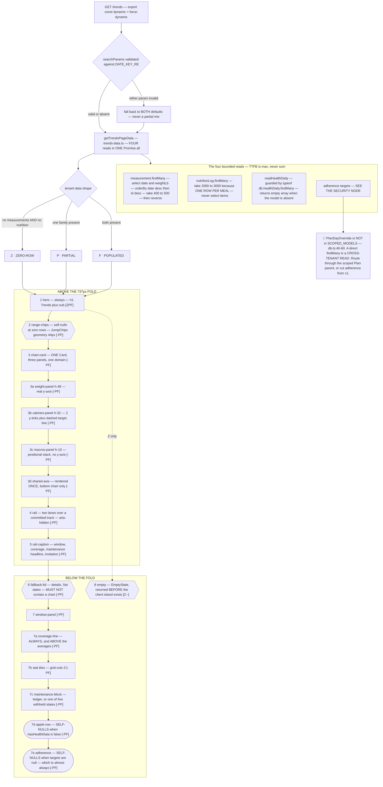
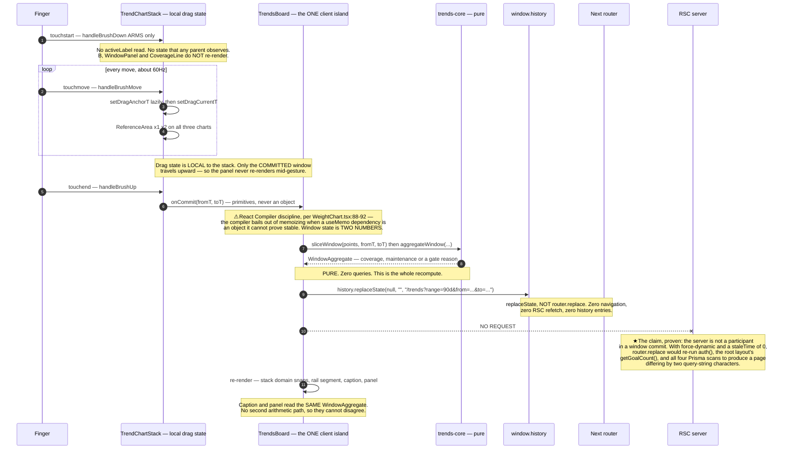

# `/trends` — Trends Dashboard

**Feature:** A new authenticated route charting weight, calories and macros on one shared time axis, with a drag-selected sub-window and a window aggregate that states its own coverage.
**Slug:** `trends-dashboard` · **Date:** 2026-09-02 · **Profile:** `goaldmine` · **Scope:** research-first, no issue number.
**Binding inputs:** `docs/prds/PRD-g1-trends-dashboard.md` (scope) · `docs/prds/PRD-g2-apple-health-import.md` (companion) · `docs/ux-research/progress-overhaul.md` (the one-Recharts constraint and the honesty-prose conventions) · `src/app/globals.css` (tokens) · `src/components/WeightChart.tsx` + `src/lib/weight-chart-core.ts` (the chart this stack sits alongside and reuses).
**Mechanism authority:** `.feature-dev/2026-09-02-trends-dashboard/agents/architecture-blueprint-v2.md` §5.
**Pixel mockup:** [`trends-dashboard.html`](./trends-dashboard.html) — self-contained, real tokens, light/dark **and grayscale** toggles, 7 panels.
**Ledger:** [`trends-dashboard-ledger.md`](./trends-dashboard-ledger.md) — `UXR-TRENDS-NN`, stable, the implementing PR ticks it.

> **Division of authority, as instructed.** Where this report and the architecture blueprint differ, **research wins on presentation, blueprint wins on mechanism.** The blueprint's §5 drag handlers, `history.replaceState` semantics, `ComposedChart` construction, dense-range switch and five gate reasons are taken as settled and are **not** relitigated here. Everything below is about what the user sees and reads. Two places where a presentation call has a mechanical consequence are marked **⚑ SIGN-OFF** and are the only things in this document that ask the blueprint to move.

---

## §0 · The reframe — read this first

**The one question `/trends` answers: "is what I ate actually moving the scale, and by how much?"**

Not *"what happened on Tuesday"* — that is `/days/[dateKey]`. Not *"how do I compare to April"* — that is `/compare`, which diffs **state at instant A vs state at instant B** and says so in its own sub-caption, *"Values as of end of each day."* (`compare/HeroSpan.tsx:66`). `/trends` aggregates **everything between two dates**. That is a different primitive, and the whole reason the vacation question cannot be answered on `/compare` today.

Three findings reframed the brief.

**F-A · The honest denominator is the feature, not the chart.** Three charts on one axis is table stakes; MacroFactor, Cronometer and Apple Health all draw them. What no consumer fitness app ships is a **visible denominator** — the number of days that actually carried data behind the average you are reading. Song & Szafir's controlled study (IEEE TVCG 2019, 303 participants) found that **zero-filling costs roughly 10 points of reading accuracy**, which validates the PRD's exclude-don't-zero rule outright — but it also found that **"data absent" scored worst of seven encodings on perceived data quality** and near-worst on accuracy. Silently omitting is not free. So the design problem is not *"should we exclude"* (settled, and correct) but *"how does the reader **see** what was excluded."* That is the differentiator, and it is cheap.

**F-B · The palette forbids the obvious macro chart, and the escape is positional, not chromatic.** `F1` is a signed-off binding prior finding (`program-views.md:17`): every token was independently tuned to land 4.9–6.5:1 against **both** cream and coal, which mathematically forces them all into one luminance band. Measured series-vs-series separation: `--accent`↔`--target` **1.16:1**, `--accent`↔`--warning` **1.01:1**, `--muted`↔`--success` **1.00:1 — byte-identical in grayscale**. **Three mutually distinguishable chromatic macro series do not exist in this palette.** The blueprint's placeholder `accent / success / warning` triad is 1.01:1 on its worst adjacent pair. The escape is the one the shipped Seam Strip already uses: **a fixed-order stack is positionally encoded — position is a total order, so bands are told apart by where they are, not by what colour they are.** Hue drops to tertiary reinforcement, and a `stroke="var(--card)"` separator makes the boundary hard. This is the same argument that let column height carry three nested thresholds with no legend, and it survives the grayscale acceptance test.

**F-C · Nobody ships drag as the only path, and the reason is not accessibility theatre.** Apple reserves range-selection on iOS to a **two-finger** gesture precisely because one-finger horizontal drag belongs to the scroller. Fitbit *removed* its drag-to-range. Apple Health, Google Fit, Robinhood and Cronometer all ship segmented chips. TradingView gates brushing behind an explicit long-press "tracking mode." NN/g's ruling is blunt: *"because gestures have low affordance, discoverability, and memorability, some users never use them"* — and redundancy is the sanctioned exception to the usual no-redundant-controls rule. The PRD already mandates a date-input fallback for keyboard reachability. **The finding is stronger than that: the chips and the date form are not fallbacks, they are the primary path, and the drag is the accelerator.** That reframing changes where the affordance copy goes and how much weight it gets.

---

## §1 · Current-state audit

| # | Problem | `file:line` | User impact |
|---|---|---|---|
| **T1** | **Calories and macros are charted nowhere.** `/nutrition` is a meal list plus a today-only macro banner. | `src/app/nutrition/page.tsx` | The single most important question a cutting or bulking user has cannot be asked inside the app. |
| **T2** | Weight is charted twice, on `/progress` (Body composition) and `/history`, and neither can be scoped to an arbitrary period. | `WeightChart.tsx:147-162` | Range chips are fixed presets; "how did my vacation go" needs an arbitrary window and there is no way to express one. |
| **T3** | 🔴 **The range chips fail the 44px touch invariant.** `px-2 py-1 text-[11px] leading-none` computes to **≈21px tall**, and there is no `focus-visible` ring. | `WeightChart.tsx:154` | This is the closest prior art to a `/trends` range picker and it is the one most in need of a fix. Copying it forward would ship the defect three more times. |
| **T4** | 🔴 **The recessive raw-weight dots fail the 3:1 non-text graphical minimum.** `fillOpacity: 0.55` on `--muted` composites to **2.33:1 light / 2.48:1 dark**. | `WeightChart.tsx:215-222` | The layer that carries "here is the actual reading, the line is a smoothing" is below the threshold at which a sighted user is guaranteed to see it. The honest floor is ≈0.68 light / ≈0.66 dark. |
| **T5** | `NutritionLog` is **one row per meal**, and every macro column is nullable — so **"has a nutrition row" ≠ "has calorie data."** `sumLoggedDayMacros` coerces null to 0. | `prisma/schema.prisma:230-255`; `src/lib/nutrition-macros.ts:31` | A day with three item-only quick-logged meals currently renders as a **0-kcal day rather than a gap**. The PRD's binary `N of M days logged` coverage line has no state for this, and it is a common case. |
| **T6** | 🔴 **`PlanDayOverride` is not a scoped model.** `SCOPED_MODELS` in `src/lib/db.ts:40-60` contains `Workout, Measurement, Baseline, Note, Hike, NutritionLog, Goal, BodyMetric, Plan, Program`… and **not** `PlanDayOverride`; the comment at `db.ts:33` says such models are "passed through untouched." | `src/lib/db.ts:33, :40-60` | The adherence block needs per-date macro targets, which live only in `PlanDayOverride.nutritionPlan`. The obvious `db.planDayOverride.findMany({ where: { date: { gte, lte } } })` is a **cross-tenant read**. It must go through the scoped `Plan` parent. Same class as the `/progress` audit's Stage-0 launch blocker. |
| **T7** | The adherence target the PRD specifies is **semantically wrong for a window**. It reads `resolveDay(new Date()).nutritionPlan` — *today's* override — and applies it as the target across a 90-day historical window. | PRD §4.4; `src/lib/calendar.ts:1662` | Days that had a different plan, or no plan, are silently scored against today's. And because `resolveDay` has no rotation/`planJson` fallback, the block is **null for almost every user almost always** — Phase 2A's real nutrition prescription is free-form prose (`nutritionText`), not structured macros. |
| **T8** | `HealthDaily` does not exist — verified absent from the schema, the migrations and the generated client. | `prisma/schema.prisma` | **Measured expenditure will be absent for every user on day one.** Any layout that pairs two numbers side by side ships with a visible hole until the companion PRD lands. |
| **T9** | Naming collision: `<h1>Trends</h1>` is already rendered for project goals. | `src/components/ProjectTrendsView.tsx:49` | Two unrelated surfaces titled "Trends". Not blocking, but it must be a conscious choice. |
| **T10** | The profile document's `--target` value is **stale**. It lists barn-red `#A82A1F` / `#C0392B`; the real token is **rust `#9A480F` / `#D97A3D`**. `#A82A1F` is `--danger`. | `src/app/globals.css:13, :44` vs the profile | Any mockup built from the profile rather than from `globals.css` would ship the wrong hue and a wrong contrast calculation. |

---

## §2 · Chosen direction — **"One Instrument, Honest Denominator"**

Three genuinely competing IAs were drawn at 390px (§9). The winner is **B · "The Rail"**, grafted with A's macro treatment and C's disclosure placement, and then **reconciled against the architecture blueprint's mechanism**, which lands it here:

> `/trends` is **one instrument**, not three charts that happen to be stacked. The three panels share one explicit numeric x-domain, one left gutter and one set of ticks, and the thing that makes them read as one instrument rather than three is a **rail** running under the shared axis that shows, day by day, which days actually carried data — and doubles as the committed-window readout. The stat panel below is the conclusion; the rail is the evidence that the conclusion is worth reading. Nothing on this surface celebrates, animates for its own sake, or estimates anything it cannot derive.

**Why B beat A and C.** A · "Stacked Card" was the safe direction — three macro small-multiples, coverage as text only, chips plus a hint line. It fails its own thesis: by the time you reach the FAT strip, the weight line is ~600px and three hairlines away, so "one shared scale" becomes an article of faith rather than something you can see, and it costs five Recharts mounts. C · "Ledger First" put the maintenance block above the fold and the charts below as evidence; it breaks the shared x time-scale that is the feature's premise, needs a new primitive, and inverts the after-drag problem into something worse — the answer moves *up and off-screen*. B is the only direction that gets instrument, control and state into the same viewport.

**Grafted from the runners-up:**
- **G1 — from A: the macro encoding argument.** A's small multiples were the only form where hue does zero discrimination work. B keeps a single stacked ribbon (A's three strips cost ⚠[195–215px] and three extra mounts) but adopts A's reasoning: **fixed band order is the identity channel**, `stroke="var(--card)"` separators make boundaries hard, in-place labels are mandatory, and hue is demoted to recall.
- **G2 — from A: the plan-target reference line** on the calorie chart, `--target` 1px dashed. It is the only in-chart expression of adherence and it costs nothing.
- **G3 — from C: coverage must be legible above the fold.** C proved the disclosure has to travel with the number. B answers it by putting coverage **into the rail caption**, so the denominator is visible at the instrument, not only 600px down in the panel.

### The binding rules — R1…R16

| # | Rule |
|---|---|
| **R1** | **One `<Card>`, three panels, one axis.** Panels separated by `border-t border-[var(--border)]` hairlines; the x tick labels render on the **bottom (macros) chart only**; the upper two use `<XAxis … hide />` (a hidden axis still applies its domain). Three separate `<Card>`s would cost ⚠[120–180px] of card walls and slice the shared axis into three, visually denying the sharing that is the entire point. |
| **R2** | **Gutter alignment is arithmetic, not eyeballing.** Identical `margin={{top:8,right:14,left:0,bottom:0}}`, one fixed `<YAxis width={40}/>` on all three, one explicit numeric `domain={[domainFromT, domainToT]}`, one shared `ticks` array, `interval={0}`. If any of the five differ, the three axes do not line up and the instrument claim is false. |
| **R3** | **★ The macro stack is POSITIONALLY encoded.** Fixed band order **protein bottom → carbs middle → fat top**, never re-sorted by magnitude. `stroke="var(--card)" strokeWidth ⚠[1–1.5px]` separators between adjacent segments. In-place right-edge labels `P` `C` `F` — **mandatory, not optional**, per the ≤4-series direct-labelling rule (`program-views.md:748`). Hue is tertiary reinforcement only. **Acceptance test: a grayscale screenshot must lose nothing.** |
| **R4** | **⚑ SIGN-OFF — the macro hue assignment changes from the blueprint's placeholder.** Blueprint §5 has protein `--accent` / carbs `--success` / fat `--warning`; `--accent`↔`--warning` is **1.01:1**, the single worst pair in the palette, and it lands on the two **non-adjacent** bands where a separator cannot help. Use **protein `--target` / carbs `--success` / fat `--accent`** — the assignment already shipped in `FoodLibraryManager.tsx:38-43`, so it is the app's existing P/C/F convention, and its worst adjacent pair is target↔success at 1.05:1 with a hard card-stroke boundary between them. This is a token swap, not a mechanism change. |
| **R5** | **The `grams ⇄ %` toggle changes the SCALE, never the ENCODING.** Same fixed order, same separators, same labels in both modes. A toggle that re-encodes teaches the reader that the picture is arbitrary. |
| **R6** | **★ The unlogged day is ABSENT, and absence is shown twice** — once as a hole in the bar series (blueprint: null kcal ⇒ no bar) and once as a **mark on the rail**. Song & Szafir: excluding is right for the math (zero-fill costs ~10pts of accuracy) but absence alone scores worst on perceived data quality. One channel is not enough. |
| **R7** | **★ THE RAIL.** A ⚠[22–26px] band directly under the shared axis, spanning exactly `plotWidth`, carrying **two 8px availability lanes** (WEIGH-INS, MEALS) over a ⚠[4–6px] committed-window track. Lane states: `full` = solid `var(--accent)`; `partial` (meals logged, macro columns null — finding T5) = half-height plus the `repeating-linear-gradient(-45deg, …)` hatch **already shipped at `CeilingRule.tsx:57-59`, where it already means "this zone is excluded from the number"**; `absent` = a 1px `var(--border)/40` track. `aria-hidden`; the coverage sentence is its accessible equivalent. |
| **R8** | **⚠ The rail carries TWO states, not three — say so.** `--border` is **1.59:1 light / 1.39:1 dark** against `--card` and **fails 3:1**. `absent` is therefore a *hole*, not an encoding. This is why the coverage sentence is load-bearing rather than redundant, and why R9 exists. |
| **R9** | **⚠ The hatch does not resolve at 90 days — design for that, don't pretend.** Plot width is **278px**, so 90d = ⚠[3.0–3.2 px/day] against a gradient period of ~5px: a partial day shows at most one stripe and degrades to a solid `--muted` fleck. It resolves as a hatch only at 30d or inside a committed window. **The rail therefore renders per-day only when px/day ≥ ⚠[2.5–3]; below that it aggregates to weeks and the caption says which.** At "All" over a multi-year import (⚠[0.7–0.8 px/day]) per-day is meaningless. |
| **R10** | **The committed window is a DOMAIN CHANGE, not a highlight.** On commit the excluded data is *gone*, not dimmed — so **there is no selection band in the committed state at all**. The committed window is read from the rail track (an `--accent` segment with `--foreground` 2px end-caps, the shipped `CeilingRule` "stile" idiom, required because an `--accent-soft` fill has no edge) and from the caption. |
| **R11** | **★ The rail caption is the answer echo at the gesture site.** At rest: `90 days · 61 of 90 days logged · drag either way to scope`. Committed: `Aug 3 → Aug 12 · 10 days · 7 of 10 logged · 2,410 kcal/day`, plus a 44px `Clear`. **Plus one line carrying the maintenance headline or its withheld reason** (see R12). This is the fix for the single hardest interaction problem in the feature: after a drag, the panel that answers the question is ~600px below the user's thumb and updates silently. |
| **R12** | **★ The gate re-evaluates live during the drag, and that is the feature's best teaching moment.** Because the recompute is pure and client-side, a user dragging a 4-day window watches the maintenance line become `Needs 7+ days — this window is 4` *while their finger is still down*, and widening it brings the number back. This is the strongest available version of the house doctrine *"teach the rule while it is still free"*, and it is a free side effect of the zero-round-trip architecture. It is the reason the caption must carry the gate line rather than only the average. |
| **R13** | **Maintenance is a LEDGER, not a pair.** Observed is a lead numeral with a derivation sentence; measured is an additional **row**, not a facing column. A pair has a visible hole when one side is missing; a ledger just has fewer rows. Given T8 this is the **default** form, not the degraded one. |
| **R14** | **Never `--danger` for a negative number.** `--danger` on `--card` is **3.38:1 in dark and fails AA text**. A deficit is not an error. Negative values render `--foreground` with an explicit `−`, following the shipped `DeltaRow.tsx:14-15` ruling. |
| **R15** | **Zero ceremony, zero new keyframes, no Bullseye.** `/trends` is a routine analytical surface. `/compare` — an equally analytical read-only surface — was **explicitly denied** the bullseye-pop at `globals.css:523-525` with the reason *"routine navigation, not a celebration"*, and nine further sites have refused the glyph. The Bullseye also cannot express a continuous quantity honestly: `progressToRings` is `Math.max(1, Math.ceil(p * max))`, so **76% and 100% render identically** — a defect documented three separate times. **Not even in an adherence meter.** The founder's prior is confirmed, and the hedge is rejected. |
| **R16** | **The name stays `Trends`.** It is what the thing is, it matches the MoreSheet row, and the brand rule is explicit that the theme lives in visuals and never in prose. ⚠ File `ProjectTrendsView`'s `<h1>Trends</h1>` (T9) as a separate rename — it is the one that should move, since it is scoped to a single goal. |

---

## §3 · The four blocking decisions, stated for implementation

These are the decisions the Developer Agent is blocked on, in the coordinator's priority order.

### 3.1 · Composition and the height budget

**Decision: three vertically stacked charts is correct — but the PRD's symmetric height budget is not, and the stack must be asymmetric.**

The alternatives were pressure-tested and all lose:

| Option | Verdict |
|---|---|
| **Dual-axis overlay** (weight + calories on one chart, two y-axes) | **Rejected.** Two y-axes with unrelated units invite a false reading of crossings and coincidences as causation — the exact misreading this page exists to prevent. It also has nowhere to put macros. |
| **Small multiples** (five+ separate strips) | **Rejected on the fold.** ⚠[195–215px] for the macro strips alone and five Recharts mounts. By the last strip the weight line is ~600px away, so "one shared scale" stops being visible. |
| **One chart with a metric switcher** | **Rejected on the thesis.** The entire question is *intake against weight*. A switcher makes the comparison a memory task and is strictly worse than the status quo of two separate pages. |
| **★ Three stacked charts, asymmetric heights** | **Chosen.** The only form where the comparison is simultaneous. |

**Height budget.** The PRD's `h-52` / `h-44` / `h-40` (208 + 176 + 160 = **544px** before titles, axes, chips and gutters) measures out at ⚠[830–930px] to the bottom of the macro chart — overrunning the **737px fold** by ⚠[93–193px] with **zero** of the stat panel visible, and pushing the rail below the fold, which would destroy the direction's central advantage.

**⚑ SIGN-OFF — recommended budget:** weight **`h-48` (192)** · calories **`h-32` (128)** · macros **`h-10` (40)**.

- Weight keeps a real y-axis and stays the hero; `h-48` is the shipped `HistoryChart`/`ReadinessChart` height, so it is a house value, not an invention.
- Calories compresses to a strip with **2 y-ticks**. It does not need four — it needs a shape and a target line.
- Macros compresses hardest because a normalized ribbon has **no y-axis at all**; 40px is enough for three bands plus separators.

This lands the chart card at ⚠[735–775px], ending ⚠[0–15px] under the fold with the rail and its caption *just* above it. **⚠ That is arithmetic, not measurement, and it is the single most urgent thing to confirm on a real 390px device.** If it misses, the ordered concession list is: (1) calories `h-32` → `h-28`, (2) drop the calorie chart's second y-tick, (3) macros `h-10` → `h-8`. **Do not** shrink weight below `h-48`, and **do not** move the rail above the axis to save space — it must sit under the axis it indexes.

If the blueprint's `h-52/h-44/h-40` is retained, the honest claim changes to *"the weight and calorie panels clear the fold; the macro ribbon, the axis and the rail are the scroll cue"* — which is survivable but gives up R11 and R12, the two ideas that make this direction better than the PRD's.

### 3.2 · The drag affordance

**Mechanism is settled by the blueprint** (Recharts mouse + touch handler pairs, lazy anchor on first informative move, `touchAction: "pan-y"`, `<ReferenceArea>` during drag, `history.replaceState`, mandatory date-input fallback). What follows is presentation only.

**Discovery — the drag is the accelerator, not the path (F-C).**
1. **The chips are primary.** `30d / 90d / All`, at `JumpChips` geometry (`flex h-11 items-center rounded-full border border-[var(--border)] bg-[var(--card)] px-3.5 text-sm focus-visible:ring-2 focus-visible:ring-[var(--accent)]`), **not** the shipped `WeightChart` chips, which fail 44px and have no focus ring (T3).
2. **`Set dates` is a peer, not a fallback.** A `<details>` lid with `summary` text `Set dates`, sitting **directly under the rail caption** where a user who has just failed to discover the drag is already looking — not buried at the bottom of the page. Contains two labelled `<input type="date">` plus the *Last 7d / Last 14d / This month* presets. ⚠ It must **never** contain a chart: `ResponsiveContainer` inside a closed `<details>` measures 0×0.
3. **The rail is the affordance.** A visible track under the axis is a target in a way that an empty chart body is not. Its caption carries the invitation in words: `drag either way to scope` — "either way" because dragging right-to-left is the natural motion for "the last two weeks" and users abandon when the first direction they try appears not to work.

**In-progress selection.** `<ReferenceArea fill="var(--accent)" fillOpacity={0.12}>` on **every** chart simultaneously — the token fill is mandatory, the Recharts default is `#ccc` which is off-palette in both themes. ⚠ The fill composites to ≈1.1:1 in **both** palettes, so **the edges carry 100% of the meaning**: ⚠[1.5–2px] `--accent` verticals. Edge date labels at 11px `--foreground`, pulled from the **server-formatted** `DailyPoint.label` — nothing formats a date on the client (hydration divergence, and `ReadinessChart.tsx:42-45` is the live example of that defect). The weight panel's right-rail swaps from `lb` to a live `⌈ 10 days ⌉` day-count pill, because a day count is what the user is actually trying to land on.

**Committed window.** Per R10 the domain changes, so **the band disappears entirely**. Committed state is carried by three things, none of which is a highlight: the **rail track segment** (`--accent` with `--foreground` end-caps), the **caption** (`Aug 3 → Aug 12 · 10 days · 7 of 10 logged · 2,410 kcal/day`), and the **axis itself**, whose four tick labels now span ten days instead of ninety. That last one is the strongest signal and it is free.

**Clearing.** A tap clears — and the caption's `Clear` control is the discoverable equivalent, 44px, adjacent to the window it clears. ⚠ **State the rule px-first, not day-first.** The PRD says "a drag under ~2 days is a tap," but at 90d two days is only ⚠[6.0–6.4px], below any sane slop threshold, while at 30d it is ⚠[18–19px]. The pixel test dominates at every range; the day test almost never fires alone.

**Announcement.** An `aria-live="polite" role="status"` region announces the committed window, following the shipped precedent at `CalendarMonth.tsx:295-306` (`"Pick the second day — Aug 3 selected"`). It announces on **commit only**, never during the drag.

### 3.3 · The two-TDEE layout, and the five withheld states

**Decision: a ledger, not a facing pair (R13).** Observed is the hero; measured is a row beneath it; the gap is a third row that exists only when both do.

```
MAINTENANCE                                    ← eyebrow, 11px --muted uppercase

Observed maintenance                           ← 12px --muted
3,040 kcal/day                                 ← 30px tabular-nums --foreground
From your 2,410 kcal/day average and
−1.26 lb/week over this window.                ← 12px --muted, the derivation

──────────────────────────────────────         ← hairline --border

From Apple Health      2,560 kcal/day          ← only when hasHealthData
Gap                     −480 kcal/day
Apple measures 480 kcal/day below what your
logging implies. That usually means intake is
logged low, or Apple is under-counting
movement it can't see. Neither number is wrong
on its own — the gap is the thing to watch.

Balance                 −630 kcal/day          ← --foreground, explicit −, never --danger
You ate 630 kcal/day under maintenance.
```

Three rulings inside that block:

- **⚑ SIGN-OFF — do not call Apple's number "measured."** A wearable's active-energy figure is a **model output**, not a measurement; wearables miss energy expenditure by more than 10% roughly 82% of the time. Labelling ours "observed" and theirs "measured" inverts the credibility hierarchy the arithmetic actually supports — ours is derived from two things the user themselves recorded. Use **`Observed maintenance`** and **`From Apple Health`**. This is a copy change only; the PRD's `measuredTdee` field name can stay.
- **⚠ The `gap` sign convention is unpinned and every sentence of copy depends on it.** The PRD's sample payload implies `gap = measured − observed`. Pin it in `trends-core` with a unit test, because if implementation flips it, all of the copy above inverts silently and reads as confidently wrong.
- **When `hasHealthData` is false — the universal case until the companion PRD lands (T8) — the block is COMPLETE at four lines**, not visibly missing a column. One muted line follows it: `Import Apple Health to see measured burn →` linking `/import`.

**The five withheld states.** MacroFactor, the closest prior art, *refuses* to display a second competing expenditure figure at all and publishes its reasoning; Apple Health declines to compute and says why, under a section header literally reading **"Needs More Data"**. Both are the same move, and it is the move the thesis demands: *the UI surfaces state but never invents.* So a withheld number is **not** rendered as `—`, and **not** rendered greyed. The eyebrow stays, the numeral is replaced by a sentence, and a second sentence closes it.

| Reason | Line 1 | Line 2 |
|---|---|---|
| `window_too_short` | `Maintenance needs at least 7 days. This window is 4.` | `Nothing is estimated until then.` |
| `insufficient_nutrition_days` | `Maintenance needs at least 5 logged days. This window has 3.` | `Nothing is estimated until then.` |
| `insufficient_nutrition_coverage` | `Under half this window's days have meals logged — 4 of 12.` | `An average that thin would be misleading, so it isn't used.` |
| `insufficient_weigh_ins` | `Maintenance needs 2 weigh-ins at least 7 days apart. This window has 1.` | `Nothing is estimated until then.` |
| `implausible_result` | `This window's weight change and logged intake don't produce a believable number.` | `That usually means a weigh-in is off, or a big day went unlogged.` |

All five state **the threshold and the actual value**, so the reader knows how far off they are and what to do — the difference between a gate that teaches and a gate that stonewalls. `implausible_result` is the only one that names a likely cause, because it is the only one the user cannot fix by waiting.

⚠ **The counts in those strings are real values, not static copy** — `This window is 4` must interpolate. A static string would be worse than no string.

**✅ Verified against the landed core** (`src/lib/trends-core.ts`, merged as `3e897f4`). The five reason codes match this table exactly, and three shipped details confirm the presentation above is directly implementable:

- **`observedTdeeReason` is single-valued — "first failure wins"** (`trends-core.ts:326-361`). So exactly one string renders, never a stacked list of failures. That is what makes the two-sentence form viable; a list would have needed a different layout.
- **`coverage.mealsNoMacroDays`** already exists (`:85, :276` — `p.mealCount > 0 && p.kcal === null`), so the conditional second coverage line in §3.4 needs **no new plumbing**.
- **`coverage` is populated on every return path including the empty one** (`:411-418`), which is what lets the coverage line be unconditional rather than defensive.

⚠ One gate to interpolate carefully: `insufficient_nutrition_coverage` fires on `loggedDays / totalDays < 0.5` (`MIN_NUTRITION_COVERAGE`), so its string must quote **both** numbers (`4 of 12`), not a percentage — the ratio is the rule, but the counts are what the reader can act on. And `implausible_result` fires when the computed value falls under `MIN_PLAUSIBLE_TDEE = 800`, which is why its second sentence names a bad weigh-in or an unlogged day rather than telling the user to wait.

### 3.4 · Coverage encoding

**Decision: both. A rail on the chart AND a sentence in the panel, and they are not redundant.**

The rail (R7–R9) gives the reader a **shape** — where the gaps are, whether they cluster, whether the vacation is the hole — that no sentence can carry. The sentence gives the **denominator**, survives grayscale, is in the accessibility tree, and covers the third state the rail provably cannot encode (R8). Song & Szafir is the evidence for needing more than one channel; `CeilingRule`'s shipped hatch is the evidence that this app already has a visual vocabulary for "excluded from the number."

**The sentence, in all its forms:**

```
61 of 90 days logged · 48 weigh-ins
```
and when partial days exist, a **second line**, conditional:
```
3 more days have meals with no macros — not counted in these averages.
```

That second line is the answer to T5, and it is the difference between a number that is wrong and a number that is qualified. It renders only when the count is non-zero.

**Placement.** The coverage sentence appears **twice**: in the rail caption above the fold (abbreviated: `61 of 90 days logged`) and in full at the **top** of the window panel, immediately under the window header and **above** the averages it qualifies. Coverage after the average is a footnote nobody reads; coverage before it is a frame.

**What was rejected:** a ghost bar or hatched bar for the unlogged day *in the calorie series* — it puts a mark where there is no datum, which is the zero-fill failure wearing a costume. The bar series stays absent (R6); the rail is where absence gets a mark, because the rail's whole axis is *availability*, not *value*.


---

## §4 · Empty and partial states

Per the profile, zero-row states are first-class surfaces, not afterthoughts. Every string below is final copy in the neutral coach voice — no puns, no alarm, no `0 kcal · 0 lb` presented as if it were data.

| State | What renders | What does NOT render |
|---|---|---|
| **Zero rows of everything** | Hero + sub, then a `Card`-wrapped `EmptyState`. Total ≈253px. | **No chip row** (range chips over zero rows are decoration, and `Set dates` on an empty range is a trap). **No rail. No `ResponsiveContainer`. Zero Recharts mounts** — satisfied *structurally*, by returning before the client island exists in the tree, not by a branch inside a mounted island. |
| **Weigh-ins, no nutrition** | Weight panel renders normally. Calorie and macro panels render **their frames plus a one-line muted note**, never an empty box. Rail shows a populated WEIGH-INS lane over an empty MEALS lane — which is itself the clearest possible statement of the problem. | Maintenance is gated `insufficient_nutrition_days`. Adherence hidden. |
| **Nutrition, no weigh-ins** | Calorie and macro panels render normally. Weight panel renders its frame plus its note. | Maintenance gated `insufficient_weigh_ins`. Δ and rate show `—`, **never `0`**. |
| **★ Meals logged, no macros** (T5 — common, from quick-logging) | Calories may still render (kcal and macros are separate nullable columns on the same row). The macro ribbon shows **hatched stretches**. Coverage reads `58 of 90 days logged · 48 weigh-ins` **plus** the conditional second line. | Those days are excluded from macro averages. They are **not** zeroed. |
| **A dragged window containing nothing** | The window commits, the caption reads `Aug 3 → Aug 12 · 10 days · 0 of 10 logged`, and the panel states it plainly. | No numbers. The window is **not** silently refused — refusing a user's own gesture is worse than showing them an honest hole. |
| **`HealthDaily` absent** (T8 — universal today) | The maintenance ledger is complete at four lines, plus `Import Apple Health to see measured burn →`. | No gap row, no empty column, no placeholder. |

**Verbatim copy:**

- **Zero-row.** Title `Nothing to trend yet` · body `Log a weigh-in and a few days of meals — this page fills in from your own numbers. Nothing here is estimated.` · action `Open coach setup →`
- **No nutrition in range.** `No meals logged in this range.`
- **No weigh-ins in range.** `No weigh-ins in this range.`
- **Window with no data.** `Nothing was logged in this window. Drag a wider one, or clear it to see everything.`

The zero-row body earns its last sentence: *"Nothing here is estimated"* is the promise the whole page is built on, and the first render is when a new user decides whether the tool is for them. It is also the one place the page says out loud what the five gates enforce silently.

---

## §5 · Brand fit — confirmed, with one rejection

**`/trends` is a routine analytical surface. The founder's read is correct and the evidence is unusually strong.**

The profile's own rule is that the brand surfaces at **strike moments** where celebration is earned, and that **routine/utility surfaces stay calm**. `/trends` is the definition of routine: a read-only surface a user visits to *check*, with no completion, no threshold crossed, nothing achieved. Three shipped precedents settle it:

- `globals.css:523-525` — `/compare`, an equally analytical read-only surface, was **explicitly denied** the bullseye-pop, with the recorded reason *"routine navigation, not a celebration."* `/trends` is the same shape of surface.
- `today-page-ia.md:942` ruled that even **hitting a daily calorie target is not a strike moment** — *"it happens daily; strikes must be rare."* A window average cannot outrank a daily target.
- `recap-post-state-tracking.md:159` — *"Deliberately minimal — this is routine, not a strike moment (no Bullseye, no pop)."*

**The adherence-meter hedge is rejected**, and on mechanism rather than taste. `progressToRings` is `Math.max(1, Math.ceil(p * max))`, so at the size-20 band **any value from 76% to 100% renders identically** — a defect documented independently at `NutritionToday.tsx:334`, `CeilingRule.tsx:12` and `program-views.md:86`. On a page whose entire claim is that its numbers are honest, a glyph that cannot tell 76% from 100% is the worst possible ornament. Nine sites have already refused the glyph on scope grounds (`ReachMeter.tsx:10` *"Bullseye is reserved for focus"*; `MarkerIcon.tsx:12` *"Bullseye stays EXCLUSIVE to focus training"*). If a continuous quantity ever needs a meter here, the house already has two honest primitives: `ReachMeter`'s five discrete segments and `NutritionToday`'s `role="progressbar"` fill.

**Is there a legitimate visual expression of the gold-rush identity here? No — and that is the correct answer, not a gap.** The identity on this surface is carried entirely by the shared palette, the type scale, `Card`, `StatTile`, `SectionRule` and the honesty conventions. That is what makes it feel like the same app. Adding a mining motif to a chart would be exactly the *"gamifying housekeeping cheapens the real payoff"* failure the profile warns against. The one genuinely on-brand thing this page does is refuse to estimate — which is a *systemic* expression of the identity, not a decorative one.

**Name: `Trends` stays** (R16). The theme lives in visuals, never in prose; `/progress` stayed `Progress` for the same reason. ⚠ File `ProjectTrendsView`'s competing `<h1>Trends</h1>` (T9) as a separate rename — that one is scoped to a single goal and should carry the goal's name.

---

## §6 · Behavioral psychology principles

| Principle | Where it lands | Mechanism | Evidence-prediction |
|---|---|---|---|
| **Illusion of validity** (Kahneman) | The coverage sentence placed **above** the averages it qualifies (§3.4) | Confidence in an estimate tracks the *coherence* of the story, not the *quantity* of evidence. A clean `2,410 kcal/day` reads as equally trustworthy whether it rests on 7 days or 70. Putting the denominator first reframes the number as a sample before it is read as a fact. | The founder discounts a thin average out loud in the coach thread — quotes `2,410 over 7 of 21 days` rather than `2,410`. |
| **Denominator neglect** (Reyna & Brainerd) | The rail's day-by-day lanes (R7) | People reason from the numerator and drop the denominator, even when both are present in text. A *spatial* denominator is not a number to be dropped — it is a shape, and a gappy shape is legible pre-attentively. | A user asked "how much of August did you actually log?" answers from memory of the picture, not by re-reading. |
| **Missing-data perception** (Song & Szafir 2019, n=303) | R6's two-channel absence — hole in the series **and** mark on the rail | Empirically, zero-filling cost ~10 points of reading accuracy (so exclusion is right), **but** plain absence scored worst of seven encodings on perceived data quality. Excluding correctly and showing nothing is a measured failure, not a neutral default. | Users do not report the calorie chart as "broken" or "missing days" — the complaint pattern that plain absence produces. |
| **Attribution theory** (Weiner) | The five withheld-state strings (§3.3), each naming threshold **and** actual | An unexplained refusal invites a *stable-internal* attribution ("the app is broken" or "I did something wrong"). Naming the gap converts it to *unstable-external and controllable*: three more logged days fixes it, and the sentence says so. | Nobody asks the coach "why is maintenance blank?" If they do, the gate copy failed. |
| **Teaching the rule while it is still free** (house doctrine, `CeilingRule`) | R12 — the gate re-evaluating **live during the drag** | A rule that appears only when it binds reads as a punishment; a rule visible before it costs anything reads as a rule. Dragging a too-short window and watching the number withdraw teaches the 7-day threshold at the moment it is cheapest to learn — with the finger still down and nothing at stake. | First-week users stop selecting sub-7-day windows and expecting maintenance. |
| **Loss aversion** (Kahneman & Tversky) — the hazard | R14's ban on `--danger` for negatives; `Balance −630` in `--foreground` | A loss is felt roughly 2× an equivalent gain. A deficit rendered in red recodes a *successful cut* as a *failure state*. The absence of colour is the message. | The founder does not describe an on-plan deficit week as a bad week. |
| **Reference-point framing** (prospect theory) | The maintenance derivation sentence sitting **under** the numeral | `3,040` alone is unanchored. `From your 2,410 average and −1.26 lb/week` makes the number auditable, which converts it from a verdict into arithmetic the reader can check. | The number gets questioned on its inputs, not on its authority. |
| **Anchoring, and why two numbers are risky** | R13's ledger over a facing pair | Two equal-weight numbers side by side invite the reader to pick one and discard the other — usually the one flattering the current plan. A lead numeral with a subordinate row forces sequential reading, so the *gap* is encountered as a finding rather than as a contradiction. | The founder asks "why is there a gap" rather than "which one is right." |
| **Credibility hierarchy** (source-monitoring) | Calling it `From Apple Health`, never `measured` (§3.3) | "Measured" vs "observed" tells the reader which number to trust, and it tells them wrong — wearables miss expenditure by >10% about 82% of the time, while ours derives from two things the user recorded themselves. Neutral sourcing labels let the gap stay genuinely open. | Neither number is treated as the tiebreaker. |
| **Direct manipulation & the gulf of evaluation** (Hutchins/Hollan/Norman) | R11's caption echo at the gesture site | A gesture whose result appears ~600px away, off-screen, has an unbridged gulf of evaluation — the user cannot tell whether the drag worked. Putting the headline where the finger is closes it. | Users drag once and read; they do not drag repeatedly to check it took. |
| **Gesture discoverability** (NN/g) | Chips and `Set dates` as peers, not fallbacks (F-C) | *"Because gestures have low affordance, discoverability, and memorability, some users never use them."* Redundancy is the sanctioned exception to the no-duplicate-controls rule. Every surveyed competitor ships explicit controls; two removed drag-only affordances. | Chip taps outnumber drags in the first week and that is **not** treated as a failure of the drag. |
| **Self-efficacy on first exposure** (Bandura) | The zero-row `EmptyState` and its closing promise | The first render is when a new user decides whether the tool is for them. `0 kcal · 0 lb` is a judgment on someone who has done nothing wrong. *"This page fills in from your own numbers"* states a contract instead. | New users log a second day. |

---

## §7 · Implementation scope

**Presentation-layer deltas only** — the file plan, streams and mechanism belong to the architecture blueprint. These are the changes this report asks for, each traceable to a ledger row.

### Chart stack (`TrendChartStack.tsx`)
| Change | From | To | Complexity |
|---|---|---|---|
| Chart heights | `h-52` / `h-44` / `h-40` | **`h-48` / `h-32` / `h-10`** ⚑ | trivial — three class strings |
| Macro hue assignment | protein `--accent` / carbs `--success` / fat `--warning` (1.01:1 worst pair) | **protein `--target` / carbs `--success` / fat `--accent`** ⚑ | trivial — three token strings |
| Macro segment separators | none | `stroke="var(--card)" strokeWidth ⚠[1–1.5]` on each `<Bar>` | trivial |
| Macro in-place labels | legend or none | right-edge `P` `C` `F`, **mandatory** | small |
| Calorie plan-target line | none | `<ReferenceLine>` `--target`, 1px, `strokeDasharray`, when targets exist | small |
| Calorie y-ticks | default | **2** | trivial |
| Raw weight dot alpha | `0.55` (fails 3:1) | **⚠[0.68–0.75]** | trivial — and it fixes T4 in `WeightChart` too |
| Selection band edges | fill only | ⚠[1.5–2px] `--accent` verticals carrying the meaning | small |
| Day-count pill | none | weight right-rail swaps `lb` → `⌈ N days ⌉` during drag | small |

### New — `TrendsRail.tsx` (server-safe, **not** Recharts)
Two 8px availability lanes over a ⚠[4–6px] committed track, spanning exactly `plotWidth`. Plain divs + one `repeating-linear-gradient`, following the `SeamStrip` / `CeilingRule` precedent that fixed marks are divs, not SVG (`progress-overhaul.md` R17). Aggregates to weeks below ⚠[2.5–3] px/day (R9). `aria-hidden`. **Complexity: medium** — it is the one net-new visual primitive, and its bucketing must reuse the same day grid the charts use, never re-derive one.

### `TrendsRailCaption.tsx`
Three lines: window + coverage + invitation/`Clear`, plus the maintenance headline or its withheld reason (R11/R12). **Complexity: small**, but it reads state from the same `WindowAggregate` the panel does — **no second arithmetic path**, or the caption and the panel will disagree.

### `WindowPanel.tsx`
Coverage sentence moves **above** the averages. Maintenance becomes a ledger (R13). Five withheld strings with interpolated counts. `From Apple Health` replaces `Measured`. Negative values `--foreground` + explicit `−` (R14). **Complexity: small.**

### Chips
Replace the `WeightChart` chip idiom with `JumpChips` geometry (44px + focus ring). ⚠ **Also fix it in `WeightChart.tsx:154` in the same PR** — it is a shipped a11y defect (T3) and copying it forward triples it.

### Named testIDs
`trends-hero` · `trends-range-chips` · `trends-chart-card` · `trends-weight-panel` · `trends-calories-panel` · `trends-macros-panel` · `trends-macro-toggle` · `trends-shared-axis` · `trends-rail` · `trends-rail-lane-weighins` · `trends-rail-lane-meals` · `trends-rail-track` · `trends-rail-caption` · `trends-fallback-lid` · `trends-window-panel` · `trends-coverage-line` · `trends-coverage-partial-line` · `trends-maintenance-block` · `trends-maintenance-gated` · `trends-empty`

### Explicit non-goals
No Bullseye. No new keyframes. No count-up or number-roll. No ghost/hatched bars in the calorie series. No body fat, fiber or sodium. No saved windows. No inline editing. No chart-mark deep-links in v1 (tap already means "clear"; the gestures collide).

---

## §8 · Accessibility

- **Touch targets ≥44px**: range chips, macro `g ⇄ %` toggle, `Clear`, `Set dates` summary, date inputs. ⚠ The rail's visible band is ⚠[22–26px] but sits inside a **44px transparent row** — visible height and target height are deliberately different.
- **Two-layer chart a11y**, the house idiom: `role="img"` + computed `aria-label` on the wrapper, `aria-hidden` on the inner render. Each chart's label names the metric, the window and the headline number.
- **The rail is `aria-hidden`.** Its accessible equivalent is the coverage sentence, which is **plain DOM text, never a tooltip** — findable, translatable, and structurally incapable of drifting out of sync with the pixels.
- **The drag is never the only path.** Chips and a real `<form method="get">` with two labelled `<input type="date">` both work without JS and without a pointer.
- **`aria-live="polite" role="status"`** announces the committed window on commit only, never mid-drag.
- **Visible focus rings** `focus-visible:ring-2 ring-[var(--accent)]` on every control.
- **Contrast, both themes, verified:** `--accent` on `--card` 5.29 L / 8.02 D ✓ · `--muted` 5.82 / 5.36 ✓ · `--foreground` 17.48 / 15.28 ✓ · `--target` 6.14 / 5.95 ✓ · `--success` 5.84 / 6.45 ✓. **Two hard failures to design around: `--border` is 1.59 / 1.39 and must never carry a load-bearing mark (this is why R8 exists); `--danger` is 3.38 in dark and fails AA text (this is why R14 exists).**
- **Muted text never below 11px.** Apply the shipped dark-mode override pattern (`.dwe-raw-cue`, `.seam-date-label` — *"coal is unforgiving"*) to the rail lane labels and the caption.
- **`prefers-reduced-motion`** via `usePrefersReducedMotion()` on every `isAnimationActive`. ⚠ **Never gate the domain swap on `transitionend`** — under reduce there is no transition, so no event fires and the chart would never re-scope, silently breaking the feature for exactly the users who need it most.
- **`touch-action` must permit pinch-zoom.** ⚠ The PRD's plain `pan-y` excludes it, which is a WCAG 1.4.4 problem on an analysis surface. The blueprint owns this mechanism; flagging it as a presentation-adjacent a11y concern.

---

## §9 · Phase-A options considered

<details>
<summary><b>Expand — three competing information architectures at 390px, and why the graft won</b></summary>

Three genuinely competing IAs were drawn, each in a populated 90d state and a committed-window state, plus shared mid-drag and empty panels.

| | **A · Stacked Card** | **B · The Rail** | **C · Ledger First** |
|---|---|---|---|
| **Optimizes for** | House consistency and the cheapest possible build. One Card, weight hero + calorie strip + **three macro small-multiple strips**, coverage as text only, chips + a persistent hint line. | Getting instrument, control and state into one viewport. Weight hero + calorie strip + **one normalized macro ribbon**, and **one rail under the shared axis** doing availability, affordance and committed-window readout. | The claim that "the insight lives in the panel" (PRD §1.2). Maintenance ledger above the fold; charts below as supporting evidence. |
| **⚠ Height to bottom of panel** | ⚠[1,180–1,320px] | **⚠[1,010–1,120px]** | ⚠[1,050–1,180px] |
| **⚠ What clears the 737px fold** | weight + calories + the PROTEIN strip. The shared axis and all coverage are below. | **all three panels + the shared axis + the rail + its caption**, ending ⚠[0–15px] under | the whole maintenance ledger + coverage; **no chart at all** |
| **Recharts mounts** | **5** | **3** | 3 (+ a new non-Recharts primitive) |
| **How the drag is discovered** | a persistent hint line above the charts — which never changes, so it becomes furniture within two visits | **the rail is a visible track** = a target; its caption carries the invitation in words | drag is far below the fold; effectively chips-only |
| **How coverage is encoded** | text line in the panel only — ⚠[600px] from the chart it qualifies | **rail (shape) + sentence (denominator), two channels** | text, above the fold, but detached from any chart |
| **Where the answer is after a drag** | ⚠[600–700px] below the thumb, silently | **at the thumb** — the rail caption echoes window + coverage + the maintenance headline | ⚠[400–500px] **above** the thumb, off-screen upward — worse |
| **Degrades on zero nutrition** | three empty macro strips = three apologies | one ribbon renders its note; the rail's empty MEALS lane states the problem better than the note does | ledger gates out; the page's hero becomes a refusal |
| **Degrades with no Apple data** (universal today) | fine — the panel is a list | **fine — the ledger just has fewer rows** | **worst** — the hero is a block whose second half is missing |
| **★ Biggest thing it gets wrong** | **It fails its own thesis.** By the FAT strip the weight line is ~600px and three hairlines away, so "one shared scale" is faith, not sight. Five mounts on a phone. | **It bets everything on one strip.** If the rail overloads or the fold arithmetic misses by ⚠[40px], both R11 and R12 are lost at once. | **It breaks the shared x time-scale**, which is the feature's premise, and needs a new primitive to do it. Inverting the panel above its own control inverts cause and effect. |

**Why B won, and what it had to borrow.** B's failure mode is a *risk* (the fold arithmetic, verifiable in an afternoon on a real device); A's and C's are *structural* and cannot be bought off. A cannot make its shared scale visible without becoming B; C cannot restore the shared time-scale without becoming B. So the graft is B plus the minimum of A that fixes B's encoding (**G1** — fixed band order, card-stroke separators, mandatory in-place labels, hue demoted; **G2** — the dashed plan-target line) and the minimum of C that fixes B's disclosure (**G3** — coverage must be legible above the fold, answered by putting it in the rail caption).

**Drawing them caught two things the prose missed.** First, A's macro small multiples cost ⚠[195–215px] and three extra mounts for an encoding gain that fixed order + separators + labels already deliver — the comparison only became obvious once both were drawn at the same scale. Second, C's inversion does not merely move the answer, it moves it *upward and off-screen*, which is strictly worse than B's downward problem, because a user can scroll toward a thing they know is below them far more readily than they can notice a thing that scrolled away above them.

</details>

---

## §10 · Phase-B technical artifacts

Four diagrams, each answering one open question. Node labels use real identifiers.

### 10.1 · The render manifest and its conditional branches



**Node-shape legend:** `rectangle` = always renders · `stadium` = the component self-nulls from its own data · `hexagon` = `page.tsx` wraps it in a condition. **Mask** `[ZPF]` = ZERO-ROW / PARTIAL / POPULATED; `-` means the key does not render for that shape.

**Question it answers:** *which emptiness is the page's problem and which is the component's?* Drawing it caught three things the prose did not. **(1)** The zero-row branch must return **before** the client island exists in the tree — if it were a branch *inside* a mounted `TrendsBoard`, "mounts zero Recharts" would be a claim about a code path rather than a structural guarantee, and PRD AC-16 would be untestable by grep. **(2)** `adherence` and `apple-row` are both stadiums, which is what makes UXR-TRENDS-25's ledger shape correct: two independently-vanishing rows cannot be laid out as columns without leaving holes. **(3)** The security node has **no other inbound edge** — nothing else on this page touches an unscoped model, which is precisely why cutting adherence (UXR-TRENDS-58) makes the whole feature tenant-clean by construction rather than by review.

### 10.2 · The drag gesture, including every abandonment path

```mermaid
stateDiagram-v2
    direction TB

    state "Idle — no armed pointer" as IDLE
    state "Armed — down fired, anchor NOT yet set" as ARMED
    state "Anchored — first informative move set the anchor lazily" as ANCH
    state "Dragging — ReferenceArea live on all three charts" as DRAG
    state "Cancelled — vertical drift guard tripped" as CANC
    state commit <<choice>>
    state "Committed — domain changes, band GONE, rail segment appears" as COMMIT
    state "Cleared — full outer range restored" as CLEAR

    [*] --> IDLE
    IDLE --> ARMED : mousedown or touchstart — ARM ONLY, never read activeLabel
    ARMED --> ANCH : first move with a finite activeLabel — anchor and current set
    ARMED --> CLEAR : up with NO move ever fired — a pure tap clears
    ANCH --> DRAG : subsequent informative moves
    DRAG --> DRAG : setDragCurrentT
    DRAG --> CANC : vertical drift over 30px AND horizontal span under 2 days
    CANC --> IDLE : up — reset, commit nothing
    DRAG --> commit : mouseup or touchend
    ANCH --> commit : mouseup or touchend
    commit --> CLEAR : dxPx under SLOP OR span under 2 days
    commit --> COMMIT : otherwise
    COMMIT --> IDLE
    CLEAR --> IDLE
    DRAG --> commit : mouseleave — desktop only, commit what you got
    IDLE --> IDLE : touchcancel — not forwarded by Recharts; the stale flag is reset by the next down

    note right of ARMED
      The down handler NEVER reads activeLabel.
      At touchstart it is undefined on a first gesture,
      or the PREVIOUS gesture's stale value on later ones,
      because only touchmove dispatches the action that
      computes it and nothing clears it at touchend.
      The anchor initializes lazily on the first real move.
    end note

    note right of CLEAR
      ⚠ STATE THE RULE PX-FIRST.
      2 days is 6.0 to 6.4px at 90d — below any sane slop —
      but 18 to 19px at 30d and 1.5 to 1.6px at 365d.
      The pixel test dominates at every range; the day
      test almost never fires on its own.
    end note

    note left of CANC
      A mostly-vertical touch drift must not become a
      tap-clear. Without this guard, a user who starts
      scrolling with a finger on the chart silently
      loses their committed window.
    end note

    note left of COMMIT
      The domain CHANGES — excluded data is gone, not
      dimmed — so there is NO band in the committed state.
      Committed-ness is read from the rail segment, the
      caption, and the axis labels now spanning 10 days
      instead of 90. The axis is the strongest signal
      and it costs nothing.
    end note
```



**Question it answers:** *what exactly makes a window commit, and what makes one silently not?* Drawing it caught the asymmetry that matters most: **there are two distinct routes to `Cleared` and they mean opposite things.** `ARMED → CLEAR` is a deliberate tap. `commit → CLEAR` is a drag that was too small to honour. Both must clear, but only the second should ever be reachable by accident — which is what the `Cancelled` state exists to prevent, and why the vertical-drift guard is a correctness requirement rather than a polish item.

### 10.3 · One drag, end to end — proving the zero-round-trip claim



**Question it answers:** *is "zero server round-trip" actually true, and what would break it?* Drawing it exposed a live contradiction inside the PRD itself: §1.3.2 promises zero round-trip while §3.1.6 specifies `router.replace(..., { scroll: false })`, and in the App Router those cannot both hold. It also surfaced the consequence nobody had written down — because `replaceState` creates no history entry, **back leaves the page rather than stepping through windows**, which is a deliberate trade and must be documented so QA does not file it as a bug.

### 10.4 · The motion inventory, before and after

```mermaid
gantt
    title ILLUSTRATIVE — offsets are placeholders; bar durations and easings are real
    dateFormat x
    axisFormat %S.%L
    todayMarker off

    section HOUSE BASELINE
    House motion budget ceiling 920ms                          :milestone, h0, 920, 921
    bullseye-pop 320ms cubic-bezier 0.16 1 0.3 1 GUARDED       :done, h1, 0, 320
    BottomSheet slide 240ms same easing GUARDED                :done, h2, 0, 240
    macro-flash 270ms GUARDED                                  :done, h3, 0, 270
    Recharts Line default 1500ms ease UNSANCTIONED EASING      :crit, h4, 0, 1500

    section TRENDS no-preference
    In-progress band tracking the thumb transition none 0ms    :milestone, t0, 0, 1
    Band arm-in opacity 90 to 140ms ease-out                   :active, t1, 0, 140
    Chart re-scope opacity dip 160 to 220ms ease-out           :active, t2, 400, 620
    Stat panel fade 120 to 180ms ease-out overlapping          :active, t3, 400, 580
    Recharts MOUNT only 300 to 450ms ease-out                  :active, t4, 0, 450
    Series redraw on re-scope NONE by mounted-ref guard        :milestone, t5, 620, 621

    section TRENDS reduce
    Band arm-in snaps                                          :milestone, r1, 0, 1
    Domain swap STILL HAPPENS synchronously                    :milestone, r2, 400, 401
    Opacity dip suppressed                                     :milestone, r3, 400, 401
    Recharts isAnimationActive false                           :milestone, r4, 0, 1

    section REJECTED
    bullseye-pop on any trends event                           :crit, x1, 700, 1020
    Count-up or number-roll on the panel                       :crit, x2, 700, 1400
    Transition on the in-progress band left and width          :crit, x3, 0, 200
```



**Bar provenance:** the two sanctioned easings and the 920ms ceiling are declared at `globals.css:392-393`; `bullseye-pop` is 320ms `cubic-bezier(0.16,1,0.3,1)`; `.macro-flash` is 270ms and reduced-motion guarded at `globals.css:489-493`; Recharts `<Line>` defaults to `animationDuration={1500} animationEasing="ease"`.

**Question it answers:** *is "zero new keyframes" actually true of what a user experiences?* Drawing it caught two things. **(1)** The inherited Recharts default is not merely over-budget by 580ms — its `ease` resolves to `cubic-bezier(0.25,0.1,0.25,1)`, **a third easing the house doctrine forbids**, so the existing charts are out of compliance on easing and not only on duration. **(2)** The `reduce` lane is where the real bug lives: the domain swap bar **must still fire**. If the swap is gated on `transitionend`, then under `prefers-reduced-motion` no transition exists, no event fires, and the chart never re-scopes — the feature silently breaks for exactly the users who need it most. That is UXR-TRENDS-43, and it is only visible when you draw the reduce lane as its own track.

---

## §11 · State-change storyboard

**This one IS a motion storyboard**, unlike `/progress`'s — because the drag is *direct manipulation*, and a directly-manipulated object must track the finger with zero latency. That single difference is what makes `transition: none` on the band a correctness requirement rather than a taste call.

| Frame | What the user sees | What changed, and how | Reduced motion |
|---|---|---|---|
| **F0 · rest** | Rail at ⚠[700–735px]; caption `90 days · 61 of 90 days logged · drag either way to scope` | — | identical |
| **F1 · finger down** | **Nothing.** No band, no highlight, no anchor. | The handler *arms* only; the anchor initializes lazily on the first informative move. ★ That nothing happens is the frame's point — a mark on `pointerdown` would appear under every scroll attempt that merely started on a chart. | identical |
| **F2 · lock resolves horizontal** | Band arms in across **all three panels at once** | opacity 0→1, ⚠[90–140ms] `ease-out`. Position is set *before* the fade so it never lags the finger. | snaps in |
| **F2′ · lock resolves vertical** | **The page scrolls.** The rail scrolls away. No band, ever. | ★ The frame that proves the page still works as a page. The `pointerId` is dead and cannot arm later in the same gesture. | identical |
| **F3 · dragging** | Band tracks; edge date labels live at 11px `--foreground`; weight right-rail reads `⌈ 10 days ⌉`; **caption's maintenance line updates live** | Band: `transition: none`. Caption: text swap, no tween. | identical |
| **F4 · commit** | Band **gone**. Domain snaps to 10 days. Rail segment appears with end-caps. Caption becomes `Aug 3 → Aug 12 · 10 days · 7 of 10 logged · 2,410 kcal/day` + `Clear`. Axis labels now span ten days. | Domain **snaps**; wrapper opacity dips 1 → ⚠[0.55–0.7] → 1 over ⚠[160–220ms] `ease-out`. `aria-live` announces once. | ★ **domain still swaps, synchronously**; only the dip is suppressed |
| **F5 · the panel** | Updated — ⚠[600px] below the thumb, probably unseen | fade ⚠[120–180ms], overlapping F4 so it reads as one beat | snaps |
| **F6 · tap to clear** | Full outer range restored; caption returns to F0 | same dip | domain restores synchronously |
| **F7 · abandonment** | Band vanishes; **nothing commits** | `touchcancel` is not forwarded by Recharts; the stale armed flag is cleared by the next down. Committing here would hand the user a window they never asked for. | identical |

**Three non-gesture state changes** — these are separate renders, not motion, so *copy* carries the change, not animation:

- **S1 · a gate closing and opening.** Dragging to 4 days replaces the numeral with `Maintenance needs at least 7 days. This window is 4.` / `Nothing is estimated until then.`; widening to 10 brings it back. ★ Because the recompute is pure and client-side, **this happens while the finger is still down** — the user learns the 7-day rule at the moment it is cheapest to learn, with nothing at stake. This is the best available instance of the house's *teach the rule while it is still free* doctrine, and it is a free side effect of the architecture (UXR-TRENDS-17).
- **S2 · a partial-coverage day appears.** The MEALS lane column goes `absent → partial`; the coverage sentence gains its second line; **the averages do not move.** ⚠ Honest limit: at 90d the hatch shows at most one stripe and degrades to a solid fleck, so the text line is load-bearing, not redundant (UXR-TRENDS-14).
- **S3 · Apple data arrives.** The ledger gains two rows. ★ A **pair** would have had a visible hole for the entire life of the feature until this moment; a **ledger** simply had fewer rows (UXR-TRENDS-25).

**What the storyboard proved, and what it did not.** It **forced one revision**: F3 showed that a caption carrying only window + coverage leaves the user dragging blind toward a maintenance number they cannot see, so the caption must carry **the maintenance headline or its withheld reason** as a third line — ⚠[16–20px] the fold budget did not originally carry. It **did not** resolve whether the rail reads as a second x-axis; only a device check can. **Motion budget:** three authored transitions, ⚠[160–220ms] wall-clock on commit = ⚠[17–24%] of the 920ms ceiling, two easings, **zero new keyframes**, every one guarded.

---
## §12 · ⚠ Provisional / verify-visually

Everything below is **unverified**. Confirm on a real 390px device, in **both themes**, and **with a grayscale screenshot** — because the palette is iso-luminant (`--accent`↔`--target` 1.16:1, `--muted`↔`--success` 1.00:1), the acceptance test for every identity decision here is that grayscale loses nothing. Every row has a ledger entry.

### `tuning⚠` — every number in this report that is a guess

| Item | Proposed | Range | How to verify |
|---|---|---|---|
| Weight chart height | `h-48` (192) | ⚠[176–208] | ⚑ conflicts with blueprint `h-52`; the fold check is the arbiter |
| Calories chart height | `h-32` (128) | ⚠[112–176] | ⚑ conflicts with blueprint `h-44` |
| Macros chart height | `h-10` (40) | ⚠[32–48] | ⚑ conflicts with blueprint `h-40`; 3 bands + 2 separators is the floor |
| **Chart card total** | 596px | **⚠[580–620]** | ★ **REVISED BY THE PIXEL BUILD — see below.** |
| **★ Page total to the caption's last line** | **exactly 737px** | **⚠[720–760]** | ★ **THE most urgent check in the report. Zero clearance, not ⚠[0–15px].** |
| The fold | 737px | 737 / 742 | arithmetic (844 − 49 − 58), not measured; house constant |
| Rail band height | 24px | ⚠[22–26] | must read as a band, not a rule |
| Rail lane height | 8px | ⚠[6–10] | two lanes + gutter must stay under the band |
| Committed track height | 5px | ⚠[4–6] | must be distinguishable from the lanes above it |
| Rail pointer row | 44px | fixed by invariant | visible ≠ target height, deliberately |
| Rail per-day threshold | 3 px/day | ⚠[2.5–3] | below this the rail aggregates to weeks (R9) |
| Macro segment separator | 1px | ⚠[1–1.5] | at 90d a band is ⚠[3.0–3.2px]; a 1.5px separator eats half of it |
| Raw weight dot radius | 2px | ⚠[1.5–2] | |
| **Raw weight dot alpha** | **0.70** | **⚠[0.68–0.75]** | the shipped 0.55 measures 2.33:1 L / 2.48:1 D and **fails 3:1**; floor is ≈0.68 L / ≈0.66 D |
| Selection band edge | 2px | ⚠[1.5–2] | the fill is ≈1.1:1 in both themes — edges carry all the meaning |
| Selection band fill | `--accent` @ 0.12 | ⚠[0.10–0.16] | decorative only; do not raise it hoping it will carry meaning |
| Drag slop | 10px | ⚠[8–14] | ⚠ px-first, not day-first: 2 days is ⚠[6.0–6.4px] at 90d, ⚠[18–19px] at 30d |
| Hero maintenance numeral | 30px | ⚠[28–32] | must not be display serif (state, not moment) |
| Band arm-in | 110ms `ease-out` | ⚠[90–140] | opacity-only ⇒ sanctioned easing |
| Chart re-scope dip | 190ms `ease-out` | ⚠[160–220] | opacity 1 → ⚠[0.55–0.7] → 1 |
| Panel fade | 150ms `ease-out` | ⚠[120–180] | must overlap the dip so it reads as one beat |
| Recharts mount duration | 380ms | ⚠[300–450] | library default 1500ms overhangs the 920ms house budget by 580ms **and** uses a third, unsanctioned easing |
| Zero-row empty state | ~253px | ⚠[230–275] | |
| **Plot width** | **272px** | ⚠[272–278] | ★ **PINNED at 272 by the pixel build** — 390 − 32 (page `p-4`) − 32 (Card `p-4`) − 40 (`YAxis width`) − 14 (`margin.right`). The mandatory in-place `P`/`C`/`F` labels need ≈8px of right margin, which forces `margin.right: 14` and therefore 272, not 278. |
| px/day @ 30d / 90d / 10d / 365d | 9.07 / 3.02 / 27.2 / 0.75 | ⚠[8.9–9.3] / ⚠[3.0–3.1] / ⚠[27–28] / ⚠[0.7–0.8] | derived from 272px; every rail, separator and slop figure is downstream |

### ★ Measurement revised by the pixel build — say the real number

Building the artifact at real pixel sizes disproved the fold claim this report made in §3.1. The honest arithmetic, with explicit heights:

```
shell p-4 16 + hero 49 + gap 16 + chips 44 + gap 16                    = 141
Card: border 1 + p-4 16
      + weight 205 + hairline 1 + calories 156 + hairline 1
      + macros 95 + shared axis 15 + rail 44 + caption 45
      + p-4 16 + border 1                                              = 596
                                                              TOTAL    = 737
```

**The caption's last line bottoms at exactly 737px. Clearance is ZERO, not the ⚠[0–15px] §3.1 claimed.** The direction still works — everything that must clear the fold does clear it — but there is no slack at all, and the third caption line the storyboard forced (§11) is what consumed it. **Consequences:**

- This is now the **single most urgent device check in the report**. If a real 390px device measures the `AppHeader` or `BottomNav` even 4px taller than the house constants, the caption clips.
- The concession list in §3.1 is no longer optional-if-it-misses; treat **calories `h-32` → `h-28`** as the pre-authorised first move, buying ⚠[16–20px] and restoring real slack.
- Do **not** buy slack by dropping the caption's maintenance line — that is R12, and it is the reason the direction beats the PRD's.

### `decoration⚠` — each justified against a cheaper option

| Ornament | Cheaper option considered | Verdict |
|---|---|---|
| **The rail** (two availability lanes) | the coverage sentence alone | **KEPT.** Not decoration — it is the second channel Song & Szafir's result requires, and it carries a *shape* (where the gaps cluster) that no sentence can. ⚠ Verify it does not read as a second x-axis. |
| **The `-45deg` hatch for partial days** | a half-height solid `--muted` bar | **KEPT, NARROWLY.** It is not new — it is the exact gradient shipped at `CeilingRule.tsx:57-59`, where it already means "excluded from the number," so it is vocabulary reuse rather than invention. ⚠ **But it provably does not resolve at 90d** (⚠[3.0–3.2px] column vs a ~5px period → one stripe, degrading to a solid fleck). If the device check shows it reading as noise, **drop to the half-height solid and rely on the sentence.** |
| **Macro segment separators** (`stroke="var(--card)"`) | no separators | **KEPT.** The adjacent-pair contrast is 1.05–1.16:1; without a hard boundary the bands genuinely merge. This is the fix for the problem, not an ornament on top of it. ⚠ Verify at 90d that it does not eat the band. |
| **Committed-track end-caps** (`--foreground` 2px) | the `--accent` segment alone | **KEPT.** Shipped `CeilingRule` "stile" idiom; an `--accent-soft` fill has no edge and the window's *boundaries* are the fact being communicated. |
| **Day-count pill during drag** (`⌈ 10 days ⌉`) | edge date labels alone | **KEPT.** The user is landing on a *duration*, not two dates; the dates are the input and the count is the goal. Costs one swapped right-rail. ⚠ Verify it does not fight the edge labels. |
| **Calorie plan-target dashed line** | the adherence numbers in the panel only | **KEPT.** The dash and the horizontality are the discriminator, not hue (accent↔target is 1.16:1 and does zero work here). ⚠ Verify the dash array is visible at 1px in dark. |
| Three macro small-multiple strips | one stacked ribbon | **REJECTED** — ⚠[195–215px] and three extra Recharts mounts, for an encoding gain that fixed order + separators + labels already deliver. |
| A ghost or hatched bar for an unlogged day **in the calorie series** | absence | **REJECTED** — it puts a mark where there is no datum. That is zero-filling in a costume, and the rail already carries absence on an axis whose subject *is* availability. |
| Bullseye anywhere, including an adherence meter | nothing | **REJECTED** — see §5. `ceil(p×4)` cannot distinguish 76% from 100%. |
| A count-up / number-roll on the panel | an opacity fade | **REJECTED** — a gamification tell on a routine surface. |
| Any transition on the in-progress band's `left`/`width` | `transition: none` | **REJECTED** — direct manipulation must have zero latency; a tween reads as the app being broken. |

### ⚑ Items needing explicit sign-off

| # | Item | Why it needs a decision |
|---|---|---|
| **⚑1** | **Chart heights `h-48`/`h-32`/`h-10`** vs the blueprint's `h-52`/`h-44`/`h-40` | The blueprint's budget overruns the 737px fold by ⚠[93–193px] and pushes the rail below it, which forfeits R11 and R12 — the two ideas that make this direction better than the PRD's. This is a presentation call with a mechanical footprint, so it is the founder's, not mine. |
| **⚑2** | **Macro hues → protein `--target` / carbs `--success` / fat `--accent`** | The blueprint's placeholder puts `--accent` and `--warning` (1.01:1, the palette's worst pair) on two non-adjacent bands where a separator cannot help. The proposed set is the app's already-shipped P/C/F convention (`FoodLibraryManager.tsx:38-43`). |
| **⚑3** | **`From Apple Health`, not `Measured`** | Calling a wearable's model output "measured" while calling ours "observed" inverts the credibility hierarchy the arithmetic supports. Copy-only; the field name can stay `measuredTdee`. |
| **⚑4** | **The `gap` sign convention** | Unpinned. The PRD's sample implies `gap = measured − observed`. Pin it with a unit test — if implementation flips it, every sentence of §3.3's copy inverts silently and reads as confidently wrong. |
| **⚑5** | **Fix the `WeightChart` chip and dot defects in the same PR** (T3, T4) | Both are shipped a11y failures that `/trends` would otherwise copy forward. Fixing them changes an existing surface, so it is a scope decision. |
| **⚑6** | **`PlanDayOverride` is unscoped** (T6) | 🔴 The adherence block cannot be built the obvious way without a cross-tenant read. Either route through the scoped `Plan` parent, or **cut adherence from v1** — which T7 argues for independently, since the target is per-date, usually absent, and the PRD's derivation applies today's plan retroactively across a 90-day window. **My recommendation: cut it from v1 and file it.** |

### Locked decisions NOT reopened
Recharts as the only chart library · CSS-only motion · tokens-only colour · server components by default · one client island · `history.replaceState` and its "back leaves the page" semantics · the Recharts mouse+touch handler pairs with lazy anchor init · the dense-range switch at 180 days · the five gate reason codes · read-only surface · body fat, fiber, sodium, saved windows and inline editing all out of scope.

---

## §13 · Recommendation ledger

See [`trends-dashboard-ledger.md`](./trends-dashboard-ledger.md) — `UXR-TRENDS-NN`, stable IDs, status starts `proposed`. **The implementing PR ticks each row** to `shipped` / `reworked` / `dropped` with a SHA, a `file:line`, or a one-line reason.
