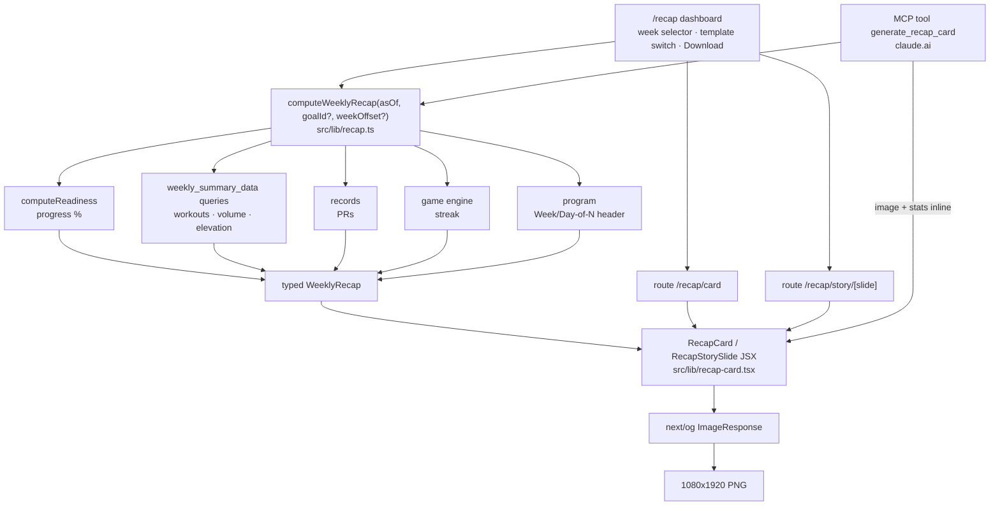
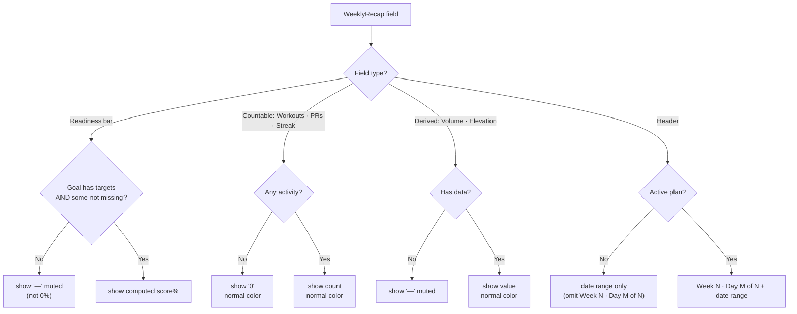
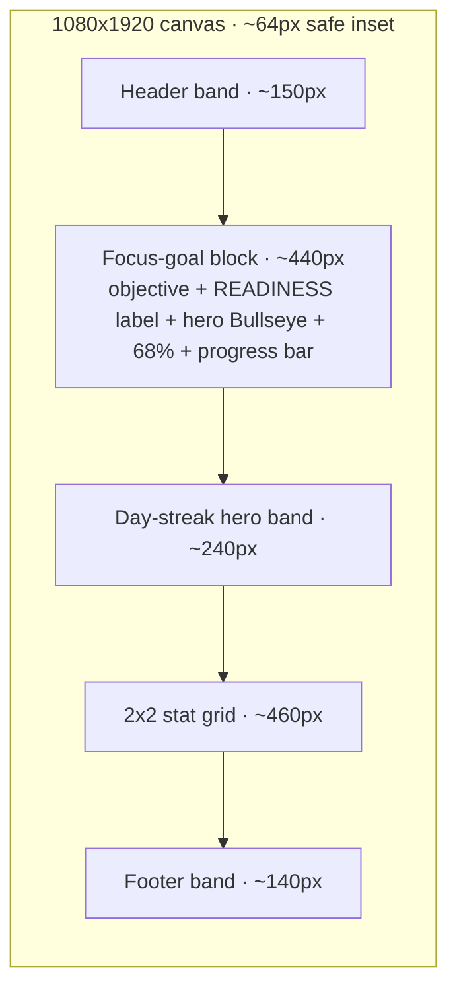

# UX Research — Weekly Recap Card

**Feature:** A share-ready 9:16 (1080×1920) image generated server-side from a week of logged fitness/hiking/goal data, for Instagram feed/Reels + a 3-slide Stories set.
**Profile:** goaldmine · **PRD:** `docs/prds/PRD-weekly-recap-card.md` · **Status:** research complete, feeds PRD §5.
**Pixel artifact:** `docs/ux-research/weekly-recap-card.html` (open in a browser — satori-faithful proxy of both templates + the 3 Stories slides + empty state).
**Ledger:** see §10 here and `docs/ux-research/weekly-recap-card-ledger.md`.

> This is a VISUAL design research task for the exported card artifact (a fixed 1080×1920 canvas rendered via `next/og` ImageResponse), **not** the app's responsive UI. Every visual proposal stays inside the satori rendering subset (flexbox only, inline styles, hardcoded hex, bundled fonts — no grid, no CSS vars, no gradients/shadows/filters/transforms).

---

## 1. Current-State Audit

There is no existing card to audit — this is a greenfield export surface. So the "audit" is the set of hard constraints and data realities the design must satisfy, each verified against the codebase. These are the things that would make the card render broken, look dishonest, or fail to ship if ignored.

| # | Finding | Evidence (`file:line`) | Design impact |
|---|---------|------------------------|---------------|
| A1 | **satori cannot read CSS variables** — the app's whole palette lives as `var(--…)` tokens; the card renderer can't resolve them. | `src/app/globals.css` (`:root` light, `@media`/`[data-theme]` dark); rendering audit of `next/og` (satori subset) | Each template must carry a **frozen hardcoded copy** of the exact hexes. This is the one place the "no hardcoded color literals" invariant is intentionally inverted (documented exception). |
| A2 | **No gradients / box-shadow / text-shadow / filters / CSS transforms / `background-clip:text`** in satori; **no CSS grid**; `position:absolute` is under-documented (risky). | `next/og` satori capability audit | "Energy" and depth must come from solid color blocks, scale, borders, two-tone bands, and negative space — never glow. The 5-stat layout must be flex rows, never a grid. |
| A3 | **Only `Geist-Regular.ttf` (400) ships** (bundled inside `@vercel/og`). No bold, no mono, no serif `.ttf` is in the repo; the app's Geist/DM Serif come from `next/font/google` (CDN, unusable in the OG route). | `node_modules/next/dist/compiled/@vercel/og/Geist-Regular.ttf`; `src/app/layout.tsx:17` (`next/font/google` registration) | To get genuine weight/serif, **bundle additional subset `.ttf`s** (Geist SemiBold, DM Serif Display). satori will NOT synthesize a convincing bold or serif from one cut. This is a build-time spike. |
| A4 | **Readiness is 0–100 and returns score 0 when there is no usable data** — so a naïve render would show a false "0%". | `src/lib/readiness.ts:18` (`ReadinessSnapshot.score` 0–100), `:81` (no-data path) | The bar/number must show **"—" (muted), not "0%"**, when the goal has no targets or all targets are `missing`. |
| A5 | **Program is 12 weeks = 84 days, not 90** — header denominator is dynamic `plan.totalWeeks*7`. | `src/lib/program.ts` (`weekIndex`, day math); `src/lib/program-template.ts` (`totalWeeks: 12`); PRD §4.5 + edge case §6 | Header reads **"Day M of 84"** for the current plan. The literal "90" in PRD prose (§1.2/§5.1) is the value the requirement itself warns against hardcoding — **see the challenge in §10**. |
| A6 | **Goal kind is only `fitness | project`** — there is no rich mountain/strength/running kind field for a per-kind theme. | `prisma/schema.prisma` Goal model (`kind` default `"fitness"`) | The card must be **goal-generic**. Any goal-kind accent must be a single small mark that degrades to gold gracefully — no mountain texture as a primary motif. |
| A7 | **Stats can legitimately be 0 or absent**; volume reaches 5 digits, elevation 5 digits, streak 0–84. | `src/lib/game/engine.ts:516` (volume sum), `:325` (streak); `src/lib/records.ts:544` (PRs); `src/lib/mcp/tools.ts` `weekly_summary_data ~1063` | Cells must never collapse; "0" (countable) reads normal, "—" (no data) reads muted; the grid keeps its footprint regardless. |
| A8 | **Bullseye component fills with `var(--target)`** and so can't be dropped into the OG route as-is; geometry is viewBox `0 0 32 32`, rings r=15/11/7/3. | `src/components/Bullseye.tsx` (`renderRings`, `progressToRings:135`) | Port the ring geometry to a **hex-literal div-stack** (concentric `borderRadius:9999px` divs) — guaranteed to render; reuse the canonical proportions. |

---

## 2. Chosen Direction

**"Bullseye Hero."** The brand's canonical progress glyph is the literal hero of the card: a large concentric Bullseye whose rings fill toward the focus goal's **readiness %**, with the % set in big display type beside it and the named objective above. This is the most on-brand choice (the Bullseye doing its literal job), the strongest 0.5-second Instagram thumbnail, and the one that frames the week as **trajectory toward a named goal** rather than a braggy output number — exactly the honest, disciplined-growth ethos the account needs. It also maps cleanly to the product thesis's "motion reserved for genuine completion moments": the filling rings *are* the completion moment, frozen into a still.

Grafted in from the runners-up: from **"Field Report"** the right-aligned, label-under-value stat discipline and the editorial serif treatment (which becomes **Template B**); from **"Split Band"** the two-tone lifted-surface technique used for the streak and footer bands (faking depth without shadows); from **"Stat-Forward"** the insight that the streak is the most emotionally resonant number, which is why **Day streak is promoted to a full-width hero band** above a 2×2 of the other four stats (Workouts / Volume / PRs / Elevation). The card-level hero (goal Bullseye) and the grid-level hero (streak) reinforce each other without competing.

**Vertical budget (within 1080×1920, ~64px safe inset):** Header ~150 → Focus-goal block ~440 (objective + READINESS label + hero Bullseye + 68% + bar) → Day-streak hero band ~240 → 2×2 stat grid ~460 → Footer ~140. All px provisional — see §9.

Two style templates ship (PRD §3.2 requires ≥2; the both-light-and-dark invariant is satisfied by shipping one of each):
- **Template A — "Coal"** (dark, bold; default for IG — high-contrast coal survives compression best).
- **Template B — "Parchment"** (light, minimal; editorial serif, negative space).

---

## 3. Phase-A Options (ASCII)

Four competing layout directions were drawn and narrowed to Direction 1. Summary; full ASCII retained for the record.

| Dir | Hero | Bullseye role | Stat layout | Best when |
|----|------|---------------|-------------|-----------|
| **1 Bullseye Hero** ✅ | goal Bullseye + readiness % | dominant hero | streak band + 2×2 | default share; readiness is the story |
| 2 Field Report | serif goal headline | small stamp | 5 ledger rows | sparse/editorial weeks → grafted into Template B |
| 3 Split Band | two-tone split | mid, in color block | 3+2 lower tone | bold figure/ground → band technique grafted in |
| 4 Stat-Forward | the numbers | corner tick | big 2/2/1 grid | output-heavy weeks |

<details>
<summary>Full ASCII — Direction 1 "Bullseye Hero" (front-runner), strong week + empty state</summary>

```
╔══════════════════════════════════════╗
║  WEEK 3  ·  DAY 19 OF 84              ║ ← Header band ~150px
╠══════════════════════════════════════╣
║   Summit Mt. Elbert via              ║ ← Goal objective (wraps, no ellipsis)
║   Black Cloud Trail                  ║
║   READINESS                          ║
║   68%        ◎ (rings fill to 68%)   ║ ← Hero: big % + Bullseye (flex row)
║   ████████████████░░░░░░░  68%       ║ ← progress bar (solid fill, no gradient)
╠══════════════════════════════════════╣
║   47          DAY STREAK             ║ ← Day-streak hero band ~240px (lifted surface)
╠══════════════════════════════════════╣
║   12          │      48,300 lb       ║
║   WORKOUTS    │      VOLUME          ║ ← 2x2 grid ~460px (flex rows, flex:1 1 0)
║───────────────┼──────────────────────║
║   4           │      6,240 ft        ║
║   PRs         │      ELEVATION       ║
╠══════════════════════════════════════╣
║  ◎ GOALDMINE              @gabe      ║ ← Footer ~140px
╚══════════════════════════════════════╝

EMPTY STATE (no targets / no data): readiness "—" muted, bar empty, hero "—";
WORKOUTS 0 (normal), VOLUME "—" (muted), PRs 0 (normal), ELEVATION "—" (muted),
DAY STREAK 0 (normal). Cells never collapse — values swap, layout is fixed.
"0" = countable zero (normal color); "—" = no data (muted).
```
</details>

The other three directions (Field Report ledger rows, Split Band two-tone, Stat-Forward 2/2/1) were considered and their best ideas grafted into the chosen direction and Template B as noted in §2.

---

## 4. Phase-B Technical

### 4.1 Render pipeline (both entry points share one card module)



### 4.2 Zero-state value-display logic (the rule that keeps the card from looking broken)



### 4.3 Card layout zones (vertical budget)



### 4.4 Pixel artifact

`docs/ux-research/weekly-recap-card.html` — a self-contained, satori-faithful proxy (literal hex, flexbox-only, Bullseye as a `borderRadius:9999px` div-stack). It renders, scaled to 0.25: Template A (Coal) full card, Template B (Parchment) full card, Template A empty state, and Stories slides 1/2/3. Open it in a browser to evaluate before any pixels are written in code.

### 4.5 The two templates — exact spec

These are the production values the feature-dev Architect transcribes into JSX inline styles. **All px provisional (§9).**

**Bullseye div-stack** (port of `Bullseye.tsx` geometry; diameters scale from canonical r=15/11/7/3). For a 300px hero: ring0 300 → ring1 225 → ring2 150 → ring3 75 (each a flex-centered parent of the next). Filled rings alternate target/target-fg; the unfilled/no-data state is a single outer shell ring (`border` in muted, transparent fill).

#### Template A — "Coal" (dark, bold) — full-bleed `#0F0B07`, no inner border

| Role | Hex | | Element | Font | px | Color | Contrast |
|------|-----|-|---------|------|----|-------|----------|
| page bg | `#0F0B07` | | header counter | Geist SemiBold 600, UPPER +3 | 34 | `#D4A437` | 8.56:1 |
| lifted surface (streak/footer band) | `#1A130C` | | date range | Geist Regular | 30 | `#9C8866` | 5.72:1 |
| hairline / bar track | `#3A2E1F` | | goal objective | Geist SemiBold 600, lh 1.05 | 64 | `#F4E9D4` | 16.29:1 |
| primary text | `#F4E9D4` | | **hero readiness %** | Geist Bold/SemiBold, ls −4 | **300** | `#D4A437` | 8.56:1 |
| muted / labels | `#9C8866` | | READINESS label | Geist Regular, UPPER +3 | 30 | `#9C8866` | 5.72:1 |
| accent / bar fill / hero # | `#D4A437` | | **streak numeral** | Geist Bold, ls −4 | 140 | `#D4A437` | 8.56:1 |
| Bullseye rings out→in | `#C0392B`/`#FFFFFF`/`#C0392B`/`#FFFFFF` | | stat value (×4) | Geist SemiBold 600 | 88 | `#F4E9D4` | 16.29:1 |
| unfilled shell ring | `#9C8866` | | stat label (×4) | Geist Regular, UPPER +3 | 30 | `#9C8866` | 5.72:1 |
| success | `#7FA45C` | | footer wordmark | Geist SemiBold 600 | 40 | `#F4E9D4` | on `#1A130C` ✓ |

Bar: track height **28**, radius **14**, bg `#3A2E1F`; fill width = `pct`, radius 14, bg `#D4A437`. Hero Bullseye **300px**. Header micro-Bullseye **44px**. Footer mark Bullseye **48px** + `GOALDMINE` + `@gabe`. Streak + footer sit on lifted `#1A130C` rounded bands (the depth technique). **Crimson `#C0392B` is fill-only — never body text** (3.6:1, fails); text on crimson is `#FFFFFF` (5.44:1).

#### Template B — "Parchment" (light, minimal) — full-bleed `#FAF3E3`, generous air

| Role | Hex | | Element | Font | px | Color | Contrast |
|------|-----|-|---------|------|----|-------|----------|
| bg | `#FAF3E3` | | header counter | Geist Regular, UPPER +3 | 30 | `#7A5E3A` | 5.44:1 |
| inset surface (optional) | `#FFFBF0` | | **goal objective** | **DM Serif Display 400** | **80** | `#1F1408` | 16.35:1 |
| hairline / track / dividers | `#D9C8A2` | | **hero readiness %** | DM Serif Display 400 | **150** | `#1F1408` | 16.35:1 |
| primary text | `#1F1408` | | READINESS label | Geist Regular, UPPER +3 | 28 | `#7A5E3A` | 5.44:1 |
| muted / labels | `#7A5E3A` | | streak numeral | DM Serif Display 400 | 140 | `#1F1408` | 16.35:1 |
| gold hairline / bar fill | `#8A6212` | | stat value (×4) | DM Serif Display 400 | 68 | `#1F1408` | 16.35:1 |
| Bullseye rings out→in | `#A82A1F`/`#FFFBF0`/`#A82A1F`/`#FFFBF0` | | stat label (×4) | Geist Regular, UPPER +3 | 26 | `#7A5E3A` | 5.44:1 |
| unfilled shell ring | `#7A5E3A` | | footer wordmark | DM Serif Display 400 | 40 | `#1F1408` | 16.35:1 |
| success | `#4E6B36` | | warning **text** (if used) | use `#9C5F14` | — | `#9C5F14` | 4.68:1 |

Bar: track height **12**, radius **6**, bg `#D9C8A2`; fill `#8A6212` (no bar marker — minimal). Hero Bullseye **300–340px**. Streak uses **hairline rules, no fill** (the minimal move); footer is a single top gold hairline, no band. Gold `#8A6212` on cream is **4.96:1 — AA-passing but tight; reserve gold for ≥30px / large display + fills, never small stat text** (small text uses `#1F1408`, ~16:1). Goal-kind accent = one 14×14 filled square left of the objective (`fitness`→rust, `project`→gold, unknown→gold).

#### Typography decision (≤500KB ImageResponse budget)

Bundle three subset `.ttf`s (~270KB total) under `public/fonts/` or `src/app/recap/fonts/`, read via `fs`/`fetch`, passed to `ImageResponse({ fonts: [...] })`:
1. `Geist-Regular.ttf` (400) — labels, dates, body, footer.
2. `Geist-SemiBold.ttf` (600) — Template A counter/objective/values/hero/streak.
3. `DMSerifDisplay-Regular.ttf` (400) — Template B headline + all numerals (editorial gravity; already an app brand face).
Subset each to Latin-basic + digits + `· % — / ,` via glyphhanger/fonttools → ~20–40KB each. Source from Google Fonts (the `geist` npm pkg ships `.woff2`, not `.ttf`). **Fallback if only Geist-Regular ships:** render everything in Geist-Regular, build hierarchy from size + color + letter-spacing + UPPERCASE, push Template A hero to ~320px, drop the serif. All stated contrast ratios still hold (they depend on color, not weight).

### 4.6 Stories — one parameterized component, 3 slides

`RecapStorySlide({ slide, recap, template })` with a constant skeleton (coal column, safe gutters, footer) and a `switch(slide)` middle region:
- **Slide 1 — Cover ("the why"):** header + goal objective + hero Bullseye + readiness % + bar. Opens the loop. Must stand alone (most viewers see only slide 1). Copy: `WEEK 3 · DAY 19 OF 84` / objective / `READINESS` / `68%`.
- **Slide 2 — The Numbers ("the proof"):** `THIS WEEK IN NUMBERS` + streak hero band + enlarged 2×2 grid (numbers ~110–130px). Pays off the loop; densest slide by design.
- **Slide 3 — Closing ("the commitment"):** big centered Bullseye + `47 DAY STREAK` + `On to Week 4.` + footer. Re-opens the loop for next week (the cadence engine of a weekly-recap account).

---

## 5. Animation Storyboard

The export is a **still PNG — there is no runtime animation in the artifact** (correct per product thesis: motion is CSS-only and reserved for genuine completion moments inside the app, never baked into a shareable image). The "motion" is conceptual and frozen:

- The hero Bullseye is the brand's once-per-day `bullseye-pop` completion glyph (`globals.css:100`, 0.6→1.08→1.0 over 320ms) captured **mid-celebration as a still** — the filled rings *are* the frozen payoff frame.
- The progress bar is a static fill at `pct`; there is no animated fill in the export.
- **In the `/recap` dashboard UI** (separate from the card): the preview-image swap on week/template change should be a plain CSS opacity transition honoring `prefers-reduced-motion` — no animation library (invariant). That is app UI, out of scope for the card spec.

No `gantt` is included: there is no tween choreography to time. If the dashboard later animates the live Bullseye preview, reuse the existing `bullseye-pop` keyframe verbatim rather than inventing timing.

---

## 6. Behavioral Psychology Principles (core)

| Principle | Card element | Rationale |
|-----------|--------------|-----------|
| **Goal-gradient effect** (effort accelerates as the goal nears) | Hero Bullseye fill + readiness % + bar | A visible, named "% to the goal" makes remaining distance concrete and anchors the whole card to *trajectory*, not output. The closer the fill, the stronger the pull to keep working/posting. |
| **Streak / loss-aversion** (a streak is an asset you fear losing) | Day-streak hero band | Promoting "Day 47" turns consistency into a tangible thing you don't want to reset — the strongest weekly re-engagement hook. |
| **Endowed-progress** (commit harder to progress already "banked") | Header "Day 19 of 84" counter | Framing the week as day 19 of an *owned* 84-day program makes the prior 18 days feel banked — quitting forfeits invested progress. |
| **Completion bias / peak-moment salience** | PRs stat + the filled Bullseye | PRs are discrete "beat my best" wins; the filled rings echo the app's once-per-day completion celebration, keeping that earned-payoff energy on the card. |
| **Social proof of consistency** (identity signaling to an audience) | Footer handle + visible streak | A public card is a commitment device; handle + streak broadcast "disciplined person," reinforcing the behavior through audience accountability. |
| **Unit bias / chunking** (rounded, countable units feel like real work) | Stat formatting (`48,300 lb`, comma-grouped, whole numbers) | Clean countable units read as real work at a glance without forcing precision-parsing, and avoid the abstract-number trap that makes volume feel braggy. |

---

## 7. Implementation Scope

Mirrors PRD §4.4 (no schema change, read-only). Files to create / modify:

- **`src/lib/recap.ts`** (new) — `computeWeeklyRecap(asOf, { goalId?, weekOffset? })` → typed `WeeklyRecap`. Reuses `computeReadiness` (`@/lib/readiness`), week queries (mirror `weekly_summary_data` in `src/lib/mcp/tools.ts ~1063`), PRs (`@/lib/records`), streak (`@/lib/game/engine` `getGameState().streak`), program header (`@/lib/program`). All date math via `@/lib/calendar` (USER_TZ).
- **`src/lib/recap-card.tsx`** (new) — pure satori-safe JSX: `RecapCard({ recap, template })` + `RecapStorySlide({ slide, recap, template })`. Inline styles only, hardcoded hex per §4.5, Bullseye as div-stack, flex-only. Shared by route handlers **and** the MCP tool (single source of card markup). Exports a `Template = "coal" | "parchment"` enum (use these ids in the MCP `template` zod enum, PRD §4.2).
- **`src/app/recap/card/route.tsx`** (new) — `runtime = "nodejs"`; GET `?weekOffset&goalId&template` → 1080×1920 PNG via `ImageResponse` with bundled fonts.
- **`src/app/recap/story/[slide]/route.tsx`** (new) — GET slide `1|2|3` → 1080×1920 PNG.
- **`src/app/recap/page.tsx`** (new, server) + **`src/components/RecapClient.tsx`** (new, `"use client"`) — preview + week selector + template switcher + two `<a download>` buttons (≥44px tap targets, labeled, visible focus rings).
- **`src/app/recap/fonts/*.ttf`** (new) — bundled subset `Geist-Regular`, `Geist-SemiBold`, `DMSerifDisplay-Regular`.
- **`src/lib/mcp/tools.ts`** — register `generate_recap_card`; add an image-aware result helper (`imageResult(png, stats)`) alongside `safe()` in `tool-helpers.ts`.
- **Navigation** — a "Share recap" affordance on the Progress hub; deep-linkable `/recap` (not in the full 5-slot `BottomNav`).

**Suggested testIDs / identifiers:** `recap-preview`, `recap-week-prev`, `recap-week-next`, `recap-template-toggle`, `recap-download-card`, `recap-download-stories`; card zones `recap-header`, `recap-goal`, `recap-readiness-bar`, `recap-streak`, `recap-stat-{workouts|volume|prs|elevation|streak}`, `recap-footer`.

**Complexity:** Medium. The risk is concentrated in two build-time spikes (fonts; satori SVG/`` behavior), not in layout. Layout is deliberately pure-flexbox to de-risk satori.

---

## 8. Accessibility

- **Card text contrast ≥ 4.5:1 (both templates)** — verified per text/bg pair in §4.5. Template A on `#0F0B07`: foreground 16.29, gold 8.56, muted 5.72, white-on-crimson 5.44 (crimson is fill-only, excluded as text). Template B on `#FAF3E3`: ink 16.35, muted 5.44, gold 4.96 (tight — large/fill use only), cream-on-rust ring 7.54, rust accent word 6.30, success 5.46, warning **text** uses adjusted `#9C5F14` 4.68. **Every specified text pair ≥ 4.5:1.**
- **Both `two_medium_axis` sides shown** — Template A = dark/coal, Template B = light/cream (the invariant's both-sides requirement, realized as two shipped templates).
- **Non-text contrast** — bar fill vs track and ring colors clear ≥ 3:1; the unfilled Bullseye uses a muted shell ring (`#9C8866` / `#7A5E3A`) so "not done" reads without relying on color alone.
- **Goal-kind accent is redundant** — it's a tiny supplemental mark, never the only carrier of meaning (mirrors `ForeignGoalMarker`'s opacity+outline redundancy in `MarkerIcon.tsx`).
- **`/recap` controls** — labeled buttons, visible focus rings, ≥44px tap targets, real `<a download>` with discernible names (PRD §5.4).
- **Reduced motion** — only the dashboard preview may transition; honor `prefers-reduced-motion`. The card itself is static, so it is inherently reduced-motion-safe.

---

## 9. ⚠ Provisional / Verify-Visually list

Everything here must be confirmed on a real rendered 1080×1920 PNG (and at IG thumbnail scale) before shipping. These are the rows future audits care about most.

| Tag | Item | Why provisional |
|-----|------|-----------------|
| tuning⚠ | **All px sizes** (hero Bullseye 300; hero/streak numerals 140–300; stat values 68–88; vertical budget 150/440/240/460/140; paddings/gaps 32–96) | Type scale and balance only resolve on a real render at full and thumbnail scale; bias bolder if numbers read soft at IG scroll-past size. |
| tuning⚠ | **64px safe inset / IG Story chrome gutters** (top ~140, bottom ~116 proposed) | Verify no critical glyph enters IG's reply/profile chrome zones on a real device. |
| tuning⚠ | **Template B gold `#8A6212` on cream = ~4.96:1** | AA-passing but tight; confirm it is only ever used at ≥30px or as a fill, never small text. |
| tuning⚠ | **Bar fill end-cap rounding at very low %** | A 2–5% fill on a rounded track may render as a sliver/lozenge; verify the `—`/empty and low-value states look intentional. |
| decoration⚠ | **Progress-bar Bullseye "marker" at the fill head (Template A option)** | A bit of ornament beyond the core bar; the HTML mock dropped it. Justify against the plain bar before adding; verify it reads (not crushes) at scale. |
| decoration⚠ | **Treasure-chest footer logo vs. a plain 48px Bullseye mark** | The full `Logo`/`icon.svg` uses an SVG `rotate` (lid) and `var()` fills — both problematic in the OG path. Default to the simple Bullseye mark; only build an OG-safe flattened chest if it earns its place. Verify visually. |
| decoration⚠ | **Inline `<svg>` Bullseye vs the div-stack fallback** | div-stack is the guaranteed-render primary; inline SVG is a v2 nicety only — verify SVG renders in this satori version before preferring it. |
| tuning⚠ | **Bundled-font weights/serif actually render** (Geist SemiBold mapping; DM Serif Display at 80–150px with no tofu) | satori matches by name+weight and won't synthesize; confirm each `.ttf` loads and the total stays <500KB after subsetting. |
| decision⚠ | **Header denominator "of 84" vs PRD prose "of 90"** | See §10 challenge — needs sign-off; the value must be dynamic regardless. |

---

## 10. Recommendation Ledger

Stable IDs, assigned once. `Status` starts `proposed`; the implementing PR ticks each to `shipped`/`reworked`/`dropped` with a SHA / `file:line` / short reason. Mirrored in `docs/ux-research/weekly-recap-card-ledger.md`.

| ID | Recommendation | Type | Status | Evidence |
|----|----------------|------|--------|----------|
| UXR-recap-01 | "Bullseye Hero" chosen direction: filled Bullseye + readiness % as the card hero | layout | proposed | |
| UXR-recap-02 | Promote Day streak to a full-width hero band above a 2×2 of the other four stats | layout | proposed | |
| UXR-recap-03 | Vertical budget 150 / 440 / 240 / 460 / 140 within 1080×1920, ~64px inset | layout | proposed | |
| UXR-recap-04 | 5-stat grid as flex rows (`flex:1 1 0`), never CSS grid | component | proposed | |
| UXR-recap-05 | Progress bar = solid track + solid fill, rounded; % beside (not inside) the bar | component | proposed | |
| UXR-recap-06 | Bullseye rendered as concentric `borderRadius:9999px` div-stack (hex-literal port of `Bullseye.tsx`) | component | proposed | |
| UXR-recap-07 | Template A "Coal" exact palette + type scale (§4.5) | copy/layout | proposed | |
| UXR-recap-08 | Template B "Parchment" exact palette + type scale (§4.5) | copy/layout | proposed | |
| UXR-recap-09 | Empty/zero rule: "0" countable = normal color; "—" no-data = muted; cells never collapse | a11y | proposed | |
| UXR-recap-10 | Readiness shows "—" not "0%" when no targets / all missing | component | proposed | |
| UXR-recap-11 | Header omits "Week/Day of N" and shows date range only when no active plan | component | proposed | |
| UXR-recap-12 | Goal-generic single small kind accent (fitness→rust, project→gold, unknown→gold), degrades gracefully | component | proposed | |
| UXR-recap-13 | Stories: one `RecapStorySlide` component, slides = cover / numbers / closing | layout | proposed | |
| UXR-recap-14 | Copy: one-word stat labels (`Workouts/Volume/PRs/Elevation`), `Day streak`; closing `On to Week 4.` | copy | proposed | |
| UXR-recap-15 | Footer = small Bullseye mark + `GOALDMINE` + `@gabe`; no tagline | copy/layout | proposed | |
| UXR-recap-16 | Two-tone lifted-surface bands (`#1A130C`) for depth instead of shadows/gradients | layout | proposed | |
| UXR-recap-17 | All px sizes are provisional — verify on real 1080×1920 + thumbnail scale, bias bolder | tuning⚠ | proposed | |
| UXR-recap-18 | Safe inset 64px + IG Story chrome gutters — verify on device | tuning⚠ | proposed | |
| UXR-recap-19 | Template B gold `#8A6212` on cream (~4.96:1) — large/fill only, never small text | tuning⚠ | proposed | |
| UXR-recap-20 | Low-% bar fill end-cap — verify the sliver/empty states read intentionally | tuning⚠ | proposed | |
| UXR-recap-21 | Bundled fonts (Geist Regular + SemiBold + DM Serif Display, subset <500KB) actually render in satori | tuning⚠ | proposed | |
| UXR-recap-22 | Progress-bar Bullseye fill-head marker (Template A) — justify vs plain bar before adding | decoration⚠ | proposed | |
| UXR-recap-23 | Footer treasure-chest logo vs plain Bullseye mark — default to Bullseye; OG-safe flattened chest only if earned | decoration⚠ | proposed | |
| UXR-recap-24 | Inline `<svg>` Bullseye is a v2 nicety; div-stack is primary — verify SVG renders before preferring | decoration⚠ | proposed | |
| UXR-recap-25 | **Challenge (needs sign-off):** PRD prose says "Day 19 of 90" but the active plan is 12wk = **84 days** (`program-template.ts totalWeeks:12`; PRD §4.5 `totalProgramDays = totalWeeks*7`). The denominator MUST be dynamic; mockups use **84**. Confirm intended denominator. | decision⚠ | proposed | |
| UXR-recap-26 | Card is a static PNG — no runtime animation baked in; dashboard preview swap honors `prefers-reduced-motion`, CSS-only | animation | proposed | |

